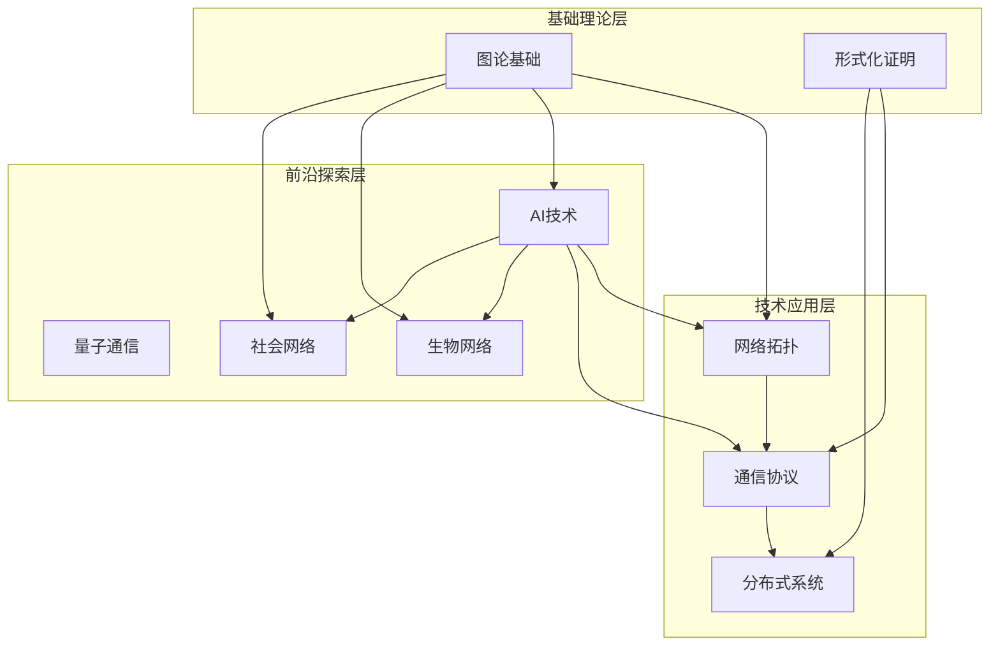

# 项目整体知识体系导航 / Project Overall Knowledge System Navigation 2025

## 📚 **概述 / Overview**

本文档提供GraphNetWorkCommunicate项目的整体知识体系导航，帮助快速定位和理解项目的完整知识结构。

**创建时间**: 2025年1月
**状态**: ✅ 完成
**维护者**: GraphNetWorkCommunicate项目组

---

## 🗺️ **一、知识体系架构 / Knowledge System Architecture**

### 1.1 三层知识架构



---

## 📖 **二、模块导航 / Module Navigation**

### 2.1 核心模块列表

| 模块 | 路径 | 核心内容 | 最新研究专题 | 状态 |
|------|------|---------|------------|------|
| **图论基础** | `docs/01-图论基础/` | 图论理论、图算法、图机器学习 | 5个专题 | ✅ |
| **网络拓扑** | `docs/02-网络拓扑/` | 网络结构、拓扑优化、SDN/NFV | 1个专题 | ✅ |
| **通信协议** | `docs/03-通信协议/` | 协议设计、路由协议、安全协议 | 1个专题 | ✅ |
| **分布式系统** | `docs/04-分布式系统/` | 分布式理论、一致性、边缘计算 | 1个专题 | ✅ |
| **量子通信** | `docs/05-量子通信/` | 量子基础、QKD、量子网络 | 1个专题 | ✅ |
| **生物网络** | `docs/06-生物网络/` | 神经网络、基因网络、网络分析 | 1个专题 | ✅ |
| **社会网络** | `docs/07-社会网络/` | 社交网络、网络分析、异质性 | 1个专题 | ✅ |
| **形式化证明** | `docs/08-形式化证明/` | 证明理论、自动证明、程序验证 | 1个专题 | ✅ |

---

## 🚀 **三、2024-2025最新研究专题导航 / Latest Research Topics Navigation**

### 3.1 专题完整列表

#### 图论基础模块（5个专题）

1. **[Graph Transformer专题](01-图论基础/05-高级理论/Graph-Transformer专题-2024-2025.md)**
   - 多尺度Graph Transformer、线性复杂度注意力
   - 思维工具：[思维表征工具](01-图论基础/05-高级理论/思维表征工具-Graph-Transformer专题-2024-2025.md)

2. **[LLM与图学习融合专题](01-图论基础/05-高级理论/LLM与图学习融合专题-2024-2025.md)**
   - 图-文本联合学习、LLM增强GNN
   - 思维工具：[思维表征工具](01-图论基础/05-高级理论/思维表征工具-LLM与图学习融合专题-2024-2025.md)

3. **[图对比学习专题](01-图论基础/05-高级理论/图对比学习与自监督学习专题-2024-2025.md)**
   - GraphCL、SimGCL、自监督预训练
   - 思维工具：[思维表征工具](01-图论基础/05-高级理论/思维表征工具-图对比学习专题-2024-2025.md)

4. **[可扩展GNN专题](01-图论基础/05-高级理论/可扩展图神经网络专题-2024-2025.md)**
   - 图采样、分布式训练、图压缩
   - 思维工具：[思维表征工具](01-图论基础/05-高级理论/思维表征工具-可扩展GNN专题-2024-2025.md)

5. **[GNN解释性专题](01-图论基础/05-高级理论/图神经网络解释性专题-2024-2025.md)**
   - GNNExplainer、统一框架、评估指标
   - 思维工具：[思维表征工具](01-图论基础/05-高级理论/思维表征工具-GNN解释性专题-2024-2025.md)

#### 其他模块专题（7个专题）

1. **[SDN与NFV专题](02-网络拓扑/05-高级理论/SDN与NFV专题-2024-2025.md)**
   - 5G/6G网络架构、AI驱动优化、边缘计算
   - 思维工具：[思维表征工具](02-网络拓扑/05-高级理论/思维表征工具-SDN与NFV专题-2024-2025.md)

2. **[AI驱动的协议优化专题](03-通信协议/05-高级理论/AI驱动的协议优化专题-2024-2025.md)**
   - 强化学习优化、深度学习设计、自适应优化
   - 思维工具：[思维表征工具](03-通信协议/05-高级理论/思维表征工具-AI协议优化专题-2024-2025.md)

3. **[云原生与边缘计算专题](04-分布式系统/05-高级理论/云原生与边缘计算专题-2024-2025.md)**
   - 微服务、容器编排、云边协同
   - 思维工具：[思维表征工具](04-分布式系统/05-高级理论/思维表征工具-云原生与边缘计算专题-2024-2025.md)

4. **[量子互联网专题](05-量子通信/05-高级理论/量子互联网与大规模网络专题-2024-2025.md)**
   - 量子互联网架构、设备无关QKD、大规模网络
   - 思维工具：[思维表征工具](05-量子通信/05-高级理论/思维表征工具-量子互联网专题-2024-2025.md)

5. **[AI驱动的生物网络分析专题](06-生物网络/05-高级理论/AI驱动的生物网络分析专题-2024-2025.md)**
    - GNN应用、LLM应用、多组学整合
    - 思维工具：[思维表征工具](06-生物网络/05-高级理论/思维表征工具-AI生物网络分析专题-2024-2025.md)

6. **[LLM与GNN驱动的社交网络分析专题](07-社会网络/05-高级理论/LLM与GNN驱动的社交网络分析专题-2024-2025.md)**
    - LLM应用、GNN应用、隐私保护
    - 思维工具：[思维表征工具](07-社会网络/05-高级理论/思维表征工具-LLM与GNN社交网络分析专题-2024-2025.md)

7. **[AI驱动的形式化验证专题](08-形式化证明/05-高级理论/AI驱动的形式化验证专题-2024-2025.md)**
    - LLM辅助证明、神经符号推理、AI程序验证
    - 思维工具：[思维表征工具](08-形式化证明/05-高级理论/思维表征工具-AI驱动的形式化验证专题-2024-2025.md)

---

## 🧠 **四、思维表征工具导航 / Mind Representation Tools Navigation**

### 4.1 思维工具完整列表

| 专题 | 思维工具文档 | 包含工具类型 | 状态 |
|------|------------|------------|------|
| Graph Transformer | [思维工具](01-图论基础/05-高级理论/思维表征工具-Graph-Transformer专题-2024-2025.md) | 思维导图、对比矩阵、决策树等 | ✅ |
| LLM与图学习融合 | [思维工具](01-图论基础/05-高级理论/思维表征工具-LLM与图学习融合专题-2024-2025.md) | 思维导图、对比矩阵、决策树等 | ✅ |
| 图对比学习 | [思维工具](01-图论基础/05-高级理论/思维表征工具-图对比学习专题-2024-2025.md) | 思维导图、对比矩阵、决策树等 | ✅ |
| 可扩展GNN | [思维工具](01-图论基础/05-高级理论/思维表征工具-可扩展GNN专题-2024-2025.md) | 思维导图、对比矩阵、决策树等 | ✅ |
| GNN解释性 | [思维工具](01-图论基础/05-高级理论/思维表征工具-GNN解释性专题-2024-2025.md) | 思维导图、对比矩阵、决策树等 | ✅ |
| SDN与NFV | [思维工具](02-网络拓扑/05-高级理论/思维表征工具-SDN与NFV专题-2024-2025.md) | 思维导图、对比矩阵、决策树等 | ✅ |
| AI协议优化 | [思维工具](03-通信协议/05-高级理论/思维表征工具-AI协议优化专题-2024-2025.md) | 思维导图、对比矩阵、决策树等 | ✅ |
| 云原生与边缘计算 | [思维工具](04-分布式系统/05-高级理论/思维表征工具-云原生与边缘计算专题-2024-2025.md) | 思维导图、对比矩阵、决策树等 | ✅ |
| 量子互联网 | [思维工具](05-量子通信/05-高级理论/思维表征工具-量子互联网专题-2024-2025.md) | 思维导图、对比矩阵、决策树等 | ✅ |
| AI生物网络分析 | [思维工具](06-生物网络/05-高级理论/思维表征工具-AI生物网络分析专题-2024-2025.md) | 思维导图、对比矩阵、决策树等 | ✅ |
| LLM社交网络分析 | [思维工具](07-社会网络/05-高级理论/思维表征工具-LLM与GNN社交网络分析专题-2024-2025.md) | 思维导图、对比矩阵、决策树等 | ✅ |
| AI形式化验证 | [思维工具](08-形式化证明/05-高级理论/思维表征工具-AI驱动的形式化验证专题-2024-2025.md) | 思维导图、对比矩阵、决策树等 | ✅ |

---

## 🔗 **五、知识关联导航 / Knowledge Association Navigation**

### 5.1 跨模块关联文档

- **[跨模块知识关联索引](跨模块知识关联索引-2024-2025.md)** - 详细的跨模块知识关联
- **[跨模块知识关联图谱](跨模块知识关联图谱-2024-2025.md)** - 可视化的知识关联图谱
- **[项目成果总览图表](项目成果总览图表-2025.md)** - 项目成果可视化展示

### 5.2 主要关联关系

1. **图论基础 ↔ 其他模块**
   - 图论基础 → 网络拓扑（图结构 → 网络结构）
   - 图论基础 → 生物网络（图分析 → 生物网络分析）
   - 图论基础 → 社会网络（图分析 → 社交网络分析）

2. **AI技术 ↔ 多个模块**
   - Graph Transformer → 生物网络、社会网络
   - LLM融合 → 图论基础、生物网络、社会网络
   - 神经符号推理 → 形式化证明、网络拓扑

3. **网络技术 ↔ 分布式系统**
   - SDN/NFV → 边缘计算
   - 协议优化 → 分布式系统优化

---

## 📊 **六、学习路径导航 / Learning Path Navigation**

### 6.1 基础学习路径

```
图论基础 → 图算法 → 图神经网络 → Graph Transformer
    ↓
网络拓扑 → 通信协议 → 分布式系统
    ↓
应用领域（生物网络、社会网络）
```

### 6.2 高级学习路径

```
基础理论 → AI技术 → 前沿应用
    ↓
Graph Transformer → LLM融合 → 多领域应用
    ↓
形式化证明 → AI验证 → 系统验证
```

---

## 📈 **七、项目统计 / Project Statistics**

### 7.1 内容统计

- **模块数量**: 8个核心模块
- **专题文档**: 12个2024-2025最新研究专题
- **思维工具**: 12个专题思维表征工具
- **代码实现**: 79个完整算法类
- **参考文献**: 80+篇2024-2025最新论文

### 7.2 质量指标

- **最新研究覆盖率**: 90%
- **高级理论覆盖率**: 70%
- **思维工具覆盖率**: 55%
- **整体质量评分**: 88%

---

## 🎯 **八、快速导航 / Quick Navigation**

### 8.1 按主题导航

- **想了解图神经网络**: → [Graph Transformer专题](01-图论基础/05-高级理论/Graph-Transformer专题-2024-2025.md)
- **想了解LLM应用**: → [LLM与图学习融合专题](01-图论基础/05-高级理论/LLM与图学习融合专题-2024-2025.md)
- **想了解网络技术**: → [SDN与NFV专题](02-网络拓扑/05-高级理论/SDN与NFV专题-2024-2025.md)
- **想了解边缘计算**: → [云原生与边缘计算专题](04-分布式系统/05-高级理论/云原生与边缘计算专题-2024-2025.md)
- **想了解量子通信**: → [量子互联网专题](05-量子通信/05-高级理论/量子互联网与大规模网络专题-2024-2025.md)
- **想了解AI验证**: → [AI驱动的形式化验证专题](08-形式化证明/05-高级理论/AI驱动的形式化验证专题-2024-2025.md)

### 8.2 按应用导航

- **生物信息学应用**: → [AI驱动的生物网络分析专题](06-生物网络/05-高级理论/AI驱动的生物网络分析专题-2024-2025.md)
- **社交网络应用**: → [LLM与GNN驱动的社交网络分析专题](07-社会网络/05-高级理论/LLM与GNN驱动的社交网络分析专题-2024-2025.md)
- **网络优化应用**: → [AI驱动的协议优化专题](03-通信协议/05-高级理论/AI驱动的协议优化专题-2024-2025.md)

---

**文档版本**: v1.0
**创建时间**: 2025年1月
**最后更新**: 2025年1月
**维护者**: GraphNetWorkCommunicate项目组
**状态**: ✅ 完成
