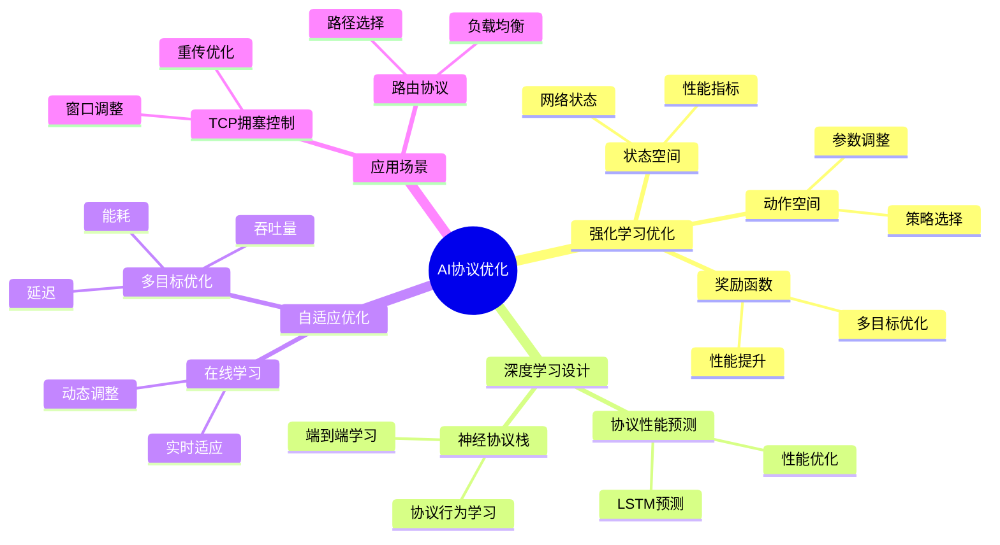
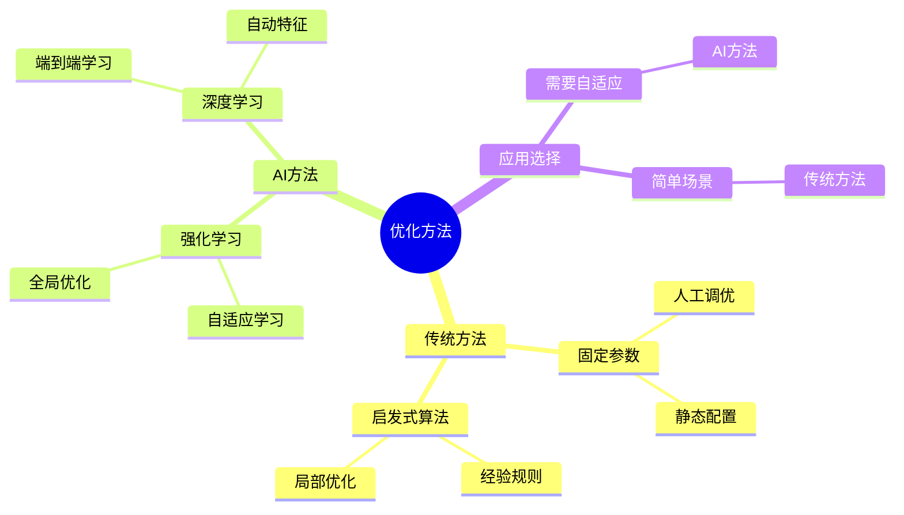
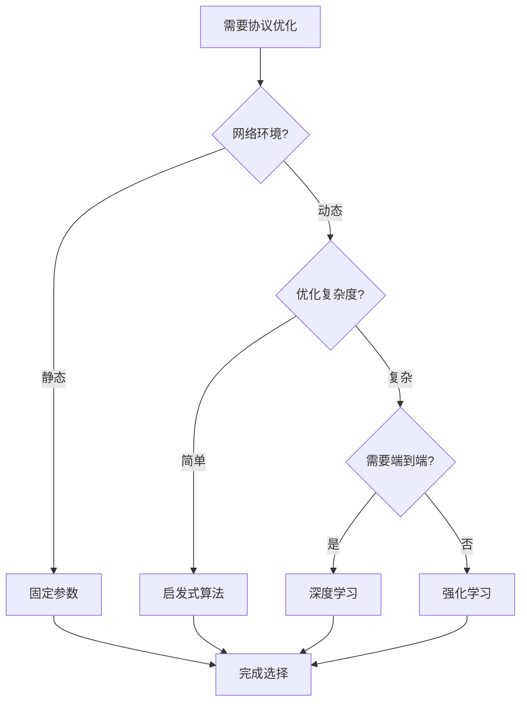
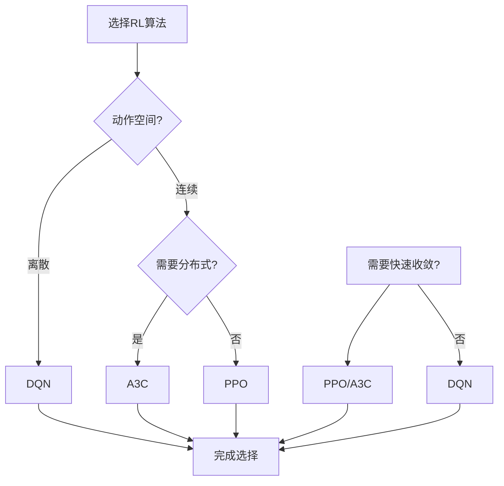
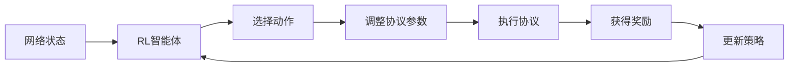
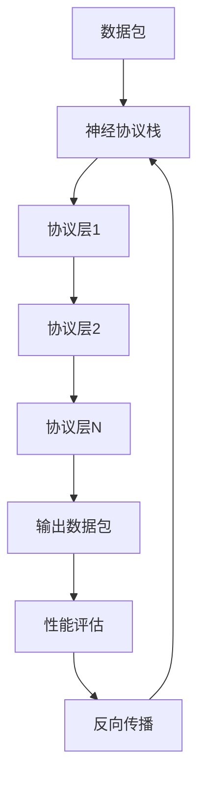
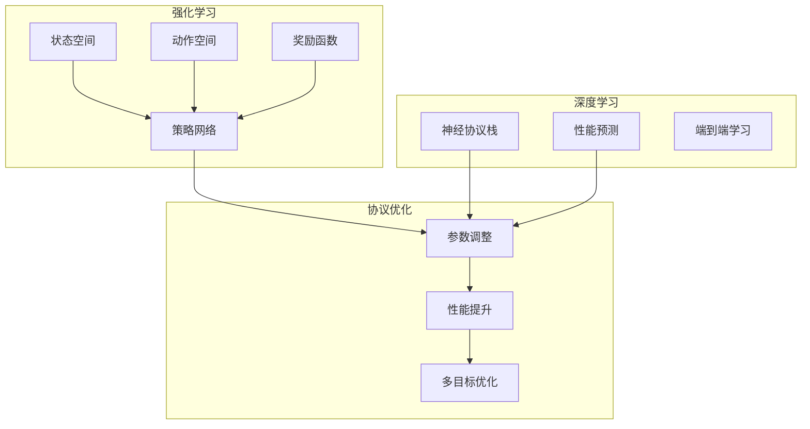
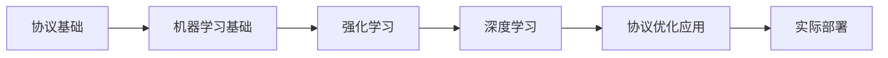

# AI驱动的协议优化专题思维表征工具 / AI-Driven Protocol Optimization Special Topic Mental Representation Tools 2024-2025

## 📚 **概述 / Overview**

本文档为AI驱动的协议优化专题提供完整的思维表征工具集合，包括思维导图、对比矩阵、决策树、数据流图等多种表征方式。

**创建时间**: 2025年1月
**状态**: ✅ 完成
**专题**: AI驱动的协议优化（2024-2025最新研究）
**相关文档**: [AI驱动的协议优化专题-2024-2025.md](AI驱动的协议优化专题-2024-2025.md)

---

## 🗺️ **一、思维导图 / Mind Maps**

### 1.1 AI协议优化完整思维导图

### 1.2 协议优化方法对比思维导图

---

## 📊 **二、对比矩阵 / Comparison Matrices**

### 2.1 协议优化方法对比矩阵

| 优化方法 | 自适应性 | 计算成本 | 优化效果 | 适用场景 | 2024-2025创新 |
|---------|---------|---------|---------|---------|--------------|
| **固定参数** | 无 | 低 | 低 | 静态环境 | 基础方法 |
| **启发式算法** | 低 | 中等 | 中等 | 简单场景 | 传统方法 |
| **强化学习** | 高 | 高 | 高 | 动态环境 | AI驱动优化 |
| **深度学习** | 中等 | 高 | 高 | 复杂场景 | 端到端学习 |

### 2.2 强化学习算法对比矩阵

| RL算法 | 样本效率 | 收敛速度 | 稳定性 | 适用场景 |
|--------|---------|---------|--------|---------|
| **DQN** | 中等 | 中等 | 中等 | 离散动作空间 |
| **PPO** | 高 | 快 | 高 | 连续动作空间 |
| **A3C** | 高 | 快 | 中等 | 分布式训练 |

### 2.3 协议优化目标对比矩阵

| 优化目标 | 重要性 | 难度 | 权衡关系 |
|---------|--------|------|---------|
| **吞吐量** | 高 | 中等 | 与延迟权衡 |
| **延迟** | 高 | 高 | 与吞吐量权衡 |
| **能耗** | 中等 | 中等 | 与性能权衡 |
| **公平性** | 中等 | 高 | 与效率权衡 |

---

## 🌳 **三、决策树 / Decision Trees**

### 3.1 协议优化方法选择决策树

### 3.2 强化学习算法选择决策树

---

## 🔄 **四、数据流图 / Data Flow Diagrams**

### 4.1 强化学习协议优化数据流

### 4.2 深度学习协议设计数据流

---

## 🗺️ **五、概念地图 / Concept Maps**

### 5.1 AI协议优化核心概念关系

---

## 📈 **六、学习路径 / Learning Paths**

### 6.1 AI协议优化学习逻辑路径

---

**文档版本**: v1.0
**创建时间**: 2025年1月
**最后更新**: 2025年1月
**维护者**: GraphNetWorkCommunicate项目组
**状态**: ✅ 完成
