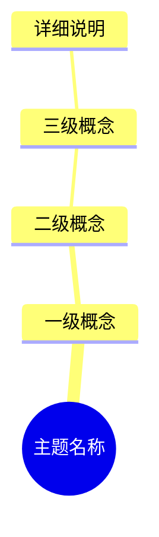
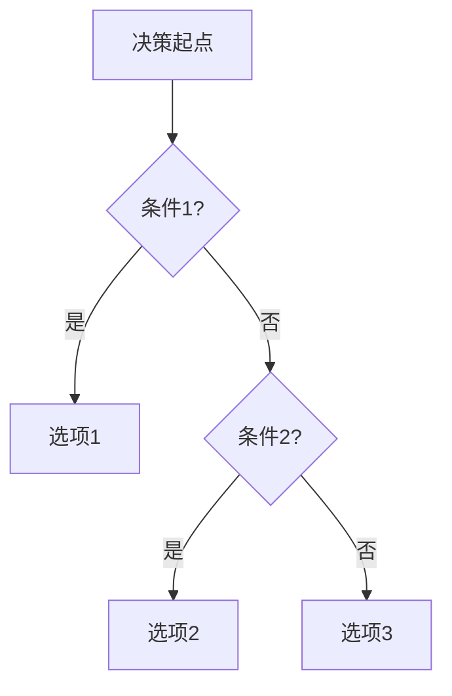
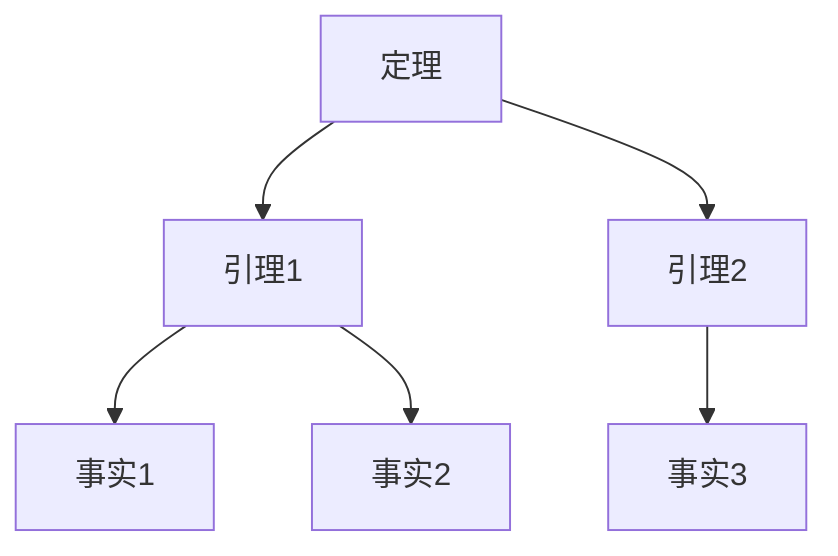
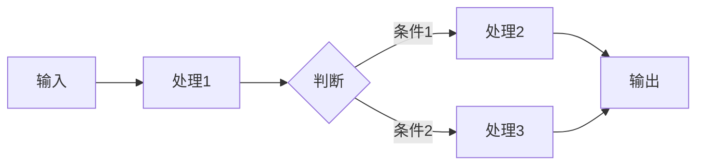
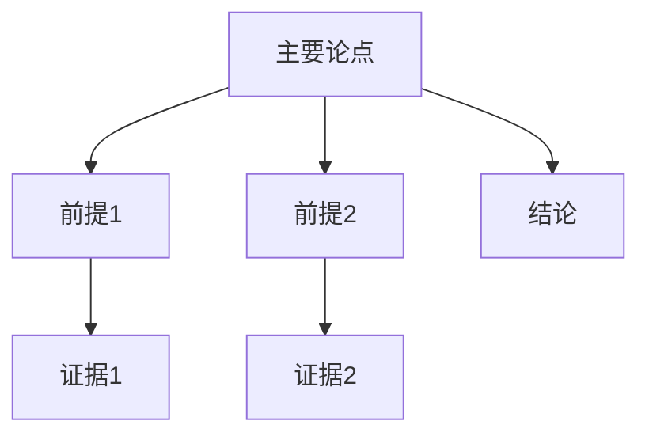

# 思维表征工具全面增强计划 / Comprehensive Mind Representation Tools Enhancement Plan 2025

## 📊 **概述 / Overview**

本文档制定GraphNetWorkCommunicate项目思维表征工具的全面增强计划，系统化地为每个主题补充多种思维表征方式，包括思维导图、多维矩阵、决策树、证明树、数据流图、论证思维图等。

**创建时间**: 2025年12月5日
**状态**: 🚀 执行中

---

## 🎯 **一、增强目标 / Enhancement Objectives**

### 1.1 总体目标

为每个核心主题创建完整的思维表征工具集合，包括：

1. ✅ **思维导图**: 展示主题的知识结构和层次关系
2. ✅ **概念多维矩阵**: 概念定义、关系、属性、解释、论证的对比矩阵
3. ✅ **决策树图**: 算法选择、方法选择、场景决策
4. ✅ **证明树图**: 重要定理的证明逻辑结构
5. ✅ **控制执行数据流图**: 算法执行流程、系统控制流程
6. ✅ **论证思维图**: 主题的论证脉络和逻辑结构

### 1.2 覆盖范围

- **11个核心模块**: 每个模块的每个主题
- **159个核心主题**: 每个主题的完整思维表征
- **690+个子主题**: 关键子主题的详细表征

---

## 🗺️ **二、思维表征工具类型定义 / Mind Representation Tool Types**

### 2.1 思维导图 (Mind Maps)

**用途**: 展示主题的知识结构和层次关系

**示例结构**:



**创建标准**:

- 清晰的主题层次
- 完整的知识覆盖
- 合理的概念分组
- 直观的可视化

### 2.2 概念多维矩阵 (Multi-dimensional Concept Matrices)

**用途**: 对比概念的定义、关系、属性、解释、论证

**矩阵类型**:

1. **定义矩阵**: 概念定义对比
2. **关系矩阵**: 概念关系对比
3. **属性矩阵**: 属性特征对比
4. **解释矩阵**: 解释方式对比
5. **论证矩阵**: 论证方法对比

**示例结构**:

| 维度 | 概念A | 概念B | 概念C | 关系 |
|------|-------|-------|-------|------|
| 定义 | ... | ... | ... | ... |
| 属性 | ... | ... | ... | ... |
| 关系 | ... | ... | ... | ... |

### 2.3 决策树图 (Decision Trees)

**用途**: 算法选择、方法选择、场景决策

**结构**:



### 2.4 证明树图 (Proof Trees)

**用途**: 展示定理证明的逻辑结构

**结构**:



### 2.5 控制执行数据流图 (Control Flow & Data Flow Diagrams)

**用途**: 算法执行流程、系统控制流程

**类型**:

1. **控制流图**: 算法控制流程
2. **数据流图**: 数据流转过程
3. **混合流图**: 控制流和数据流结合

**结构**:



### 2.6 论证思维图 (Argumentation Maps)

**用途**: 展示主题的论证脉络和逻辑结构

**结构**:



---

## 📋 **三、模块增强计划 / Module Enhancement Plan**

### 3.1 图论基础模块

#### 主题列表

1. 基本概念
2. 连通性
3. 图的算法
4. 谱图理论
5. 图的分解理论
6. 图的流理论
7. 图的匹配理论
8. 极值图论

#### 思维表征工具需求

| 主题 | 思维导图 | 概念矩阵 | 决策树 | 证明树 | 数据流图 | 论证图 |
|------|---------|---------|--------|--------|---------|--------|
| 基本概念 | ✅ | ✅ | ⚠️ | ⚠️ | ⚠️ | ✅ |
| 连通性 | ✅ | ✅ | ✅ | ✅ | ⚠️ | ✅ |
| 图的算法 | ✅ | ✅ | ✅ | ✅ | ✅ | ✅ |
| 谱图理论 | ⚠️ | ⚠️ | ⚠️ | ✅ | ⚠️ | ⚠️ |
| 图的分解 | ⚠️ | ⚠️ | ⚠️ | ✅ | ⚠️ | ⚠️ |
| 图的流 | ✅ | ✅ | ✅ | ✅ | ✅ | ✅ |
| 图的匹配 | ✅ | ✅ | ✅ | ✅ | ⚠️ | ✅ |
| 极值图论 | ⚠️ | ⚠️ | ⚠️ | ✅ | ⚠️ | ⚠️ |

**状态说明**:

- ✅: 已有或基本完成
- ⚠️: 部分完成，需要补充
- ❌: 缺失，需要创建

### 3.2 网络拓扑模块

#### 主题列表

1. 拓扑结构
2. 拓扑优化
3. 小世界网络
4. 网络动力学
5. 网络生成模型

#### 思维表征工具需求

| 主题 | 思维导图 | 概念矩阵 | 决策树 | 证明树 | 数据流图 | 论证图 |
|------|---------|---------|--------|--------|---------|--------|
| 拓扑结构 | ✅ | ⚠️ | ✅ | ⚠️ | ⚠️ | ⚠️ |
| 拓扑优化 | ✅ | ✅ | ✅ | ⚠️ | ✅ | ⚠️ |
| 小世界网络 | ✅ | ⚠️ | ⚠️ | ✅ | ⚠️ | ⚠️ |
| 网络动力学 | ✅ | ⚠️ | ⚠️ | ⚠️ | ✅ | ⚠️ |
| 网络生成模型 | ✅ | ⚠️ | ✅ | ⚠️ | ✅ | ⚠️ |

### 3.3 通信协议模块

#### 主题列表

1. 协议基础
2. 路由协议
3. 安全协议
4. 协议形式化验证
5. 协议性能分析

#### 思维表征工具需求

| 主题 | 思维导图 | 概念矩阵 | 决策树 | 证明树 | 数据流图 | 论证图 |
|------|---------|---------|--------|--------|---------|--------|
| 协议基础 | ✅ | ⚠️ | ⚠️ | ⚠️ | ✅ | ⚠️ |
| 路由协议 | ✅ | ✅ | ✅ | ⚠️ | ✅ | ⚠️ |
| 安全协议 | ✅ | ✅ | ✅ | ⚠️ | ✅ | ⚠️ |
| 协议验证 | ✅ | ⚠️ | ✅ | ✅ | ✅ | ✅ |
| 性能分析 | ⚠️ | ⚠️ | ✅ | ⚠️ | ✅ | ⚠️ |

### 3.4 分布式系统模块

#### 主题列表

1. 分布式基础
2. 一致性协议
3. 区块链与共识
4. 分布式事务处理
5. 分布式存储系统

#### 思维表征工具需求

| 主题 | 思维导图 | 概念矩阵 | 决策树 | 证明树 | 数据流图 | 论证图 |
|------|---------|---------|--------|--------|---------|--------|
| 分布式基础 | ✅ | ⚠️ | ⚠️ | ⚠️ | ✅ | ⚠️ |
| 一致性协议 | ✅ | ✅ | ✅ | ✅ | ✅ | ✅ |
| 区块链 | ✅ | ✅ | ✅ | ⚠️ | ✅ | ⚠️ |
| 分布式事务 | ✅ | ✅ | ✅ | ⚠️ | ✅ | ✅ |
| 分布式存储 | ⚠️ | ⚠️ | ✅ | ⚠️ | ✅ | ⚠️ |

---

## 🎯 **四、执行优先级 / Execution Priority**

### 4.1 高优先级（P0）- 立即执行

1. **补充概念多维矩阵** (100小时)
   - 为所有核心概念创建定义矩阵
   - 创建关系矩阵
   - 创建属性矩阵

2. **创建论证思维图** (80小时)
   - 为每个主题创建论证脉络图
   - 展示逻辑结构

3. **补充控制执行数据流图** (120小时)
   - 为关键算法创建执行流程图
   - 为系统创建控制流程图

### 4.2 中优先级（P1）- 近期执行

4. **完善决策树图** (60小时)
5. **补充证明树图** (100小时)
6. **完善思维导图** (40小时)

### 4.3 低优先级（P2）- 中期执行

7. **创建补充文档** (40小时)
8. **优化可视化效果** (30小时)

---

## 📊 **五、质量标准 / Quality Standards**

### 5.1 思维导图标准

- ✅ 层次清晰，不超过5层
- ✅ 概念完整，覆盖主题核心内容
- ✅ 分组合理，相关概念归类
- ✅ 可视化美观，易于理解

### 5.2 概念矩阵标准

- ✅ 维度明确，对比有意义
- ✅ 内容准确，定义清晰
- ✅ 格式统一，易于对比
- ✅ 覆盖全面，不遗漏关键概念

### 5.3 决策树标准

- ✅ 决策条件明确
- ✅ 选项完整，覆盖所有情况
- ✅ 逻辑清晰，无歧义
- ✅ 实用性强，可指导实际选择

### 5.4 证明树标准

- ✅ 逻辑结构清晰
- ✅ 证明步骤完整
- ✅ 依赖关系明确
- ✅ 形式化表述规范

### 5.5 数据流图标准

- ✅ 流程清晰，步骤明确
- ✅ 数据流转可见
- ✅ 控制逻辑合理
- ✅ 易于理解和实现

### 5.6 论证图标准

- ✅ 论点明确
- ✅ 前提充分
- ✅ 证据可靠
- ✅ 逻辑严密

---

## 🚀 **六、执行计划 / Execution Plan**

### 6.1 第一阶段（1-2周）

**目标**: 创建核心主题的思维表征工具

**任务**:

1. 为图论基础核心主题创建概念矩阵
2. 为网络拓扑核心主题创建论证图
3. 为通信协议核心主题创建数据流图

**交付物**: 20+个思维表征工具

### 6.2 第二阶段（3-4周）

**目标**: 扩展思维表征工具覆盖

**任务**:

1. 为分布式系统创建完整工具集
2. 为量子通信创建工具集
3. 补充其他模块工具

**交付物**: 50+个思维表征工具

### 6.3 第三阶段（5-8周）

**目标**: 完善所有模块工具

**任务**:

1. 补充所有缺失工具
2. 优化现有工具
3. 创建总体导航

**交付物**: 100+个思维表征工具

---

## 📚 **七、文档组织 / Document Organization**

### 7.1 文档结构

每个模块将包含：

```
模块目录/
├── 思维表征工具-模块名.md  # 模块所有思维表征工具汇总
├── 模块知识结构思维导图.md  # 模块总体思维导图
└── 各主题文档/
    └── 主题文档.md  # 包含该主题的所有思维表征工具
```

### 7.2 工具分类

工具将按类型组织：

1. 思维导图集合
2. 概念矩阵集合
3. 决策树集合
4. 证明树集合
5. 数据流图集合
6. 论证图集合

---

## 🎯 **八、预期成果 / Expected Outcomes**

### 8.1 数量目标

- **思维导图**: 50+个
- **概念矩阵**: 100+个
- **决策树**: 40+个
- **证明树**: 80+个
- **数据流图**: 60+个
- **论证图**: 50+个

**总计**: 380+个思维表征工具

### 8.2 质量目标

- **覆盖率**: ≥80%（每个核心主题都有完整工具集）
- **准确性**: 100%（所有内容准确无误）
- **可用性**: 优秀（工具实用性强）
- **美观性**: 优秀（可视化效果好）

---

## 📋 **九、总结 / Summary**

本计划系统化地为GraphNetWorkCommunicate项目创建完整的思维表征工具体系，将大幅提升项目的可理解性、可用性和教育价值。

**执行状态**: 🚀 进行中
**预计完成时间**: 8周
**预期成果**: 380+个高质量的思维表征工具

---

**文档版本**: v1.0
**创建时间**: 2025年12月5日
**维护者**: GraphNetWorkCommunicate项目组
