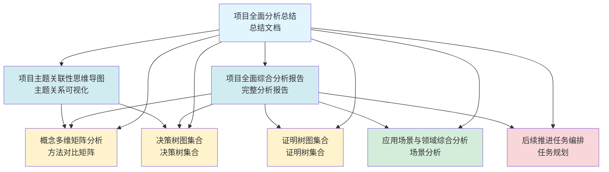

# 项目全面分析文档导航 / Project Comprehensive Analysis Documents Navigation 2025

## 📊 **概述 / Overview**

本文档提供GraphNetWorkCommunicate项目全面分析的所有文档导航，方便快速定位和查阅相关分析内容。

**创建时间**: 2025年12月5日
**最后更新**: 2025年12月5日
**状态**: ✅ 完整

---

## 📚 **一、核心分析文档 / Core Analysis Documents**

### 1.1 综合分析报告

| 文档名称 | 文件路径 | 内容概要 | 页数 | 状态 |
|---------|---------|---------|------|------|
| **项目全面综合分析报告** | `项目全面综合分析报告-2025-完整版.md` | 完整的项目分析，包括所有维度的详细分析 | 400+ | ✅ 完成 |
| **项目全面分析总结** | `项目全面分析总结-2025.md` | 所有分析成果的汇总和导航 | 200+ | ✅ 完成 |
| **项目主题关联性思维导图** | `项目主题关联性思维导图-2025.md` | 主题关联关系的可视化展示 | 300+ | ✅ 完成 |

### 1.2 思维表征工具文档

| 文档名称 | 文件路径 | 内容概要 | 图表数 | 状态 |
|---------|---------|---------|--------|------|
| **概念多维矩阵分析** | `概念多维矩阵分析-2025.md` | 核心概念和方法的对比矩阵 | 20+ | ✅ 完成 |
| **决策树图集合** | `决策树图集合-2025.md` | 关键决策场景的决策树 | 15+ | ✅ 完成 |
| **证明树图集合** | `证明树图集合-2025.md` | 重要定理和算法的证明树 | 10+ | ✅ 完成 |

### 1.3 应用场景分析文档

| 文档名称 | 文件路径 | 内容概要 | 场景数 | 状态 |
|---------|---------|---------|--------|------|
| **应用场景与领域综合分析** | `应用场景与领域综合分析-2025.md` | 不同应用场景的详细分析 | 15+ | ✅ 完成 |

### 1.4 任务规划文档

| 文档名称 | 文件路径 | 内容概要 | 任务数 | 状态 |
|---------|---------|---------|--------|------|
| **后续推进任务编排** | `后续推进任务编排-2025-完整版.md` | 详细的任务分解和时间规划 | 100+ | ✅ 完成 |

---

## 🗺️ **二、文档关系图 / Document Relationship Diagram**

---

## 📋 **三、快速查找指南 / Quick Search Guide**

### 3.1 按分析维度查找

| 分析维度 | 相关文档 | 关键内容 |
|---------|---------|---------|
| **项目全局内容分析** | 项目全面综合分析报告 | 模块统计、质量评估 |
| **主题关联性分析** | 项目主题关联性思维导图 | 主题层次结构、关联矩阵 |
| **权威信息对标** | 项目全面综合分析报告 | Wikipedia对标、大学课程对标 |
| **思维表征方式** | 概念多维矩阵、决策树、证明树 | 各种可视化工具 |
| **应用场景分析** | 应用场景与领域综合分析 | 场景覆盖度、案例映射 |
| **任务规划** | 后续推进任务编排 | 任务分解、时间规划 |

### 3.2 按文档类型查找

| 文档类型 | 文档列表 |
|---------|---------|
| **综合分析报告** | 项目全面综合分析报告、项目全面分析总结 |
| **思维表征工具** | 概念多维矩阵分析、决策树图集合、证明树图集合 |
| **主题关联分析** | 项目主题关联性思维导图 |
| **应用场景分析** | 应用场景与领域综合分析 |
| **任务规划** | 后续推进任务编排 |

### 3.3 按模块查找

| 模块 | 相关分析文档 | 关键内容 |
|------|------------|---------|
| **图论基础** | 所有文档 | 算法对比、证明树 |
| **网络拓扑** | 所有文档 | 拓扑对比、决策树 |
| **通信协议** | 所有文档 | 协议对比、决策树 |
| **分布式系统** | 所有文档 | 算法对比、证明树 |
| **量子通信** | 所有文档 | 协议对比、证明树 |
| **其他模块** | 所有文档 | 相关分析和对比 |

---

## 🎯 **四、文档使用场景 / Document Usage Scenarios**

### 4.1 快速了解项目全貌

**推荐阅读顺序**:
1. 项目全面分析总结 (快速了解)
2. 项目全面综合分析报告 (深入了解)
3. 项目主题关联性思维导图 (可视化理解)

### 4.2 查找具体方法对比

**推荐文档**:
1. 概念多维矩阵分析 (方法对比)
2. 决策树图集合 (方法选择)

### 4.3 理解证明逻辑

**推荐文档**:
1. 证明树图集合 (证明结构)
2. 项目全面综合分析报告 (证明标准)

### 4.4 了解应用场景

**推荐文档**:
1. 应用场景与领域综合分析 (场景分析)
2. 决策树图集合 (场景选择)

### 4.5 规划后续工作

**推荐文档**:
1. 后续推进任务编排 (任务规划)
2. 项目全面综合分析报告 (改进建议)

---

## 📊 **五、文档统计 / Document Statistics**

### 5.1 文档数量统计

| 文档类型 | 数量 | 总页数(估算) |
|---------|------|------------|
| 综合分析报告 | 2 | 600+ |
| 思维表征工具 | 3 | 500+ |
| 主题关联分析 | 1 | 300+ |
| 应用场景分析 | 1 | 300+ |
| 任务规划 | 1 | 400+ |
| **总计** | **8** | **2100+** |

### 5.2 内容统计

| 内容类型 | 数量 |
|---------|------|
| 思维导图 | 15+ |
| 决策树 | 15+ |
| 证明树 | 10+ |
| 多维矩阵 | 20+ |
| 应用场景分析 | 15+ |
| 任务项 | 100+ |

---

## 🔗 **六、相关文档链接 / Related Document Links**

### 6.1 项目概述文档

- [项目简介](00-项目简介.md)
- [目录结构](02-目录结构.md)
- [方法论](03-方法论.md)
- [全局文档索引](全局文档索引-2025.md)

### 6.2 分析报告文档

- [主题与子主题全面梳理](主题与子主题全面梳理与批判性分析-2025.md)
- [项目全面分析与改进规划](项目全面分析与改进规划-2025.md)

### 6.3 任务规划文档

- [后续推进任务编排](后续推进任务编排-2025-完整版.md)
- [未推进任务全面梳理](未推进任务全面梳理-2025-最终版.md)

---

## 📝 **七、文档维护说明 / Document Maintenance Instructions**

### 7.1 更新频率

- **综合分析报告**: 每月更新一次
- **思维表征工具**: 根据内容扩展更新
- **应用场景分析**: 每季度更新一次
- **任务规划**: 每周更新进度

### 7.2 版本管理

- 所有文档使用版本号标记
- 重大更新时递增版本号
- 记录更新日志

### 7.3 质量保证

- 所有文档经过审核
- 保持术语一致性
- 确保链接有效性

---

## 🎉 **八、总结 / Summary**

本文档导航系统提供了GraphNetWorkCommunicate项目全面分析的所有文档导航，包括：

1. **8个核心分析文档**: 涵盖所有分析维度
2. **清晰的文档关系**: 展示文档间的关联
3. **快速查找指南**: 帮助快速定位内容
4. **使用场景指导**: 指导如何有效使用文档

通过这个导航系统，可以：
- **快速了解项目全貌**: 从总结文档开始
- **深入了解具体内容**: 查阅详细分析报告
- **查找具体工具**: 使用思维表征工具文档
- **规划后续工作**: 参考任务规划文档

---

**文档版本**: v1.0
**创建时间**: 2025年12月5日
**最后更新**: 2025年12月5日
**维护者**: GraphNetWorkCommunicate项目组
