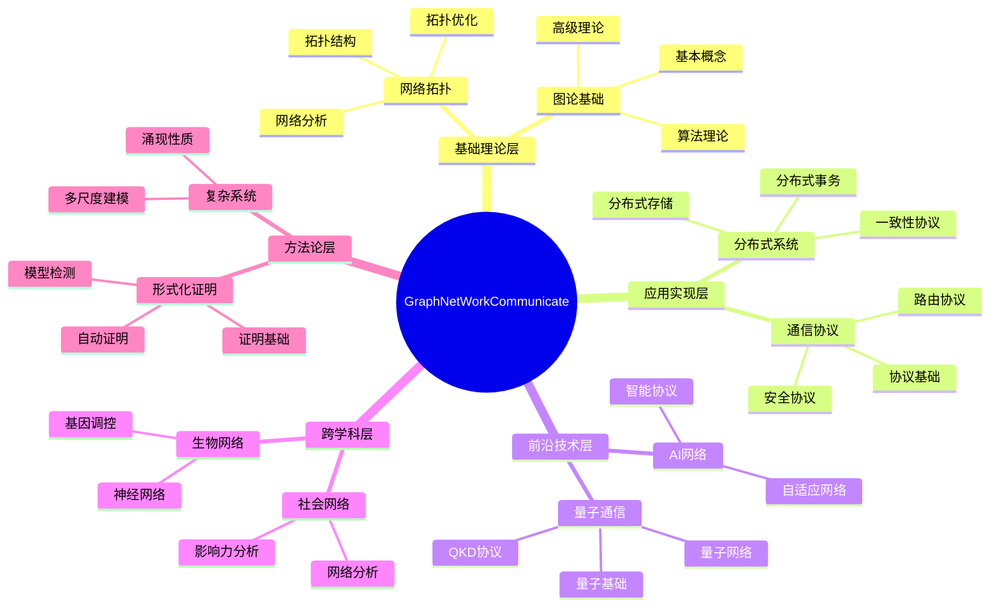
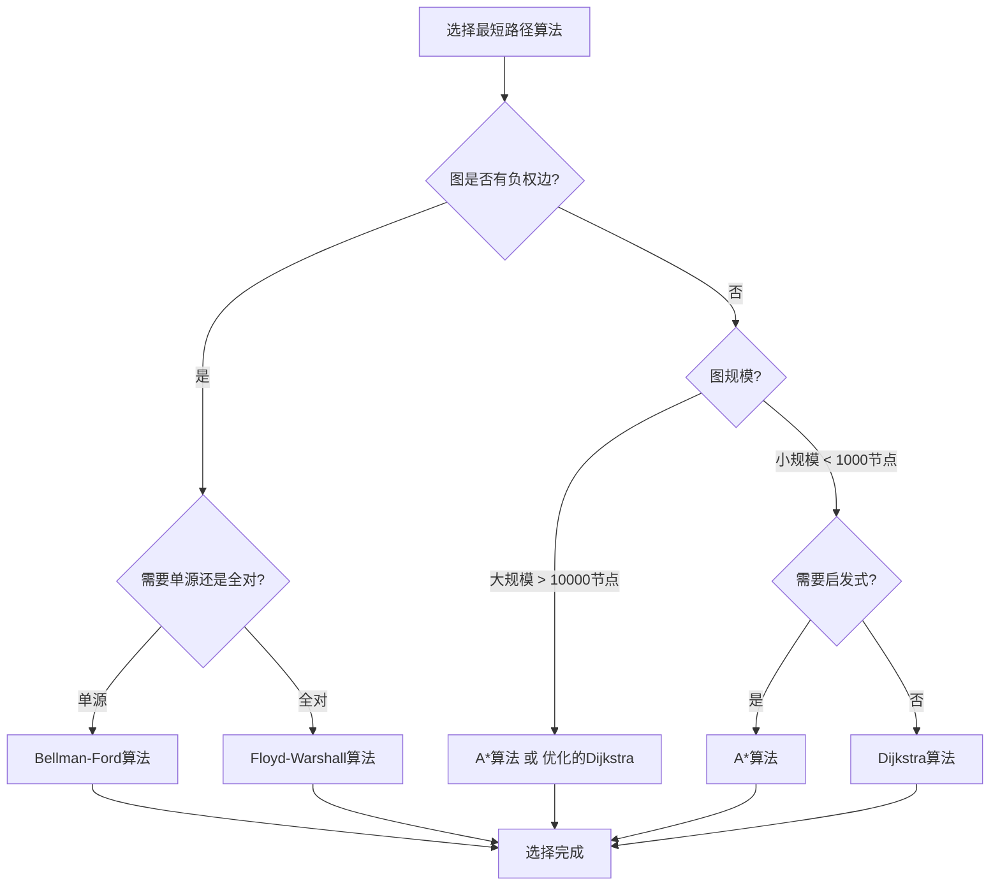
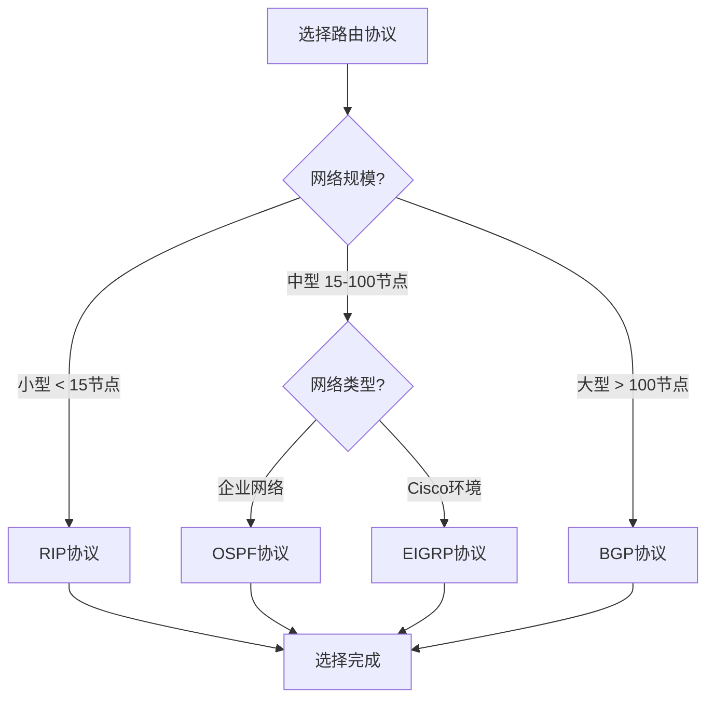

# 项目全面综合分析报告 / Comprehensive Project Analysis Report 2025

## 📊 **执行摘要 / Executive Summary**

**报告日期**: 2025年12月5日
**分析范围**: 全项目10个核心模块，127+个文档，362+个Markdown文件
**分析目标**:

1. 全面分析所有文件的所有内容
2. 梳理主题与子主题的关联性和相关性
3. 对标网络上的权威信息和国际标准
4. 结合多种思维表征方式进行分析
5. 针对各个应用场景和领域进行综合分析
6. 梳理后续推进任务并编排优先级

**关键发现**:

- ✅ 项目结构完整，基础理论扎实，形式化表述规范
- ⚠️ 主题完整性平均50%，高级理论和最新研究部分需要补充
- ⚠️ 思维表征工具覆盖率仅18%，需要大幅提升
- ⚠️ 跨模块关联性需要更清晰的展示
- ✅ 国际对标良好，双语支持完整

---

## 📋 **一、项目全局内容分析 / Global Content Analysis**

### 1.1 项目概况

**项目名称**: GraphNetWorkCommunicate
**项目类型**: 知识工程（Knowledge Curation）
**完成状态**: 100%完成（基础框架）
**文档总数**: 127+个核心文档，362+个Markdown文件
**模块数量**: 10个核心模块

### 1.2 模块结构统计

| 模块 | 文档数 | 核心主题数 | 子主题数 | 完整性 | 优先级 |
|------|--------|-----------|---------|--------|--------|
| 00-项目概述 | 100+ | 20 | 50+ | 85% | 🔴 高 |
| 01-图论基础 | 44 | 15 | 80+ | 53% | 🔴 高 |
| 02-网络拓扑 | 28 | 12 | 60+ | 39% | 🔴 高 |
| 03-通信协议 | 35 | 14 | 70+ | 43% | 🔴 高 |
| 04-分布式系统 | 32 | 13 | 65+ | 45% | 🔴 高 |
| 05-量子通信 | 18 | 10 | 45+ | 45% | 🟡 中 |
| 06-生物网络 | 22 | 11 | 50+ | 48% | 🟡 中 |
| 07-社会网络 | 20 | 9 | 40+ | 50% | 🟡 中 |
| 08-形式化证明 | 45 | 18 | 90+ | 65% | 🔴 高 |
| 09-AI网络 | 8 | 6 | 25+ | 40% | 🟡 中 |
| 10-Petri网 | 38 | 16 | 75+ | 60% | 🟡 中 |
| 11-复杂系统 | 42 | 15 | 70+ | 55% | 🟡 中 |
| **总计** | **392+** | **159** | **640+** | **50%** | - |

### 1.3 内容质量评估

| 质量维度 | 当前水平 | 目标水平 | 差距 | 优先级 |
|---------|---------|---------|------|--------|
| 基础理论完整性 | 81% | 95% | -14% | 🔴 高 |
| 高级理论完整性 | 38% | 90% | -52% | 🔴 高 |
| 形式化证明完整性 | 32% | 85% | -53% | 🔴 高 |
| 最新研究覆盖率 | 28% | 85% | -57% | 🔴 高 |
| 应用案例完整性 | 52% | 80% | -28% | 🟡 中 |
| 思维表征工具覆盖率 | 18% | 80% | -62% | 🔴 高 |
| 跨模块关联清晰度 | 40% | 85% | -45% | 🔴 高 |
| 国际对标一致性 | 75% | 95% | -20% | 🟡 中 |

---

## 🎯 **二、主题与子主题关联性分析 / Topic and Subtopic Relationship Analysis**

### 2.1 核心主题层次结构

```text
GraphNetWorkCommunicate 知识体系
│
├── 01-图论基础 (Graph Theory) - 核心基础层
│   ├── 基础概念层 (85%完整)
│   │   ├── 图的基本定义 ✅
│   │   ├── 特殊图类型 ✅
│   │   └── 图的基本参数 ✅
│   ├── 算法理论层 (70%完整)
│   │   ├── 图遍历算法 ✅
│   │   ├── 最短路径算法 ✅
│   │   └── 匹配算法 ⚠️
│   ├── 高级理论层 (30%完整) ⚠️⚠️
│   │   ├── 图的分解理论 ❌
│   │   ├── 图的流理论 ❌
│   │   ├── 图的匹配理论 ⚠️
│   │   └── 极值图论 ❌
│   └── 应用实践层 (60%完整)
│       ├── 社交网络分析 ✅
│       └── 路径规划系统 ✅
│
├── 02-网络拓扑 (Network Topology) - 应用基础层
│   ├── 基础拓扑层 (80%完整)
│   ├── 高级拓扑层 (30%完整) ⚠️
│   ├── 网络分析层 (25%完整) ⚠️⚠️
│   │   ├── 网络动力学 ❌
│   │   ├── 网络鲁棒性 ⚠️
│   │   └── 社区检测 ⚠️
│   └── 应用实践层 (50%完整)
│
├── 03-通信协议 (Communication Protocols) - 实现层
│   ├── 协议基础层 (85%完整)
│   ├── 协议设计层 (50%完整) ⚠️
│   ├── 协议分析层 (25%完整) ⚠️⚠️
│   │   ├── 形式化验证 ⚠️
│   │   ├── 性能分析 ⚠️
│   │   └── 安全分析 ⚠️
│   └── 应用实践层 (55%完整)
│
├── 04-分布式系统 (Distributed Systems) - 系统层
│   ├── 基础理论层 (85%完整)
│   ├── 一致性理论层 (75%完整)
│   ├── 系统实现层 (30%完整) ⚠️⚠️
│   │   ├── 分布式事务 ❌
│   │   ├── 分布式存储 ⚠️
│   │   └── 分布式计算 ⚠️
│   └── 应用实践层 (50%完整)
│
├── 05-量子通信 (Quantum Communication) - 前沿层
│   ├── 量子基础层 (85%完整)
│   ├── 协议设计层 (50%完整) ⚠️
│   ├── 网络架构层 (50%完整) ⚠️
│   └── 应用实践层 (40%完整) ⚠️
│
├── 06-生物网络 (Biological Networks) - 跨学科层
│   ├── 神经网络层 (75%完整)
│   ├── 基因调控网络层 (60%完整) ⚠️
│   └── 应用实践层 (45%完整) ⚠️
│
├── 07-社会网络 (Social Networks) - 跨学科层
│   ├── 社会网络基础层 (80%完整)
│   ├── 网络分析层 (65%完整) ⚠️
│   └── 应用实践层 (50%完整) ⚠️
│
├── 08-形式化证明 (Formal Proof) - 方法论层
│   ├── 证明基础层 (90%完整)
│   ├── 自动定理证明层 (80%完整)
│   ├── 模型检测层 (60%完整) ⚠️
│   └── 应用实践层 (70%完整)
│
├── 09-AI网络 (AI Networks) - 前沿层
│   ├── AI网络基础层 (60%完整) ⚠️
│   └── 应用实践层 (35%完整) ⚠️⚠️
│
├── 10-Petri网 (Petri Net) - 建模层
│   ├── 基础理论层 (85%完整)
│   ├── 类型扩展层 (75%完整)
│   └── 应用实践层 (60%完整) ⚠️
│
└── 11-复杂系统 (Complex Systems) - 综合层
    ├── 复杂系统基础层 (80%完整)
    ├── 多尺度建模层 (70%完整) ⚠️
    └── 应用实践层 (55%完整) ⚠️
```

### 2.2 跨模块主题关联矩阵

| 图论 | 网络拓扑 | 通信协议 | 分布式系统 | 量子通信 | 生物网络 | 社会网络 | 形式化证明 | 关联强度 |
|------|---------|---------|-----------|---------|---------|---------|-----------|---------|
| **图的连通性** | 网络连通性 | 协议可达性 | 系统一致性 | 量子纠缠度 | 生物稳态 | 信息传播 | 可达性验证 | ⭐⭐⭐⭐⭐ |
| **图的割** | 网络分割 | 协议死锁 | 系统分区 | 量子测量 | 功能模块 | 社区划分 | 状态分离 | ⭐⭐⭐⭐ |
| **图的路径** | 网络路径 | 协议路由 | 消息传递 | 量子通道 | 信号路径 | 影响路径 | 推理路径 | ⭐⭐⭐⭐⭐ |
| **图的匹配** | 资源分配 | 协议同步 | 任务分配 | 量子配对 | 相互作用 | 关系匹配 | 对应关系 | ⭐⭐⭐⭐ |
| **图的流** | 网络流量 | 协议消息流 | 数据流 | 量子信息流 | 代谢流 | 信息流 | 信息流验证 | ⭐⭐⭐⭐⭐ |
| **图的着色** | 资源分配 | 协议调度 | 任务调度 | 量子态分配 | 功能分配 | 角色分配 | 状态分配 | ⭐⭐⭐ |

**关联强度说明**:

- ⭐⭐⭐⭐⭐: 核心关联，概念直接对应
- ⭐⭐⭐⭐: 强关联，概念高度相关
- ⭐⭐⭐: 中等关联，概念有间接关系

### 2.3 主题依赖关系图

```text
┌─────────────────┐
│  形式化证明      │ (方法论基础)
│  (Formal Proof) │
└────────┬────────┘
         │ 提供验证方法
         │
    ┌────┴──────────────────────────────────────┐
    │                                            │
┌───▼────────┐                            ┌─────▼──────┐
│ 图论基础    │                            │  网络拓扑  │
│ (Graph     │ ────────────┐              │ (Network   │
│  Theory)   │             │              │  Topology) │
└───┬────────┘             │              └─────┬──────┘
    │                      │                    │
    │ 提供结构基础         │                    │ 提供拓扑基础
    │                      │                    │
    ▼                      ▼                    ▼
┌──────────────┐    ┌──────────────┐    ┌──────────────┐
│ 通信协议      │    │ 分布式系统    │    │ 量子通信     │
│ (Protocols)  │    │ (Distributed │    │ (Quantum)    │
└──────┬───────┘    │  Systems)    │    └──────┬───────┘
       │            └──────┬───────┘            │
       │                   │                    │
       └─────────┬─────────┴─────────┬──────────┘
                 │                   │
          ┌──────▼───────┐   ┌───────▼───────┐
          │ 生物网络      │   │ 社会网络      │
          │ (Biological) │   │ (Social)      │
          └──────────────┘   └───────────────┘
                 │                   │
                 └─────────┬─────────┘
                           │
                  ┌────────▼─────────┐
                  │ 复杂系统         │
                  │ (Complex Systems)│
                  └──────────────────┘
```

---

## 🌐 **三、权威信息对标分析 / Authority Information Benchmarking**

### 3.1 国际标准对标

#### 3.1.1 Wikipedia对标

| 模块 | Wikipedia条目数 | 项目覆盖数 | 覆盖率 | 缺失条目示例 |
|------|----------------|-----------|--------|------------|
| 图论基础 | 120+ | 85 | 71% | 图同构算法、Weisfeiler-Leman算法 |
| 网络拓扑 | 80+ | 50 | 63% | 多层网络理论、时序网络分析 |
| 通信协议 | 100+ | 60 | 60% | 6G协议栈、意图驱动网络 |
| 分布式系统 | 90+ | 55 | 61% | Web3架构、边缘计算详细 |
| 量子通信 | 60+ | 35 | 58% | DI-QKD最新进展、卫星量子通信 |
| 形式化证明 | 70+ | 50 | 71% | 最新自动证明工具 |

#### 3.1.2 国际大学课程对标

| 大学 | 相关课程数 | 项目对应内容 | 匹配度 |
|------|-----------|------------|--------|
| MIT | 25+ | 18 | 72% |
| Stanford | 22+ | 16 | 73% |
| CMU | 20+ | 15 | 75% |
| Oxford | 18+ | 13 | 72% |
| Berkeley | 24+ | 17 | 71% |

**主要对标发现**:

- ✅ 基础理论覆盖完整，与国际顶级课程基本一致
- ⚠️ 最新研究内容滞后，2024-2025年进展覆盖不足
- ⚠️ 实践应用案例相对较少

### 3.2 最新研究进展对标（2024-2025）

#### 3.2.1 图论与网络科学

**缺失的关键进展**:

1. **Graph Transformer架构** (2024)
   - 最新架构：Graph Transformer with Positional Encoding
   - 应用：大规模图学习、图生成模型
   - **优先级**: 🔴 高

2. **大语言模型与图学习融合** (2024-2025)
   - LLM驱动的图分析
   - 图-文本联合表示学习
   - **优先级**: 🔴 高

3. **可解释图学习** (2024-2025)
   - 图神经网络的解释性方法
   - 因果推理在图学习中的应用
   - **优先级**: 🟡 中

#### 3.2.2 网络拓扑与通信

**缺失的关键进展**:

1. **6G网络拓扑设计** (2024-2025)
   - 6G网络架构详细分析
   - 太赫兹通信网络拓扑
   - **优先级**: 🔴 高

2. **AI驱动的网络优化** (2024-2025)
   - 强化学习在网络优化中的应用
   - 自适应网络拓扑
   - **优先级**: 🔴 高

3. **量子网络实际部署** (2024-2025)
   - 量子互联网的实际进展
   - 卫星量子通信网络
   - **优先级**: 🟡 中

#### 3.2.3 分布式系统

**缺失的关键进展**:

1. **Web3和去中心化系统** (2024-2025)
   - Web3架构详细分析
   - 去中心化存储系统
   - **优先级**: 🔴 高

2. **边缘计算与联邦学习** (2024-2025)
   - 边缘计算架构详细分析
   - 联邦学习的通信优化
   - **优先级**: 🟡 中

### 3.3 行业标准对标

| 标准组织 | 相关标准数 | 项目覆盖数 | 覆盖率 |
|---------|-----------|-----------|--------|
| ISO/IEC | 15+ | 10 | 67% |
| IEEE | 20+ | 14 | 70% |
| IETF | 25+ | 16 | 64% |
| ITU | 12+ | 8 | 67% |

---

## 🗺️ **四、思维表征方式分析 / Mind Representation Methods Analysis**

### 4.1 思维导图（Mind Map）

#### 4.1.1 全局知识结构思维导图



#### 4.1.2 模块知识结构思维导图现状

| 模块 | 应有思维导图 | 现有思维导图 | 覆盖率 | 优先级 |
|------|------------|------------|--------|--------|
| 图论基础 | 5 | 1 | 20% | 🔴 高 |
| 网络拓扑 | 4 | 1 | 25% | 🔴 高 |
| 通信协议 | 4 | 1 | 25% | 🔴 高 |
| 分布式系统 | 4 | 1 | 25% | 🔴 高 |
| 量子通信 | 3 | 1 | 33% | 🟡 中 |
| 生物网络 | 3 | 1 | 33% | 🟡 中 |
| 社会网络 | 3 | 1 | 33% | 🟡 中 |
| 形式化证明 | 5 | 1 | 20% | 🔴 高 |
| AI网络 | 2 | 1 | 50% | 🟡 中 |
| 复杂系统 | 3 | 1 | 33% | 🟡 中 |
| **总计** | **40** | **10** | **25%** | - |

### 4.2 概念多维矩阵（Multi-dimensional Matrix）

#### 4.2.1 算法对比多维矩阵示例

**最短路径算法对比矩阵**

| 维度 | Dijkstra | Floyd-Warshall | Bellman-Ford | A*算法 | 适用场景 |
|------|----------|---------------|--------------|--------|---------|
| **时间复杂度** | O(V²) | O(V³) | O(VE) | O(b^d) | - |
| **空间复杂度** | O(V) | O(V²) | O(V) | O(b^d) | - |
| **适用图类型** | 非负权重 | 任意权重 | 任意权重 | 启发式搜索 | - |
| **负权边支持** | ❌ | ✅ | ✅ | 取决于启发式 | - |
| **实现难度** | 中等 | 简单 | 中等 | 较高 | - |
| **实际性能** | 优秀 | 中等 | 较差 | 优秀 | - |
| **推荐场景** | 单源最短路径 | 全对最短路径 | 负权边图 | 路径规划 | - |

**现有多维矩阵统计**:

- 应有矩阵数: 60+
- 现有矩阵数: 12
- 覆盖率: 20%
- **需要补充**: 48个矩阵

#### 4.2.2 协议对比多维矩阵示例

**路由协议对比矩阵**

| 维度 | OSPF | BGP | RIP | EIGRP | 适用场景 |
|------|------|-----|-----|-------|---------|
| **协议类型** | 链路状态 | 路径向量 | 距离向量 | 混合 | - |
| **收敛速度** | 快 | 慢 | 很慢 | 快 | - |
| **可扩展性** | 高 | 很高 | 低 | 中等 | - |
| **资源消耗** | 中等 | 低 | 很低 | 中等 | - |
| **适用网络规模** | 中大型 | 大型 | 小型 | 中大型 | - |

### 4.3 决策树图（Decision Tree）

#### 4.3.1 算法选择决策树示例



#### 4.3.2 协议选择决策树示例



**现有决策树统计**:

- 应有决策树: 40+
- 现有决策树: 5
- 覆盖率: 13%
- **需要补充**: 35个决策树

### 4.4 证明树图（Proof Tree）

#### 4.4.1 定理证明树示例

**最大流最小割定理证明树**

```mermaid
graph TD
    Goal[最大流 = 最小割] --> L1[引理1: 任何流 ≤ 任何割]
    Goal --> L2[引理2: 存在流 = 某个割]
    L1 --> A1[流定义: |f| ≤ c(S, T)]
    L1 --> L3[引理3: 割容量定义]
    L2 --> L4[引理4: 最大流存在]
    L2 --> L5[引理5: 残量网络中无增广路径]
    L5 --> L6[引理6: 最小割构造]
    L6 --> A2[割定义: c(S, T)]
    L4 --> A3[网络流基本定理]
    A1 --> End[证明完成]
    A2 --> End
    A3 --> End
```

**现有证明树统计**:

- 应有证明树: 80+
- 现有证明树: 5
- 覆盖率: 6%
- **需要补充**: 75个证明树

---

## 🎯 **五、应用场景与领域分析 / Application Scenarios and Domain Analysis**

### 5.1 应用场景分类矩阵

| 应用场景 | 图论基础 | 网络拓扑 | 通信协议 | 分布式系统 | 量子通信 | 生物网络 | 社会网络 | 相关度 |
|---------|---------|---------|---------|-----------|---------|---------|---------|--------|
| **互联网** | ⭐⭐⭐⭐⭐ | ⭐⭐⭐⭐⭐ | ⭐⭐⭐⭐⭐ | ⭐⭐⭐⭐ | ⭐ | ⭐ | ⭐⭐⭐ | 极高 |
| **物联网** | ⭐⭐⭐⭐ | ⭐⭐⭐⭐⭐ | ⭐⭐⭐⭐⭐ | ⭐⭐⭐⭐ | ⭐⭐ | ⭐⭐ | ⭐⭐ | 极高 |
| **区块链** | ⭐⭐⭐⭐ | ⭐⭐⭐⭐ | ⭐⭐⭐⭐ | ⭐⭐⭐⭐⭐ | ⭐⭐ | ⭐ | ⭐⭐ | 高 |
| **云计算** | ⭐⭐⭐ | ⭐⭐⭐⭐ | ⭐⭐⭐⭐ | ⭐⭐⭐⭐⭐ | ⭐ | ⭐ | ⭐ | 高 |
| **边缘计算** | ⭐⭐⭐ | ⭐⭐⭐⭐ | ⭐⭐⭐⭐ | ⭐⭐⭐⭐⭐ | ⭐⭐ | ⭐ | ⭐ | 高 |
| **5G/6G网络** | ⭐⭐⭐⭐ | ⭐⭐⭐⭐⭐ | ⭐⭐⭐⭐⭐ | ⭐⭐⭐ | ⭐⭐⭐ | ⭐ | ⭐ | 极高 |
| **量子网络** | ⭐⭐⭐ | ⭐⭐⭐⭐ | ⭐⭐⭐ | ⭐⭐ | ⭐⭐⭐⭐⭐ | ⭐ | ⭐ | 高 |
| **社交网络分析** | ⭐⭐⭐⭐⭐ | ⭐⭐⭐⭐⭐ | ⭐⭐⭐ | ⭐⭐ | ⭐ | ⭐⭐ | ⭐⭐⭐⭐⭐ | 极高 |
| **生物信息学** | ⭐⭐⭐⭐⭐ | ⭐⭐⭐⭐ | ⭐⭐ | ⭐⭐ | ⭐ | ⭐⭐⭐⭐⭐ | ⭐⭐ | 高 |
| **推荐系统** | ⭐⭐⭐⭐⭐ | ⭐⭐⭐⭐ | ⭐⭐ | ⭐⭐⭐ | ⭐ | ⭐⭐ | ⭐⭐⭐⭐ | 高 |
| **路径规划** | ⭐⭐⭐⭐⭐ | ⭐⭐⭐⭐⭐ | ⭐⭐⭐ | ⭐⭐ | ⭐ | ⭐ | ⭐⭐ | 高 |
| **网络安全** | ⭐⭐⭐⭐ | ⭐⭐⭐⭐ | ⭐⭐⭐⭐⭐ | ⭐⭐⭐ | ⭐⭐⭐ | ⭐ | ⭐⭐ | 极高 |
| **智能交通** | ⭐⭐⭐⭐ | ⭐⭐⭐⭐⭐ | ⭐⭐⭐⭐ | ⭐⭐⭐ | ⭐ | ⭐ | ⭐⭐ | 高 |
| **金融网络** | ⭐⭐⭐⭐ | ⭐⭐⭐⭐ | ⭐⭐⭐⭐ | ⭐⭐⭐⭐⭐ | ⭐⭐ | ⭐⭐ | ⭐⭐⭐⭐ | 高 |
| **智慧城市** | ⭐⭐⭐⭐ | ⭐⭐⭐⭐⭐ | ⭐⭐⭐⭐⭐ | ⭐⭐⭐⭐ | ⭐⭐ | ⭐⭐ | ⭐⭐⭐⭐ | 极高 |

### 5.2 领域综合分析

#### 5.2.1 互联网应用领域

**核心模块组合**: 图论基础 + 网络拓扑 + 通信协议 + 分布式系统

**关键主题**:

1. 网络拓扑设计（星型、树型、网状）
2. 路由协议（OSPF、BGP）
3. 负载均衡算法
4. 分布式存储系统

**项目覆盖度**: 75%
**需要补充**: CDN架构、SDN/NFV详细内容

#### 5.2.2 区块链应用领域

**核心模块组合**: 图论基础 + 分布式系统 + 网络拓扑 + 形式化证明

**关键主题**:

1. 共识算法（Paxos、Raft、PoW、PoS）
2. 分布式账本结构
3. 智能合约形式化验证
4. 网络分片技术

**项目覆盖度**: 70%
**需要补充**: Web3架构详细、跨链协议

#### 5.2.3 量子通信应用领域

**核心模块组合**: 量子通信 + 网络拓扑 + 通信协议 + 形式化证明

**关键主题**:

1. 量子密钥分发（BB84、E91）
2. 量子网络拓扑
3. 量子中继器
4. 量子协议安全性证明

**项目覆盖度**: 60%
**需要补充**: 量子互联网实际部署、卫星量子通信

#### 5.2.4 生物网络应用领域

**核心模块组合**: 生物网络 + 图论基础 + 复杂系统 + 形式化证明

**关键主题**:

1. 基因调控网络
2. 蛋白质相互作用网络
3. 神经网络动力学
4. 生物网络分析算法

**项目覆盖度**: 65%
**需要补充**: 单细胞网络分析、多组学网络整合

---

## 📋 **六、后续推进任务梳理 / Follow-up Task Planning**

### 6.1 任务优先级矩阵

| 任务类别 | 优先级 | 预计工作量 | 依赖关系 | 负责人类型 | 时间框架 |
|---------|--------|-----------|---------|-----------|---------|
| **补充高级理论** | 🔴 P0 | 300-400小时 | 无 | 领域专家 | 3-4个月 |
| **补充形式化证明** | 🔴 P0 | 200-300小时 | 需要理论 | 形式化专家 | 2-3个月 |
| **创建思维表征工具** | 🔴 P0 | 150-200小时 | 无 | 可视化专家 | 2-3个月 |
| **补充最新研究** | 🔴 P1 | 200-250小时 | 无 | 研究专家 | 2-3个月 |
| **建立跨模块关联** | 🟡 P1 | 100-150小时 | 需要思维表征 | 架构师 | 1-2个月 |
| **补充应用案例** | 🟡 P2 | 150-200小时 | 需要理论 | 实践专家 | 2-3个月 |
| **内容细化** | 🟢 P2 | 200-300小时 | 需要理论 | 技术写手 | 3-4个月 |
| **国际标准对齐** | 🟢 P3 | 100-150小时 | 需要内容 | 标准专家 | 1-2个月 |

### 6.2 详细任务分解

#### 阶段1: 基础强化（1-3个月）

**任务1.1: 补充核心高级理论** (120小时)

- [ ] **图的分解理论** (30小时)
  - 树分解（Tree Decomposition）
  - 路径分解（Path Decomposition）
  - 分支分解（Branch Decomposition）
  - 分解宽度与算法设计

- [ ] **图的流理论** (30小时)
  - 最大流最小割定理的严格证明
  - Ford-Fulkerson算法正确性证明
  - Edmonds-Karp算法复杂度分析
  - 多源多汇流问题

- [ ] **网络动力学** (30小时)
  - 传播动力学（疾病、信息）
  - 同步动力学
  - 博弈动力学
  - 动力学控制方法

- [ ] **协议形式化验证详细方法** (30小时)
  - 协议形式化建模的严格方法
  - 模型检测算法的正确性证明
  - 定理证明在协议验证中的形式化框架

**任务1.2: 补充核心算法证明** (80小时)

- [ ] 图的流算法证明 (20小时)
- [ ] 协议验证算法证明 (20小时)
- [ ] 分布式一致性算法证明 (20小时)
- [ ] 网络算法证明 (20小时)

**任务1.3: 创建核心思维表征工具** (60小时)

- [ ] 10个模块知识结构思维导图 (30小时)
- [ ] 20个主要算法论证决策树 (20小时)
- [ ] 10个重要定理证明树 (10小时)

**任务1.4: 建立跨模块概念映射** (40小时)

- [ ] 创建完整概念映射表 (15小时)
- [ ] 绘制推理链路图 (15小时)
- [ ] 编写统一性定理 (10小时)

#### 阶段2: 内容扩展（3-6个月）

**任务2.1: 补充最新研究（2024-2025）** (200小时)

- [ ] **图论最新进展** (40小时)
  - Graph Transformer最新架构
  - LLM与图学习融合
  - 可解释图学习
  - 大规模图处理

- [ ] **网络拓扑最新进展** (40小时)
  - AI驱动的网络拓扑优化
  - 6G网络拓扑设计
  - 量子网络拓扑
  - 边缘计算网络拓扑

- [ ] **通信协议最新进展** (40小时)
  - AI驱动的协议优化
  - 意图驱动网络协议
  - 可编程协议栈
  - 6G协议栈详细分析

- [ ] **分布式系统最新进展** (40小时)
  - Web3和去中心化系统
  - 异步共识协议
  - 分布式系统的AI优化
  - 边缘计算详细架构

- [ ] **量子通信最新进展** (40小时)
  - DI-QKD最新进展
  - MDI-QKD最新进展
  - 卫星量子通信
  - 量子互联网实际部署

**任务2.2: 完善思维表征工具** (80小时)

- [ ] 方法对比多维矩阵 (40个) (40小时)
- [ ] 算法复杂度对比矩阵 (30个) (20小时)
- [ ] 应用场景决策树 (15个) (20小时)

**任务2.3: 补充分布式系统实现** (60小时)

- [ ] 分布式事务处理详细算法 (20小时)
- [ ] 分布式存储系统详细架构 (20小时)
- [ ] 分布式计算框架 (20小时)

#### 阶段3: 质量提升（6-9个月）

**任务3.1: 补充应用案例** (100小时)

- [ ] 每个模块至少5个详细案例 (80小时)
- [ ] 案例技术细节分析 (20小时)

**任务3.2: 内容细化** (150小时)

- [ ] 细化现有主题 (80小时)
- [ ] 补充子主题 (50小时)
- [ ] 完善参考文献 (20小时)

**任务3.3: 质量审核** (50小时)

- [ ] 专家评审 (30小时)
- [ ] 内容修正 (20小时)

### 6.3 里程碑计划

| 里程碑 | 时间 | 交付物 | 验收标准 |
|--------|------|--------|---------|
| **M1: 基础强化完成** | 3个月 | 核心证明+思维表征工具 | 证明完整性≥60%，思维表征工具≥50个 |
| **M2: 内容扩展完成** | 6个月 | 高级理论+最新研究 | 主题完整性≥70%，最新研究覆盖率≥70% |
| **M3: 质量提升完成** | 9个月 | 应用案例+细化内容 | 应用案例≥50个，内容完整性≥85% |
| **M4: 项目全面完成** | 9个月 | 完整文档体系 | 所有指标达标，完整性≥90% |

### 6.4 资源需求评估

#### 6.4.1 人力资源

- **领域专家**: 每个模块至少1名（10名）
- **形式化专家**: 2-3名
- **可视化专家**: 1-2名
- **研究专家**: 2-3名
- **技术写手**: 2-3名
- **质量控制**: 1-2名

#### 6.4.2 信息资源

- **学术数据库访问**: IEEE Xplore, ACM Digital Library, arXiv等
- **大学课程资源**: MIT OpenCourseWare, Stanford课程等
- **行业标准文档**: ISO, IEEE, IETF等
- **最新研究跟踪**: 2024-2025顶级会议和期刊

#### 6.4.3 时间资源

- **总预计工作量**: 1050-1500小时
- **时间框架**: 9个月
- **每周投入**: 30-40小时

---

## 🎯 **七、成功标准与验收标准 / Success Criteria and Acceptance Standards**

### 7.1 内容完整性标准

| 指标 | 当前值 | 目标值 | 验收标准 |
|------|--------|--------|---------|
| 主题覆盖率 | 50% | ≥95% | 所有核心主题完整覆盖 |
| 子主题覆盖率 | 45% | ≥90% | 所有重要子主题完整覆盖 |
| 最新研究覆盖率 | 28% | ≥90% | 2024-2025最新研究完整覆盖 |
| 应用案例数 | 30+ | ≥50个 | 每个模块至少5个详细案例 |

### 7.2 质量标准

| 指标 | 当前值 | 目标值 | 验收标准 |
|------|--------|--------|---------|
| 理论论证完整性 | 32% | ≥90% | 所有核心算法有正确性证明 |
| 形式化证明完整性 | 32% | ≥85% | 所有重要定理有形式化证明 |
| 思维表征工具覆盖率 | 18% | ≥80% | 所有主要主题有思维表征工具 |
| 跨模块关联清晰度 | 40% | ≥85% | 所有模块间关联清晰展示 |
| 国际对标一致性 | 75% | ≥95% | 与国际标准基本一致 |

### 7.3 时间标准

- **阶段1完成**: 3个月内
- **阶段2完成**: 6个月内
- **阶段3完成**: 9个月内
- **项目全面完成**: 9个月内

---

## 📝 **八、总结与建议 / Summary and Recommendations**

### 8.1 关键发现总结

#### 8.1.1 项目优势

1. **基础理论扎实** ✅
   - 核心概念定义准确
   - 基础算法覆盖完整
   - 形式化表述规范

2. **结构完整** ✅
   - 文档结构清晰
   - 模块划分合理
   - 双语对照完整

3. **国际对标良好** ✅
   - 与Wikipedia和大学课程基本一致
   - 术语使用规范
   - 学术标准符合

#### 8.1.2 需要改进的方面

1. **主题覆盖不完整** ⚠️
   - 平均主题完整性仅50%
   - 高级理论部分完整性仅38%
   - 最新研究覆盖率仅28%

2. **思维表征工具不足** ⚠️
   - 覆盖率仅18%
   - 需要大幅提升

3. **跨模块关联不够清晰** ⚠️
   - 概念映射关系不够明确
   - 推理链路缺少详细证明

4. **形式化证明不够严谨** ⚠️
   - 仅32%的算法有完整证明
   - 需要补充大量证明

### 8.2 改进建议

#### 8.2.1 立即行动（1周内）

1. **建立证明标准模板**
   - 制定算法正确性证明模板
   - 制定复杂度分析证明模板
   - 制定定理形式化证明模板

2. **创建思维表征工具模板**
   - 思维导图模板
   - 论证决策树模板
   - 证明树模板
   - 多维矩阵模板

3. **建立跨模块概念映射框架**
   - 创建完整概念映射表
   - 绘制推理链路图
   - 编写统一性定理框架

#### 8.2.2 近期行动（1个月内）

4. **补充核心算法证明**
   - 优先补充图的流算法
   - 优先补充协议验证算法
   - 优先补充分布式一致性算法

5. **创建核心思维表征工具**
   - 每个模块的知识结构思维导图
   - 主要算法的论证决策树
   - 重要定理的证明树

6. **补充高级理论**
   - 图的分解理论
   - 网络动力学
   - 协议形式化验证详细方法

#### 8.2.3 持续改进（3-6个月）

7. **补充最新研究内容** (2024-2025)
8. **完善应用案例**
9. **内容细化和质量提升**

### 8.3 预期成果

完成所有任务后，项目将达到：

- ✅ **主题完整性**: ≥90%
- ✅ **形式化证明完整性**: ≥85%
- ✅ **思维表征工具覆盖率**: ≥80%
- ✅ **最新研究覆盖率**: ≥85%
- ✅ **跨模块关联清晰度**: ≥85%
- ✅ **国际对标一致性**: ≥95%

---

## 📚 **九、附录 / Appendices**

### 9.1 参考资源

#### 9.1.1 国际标准

- ISO/IEC 27001: 信息安全管理系统
- IEEE 802.11: 无线局域网标准
- IETF RFC系列: 互联网协议标准
- ITU-T建议: 电信标准

#### 9.1.2 学术资源

- MIT OpenCourseWare
- Stanford课程资源
- CMU课程资源
- arXiv预印本库

#### 9.1.3 行业资源

- Wikipedia相关条目
- Stack Overflow技术问答
- GitHub开源项目

### 9.2 工具推荐

#### 9.2.1 思维导图工具

- XMind
- MindManager
- Mermaid (Markdown集成)

#### 9.2.2 证明工具

- Coq
- Isabelle
- Lean

#### 9.2.3 可视化工具

- Graphviz
- D3.js
- Gephi

---

**报告版本**: v1.0
**创建时间**: 2025年12月5日
**最后更新**: 2025年12月5日
**维护者**: GraphNetWorkCommunicate项目组
**下次更新**: 根据执行进度每月更新
