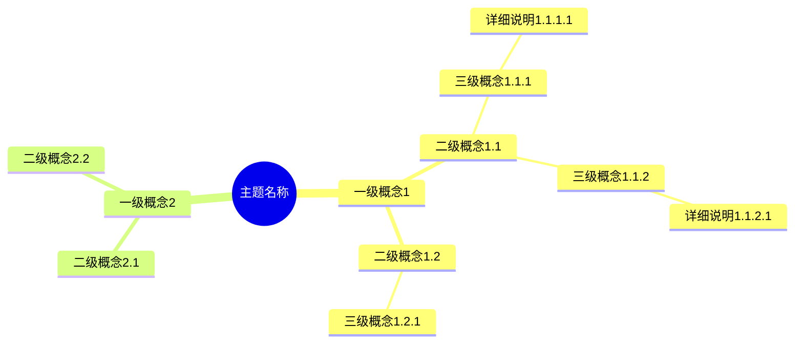
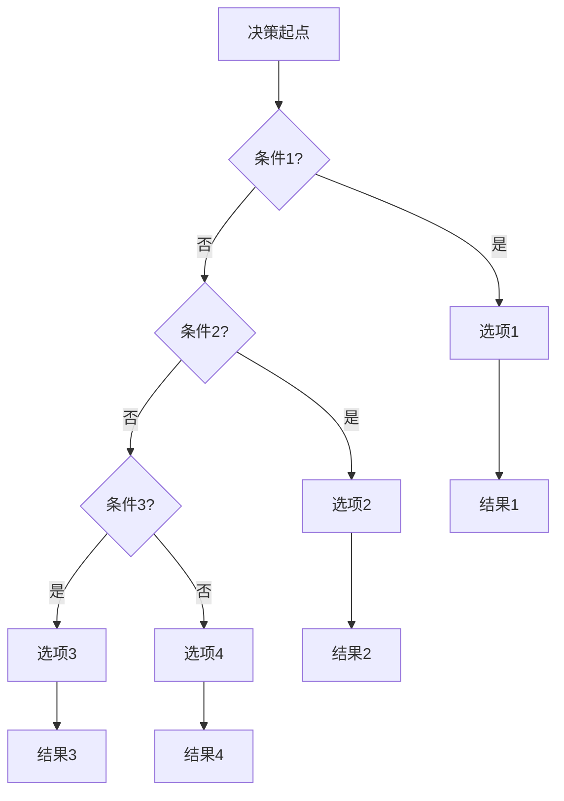
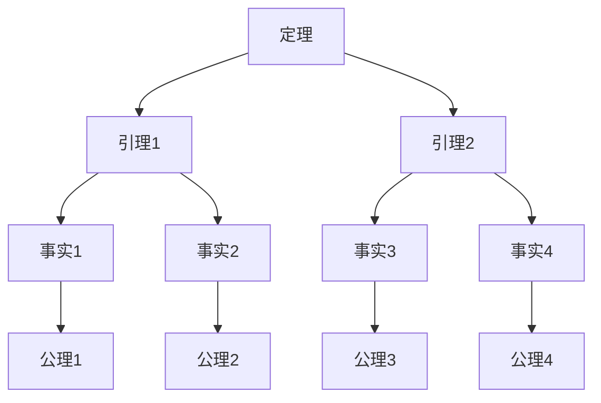
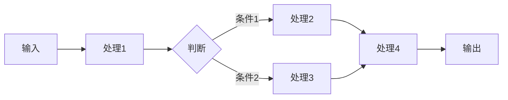
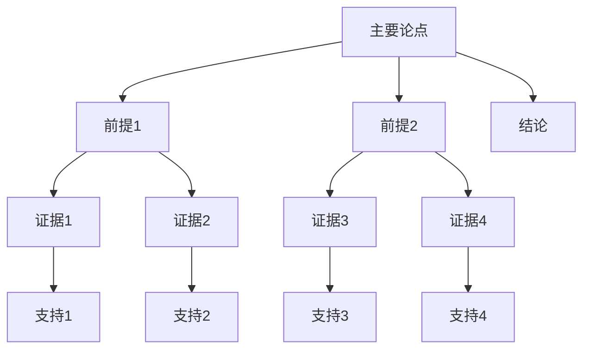

# 思维表征工具框架标准 / Mind Representation Tools Framework Standards 2025

## 🎯 **框架概述 / Framework Overview**

本文档定义项目中思维表征工具的框架标准，确保工具的一致性、完整性和可用性。

---

## 🗺️ **一、思维导图标准 / Mind Map Standards**

### 1.1 思维导图结构

**标准结构**:

### 1.2 思维导图要求

**每个思维导图必须包含**:

1. **清晰的主题**: 明确的主题名称
2. **完整的层次**: 至少3级层次结构
3. **合理的分组**: 概念分组合理，逻辑清晰
4. **详细的内容**: 每个概念有详细说明

### 1.3 思维导图类型

**1. 知识结构思维导图**: 展示主题的知识结构
**2. 概念关系思维导图**: 展示概念间的关系
**3. 应用场景思维导图**: 展示应用场景和案例

---

## 📊 **二、多维矩阵标准 / Multi-dimensional Matrix Standards**

### 2.1 矩阵类型

**1. 概念定义矩阵**: 对比概念的定义方式
**2. 属性关系矩阵**: 对比概念的属性特征
**3. 解释论证矩阵**: 对比概念的解释和论证
**4. 理论关系矩阵**: 对比理论的关系和统一框架
**5. 算法对比矩阵**: 对比算法的特征和性能

### 2.2 矩阵要求

**每个矩阵必须包含**:

1. **维度定义**: 明确每个维度的含义
2. **对比内容**: 详细的概念对比
3. **关系说明**: 概念间的关系说明
4. **统一框架**: 在统一框架中的位置

---

## 🌳 **三、决策树图标准 / Decision Tree Standards**

### 3.1 决策树结构

**标准结构**:

### 3.2 决策树要求

**每个决策树必须包含**:

1. **清晰的起点**: 明确的决策起点
2. **完整的条件**: 所有可能的条件分支
3. **明确的选项**: 每个条件对应的选项
4. **明确的结果**: 每个选项对应的结果

### 3.3 决策树类型

**1. 算法选择决策树**: 帮助选择算法
**2. 方法选择决策树**: 帮助选择方法
**3. 场景决策树**: 帮助场景决策

---

## 🌲 **四、证明树图标准 / Proof Tree Standards**

### 4.1 证明树结构

**标准结构**:

### 4.2 证明树要求

**每个证明树必须包含**:

1. **明确的定理**: 要证明的定理
2. **完整的引理**: 所有需要的引理
3. **详细的事实**: 每个引理依赖的事实
4. **基础公理**: 证明的基础公理

### 4.3 证明树类型

**1. 定理证明树**: 展示定理的证明结构
**2. 算法正确性证明树**: 展示算法的正确性证明
**3. 性质证明树**: 展示性质的证明结构

---

## 🔄 **五、控制执行数据流图标准 / Control Flow & Data Flow Diagram Standards**

### 5.1 数据流图结构

**标准结构**:

### 5.2 数据流图要求

**每个数据流图必须包含**:

1. **明确的输入**: 算法的输入
2. **完整的处理**: 所有处理步骤
3. **清晰的判断**: 所有判断条件
4. **明确的输出**: 算法的输出

### 5.3 数据流图类型

**1. 算法执行流程**: 展示算法的执行流程
**2. 系统控制流程**: 展示系统的控制流程
**3. 数据流转过程**: 展示数据的流转过程

---

## 🧠 **六、论证思维图标准 / Argumentation Map Standards**

### 6.1 论证思维图结构

**标准结构**:

### 6.2 论证思维图要求

**每个论证思维图必须包含**:

1. **明确的主要论点**: 要论证的主要论点
2. **完整的前提**: 所有前提条件
3. **详细的证据**: 每个前提的证据
4. **明确的支持**: 每个证据的支持
5. **明确的结论**: 论证的结论

### 6.3 论证思维图类型

**1. 主题论证思维图**: 展示主题的论证脉络
**2. 定理论证思维图**: 展示定理的论证结构
**3. 应用论证思维图**: 展示应用的论证逻辑

---

## 📋 **七、工具创建标准 / Tool Creation Standards**

### 7.1 工具完整性标准

**每个主题必须包含**:

1. **思维导图**: 至少1个完整的知识结构思维导图
2. **多维矩阵**: 至少2-3个概念多维对比矩阵
3. **决策树**: 至少1个算法/方法选择决策树
4. **证明树**: 至少1个重要定理的证明树
5. **数据流图**: 至少1个算法执行流程图
6. **论证思维图**: 至少1个主题论证思维图

### 7.2 工具质量标准

**每个工具必须满足**:

1. **清晰的结构**: 工具结构清晰，层次分明
2. **完整的内容**: 内容完整，覆盖所有关键点
3. **准确的表达**: 表达准确，符合理论标准
4. **直观的可视化**: 可视化直观，易于理解

### 7.3 工具一致性标准

**所有工具必须符合**:

1. **格式一致**: 使用统一的格式和风格
2. **符号一致**: 使用统一的符号和标记
3. **结构一致**: 使用统一的结构和组织方式

---

## 🎯 **八、工具应用标准 / Tool Application Standards**

### 8.1 工具使用场景

**工具适用于**:

1. **概念理解**: 帮助理解概念的定义和关系
2. **理论对比**: 帮助对比不同理论的特征
3. **算法选择**: 帮助选择适合的算法
4. **方法选择**: 帮助选择适合的方法
5. **场景决策**: 帮助场景决策

### 8.2 工具创建流程

**创建流程**:

1. **确定工具类型**: 选择需要的工具类型
2. **确定工具内容**: 确定工具要表达的内容
3. **创建工具结构**: 创建工具的结构框架
4. **填充工具内容**: 详细填写工具内容
5. **验证工具质量**: 验证工具的完整性和准确性

### 8.3 工具验证标准

**验证标准**:

1. **完整性检查**: 检查工具内容是否完整
2. **准确性检查**: 检查工具内容是否准确
3. **一致性检查**: 检查工具格式是否一致
4. **可用性检查**: 检查工具是否易于理解和使用

---

**文档创建时间**: 2025年1月
**最后更新**: 2025年1月
**维护者**: GraphNetWorkCommunicate项目组
**状态**: ✅ 框架标准定义完成
