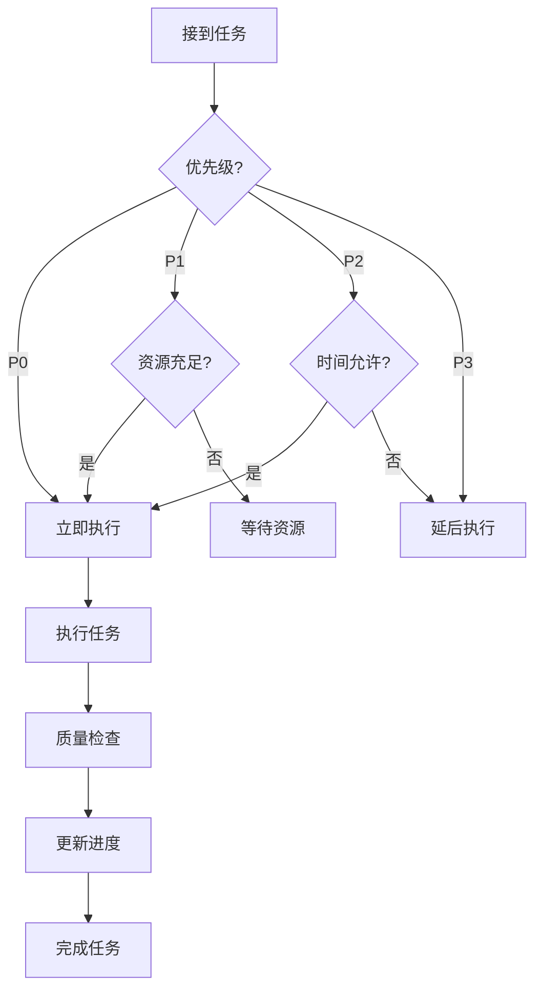

# 任务执行快速指南 / Task Execution Quick Guide 2025

## 🎯 **快速开始 / Quick Start**

本文档提供任务执行的快速参考指南，帮助团队成员快速了解如何执行任务和推进项目。

---

## 📋 **一、任务执行流程 / Task Execution Process**

### 1.1 标准执行流程

```text
1. 查看任务清单 → 2. 检查任务优先级 → 3. 评估资源需求
→ 4. 制定执行计划 → 5. 开始执行任务 → 6. 质量检查
→ 7. 更新进度 → 8. 完成任务
```

### 1.2 快速决策流程



---

## 🚀 **二、当前优先任务 / Current Priority Tasks**

### 2.1 立即执行（P0）

1. ✅ **阶段一核心模块** - 已完成
2. 🔄 **其他模块扩展** - 进行中
   - 生物网络模块扩展
   - 社会网络模块扩展
   - 形式化证明模块扩展
   - AI网络模块扩展
   - 复杂系统模块扩展

### 2.2 优先执行（P1）

1. ⏳ **阶段二：高级理论补充** - 待开始
2. ⏳ **质量保证工作** - 持续进行

---

## 📊 **三、任务状态快速查询 / Quick Task Status Query**

| 模块 | 阶段一状态 | 阶段二状态 | 阶段三状态 | 阶段四状态 |
|------|-----------|-----------|-----------|-----------|
| 图论基础 | ✅ 100% | ⏳ 60% | ⏳ 40% | ⏳ 30% |
| 网络拓扑 | ✅ 100% | ⏳ 60% | ⏳ 40% | ⏳ 30% |
| 通信协议 | ✅ 100% | ⏳ 60% | ⏳ 40% | ⏳ 30% |
| 分布式系统 | ✅ 100% | ⏳ 60% | ⏳ 40% | ⏳ 30% |
| 量子通信 | ✅ 100% | ⏳ 60% | ⏳ 40% | ⏳ 30% |
| 生物网络 | 🔄 70% | ⏳ 60% | ⏳ 40% | ⏳ 30% |
| 社会网络 | 🔄 70% | ⏳ 60% | ⏳ 40% | ⏳ 30% |
| 形式化证明 | 🔄 70% | ⏳ 60% | ⏳ 40% | ⏳ 30% |
| AI网络 | 🔄 70% | ⏳ 60% | ⏳ 40% | ⏳ 30% |
| 复杂系统 | 🔄 70% | ⏳ 60% | ⏳ 40% | ⏳ 30% |

---

## 🔗 **四、关键文档链接 / Key Document Links**

### 4.1 核心规划文档

- [全面任务梳理与推进计划-思维表征版](./全面任务梳理与推进计划-2025-思维表征版.md)
- [后续补充对标完善计划方案](./后续补充对标完善计划方案-2025.md)
- [持续发展路线图](./10-持续发展路线图.md)
- [未推进任务全面梳理](./未推进任务全面梳理-2025-最终版.md)

### 4.2 进度报告文档

- [阶段一最终完成总结](./阶段一-最终完成总结-2025.md)
- [阶段一全面完成报告](./阶段一-最新研究补充全部完成报告-2025.md)

---

## ✅ **五、质量检查清单 / Quality Checklist**

### 5.1 内容质量检查

- [ ] 内容完整性 ≥ 95%
- [ ] 内容准确性验证通过
- [ ] 最新研究覆盖（2024-2025）
- [ ] 参考文献完整且权威
- [ ] 国际标准对标通过

### 5.2 代码质量检查

- [ ] 代码可运行
- [ ] 代码注释完整
- [ ] 复杂度分析完整
- [ ] 代码示例清晰

### 5.3 文档质量检查

- [ ] 格式规范统一
- [ ] 逻辑结构清晰
- [ ] 交叉引用完整
- [ ] 图表清晰

---

**文档版本**: v1.0
**创建时间**: 2025年1月
**最后更新**: 2025年1月

---

*本文档提供任务执行的快速参考，帮助团队成员高效推进项目工作。*
