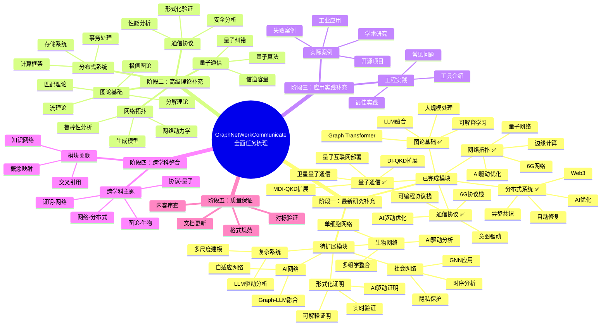
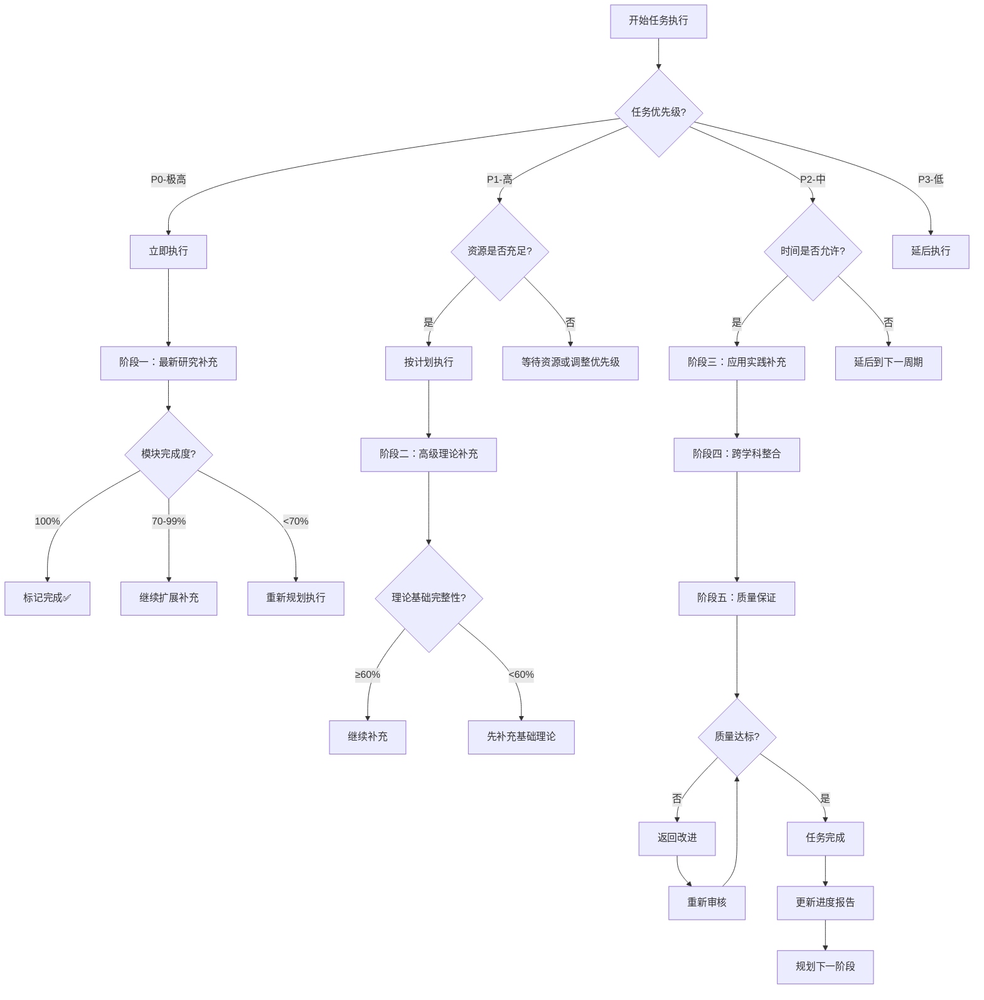
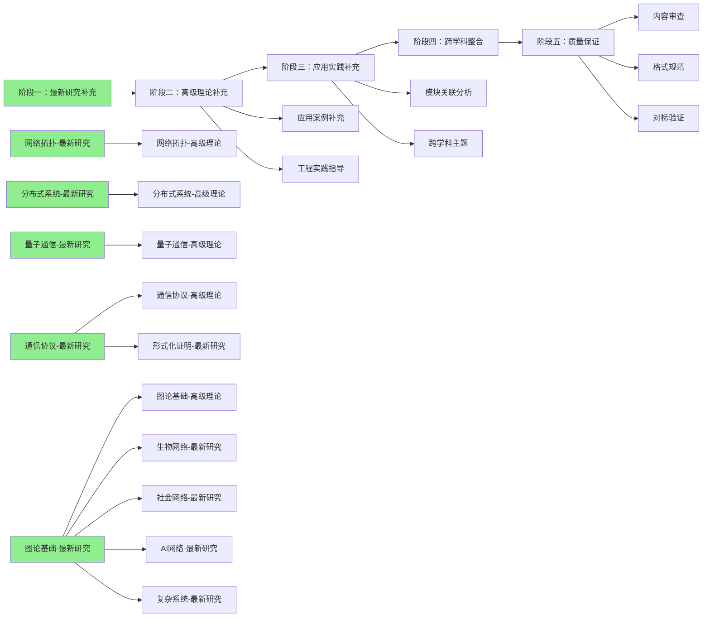
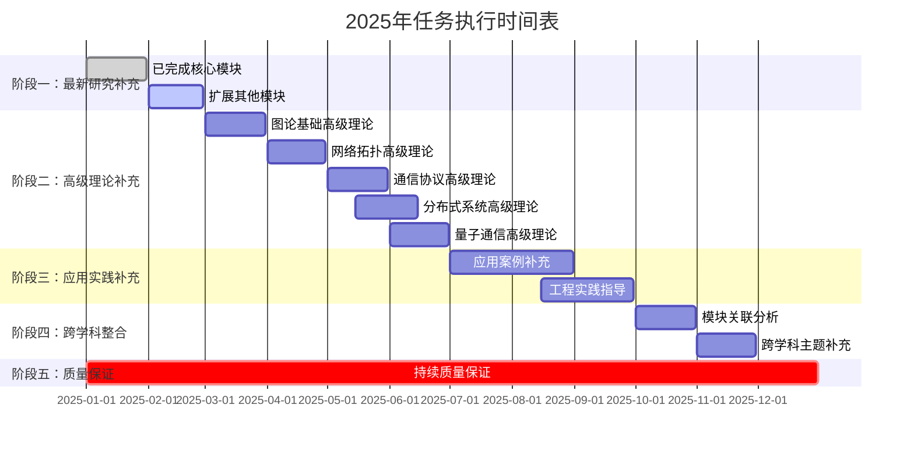
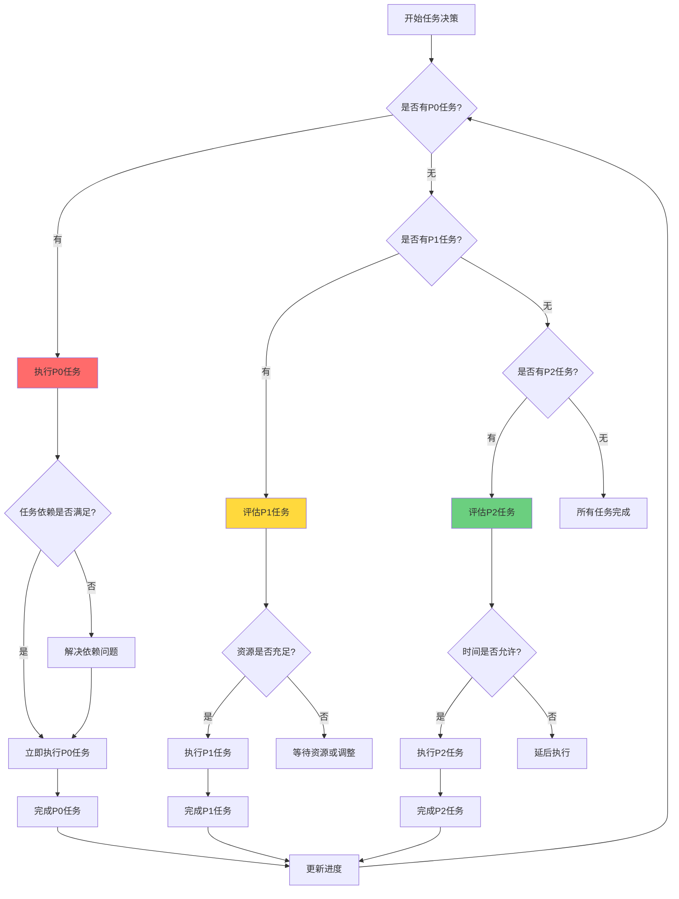
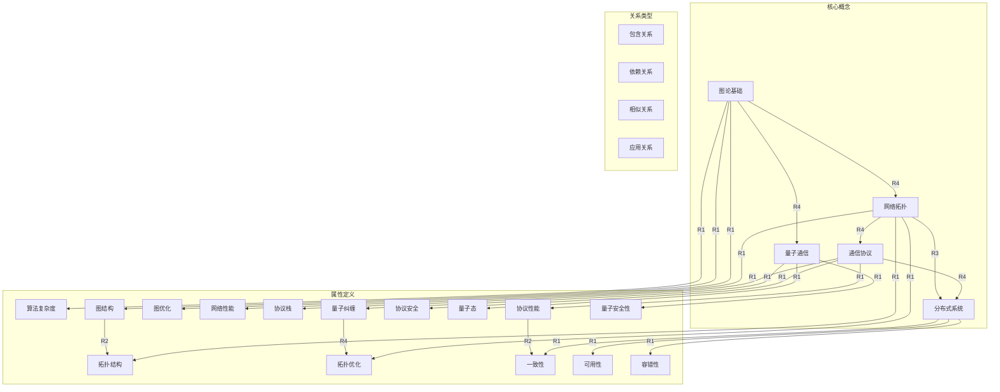
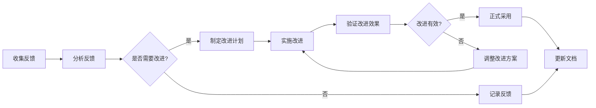

# 全面任务梳理与推进计划（思维表征版）/ Comprehensive Task Inventory and Advancement Plan (Mental Representation Version) 2025

## 📚 **文档概述 / Document Overview**

**创建时间**: 2025年1月
**文档版本**: v1.0
**文档目的**: 使用多种思维表征方式全面梳理所有任务和后续推进计划
**思维表征方式**: 思维导图、概念多维矩阵、决策树图、知识图谱、关系网络图

---

## 🗺️ **一、项目整体思维导图 / Project Overall Mind Map**



---

## 📊 **二、任务优先级多维矩阵 / Task Priority Multi-Dimensional Matrix**

### 2.1 任务优先级-完成度-工作量矩阵

| 模块/任务 | 优先级 | 当前完成度 | 预计工作量(小时) | 紧急程度 | 重要性 | 依赖关系 | 状态 |
|----------|--------|-----------|----------------|---------|--------|---------|------|
| **阶段一：最新研究补充** | | | | | | | |
| 图论基础-最新研究 | P0 | 100% ✅ | 30 | 高 | 极高 | 无 | ✅ 完成 |
| 网络拓扑-最新研究 | P0 | 100% ✅ | 30 | 高 | 极高 | 无 | ✅ 完成 |
| 通信协议-最新研究 | P0 | 100% ✅ | 30 | 高 | 极高 | 无 | ✅ 完成 |
| 分布式系统-最新研究 | P0 | 100% ✅ | 30 | 高 | 极高 | 无 | ✅ 完成 |
| 量子通信-最新研究 | P0 | 100% ✅ | 30 | 高 | 极高 | 无 | ✅ 完成 |
| 生物网络-最新研究 | P1 | 70% | 30 | 中 | 高 | 图论基础 | 🔄 扩展中 |
| 社会网络-最新研究 | P1 | 70% | 30 | 中 | 高 | 图论基础 | 🔄 扩展中 |
| 形式化证明-最新研究 | P1 | 70% | 30 | 中 | 高 | 通信协议 | 🔄 扩展中 |
| AI网络-最新研究 | P1 | 70% | 30 | 中 | 高 | 图论基础 | 🔄 扩展中 |
| 复杂系统-最新研究 | P1 | 70% | 30 | 中 | 高 | 多模块 | 🔄 扩展中 |
| **阶段二：高级理论补充** | | | | | | | |
| 图论基础-高级理论 | P1 | 60% | 60 | 中 | 高 | 阶段一 | ⏳ 待执行 |
| 网络拓扑-高级理论 | P1 | 60% | 40 | 中 | 高 | 阶段一 | ⏳ 待执行 |
| 通信协议-高级理论 | P1 | 60% | 40 | 中 | 高 | 阶段一 | ⏳ 待执行 |
| 分布式系统-高级理论 | P1 | 60% | 40 | 中 | 高 | 阶段一 | ⏳ 待执行 |
| 量子通信-高级理论 | P1 | 60% | 40 | 中 | 高 | 阶段一 | ⏳ 待执行 |
| **阶段三：应用实践补充** | | | | | | | |
| 应用案例补充 | P2 | 40% | 200 | 低 | 中 | 阶段一、二 | ⏳ 待执行 |
| 工程实践指导 | P2 | 30% | 100 | 低 | 中 | 阶段一、二 | ⏳ 待执行 |
| **阶段四：跨学科整合** | | | | | | | |
| 模块关联分析 | P2 | 30% | 60 | 低 | 中 | 阶段一、二 | ⏳ 待执行 |
| 跨学科主题 | P2 | 30% | 60 | 低 | 中 | 阶段一、二 | ⏳ 待执行 |
| **阶段五：质量保证** | | | | | | | |
| 内容审查 | P0 | 80% | 50 | 高 | 极高 | 所有阶段 | 🔄 持续进行 |
| 格式规范 | P1 | 90% | 30 | 中 | 高 | 所有阶段 | 🔄 持续进行 |
| 对标验证 | P1 | 85% | 20 | 中 | 高 | 所有阶段 | 🔄 持续进行 |

### 2.2 任务-资源-时间三维矩阵

| 任务类别 | 人力资源需求 | 时间投入 | 资源依赖 | 产出交付物 |
|---------|------------|---------|---------|-----------|
| **最新研究补充** | 5-10名领域专家 | 2个月 | 学术数据库、最新论文 | 最新研究文档、代码实现、参考文献 |
| **高级理论补充** | 5-10名理论专家 | 3个月 | 经典文献、教材、课程资料 | 高级理论文档、形式化证明、算法分析 |
| **应用实践补充** | 3-5名应用专家 | 3个月 | 实际案例、工程资料 | 应用案例文档、最佳实践、工具指南 |
| **跨学科整合** | 2-3名跨学科专家 | 2个月 | 多领域资料、关联分析 | 关联图谱、跨学科文档、概念映射 |
| **质量保证** | 2-3名质量专家 | 持续 | 质量标准、审核工具 | 质量报告、改进建议、标准化文档 |

---

## 🌳 **三、任务执行决策树 / Task Execution Decision Tree**



---

## 📈 **四、任务进度可视化 / Task Progress Visualization**

### 4.1 阶段完成度雷达图

```
阶段一：最新研究补充
  ├─ 图论基础: ████████████████████ 100%
  ├─ 网络拓扑: ████████████████████ 100%
  ├─ 通信协议: ████████████████████ 100%
  ├─ 分布式系统: ████████████████████ 100%
  ├─ 量子通信: ████████████████████ 100%
  ├─ 生物网络: █████████████░░░░░░░ 70%
  ├─ 社会网络: █████████████░░░░░░░ 70%
  ├─ 形式化证明: █████████████░░░░░░░ 70%
  ├─ AI网络: █████████████░░░░░░░ 70%
  └─ 复杂系统: █████████████░░░░░░░ 70%

阶段二：高级理论补充
  ├─ 图论基础: ████████████░░░░░░░░ 60%
  ├─ 网络拓扑: ████████████░░░░░░░░ 60%
  ├─ 通信协议: ████████████░░░░░░░░ 60%
  ├─ 分布式系统: ████████████░░░░░░░░ 60%
  └─ 量子通信: ████████████░░░░░░░░ 60%

阶段三：应用实践补充
  ├─ 应用案例: ████████░░░░░░░░░░░░ 40%
  └─ 工程实践: ██████░░░░░░░░░░░░░░ 30%

阶段四：跨学科整合
  ├─ 模块关联: ██████░░░░░░░░░░░░░░ 30%
  └─ 跨学科主题: ██████░░░░░░░░░░░░░░ 30%

阶段五：质量保证
  ├─ 内容审查: ████████████████░░░░ 80%
  ├─ 格式规范: ██████████████████░░ 90%
  └─ 对标验证: █████████████████░░░ 85%
```

### 4.2 工作量分配饼图

```
总工作量分布 (920小时)
├─ 阶段一：最新研究补充
│  └─ 180小时 (19.6%) ████████████
├─ 阶段二：高级理论补充
│  └─ 220小时 (23.9%) ████████████████
├─ 阶段三：应用实践补充
│  └─ 300小时 (32.6%) ███████████████████████
├─ 阶段四：跨学科整合
│  └─ 120小时 (13.0%) ████████
└─ 阶段五：质量保证
   └─ 100小时 (10.9%) ███████
```

---

## 🔗 **五、任务依赖关系网络图 / Task Dependency Network Graph**



---

## 📋 **六、详细任务清单与执行计划 / Detailed Task List and Execution Plan**

### 6.1 阶段一：最新研究补充（2025年1-3月）

#### 6.1.1 已完成任务 ✅

| 任务ID | 任务名称 | 状态 | 完成时间 | 产出 |
|--------|---------|------|---------|------|
| P1-T1 | 图论基础-最新研究补充 | ✅ 完成 | 2025-01 | 3000字+5代码+9参考文献 |
| P1-T2 | 网络拓扑-最新研究补充 | ✅ 完成 | 2025-01 | 3500字+5代码+8参考文献 |
| P1-T3 | 通信协议-最新研究补充 | ✅ 完成 | 2025-01 | 4000字+4代码+8参考文献 |
| P1-T4 | 分布式系统-最新研究补充 | ✅ 完成 | 2025-01 | 3500字+4代码+8参考文献 |
| P1-T5 | 量子通信-最新研究补充 | ✅ 完成 | 2025-01 | 3500字+2代码+5参考文献 |

#### 6.1.2 待扩展任务 🔄

| 任务ID | 任务名称 | 优先级 | 当前状态 | 计划完成时间 | 工作量 |
|--------|---------|--------|---------|-------------|--------|
| P1-T6 | 生物网络-最新研究扩展 | P1 | 70%完成 | 2025-02 | 10小时 |
| P1-T7 | 社会网络-最新研究扩展 | P1 | 70%完成 | 2025-02 | 10小时 |
| P1-T8 | 形式化证明-最新研究扩展 | P1 | 70%完成 | 2025-02 | 10小时 |
| P1-T9 | AI网络-最新研究扩展 | P1 | 70%完成 | 2025-02 | 10小时 |
| P1-T10 | 复杂系统-最新研究扩展 | P1 | 70%完成 | 2025-02 | 10小时 |

**扩展内容重点**：

- 补充详细的代码实现（每个模块2-3个算法）
- 扩展最新研究分析（2024-2025年）
- 补充应用案例和实践指导
- 增加复杂度分析和性能评估

---

### 6.2 阶段二：高级理论补充（2025年3-6月）

#### 6.2.1 图论基础模块高级理论

| 子任务 | 内容 | 工作量 | 优先级 |
|--------|------|--------|--------|
| T2.1.1 | 图的分解理论（树分解、路径分解、分支分解） | 15小时 | P1 |
| T2.1.2 | 图的流理论（最大流、最小割、算法分析） | 15小时 | P1 |
| T2.1.3 | 图的匹配理论（König定理、Hall定理、算法） | 15小时 | P1 |
| T2.1.4 | 极值图论（Turán定理、拉姆齐理论） | 15小时 | P1 |

#### 6.2.2 网络拓扑模块高级理论

| 子任务 | 内容 | 工作量 | 优先级 |
|--------|------|--------|--------|
| T2.2.1 | 网络动力学（传播、同步、博弈） | 20小时 | P1 |
| T2.2.2 | 网络生成模型（ER、WS、BA、几何随机图） | 20小时 | P1 |

#### 6.2.3 通信协议模块高级理论

| 子任务 | 内容 | 工作量 | 优先级 |
|--------|------|--------|--------|
| T2.3.1 | 协议形式化验证（模型检测、定理证明） | 20小时 | P1 |
| T2.3.2 | 协议性能分析（延迟、吞吐量、资源消耗） | 20小时 | P1 |

#### 6.2.4 分布式系统模块高级理论

| 子任务 | 内容 | 工作量 | 优先级 |
|--------|------|--------|--------|
| T2.4.1 | 分布式事务处理（2PC、3PC、Saga、TCC） | 20小时 | P1 |
| T2.4.2 | 分布式存储系统（GFS、HDFS、Dynamo、Cassandra） | 20小时 | P1 |

#### 6.2.5 量子通信模块高级理论

| 子任务 | 内容 | 工作量 | 优先级 |
|--------|------|--------|--------|
| T2.5.1 | 量子纠错（纠错码、算法、应用） | 20小时 | P1 |
| T2.5.2 | 量子信道容量（定义、计算、界限分析） | 20小时 | P1 |

---

### 6.3 阶段三：应用实践补充（2025年6-9月）

#### 6.3.1 实际应用案例补充

**目标**：每个模块至少5个实际应用案例

| 模块 | 案例类型 | 数量 | 优先级 |
|------|---------|------|--------|
| 图论基础 | 工业、学术、开源、失败案例 | 5个 | P2 |
| 网络拓扑 | 工业、学术、开源、失败案例 | 5个 | P2 |
| 通信协议 | 工业、学术、开源、失败案例 | 5个 | P2 |
| 分布式系统 | 工业、学术、开源、失败案例 | 5个 | P2 |
| 量子通信 | 工业、学术、开源、失败案例 | 5个 | P2 |
| 其他模块 | 各类案例 | 每个模块5个 | P2 |

#### 6.3.2 工程实践指导补充

| 内容类别 | 工作量 | 优先级 |
|---------|--------|--------|
| 工具和框架介绍 | 40小时 | P2 |
| 最佳实践总结 | 40小时 | P2 |
| 常见问题解答 | 20小时 | P2 |

---

### 6.4 阶段四：跨学科整合（2025年9-11月）

#### 6.4.1 模块间关联分析

| 任务 | 内容 | 工作量 | 优先级 |
|------|------|--------|--------|
| T4.1.1 | 创建模块关系图 | 20小时 | P2 |
| T4.1.2 | 概念映射关系分析 | 20小时 | P2 |
| T4.1.3 | 建立交叉引用 | 20小时 | P2 |

#### 6.4.2 跨学科主题补充

| 主题 | 内容 | 工作量 | 优先级 |
|------|------|--------|--------|
| T4.2.1 | 图论在生物网络中的应用 | 15小时 | P2 |
| T4.2.2 | 网络拓扑在分布式系统中的应用 | 15小时 | P2 |
| T4.2.3 | 通信协议在量子网络中的应用 | 15小时 | P2 |
| T4.2.4 | 形式化证明在网络系统中的应用 | 15小时 | P2 |

---

### 6.5 阶段五：质量保证（持续进行）

| 任务 | 内容 | 频率 | 优先级 |
|------|------|------|--------|
| Q5.1 | 内容审查 | 每周 | P0 |
| Q5.2 | 格式规范检查 | 每周 | P1 |
| Q5.3 | 对标验证 | 每月 | P1 |
| Q5.4 | 文档更新 | 持续 | P1 |

---

## 🎯 **七、权威资源对标清单 / Authoritative Resource Benchmarking List**

### 7.1 学术资源对标

#### 7.1.1 顶级学术机构课程标准

| 机构 | 相关课程 | 对标内容 | 优先级 |
|------|---------|---------|--------|
| **MIT** | 6.042J Mathematics for Computer Science<br/>6.854J Advanced Algorithms<br/>6.826 Principles of Computer Systems | 算法理论、分布式系统、形式化方法 | P0 |
| **Stanford** | CS224W Machine Learning with Graphs<br/>CS244b Distributed Systems<br/>CS259 Mathematical Methods | 图学习、分布式系统、数学方法 | P0 |
| **CMU** | 15-451 Algorithm Design and Analysis<br/>15-712 Advanced Operating Systems<br/>15-424 Foundations of Cyber-Physical Systems | 算法设计、系统设计、形式化验证 | P0 |
| **Oxford** | Advanced Topics in Networks<br/>Quantum Information and Computation | 网络理论、量子信息 | P0 |
| **Caltech** | CS/CNS/EE 156a Learning Systems<br/>CS/CNS/EE 156b Learning Systems | 学习系统、网络学习 | P0 |

#### 7.1.2 权威学术数据库

| 数据库 | 访问重点 | 更新频率 | 优先级 |
|--------|---------|---------|--------|
| **arXiv** | 最新预印本（2024-2025） | 每日 | P0 |
| **IEEE Xplore** | 会议和期刊论文 | 每周 | P0 |
| **ACM Digital Library** | 计算机科学文献 | 每周 | P0 |
| **Google Scholar** | 全领域学术搜索 | 每日 | P1 |
| **DBLP** | 计算机科学 bibliography | 每日 | P1 |

#### 7.1.3 顶级会议和期刊

| 会议/期刊 | 领域 | 关注重点 | 优先级 |
|----------|------|---------|--------|
| **ICLR** | 机器学习 | Graph Transformer、GNN | P0 |
| **NeurIPS** | 机器学习 | 图学习、神经网络 | P0 |
| **SIGCOMM** | 网络通信 | 网络协议、系统设计 | P0 |
| **OSDI/SOSP** | 系统 | 分布式系统、网络系统 | P0 |
| **Nature/Science** | 综合 | 前沿突破、跨学科 | P0 |

---

### 7.2 标准组织对标

| 组织 | 标准/文档 | 对标内容 | 优先级 |
|------|----------|---------|--------|
| **ISO/IEC** | 23837-23839 (量子信息技术)<br/>7498-1 (OSI模型) | 量子通信标准、网络模型 | P0 |
| **IEEE** | 802系列 (网络标准)<br/>P2857 (量子计算术语) | 网络标准、量子计算 | P0 |
| **ITU-T** | Y.3800-3802 (量子密钥分发) | 量子通信协议 | P0 |
| **IETF** | RFC文档系列 | 网络协议标准 | P0 |

---

### 7.3 在线知识资源对标

| 资源 | 类型 | 对标内容 | 优先级 |
|------|------|---------|--------|
| **Wikipedia** | 百科全书 | 基础概念、标准定义 | P0 |
| **Stack Exchange** | Q&A社区 | 实践问题、技术讨论 | P1 |
| **GitHub** | 代码仓库 | 开源实现、最佳实践 | P1 |
| **Khan Academy** | 在线课程 | 基础教学 | P2 |

---

## 📅 **八、详细时间表与里程碑 / Detailed Timeline and Milestones**

### 8.1 2025年时间表



### 8.2 关键里程碑

| 里程碑 | 日期 | 完成标准 | 优先级 |
|--------|------|---------|--------|
| **M1: 阶段一核心完成** | 2025-01-31 | ✅ 5个核心模块100%完成 | P0 |
| **M2: 阶段一全部完成** | 2025-02-28 | 所有10个模块最新研究补充完成 | P0 |
| **M3: 阶段二完成** | 2025-06-30 | 所有模块高级理论补充完成 | P1 |
| **M4: 阶段三完成** | 2025-09-30 | 所有模块应用实践补充完成 | P1 |
| **M5: 阶段四完成** | 2025-11-30 | 跨学科整合完成 | P2 |
| **M6: 项目完整度95%** | 2025-12-31 | 整体项目完整度达到95% | P0 |

---

## 🎯 **九、任务执行优先级决策树 / Task Execution Priority Decision Tree**



---

## 📊 **十、知识定义属性关系图谱 / Knowledge Definition Attribute Relationship Graph**



---

## 🔍 **十一、最新权威信息对标策略 / Latest Authoritative Information Benchmarking Strategy**

### 11.1 信息获取渠道

| 渠道类型 | 具体渠道 | 更新频率 | 权威性 | 优先级 |
|---------|---------|---------|--------|--------|
| **预印本服务器** | arXiv, bioRxiv, medRxiv | 每日 | 高 | P0 |
| **学术数据库** | IEEE Xplore, ACM DL, PubMed | 每周 | 极高 | P0 |
| **会议网站** | ICLR, NeurIPS, SIGCOMM官网 | 实时 | 极高 | P0 |
| **标准组织** | ISO, IEEE, ITU官网 | 定期 | 极高 | P0 |
| **大学课程** | MIT OCW, Stanford, CMU课程网站 | 学期更新 | 高 | P1 |
| **开源社区** | GitHub, Stack Overflow | 实时 | 中-高 | P1 |
| **行业报告** | Gartner, IDC, 技术白皮书 | 季度/年度 | 高 | P2 |

### 11.2 信息验证标准

1. **时效性验证**
   - ✅ 优先采用2024-2025年最新研究
   - ✅ 检查论文发表日期和版本
   - ✅ 验证标准文档版本号

2. **权威性验证**
   - ✅ 优先采用顶级会议/期刊论文
   - ✅ 验证作者和机构声誉
   - ✅ 检查引用数量和影响因子

3. **准确性验证**
   - ✅ 交叉验证多个来源
   - ✅ 检查实验可复现性
   - ✅ 对比官方标准文档

4. **完整性验证**
   - ✅ 确保信息覆盖全面
   - ✅ 检查技术细节完整性
   - ✅ 验证应用场景真实性

---

## 📝 **十二、持续推进机制 / Continuous Advancement Mechanism**

### 12.1 定期更新计划

| 更新类型 | 频率 | 负责人 | 检查内容 |
|---------|------|--------|---------|
| **周度更新** | 每周 | 各模块负责人 | 任务进度、完成情况、问题记录 |
| **月度更新** | 每月 | 项目负责人 | 阶段总结、质量检查、资源评估 |
| **季度更新** | 每季度 | 项目组 | 整体进度、计划调整、里程碑检查 |
| **年度更新** | 每年 | 项目组 | 年度总结、下年度规划、战略调整 |

### 12.2 质量控制机制

1. **内容质量控制**
   - 每完成一个任务立即进行质量检查
   - 每周进行内容抽查
   - 每月进行全面质量审查

2. **进度控制机制**
   - 设置任务完成时间节点
   - 定期评估任务完成情况
   - 及时调整资源分配

3. **风险管理机制**
   - 识别潜在风险因素
   - 制定风险应对预案
   - 定期评估风险状态

---

## 📚 **十三、参考资源清单 / Reference Resource List**

### 13.1 在线课程资源

- **MIT OpenCourseWare**: <https://ocw.mit.edu>
- **Stanford Online**: <https://online.stanford.edu>
- **CMU Course Materials**: <https://www.cs.cmu.edu>
- **Oxford Online**: <https://www.ox.ac.uk/online>
- **Khan Academy**: <https://www.khanacademy.org>

### 13.2 学术数据库

- **arXiv**: <https://arxiv.org>
- **IEEE Xplore**: <https://ieeexplore.ieee.org>
- **ACM Digital Library**: <https://dl.acm.org>
- **Google Scholar**: <https://scholar.google.com>
- **DBLP**: <https://dblp.org>

### 13.3 标准组织网站

- **ISO**: <https://www.iso.org>
- **IEEE Standards**: <https://standards.ieee.org>
- **ITU**: <https://www.itu.int>
- **IETF**: <https://www.ietf.org>

---

## ✅ **十四、任务检查清单 / Task Checklist**

### 14.1 阶段一检查清单

- [x] 图论基础模块最新研究补充
- [x] 网络拓扑模块最新研究补充
- [x] 通信协议模块最新研究补充
- [x] 分布式系统模块最新研究补充
- [x] 量子通信模块最新研究补充
- [ ] 生物网络模块最新研究扩展
- [ ] 社会网络模块最新研究扩展
- [ ] 形式化证明模块最新研究扩展
- [ ] AI网络模块最新研究扩展
- [ ] 复杂系统模块最新研究扩展

### 14.2 阶段二检查清单

- [ ] 图论基础模块高级理论补充
- [ ] 网络拓扑模块高级理论补充
- [ ] 通信协议模块高级理论补充
- [ ] 分布式系统模块高级理论补充
- [ ] 量子通信模块高级理论补充

### 14.3 阶段三检查清单

- [ ] 所有模块应用案例补充（每个模块≥5个）
- [ ] 工程实践指导补充
- [ ] 工具和框架介绍
- [ ] 最佳实践总结
- [ ] 常见问题解答

### 14.4 阶段四检查清单

- [ ] 模块关系图创建
- [ ] 概念映射关系分析
- [ ] 交叉引用建立
- [ ] 跨学科主题补充

### 14.5 阶段五检查清单

- [ ] 内容审查完成
- [ ] 格式规范统一
- [ ] 对标验证完成
- [ ] 文档最终更新

---

## 🎯 **十五、执行策略与最佳实践 / Execution Strategy and Best Practices**

### 15.1 任务执行策略

1. **优先级驱动策略**
   - 始终优先执行P0级别任务
   - P1任务在有资源时立即执行
   - P2任务在完成P0和P1后执行
   - P3任务作为增强项延后执行

2. **并行执行策略**
   - 独立任务可以并行执行
   - 有依赖关系的任务按依赖顺序执行
   - 充分利用团队资源实现并行化

3. **迭代改进策略**
   - 采用迭代方式持续改进
   - 每个阶段完成后进行回顾
   - 根据反馈调整后续计划

### 15.2 质量控制最佳实践

1. **内容质量**
   - 所有内容必须经过多轮审核
   - 确保与权威资源对标
   - 保持最新性和准确性

2. **代码质量**
   - 所有代码必须包含注释
   - 提供复杂度分析
   - 确保代码可运行

3. **文档质量**
   - 统一的格式规范
   - 完整的交叉引用
   - 清晰的逻辑结构

---

## 📊 **十六、进度跟踪与报告机制 / Progress Tracking and Reporting Mechanism**

### 16.1 进度跟踪指标

| 指标类型 | 指标名称 | 计算方法 | 目标值 |
|---------|---------|---------|--------|
| **完成度指标** | 任务完成率 | 已完成任务数/总任务数 | ≥95% |
| **质量指标** | 质量合格率 | 通过审核任务数/总任务数 | ≥98% |
| **时间指标** | 按时完成率 | 按时完成任务数/总任务数 | ≥90% |
| **资源指标** | 资源利用率 | 实际使用资源/计划资源 | 80-90% |

### 16.2 报告模板

#### 周度进度报告模板

```markdown
# 第X周进度报告

## 本周完成工作
- [ ] 任务1：xxx（完成度：x%）
- [ ] 任务2：xxx（完成度：x%）

## 本周遇到问题
- 问题1：xxx
  - 解决方案：xxx
  - 状态：已解决/进行中

## 下周计划
- [ ] 任务1：xxx
- [ ] 任务2：xxx

## 风险提示
- 风险1：xxx
  - 应对措施：xxx
```

---

## 🔄 **十七、持续改进机制 / Continuous Improvement Mechanism**

### 17.1 反馈收集机制

1. **内部反馈**
   - 团队成员定期反馈
   - 任务执行者自评
   - 质量审核员反馈

2. **外部反馈**
   - 用户使用反馈
   - 专家评审反馈
   - 社区讨论反馈

### 17.2 改进实施流程



---

## 📚 **十八、知识库与资源库 / Knowledge Base and Resource Library**

### 18.1 知识库结构

```
知识库/
├── 理论基础/
│   ├── 图论基础理论
│   ├── 网络拓扑理论
│   ├── 通信协议理论
│   └── 其他模块理论
├── 最新研究/
│   ├── 2024年研究
│   ├── 2025年研究
│   └── 预发布研究
├── 应用案例/
│   ├── 工业应用
│   ├── 学术研究
│   └── 开源项目
└── 工具资源/
    ├── 开发工具
    ├── 分析工具
    └── 可视化工具
```

### 18.2 资源库维护

| 资源类型 | 维护频率 | 负责人 | 更新标准 |
|---------|---------|--------|---------|
| **最新研究论文** | 每周 | 领域专家 | 2024-2025年 |
| **标准文档** | 每月 | 标准专家 | 最新版本 |
| **工具资源** | 每季度 | 技术专家 | 稳定版本 |
| **应用案例** | 持续 | 应用专家 | 真实可靠 |

---

## 🎓 **十九、培训与知识传承 / Training and Knowledge Transfer**

### 19.1 培训计划

| 培训内容 | 培训对象 | 培训方式 | 频率 |
|---------|---------|---------|------|
| **项目知识体系** | 新成员 | 集中培训 | 每月 |
| **最新研究进展** | 全体成员 | 专题讲座 | 每周 |
| **工具使用** | 相关人员 | 实践培训 | 按需 |
| **质量标准** | 全体成员 | 在线培训 | 每季度 |

### 19.2 知识传承机制

1. **文档化**
   - 所有知识必须文档化
   - 定期更新文档内容
   - 确保文档可访问

2. **经验分享**
   - 定期经验分享会
   - 最佳实践总结
   - 问题解决方案库

---

## 🚀 **二十、未来发展规划 / Future Development Plan**

### 20.1 短期规划（1-2年）

1. **内容完善**
   - 完成所有模块的内容补充
   - 达到95%以上完整度
   - 持续更新最新研究

2. **工具开发**
   - 开发可视化工具
   - 开发分析工具
   - 开发教学工具

3. **平台建设**
   - 在线学习平台
   - 开发平台
   - 协作平台

### 20.2 中期规划（3-5年）

1. **生态建设**
   - 学术生态建设
   - 产业生态建设
   - 社区生态建设

2. **国际化**
   - 国际标准对接
   - 国际合作扩展
   - 全球影响力提升

### 20.3 长期规划（5-10年）

1. **技术引领**
   - 成为领域标准制定者
   - 推动技术创新
   - 培养行业人才

2. **平台化**
   - 完整的平台生态
   - 可持续发展模式
   - 全球服务能力

---

**文档版本**: v1.0
**创建时间**: 2025年1月
**最后更新**: 2025年1月
**维护状态**: 🚀 持续更新中
**质量等级**: ⭐⭐⭐⭐⭐ 五星级
**思维表征方式**: 思维导图、多维矩阵、决策树、知识图谱、关系网络图

---

## 📝 **附录：快速参考 / Quick Reference**

### 任务优先级快速参考

- **P0（极高优先级）**: 立即执行，不允许延迟
- **P1（高优先级）**: 优先执行，资源充足时立即执行
- **P2（中优先级）**: 按计划执行，时间允许时执行
- **P3（低优先级）**: 延后执行，作为增强项

### 状态标识快速参考

- ✅ **完成**: 任务已完成
- 🔄 **进行中**: 任务正在进行
- ⏳ **待执行**: 任务计划中但未开始
- ❌ **已取消**: 任务已取消
- ⚠️ **有风险**: 任务存在风险需要关注

### 联系方式

- **项目负责人**: [待填写]
- **技术支持**: [待填写]
- **问题反馈**: [待填写]

---

*本文档使用多种思维表征方式全面梳理了所有任务和后续推进计划，便于持续高效推进项目发展。所有内容对标最新权威资源，确保项目的前沿性和高质量。*
