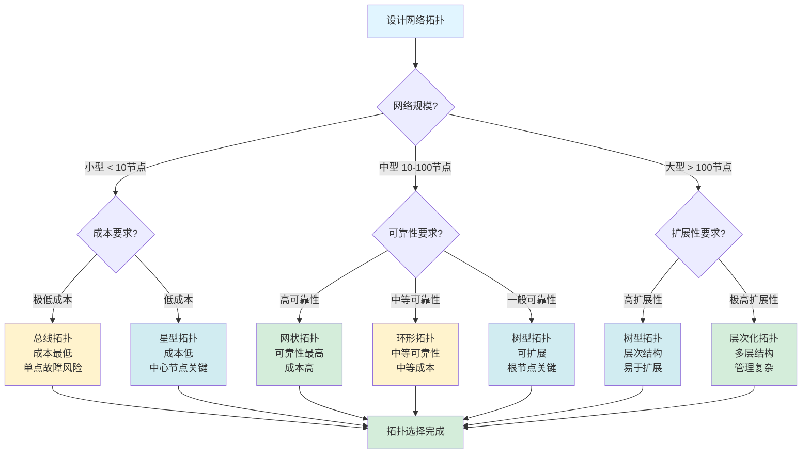
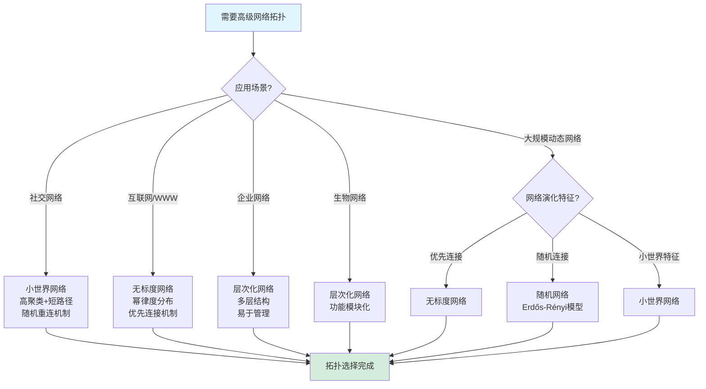
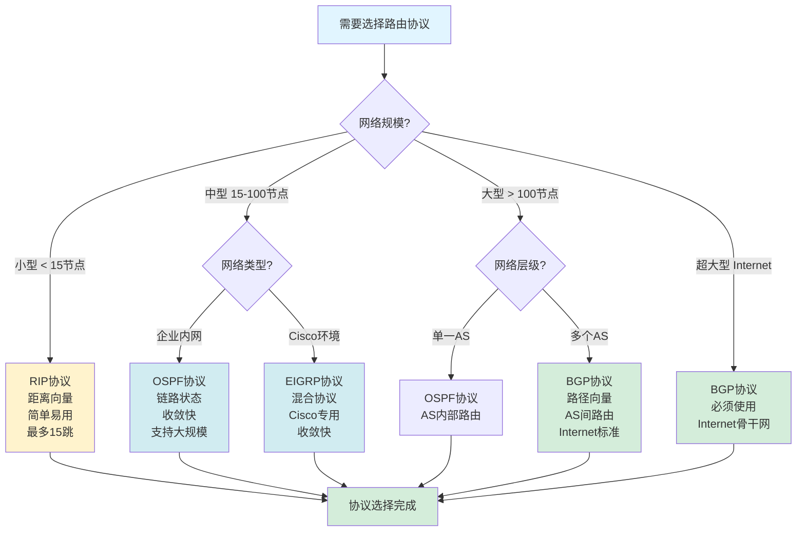
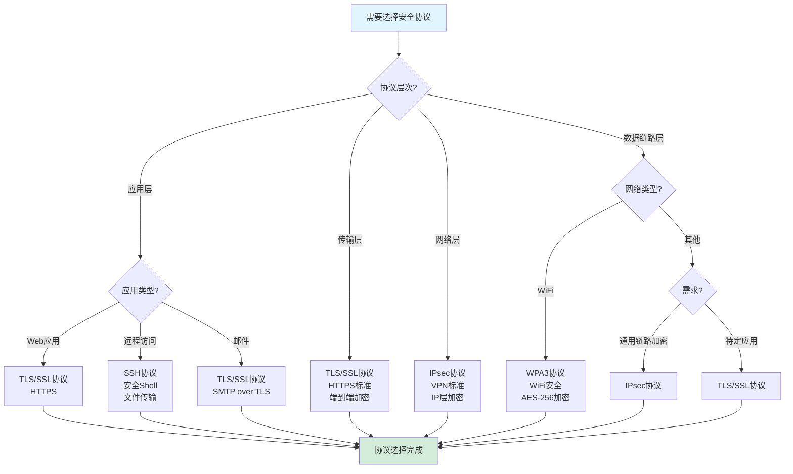
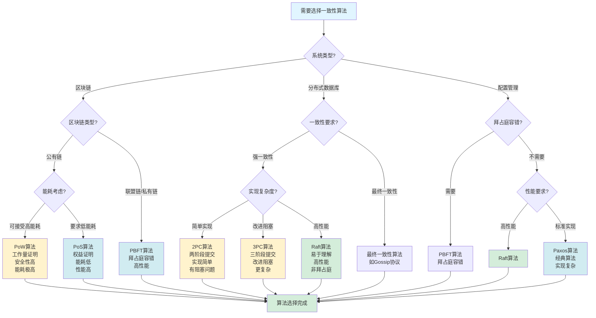
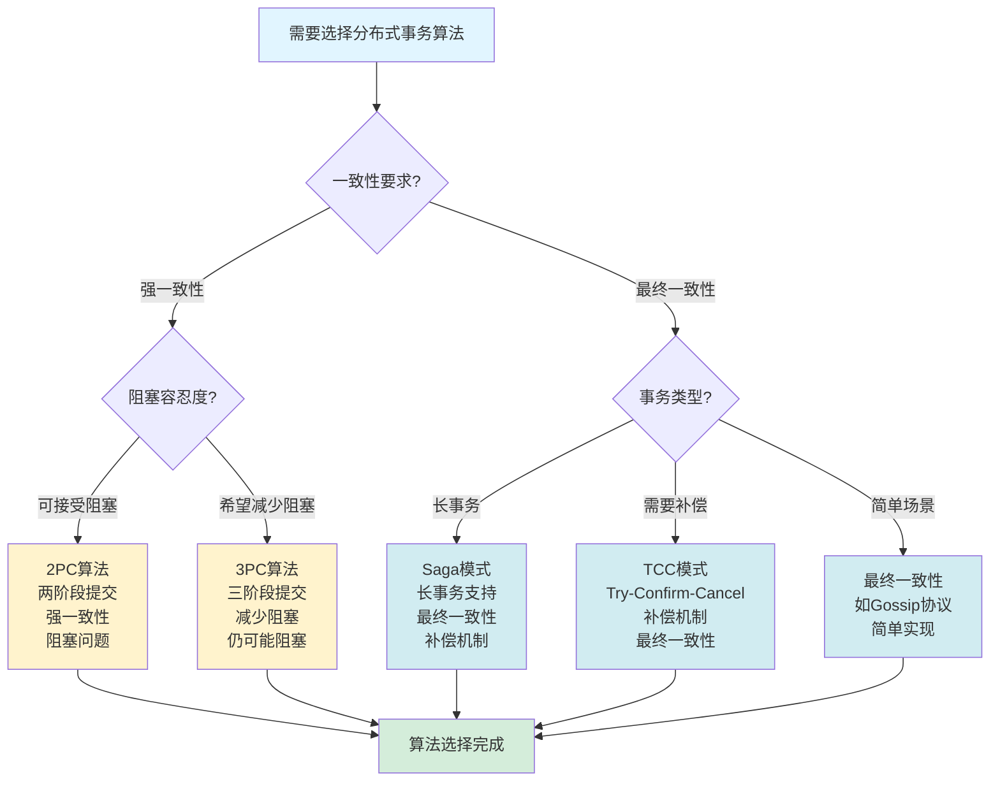
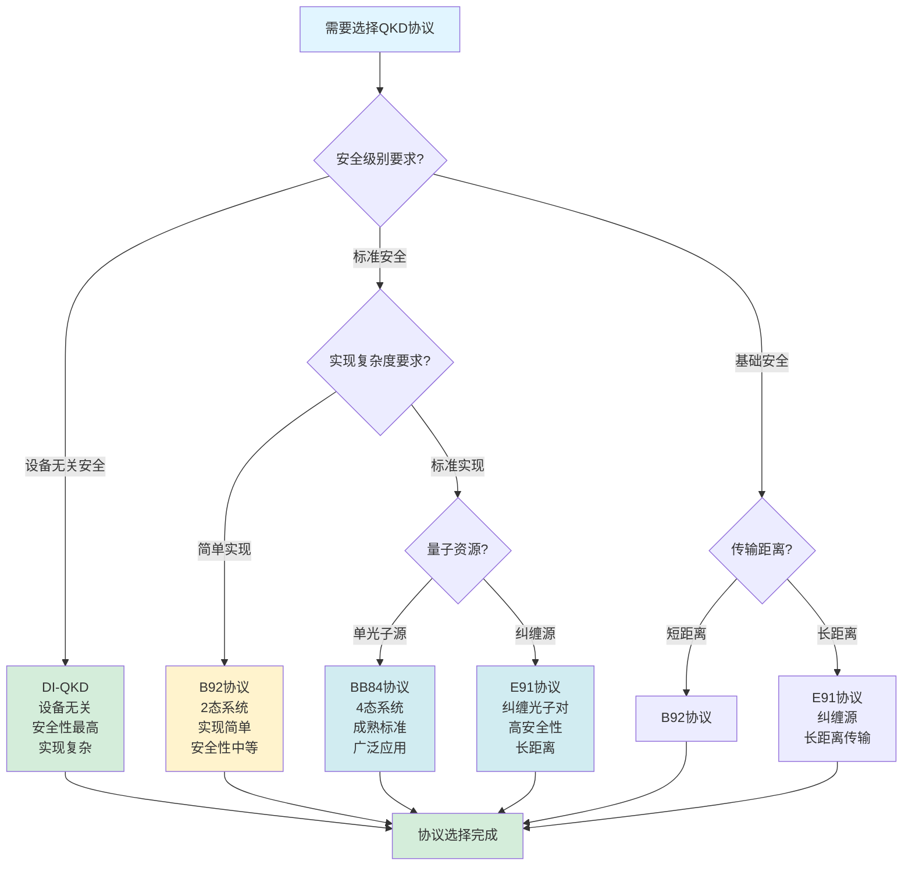
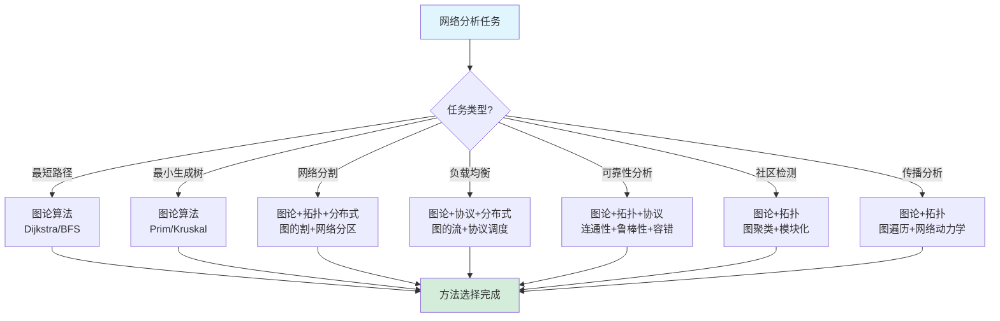
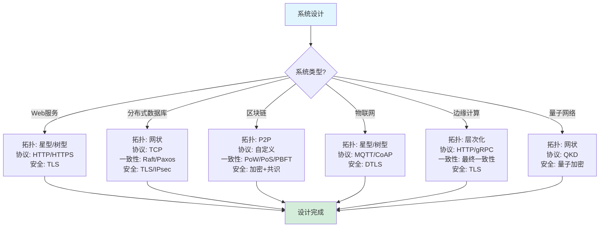

# 决策树图集合 / Decision Tree Collection 2025

## 📊 **概述 / Overview**

本文档提供GraphNetWorkCommunicate项目中关键决策场景的决策树图，帮助在复杂情况下快速做出正确的方法、算法、协议选择。

**创建时间**: 2025年12月5日
**状态**: 🚀 持续更新中

---

## 🎯 **一、图论算法选择决策树 / Graph Algorithm Selection Decision Trees**

### 1.1 最短路径算法选择决策树

```mermaid
graph TD
    Start[需要求解最短路径问题] --> Q1{图是否有负权边?}
    Q1 -->|有负权边| Q2{需要单源还是全对?}
    Q1 -->|无负权边| Q3{需要单源还是全对?}

    Q2 -->|单源| Q4{需要检测负环?}
    Q2 -->|全对| Floyd[Floyd-Warshall算法<br/>复杂度: O(V³)]

    Q4 -->|是| BellmanFord[Bellman-Ford算法<br/>复杂度: O(VE)<br/>支持负环检测]
    Q4 -->|否| BellmanFord

    Q3 -->|单源| Q5{是否有好的启发式函数?}
    Q3 -->|全对| Floyd2[Floyd-Warshall算法<br/>复杂度: O(V³)<br/>适合中小规模图]

    Q5 -->|有启发式| Q6{图规模?}
    Q5 -->|无启发式| Q7{图规模?}

    Q6 -->|小-中等| AStar[A*算法<br/>复杂度: O(b^d)<br/>适合路径规划]
    Q6 -->|大规模| AStar

    Q7 -->|小规模 < 1000| Dijkstra[Dijkstra算法<br/>复杂度: O(V²) 或 O((V+E)log V)]
    Q7 -->|大规模 > 10000| OptimizedDijkstra[优化的Dijkstra<br/>使用优先队列<br/>复杂度: O((V+E)log V)]

    BellmanFord --> End[算法选择完成]
    Floyd --> End
    Floyd2 --> End
    AStar --> End
    Dijkstra --> End
    OptimizedDijkstra --> End

    style Start fill:#e1f5ff
    style End fill:#d4edda
    style BellmanFord fill:#fff3cd
    style Floyd fill:#fff3cd
    style Floyd2 fill:#fff3cd
    style AStar fill:#d1ecf1
    style Dijkstra fill:#d1ecf1
    style OptimizedDijkstra fill:#d1ecf1
```

**决策说明**:
- **负权边场景**: 必须使用Bellman-Ford或Floyd-Warshall
- **大规模图**: 优先考虑优化的Dijkstra或A*算法
- **路径规划**: 如果有启发式函数，A*算法效果最好

### 1.2 最小生成树算法选择决策树

```mermaid
graph TD
    Start[需要求解最小生成树问题] --> Q1{图是否为连通图?}
    Q1 -->|否| Error[错误: 非连通图无法生成MST]
    Q1 -->|是| Q2{图的边数密度?}

    Q2 -->|密集图<br/>E > V log V| Q3{是否需要并行计算?}
    Q2 -->|稀疏图<br/>E < V log V| Kruskal[Kruskal算法<br/>复杂度: O(E log E)<br/>适合稀疏图]

    Q3 -->|是| Boruvka[Borůvka算法<br/>复杂度: O(E log V)<br/>并行友好]
    Q3 -->|否| Prim[Prim算法<br/>复杂度: O(V²) 或 O((V+E)log V)<br/>适合密集图]

    Q2 -->|中等密度| Q4{实现复杂度要求?}
    Q4 -->|简单实现| Kruskal2[Kruskal算法<br/>使用并查集+排序<br/>实现简单]
    Q4 -->|性能优先| Prim2[Prim算法<br/>使用优先队列<br/>性能更好]

    Kruskal --> End[算法选择完成]
    Boruvka --> End
    Prim --> End
    Kruskal2 --> End
    Prim2 --> End
    Error --> End

    style Start fill:#e1f5ff
    style End fill:#d4edda
    style Error fill:#f8d7da
    style Kruskal fill:#d1ecf1
    style Kruskal2 fill:#d1ecf1
    style Prim fill:#d1ecf1
    style Prim2 fill:#d1ecf1
    style Boruvka fill:#fff3cd
```

**决策说明**:
- **稀疏图**: Kruskal算法更优
- **密集图**: Prim算法更优
- **并行计算**: Borůvka算法适合

### 1.3 图遍历算法选择决策树

```mermaid
graph TD
    Start[需要遍历图] --> Q1{问题类型?}

    Q1 -->|最短路径(无权图)| BFS[BFS广度优先搜索<br/>使用队列<br/>找到最短路径]
    Q1 -->|拓扑排序| DFS[DFS深度优先搜索<br/>使用栈<br/>后序遍历]
    Q1 -->|环检测| DFS2[DFS深度优先搜索<br/>检测回边]
    Q1 -->|连通性检测| Q2{需要最短路径信息?}
    Q1 -->|回溯问题| DFS3[DFS深度优先搜索<br/>支持回溯]

    Q2 -->|需要| BFS2[BFS广度优先搜索]
    Q2 -->|不需要| DFS4[DFS深度优先搜索<br/>实现更简单]

    Q1 -->|层次遍历| BFS3[BFS广度优先搜索<br/>按层次遍历]
    Q1 -->|记忆化搜索| DFS5[DFS深度优先搜索<br/>递归实现方便]

    BFS --> End[算法选择完成]
    DFS --> End
    DFS2 --> End
    BFS2 --> End
    DFS4 --> End
    BFS3 --> End
    DFS5 --> End
    DFS3 --> End

    style Start fill:#e1f5ff
    style End fill:#d4edda
    style BFS fill:#d1ecf1
    style BFS2 fill:#d1ecf1
    style BFS3 fill:#d1ecf1
    style DFS fill:#fff3cd
    style DFS2 fill:#fff3cd
    style DFS3 fill:#fff3cd
    style DFS4 fill:#fff3cd
    style DFS5 fill:#fff3cd
```

---

## 🌐 **二、网络拓扑选择决策树 / Network Topology Selection Decision Trees**

### 2.1 基本网络拓扑选择决策树



### 2.2 高级网络拓扑选择决策树



---

## 📡 **三、通信协议选择决策树 / Communication Protocol Selection Decision Trees**

### 3.1 路由协议选择决策树



### 3.2 安全协议选择决策树



---

## 🔄 **四、分布式系统算法选择决策树 / Distributed System Algorithm Selection Decision Trees**

### 4.1 一致性算法选择决策树



### 4.2 分布式事务算法选择决策树



---

## ⚛️ **五、量子通信协议选择决策树 / Quantum Communication Protocol Selection Decision Trees**

### 5.1 量子密钥分发协议选择决策树



---

## 🎯 **六、应用场景方法选择决策树 / Application Scenario Method Selection Decision Trees**

### 6.1 网络分析任务方法选择决策树



### 6.2 系统设计方法选择决策树



---

## 📚 **七、总结 / Summary**

本文档提供了GraphNetWorkCommunicate项目中关键决策场景的决策树集合，涵盖：

1. **图论算法选择**: 最短路径、最小生成树、图遍历
2. **网络拓扑选择**: 基本拓扑、高级拓扑
3. **通信协议选择**: 路由协议、安全协议
4. **分布式算法选择**: 一致性算法、事务算法
5. **量子协议选择**: 量子密钥分发协议
6. **应用场景方法选择**: 网络分析、系统设计

这些决策树可以帮助：
- **快速决策**: 根据具体场景快速选择合适的方法
- **避免错误**: 减少选择不合适方法的风险
- **学习指导**: 理解不同场景下的最佳实践
- **系统设计**: 指导系统架构和协议选择

---

**文档版本**: v1.0
**创建时间**: 2025年12月5日
**最后更新**: 2025年12月5日
**维护者**: GraphNetWorkCommunicate项目组
**下次更新**: 根据内容扩展持续更新
