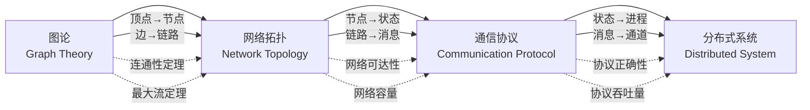
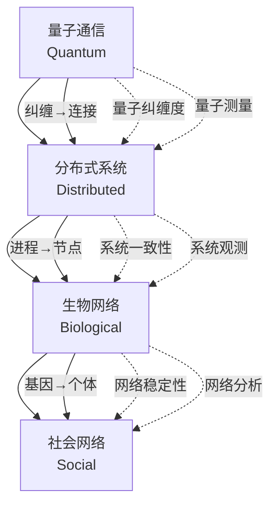
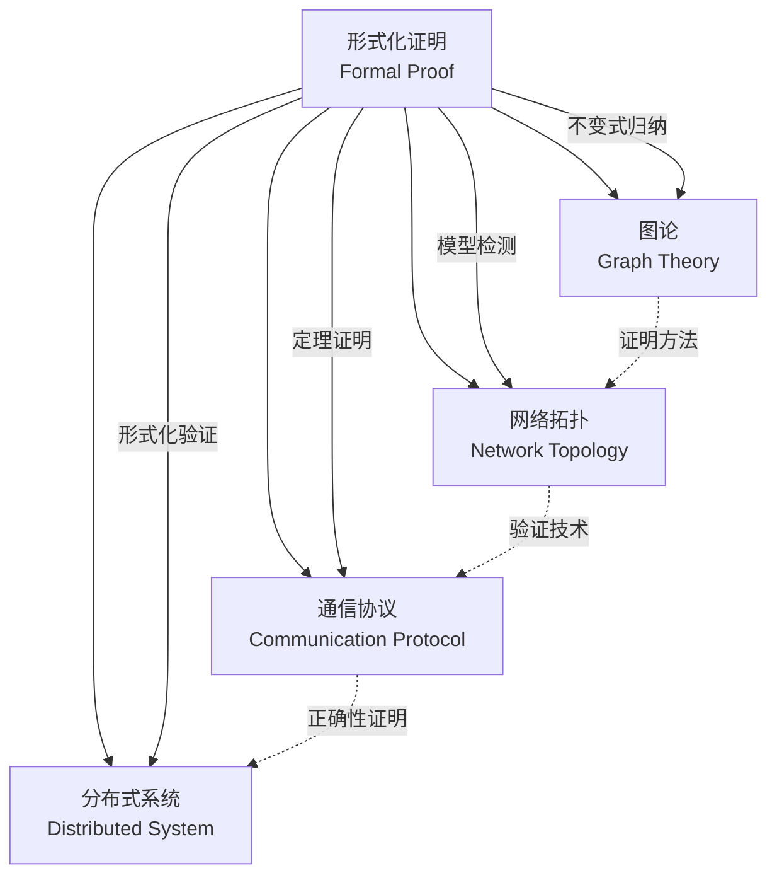

# 推理链路图 / Reasoning Chain Diagrams

## 📚 **概述 / Overview**

本文档提供跨模块推理链路图，展示从图论到网络拓扑、通信协议、分布式系统等模块之间的推理关系和知识迁移路径。

**创建时间**: 2025年1月
**状态**: 🚀 持续更新中

---

## 🔗 **一、图论-网络-协议-系统推理链路 / Graph-Network-Protocol-System Reasoning Chain**

### 1.1 完整推理链路图



### 1.2 推理步骤说明

#### 步骤1: 图论 → 网络拓扑

**推理内容**:

- **结构映射**: 图的顶点映射到网络节点，图的边映射到网络链路
- **性质迁移**: 图的连通性迁移到网络的连通性
- **定理应用**: 图的最大流最小割定理应用到网络容量分析

**形式化**:
$$G = (V, E) \xrightarrow{F_{GN}} N = (N, L)$$
$$\text{Connected}(G) \implies \text{Connected}(N)$$
$$\text{MaxFlow}(G) \xrightarrow{F_{GN}} \text{Capacity}(N)$$

#### 步骤2: 网络拓扑 → 通信协议

**推理内容**:

- **结构映射**: 网络节点映射到协议状态，网络链路映射到协议消息
- **性质迁移**: 网络连通性迁移到协议可达性
- **定理应用**: 网络容量迁移到协议吞吐量

**形式化**:
$$N = (N, L) \xrightarrow{F_{NP}} P = (S, M, \delta)$$
$$\text{Connected}(N) \implies \text{Reachable}(P)$$
$$\text{Capacity}(N) \xrightarrow{F_{NP}} \text{Throughput}(P)$$

#### 步骤3: 通信协议 → 分布式系统

**推理内容**:

- **结构映射**: 协议状态映射到系统进程，协议消息映射到通信通道
- **性质迁移**: 协议正确性迁移到系统一致性
- **定理应用**: 协议性能迁移到系统性能

**形式化**:
$$P = (S, M, \delta) \xrightarrow{F_{PS}} D = (P, C, \Sigma)$$
$$\text{Correct}(P) \implies \text{Consistent}(D)$$
$$\text{Throughput}(P) \xrightarrow{F_{PS}} \text{Throughput}(D)$$

---

## 🌐 **二、量子-分布式-生物-社会网络推理链路 / Quantum-Distributed-Biological-Social Network Reasoning Chain**

### 2.1 跨领域推理链路图



### 2.2 推理步骤说明

#### 步骤1: 量子通信 → 分布式系统

**推理内容**:

- **概念映射**: 量子纠缠映射到分布式系统连接
- **性质迁移**: 量子纠缠度迁移到系统一致性
- **方法迁移**: 量子测量方法迁移到系统观测方法

**形式化**:
$$Q = (Q, E, U) \xrightarrow{F_{QD}} D = (P, C, \Sigma)$$
$$\text{Entanglement}(Q) \xrightarrow{F_{QD}} \text{Connection}(D)$$
$$\text{Measurement}(Q) \xrightarrow{F_{QD}} \text{Observation}(D)$$

#### 步骤2: 分布式系统 → 生物网络

**推理内容**:

- **概念映射**: 系统进程映射到生物网络节点
- **性质迁移**: 系统一致性迁移到网络稳定性
- **方法迁移**: 系统分析方法迁移到网络分析方法

**形式化**:
$$D = (P, C, \Sigma) \xrightarrow{F_{DB}} B = (N, E, W)$$
$$\text{Consistent}(D) \xrightarrow{F_{DB}} \text{Stable}(B)$$
$$\text{Analysis}(D) \xrightarrow{F_{DB}} \text{Analysis}(B)$$

#### 步骤3: 生物网络 → 社会网络

**推理内容**:

- **概念映射**: 基因节点映射到社会个体
- **性质迁移**: 网络稳定性迁移到社会稳定性
- **方法迁移**: 网络分析方法迁移到社会分析方法

**形式化**:
$$B = (N, E, W) \xrightarrow{F_{BS}} S = (A, R, W)$$
$$\text{Stable}(B) \xrightarrow{F_{BS}} \text{Stable}(S)$$
$$\text{Analysis}(B) \xrightarrow{F_{BS}} \text{Analysis}(S)$$

---

## 🔬 **三、形式化证明-各模块推理链路 / Formal Proof-Modules Reasoning Chain**

### 3.1 证明方法推理链路



### 3.2 证明方法应用

| 证明方法 | 图论应用 | 网络拓扑应用 | 协议应用 | 系统应用 |
|---------|---------|------------|---------|---------|
| **不变式归纳** | 图的连通性 | 网络可靠性 | 协议安全性 | 系统一致性 |
| **模型检测** | 路径存在性 | 网络可达性 | 协议死锁 | 系统死锁 |
| **定理证明** | 最大流定理 | 网络容量 | 协议正确性 | 系统正确性 |
| **形式化验证** | 算法正确性 | 算法正确性 | 协议正确性 | 系统正确性 |

---

## 📊 **四、推理链路应用实例 / Reasoning Chain Application Examples**

### 4.1 实例1: 从图连通性到系统一致性

**推理路径**:

```
图连通性
  → 网络连通性 (结构映射)
  → 协议可达性 (性质迁移)
  → 系统一致性 (定理应用)
```

**形式化链路**:
$$G \text{连通} \xrightarrow{F_{GN}} N \text{连通} \xrightarrow{F_{NP}} P \text{可达} \xrightarrow{F_{PS}} D \text{一致}$$

### 4.2 实例2: 从最大流到系统吞吐量

**推理路径**:

```
图的最大流
  → 网络容量 (结构映射)
  → 协议吞吐量 (性质迁移)
  → 系统吞吐量 (定理应用)
```

**形式化链路**:
$$\text{MaxFlow}(G) \xrightarrow{F_{GN}} \text{Capacity}(N) \xrightarrow{F_{NP}} \text{Throughput}(P) \xrightarrow{F_{PS}} \text{Throughput}(D)$$

### 4.3 实例3: 从量子纠缠到社会连接

**推理路径**:

```
量子纠缠
  → 分布式连接 (概念映射)
  → 生物网络连接 (性质迁移)
  → 社会网络连接 (方法迁移)
```

**形式化链路**:
$$\text{Entanglement}(Q) \xrightarrow{F_{QD}} \text{Connection}(D) \xrightarrow{F_{DB}} \text{Connection}(B) \xrightarrow{F_{BS}} \text{Connection}(S)$$

---

## 🔗 **五、推理链路验证方法 / Reasoning Chain Verification Methods**

### 5.1 结构验证

- **同构验证**: 验证映射是否保持结构同构
- **嵌入验证**: 验证映射是否为嵌入
- **函子验证**: 验证映射是否为函子

### 5.2 性质验证

- **保持性验证**: 验证性质是否在映射下保持
- **传递性验证**: 验证复合映射的性质
- **完备性验证**: 验证映射是否覆盖所有概念

### 5.3 定理验证

- **正确性验证**: 验证推理链路的正确性
- **完整性验证**: 验证推理链路的完整性
- **可逆性验证**: 验证推理链路是否可逆

---

## 📋 **六、推理链路使用指南 / Reasoning Chain Usage Guide**

### 6.1 如何使用推理链路

1. **确定起点**: 明确要推理的起点模块和概念
2. **选择路径**: 根据目标选择推理路径
3. **应用映射**: 应用结构映射和性质迁移
4. **验证结果**: 验证推理结果的正确性

### 6.2 推理链路应用场景

- **理论迁移**: 将理论从一个领域迁移到另一个领域
- **方法复用**: 复用证明方法和分析技术
- **概念统一**: 统一不同领域的相似概念
- **知识整合**: 整合跨领域的知识体系

---

## 🔗 **相关链接 / Related Links**

- [跨模块概念映射](跨模块概念映射-2025.md)
- [模型关系与推理链路](06-模型关系与推理链路.md)
- [元元模型与范畴论关系](05-元元模型与范畴论关系.md)

---

**文档版本**: v1.0
**创建时间**: 2025年1月
**最后更新**: 2025年1月
**维护者**: GraphNetWorkCommunicate项目组
