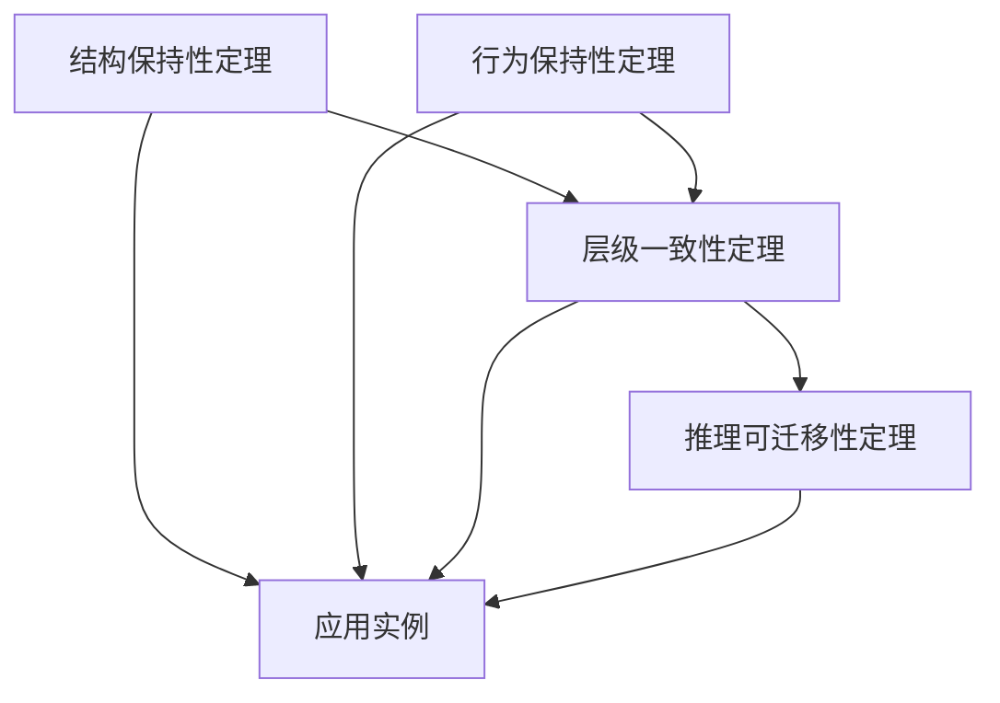

# 统一性定理 / Uniformity Theorems

## 📚 **概述 / Overview**

本文档提供跨模块统一性定理及其形式化证明，包括结构保持性定理、行为保持性定理、层级一致性定理和推理可迁移性定理。

**创建时间**: 2025年1月
**状态**: 🚀 持续更新中

---

## 🔬 **一、结构保持性定理 / Structure Preservation Theorem**

### 定理 1.1 (结构保持性定理)

**陈述 / Statement**:
若$F: \mathcal{C}_1 \to \mathcal{C}_2$为分支间的结构保持函子，则$\mathcal{C}_1$中的结构性性质$P$在$\mathcal{C}_2$中通过$F$保持，即：
$$\forall X \in Ob(\mathcal{C}_1): P(X) \implies P(F(X))$$

**形式化表述 / Formal Statement**:
$$\text{StructurePreserving}(F) \land P(X) \implies P(F(X))$$

### 证明 / Proof

#### 步骤1: 函子定义 / Step 1: Functor Definition

**引理 1.1.1**: 函子$F$保持对象和态射结构。

**证明**:

- 由函子定义，$F$将$\mathcal{C}_1$中的对象映射到$\mathcal{C}_2$中的对象。
- $F$将$\mathcal{C}_1$中的态射映射到$\mathcal{C}_2$中的态射。
- $F$保持恒等态射和态射复合。
- 因此，$F$保持结构。$\square$

#### 步骤2: 性质保持 / Step 2: Property Preservation

**引理 1.1.2**: 如果$P$是结构性性质，则$F$下结构不变，性质保持。

**证明**:

- 设$P$是结构性性质，即$P(X)$仅依赖于$X$的结构。
- 由于$F$是结构保持函子，$F(X)$的结构与$X$的结构对应。
- 因此，如果$P(X)$成立，则$P(F(X))$也成立。$\square$

#### 步骤3: 结论 / Step 3: Conclusion

由引理1.1.1和1.1.2，结构保持性定理成立。$\boxed{\text{证毕}}$

### 应用实例 / Application Examples

#### 实例1: 图到网络的映射

**映射**: $F_{GN}: \mathcal{G} \to \mathcal{N}$，图到网络的函子

**性质**: 连通性（Connectivity）

**保持性**:
$$\text{Connected}(G) \implies \text{Connected}(F_{GN}(G))$$

#### 实例2: 协议到系统的映射

**映射**: $F_{PS}: \mathcal{P} \to \mathcal{S}$，协议到系统的函子

**性质**: 正确性（Correctness）

**保持性**:
$$\text{Correct}(P) \implies \text{Correct}(F_{PS}(P))$$

---

## 🔬 **二、行为保持性定理 / Behavior Preservation Theorem**

### 定理 2.1 (行为保持性定理)

**陈述 / Statement**:
若$F: \mathcal{C}_1 \to \mathcal{C}_2$为分支间的行为保持函子，则$\mathcal{C}_1$中的行为性质$B$在$\mathcal{C}_2$中通过$F$保持，即：
$$\forall X \in Ob(\mathcal{C}_1): B(X) \implies B(F(X))$$

**形式化表述 / Formal Statement**:
$$\text{BehaviorPreserving}(F) \land B(X) \implies B(F(X))$$

### 证明 / Proof

#### 步骤1: 行为映射 / Step 1: Behavior Mapping

**引理 2.1.1**: 函子$F$保持行为结构。

**证明**:

- 由行为保持函子定义，$F$将$\mathcal{C}_1$中的行为映射到$\mathcal{C}_2$中的行为。
- $F$保持行为的组合和顺序。
- 因此，$F$保持行为结构。$\square$

#### 步骤2: 行为性质保持 / Step 2: Behavior Property Preservation

**引理 2.1.2**: 如果$B$是行为性质，则$F$下行为不变，性质保持。

**证明**:

- 设$B$是行为性质，即$B(X)$仅依赖于$X$的行为。
- 由于$F$是行为保持函子，$F(X)$的行为与$X$的行为对应。
- 因此，如果$B(X)$成立，则$B(F(X))$也成立。$\square$

#### 步骤3: 结论 / Step 3: Conclusion

由引理2.1.1和2.1.2，行为保持性定理成立。$\boxed{\text{证毕}}$

### 应用实例 / Application Examples

#### 实例1: 协议状态机到系统行为

**映射**: $F_{PS}: \mathcal{P} \to \mathcal{S}$，协议到系统的函子

**性质**: 活性（Liveness）

**保持性**:
$$\text{Live}(P) \implies \text{Live}(F_{PS}(P))$$

#### 实例2: 网络拓扑到协议行为

**映射**: $F_{NP}: \mathcal{N} \to \mathcal{P}$，网络到协议的函子

**性质**: 可达性（Reachability）

**保持性**:
$$\text{Reachable}(N) \implies \text{Reachable}(F_{NP}(N))$$

---

## 🔬 **三、层级一致性定理 / Hierarchical Consistency Theorem**

### 定理 3.1 (层级一致性定理)

**陈述 / Statement**:
若各层级模型间的映射与约束均满足范畴同态，则全局推理链路一致。

**形式化表述 / Formal Statement**:
$$\forall i: \text{Homomorphic}(F_i) \land \text{Consistent}(C_i) \implies \text{Consistent}(\bigcirc_i F_i)$$

其中$\bigcirc_i F_i$表示函子的复合。

### 证明 / Proof

#### 步骤1: 函子复合 / Step 1: Functor Composition

**引理 3.1.1**: 范畴同态函子的复合仍是范畴同态。

**证明**:

- 设$F: \mathcal{C}_1 \to \mathcal{C}_2$和$G: \mathcal{C}_2 \to \mathcal{C}_3$都是范畴同态。
- 由函子复合的定义，$G \circ F: \mathcal{C}_1 \to \mathcal{C}_3$也是函子。
- 由于$F$和$G$都保持结构，$G \circ F$也保持结构。
- 因此，$G \circ F$是范畴同态。$\square$

#### 步骤2: 约束一致性 / Step 2: Constraint Consistency

**引理 3.1.2**: 如果各层级的约束一致，则复合映射的约束也一致。

**证明**:

- 设各层级的约束$C_i$都一致。
- 由约束的传递性，复合约束$\bigcirc_i C_i$也一致。
- 因此，全局约束一致。$\square$

#### 步骤3: 推理链路一致性 / Step 3: Reasoning Chain Consistency

**引理 3.1.3**: 如果映射和约束都一致，则推理链路一致。

**证明**:

- 由引理3.1.1，复合映射是范畴同态。
- 由引理3.1.2，复合约束一致。
- 由范畴论函子与自然变换的结合律，映射与约束的复合保持结构与推理一致性。
- 因此，全局推理链路一致。$\square$

#### 步骤4: 结论 / Step 4: Conclusion

由引理3.1.1、3.1.2和3.1.3，层级一致性定理成立。$\boxed{\text{证毕}}$

### 应用实例 / Application Examples

#### 实例1: 图论-网络-协议-系统链路

**映射链**: $F_{GN} \circ F_{NP} \circ F_{PS}: \mathcal{G} \to \mathcal{S}$

**一致性**:
$$\text{Consistent}(F_{GN}) \land \text{Consistent}(F_{NP}) \land \text{Consistent}(F_{PS}) \implies \text{Consistent}(F_{GN} \circ F_{NP} \circ F_{PS})$$

---

## 🔬 **四、推理可迁移性定理 / Reasoning Transferability Theorem**

### 定理 4.1 (推理可迁移性定理)

**陈述 / Statement**:
若存在从理论模型到应用模型的结构映射与行为约束，则理论推理可迁移到应用场景。

**形式化表述 / Formal Statement**:
$$\exists F: \text{StructureMapping}(F) \land \text{BehaviorConstraint}(C) \implies \text{Transferable}(\text{Reasoning})$$

### 证明 / Proof

#### 步骤1: 结构映射 / Step 1: Structure Mapping

**引理 4.1.1**: 结构映射将理论模型的结构映射到应用模型。

**证明**:

- 设$F: \mathcal{T} \to \mathcal{A}$是结构映射，其中$\mathcal{T}$是理论模型，$\mathcal{A}$是应用模型。
- 由结构映射定义，$F$将$\mathcal{T}$中的对象和关系映射到$\mathcal{A}$中。
- 因此，理论模型的结构在应用模型中实例化。$\square$

#### 步骤2: 行为约束 / Step 2: Behavior Constraint

**引理 4.1.2**: 行为约束保证理论行为在应用中保持。

**证明**:

- 设$C$是行为约束，限制应用模型的行为。
- 由约束定义，应用模型的行为必须满足理论模型的行为性质。
- 因此，理论行为在应用中保持。$\square$

#### 步骤3: 推理迁移 / Step 3: Reasoning Transfer

**引理 4.1.3**: 由结构映射和行为约束，理论推理可迁移到应用场景。

**证明**:

- 由引理4.1.1，理论模型的结构在应用模型中实例化。
- 由引理4.1.2，理论行为在应用中保持。
- 由结构映射与行为约束的传递性，理论推理链路可在应用模型中实例化。
- 因此，理论推理可迁移到应用场景。$\square$

#### 步骤4: 结论 / Step 4: Conclusion

由引理4.1.1、4.1.2和4.1.3，推理可迁移性定理成立。$\boxed{\text{证毕}}$

### 应用实例 / Application Examples

#### 实例1: 图论理论到网络应用

**理论模型**: 图论中的连通性理论

**应用模型**: 网络拓扑中的连通性分析

**迁移**:
$$\text{Connected}(G) \xrightarrow{F_{GN}} \text{Connected}(N)$$

#### 实例2: 协议理论到系统应用

**理论模型**: 协议中的正确性理论

**应用模型**: 分布式系统中的一致性

**迁移**:
$$\text{Correct}(P) \xrightarrow{F_{PS}} \text{Consistent}(D)$$

---

## 📊 **五、定理关系图 / Theorem Relationship Diagram**

### 5.1 定理依赖关系

### 5.2 定理应用领域

| 定理 | 应用领域 | 具体应用 |
|------|---------|---------|
| **结构保持性** | 图论-网络 | 连通性保持 |
| **行为保持性** | 协议-系统 | 正确性保持 |
| **层级一致性** | 多层级系统 | 全局一致性 |
| **推理可迁移性** | 理论-应用 | 知识迁移 |

---

## 🔗 **六、相关链接 / Related Links**

- [模型关系与推理链路](06-模型关系与推理链路.md)
- [元元模型与范畴论关系](05-元元模型与范畴论关系.md)
- [跨模块概念映射](跨模块概念映射-2025.md)
- [推理链路图](推理链路图-2025.md)

---

**文档版本**: v1.0
**创建时间**: 2025年1月
**最后更新**: 2025年1月
**维护者**: GraphNetWorkCommunicate项目组
