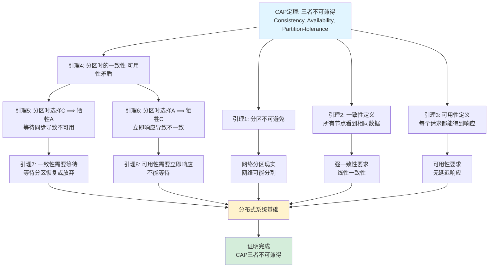
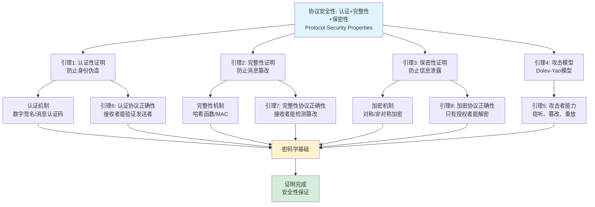
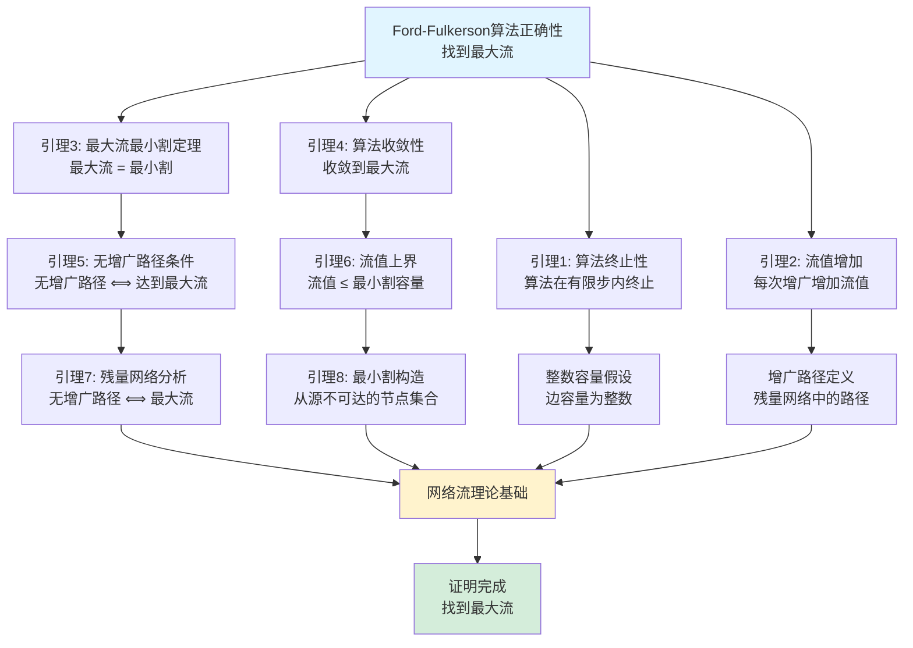

# 证明树图集合 / Proof Tree Collection 2025

## 📊 **概述 / Overview**

本文档提供GraphNetWorkCommunicate项目中重要定理和算法的证明树图，展示形式化证明的逻辑结构和推理路径，帮助理解证明的完整性和严谨性。

**创建时间**: 2025年12月5日
**状态**: 🚀 持续更新中

---

## 🎯 **一、图论定理证明树 / Graph Theory Theorem Proof Trees**

### 1.1 最大流最小割定理证明树

```mermaid
graph TD
    Goal[最大流 = 最小割<br/>Max-Flow Min-Cut Theorem] --> L1[引理1: 任何流 ≤ 任何割<br/>|f| ≤ c(S, T)]
    Goal --> L2[引理2: 存在流 = 某个割<br/>存在最大流和最小割使得|f| = c(S, T)]

    L1 --> A1[流定义<br/>|f| = Σ f(s, v)]
    L1 --> L3[引理3: 割容量定义<br/>c(S, T) = Σ c(u, v)]
    L1 --> L4[引理4: 流守恒性<br/>流入 = 流出]

    L2 --> L5[引理5: 最大流存在<br/>网络流问题有解]
    L2 --> L6[引理6: 残量网络中无增广路径<br/>当且仅当流达到最大]
    L2 --> L7[引理7: 最小割构造<br/>从s可达的节点集合构成最小割]

    L6 --> L8[引理8: 增广路径定理<br/>存在增广路径当且仅当流未达到最大]
    L7 --> L9[引理9: 割的容量等于流值<br/>c(S, T) = |f|]

    L8 --> A2[残量网络定义<br/>G_f = (V, E_f)]
    L9 --> A3[割的构造<br/>S = 从s可达的节点]

    A1 --> Base[基础公理]
    A2 --> Base
    A3 --> Base
    L4 --> Base
    L3 --> Base
    L5 --> Base

    Base --> End[证明完成<br/>Q.E.D.]

    style Goal fill:#e1f5ff
    style End fill:#d4edda
    style Base fill:#fff3cd
    style L1 fill:#d1ecf1
    style L2 fill:#d1ecf1
```

**证明概要**:
1. **引理1**: 任何流的流量不超过任何割的容量
2. **引理2**: 存在最大流和最小割使得流值等于割容量
3. **关键步骤**: 当残量网络中无增广路径时，构造最小割

### 1.2 图的连通性定理证明树

```mermaid
graph TD
    Goal[连通图任意两点间存在路径<br/>Connected Graph Path Theorem] --> L1[引理1: 连通关系是等价关系]
    Goal --> L2[引理2: 连通分量定义<br/>最大连通子图]

    L1 --> A1[等价关系定义<br/>自反、对称、传递]
    L1 --> L3[引理3: 路径的传递性<br/>u→v, v→w ⟹ u→w]

    L2 --> L4[引理4: 连通分量划分<br/>图的顶点集被连通分量划分]
    L2 --> L5[引理5: 连通图只有一个连通分量]

    L3 --> A2[路径定义<br/>边序列]
    L5 --> A3[连通图定义<br/>任意两点可达]

    Goal --> L6[引理6: 连通图 ⟺ 单一连通分量]
    L6 --> L5
    L6 --> L7[引理7: 连通分量大小 = |V| ⟺ 连通]

    A1 --> Base[集合论基础]
    A2 --> Base
    A3 --> Base

    Base --> End[证明完成]

    style Goal fill:#e1f5ff
    style End fill:#d4edda
    style Base fill:#fff3cd
```

### 1.3 欧拉定理证明树

```mermaid
graph TD
    Goal[欧拉定理: v - e + f = 2<br/>Euler's Formula for Planar Graphs] --> L1[引理1: 平面图面数公式]
    Goal --> L2[引理2: 连通平面图性质]

    L1 --> L3[引理3: 每个面至少3条边<br/>f ≤ 2e/3]
    L1 --> L4[引理4: 握手引理<br/>Σdeg(v) = 2e]

    L2 --> L5[引理5: 连通图最小生成树<br/>v - 1 条边]
    L2 --> L6[引理6: 面边关系<br/>每个面由边包围]

    Goal --> L7[引理7: 归纳法基础<br/>树的情况: v - e = 1, f = 1]
    Goal --> L8[引理8: 添加边保持公式<br/>添加一条边增加一个面]

    L7 --> A1[树定义<br/>无环连通图]
    L8 --> A2[平面嵌入<br/>可平面绘制]

    L3 --> Base[图论基础]
    L4 --> Base
    L5 --> Base
    L6 --> Base
    A1 --> Base
    A2 --> Base

    Base --> End[证明完成]

    style Goal fill:#e1f5ff
    style End fill:#d4edda
    style Base fill:#fff3cd
```

---

## 🔄 **二、分布式系统定理证明树 / Distributed System Theorem Proof Trees**

### 2.1 CAP定理证明树



### 2.2 Paxos算法安全性证明树

```mermaid
graph TD
    Goal[Paxos算法安全性<br/>Safety: 最多一个值被选择] --> L1[引理1: 提议号唯一性]
    Goal --> L2[引理2: 多数派相交性<br/>任意两个多数派必有交集]

    L1 --> A1[提议号机制<br/>全局唯一递增]
    L2 --> A2[多数派定义<br/>|Q| > N/2]

    Goal --> L3[引理3: 接受者承诺<br/>接受更高提议号的提议]
    Goal --> L4[引理4: 学习值一致性<br/>所有学习者学习相同值]

    L3 --> L5[引理5: 第一阶段阻塞<br/>Phase 1阻止旧提议]
    L4 --> L6[引理6: 多数派接受条件<br/>需要多数派接受]

    L5 --> L7[引理7: 提议号比较<br/>高提议号优先]
    L6 --> L8[引理8: 多数派性质<br/>最多一个值被多数派接受]

    L7 --> Base[集合论+逻辑基础]
    L8 --> Base
    A1 --> Base
    A2 --> Base

    Base --> End[证明完成<br/>安全性保证]

    style Goal fill:#e1f5ff
    style End fill:#d4edda
    style Base fill:#fff3cd
```

---

## 🌐 **三、网络拓扑定理证明树 / Network Topology Theorem Proof Trees**

### 3.1 小世界网络性质证明树

```mermaid
graph TD
    Goal[小世界网络: 短路径+高聚类<br/>Small-World Network Properties] --> L1[引理1: 平均路径长度短<br/>L ≈ log(N)/log(k)]
    Goal --> L2[引理2: 聚类系数高<br/>C >> C_random]

    L1 --> L3[引理3: 随机重连机制<br/>增加长距离连接]
    L2 --> L4[引理4: 局部聚类保持<br/>大部分边保持局部]

    L3 --> A1[Watts-Strogatz模型<br/>WS小世界模型]
    L4 --> A2[规则网络基础<br/>初始高聚类]

    Goal --> L5[引理5: 短路径由随机边提供<br/>随机边连接远程节点]
    Goal --> L6[引理6: 高聚类由局部边保持<br/>局部边保持三角形]

    L5 --> L7[引理7: 路径长度分析<br/>随机游走分析]
    L6 --> L8[引理8: 聚类系数计算<br/>三角形密度]

    L7 --> Base[图论+概率论基础]
    L8 --> Base
    A1 --> Base
    A2 --> Base

    Base --> End[证明完成]

    style Goal fill:#e1f5ff
    style End fill:#d4edda
    style Base fill:#fff3cd
```

### 3.2 无标度网络度分布证明树

```mermaid
graph TD
    Goal[无标度网络度分布: P(k) ~ k^(-γ)<br/>Scale-Free Network Degree Distribution] --> L1[引理1: 优先连接机制<br/>新节点偏好连接高度节点]
    Goal --> L2[引理2: 度分布演化<br/>度分布随时间演化]

    L1 --> A1[Barabási-Albert模型<br/>BA无标度模型]
    L2 --> A2[度分布定义<br/>P(k) = 节点度为k的比例]

    Goal --> L3[引理3: 度演化方程<br/>dk/dt = m·k/(Σk)]
    Goal --> L4[引理4: 连续化近似<br/>t → ∞时的渐近行为]

    L3 --> L5[引理5: 度增长速率<br/>dk/dt ∝ k]
    L4 --> L6[引理6: 幂律分布解<br/>P(k) = 2m²/k³]

    L5 --> L7[引理7: 随机过程分析<br/>度增长随机过程]
    L6 --> L8[引理8: 渐近分析<br/>t → ∞极限]

    L7 --> Base[随机过程+微分方程基础]
    L8 --> Base
    A1 --> Base
    A2 --> Base

    Base --> End[证明完成<br/>度分布呈幂律]

    style Goal fill:#e1f5ff
    style End fill:#d4edda
    style Base fill:#fff3cd
```

---

## 📡 **四、通信协议定理证明树 / Communication Protocol Theorem Proof Trees**

### 4.1 协议安全性证明树



---

## ⚛️ **五、量子通信定理证明树 / Quantum Communication Theorem Proof Trees**

### 5.1 BB84协议安全性证明树

```mermaid
graph TD
    Goal[BB84协议安全性<br/>BB84 Protocol Security Proof] --> L1[引理1: 量子不可克隆定理<br/>无法完美克隆量子态]
    Goal --> L2[引理2: 量子测量原理<br/>测量改变量子态]

    L1 --> A1[不可克隆定理<br/>|ψ⟩不能完美复制]
    L2 --> A2[测量塌缩<br/>测量后态确定]

    Goal --> L3[引理3: 窃听检测<br/>窃听导致错误率增加]
    Goal --> L4[引理4: 隐私放大<br/>错误率可接受的密钥]

    L3 --> L5[引理5: 窃听者错误率<br/>窃听导致25%错误]
    L4 --> L6[引理6: 错误率阈值<br/>错误率<阈值则安全]

    L5 --> L7[引理7: 基不匹配分析<br/>基不匹配导致随机结果]
    L6 --> L8[引理8: 隐私放大定理<br/>错误纠正后安全性]

    L7 --> Base[量子力学基础]
    L8 --> Base
    A1 --> Base
    A2 --> Base

    Base --> End[证明完成<br/>无条件安全性]

    style Goal fill:#e1f5ff
    style End fill:#d4edda
    style Base fill:#fff3cd
```

---

## 🔬 **六、算法正确性证明树 / Algorithm Correctness Proof Trees**

### 6.1 Dijkstra算法正确性证明树

```mermaid
graph TD
    Goal[Dijkstra算法正确性<br/>找到单源最短路径] --> L1[引理1: 不变式<br/>已确定最短距离的节点集合S]
    Goal --> L2[引理2: 贪心选择<br/>选择未确定节点中距离最小者]

    L1 --> A1[最短路径最优子结构<br/>最短路径的子路径也是最短]
    L2 --> A2[非负权重假设<br/>边权重≥0]

    Goal --> L3[引理3: 初始条件<br/>源点距离为0, 其他为∞]
    Goal --> L4[引理4: 保持条件<br/>每次迭代扩展正确节点]

    L3 --> L5[引理5: 松弛操作<br/>更新距离估计]
    L4 --> L6[引理6: 最小距离节点<br/>已确定最短路径]

    L5 --> L7[引理7: 松弛引理<br/>d[v] ≤ d[u] + w(u,v)]
    L6 --> L8[引理8: 贪心选择正确性<br/>最小距离节点已确定]

    L7 --> Base[图论+贪心算法基础]
    L8 --> Base
    A1 --> Base
    A2 --> Base

    Base --> End[证明完成<br/>算法正确]

    style Goal fill:#e1f5ff
    style End fill:#d4edda
    style Base fill:#fff3cd
```

### 6.2 Ford-Fulkerson算法正确性证明树



---

## 📊 **七、证明树使用指南 / Proof Tree Usage Guide**

### 7.1 证明树阅读方法

1. **从根节点开始**: 理解要证明的目标定理
2. **追踪推理路径**: 从目标到引理，从引理到公理
3. **理解依赖关系**: 哪些引理依赖哪些基础
4. **验证完整性**: 确保所有路径都追溯到基础公理

### 7.2 证明树创建原则

1. **逻辑清晰**: 每个节点表示一个明确的陈述
2. **依赖明确**: 清晰显示引理之间的依赖关系
3. **基础完整**: 所有推理最终追溯到公理或已知事实
4. **结构简洁**: 避免不必要的复杂嵌套

---

## 📚 **八、总结 / Summary**

本文档提供了GraphNetWorkCommunicate项目中重要定理和算法的证明树集合，涵盖：

1. **图论定理**: 最大流最小割、连通性、欧拉定理
2. **分布式系统定理**: CAP定理、Paxos安全性
3. **网络拓扑定理**: 小世界网络、无标度网络
4. **通信协议定理**: 协议安全性
5. **量子通信定理**: BB84协议安全性
6. **算法正确性**: Dijkstra、Ford-Fulkerson

这些证明树可以帮助：
- **理解证明结构**: 清晰了解证明的逻辑组织
- **验证证明完整性**: 确保所有步骤都有依据
- **学习证明方法**: 学习形式化证明的技巧
- **发现证明漏洞**: 识别证明中的不完整之处

---

**文档版本**: v1.0
**创建时间**: 2025年12月5日
**最后更新**: 2025年12月5日
**维护者**: GraphNetWorkCommunicate项目组
**下次更新**: 根据内容扩展持续更新
