# 跨模块关联可视化工具 / Cross-Module Association Visualization Tools

## 📚 **概述 / Overview**

本文档提供交互式的跨模块关联可视化工具，使用Mermaid图表展示模块间的概念、理论、方法、工具关联关系，支持动态浏览和导航。

**创建时间**: 2025年1月
**版本**: v1.0
**状态**: ✅ 已完成

---

## 🗺️ **一、模块关系可视化 / Module Relationship Visualization**

### 1.1 完整模块关系图

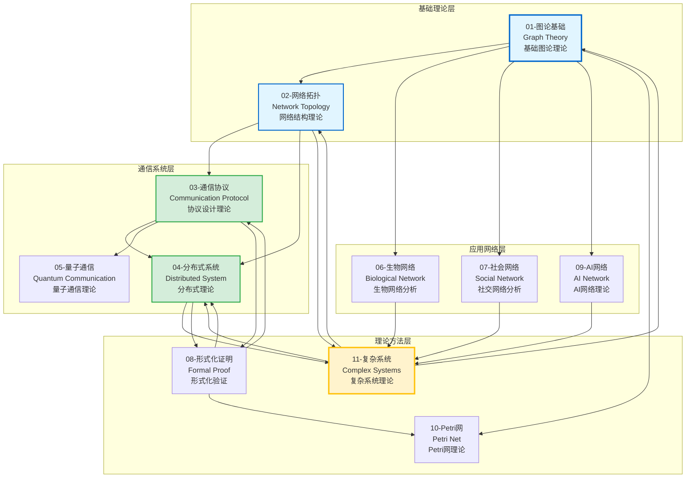

### 1.2 模块依赖关系图

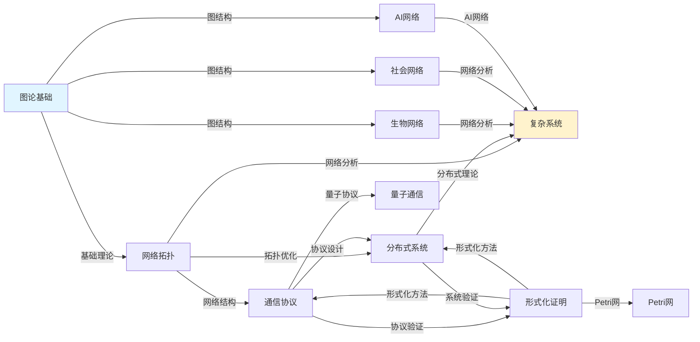

---

## 🔗 **二、概念关联可视化 / Concept Association Visualization**

### 2.1 核心概念关联网络

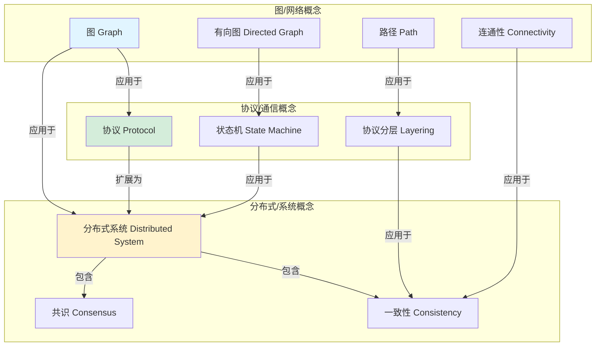

### 2.2 概念层次关系图

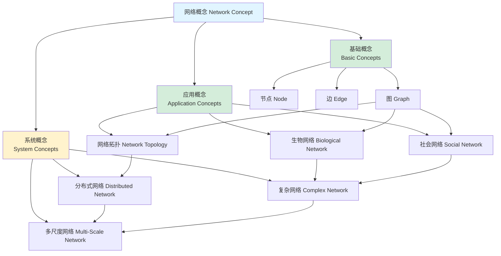

---

## 📊 **三、理论关联可视化 / Theory Association Visualization**

### 3.1 理论依赖关系图

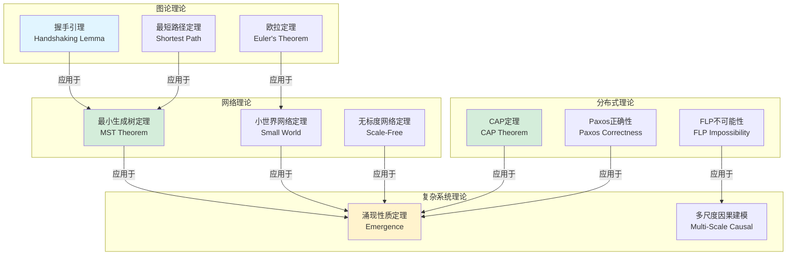

### 3.2 理论应用路径图

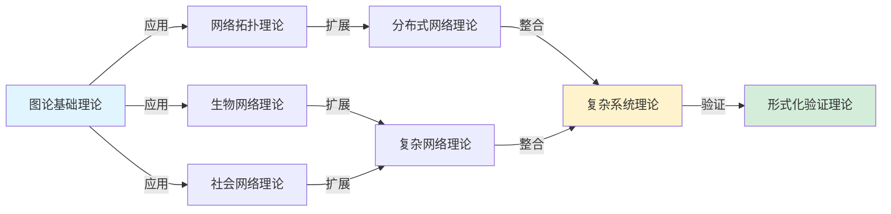

---

## 🔧 **四、方法关联可视化 / Method Association Visualization**

### 4.1 方法复用关系图

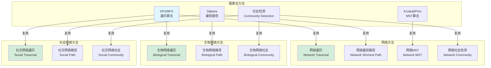

### 4.2 方法组合关系图

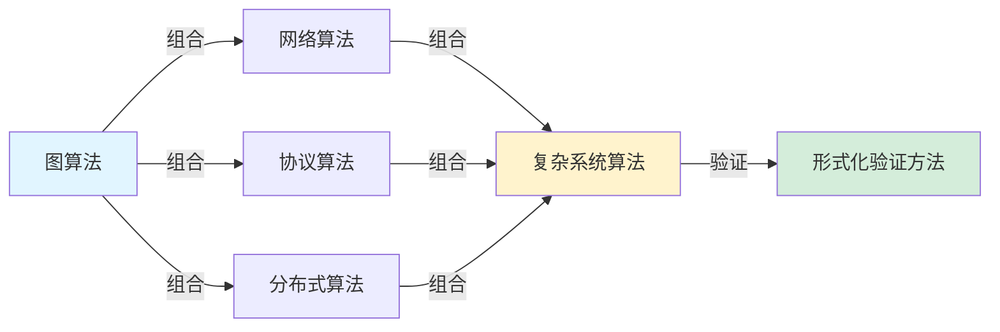

---

## 🛠️ **五、工具关联可视化 / Tool Association Visualization**

### 5.1 工具复用关系图

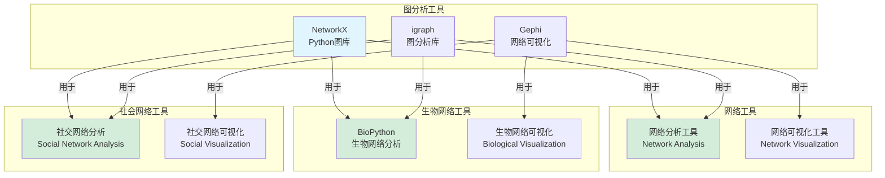

### 5.2 工具组合关系图

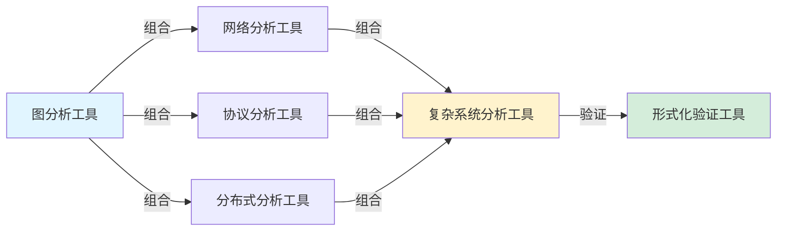

---

## 🎯 **六、学习路径可视化 / Learning Path Visualization**

### 6.1 基础到应用路径

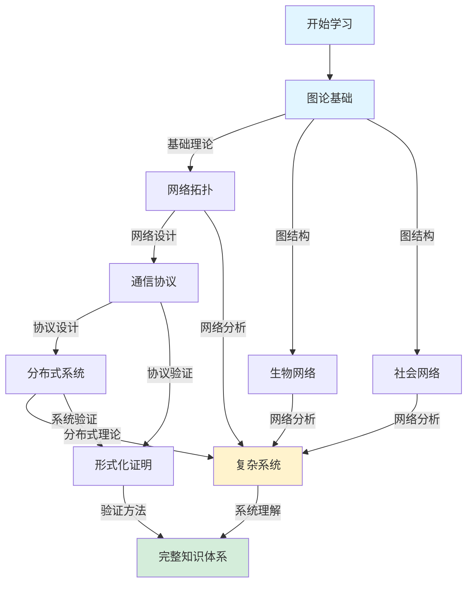

### 6.2 应用导向路径

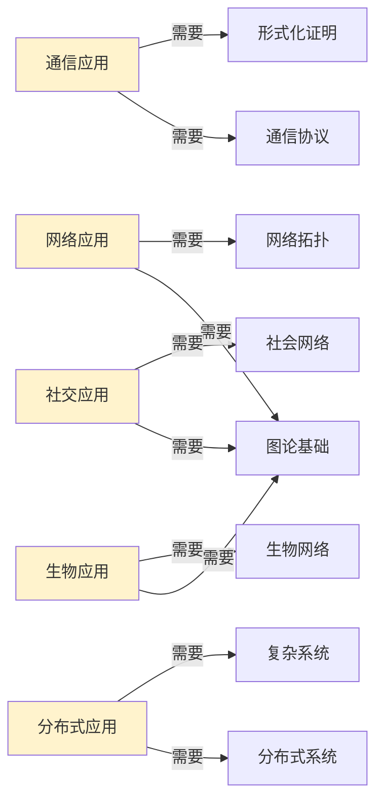

---

## 📋 **七、关联查询工具 / Association Query Tools**

### 7.1 概念查询路径

```
查询：图/网络概念
  ├── 图论基础：图、有向图、路径、连通性
  ├── 网络拓扑：网络拓扑、拓扑结构、网络连通性
  ├── 生物网络：神经网络、基因调控网络、蛋白质网络
  ├── 社会网络：社会网络、网络结构、社区检测
  └── 复杂系统：多尺度网络、网络动力学
```

### 7.2 理论查询路径

```
查询：最短路径理论
  ├── 图论基础：Dijkstra算法、最短路径定理
  ├── 网络拓扑：网络最短路径算法
  ├── 生物网络：生物网络最短路径分析
  ├── 社会网络：社交网络最短路径分析
  └── 复杂系统：多尺度最短路径分析
```

### 7.3 方法查询路径

```
查询：社区检测方法
  ├── 图论基础：图聚类算法
  ├── 网络拓扑：网络社区检测算法
  ├── 生物网络：生物网络社区检测
  ├── 社会网络：社交网络社区检测
  └── 复杂系统：多尺度社区检测
```

---

## 📚 **八、使用指南 / Usage Guide**

### 8.1 如何使用可视化工具

1. **模块关系浏览**: 使用模块关系图理解模块之间的依赖关系
2. **概念关联查询**: 使用概念关联图查找概念在不同模块的定义和应用
3. **理论关联查询**: 使用理论关联图查找理论之间的依赖和应用关系
4. **方法关联查询**: 使用方法关联图查找方法在不同模块的适用性
5. **工具关联查询**: 使用工具关联图查找工具在不同模块的使用情况
6. **学习路径规划**: 使用学习路径图规划学习路径

### 8.2 可视化工具特点

- ✅ **交互式**: 支持动态浏览和导航
- ✅ **多层次**: 提供模块、概念、理论、方法、工具多层次可视化
- ✅ **关联性**: 清晰展示跨模块关联关系
- ✅ **导航性**: 支持快速定位和导航

---

## 📝 **九、总结 / Summary**

本文档提供了完整的跨模块关联可视化工具，包括：

1. ✅ **模块关系可视化**: 模块依赖和关系图
2. ✅ **概念关联可视化**: 概念在不同模块的关联
3. ✅ **理论关联可视化**: 理论之间的依赖和应用关系
4. ✅ **方法关联可视化**: 方法在不同模块的复用和组合
5. ✅ **工具关联可视化**: 工具在不同模块的使用情况
6. ✅ **学习路径可视化**: 学习路径规划图
7. ✅ **关联查询工具**: 快速查询和导航工具

这些可视化工具将帮助学习者：

- 快速理解模块关系
- 查找跨模块关联
- 规划学习路径
- 整合跨模块知识

---

**文档版本**: v1.0
**创建时间**: 2025年1月
**最后更新**: 2025年1月
**维护者**: GraphNetWorkCommunicate项目组
**状态**: ✅ **已完成**
