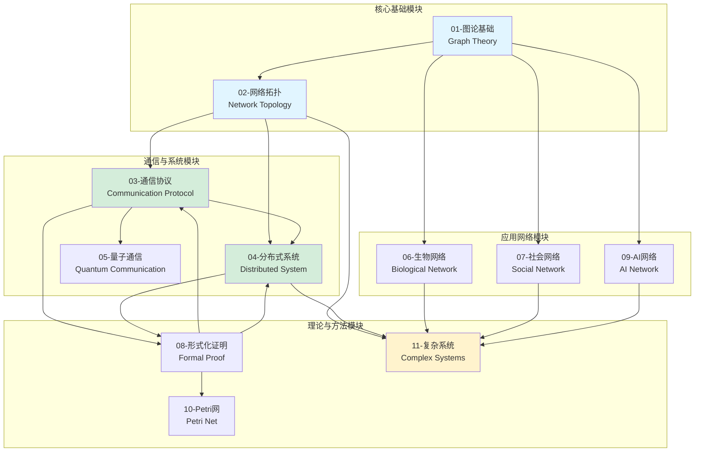
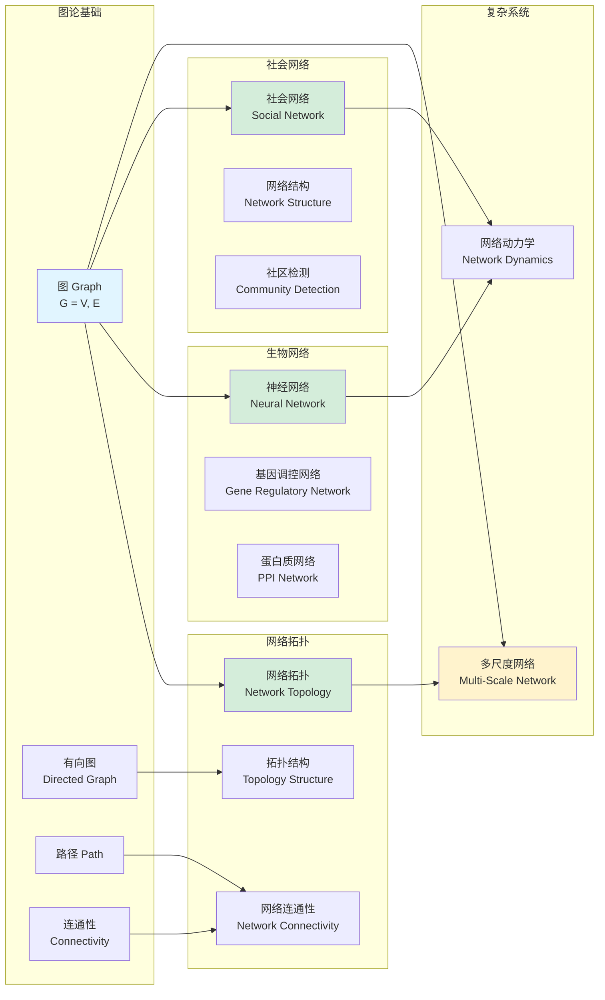
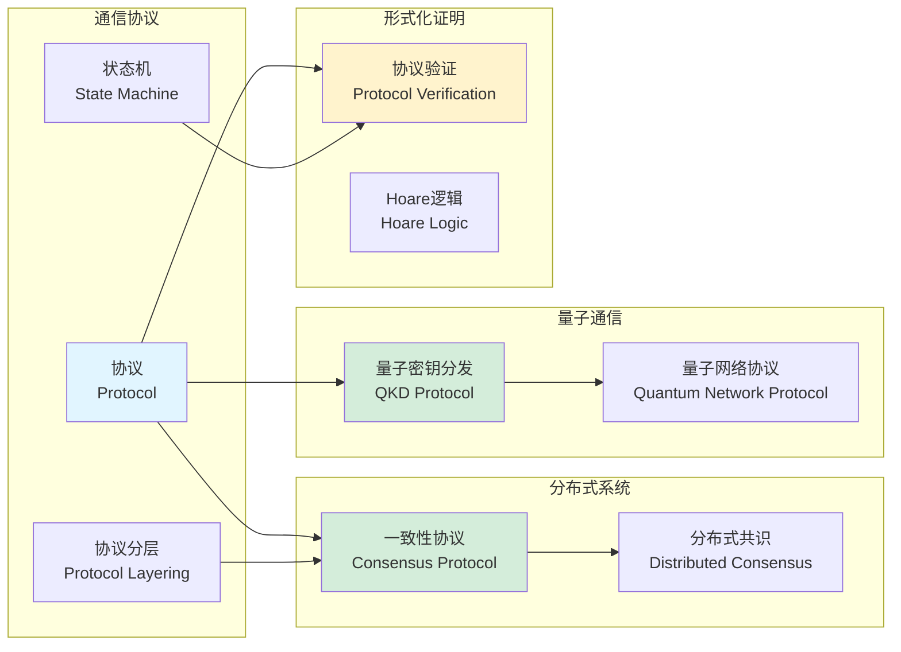
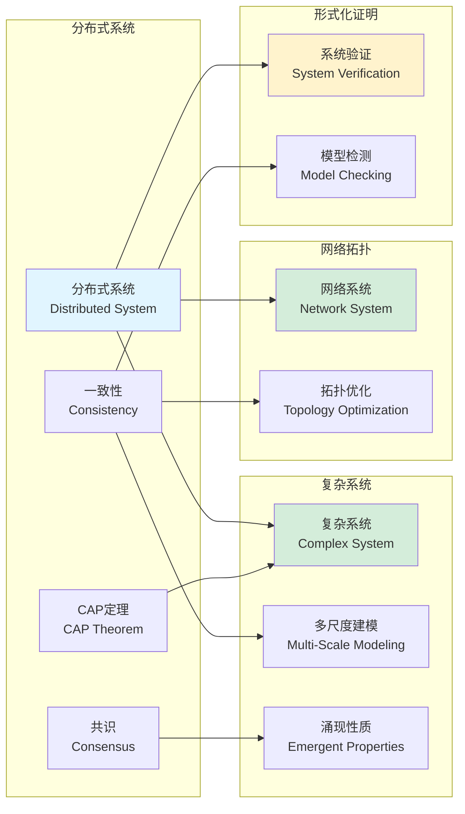
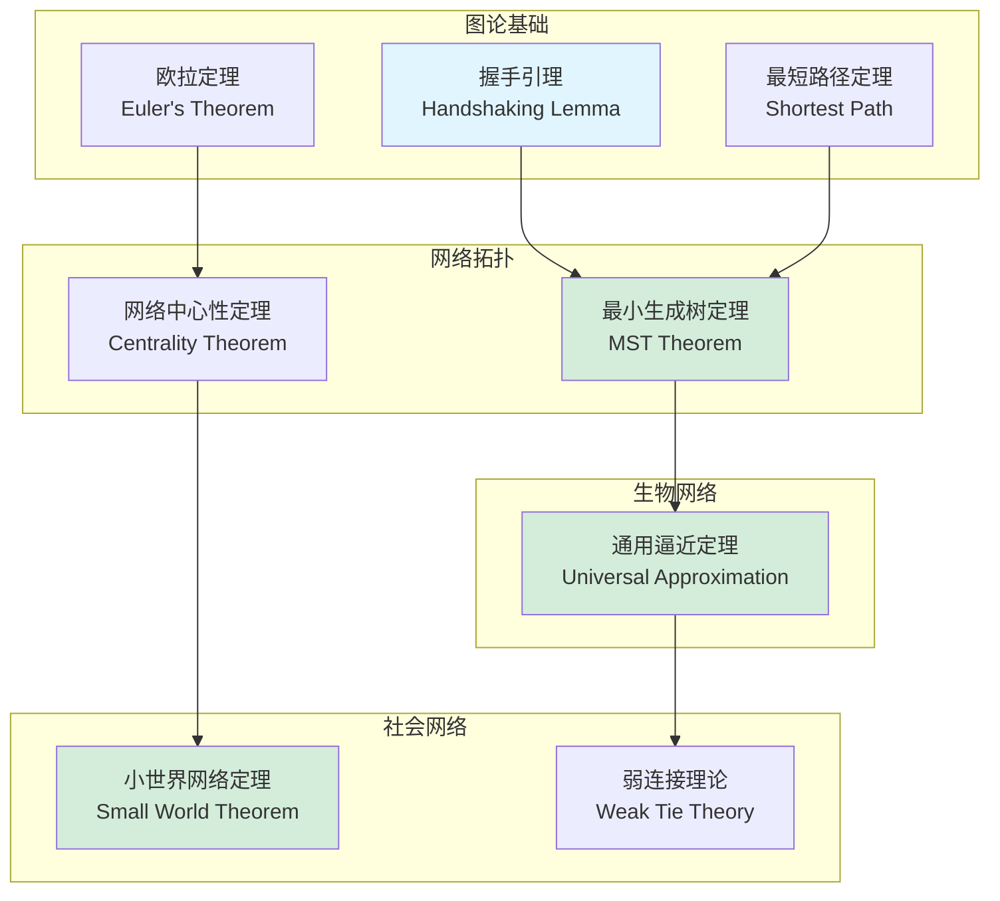
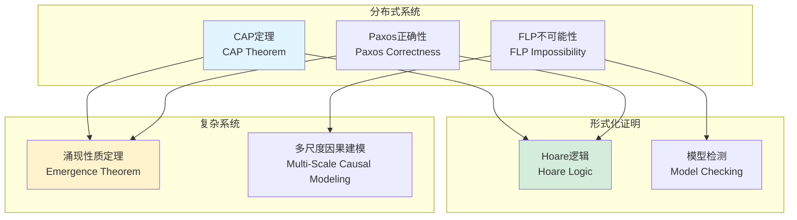
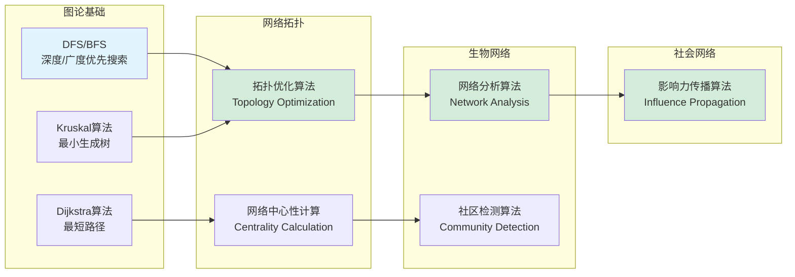
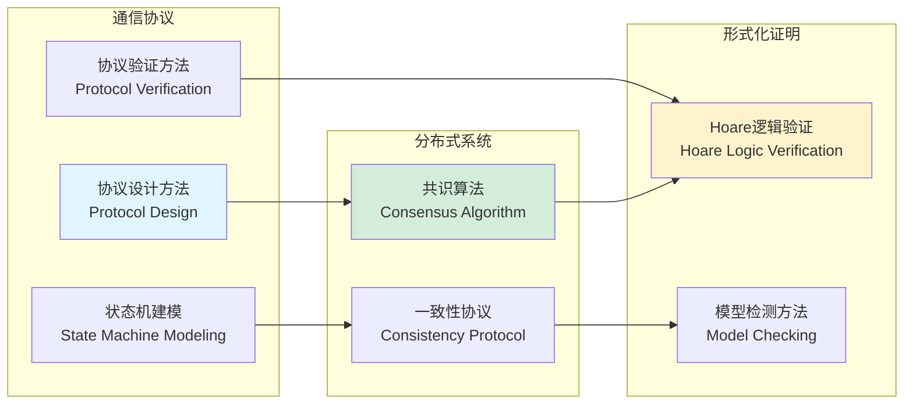
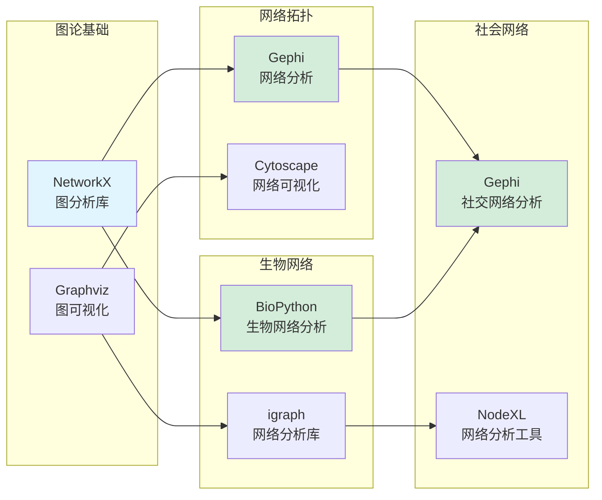
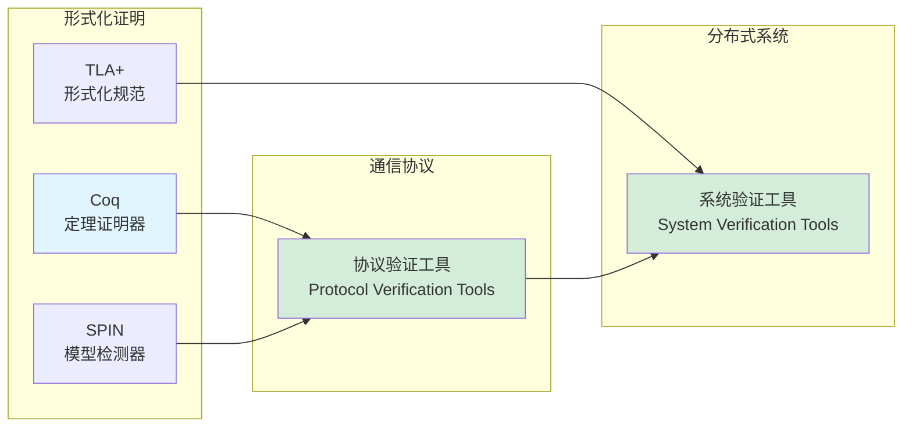

# 跨模块关联图谱 / Cross-Module Association Map

## 📚 **概述 / Overview**

本文档提供项目所有模块之间的知识关联图谱，清晰展示概念、理论、方法、工具在不同模块之间的关联关系。

**创建时间**: 2025年1月
**版本**: v1.0
**状态**: ✅ 已完成

---

## 🗺️ **一、模块关系总览图 / Module Relationship Overview**

---

## 🔗 **二、概念关联图谱 / Concept Association Map**

### 2.1 图/网络概念关联

### 2.2 协议/通信概念关联

### 2.3 分布式/系统概念关联

---

## 📊 **三、理论关联图谱 / Theory Association Map**

### 3.1 图论理论关联

### 3.2 分布式系统理论关联

---

## 🔧 **四、方法关联图谱 / Method Association Map**

### 4.1 图算法方法关联

### 4.2 协议方法关联

---

## 🛠️ **五、工具关联图谱 / Tool Association Map**

### 5.1 图分析工具关联

### 5.2 验证工具关联

---

## 📋 **六、关联索引 / Association Index**

### 6.1 概念关联索引

| 概念 | 模块1 | 模块2 | 模块3 | 关联类型 |
|------|-------|-------|-------|---------|
| **图/网络** | 图论基础 | 网络拓扑 | 生物网络 | 概念等价 |
| **路径** | 图论基础 | 网络拓扑 | 分布式系统 | 概念扩展 |
| **连通性** | 图论基础 | 网络拓扑 | 复杂系统 | 概念应用 |
| **协议** | 通信协议 | 分布式系统 | 量子通信 | 概念扩展 |
| **一致性** | 分布式系统 | 复杂系统 | 形式化证明 | 理论关联 |

### 6.2 理论关联索引

| 理论 | 来源模块 | 应用模块 | 关联类型 |
|------|---------|---------|---------|
| **最短路径定理** | 图论基础 | 网络拓扑、分布式系统 | 理论应用 |
| **CAP定理** | 分布式系统 | 复杂系统、形式化证明 | 理论扩展 |
| **小世界网络定理** | 网络拓扑 | 社会网络、复杂系统 | 理论应用 |
| **通用逼近定理** | 生物网络 | AI网络、复杂系统 | 理论应用 |

### 6.3 方法关联索引

| 方法 | 来源模块 | 应用模块 | 关联类型 |
|------|---------|---------|---------|
| **DFS/BFS** | 图论基础 | 网络拓扑、生物网络 | 方法复用 |
| **Dijkstra算法** | 图论基础 | 网络拓扑、分布式系统 | 方法应用 |
| **共识算法** | 分布式系统 | 复杂系统、形式化证明 | 方法扩展 |
| **模型检测** | 形式化证明 | 通信协议、分布式系统 | 方法应用 |

### 6.4 工具关联索引

| 工具 | 主要模块 | 应用模块 | 关联类型 |
|------|---------|---------|---------|
| **NetworkX** | 图论基础 | 网络拓扑、生物网络、社会网络 | 工具复用 |
| **Gephi** | 网络拓扑 | 社会网络、生物网络 | 工具复用 |
| **Coq** | 形式化证明 | 通信协议、分布式系统 | 工具应用 |
| **SPIN** | 形式化证明 | 通信协议、分布式系统 | 工具应用 |

---

## 📚 **七、使用指南 / Usage Guide**

### 7.1 如何使用关联图谱

1. **概念学习**: 通过关联图谱理解概念在不同模块的定义和应用
2. **理论理解**: 通过关联图谱理解理论之间的依赖和应用关系
3. **方法选择**: 通过关联图谱选择合适的方法和工具
4. **知识整合**: 通过关联图谱整合跨模块的知识

### 7.2 关联类型说明

- **概念等价**: 同一概念在不同模块的等价定义
- **概念扩展**: 概念在不同模块的扩展和特化
- **理论应用**: 理论在不同模块的应用场景
- **方法复用**: 方法在不同模块的复用
- **工具复用**: 工具在不同模块的复用

---

## 📝 **八、总结 / Summary**

本文档提供了完整的跨模块关联图谱，包括：

1. ✅ **模块关系总览图**: 展示所有模块之间的关系
2. ✅ **概念关联图谱**: 展示核心概念在不同模块的关联
3. ✅ **理论关联图谱**: 展示重要理论在不同模块的关联
4. ✅ **方法关联图谱**: 展示关键方法在不同模块的关联
5. ✅ **工具关联图谱**: 展示常用工具在不同模块的关联
6. ✅ **关联索引**: 完整的关联列表和索引

这些图谱将帮助学习者：
- 理解跨模块的知识关联
- 整合不同模块的知识
- 选择合适的方法和工具
- 构建完整的知识体系

---

**文档版本**: v1.0
**创建时间**: 2025年1月
**最后更新**: 2025年1月
**维护者**: GraphNetWorkCommunicate项目组
**状态**: ✅ **已完成**
