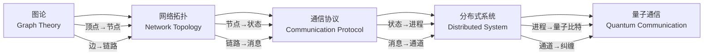
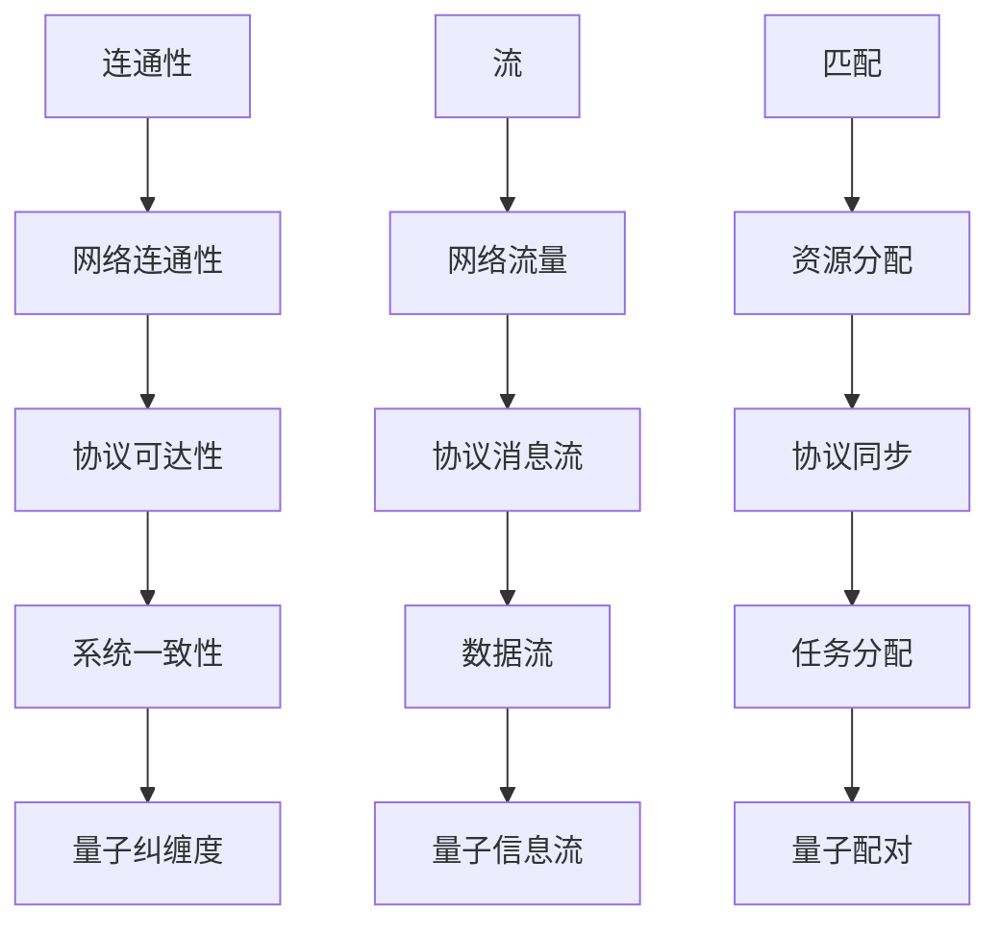

# 跨模块概念映射 / Cross-Module Concept Mapping

## 📚 **概述 / Overview**

本文档建立图论、网络拓扑、通信协议、分布式系统、量子通信等模块之间的核心概念映射关系，揭示不同领域之间的本质联系，为跨领域推理和统一理论提供基础。

**创建时间**: 2025年1月
**状态**: 🚀 持续更新中

---

## 📊 **一、核心概念映射矩阵 / Core Concept Mapping Matrix**

### 1.1 结构概念映射

| 图论 | 网络拓扑 | 通信协议 | 分布式系统 | 量子通信 |
|------|---------|---------|-----------|---------|
| **顶点 (Vertex)** | 节点 (Node) | 状态 (State) | 进程 (Process) | 量子比特 (Qubit) |
| **边 (Edge)** | 链路 (Link) | 消息 (Message) | 通信通道 (Channel) | 纠缠 (Entanglement) |
| **路径 (Path)** | 路由 (Route) | 协议执行 (Execution) | 消息传递 (Message Passing) | 量子通道 (Quantum Channel) |
| **连通性 (Connectivity)** | 网络连通性 | 协议可达性 | 系统一致性 | 量子纠缠度 |
| **割 (Cut)** | 网络分割 | 协议死锁 | 系统分区 | 量子测量 |
| **匹配 (Matching)** | 资源分配 | 协议同步 | 任务分配 | 量子配对 |
| **流 (Flow)** | 网络流量 | 协议消息流 | 数据流 | 量子信息流 |

### 1.2 性质概念映射

| 图论 | 网络拓扑 | 通信协议 | 分布式系统 | 量子通信 |
|------|---------|---------|-----------|---------|
| **欧拉回路** | 遍历路径 | 完整协议执行 | 全局一致性 | 量子回路 |
| **哈密顿回路** | 最优路径 | 最短协议路径 | 最小延迟 | 量子优化路径 |
| **着色 (Coloring)** | 资源分配 | 协议调度 | 任务调度 | 量子态分配 |
| **独立集** | 互不干扰节点 | 并发协议 | 并发进程 | 量子态分离 |
| **团 (Clique)** | 完全连通子网 | 协议组 | 进程组 | 量子纠缠组 |

### 1.3 算法概念映射

| 图论算法 | 网络算法 | 协议算法 | 分布式算法 | 量子算法 |
|---------|---------|---------|-----------|---------|
| **DFS/BFS** | 路由发现 | 状态搜索 | 进程发现 | 量子搜索 |
| **最短路径** | 路由选择 | 最优协议路径 | 最小延迟路径 | 量子最短路径 |
| **最小生成树** | 网络拓扑优化 | 协议简化 | 系统拓扑 | 量子网络拓扑 |
| **最大流** | 网络容量 | 协议吞吐量 | 系统吞吐量 | 量子信道容量 |
| **匹配算法** | 资源匹配 | 协议匹配 | 任务匹配 | 量子态匹配 |

---

## 🔗 **二、概念映射关系图 / Concept Mapping Relationship Graph**

### 2.1 结构映射关系

### 2.2 性质映射关系

---

## 📐 **三、形式化映射定义 / Formal Mapping Definitions**

### 3.1 图论到网络拓扑的映射

**定义 3.1.1** (图到网络的映射 / Graph to Network Mapping)

设$G = (V, E)$为图，$N = (N, L)$为网络，映射$F_{GN}: G \to N$定义为：

- $F_{GN}(V) = N$：顶点映射到网络节点
- $F_{GN}(E) = L$：边映射到网络链路
- 保持结构：$(u, v) \in E \iff (F_{GN}(u), F_{GN}(v)) \in L$

**性质保持**：
- 连通性：$G$连通 $\iff$ $N$连通
- 路径：$G$中的路径映射到$N$中的路由
- 割：$G$中的割映射到$N$中的网络分割

### 3.2 网络拓扑到通信协议的映射

**定义 3.2.1** (网络到协议的映射 / Network to Protocol Mapping)

设$N = (N, L)$为网络，$P = (S, M, \delta)$为协议，映射$F_{NP}: N \to P$定义为：

- $F_{NP}(N) = S$：网络节点映射到协议状态
- $F_{NP}(L) = M$：网络链路映射到协议消息
- 状态转移：$\delta(s, m) = s'$对应网络中的消息传递

**性质保持**：
- 可达性：网络连通性 $\implies$ 协议可达性
- 死锁：网络分割 $\implies$ 协议死锁
- 性能：网络延迟 $\implies$ 协议延迟

### 3.3 通信协议到分布式系统的映射

**定义 3.3.1** (协议到系统的映射 / Protocol to System Mapping)

设$P = (S, M, \delta)$为协议，$D = (P, C, \Sigma)$为分布式系统，映射$F_{PS}: P \to D$定义为：

- $F_{PS}(S) = P$：协议状态映射到系统进程
- $F_{PS}(M) = C$：协议消息映射到通信通道
- 执行：协议执行映射到系统执行

**性质保持**：
- 一致性：协议正确性 $\implies$ 系统一致性
- 容错：协议容错性 $\implies$ 系统容错性
- 性能：协议性能 $\implies$ 系统性能

### 3.4 分布式系统到量子通信的映射

**定义 3.4.1** (系统到量子的映射 / System to Quantum Mapping)

设$D = (P, C, \Sigma)$为分布式系统，$Q = (Q, E, U)$为量子通信系统，映射$F_{DQ}: D \to Q$定义为：

- $F_{DQ}(P) = Q$：系统进程映射到量子比特
- $F_{DQ}(C) = E$：通信通道映射到量子纠缠
- 操作：系统操作映射到量子门操作

**性质保持**：
- 纠缠：系统连接 $\implies$ 量子纠缠
- 测量：系统观测 $\implies$ 量子测量
- 安全性：系统安全性 $\implies$ 量子安全性

---

## 🔬 **四、跨模块定理映射 / Cross-Module Theorem Mapping**

### 4.1 图论定理到网络拓扑

| 图论定理 | 网络拓扑对应 | 映射关系 |
|---------|------------|---------|
| **最大流最小割定理** | 网络容量定理 | 流→流量，割→网络分割 |
| **欧拉定理** | 网络遍历定理 | 欧拉回路→遍历路径 |
| **握手引理** | 网络度定理 | 度数→节点连接数 |
| **König定理** | 网络匹配定理 | 匹配→资源分配 |

### 4.2 网络拓扑到通信协议

| 网络拓扑定理 | 通信协议对应 | 映射关系 |
|------------|------------|---------|
| **网络连通性定理** | 协议可达性定理 | 连通性→可达性 |
| **网络分割定理** | 协议死锁定理 | 分割→死锁 |
| **网络容量定理** | 协议吞吐量定理 | 容量→吞吐量 |

### 4.3 通信协议到分布式系统

| 通信协议定理 | 分布式系统对应 | 映射关系 |
|------------|--------------|---------|
| **协议正确性定理** | 系统一致性定理 | 正确性→一致性 |
| **协议安全性定理** | 系统安全性定理 | 安全性→安全性 |
| **协议性能定理** | 系统性能定理 | 性能→性能 |

### 4.4 分布式系统到量子通信

| 分布式系统定理 | 量子通信对应 | 映射关系 |
|--------------|------------|---------|
| **CAP定理** | 量子不确定性原理 | 一致性→量子态 |
| **FLP不可能性** | 量子测量不确定性 | 确定性→不确定性 |
| **共识算法** | 量子纠缠协议 | 共识→纠缠 |

---

## 🎯 **五、应用实例 / Application Examples**

### 5.1 实例1：从图连通性到系统一致性

**问题**：如何从图的连通性推导出分布式系统的一致性？

**映射路径**：
1. **图论**：图$G$连通 $\implies$ 任意两点间有路径
2. **网络拓扑**：网络$N$连通 $\implies$ 任意节点间可通信
3. **通信协议**：协议可达 $\implies$ 状态可达
4. **分布式系统**：系统连通 $\implies$ 进程可通信 $\implies$ 系统一致性

**形式化**：
$$G \text{连通} \xrightarrow{F_{GN}} N \text{连通} \xrightarrow{F_{NP}} P \text{可达} \xrightarrow{F_{PS}} D \text{一致}$$

### 5.2 实例2：从最大流到系统吞吐量

**问题**：如何从图的最大流推导出分布式系统的吞吐量？

**映射路径**：
1. **图论**：图$G$的最大流为$f$
2. **网络拓扑**：网络$N$的最大流量为$f$
3. **通信协议**：协议的最大消息流为$f$
4. **分布式系统**：系统的最大吞吐量为$f$

**形式化**：
$$\text{MaxFlow}(G) = f \xrightarrow{F_{GN}} \text{Capacity}(N) = f \xrightarrow{F_{NP}} \text{Throughput}(P) = f \xrightarrow{F_{PS}} \text{Throughput}(D) = f$$

### 5.3 实例3：从匹配到任务分配

**问题**：如何从图的匹配推导出分布式系统的任务分配？

**映射路径**：
1. **图论**：图$G$的最大匹配为$M$
2. **网络拓扑**：网络$N$的资源匹配为$M$
3. **通信协议**：协议的同步匹配为$M$
4. **分布式系统**：系统的任务分配为$M$

**形式化**：
$$\text{MaxMatching}(G) = M \xrightarrow{F_{GN}} \text{ResourceMatch}(N) = M \xrightarrow{F_{NP}} \text{SyncMatch}(P) = M \xrightarrow{F_{PS}} \text{TaskAssign}(D) = M$$

---

## 📋 **六、映射验证方法 / Mapping Verification Methods**

### 6.1 结构验证

- **同构验证**：验证映射是否保持结构同构
- **嵌入验证**：验证映射是否为嵌入
- **函子验证**：验证映射是否为函子

### 6.2 性质验证

- **保持性验证**：验证性质是否在映射下保持
- **传递性验证**：验证复合映射的性质
- **完备性验证**：验证映射是否覆盖所有概念

### 6.3 算法验证

- **正确性验证**：验证算法映射的正确性
- **复杂度验证**：验证复杂度是否保持
- **性能验证**：验证性能是否保持

---

## 🔗 **相关链接 / Related Links**

- [模型关系与推理链路](06-模型关系与推理链路.md)
- [元元模型与范畴论关系](05-元元模型与范畴论关系.md)
- [图论基础](../../docs/01-图论基础/README.md)
- [网络拓扑](../../docs/02-网络拓扑/README.md)
- [通信协议](../../docs/03-通信协议/README.md)
- [分布式系统](../../docs/04-分布式系统/README.md)

---

**文档版本**: v1.0
**创建时间**: 2025年1月
**最后更新**: 2025年1月
**维护者**: GraphNetWorkCommunicate项目组
