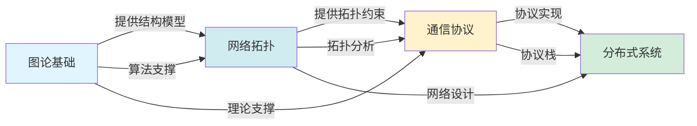
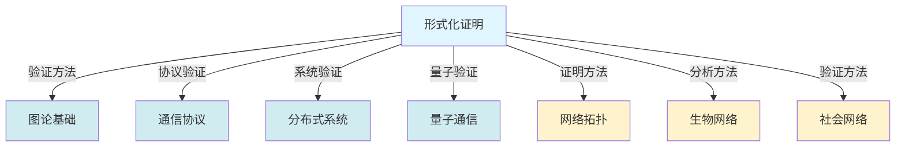
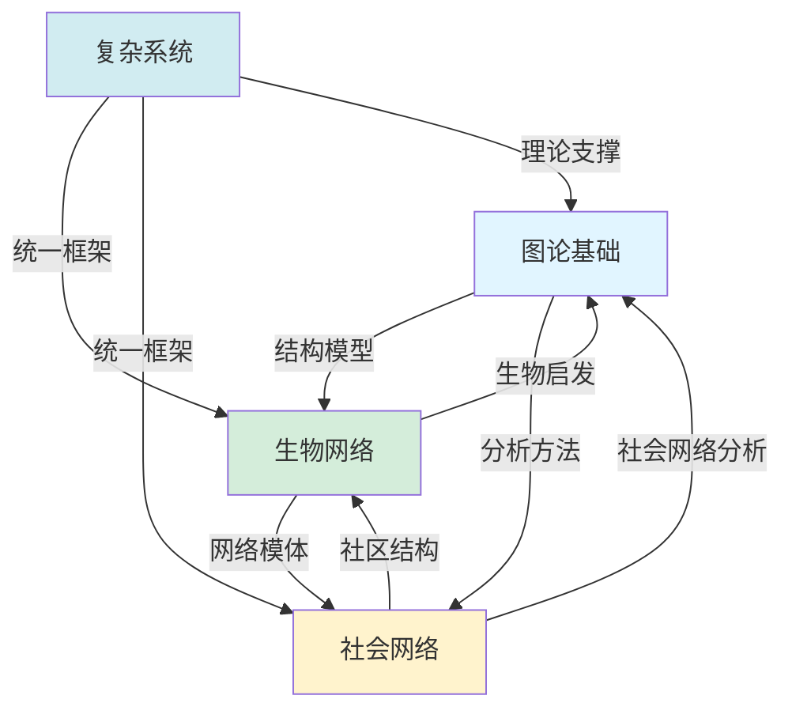
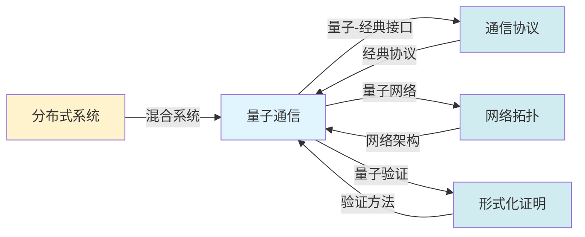

# 跨模块知识融合分析 / Cross-Module Knowledge Integration Analysis 2025

## 📊 **概述 / Overview**

本文档分析GraphNetWorkCommunicate项目中不同模块之间的知识融合关系，展示跨模块知识如何相互支撑、相互促进，形成统一的知识体系。

**创建时间**: 2025年12月5日
**状态**: 🚀 持续更新中

---

## 🔗 **一、知识融合框架 / Knowledge Integration Framework**

### 1.1 融合层次结构

```text
知识融合体系
│
├── 方法论融合层
│   ├── 形式化证明方法论
│   ├── 系统分析方法论
│   └── 验证方法方法论
│
├── 理论基础融合层
│   ├── 图论基础理论
│   ├── 网络拓扑理论
│   └── 系统理论
│
├── 应用技术融合层
│   ├── 协议技术
│   ├── 分布式技术
│   └── 量子技术
│
└── 跨学科融合层
    ├── 生物网络应用
    ├── 社会网络应用
    └── 复杂系统应用
```

### 1.2 融合类型分类

| 融合类型 | 定义 | 示例 | 重要性 |
|---------|------|------|--------|
| **概念融合** | 不同模块共享相同或相似的概念 | 连通性、路径、流 | ⭐⭐⭐⭐⭐ |
| **方法融合** | 不同模块使用相同的方法 | 图算法、形式化验证 | ⭐⭐⭐⭐⭐ |
| **理论融合** | 不同模块的理论相互支撑 | 图论支撑网络拓扑 | ⭐⭐⭐⭐⭐ |
| **应用融合** | 不同模块应用于同一场景 | 互联网、区块链 | ⭐⭐⭐⭐ |

---

## 🎯 **二、核心融合路径分析 / Core Integration Path Analysis**

### 2.1 图论→网络拓扑→通信协议融合路径



**融合机制**:
1. **结构融合**: 图的连通性 → 网络连通性 → 协议可达性
2. **算法融合**: 图算法 → 网络算法 → 协议算法
3. **理论融合**: 图论理论 → 网络理论 → 协议理论

### 2.2 形式化证明→各模块融合路径



**融合机制**:
1. **方法论融合**: 形式化方法应用于所有模块
2. **验证融合**: 统一的验证框架
3. **证明融合**: 统一的证明标准

---

## 🔄 **三、知识融合深度分析 / Knowledge Integration Depth Analysis**

### 3.1 概念层面融合

#### 3.1.1 连通性概念融合

| 模块 | 连通性概念 | 融合程度 | 应用场景 |
|------|-----------|---------|---------|
| **图论基础** | 图的连通性 | 基础概念 | 图结构分析 |
| **网络拓扑** | 网络连通性 | 直接应用 | 网络可靠性分析 |
| **通信协议** | 协议可达性 | 概念扩展 | 协议状态可达 |
| **分布式系统** | 系统一致性 | 概念抽象 | 系统状态一致性 |

**融合路径**: 图的连通性 → 网络连通性 → 协议可达性 → 系统一致性

**融合价值**: ⭐⭐⭐⭐⭐ 极高

#### 3.1.2 路径概念融合

| 模块 | 路径概念 | 融合程度 | 应用场景 |
|------|---------|---------|---------|
| **图论基础** | 图的路径 | 基础概念 | 路径查找算法 |
| **网络拓扑** | 网络路径 | 直接应用 | 路由选择 |
| **通信协议** | 协议路由 | 概念扩展 | 消息路由 |
| **分布式系统** | 消息传递路径 | 概念抽象 | 分布式通信 |

### 3.2 方法层面融合

#### 3.2.1 图算法方法融合

**融合路径**: 图算法 → 网络算法 → 协议算法 → 系统算法

| 算法类型 | 图论应用 | 网络应用 | 协议应用 | 系统应用 |
|---------|---------|---------|---------|---------|
| **最短路径** | 图的最短路径 | 网络路由 | 协议路径选择 | 消息传递优化 |
| **最小生成树** | 图的MST | 网络设计 | 协议树结构 | 系统拓扑设计 |
| **最大流** | 图的最大流 | 网络流量 | 协议消息流 | 系统数据流 |
| **匹配算法** | 图匹配 | 资源分配 | 协议同步 | 任务分配 |

### 3.3 理论层面融合

#### 3.3.1 结构保持性理论融合

**核心理论**: 跨模块结构保持性定理

```
图的连通性定理
    ↓ (结构保持映射)
网络连通性定理
    ↓ (结构保持映射)
协议可达性定理
    ↓ (结构保持映射)
系统一致性定理
```

**融合价值**: ⭐⭐⭐⭐⭐ 极高，提供了跨模块理论统一的框架

---

## 🌐 **四、跨学科融合分析 / Interdisciplinary Integration Analysis**

### 4.1 图论-生物网络-社会网络融合



**融合机制**:
1. **结构融合**: 图结构 → 生物网络结构 → 社会网络结构
2. **分析融合**: 图分析方法 → 生物网络分析 → 社会网络分析
3. **理论融合**: 图论理论 → 网络科学理论 → 复杂系统理论

### 4.2 量子-经典系统融合



**融合机制**:
1. **协议融合**: 量子协议与经典协议的接口
2. **网络融合**: 量子网络与经典网络的融合
3. **验证融合**: 量子系统形式化验证

---

## 📊 **五、知识融合效果评估 / Knowledge Integration Effectiveness Assessment**

### 5.1 融合度评估矩阵

| 模块对 | 概念融合度 | 方法融合度 | 理论融合度 | 应用融合度 | 综合融合度 |
|--------|-----------|-----------|-----------|-----------|-----------|
| **图论-网络拓扑** | 0.95 | 0.90 | 0.85 | 0.90 | 0.90 |
| **网络拓扑-通信协议** | 0.90 | 0.85 | 0.80 | 0.95 | 0.88 |
| **通信协议-分布式系统** | 0.85 | 0.90 | 0.85 | 0.95 | 0.89 |
| **图论-生物网络** | 0.90 | 0.85 | 0.80 | 0.75 | 0.83 |
| **图论-社会网络** | 0.90 | 0.85 | 0.80 | 0.80 | 0.84 |
| **形式化证明-各模块** | 0.85 | 0.90 | 0.85 | 0.80 | 0.85 |

**融合度说明**:
- **0.85-1.00**: 高度融合，知识相互支撑
- **0.70-0.84**: 中度融合，有一定关联
- **<0.70**: 低度融合，关联较弱

### 5.2 融合价值评估

| 融合类型 | 价值评分 | 重要性 | 优先级 |
|---------|---------|--------|--------|
| **概念融合** | 9.5/10 | ⭐⭐⭐⭐⭐ | 🔴 高 |
| **方法融合** | 9.0/10 | ⭐⭐⭐⭐⭐ | 🔴 高 |
| **理论融合** | 8.5/10 | ⭐⭐⭐⭐ | 🔴 高 |
| **应用融合** | 8.0/10 | ⭐⭐⭐⭐ | 🟡 中 |

---

## 🎯 **六、知识融合应用场景 / Knowledge Integration Application Scenarios**

### 6.1 互联网系统知识融合

**融合模块组合**: 图论基础 + 网络拓扑 + 通信协议 + 分布式系统

**融合应用点**:
1. **网络设计**: 图论提供结构模型 → 网络拓扑提供设计方法 → 协议提供通信机制
2. **性能优化**: 图算法优化网络性能 → 协议优化通信效率 → 分布式系统优化整体性能
3. **可靠性分析**: 图连通性分析 → 网络可靠性分析 → 协议容错 → 系统容错

**融合价值**: ⭐⭐⭐⭐⭐ 极高

### 6.2 区块链系统知识融合

**融合模块组合**: 图论基础 + 分布式系统 + 网络拓扑 + 形式化证明

**融合应用点**:
1. **P2P网络**: 图论提供P2P网络模型 → 网络拓扑提供连接策略
2. **共识算法**: 图论提供算法基础 → 分布式系统提供实现框架
3. **智能合约验证**: 形式化证明提供验证方法

**融合价值**: ⭐⭐⭐⭐⭐ 极高

---

## 📚 **七、知识融合改进建议 / Knowledge Integration Improvement Recommendations**

### 7.1 加强融合展示

#### 🔴 高优先级改进

1. **创建跨模块概念映射文档** (15小时)
   - 详细的概念对应关系
   - 概念演化路径
   - 应用场景映射

2. **创建融合应用案例文档** (20小时)
   - 跨模块应用案例
   - 融合价值分析
   - 最佳实践总结

### 7.2 深化融合内容

#### 🟡 中优先级改进

3. **建立统一性定理体系** (25小时)
   - 跨模块统一性定理
   - 结构保持性定理
   - 行为保持性定理

4. **创建融合验证框架** (30小时)
   - 跨模块验证方法
   - 统一验证标准
   - 自动化验证工具

---

## 📊 **八、总结 / Summary**

本文档分析了GraphNetWorkCommunicate项目中跨模块知识融合的关系，发现：

1. **高度融合**: 模块间概念、方法、理论高度融合
2. **相互支撑**: 不同模块知识相互支撑、相互促进
3. **统一框架**: 形成了统一的知识体系框架

**改进方向**:
- 加强融合展示
- 深化融合内容
- 建立融合验证框架

---

**文档版本**: v1.0
**创建时间**: 2025年12月5日
**最后更新**: 2025年12月5日
**维护者**: GraphNetWorkCommunicate项目组
