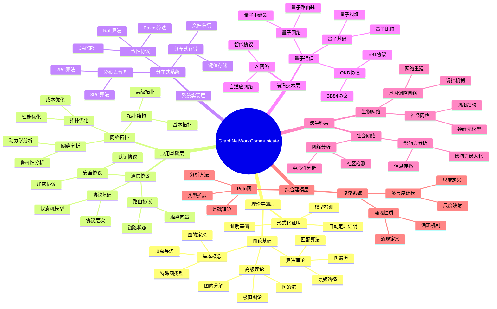
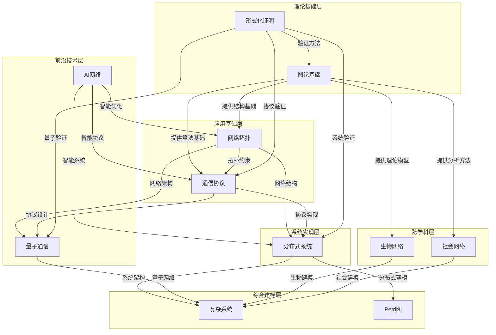
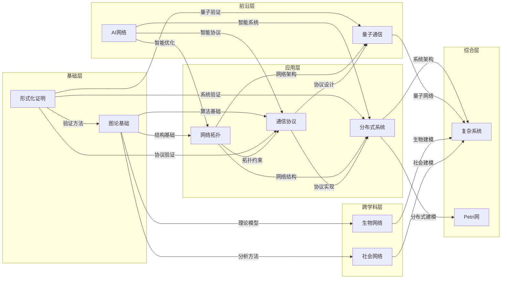
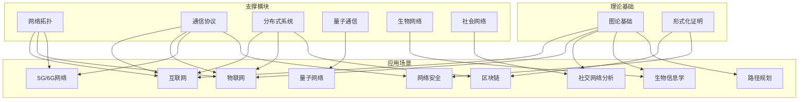
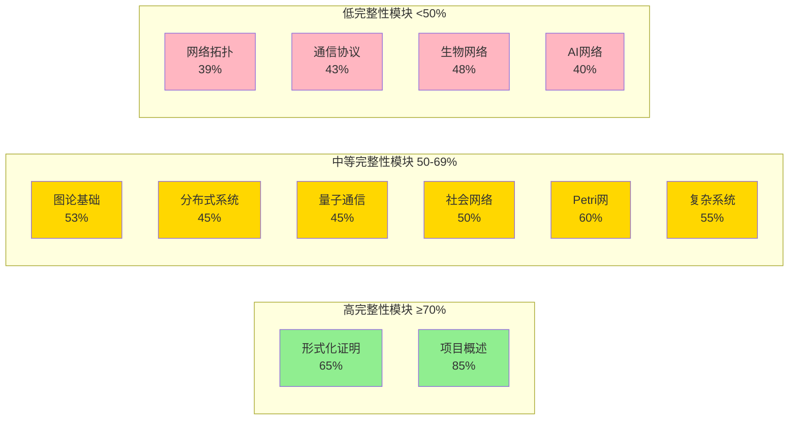
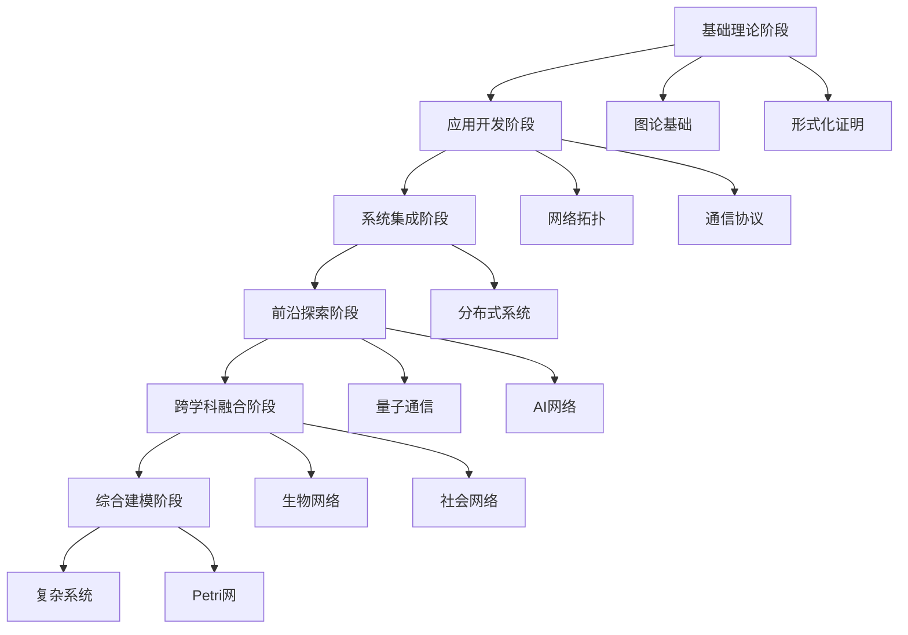
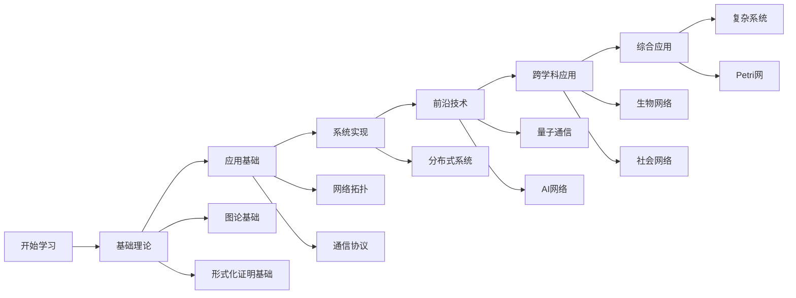

# 项目主题关联性思维导图 / Project Topic Relationship Mind Map 2025

## 📚 **概述 / Overview**

本文档提供GraphNetWorkCommunicate项目全局主题与子主题关联性的完整思维导图，采用多种可视化方式展示项目知识体系的结构和关联关系。

**创建时间**: 2025年12月5日
**状态**: 🚀 持续更新中

---

## 🗺️ **一、全局主题层次结构思维导图 / Global Topic Hierarchy Mind Map**

---

## 🔗 **二、跨模块主题关联关系图 / Cross-Module Topic Relationship Diagram**

---

## 📊 **三、主题相关性矩阵 / Topic Relevance Matrix**

### 3.1 模块间主题相关性矩阵

| 模块 | 图论基础 | 网络拓扑 | 通信协议 | 分布式系统 | 量子通信 | 生物网络 | 社会网络 | 形式化证明 |
|------|---------|---------|---------|-----------|---------|---------|---------|-----------|
| **图论基础** | 1.00 | 0.85 | 0.75 | 0.70 | 0.60 | 0.80 | 0.80 | 0.90 |
| **网络拓扑** | 0.85 | 1.00 | 0.90 | 0.85 | 0.75 | 0.75 | 0.85 | 0.75 |
| **通信协议** | 0.75 | 0.90 | 1.00 | 0.95 | 0.80 | 0.60 | 0.70 | 0.85 |
| **分布式系统** | 0.70 | 0.85 | 0.95 | 1.00 | 0.70 | 0.65 | 0.75 | 0.80 |
| **量子通信** | 0.60 | 0.75 | 0.80 | 0.70 | 1.00 | 0.55 | 0.60 | 0.85 |
| **生物网络** | 0.80 | 0.75 | 0.60 | 0.65 | 0.55 | 1.00 | 0.70 | 0.70 |
| **社会网络** | 0.80 | 0.85 | 0.70 | 0.75 | 0.60 | 0.70 | 1.00 | 0.70 |
| **形式化证明** | 0.90 | 0.75 | 0.85 | 0.80 | 0.85 | 0.70 | 0.70 | 1.00 |

**相关性说明**:

- **1.00**: 自身相关性
- **0.85-0.95**: 极强相关性（核心依赖关系）
- **0.70-0.84**: 强相关性（重要依赖关系）
- **0.55-0.69**: 中等相关性（一般关联）
- **<0.55**: 弱相关性（间接关联）

### 3.2 核心概念关联矩阵

| 图论概念 | 网络拓扑概念 | 通信协议概念 | 分布式系统概念 | 关联强度 |
|---------|------------|------------|--------------|---------|
| **图的连通性** | 网络连通性 | 协议可达性 | 系统一致性 | ⭐⭐⭐⭐⭐ |
| **图的割** | 网络分割 | 协议死锁 | 系统分区 | ⭐⭐⭐⭐ |
| **图的路径** | 网络路径 | 协议路由 | 消息传递 | ⭐⭐⭐⭐⭐ |
| **图的匹配** | 资源分配 | 协议同步 | 任务分配 | ⭐⭐⭐⭐ |
| **图的流** | 网络流量 | 协议消息流 | 数据流 | ⭐⭐⭐⭐⭐ |
| **图的着色** | 资源分配 | 协议调度 | 任务调度 | ⭐⭐⭐ |
| **图的同构** | 网络等价性 | 协议等价性 | 系统等价性 | ⭐⭐⭐ |
| **图的嵌入** | 网络嵌入 | 协议映射 | 系统映射 | ⭐⭐⭐⭐ |

---

## 🌐 **四、主题依赖关系图 / Topic Dependency Diagram**

---

## 🎯 **五、主题应用场景关联图 / Topic Application Scenario Relationship Diagram**

---

## 📈 **六、主题完整性评估图 / Topic Completeness Assessment Diagram**

---

## 🔄 **七、主题演进关系图 / Topic Evolution Relationship Diagram**

---

## 📚 **八、主题学习路径图 / Topic Learning Path Diagram**

---

## 🎯 **九、主题优先级矩阵 / Topic Priority Matrix**

| 主题 | 重要性 | 紧急性 | 完整性 | 优先级评分 | 优先级等级 |
|------|--------|--------|--------|-----------|-----------|
| 图的分解理论 | 高 | 高 | 低 | 9 | 🔴 P0 |
| 图的流理论 | 高 | 高 | 低 | 9 | 🔴 P0 |
| 网络动力学 | 高 | 高 | 低 | 9 | 🔴 P0 |
| 协议形式化验证 | 高 | 高 | 中 | 8 | 🔴 P0 |
| 分布式事务处理 | 高 | 中 | 低 | 7 | 🔴 P1 |
| Graph Transformer | 高 | 高 | 低 | 9 | 🔴 P0 |
| 6G协议栈 | 高 | 高 | 低 | 9 | 🔴 P0 |
| Web3架构 | 高 | 中 | 低 | 7 | 🔴 P1 |
| 量子互联网 | 中 | 中 | 低 | 6 | 🟡 P2 |
| 生物网络分析 | 中 | 中 | 中 | 6 | 🟡 P2 |

**优先级评分说明**:

- **9-10**: 🔴 P0（最高优先级，立即处理）
- **7-8**: 🔴 P1（高优先级，近期处理）
- **5-6**: 🟡 P2（中优先级，中期处理）
- **3-4**: 🟢 P3（低优先级，长期处理）
- **1-2**: ⚪ P4（最低优先级，待定）

---

## 📋 **十、总结 / Summary**

本文档提供了GraphNetWorkCommunicate项目全局主题关联性的多种可视化表示：

1. **全局主题层次结构思维导图**: 展示项目的完整知识体系结构
2. **跨模块主题关联关系图**: 展示模块间的依赖和关联关系
3. **主题相关性矩阵**: 量化模块间的相关性程度
4. **主题依赖关系图**: 展示主题间的依赖关系
5. **主题应用场景关联图**: 展示主题在不同应用场景中的应用
6. **主题完整性评估图**: 展示各模块的完整性状况
7. **主题演进关系图**: 展示主题的演进路径
8. **主题学习路径图**: 为学习者提供学习路径指导
9. **主题优先级矩阵**: 为任务规划提供优先级参考

这些思维表征工具可以帮助：

- **理解项目结构**: 清晰了解项目的知识体系组织
- **规划学习路径**: 为学习者提供系统化的学习指导
- **任务优先级排序**: 为后续工作提供优先级参考
- **跨模块关联分析**: 深入理解模块间的关联关系

---

**文档版本**: v1.0
**创建时间**: 2025年12月5日
**最后更新**: 2025年12月5日
**维护者**: GraphNetWorkCommunicate项目组
