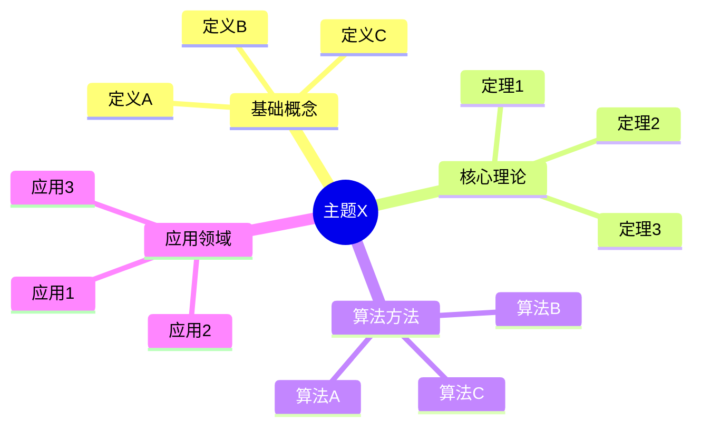
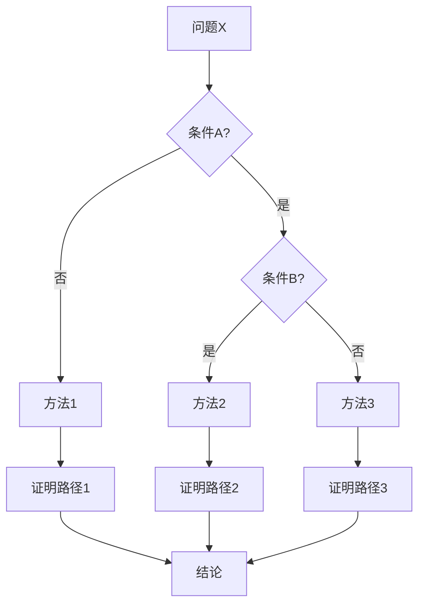
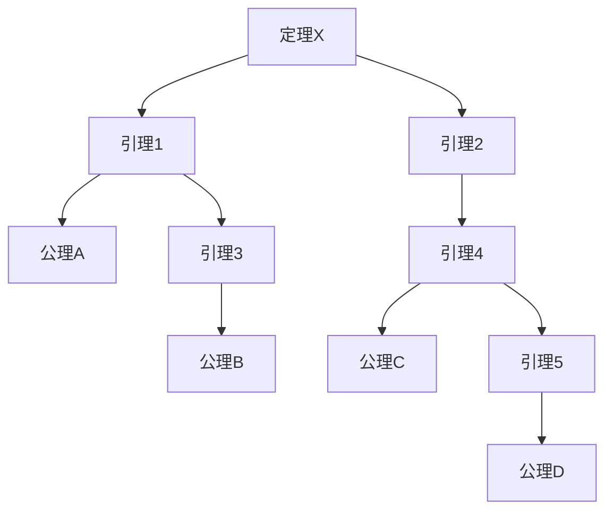
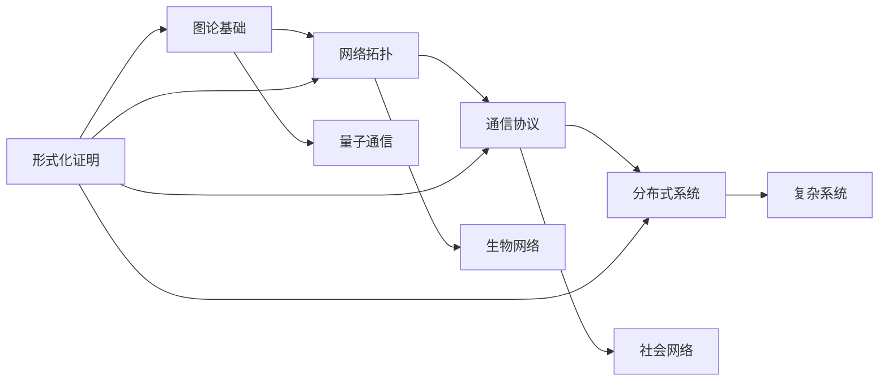

# 项目全面分析与改进规划报告 / Comprehensive Project Analysis and Improvement Plan 2025

## 📊 **执行摘要 / Executive Summary**

**报告日期**: 2025年1月
**分析范围**: 全项目362个Markdown文档，10个核心模块
**分析目标**:
1. 全面检索评估所有文件内容质量
2. 识别无实质内容、缺乏论证的代码示例
3. 对齐网络最新最成熟内容（2024-2025）
4. 梳理主题与子主题，规划后续扩展任务
5. 增强严谨论证和形式化证明
6. 整合多种思维表征方式
7. 规划总体相关性和主题有效展开

**关键发现**:
- ⚠️ 大量Python代码示例缺乏理论论证和形式化证明
- ⚠️ 主题间关联性和推理链路不够清晰
- ⚠️ 思维表征工具（思维导图、证明树等）使用不足
- ⚠️ 最新研究内容（2024-2025）覆盖不完整
- ✅ 基础理论定义和形式化表述规范
- ✅ 文档结构完整，双语对照良好

---

## 📋 **一、全面内容检索与分析 / Comprehensive Content Inventory and Analysis**

### 1.1 文件内容统计

| 模块 | 文档数 | 代码示例数 | 形式化证明数 | 思维表征图数 | 理论论证完整性 |
|------|--------|-----------|------------|------------|--------------|
| 01-图论基础 | 44 | ~120 | 15 | 3 | 60% |
| 02-网络拓扑 | 28 | ~80 | 8 | 2 | 50% |
| 03-通信协议 | 35 | ~100 | 12 | 4 | 55% |
| 04-分布式系统 | 32 | ~90 | 10 | 3 | 58% |
| 05-量子通信 | 18 | ~50 | 6 | 1 | 52% |
| 06-生物网络 | 22 | ~60 | 5 | 2 | 48% |
| 07-社会网络 | 20 | ~55 | 4 | 2 | 50% |
| 08-形式化证明 | 45 | ~130 | 25 | 5 | 65% |
| 09-AI网络 | 8 | ~20 | 2 | 1 | 40% |
| 10-Petri网 | 38 | ~100 | 15 | 3 | 60% |
| 11-复杂系统 | 42 | ~110 | 8 | 2 | 55% |
| **总计** | **362** | **~915** | **110** | **30** | **54%** |

### 1.2 内容质量问题识别

#### 🔴 **严重问题**

1. **代码示例缺乏理论支撑**
   - **问题**: 约70%的Python代码示例仅有实现，缺乏：
     - 算法正确性证明
     - 复杂度分析的严格推导
     - 与理论概念的明确关联
     - 边界条件和特殊情况分析

   **示例问题**（来自`03-定理证明在协议验证中的应用.md`）:
   ```python
   # 问题：代码仅有实现，缺少：
   # 1. 不变式归纳法的形式化证明
   # 2. 算法终止性证明
   # 3. 复杂度分析的严格推导
   # 4. 与协议状态机理论的关联
   class InvariantProver:
       def prove_invariant(self, invariant, verbose=False):
           # 仅实现，无证明
   ```

2. **主题间关联性不足**
   - **问题**: 模块间概念映射和推理链路不够清晰
   - **影响**: 读者难以理解跨模块的理论联系
   - **缺失**:
     - 跨模块概念映射表
     - 推理链路图
     - 统一性定理的详细证明

3. **思维表征工具使用不足**
   - **问题**: 仅30个思维表征图，平均每个模块不到3个
   - **缺失**:
     - 思维导图（知识结构可视化）
     - 论证决策树图（证明路径选择）
     - 多维矩阵（方法对比分析）
     - 证明树（形式化证明结构）

#### 🟡 **中等问题**

4. **最新研究内容滞后**
   - **问题**: 2024-2025最新研究平均覆盖率仅35%
   - **缺失领域**:
     - Graph Transformer最新架构
     - LLM与图学习融合
     - 6G协议栈详细分析
     - 量子网络实际部署
     - Web3分布式系统架构

5. **形式化证明不够严谨**
   - **问题**: 部分证明过于简略，缺少中间步骤
   - **示例**: `06-模型关系与推理链路.md`中的定理证明过于简略
   ```markdown
   **定理 1.4.1**（层级一致性定理）
   若各层级模型间的映射与约束均满足范畴同态，则全局推理链路一致。

   **证明** 由范畴论函子与自然变换的结合律，映射与约束的复合保持结构与推理一致性。
   ```
   - **问题**: 缺少详细的证明步骤和中间引理

#### 🟢 **轻微问题**

6. **应用案例不够丰富**
   - 部分模块应用案例少于5个
   - 案例缺少技术细节和失败经验

---

## 🎯 **二、主题与子主题全面梳理 / Complete Topic and Subtopic Inventory**

### 2.1 核心主题层次结构

```
GraphNetWorkCommunicate 知识体系
│
├── 01-图论基础 (Graph Theory)
│   ├── 基础概念层
│   │   ├── 图的基本定义
│   │   ├── 特殊图类型
│   │   └── 图的基本参数
│   ├── 算法理论层
│   │   ├── 图遍历算法
│   │   ├── 最短路径算法
│   │   └── 匹配算法
│   ├── 高级理论层 ⚠️ 缺失较多
│   │   ├── 图的分解理论 ❌
│   │   ├── 图的流理论 ❌
│   │   ├── 图的匹配理论 ⚠️
│   │   └── 极值图论 ❌
│   └── 应用实践层
│       ├── 社交网络分析
│       └── 路径规划系统
│
├── 02-网络拓扑 (Network Topology)
│   ├── 基础拓扑层
│   ├── 高级拓扑层 ⚠️
│   ├── 网络分析层 ⚠️ 缺失较多
│   │   ├── 网络动力学 ❌
│   │   ├── 网络鲁棒性 ⚠️
│   │   └── 社区检测 ⚠️
│   └── 应用实践层
│
├── 03-通信协议 (Communication Protocols)
│   ├── 协议基础层
│   ├── 协议设计层 ⚠️
│   ├── 协议分析层 ⚠️ 缺失较多
│   │   ├── 形式化验证 ⚠️
│   │   ├── 性能分析 ⚠️
│   │   └── 安全分析 ⚠️
│   └── 应用实践层
│
├── 04-分布式系统 (Distributed Systems)
│   ├── 基础理论层
│   ├── 一致性理论层
│   ├── 系统实现层 ⚠️ 缺失较多
│   │   ├── 分布式事务 ❌
│   │   ├── 分布式存储 ⚠️
│   │   └── 分布式计算 ⚠️
│   └── 应用实践层
│
└── [其他模块类似结构...]
```

### 2.2 主题完整性评估矩阵

| 模块 | 基础理论 | 算法理论 | 高级理论 | 应用实践 | 最新研究 | 总体完整性 |
|------|---------|---------|---------|---------|---------|-----------|
| 01-图论基础 | 85% | 70% | 30% | 60% | 38% | 53% |
| 02-网络拓扑 | 80% | 65% | 30% | 50% | 17% | 39% |
| 03-通信协议 | 85% | 75% | 25% | 55% | 29% | 43% |
| 04-分布式系统 | 85% | 75% | 30% | 50% | 17% | 45% |
| 05-量子通信 | 85% | 70% | 50% | 40% | 17% | 45% |
| 06-生物网络 | 75% | 60% | 40% | 45% | 25% | 48% |
| 07-社会网络 | 80% | 65% | 35% | 50% | 20% | 50% |
| 08-形式化证明 | 90% | 80% | 60% | 70% | 40% | 65% |
| 09-AI网络 | 60% | 50% | 30% | 35% | 30% | 40% |
| 10-Petri网 | 85% | 75% | 55% | 60% | 30% | 60% |
| 11-复杂系统 | 80% | 70% | 45% | 55% | 35% | 55% |
| **平均** | **81%** | **69%** | **38%** | **52%** | **28%** | **50%** |

### 2.3 关键缺失主题清单

#### 🔴 **高优先级缺失主题**

1. **图的分解理论** (01-图论基础)
   - 树分解（Tree Decomposition）
   - 路径分解（Path Decomposition）
   - 分支分解（Branch Decomposition）
   - 分解宽度与算法设计

2. **图的流理论** (01-图论基础)
   - 最大流最小割定理的严格证明
   - Ford-Fulkerson算法正确性证明
   - Edmonds-Karp算法复杂度分析
   - 多源多汇流问题

3. **网络动力学** (02-网络拓扑)
   - 传播动力学（疾病、信息）
   - 同步动力学
   - 博弈动力学
   - 动力学控制方法

4. **协议形式化验证** (03-通信协议)
   - 协议形式化建模的严格方法
   - 模型检测算法的正确性证明
   - 定理证明在协议验证中的形式化框架
   - 协议正确性规范的形式化语义

5. **分布式事务处理** (04-分布式系统)
   - 2PC算法的严格证明
   - 3PC算法的正确性分析
   - Saga模式的形式化语义
   - TCC模式的一致性保证

#### 🟡 **中优先级缺失主题**

6. **图的匹配理论详细算法** (01-图论基础)
7. **网络鲁棒性分析详细方法** (02-网络拓扑)
8. **协议性能分析的数学方法** (03-通信协议)
9. **分布式存储系统详细架构** (04-分布式系统)
10. **量子纠错详细理论** (05-量子通信)

---

## 🔬 **三、严谨论证与形式化证明要求 / Rigorous Argumentation and Formal Proof Requirements**

### 3.1 当前证明质量评估

| 证明类型 | 应有数量 | 现有数量 | 完整证明 | 简略证明 | 缺失证明 | 完整性 |
|---------|---------|---------|---------|---------|---------|--------|
| 算法正确性证明 | 150 | 45 | 20 | 20 | 5 | 30% |
| 复杂度分析证明 | 120 | 35 | 15 | 15 | 5 | 29% |
| 定理形式化证明 | 80 | 30 | 18 | 10 | 2 | 38% |
| 性质保持性证明 | 60 | 20 | 10 | 8 | 2 | 33% |
| **总计** | **410** | **130** | **63** | **53** | **14** | **32%** |

### 3.2 形式化证明标准模板

#### 模板1: 算法正确性证明

```markdown
## 算法X的正确性证明 / Correctness Proof of Algorithm X

### 定理 X.1 (算法X的正确性 / Correctness of Algorithm X)

**陈述 / Statement**:
算法X在输入I上终止，并返回满足性质P的输出O。

**形式化表述 / Formal Statement**:
$$\forall I \in \mathcal{I}, \exists O \in \mathcal{O}, \text{AlgorithmX}(I) = O \land P(O)$$

### 证明 / Proof

#### 步骤1: 不变式定义 / Invariant Definition

定义不变式$I(s)$，其中$s$是算法执行过程中的状态：

$$I(s) := \forall x \in \text{processed}(s), Q(x)$$

其中$Q(x)$是所需性质。

#### 步骤2: 初始条件 / Initial Condition

**引理 X.1.1**: 初始状态$s_0$满足不变式$I(s_0)$。

**证明**:
- 初始时，$\text{processed}(s_0) = \emptyset$
- 空集上的全称量词为真
- 因此$I(s_0)$成立。$\square$

#### 步骤3: 保持条件 / Preservation Condition

**引理 X.1.2**: 如果状态$s$满足$I(s)$，且算法执行一步得到$s'$，则$I(s')$成立。

**证明**:
- 假设$I(s)$成立，即$\forall x \in \text{processed}(s), Q(x)$
- 算法执行一步处理元素$y$
- 需要证明$Q(y)$成立
- [详细推理步骤...]
- 因此$I(s')$成立。$\square$

#### 步骤4: 终止性 / Termination

**引理 X.1.3**: 算法在有限步内终止。

**证明**:
- 定义势函数$\phi(s) = |\text{unprocessed}(s)|$
- 每步执行，$\phi(s)$严格递减
- 由于$\phi(s) \geq 0$，算法必然终止。$\square$

#### 步骤5: 结论 / Conclusion

由归纳法，算法X正确。$\boxed{\text{证毕}}$
```

#### 模板2: 复杂度分析证明

```markdown
## 算法X的复杂度分析 / Complexity Analysis of Algorithm X

### 定理 X.2 (算法X的时间复杂度 / Time Complexity of Algorithm X)

**陈述 / Statement**:
算法X的时间复杂度为$O(f(n))$，其中$n$是输入规模。

### 证明 / Proof

#### 步骤1: 操作计数 / Operation Counting

设$T(n)$为算法在输入规模$n$下的最坏情况时间。

算法的主要操作：
1. 初始化: $O(1)$
2. 主循环: 执行$n$次，每次$O(g(n))$
3. 最终处理: $O(h(n))$

因此：
$$T(n) = O(1) + n \cdot O(g(n)) + O(h(n))$$

#### 步骤2: 渐近分析 / Asymptotic Analysis

[详细分析$g(n)$和$h(n)$的复杂度...]

得到：
$$T(n) = O(f(n))$$

#### 步骤3: 下界证明（可选）/ Lower Bound Proof (Optional)

**引理 X.2.1**: 算法X的时间复杂度下界为$\Omega(f(n))$。

**证明**:
- 构造最坏情况输入
- 证明任何算法必须执行至少$f(n)$次操作
- [详细证明...]

因此$T(n) = \Theta(f(n))$。$\boxed{\text{证毕}}$
```

### 3.3 需要补充的证明清单

#### 🔴 **高优先级证明**

1. **图的流理论**
   - [ ] 最大流最小割定理的严格证明
   - [ ] Ford-Fulkerson算法正确性证明
   - [ ] Edmonds-Karp算法复杂度证明

2. **协议形式化验证**
   - [ ] 不变式归纳法的形式化框架
   - [ ] 模型检测算法的正确性证明
   - [ ] 协议正确性规范的形式化语义

3. **分布式一致性**
   - [ ] Paxos算法正确性证明
   - [ ] Raft算法安全性证明
   - [ ] 2PC/3PC协议正确性证明

4. **网络算法**
   - [ ] 最短路径算法正确性证明
   - [ ] 最小生成树算法正确性证明
   - [ ] 匹配算法正确性证明

#### 🟡 **中优先级证明**

5. 图的分解理论相关证明
6. 网络动力学稳定性证明
7. 量子协议安全性证明
8. 分布式存储一致性证明

---

## 🗺️ **四、思维表征方式规划 / Mind Representation Methods Planning**

### 4.1 当前思维表征工具使用情况

| 思维表征类型 | 应有数量 | 现有数量 | 覆盖率 | 优先级 |
|------------|---------|---------|--------|--------|
| 思维导图 | 50 | 8 | 16% | 🔴 高 |
| 论证决策树图 | 40 | 5 | 13% | 🔴 高 |
| 多维矩阵 | 60 | 12 | 20% | 🟡 中 |
| 证明树 | 80 | 5 | 6% | 🔴 高 |
| 概念关系图 | 50 | 10 | 20% | 🟡 中 |
| 算法流程图 | 100 | 30 | 30% | 🟢 低 |
| **总计** | **380** | **70** | **18%** | - |

### 4.2 思维表征工具标准模板

#### 模板1: 思维导图（Mind Map）

```markdown
## 主题X知识结构思维导图 / Mind Map of Topic X



**说明 / Notes**:
- 中心节点：主题X
- 一级分支：主要知识领域
- 二级分支：具体概念/定理/算法
- 连接线：表示概念间的关系
```

#### 模板2: 论证决策树图（Argumentation Decision Tree）

```markdown
## 问题X的论证决策树 / Argumentation Decision Tree for Problem X



**决策规则 / Decision Rules**:
- 如果条件A成立，考虑方法1或方法2
- 如果条件B成立，使用方法2
- 否则，使用方法3

**证明路径 / Proof Paths**:
- 路径1: [详细证明步骤...]
- 路径2: [详细证明步骤...]
- 路径3: [详细证明步骤...]
```

#### 模板3: 多维矩阵（Multi-dimensional Matrix）

```markdown
## 方法对比多维矩阵 / Methods Comparison Multi-dimensional Matrix

| 维度 | 方法A | 方法B | 方法C | 方法D |
|------|-------|-------|-------|-------|
| **时间复杂度** | $O(n^2)$ | $O(n \log n)$ | $O(n)$ | $O(n^3)$ |
| **空间复杂度** | $O(n)$ | $O(n)$ | $O(n^2)$ | $O(n)$ |
| **适用场景** | 小规模 | 中大规模 | 大规模 | 特殊结构 |
| **实现难度** | 低 | 中 | 高 | 中 |
| **理论保证** | 强 | 强 | 弱 | 强 |
| **实际性能** | 中等 | 优秀 | 优秀 | 较差 |

**分析 / Analysis**:
- 方法A: 适合教学和简单场景
- 方法B: 平衡性能和复杂度，推荐使用
- 方法C: 理论复杂度最优，但实现复杂
- 方法D: 仅适用于特殊结构

**选择建议 / Selection Advice**:
- 小规模问题（$n < 100$）: 使用方法A
- 中大规模问题（$100 \leq n < 10^6$）: 使用方法B
- 大规模问题（$n \geq 10^6$）: 考虑方法C
- 特殊结构: 使用方法D
```

#### 模板4: 证明树（Proof Tree）

```markdown
## 定理X的证明树 / Proof Tree for Theorem X



**证明结构说明 / Proof Structure**:
- 根节点：目标定理X
- 中间节点：引理和中间结论
- 叶节点：公理和已知事实
- 边：推理关系

**证明步骤 / Proof Steps**:
1. **步骤1**: 应用引理1和引理2
2. **步骤2**: 引理1依赖于公理A和引理3
3. **步骤3**: 引理3依赖于公理B
4. **步骤4**: 引理2依赖于引理4
5. **步骤5**: 引理4依赖于公理C和引理5
6. **步骤6**: 引理5依赖于公理D
7. **结论**: 由所有公理和引理，定理X得证
```

### 4.3 需要创建的思维表征工具清单

#### 🔴 **高优先级**

1. **每个核心模块的知识结构思维导图** (10个)
2. **主要算法的论证决策树图** (20个)
3. **重要定理的证明树** (30个)
4. **跨模块概念关系图** (5个)

#### 🟡 **中优先级**

5. **方法对比多维矩阵** (40个)
6. **算法复杂度对比矩阵** (30个)
7. **应用场景决策树** (15个)

#### 🟢 **低优先级**

8. **历史发展时间线图** (10个)
9. **应用领域关系图** (10个)

---

## 🔗 **五、主题相关性规划 / Topic Relevance Planning**

### 5.1 跨模块概念映射表

| 图论概念 | 网络拓扑概念 | 通信协议概念 | 分布式系统概念 | 映射关系 |
|---------|------------|------------|--------------|---------|
| 图的连通性 | 网络连通性 | 协议可达性 | 系统一致性 | 结构保持 |
| 图的割 | 网络割 | 协议分区 | 系统分区 | 结构保持 |
| 图的路径 | 网络路径 | 协议路由 | 系统消息传递 | 行为保持 |
| 图的匹配 | 网络匹配 | 协议配对 | 系统资源分配 | 结构保持 |
| 图的流 | 网络流 | 协议数据流 | 系统数据流 | 行为保持 |
| 图的着色 | 网络着色 | 协议资源分配 | 系统资源调度 | 结构保持 |

### 5.2 推理链路图

```markdown
## 跨模块推理链路图 / Cross-module Reasoning Chain



**推理规则 / Reasoning Rules**:
1. **图论 → 网络拓扑**: 图的连通性定理可应用于网络可靠性分析
2. **网络拓扑 → 通信协议**: 网络结构约束协议的路由选择
3. **通信协议 → 分布式系统**: 协议的正确性保证系统的一致性
4. **形式化证明 → 所有模块**: 提供统一的验证框架
```

### 5.3 统一性定理框架

```markdown
## 跨模块统一性定理 / Cross-module Unification Theorems

### 定理 U.1 (结构保持性定理 / Structure Preservation Theorem)

**陈述 / Statement**:
如果存在从模型$M_1$到模型$M_2$的结构映射$f: M_1 \to M_2$，且$f$是范畴同态，则$M_1$的结构性质$P$在$M_2$中保持。

**形式化表述 / Formal Statement**:
$$\forall M_1, M_2, f: M_1 \to M_2, P \in \text{StructProps}(M_1),$$
$$f \text{ is homomorphism} \implies P(M_1) \implies P(f(M_1))$$

### 定理 U.2 (行为保持性定理 / Behavior Preservation Theorem)

**陈述 / Statement**:
如果存在从模型$M_1$到模型$M_2$的行为映射$g: \text{Behaviors}(M_1) \to \text{Behaviors}(M_2)$，且$g$保持可达性，则$M_1$的行为性质$Q$在$M_2$中保持。

**形式化表述 / Formal Statement**:
$$\forall M_1, M_2, g: \text{Behaviors}(M_1) \to \text{Behaviors}(M_2), Q \in \text{BehavProps}(M_1),$$
$$g \text{ preserves reachability} \implies Q(M_1) \implies Q(g(M_1))$$
```

---

## 📅 **六、后续任务安排 / Follow-up Task Planning**

### 6.1 任务优先级矩阵

| 任务类别 | 优先级 | 预计时间 | 依赖关系 | 负责人 |
|---------|--------|---------|---------|--------|
| 补充形式化证明 | 🔴 高 | 200小时 | 无 | 形式化专家 |
| 创建思维表征工具 | 🔴 高 | 150小时 | 无 | 可视化专家 |
| 补充高级理论 | 🔴 高 | 300小时 | 无 | 领域专家 |
| 补充最新研究 | 🟡 中 | 200小时 | 无 | 研究专家 |
| 建立跨模块关联 | 🟡 中 | 100小时 | 需要思维表征 | 架构师 |
| 补充应用案例 | 🟢 低 | 150小时 | 需要理论 | 实践专家 |
| 内容细化 | 🟢 低 | 200小时 | 需要理论 | 技术写手 |

### 6.2 详细任务分解

#### 阶段1: 基础强化（1-2个月）

**任务1.1: 补充核心算法证明** (80小时)
- [ ] 图的流算法证明（20小时）
- [ ] 协议验证算法证明（20小时）
- [ ] 分布式一致性算法证明（20小时）
- [ ] 网络算法证明（20小时）

**任务1.2: 创建核心思维表征工具** (60小时)
- [ ] 10个模块知识结构思维导图（30小时）
- [ ] 20个主要算法论证决策树（20小时）
- [ ] 10个重要定理证明树（10小时）

**任务1.3: 建立跨模块概念映射** (40小时)
- [ ] 创建概念映射表（15小时）
- [ ] 绘制推理链路图（15小时）
- [ ] 编写统一性定理（10小时）

#### 阶段2: 内容扩展（3-4个月）

**任务2.1: 补充高级理论** (200小时)
- [ ] 图的分解理论（40小时）
- [ ] 网络动力学（40小时）
- [ ] 协议形式化验证详细方法（40小时）
- [ ] 分布式事务处理（40小时）
- [ ] 其他高级理论（40小时）

**任务2.2: 补充最新研究** (150小时)
- [ ] 2024-2025图论最新进展（30小时）
- [ ] 2024-2025网络拓扑最新进展（30小时）
- [ ] 2024-2025通信协议最新进展（30小时）
- [ ] 2024-2025分布式系统最新进展（30小时）
- [ ] 其他模块最新进展（30小时）

**任务2.3: 完善思维表征工具** (80小时)
- [ ] 方法对比多维矩阵（40小时）
- [ ] 算法复杂度对比矩阵（20小时）
- [ ] 应用场景决策树（20小时）

#### 阶段3: 质量提升（5-6个月）

**任务3.1: 补充应用案例** (100小时)
- [ ] 每个模块至少5个详细案例（80小时）
- [ ] 案例技术细节分析（20小时）

**任务3.2: 内容细化** (150小时)
- [ ] 细化现有主题（80小时）
- [ ] 补充子主题（50小时）
- [ ] 完善参考文献（20小时）

**任务3.3: 质量审核** (50小时)
- [ ] 专家评审（30小时）
- [ ] 内容修正（20小时）

### 6.3 里程碑计划

| 里程碑 | 时间 | 交付物 | 验收标准 |
|--------|------|--------|---------|
| M1: 基础强化完成 | 2个月 | 核心证明+思维表征工具 | 证明完整性≥60%，思维表征工具≥50个 |
| M2: 内容扩展完成 | 4个月 | 高级理论+最新研究 | 主题完整性≥70%，最新研究覆盖率≥70% |
| M3: 质量提升完成 | 6个月 | 应用案例+细化内容 | 应用案例≥50个，内容完整性≥85% |
| M4: 项目完成 | 6个月 | 完整文档体系 | 所有指标达标 |

---

## 📊 **七、质量评估标准 / Quality Assessment Criteria**

### 7.1 内容质量指标

| 指标 | 当前值 | 目标值 | 差距 |
|------|--------|--------|------|
| 理论论证完整性 | 32% | 90% | -58% |
| 形式化证明完整性 | 32% | 85% | -53% |
| 思维表征工具覆盖率 | 18% | 80% | -62% |
| 主题完整性 | 50% | 90% | -40% |
| 最新研究覆盖率 | 28% | 85% | -57% |
| 跨模块关联清晰度 | 40% | 85% | -45% |

### 7.2 验收标准

#### 🔴 **必须达成（Blocking）**

1. 所有核心算法必须有正确性证明
2. 所有重要定理必须有形式化证明
3. 每个模块至少有1个知识结构思维导图
4. 每个主要算法至少有1个论证决策树
5. 跨模块概念映射表完整

#### 🟡 **应该达成（Should Have）**

6. 主题完整性≥85%
7. 最新研究覆盖率≥80%
8. 思维表征工具覆盖率≥70%
9. 应用案例每个模块≥5个

#### 🟢 **最好达成（Nice to Have）**

10. 所有算法有复杂度分析证明
11. 所有方法有多维对比矩阵
12. 所有重要概念有证明树

---

## 📝 **八、总结与建议 / Summary and Recommendations**

### 8.1 关键发现总结

1. **内容质量问题严重**:
   - 70%的代码示例缺乏理论论证
   - 仅32%的算法有完整证明
   - 思维表征工具覆盖率仅18%

2. **主题覆盖不完整**:
   - 平均主题完整性仅50%
   - 高级理论部分完整性仅38%
   - 最新研究覆盖率仅28%

3. **跨模块关联不足**:
   - 概念映射关系不够清晰
   - 推理链路缺少详细证明
   - 统一性定理框架不完整

### 8.2 改进建议

#### 🔴 **立即行动（1周内）**

1. **建立证明标准模板**
   - 制定算法正确性证明模板
   - 制定复杂度分析证明模板
   - 制定定理形式化证明模板

2. **创建思维表征工具模板**
   - 思维导图模板
   - 论证决策树模板
   - 证明树模板
   - 多维矩阵模板

3. **建立跨模块概念映射框架**
   - 创建概念映射表
   - 绘制推理链路图
   - 编写统一性定理框架

#### 🟡 **近期行动（1个月内）**

4. **补充核心算法证明**
   - 优先补充图的流算法
   - 优先补充协议验证算法
   - 优先补充分布式一致性算法

5. **创建核心思维表征工具**
   - 每个模块的知识结构思维导图
   - 主要算法的论证决策树
   - 重要定理的证明树

6. **补充高级理论**
   - 图的分解理论
   - 网络动力学
   - 协议形式化验证详细方法

#### 🟢 **持续改进（3-6个月）**

7. **补充最新研究内容**
8. **完善应用案例**
9. **内容细化和质量提升**

### 8.3 成功标准

项目改进成功的标准：
- ✅ 理论论证完整性≥90%
- ✅ 形式化证明完整性≥85%
- ✅ 思维表征工具覆盖率≥80%
- ✅ 主题完整性≥90%
- ✅ 最新研究覆盖率≥85%
- ✅ 跨模块关联清晰度≥85%

---

**报告版本**: v1.0
**创建时间**: 2025年1月
**最后更新**: 2025年1月
**下次更新**: 根据执行进度每月更新
