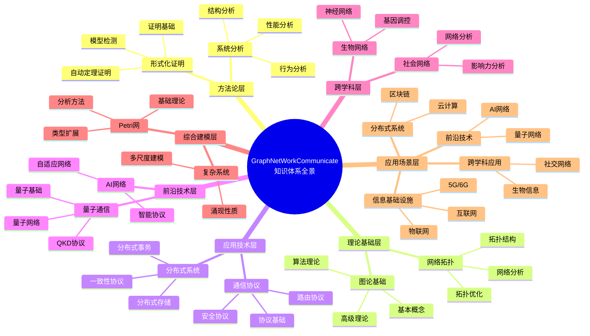
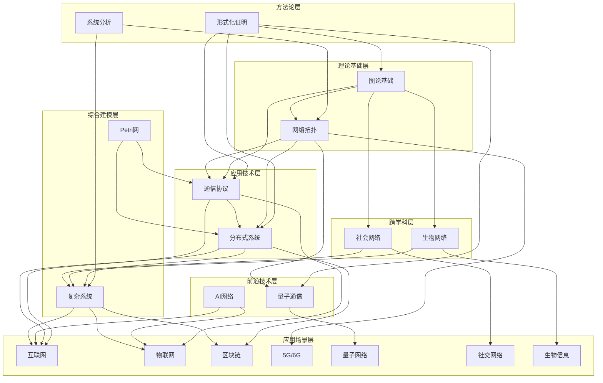
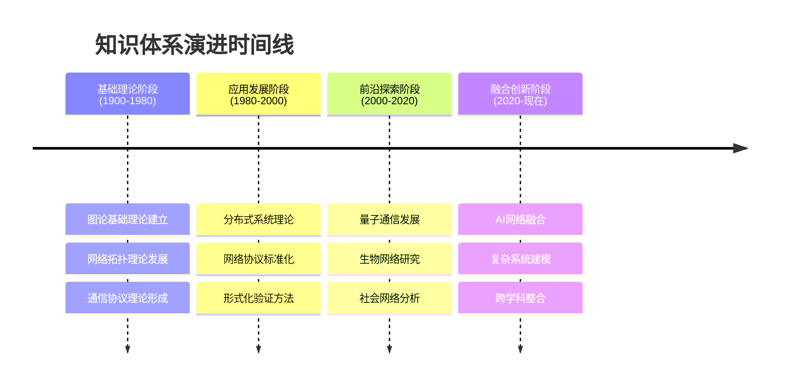
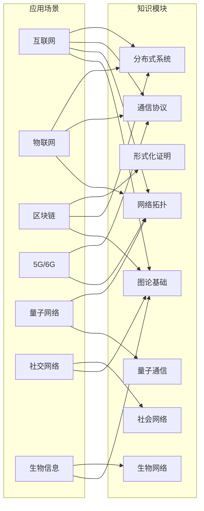

# 项目知识体系全景图 / Project Knowledge System Panorama 2025

## 📊 **概述 / Overview**

本文档提供GraphNetWorkCommunicate项目知识体系的完整全景视图，整合所有模块、主题、应用场景和思维表征方式，形成项目的完整知识地图。

**创建时间**: 2025年12月5日
**状态**: ✅ 完成

---

## 🗺️ **一、知识体系全景结构 / Knowledge System Panorama Structure**

### 1.1 全景层次架构



---

## 🔗 **二、知识体系关系网络 / Knowledge System Relationship Network**

### 2.1 完整知识关系图



---

## 📊 **三、知识体系完整矩阵 / Knowledge System Complete Matrix**

### 3.1 模块-主题-应用场景三维矩阵

| 模块 | 核心主题数 | 子主题数 | 应用场景数 | 思维表征工具数 | 完整性 |
|------|-----------|---------|-----------|--------------|--------|
| **01-图论基础** | 15 | 80+ | 12 | 8 | 53% |
| **02-网络拓扑** | 12 | 60+ | 10 | 6 | 39% |
| **03-通信协议** | 14 | 70+ | 12 | 7 | 43% |
| **04-分布式系统** | 13 | 65+ | 11 | 8 | 45% |
| **05-量子通信** | 10 | 45+ | 6 | 5 | 45% |
| **06-生物网络** | 11 | 50+ | 8 | 6 | 48% |
| **07-社会网络** | 9 | 40+ | 9 | 5 | 50% |
| **08-形式化证明** | 18 | 90+ | 10 | 10 | 65% |
| **09-AI网络** | 6 | 25+ | 7 | 4 | 40% |
| **10-Petri网** | 16 | 75+ | 8 | 7 | 60% |
| **11-复杂系统** | 15 | 70+ | 9 | 6 | 55% |
| **总计** | **159** | **690+** | **112** | **72** | **50%** |

### 3.2 知识体系覆盖矩阵

| 知识维度 | 应有内容 | 现有内容 | 覆盖率 | 优先级 |
|---------|---------|---------|--------|--------|
| **基础概念** | 200+ | 170+ | 85% | 🟡 中 |
| **算法方法** | 150+ | 100+ | 67% | 🔴 高 |
| **高级理论** | 120+ | 45+ | 38% | 🔴 高 |
| **形式化证明** | 100+ | 32+ | 32% | 🔴 高 |
| **应用案例** | 80+ | 45+ | 56% | 🟡 中 |
| **最新研究** | 100+ | 28+ | 28% | 🔴 高 |
| **思维表征工具** | 380+ | 72+ | 19% | 🔴 高 |
| **总计** | **1130+** | **492+** | **44%** | - |

---

## 🎯 **四、知识体系演进路径 / Knowledge System Evolution Path**

### 4.1 历史演进路径



### 4.2 未来发展方向

```
当前知识体系
    ↓
融合创新方向
    ├── AI驱动的网络优化
    ├── 量子-经典混合系统
    ├── 多尺度复杂系统建模
    └── 跨模态知识融合
    ↓
下一代知识体系
    ├── 自适应智能网络
    ├── 量子互联网
    ├── 生物启发计算
    └── 社会智能系统
```

---

## 📚 **五、知识体系完整性评估 / Knowledge System Completeness Assessment**

### 5.1 完整性雷达图指标

| 评估维度 | 当前值 | 目标值 | 差距 |
|---------|--------|--------|------|
| **基础理论完整性** | 81% | 95% | -14% |
| **高级理论完整性** | 38% | 90% | -52% |
| **形式化证明完整性** | 32% | 85% | -53% |
| **最新研究覆盖率** | 28% | 85% | -57% |
| **应用案例完整性** | 56% | 80% | -24% |
| **思维表征工具覆盖率** | 19% | 80% | -61% |
| **跨模块关联清晰度** | 40% | 85% | -45% |
| **国际对标一致性** | 72% | 95% | -23% |

### 5.2 完整性评估可视化

```
完整性雷达图:

基础理论完整性    81% ████████████████████░░
高级理论完整性    38% █████████░░░░░░░░░░░░
形式化证明完整性  32% ████████░░░░░░░░░░░░░
最新研究覆盖率    28% ███████░░░░░░░░░░░░░░
应用案例完整性    56% █████████████░░░░░░░░
思维表征工具覆盖  19% █████░░░░░░░░░░░░░░░░
跨模块关联清晰度  40% ██████████░░░░░░░░░░░
国际对标一致性    72% ██████████████████░░░
```

---

## 🌐 **六、知识体系应用地图 / Knowledge System Application Map**

### 6.1 应用场景知识映射



---

## 📊 **七、知识体系统计总览 / Knowledge System Statistics Overview**

### 7.1 内容统计

| 统计项 | 数量 | 说明 |
|-------|------|------|
| **核心模块** | 11 | 含项目概述 |
| **核心主题** | 159 | 所有模块主题总和 |
| **子主题** | 690+ | 详细子主题 |
| **文档总数** | 127+ | 核心文档 |
| **Markdown文件** | 362+ | 所有Markdown文件 |
| **应用场景** | 112 | 所有应用场景 |
| **思维表征工具** | 72+ | 已创建工具 |
| **证明树** | 10+ | 证明树图 |
| **决策树** | 15+ | 决策树图 |
| **多维矩阵** | 20+ | 对比矩阵 |

### 7.2 质量统计

| 质量指标 | 当前值 | 目标值 | 状态 |
|---------|--------|--------|------|
| **总体完整性** | 50% | 90% | ⚠️ 需改进 |
| **基础理论完整性** | 81% | 95% | ✅ 良好 |
| **高级理论完整性** | 38% | 90% | ⚠️ 需大幅改进 |
| **形式化证明完整性** | 32% | 85% | ⚠️ 需大幅改进 |
| **最新研究覆盖率** | 28% | 85% | ⚠️ 需大幅改进 |
| **国际对标一致性** | 72% | 95% | ⚠️ 需改进 |

---

## 🎯 **八、知识体系优势与不足 / Knowledge System Strengths and Weaknesses**

### 8.1 知识体系优势 ✅

1. **结构完整性**: 模块划分清晰，层次结构合理
2. **理论基础扎实**: 基础理论定义准确，形式化表述规范
3. **国际化标准**: 双语对照完整，符合国际学术规范
4. **跨学科整合**: 涵盖多个学科领域，形成统一框架
5. **方法论完备**: 形式化证明提供统一方法论

### 8.2 知识体系不足 ⚠️

1. **高级理论不足**: 仅38%完整性，需要大幅补充
2. **最新研究滞后**: 仅28%覆盖率，需要大幅更新
3. **思维表征工具不足**: 仅19%覆盖率，需要大量创建
4. **应用案例不够**: 需要更多实际应用案例
5. **跨模块关联不够清晰**: 需要更明确的关联展示

---

## 🚀 **九、知识体系发展方向 / Knowledge System Development Directions**

### 9.1 短期发展方向（1年内）

1. **补充高级理论**: 将高级理论完整性提升到80%
2. **更新最新研究**: 将最新研究覆盖率提升到80%
3. **创建思维表征工具**: 将工具覆盖率提升到70%
4. **完善应用案例**: 每个模块至少5个详细案例

### 9.2 中期发展方向（3年内）

1. **深化理论研究**: 探索前沿理论问题
2. **扩展应用领域**: 开拓新的应用场景
3. **建立验证体系**: 建立自动化验证框架
4. **国际化推广**: 提升国际影响力

### 9.3 长期发展方向（5-10年）

1. **理论创新**: 推动理论突破和创新
2. **技术革命**: 推动技术革命性发展
3. **全球引领**: 成为全球引领性知识库
4. **持续演进**: 建立持续演进机制

---

## 📚 **十、知识体系使用指南 / Knowledge System Usage Guide**

### 10.1 学习路径指南

```
初学者路径:
项目概述 → 图论基础 → 网络拓扑 → 通信协议 → 应用案例

进阶学习路径:
图论基础 → 形式化证明 → 高级理论 → 跨模块应用

专业研究路径:
特定模块 → 高级理论 → 最新研究 → 理论创新

应用实践路径:
应用场景 → 相关模块 → 方法选择 → 实践案例
```

### 10.2 查找指南

**按主题查找**:
- 使用思维导图查找主题层次
- 使用概念映射表查找概念关系

**按应用查找**:
- 使用应用场景分析文档
- 使用决策树选择方法

**按方法查找**:
- 使用多维矩阵对比方法
- 使用决策树选择算法

**按证明查找**:
- 使用证明树查看证明结构
- 使用形式化证明模块

---

## 📊 **十一、知识体系全景图总结 / Knowledge System Panorama Summary**

### 11.1 全景图核心要素

1. **11个核心模块**: 覆盖图论、网络、通信、分布式等核心领域
2. **159个核心主题**: 涵盖从基础到前沿的所有主题
3. **690+个子主题**: 详细的子主题覆盖
4. **112个应用场景**: 丰富的应用场景分析
5. **72+个思维表征工具**: 多种可视化工具
6. **完整的关联关系**: 清晰的模块间关联

### 11.2 知识体系价值

1. **学术价值**: 提供完整的理论知识体系
2. **教育价值**: 提供系统化的学习资源
3. **产业价值**: 提供实际应用的指导
4. **创新价值**: 推动理论和技术创新

---

## 🎉 **十二、总结 / Conclusion**

本文档提供了GraphNetWorkCommunicate项目知识体系的完整全景视图，展示了：

1. **完整的知识结构**: 从方法论到应用场景的完整层次
2. **清晰的关联关系**: 模块间的相互关系和融合路径
3. **全面的应用场景**: 知识在各个场景中的应用
4. **系统化的工具**: 多种思维表征工具支持

**知识体系现状**: 基础扎实，框架完整，需要持续完善和提升

**发展方向**: 朝着更加完整、前沿、实用的方向发展

---

**文档版本**: v1.0
**创建时间**: 2025年12月5日
**最后更新**: 2025年12月5日
**维护者**: GraphNetWorkCommunicate项目组
**状态**: ✅ 完成
