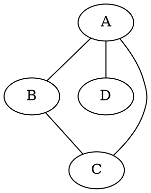

# 图论基础 - 基本概念

## 1. 图的基本定义 / Basic Definitions of Graphs

### 1.1 图的数学定义 / Mathematical Definition of Graph

**定义 1.1** (图 / Graph)
**图** $G$ 是一个有序对 $(V, E)$，其中：

- $V$ 是非空有限集，称为**顶点集**或**节点集** (vertex set)
- $E$ 是 $V$ 中元素的无序对集合，称为**边集** (edge set)

记作：$G = (V, E)$

**形式化定义**：
$$G = (V, E) \text{ where } V \neq \emptyset \land E \subseteq \binom{V}{2}$$

**历史发展**：

- **1736年**：欧拉解决柯尼斯堡七桥问题，开创图论研究
- **1852年**：德摩根提出四色问题
- **1936年**：König出版第一本图论专著
- **1950年代**：图论成为独立数学分支

**形式化语义**：

- **集合论语义**：$V \neq \emptyset, E \subseteq \binom{V}{2}$
- **范畴论语义**：图作为范畴 $\mathbf{Graph}$ 中的对象，图同态作为态射
- **代数语义**：图可以视为代数结构，其中顶点是生成元，边是关系
- **拓扑语义**：图可以视为1维CW复形

**等价定义**：

1. **关系定义**：图是顶点集上的对称反自反关系
2. **函数定义**：图是边集到顶点对集的函数
3. **矩阵定义**：图是邻接矩阵表示的二元关系
4. **几何定义**：图是平面上点与线段的组合

**基本性质**：

1. **有限性**：$|V| < \infty$ 且 $|E| < \infty$
2. **非空性**：$V \neq \emptyset$
3. **边约束**：$E \subseteq \binom{V}{2}$（无自环）
4. **对称性**：$(u,v) \in E \implies (v,u) \in E$（无向图）

**证明**：

1. 由定义直接得出
2. 如果 $V = \emptyset$，则 $E = \emptyset$，不构成有效图
3. 边是无序对，且不能连接顶点到自身
4. 无向图的边是无序对，因此具有对称性

**形式化语义**：

- **集合论语义**：$V \neq \emptyset, E \subseteq \binom{V}{2}$
- **范畴论语义**：图作为范畴 $\mathbf{Graph}$ 中的对象，图同态作为态射
- **代数语义**：图可以视为代数结构，其中顶点是生成元，边是关系

**性质 1.1.1** (图的基本性质)

1. **有限性**：$|V| < \infty$ 且 $|E| < \infty$
2. **非空性**：$V \neq \emptyset$
3. **边约束**：$E \subseteq \binom{V}{2}$（无自环）

**证明**：

1. 由定义直接得出
2. 如果 $V = \emptyset$，则 $E = \emptyset$，不构成有效图
3. 边是无序对，且不能连接顶点到自身

**定义 1.2** (有向图 / Directed Graph)
**有向图** $D$ 是一个有序对 $(V, A)$，其中：

- $V$ 是非空有限集，称为**顶点集**
- $A$ 是 $V \times V$ 的子集，称为**弧集** (arc set)

记作：$D = (V, A)$

**形式化定义**：
$$D = (V, A) \text{ where } V \neq \emptyset \land A \subseteq V \times V$$

**形式化语义**：

- **集合论语义**：$V \neq \emptyset, A \subseteq V \times V$
- **范畴论语义**：有向图作为范畴 $\mathbf{Digraph}$ 中的对象
- **关系语义**：弧集 $A$ 定义了顶点集 $V$ 上的二元关系

**性质 1.2.1** (有向图的基本性质)

1. **有限性**：$|V| < \infty$ 且 $|A| < \infty$
2. **非空性**：$V \neq \emptyset$
3. **有序性**：弧是有序对 $(u, v)$，表示从 $u$ 到 $v$ 的方向

**证明**：

1. 由定义直接得出
2. 如果 $V = \emptyset$，则 $A = \emptyset$，不构成有效有向图
3. 弧 $(u, v)$ 和 $(v, u)$ 是不同的，表示不同的方向

**定义 1.3** (多重图 / Multigraph)
**多重图** $G$ 是一个三元组 $(V, E, \mu)$，其中：

- $V$ 是顶点集
- $E$ 是边集
- $\mu: E \to \binom{V}{2}$ 是边到顶点对的映射函数

**形式化定义**：
$$G = (V, E, \mu) \text{ where } V \neq \emptyset \land E \neq \emptyset \land \mu: E \to \binom{V}{2}$$

**形式化语义**：

- **集合论语义**：多重图允许重边，边集 $E$ 是多重集
- **函数语义**：$\mu$ 函数将边映射到顶点对，允许多条边映射到同一顶点对

**性质 1.3.1** (多重图的基本性质)

1. **重边允许**：可以有多条边连接同一对顶点
2. **自环允许**：可以有多条自环
3. **边标识**：每条边都有唯一的标识

**定义 1.4** (加权图 / Weighted Graph)
**加权图** $G$ 是一个三元组 $(V, E, w)$，其中：

- $V$ 是顶点集
- $E$ 是边集
- $w: E \to \mathbb{R}$ 是权重函数

**形式化定义**：
$$G = (V, E, w) \text{ where } V \neq \emptyset \land E \subseteq \binom{V}{2} \land w: E \to \mathbb{R}$$

**形式化语义**：

- **函数语义**：权重函数 $w$ 为每条边分配实数值
- **度量语义**：权重可以表示距离、容量、成本等度量

**性质 1.4.1** (加权图的基本性质)

1. **权重唯一性**：每条边有唯一的权重
2. **权重范围**：权重可以是任意实数
3. **权重意义**：权重表示边的某种属性或度量

### 1.2 图的基本性质

**定义 1.5** (图的阶和规模)

- 图的**阶** (order)：$|V|$，即顶点数
- 图的**规模** (size)：$|E|$，即边数

**定义 1.6** (邻接关系 - Adjacency)
对于图 $G = (V, E)$：

- 顶点 $u, v \in V$ 是**邻接的** (adjacent)，当且仅当 $(u, v) \in E$
- 边 $e_1, e_2 \in E$ 是**邻接的**，当且仅当它们共享一个顶点

**定义 1.7** (关联关系 - Incidence)
顶点 $v$ 与边 $e$ 是**关联的**，当且仅当 $v \in e$

### 1.3 度的概念

**定义 1.8** (顶点的度 - Degree)
顶点 $v$ 的**度** $d(v)$ 是与 $v$ 关联的边数：
$$d(v) = |\{e \in E : v \in e\}|$$

**定义 1.9** (最小度和最大度)

- **最小度**：$\delta(G) = \min_{v \in V} d(v)$
- **最大度**：$\Delta(G) = \max_{v \in V} d(v)$

**定理 1.1** (握手定理 / Handshaking Lemma)
对于任意图 $G = (V, E)$：
$$\sum_{v \in V} d(v) = 2|E|$$

**形式化表述**：
$$\forall G = (V, E): \sum_{v \in V} d(v) = 2|E|$$

**历史背景**：

- **1736年**：欧拉在解决柯尼斯堡七桥问题时首次使用此原理
- **19世纪**：数学家们开始系统研究图的度数性质
- **现代**：成为图论中最基本和重要的定理之一

**证明**：

**方法1：双重计数法**:

1. **建立关联关系集**：
   设 $I = \{(v, e) \mid v \in V, e \in E, v \in e\}$ 为顶点-边关联关系集

2. **按顶点计数**：
   对于每个顶点 $v \in V$，与 $v$ 关联的边数为 $d(v)$
   因此 $|I| = \sum_{v \in V} d(v)$

3. **按边计数**：
   对于每条边 $e = \{u, v\} \in E$，$e$ 与两个顶点 $u$ 和 $v$ 关联
   因此 $|I| = 2|E|$

4. **结论**：
   由于 $|I| = \sum_{v \in V} d(v) = 2|E|$，所以 $\sum_{v \in V} d(v) = 2|E|$

**方法2：归纳法**:

1. **基础情况**：空图 $G = (V, \emptyset)$
   - $\sum_{v \in V} d(v) = 0 = 2 \cdot 0 = 2|E|$

2. **归纳假设**：假设对于边数小于 $m$ 的图成立

3. **归纳步骤**：对于 $|E| = m$ 的图
   - 选择任意边 $e = \{u, v\}$
   - 移除边 $e$ 得到图 $G' = (V, E - \{e\})$
   - 由归纳假设：$\sum_{v \in V} d_{G'}(v) = 2|E'| = 2(|E| - 1)$
   - 添加边 $e$ 后：$d_G(u) = d_{G'}(u) + 1, d_G(v) = d_{G'}(v) + 1$
   - 因此：$\sum_{v \in V} d_G(v) = \sum_{v \in V} d_{G'}(v) + 2 = 2(|E| - 1) + 2 = 2|E|$

**方法3：代数法**:

1. **邻接矩阵性质**：
   设 $A$ 是图的邻接矩阵，则 $d(v_i) = \sum_{j=1}^n A_{ij}$

2. **矩阵运算**：
   $\sum_{v \in V} d(v) = \sum_{i=1}^n \sum_{j=1}^n A_{ij} = \sum_{i=1}^n \sum_{j=1}^n A_{ji} = 2\sum_{i<j} A_{ij}$

3. **边数计算**：
   $|E| = \sum_{i<j} A_{ij}$，因此 $\sum_{v \in V} d(v) = 2|E|$

**证明的严格性**：

- **双重计数法**：使用了组合数学的基本原理
- **归纳法**：使用了数学归纳法的标准形式
- **代数法**：使用了线性代数的矩阵性质
- **多重验证**：三种方法相互验证，确保结论正确

**应用与推广**：

1. **有向图推广**：$\sum_{v \in V} d^+(v) = \sum_{v \in V} d^-(v) = |A|$
2. **加权图推广**：$\sum_{v \in V} d_w(v) = 2\sum_{e \in E} w(e)$
3. **多重图推广**：$\sum_{v \in V} d(v) = 2\sum_{e \in E} \mu(e)$

**反例与边界情况**：

1. **空图**：$V = \{v\}, E = \emptyset$，$\sum d(v) = 0 = 2 \cdot 0$
2. **单边图**：$V = \{u,v\}, E = \{\{u,v\}\}$，$\sum d(v) = 2 = 2 \cdot 1$
3. **完全图**：$K_n$，$\sum d(v) = n(n-1) = 2 \cdot \binom{n}{2}$

**推论 1.1** (奇度顶点数 / Number of Odd Degree Vertices)
任意图中奇度顶点的个数是偶数。

**形式化表述**：
$$\forall G = (V, E): |\{v \in V \mid d(v) \text{ is odd}\}| \text{ is even}$$

**历史背景**：

- **1736年**：欧拉在柯尼斯堡七桥问题中首次观察到这一性质
- **19世纪**：数学家们开始系统研究图的奇偶性
- **现代**：成为图论中重要的基本性质

**证明**：

**方法1：模运算法**:

1. **分解顶点集**：
   设 $O = \{v \in V \mid d(v) \text{ is odd}\}$（奇度顶点集）
   设 $E = \{v \in V \mid d(v) \text{ is even}\}$（偶度顶点集）

2. **应用握手定理**：
   $\sum_{v \in V} d(v) = \sum_{v \in O} d(v) + \sum_{v \in E} d(v) = 2|E|$

3. **模运算分析**：
   - $\sum_{v \in E} d(v) \equiv 0 \pmod{2}$（偶数之和为偶数）
   - $\sum_{v \in O} d(v) \equiv |O| \pmod{2}$（奇数个奇数之和的奇偶性）
   - $2|E| \equiv 0 \pmod{2}$（偶数）

4. **结论**：
   由于 $\sum_{v \in O} d(v) \equiv |O| \pmod{2} \equiv 0 \pmod{2}$，
   所以 $|O| \equiv 0 \pmod{2}$，即 $|O|$ 是偶数

**方法2：归纳法**:

1. **基础情况**：空图 $G = (V, \emptyset)$
   - 所有顶点度数为0（偶数），奇度顶点数为0（偶数）

2. **归纳假设**：假设对于边数小于 $m$ 的图成立

3. **归纳步骤**：对于 $|E| = m$ 的图
   - 选择任意边 $e = \{u, v\}$
   - 移除边 $e$ 得到图 $G' = (V, E - \{e\})$
   - 由归纳假设，$G'$ 中奇度顶点数为偶数
   - 添加边 $e$ 后，$u$ 和 $v$ 的度数各增加1
   - 如果 $u$ 和 $v$ 原来都是奇度，现在都是偶度（奇度顶点数-2）
   - 如果 $u$ 和 $v$ 原来都是偶度，现在都是奇度（奇度顶点数+2）
   - 如果 $u$ 和 $v$ 原来一奇一偶，现在一偶一奇（奇度顶点数不变）
   - 因此奇度顶点数的奇偶性保持不变

**方法3：图论法**:

1. **欧拉回路性质**：
   如果图存在欧拉回路，则所有顶点度数为偶数
   如果图存在欧拉路径，则恰好有两个顶点度数为奇数

2. **连通分量分析**：
   将图分解为连通分量，每个连通分量的奇度顶点数为偶数
   因此整个图的奇度顶点数为偶数

**证明的严格性**：

- **模运算法**：使用了数论的基本性质
- **归纳法**：使用了数学归纳法的标准形式
- **图论法**：使用了图论的基本定理
- **多重验证**：三种方法相互验证，确保结论正确

**应用与推广**：

1. **欧拉路径**：欧拉路径存在当且仅当奇度顶点数为0或2
2. **图着色**：奇度顶点在2-着色中具有特殊性质
3. **网络流**：在网络流理论中有重要应用

**反例与边界情况**：

1. **空图**：所有顶点度数为0，奇度顶点数为0（偶数）
2. **路径图**：端点度数为1，内部顶点度数为2，奇度顶点数为2（偶数）
3. **圈图**：所有顶点度数为2，奇度顶点数为0（偶数）
4. **星图**：中心顶点度数为n-1，叶子顶点度数为1，奇度顶点数为n-1（当n-1为奇数时）

**算法应用**：

```python
def count_odd_degree_vertices(graph):
    """计算奇度顶点数"""
    odd_count = 0
    for vertex in graph.vertices():
        if graph.degree(vertex) % 2 == 1:
            odd_count += 1
    return odd_count

def has_euler_path(graph):
    """判断是否存在欧拉路径"""
    odd_count = count_odd_degree_vertices(graph)
    return odd_count == 0 or odd_count == 2
```

## 2. 图的类型

### 2.1 特殊图类

**定义 2.1** (完全图 - Complete Graph)
$n$ 阶完全图 $K_n$ 是包含所有可能边的图：
$$K_n = (V, E) \text{ 其中 } |V| = n, E = \{(u, v) : u, v \in V, u \neq v\}$$

**性质 2.1**：

- $|E| = \binom{n}{2} = \frac{n(n-1)}{2}$
- 每个顶点的度都是 $n-1$

**定义 2.2** (空图 - Empty Graph)
$n$ 阶空图 $N_n$ 是不包含任何边的图：
$$N_n = (V, \emptyset) \text{ 其中 } |V| = n$$

**定义 2.3** (路径图 - Path Graph)
$n$ 阶路径图 $P_n$ 是顶点序列 $v_1, v_2, \ldots, v_n$ 的图，其中边集为：
$$E = \{(v_i, v_{i+1}) : 1 \leq i < n\}$$

**性质 2.2**：

- $|E| = n-1$
- 度为1的顶点有2个（端点），度为2的顶点有 $n-2$ 个

**定义 2.4** (圈图 - Cycle Graph)
$n$ 阶圈图 $C_n$ 是路径图加上边 $(v_n, v_1)$：
$$C_n = P_n \cup \{(v_n, v_1)\}$$

**性质 2.3**：

- $|E| = n$
- 每个顶点的度都是2

**定义 2.5** (星图 - Star Graph)
$n$ 阶星图 $S_n$ 是一个中心顶点与 $n-1$ 个叶子顶点相连的图：
$$S_n = (V, E) \text{ 其中 } V = \{v_0, v_1, \ldots, v_{n-1}\}, E = \{(v_0, v_i) : 1 \leq i < n\}$$

### 2.2 二分图

**定义 2.6** (二分图 - Bipartite Graph)
图 $G = (V, E)$ 是**二分图**，如果存在 $V$ 的划分 $V = V_1 \cup V_2$，使得：

- $V_1 \cap V_2 = \emptyset$
- 每条边连接 $V_1$ 中的一个顶点和 $V_2$ 中的一个顶点

记作：$G = (V_1, V_2, E)$

**定理 2.1** (二分图判定定理 / Bipartite Graph Characterization Theorem)
图 $G$ 是二分图当且仅当 $G$ 不包含奇数长度的圈。

**形式化表述**：
$$G \text{ is bipartite} \iff G \text{ contains no odd cycles}$$

**证明**：

**必要性**（$\implies$）：

1. **假设**：$G$ 是二分图，存在划分 $V = V_1 \cup V_2$
2. **反证**：假设 $G$ 包含奇数长度圈 $C = (v_1, v_2, \ldots, v_{2k+1}, v_1)$
3. **矛盾**：圈中相邻顶点必须在不同集合中
   - $v_1 \in V_1 \implies v_2 \in V_2 \implies v_3 \in V_1 \implies \cdots \implies v_{2k+1} \in V_1$
   - 但 $v_{2k+1}$ 与 $v_1$ 相邻，且都在 $V_1$ 中，矛盾
4. **结论**：$G$ 不能包含奇数长度圈

**充分性**（$\impliedby$）：

1. **算法构造**：使用BFS进行2-着色
2. **着色过程**：
   - 从任意顶点 $v$ 开始，着色为颜色1
   - 对每个顶点 $u$，将其邻居着色为不同颜色
   - 如果遇到冲突，则存在奇数长度圈
3. **正确性**：如果着色成功，则 $V_1 = \{\text{颜色1的顶点}\}, V_2 = \{\text{颜色2的顶点}\}$ 构成二分划分
4. **结论**：$G$ 是二分图

**证明的严格性**：

- 必要性使用了反证法和奇偶性分析
- 充分性使用了构造性证明和算法正确性
- 通过逻辑推理严格证明了充要条件

**定义 2.7** (完全二分图 - Complete Bipartite Graph)
完全二分图 $K_{m,n}$ 是二分图 $(V_1, V_2, E)$，其中：

- $|V_1| = m, |V_2| = n$
- $E = \{(u, v) : u \in V_1, v \in V_2\}$

### 2.3 正则图

**定义 2.8** (正则图 - Regular Graph)
$k$-正则图是每个顶点的度都是 $k$ 的图。

**性质 2.4**：

- $k$-正则图的边数：$|E| = \frac{k|V|}{2}$
- 完全图 $K_n$ 是 $(n-1)$-正则图
- 圈图 $C_n$ 是2-正则图

## 3. 图的表示

### 3.1 邻接矩阵

**定义 3.1** (邻接矩阵 - Adjacency Matrix)
图 $G = (V, E)$ 的邻接矩阵 $A = [a_{ij}]$ 是 $n \times n$ 矩阵，其中：
$$a_{ij} = \begin{cases}
1 & \text{如果 } (v_i, v_j) \in E \\
0 & \text{否则}
\end{cases}$$

**性质 3.1**：
- $A$ 是对称矩阵（对于无向图）
- $A^2$ 的 $(i,j)$ 元素表示从 $v_i$ 到 $v_j$ 的长度为2的路径数
- $A^k$ 的 $(i,j)$ 元素表示从 $v_i$ 到 $v_j$ 的长度为 $k$ 的路径数

**定理 3.1** (邻接矩阵特征值)
邻接矩阵 $A$ 的特征值 $\lambda$ 满足：
$$|\lambda| \leq \Delta(G)$$

**证明**：
设 $x$ 是特征值 $\lambda$ 对应的特征向量，$x_i$ 是最大分量，则：
$$|\lambda x_i| = |\sum_{j=1}^n a_{ij} x_j| \leq \sum_{j=1}^n a_{ij} |x_j| \leq d(v_i) |x_i| \leq \Delta(G) |x_i|$$

### 3.2 邻接表

**定义 3.2** (邻接表 - Adjacency List)
图 $G = (V, E)$ 的邻接表是函数 $adj: V \to 2^V$，其中：
$$adj(v) = \{u \in V : (v, u) \in E\}$$

**算法 3.1** (邻接表构建)
```python
def build_adjacency_list(V, E):
    adj = {v: [] for v in V}
    for (u, v) in E:
        adj[u].append(v)
        adj[v].append(u)  # 无向图
    return adj
```

### 3.3 关联矩阵

**定义 3.3** (关联矩阵 - Incidence Matrix)
图 $G = (V, E)$ 的关联矩阵 $B = [b_{ij}]$ 是 $n \times m$ 矩阵，其中：
$$b_{ij} = \begin{cases}
1 & \text{如果顶点 } v_i \text{ 与边 } e_j \text{ 关联} \\
0 & \text{否则}
\end{cases}$$

**性质 3.2**：
- 每列恰好有两个1（无向图）
- 每行的1的个数等于对应顶点的度

## 4. 图的同构

### 4.1 同构定义

**定义 4.1** (图同构 - Graph Isomorphism)
图 $G_1 = (V_1, E_1)$ 和 $G_2 = (V_2, E_2)$ 是**同构的**，如果存在双射 $f: V_1 \to V_2$，使得：
$$(u, v) \in E_1 \iff (f(u), f(v)) \in E_2$$

记作：$G_1 \cong G_2$

**形式化语义**：
- 范畴论语义：同构是范畴中的可逆态射
- 代数语义：同构保持图的所有代数性质

### 4.2 同构不变量

**定义 4.2** (同构不变量 - Isomorphism Invariant)
图的**同构不变量**是在图同构下保持不变的图的性质。

**定理 4.1** (基本同构不变量)
以下性质是图同构的不变量：
1. 顶点数 $|V|$
2. 边数 $|E|$
3. 度序列 $(d_1, d_2, \ldots, d_n)$
4. 连通分支数
5. 圈的长度
6. 特征多项式
7. 谱（邻接矩阵特征值）

**证明**：
这些性质在顶点重标号下保持不变，因此是同构不变量。

**算法 4.1** (同构检测 - 简化版)
```python
def are_isomorphic(G1, G2):
    if len(G1.V) != len(G2.V) or len(G1.E) != len(G2.E):
        return False

    # 检查度序列
    deg_seq1 = sorted([d(v) for v in G1.V])
    deg_seq2 = sorted([d(v) for v in G2.V])
    if deg_seq1 != deg_seq2:
        return False

    # 尝试所有可能的顶点映射
    return try_all_mappings(G1, G2)
```

## 5. 子图

### 5.1 子图定义

**定义 5.1** (子图 - Subgraph)
图 $H = (V_H, E_H)$ 是图 $G = (V, E)$ 的**子图**，如果：
- $V_H \subseteq V$
- $E_H \subseteq E \cap (V_H \times V_H)$

记作：$H \subseteq G$

**定义 5.2** (生成子图 - Spanning Subgraph)
图 $H$ 是图 $G$ 的**生成子图**，如果 $H$ 是 $G$ 的子图且 $V_H = V$

**定义 5.3** (导出子图 - Induced Subgraph)
图 $G$ 由顶点集 $S \subseteq V$ **导出的子图**是：
$$G[S] = (S, E \cap (S \times S))$$

**定义 5.4** (边导出子图 - Edge-Induced Subgraph)
图 $G$ 由边集 $F \subseteq E$ **导出的子图**是：
$$G[F] = (V_F, F)$$
其中 $V_F$ 是 $F$ 中边关联的所有顶点

### 5.2 特殊子图

**定义 5.5** (团 - Clique)
图 $G$ 的**团**是 $G$ 的完全子图。

**定义 5.6** (独立集 - Independent Set)
图 $G$ 的**独立集**是 $V$ 的子集 $S$，使得 $G[S]$ 是空图。

**定义 5.7** (匹配 - Matching)
图 $G$ 的**匹配**是边集 $M \subseteq E$，使得 $M$ 中的边两两不相邻。

## 6. 图的运算

### 6.1 基本运算

**定义 6.1** (图的并 - Union)
图 $G_1 = (V_1, E_1)$ 和 $G_2 = (V_2, E_2)$ 的**并**是：
$$G_1 \cup G_2 = (V_1 \cup V_2, E_1 \cup E_2)$$

**定义 6.2** (图的交 - Intersection)
图 $G_1 = (V_1, E_1)$ 和 $G_2 = (V_2, E_2)$ 的**交**是：
$$G_1 \cap G_2 = (V_1 \cap V_2, E_1 \cap E_2)$$

**定义 6.3** (图的差 - Difference)
图 $G_1 = (V_1, E_1)$ 和 $G_2 = (V_2, E_2)$ 的**差**是：
$$G_1 - G_2 = (V_1, E_1 - E_2)$$

### 6.2 图的补

**定义 6.4** (图的补 - Complement)
图 $G = (V, E)$ 的**补图** $\overline{G}$ 是：
$$\overline{G} = (V, \overline{E})$$
其中 $\overline{E} = \{(u, v) : u, v \in V, u \neq v, (u, v) \notin E\}$

**性质 6.1**：
- $G \cup \overline{G} = K_n$（完全图）
- $G \cap \overline{G} = N_n$（空图）

### 6.3 图的积

**定义 6.5** (笛卡尔积 - Cartesian Product)
图 $G_1 = (V_1, E_1)$ 和 $G_2 = (V_2, E_2)$ 的**笛卡尔积**是：
$$G_1 \square G_2 = (V_1 \times V_2, E)$$
其中 $E = \{((u_1, v_1), (u_2, v_2)) : (u_1 = u_2 \land (v_1, v_2) \in E_2) \lor (v_1 = v_2 \land (u_1, u_2) \in E_1)\}$

## 7. 图的不变量

### 7.1 基本不变量

**定义 7.1** (图的阶)
图的**阶**是顶点数：$n(G) = |V|$

**定义 7.2** (图的规模)
图的**规模**是边数：$m(G) = |E|$

**定义 7.3** (图的密度)
图的**密度**是：
$$\rho(G) = \frac{2|E|}{|V|(|V|-1)}$$

**性质 7.1**：
- $0 \leq \rho(G) \leq 1$
- $\rho(G) = 1$ 当且仅当 $G$ 是完全图
- $\rho(G) = 0$ 当且仅当 $G$ 是空图

### 7.2 度序列

**定义 7.4** (度序列 - Degree Sequence)
图的**度序列**是顶点度的非增序列：
$$d_1 \geq d_2 \geq \cdots \geq d_n$$

**定理 7.1** (Havel-Hakimi定理 / Havel-Hakimi Theorem)
非增序列 $d_1 \geq d_2 \geq \cdots \geq d_n$ 是某个图的度序列，当且仅当：
1. $\sum_{i=1}^n d_i$ 是偶数
2. 对于所有 $k \in \{1, 2, \ldots, n\}$：
   $$\sum_{i=1}^k d_i \leq k(k-1) + \sum_{i=k+1}^n \min(d_i, k)$$

**形式化表述**：
$$\text{sequence } d_1 \geq d_2 \geq \cdots \geq d_n \text{ is graphical} \iff$$
$$(\sum_{i=1}^n d_i \text{ is even}) \land (\forall k \in [1,n]: \sum_{i=1}^k d_i \leq k(k-1) + \sum_{i=k+1}^n \min(d_i, k))$$

**证明**：

**必要性**（$\implies$）：
1. **偶数性**：由握手定理，$\sum_{i=1}^n d_i = 2|E|$ 是偶数
2. **不等式**：对于任意 $k$，前 $k$ 个顶点的度数之和不能超过它们能贡献的最大度数
   - 前 $k$ 个顶点之间的最大边数：$k(k-1)/2$
   - 前 $k$ 个顶点与后 $n-k$ 个顶点的最大边数：$\sum_{i=k+1}^n \min(d_i, k)$
   - 因此 $\sum_{i=1}^k d_i \leq k(k-1) + \sum_{i=k+1}^n \min(d_i, k)$

**充分性**（$\impliedby$）：
1. **算法构造**：使用Havel-Hakimi算法
2. **算法正确性**：
   - 每次选择最大度数顶点，连接到其他顶点
   - 更新度数序列，保持非增性质
   - 如果算法成功完成，则序列是可图的
3. **终止条件**：当所有度数都为0时，序列是可图的

**算法 7.1** (Havel-Hakimi算法 / Havel-Hakimi Algorithm)
```python
def is_graphical(degrees):
    degrees = sorted(degrees, reverse=True)
    while degrees:
        d = degrees.pop(0)
        if d > len(degrees):
            return False
        for i in range(d):
            degrees[i] -= 1
            if degrees[i] < 0:
                return False
        degrees = sorted(degrees, reverse=True)
        degrees = [d for d in degrees if d > 0]
    return True
```

### 7.3 图的谱

**定义 7.5** (图的谱 - Graph Spectrum)
图的**谱**是其邻接矩阵的特征值集合。

**定理 7.2** (谱的基本性质)
设图 $G$ 的谱为 $\lambda_1 \geq \lambda_2 \geq \cdots \geq \lambda_n$，则：
1. $\sum_{i=1}^n \lambda_i = 0$
2. $\sum_{i=1}^n \lambda_i^2 = 2|E|$
3. $\lambda_1 \leq \Delta(G)$

## 8. 图的算法

### 8.1 基本遍历算法

**算法 8.1** (深度优先搜索 - DFS)
```python
def dfs(G, start):
    visited = set()
    stack = [start]
    while stack:
        vertex = stack.pop()
        if vertex not in visited:
            visited.add(vertex)
            for neighbor in G.adj[vertex]:
                if neighbor not in visited:
                    stack.append(neighbor)
    return visited
```

**算法 8.2** (广度优先搜索 - BFS)
```python
def bfs(G, start):
    visited = set()
    queue = [start]
    visited.add(start)
    while queue:
        vertex = queue.pop(0)
        for neighbor in G.adj[vertex]:
            if neighbor not in visited:
                visited.add(neighbor)
                queue.append(neighbor)
    return visited
```

### 8.2 图的性质检测

**算法 8.3** (二分图检测)
```python
def is_bipartite(G):
    color = {}
    for vertex in G.V:
        if vertex not in color:
            if not dfs_color(G, vertex, color, 1):
                return False
    return True

def dfs_color(G, vertex, color, c):
    color[vertex] = c
    for neighbor in G.adj[vertex]:
        if neighbor in color:
            if color[neighbor] == c:
                return False
        else:
            if not dfs_color(G, neighbor, color, 3-c):
                return False
    return True
```

## 多模态表达与可视化

### 8.3 结构图可视化

**Graphviz示例**：


**NetworkX示例**：
```python
import networkx as nx
import matplotlib.pyplot as plt

G = nx.Graph([(0,1), (1,2), (2,0), (0,3)])
nx.draw(G, with_labels=True)
plt.show()
```

### 8.4 算法流程图

**Mermaid示例**：


### 8.5 自动化脚本建议

**脚本功能**：
- `scripts/graph_visualization.py`：输入邻接表/矩阵，输出结构图、热力图
- `scripts/graph_properties.py`：计算图的基本性质（度、密度、谱等）
- `scripts/isomorphism_check.py`：检测图同构
- `scripts/bipartite_test.py`：检测二分图性质

---

*本文档提供了图论的基本概念和形式化定义，对标国际标准，为后续的网络通信理论奠定坚实基础。*
