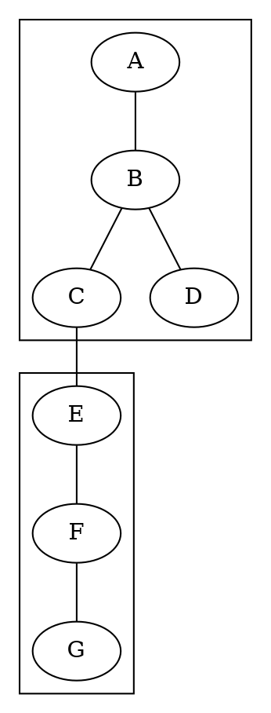
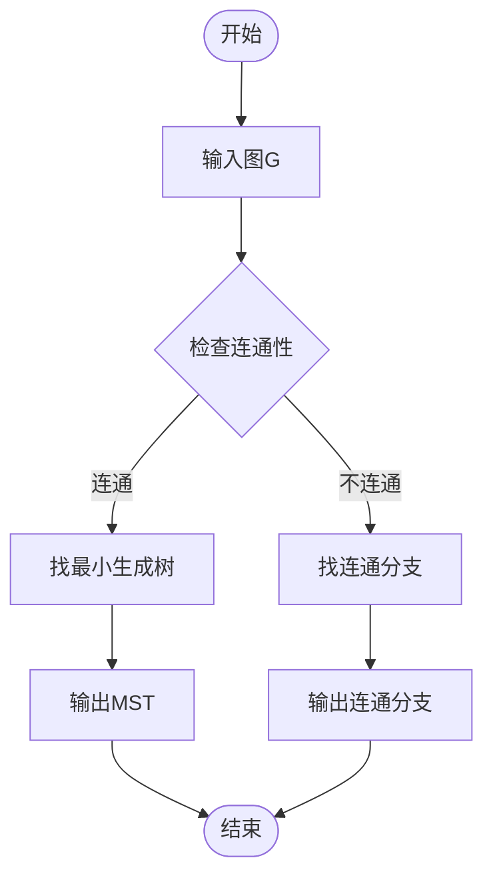

# 图论基础 - 连通性 / Graph Theory Fundamentals - Connectivity

## 📚 **概述 / Overview**

本文档介绍图论中的连通性理论，包括路径、连通性、割集、Menger定理、强连通性、树与生成树、网络流等核心概念。

## 📑 **目录 / Table of Contents**

- [图论基础 - 连通性 / Graph Theory Fundamentals - Connectivity](#图论基础---连通性--graph-theory-fundamentals---connectivity)
  - [📚 **概述 / Overview**](#-概述--overview)
  - [📑 **目录 / Table of Contents**](#-目录--table-of-contents)
  - [1. 路径与连通性](#1-路径与连通性)
    - [1.1 路径定义](#11-路径定义)
    - [1.2 连通性定义](#12-连通性定义)
  - [2. 距离与直径](#2-距离与直径)
    - [2.1 距离定义](#21-距离定义)
    - [2.2 中心与离心率](#22-中心与离心率)
  - [3. 割集与连通度](#3-割集与连通度)
    - [3.1 割集定义](#31-割集定义)
    - [3.2 连通度](#32-连通度)
  - [4. Menger定理](#4-menger定理)
    - [4.1 顶点版本](#41-顶点版本)
    - [4.2 边版本](#42-边版本)
  - [5. 强连通性](#5-强连通性)
    - [5.1 有向图的连通性](#51-有向图的连通性)
    - [5.2 可达性](#52-可达性)
  - [6. 树与生成树](#6-树与生成树)
    - [6.1 树的性质](#61-树的性质)
    - [6.2 生成树](#62-生成树)
    - [6.3 最小生成树](#63-最小生成树)
  - [7. 网络流](#7-网络流)
    - [7.1 流网络](#71-流网络)
    - [7.2 最大流最小割定理](#72-最大流最小割定理)
  - [8. 连通性算法](#8-连通性算法)
    - [8.1 连通性检测](#81-连通性检测)
    - [8.2 割点检测](#82-割点检测)
  - [多模态表达与可视化](#多模态表达与可视化)
    - [8.3 连通性可视化](#83-连通性可视化)
    - [8.4 算法流程图](#84-算法流程图)
    - [8.5 自动化脚本建议](#85-自动化脚本建议)

---

## 1. 路径与连通性

### 1.1 路径定义

**定义 1.1** (路径 - Path)
图 $G = (V, E)$ 中的**路径**是顶点序列 $P = (v_0, v_1, \ldots, v_k)$，其中：

- $v_i \in V$ 对于所有 $i = 0, 1, \ldots, k$
- $(v_{i-1}, v_i) \in E$ 对于所有 $i = 1, 2, \ldots, k$

**形式化语义**：

- 集合论语义：路径是顶点序列的有限序列
- 范畴论语义：路径是图范畴中的态射

**定义 1.2** (路径长度 - Path Length)
路径 $P = (v_0, v_1, \ldots, v_k)$ 的**长度**是 $k$，即路径中的边数。

**定义 1.3** (简单路径 - Simple Path)
**简单路径**是不包含重复顶点的路径。

**定义 1.4** (闭路径 - Closed Path)
**闭路径**是满足 $v_0 = v_k$ 的路径。

**定义 1.5** (圈 - Cycle)
**圈**是长度至少为3的简单闭路径。

### 1.2 连通性定义

**定义 1.6** (连通顶点 - Connected Vertices)
图 $G = (V, E)$ 中，顶点 $u$ 和 $v$ 是**连通的**，如果存在从 $u$ 到 $v$ 的路径。

**定义 1.7** (连通图 - Connected Graph)
图 $G$ 是**连通图**，如果对于任意两个顶点 $u, v \in V$，都存在从 $u$ 到 $v$ 的路径。

**定义 1.8** (连通分支 - Connected Component)
图 $G$ 的**连通分支**是 $G$ 的极大连通子图。

**定理 1.1** (连通分支性质)
图 $G$ 的连通分支构成 $V$ 的一个划分。

**证明**：
连通性是一个等价关系，因此连通分支是等价类，构成 $V$ 的划分。

**算法 1.1** (连通分支算法)

```python
def find_connected_components(G):
    components = []
    visited = set()

    for vertex in G.V:
        if vertex not in visited:
            component = dfs_component(G, vertex, visited)
            components.append(component)

    return components

def dfs_component(G, start, visited):
    component = set()
    stack = [start]

    while stack:
        vertex = stack.pop()
        if vertex not in visited:
            visited.add(vertex)
            component.add(vertex)
            for neighbor in G.adj[vertex]:
                if neighbor not in visited:
                    stack.append(neighbor)

    return component
```

## 2. 距离与直径

### 2.1 距离定义

**定义 2.1** (距离 - Distance)
图 $G = (V, E)$ 中，顶点 $u$ 和 $v$ 之间的**距离** $d(u, v)$ 是：
$$d(u, v) = \min\{k : \text{存在长度为 } k \text{ 的路径从 } u \text{ 到 } v\}$$

如果 $u$ 和 $v$ 不连通，则 $d(u, v) = \infty$。

**性质 2.1** (距离的度量性质)：

1. $d(u, v) \geq 0$ 且 $d(u, v) = 0$ 当且仅当 $u = v$
2. $d(u, v) = d(v, u)$（无向图）
3. $d(u, v) + d(v, w) \geq d(u, w)$（三角不等式）

**定义 2.2** (图的直径 - Diameter)
图 $G$ 的**直径**是：
$$\text{diam}(G) = \max_{u, v \in V} d(u, v)$$

**定义 2.3** (图的半径 - Radius)
图 $G$ 的**半径**是：
$$\text{rad}(G) = \min_{v \in V} \max_{u \in V} d(u, v)$$

### 2.2 中心与离心率

**定义 2.4** (离心率 - Eccentricity)
顶点 $v$ 的**离心率**是：
$$e(v) = \max_{u \in V} d(u, v)$$

**定义 2.5** (中心 - Center)
图 $G$ 的**中心**是离心率最小的顶点集：
$$C(G) = \{v \in V : e(v) = \text{rad}(G)\}$$

**定理 2.1** (直径与半径关系)
对于任意连通图 $G$：
$$\text{rad}(G) \leq \text{diam}(G) \leq 2 \cdot \text{rad}(G)$$

**证明**：
设 $u, v$ 是直径端点，$w$ 是中心点，则：
$$d(u, v) \leq d(u, w) + d(w, v) \leq 2 \cdot \text{rad}(G)$$

**算法 2.1** (Floyd-Warshall算法 - 全源最短路)

```python
def floyd_warshall(G):
    n = len(G.V)
    dist = [[float('inf')] * n for _ in range(n)]

    # 初始化
    for i in range(n):
        dist[i][i] = 0
    for (u, v) in G.E:
        dist[u][v] = 1
        dist[v][u] = 1  # 无向图

    # Floyd-Warshall
    for k in range(n):
        for i in range(n):
            for j in range(n):
                if dist[i][k] + dist[k][j] < dist[i][j]:
                    dist[i][j] = dist[i][k] + dist[k][j]

    return dist
```

## 3. 割集与连通度

### 3.1 割集定义

**定义 3.1** (顶点割 - Vertex Cut)
图 $G = (V, E)$ 的**顶点割**是顶点集 $S \subseteq V$，使得 $G - S$ 的连通分支数大于 $G$ 的连通分支数。

**定义 3.2** (边割 - Edge Cut)
图 $G = (V, E)$ 的**边割**是边集 $F \subseteq E$，使得 $G - F$ 的连通分支数大于 $G$ 的连通分支数。

**定义 3.3** (最小割 - Minimum Cut)
**最小顶点割**（或**最小边割**）是大小最小的顶点割（或边割）。

### 3.2 连通度

**定义 3.4** (顶点连通度 - Vertex Connectivity)
图 $G$ 的**顶点连通度** $\kappa(G)$ 是：
$$\kappa(G) = \min\{|S| : S \text{ 是 } G \text{ 的顶点割}\}$$

如果 $G$ 是完全图，则 $\kappa(G) = |V| - 1$。

**定义 3.5** (边连通度 - Edge Connectivity)
图 $G$ 的**边连通度** $\lambda(G)$ 是：
$$\lambda(G) = \min\{|F| : F \text{ 是 } G \text{ 的边割}\}$$

**定理 3.1** (连通度不等式 - Connectivity Inequality)
对于任意图 $G$：
$$\kappa(G) \leq \lambda(G) \leq \delta(G)$$

其中 $\delta(G) = \min_{v \in V} d(v)$ 是图的最小度。

**证明**：

1. $\lambda(G) \leq \delta(G)$：删除某个最小度顶点的所有关联边构成边割
2. $\kappa(G) \leq \lambda(G)$：Menger定理的直接推论

**定理 3.2** (Whitney定理)
对于任意非完全图 $G$：
$$\kappa(G) \leq \lambda(G) \leq \delta(G)$$

**证明**：
通过构造性证明，删除最小度顶点的所有关联边得到边割。

## 4. Menger定理

### 4.1 顶点版本

**定理 4.1** (Menger定理 - 顶点版本)
图 $G$ 中，顶点 $u$ 和 $v$ 之间的顶点连通度等于 $u$ 到 $v$ 的不相交路径的最大数量。

**形式化表述**：
设 $u, v$ 是图 $G$ 中不相邻的顶点，则：
$$\kappa_G(u, v) = \max\{k : \text{存在 } k \text{ 条从 } u \text{ 到 } v \text{ 的顶点不相交路径}\}$$

**证明**：
通过最大流最小割定理证明。构造辅助图，将顶点连通度问题转化为边连通度问题。

### 4.2 边版本

**定理 4.2** (Menger定理 - 边版本)
图 $G$ 中，顶点 $u$ 和 $v$ 之间的边连通度等于 $u$ 到 $v$ 的边不相交路径的最大数量。

**形式化表述**：
$$\lambda_G(u, v) = \max\{k : \text{存在 } k \text{ 条从 } u \text{ 到 } v \text{ 的边不相交路径}\}$$

**算法 4.1** (Menger定理应用 - 最大流算法)

```python
def max_vertex_disjoint_paths(G, s, t):
    # 构造辅助图
    G_aux = construct_auxiliary_graph(G)

    # 使用最大流算法
    max_flow = ford_fulkerson(G_aux, s, t)

    return max_flow

def construct_auxiliary_graph(G):
    # 将每个顶点v拆分为v_in和v_out
    # 添加容量为1的边(v_in, v_out)
    # 将原图的边(u,v)替换为(u_out, v_in)
    pass
```

## 5. 强连通性

### 5.1 有向图的连通性

**定义 5.1** (强连通 - Strongly Connected)
有向图 $D = (V, A)$ 是**强连通的**，如果对于任意两个顶点 $u, v \in V$，都存在从 $u$ 到 $v$ 的有向路径。

**定义 5.2** (强连通分支 - Strongly Connected Component)
有向图 $D$ 的**强连通分支**是 $D$ 的极大强连通子图。

**定理 5.1** (强连通分支性质)
有向图的强连通分支构成顶点集的一个划分。

### 5.2 可达性

**定义 5.3** (可达性 - Reachability)
在有向图 $D$ 中，顶点 $v$ 从顶点 $u$ **可达**，如果存在从 $u$ 到 $v$ 的有向路径。

**定义 5.4** (可达性矩阵 - Reachability Matrix)
有向图 $D = (V, A)$ 的**可达性矩阵** $R = [r_{ij}]$ 是：
$$
r_{ij} = \begin{cases}
1 & \text{如果 } v_j \text{ 从 } v_i \text{ 可达} \\
0 & \text{否则}
\end{cases}
$$

**算法 5.1** (Kosaraju算法 - 强连通分支)

```python
def kosaraju_scc(G):
    # 第一遍DFS：计算完成时间
    visited = set()
    finish_order = []

    def dfs1(v):
        visited.add(v)
        for u in G.adj[v]:
            if u not in visited:
                dfs1(u)
        finish_order.append(v)

    for v in G.V:
        if v not in visited:
            dfs1(v)

    # 第二遍DFS：在转置图上找强连通分支
    G_T = transpose(G)
    visited = set()
    sccs = []

    def dfs2(v, component):
        visited.add(v)
        component.append(v)
        for u in G_T.adj[v]:
            if u not in visited:
                dfs2(u, component)

    for v in reversed(finish_order):
        if v not in visited:
            component = []
            dfs2(v, component)
            sccs.append(component)

    return sccs
```

**算法 5.2** (Tarjan算法 - 强连通分支)

```python
def tarjan_scc(G):
    index = 0
    indices = {}
    lowlinks = {}
    on_stack = set()
    stack = []
    sccs = []

    def strongconnect(v):
        nonlocal index
        indices[v] = index
        lowlinks[v] = index
        index += 1
        stack.append(v)
        on_stack.add(v)

        for w in G.adj[v]:
            if w not in indices:
                strongconnect(w)
                lowlinks[v] = min(lowlinks[v], lowlinks[w])
            elif w in on_stack:
                lowlinks[v] = min(lowlinks[v], indices[w])

        if lowlinks[v] == indices[v]:
            scc = []
            while True:
                w = stack.pop()
                on_stack.remove(w)
                scc.append(w)
                if w == v:
                    break
            sccs.append(scc)

    for v in G.V:
        if v not in indices:
            strongconnect(v)

    return sccs
```

## 6. 树与生成树

### 6.1 树的性质

**定义 6.1** (树 - Tree)
**树**是连通无圈图。

**定理 6.1** (树的基本性质)
图 $T$ 是树，当且仅当以下条件之一成立：

1. $T$ 是连通无圈图
2. $T$ 是连通图且 $|E| = |V| - 1$
3. $T$ 是无圈图且 $|E| = |V| - 1$
4. $T$ 中任意两个顶点之间有唯一路径

**证明**：
通过归纳法可以证明这些条件的等价性。

**推论 6.1** (树的边数)
$n$ 阶树有 $n-1$ 条边。

**推论 6.2** (树的叶子)
任何非平凡树至少有两个叶子顶点。

### 6.2 生成树

**定义 6.2** (生成树 - Spanning Tree)
图 $G$ 的**生成树**是 $G$ 的生成子图且是树。

**定理 6.2** (生成树存在性)
图 $G$ 有生成树，当且仅当 $G$ 是连通图。

**证明**：
如果 $G$ 连通，可以通过删除圈中的边得到生成树。如果 $G$ 不连通，则没有生成树。

**算法 6.1** (DFS生成树)

```python
def dfs_spanning_tree(G, start):
    tree_edges = []
    visited = set()

    def dfs(v):
        visited.add(v)
        for u in G.adj[v]:
            if u not in visited:
                tree_edges.append((v, u))
                dfs(u)

    dfs(start)
    return tree_edges
```

### 6.3 最小生成树

**定义 6.3** (最小生成树 - Minimum Spanning Tree)
带权图 $G$ 的**最小生成树**是权重最小的生成树。

**定理 6.3** (最小生成树唯一性)
如果图 $G$ 的所有边权重都不相同，则最小生成树唯一。

**算法 6.2** (Kruskal算法)

```python
def kruskal_mst(G):
    # 按权重排序边
    edges = sorted(G.E, key=lambda e: G.weight[e])

    # 并查集
    parent = {v: v for v in G.V}

    def find(v):
        if parent[v] != v:
            parent[v] = find(parent[v])
        return parent[v]

    def union(u, v):
        parent[find(u)] = find(v)

    mst_edges = []
    for (u, v) in edges:
        if find(u) != find(v):
            mst_edges.append((u, v))
            union(u, v)

    return mst_edges
```

**算法 6.3** (Prim算法)

```python
def prim_mst(G, start):
    import heapq

    mst_edges = []
    visited = {start}
    edges = [(G.weight[(start, v)], start, v) for v in G.adj[start]]
    heapq.heapify(edges)

    while edges and len(visited) < len(G.V):
        weight, u, v = heapq.heappop(edges)
        if v not in visited:
            visited.add(v)
            mst_edges.append((u, v))

            for w in G.adj[v]:
                if w not in visited:
                    heapq.heappush(edges, (G.weight[(v, w)], v, w))

    return mst_edges
```

## 7. 网络流

### 7.1 流网络

**定义 7.1** (流网络 - Flow Network)
**流网络**是一个四元组 $N = (G, s, t, c)$，其中：

- $G = (V, E)$ 是有向图
- $s, t \in V$ 分别是源点和汇点
- $c: E \to \mathbb{R}^+$ 是容量函数

**定义 7.2** (流 - Flow)
流网络 $N$ 中的**流**是函数 $f: E \to \mathbb{R}^+$，满足：

1. 容量约束：$0 \leq f(e) \leq c(e)$ 对于所有 $e \in E$
2. 流量守恒：$\sum_{e \in \delta^+(v)} f(e) = \sum_{e \in \delta^-(v)} f(e)$ 对于所有 $v \in V - \{s, t\}$

其中 $\delta^+(v)$ 和 $\delta^-(v)$ 分别是离开和进入顶点 $v$ 的边集。

**定义 7.3** (流值 - Flow Value)
流 $f$ 的**值**是：
$$|f| = \sum_{e \in \delta^+(s)} f(e) - \sum_{e \in \delta^-(s)} f(e)$$

### 7.2 最大流最小割定理

**定义 7.4** (割 - Cut)
流网络 $N$ 中的**割**是顶点集 $S \subseteq V$，其中 $s \in S$ 且 $t \notin S$。

**定义 7.5** (割的容量 - Cut Capacity)
割 $S$ 的**容量**是：
$$c(S) = \sum_{e \in \delta^+(S)} c(e)$$

**定理 7.1** (最大流最小割定理 - Max-Flow Min-Cut Theorem)
流网络中的最大流值等于最小割容量。

**证明**：
通过Ford-Fulkerson算法和增广路径理论证明。

**算法 7.1** (Ford-Fulkerson算法)

```python
def ford_fulkerson(G, s, t):
    # 初始化流
    flow = {e: 0 for e in G.E}
    residual = {e: G.capacity[e] for e in G.E}

    def find_augmenting_path():
        # BFS找增广路径
        parent = {s: None}
        queue = [s]

        while queue:
            u = queue.pop(0)
            for v in G.adj[u]:
                if v not in parent and residual[(u, v)] > 0:
                    parent[v] = u
                    queue.append(v)
                    if v == t:
                        break

        if t not in parent:
            return None

        # 重建路径
        path = []
        v = t
        while v is not None:
            path.append(v)
            v = parent[v]
        return path[::-1]

    # 主循环
    while True:
        path = find_augmenting_path()
        if path is None:
            break

        # 计算瓶颈容量
        bottleneck = float('inf')
        for i in range(len(path) - 1):
            u, v = path[i], path[i + 1]
            bottleneck = min(bottleneck, residual[(u, v)])

        # 更新流和残量网络
        for i in range(len(path) - 1):
            u, v = path[i], path[i + 1]
            flow[(u, v)] += bottleneck
            residual[(u, v)] -= bottleneck
            residual[(v, u)] += bottleneck

    return flow
```

## 8. 连通性算法

### 8.1 连通性检测

**算法 8.1** (连通性检测)

```python
def is_connected(G):
    if not G.V:
        return True

    start = next(iter(G.V))
    visited = dfs_visit(G, start)
    return len(visited) == len(G.V)

def dfs_visit(G, start):
    visited = set()
    stack = [start]

    while stack:
        v = stack.pop()
        if v not in visited:
            visited.add(v)
            for u in G.adj[v]:
                if u not in visited:
                    stack.append(u)

    return visited
```

### 8.2 割点检测

**算法 8.2** (Tarjan割点算法)

```python
def find_articulation_points(G):
    index = 0
    indices = {}
    lowlinks = {}
    articulation_points = set()

    def dfs(v, parent):
        nonlocal index
        indices[v] = index
        lowlinks[v] = index
        index += 1

        children = 0
        for u in G.adj[v]:
            if u not in indices:
                children += 1
                dfs(u, v)
                lowlinks[v] = min(lowlinks[v], lowlinks[u])

                # 根节点条件
                if parent is None and children > 1:
                    articulation_points.add(v)
                # 非根节点条件
                elif parent is not None and lowlinks[u] >= indices[v]:
                    articulation_points.add(v)
            elif u != parent:
                lowlinks[v] = min(lowlinks[v], indices[u])

    for v in G.V:
        if v not in indices:
            dfs(v, None)

    return articulation_points
```

## 多模态表达与可视化

### 8.3 连通性可视化

**Graphviz示例**：



**NetworkX示例**：

```python
import networkx as nx
import matplotlib.pyplot as plt

G = nx.Graph([(0,1), (1,2), (2,0), (3,4), (4,5), (2,3)])
components = list(nx.connected_components(G))

plt.figure(figsize=(10, 6))
pos = nx.spring_layout(G)
nx.draw(G, pos, with_labels=True, node_color='lightblue')
plt.title(f'Graph with {len(components)} connected components')
plt.show()
```

### 8.4 算法流程图

**Mermaid示例**：



### 8.5 自动化脚本建议

**脚本功能**：

- `scripts/connectivity_analysis.py`：分析图的连通性、割点、割边
- `scripts/mst_algorithms.py`：实现Kruskal、Prim等MST算法
- `scripts/flow_network.py`：实现最大流算法
- `scripts/strongly_connected.py`：实现强连通分支算法

---

*本文档详细介绍了图论中的连通性概念，对标国际标准，为网络通信理论提供了重要的数学基础。*
