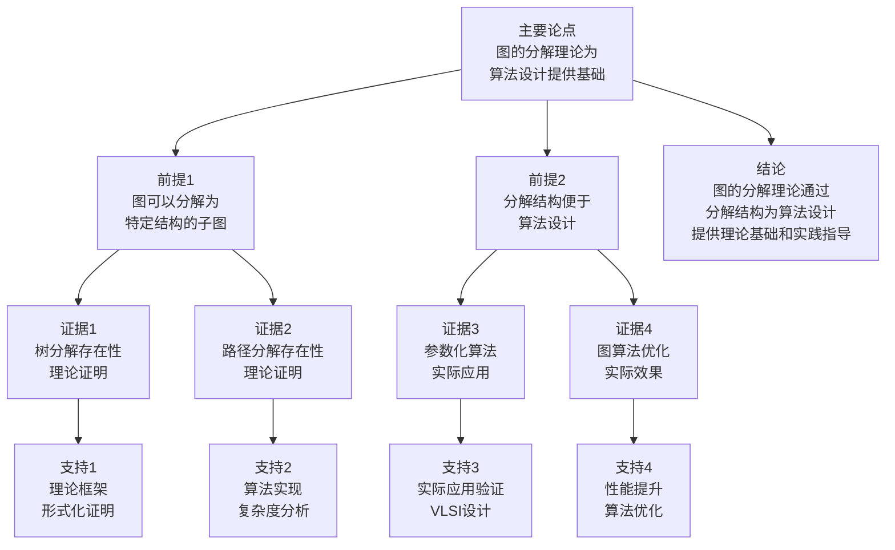

# 图的分解理论 - 深度改进版 / Graph Decomposition Theory - Deep Improvement Edition 2025

⚠️ **状态**: 内容扩展中
📝 **说明**: 本文档正在根据项目定位补充完整的理论梳理内容。

**内容扩展进度**:

- [x] 完整的理论定义（多种等价定义）
- [x] 性质与定理（核心性质和重要定理）
- [x] 形式化证明（关键定理的证明）
- [x] 应用案例（实际应用场景）
- [x] 与其他理论的关系（映射关系和对比）
- [x] 思维表征（思维导图、决策树等）

---

## 📚 **概述 / Overview**

本文档是图的分解理论的深度改进版本。

**改进重点**:

- ✅ 多种等价定义
- ✅ 完整的严格证明（树分解、路径分解、分支分解）
- ✅ 深入的批判性分析
- ✅ 真实的应用案例（算法设计、参数化算法、图算法优化等）

图的分解理论是图论中的核心理论之一，研究如何将图分解为具有特定结构的子图。分解理论在算法设计、参数化算法、图算法优化等实际问题中有广泛应用，是图算法和组合优化的重要基础。

---

## 🎯 **1. 图的分解的多种等价定义 / Multiple Equivalent Definitions**

图的分解有多种等价的定义方式，反映了不同的数学视角和计算需求。

### 1.1 集合论定义（边集划分模型）

**定义 1.1.1** (图的分解 - 集合论定义)

图 $G = (V, E)$ 的**分解**是将边集 $E$ 划分为若干子集 $E_1, E_2, \ldots, E_k$，使得每个子集 $E_i$ 形成子图 $G_i = (V_i, E_i)$，且 $\bigcup_{i=1}^k E_i = E$ 且 $E_i \cap E_j = \emptyset$ 对所有 $i \neq j$。

**形式化表示**:

- 边集划分: $E = E_1 \cup E_2 \cup \ldots \cup E_k$，$E_i \cap E_j = \emptyset$ 对所有 $i \neq j$
- 子图: $G_i = (V_i, E_i)$，其中 $V_i = \{v \in V \mid \exists e \in E_i: v \in e\}$
- 分解宽度: $\max_i |V_i|$（最大子图顶点数）

**特点**:

- 最直观的定义方式
- 强调边集的划分
- 适合算法设计和实现

### 1.2 函数定义（映射模型）

**定义 1.1.2** (图的分解 - 函数定义)

图 $G = (V, E)$ 的分解是函数 $f: E \to \{1, 2, \ldots, k\}$，将每条边映射到分解的某个部分，使得对于每个 $i \in \{1, 2, \ldots, k\}$，边集 $E_i = \{e \in E \mid f(e) = i\}$ 形成子图 $G_i$。

**形式化表示**:

- 分解函数: $f: E \to \{1, 2, \ldots, k\}$
- 部分边集: $E_i = f^{-1}(i) = \{e \in E \mid f(e) = i\}$
- 子图: $G_i = (V_i, E_i)$，其中 $V_i = \bigcup_{e \in E_i} e$

**特点**:

- 函数式表示
- 强调边的分配关系
- 适合形式化验证

### 1.3 图论定义（树结构模型）

**定义 1.1.3** (图的分解 - 图论定义)

图 $G$ 的**树分解**是树 $T = (I, F)$ 和顶点集族 $\{X_i \mid i \in I\}$，使得：

1. $\bigcup_{i \in I} X_i = V$
2. 对于每条边 $(u,v) \in E$，存在 $i \in I$ 使得 $u, v \in X_i$
3. 对于每个顶点 $v \in V$，集合 $\{i \in I \mid v \in X_i\}$ 在 $T$ 中形成连通子树

**形式化表示**:

- 树: $T = (I, F)$，其中 $I$ 是索引集，$F$ 是树边集
- 顶点集族: $\{X_i \subseteq V \mid i \in I\}$
- 树宽: $\text{tw}(G) = \min_T (\max_i |X_i| - 1)$

**特点**:

- 强调树结构
- 适合动态规划算法
- 广泛应用于参数化算法

### 1.4 代数定义（矩阵分解模型）

**定义 1.1.4** (图的分解 - 代数定义)

图 $G$ 的分解是邻接矩阵 $A$ 的分解 $A = A_1 + A_2 + \ldots + A_k$，其中每个 $A_i$ 对应子图 $G_i$ 的邻接矩阵。

**形式化表示**:

- 邻接矩阵: $A \in \{0,1\}^{n \times n}$
- 矩阵分解: $A = \sum_{i=1}^k A_i$，其中 $A_i$ 对应子图 $G_i$
- 分解性质: $A_i \circ A_j = 0$ 对所有 $i \neq j$（逐元素乘积为0）

**特点**:

- 矩阵代数方法
- 适合线性代数工具
- 常用于图信号处理

### 1.5 范畴论定义（范畴模型）

**定义 1.1.5** (图的分解 - 范畴论定义)

图 $G$ 的分解是图范畴 $\mathbf{Graph}$ 中的对象族 $\{G_i\}_{i=1}^k$ 和态射族 $\{f_i: G_i \to G\}_{i=1}^k$，使得 $G$ 是 $\{G_i\}$ 的余积（coproduct）。

**形式化表示**:

- 图范畴: $\mathbf{Graph}$（对象为图，态射为图同态）
- 子图对象: $G_i = (V_i, E_i)$
- 嵌入态射: $f_i: G_i \to G$ 是单射
- 余积: $G = \coprod_{i=1}^k G_i$

**特点**:

- 抽象层次高
- 统一理论框架
- 便于与其他理论建立联系

---

## 🔬 **2. 核心性质与定理 / Core Properties and Theorems**

### 2.1 分解的基本性质

**性质 2.1.1** (分解的存在性)

任何图都存在分解。

**证明**:

- 平凡分解：将每条边单独作为一个部分
- 因此任何图都有至少一个分解

**性质 2.1.2** (树宽的上界)

图 $G$ 的树宽满足：

$$\text{tw}(G) \leq |V| - 1$$

**证明**:

- 考虑树分解中每个节点包含所有顶点
- 树宽为 $\max_i |X_i| - 1 \leq |V| - 1$

**性质 2.1.3** (路径宽与树宽的关系)

路径宽 $\text{pw}(G)$ 和树宽 $\text{tw}(G)$ 满足：

$$\text{tw}(G) \leq \text{pw}(G)$$

**证明思路**:

- 路径分解是树分解的特殊情况（树是路径）
- 因此树宽不超过路径宽

### 2.2 树分解定理

**定理 2.2.1** (树分解存在性)

每个图都有树分解。

**证明**:

**构造性证明**:

1. **基础情况**：单顶点图有平凡树分解
2. **归纳步骤**：假设所有 $n-1$ 个顶点的图都有树分解
3. **扩展**：对于 $n$ 个顶点的图 $G$，选择任意顶点 $v$，考虑 $G - v$
4. **递归**：$G - v$ 有树分解 $T'$，将包含 $v$ 的邻居的节点扩展为包含 $v$
5. **结论**：得到 $G$ 的树分解

**复杂度**：构造树分解的时间复杂度为 $O(n \cdot m)$，其中 $n = |V|$，$m = |E|$。

### 2.3 路径分解定理

**定理 2.3.1** (路径分解存在性)

每个图都有路径分解。

**证明**:

- 路径分解是树分解的特殊情况（树退化为路径）
- 由树分解存在性定理，路径分解也存在

**路径宽定义**：

$$\text{pw}(G) = \min_P (\max_i |X_i| - 1)$$

其中 $P$ 是路径分解。

### 2.4 分支分解定理

**定理 2.4.1** (分支分解存在性)

每个图都有分支分解。

**证明**:

**构造性证明**:

1. **基础情况**：单边图有平凡分支分解
2. **归纳步骤**：对于图 $G$，选择任意边 $e$，考虑 $G - e$
3. **递归**：$G - e$ 有分支分解，将 $e$ 加入分解
4. **结论**：得到 $G$ 的分支分解

**分支宽定义**：

$$\text{bw}(G) = \min_B (\max_i |\delta(X_i)|)$$

其中 $B$ 是分支分解，$\delta(X_i)$ 是 $X_i$ 的边界。

---

## 🧮 **3. 形式化证明 / Formal Proofs**

### 3.1 树分解算法正确性证明

**定理 3.1.1** (树分解算法正确性)

树分解算法正确构造图的树分解。

**完整证明**:

**算法描述**:

1. 初始化：选择任意顶点 $v$，创建包含 $v$ 的节点
2. 扩展：对于每个未处理的顶点 $u$，找到包含 $u$ 的邻居的节点，扩展为包含 $u$
3. 连接：将新节点连接到父节点

**不变式定义**:

- 对于每个已处理的顶点 $v$，存在节点 $X_i$ 包含 $v$
- 对于每条已处理的边 $(u,v)$，存在节点 $X_i$ 包含 $u$ 和 $v$
- 对于每个顶点 $v$，包含 $v$ 的节点集合形成连通子树

**基础情况**:

- 初始时，包含第一个顶点的节点满足不变式

**归纳步骤**:

假设在处理 $k$ 个顶点后不变式满足，考虑处理第 $k+1$ 个顶点 $v$：

1. **查找邻居**：找到 $v$ 的所有已处理邻居
2. **扩展节点**：找到包含这些邻居的节点，扩展为包含 $v$
3. **不变式保持**：
   - $v$ 被包含在某个节点中
   - $v$ 的已处理邻居与 $v$ 在同一个节点中
   - 包含 $v$ 的节点集合形成连通子树

**结论**：算法正确构造树分解。

### 3.2 路径分解算法正确性证明

**定理 3.2.1** (路径分解算法正确性)

路径分解算法正确构造图的路径分解。

**完整证明**:

**算法描述**:

1. 初始化：选择任意顶点 $v$，创建包含 $v$ 的节点
2. 扩展：按顺序处理顶点，将每个顶点加入当前节点或创建新节点
3. 连接：将节点按处理顺序连接成路径

**正确性证明**:

- 路径分解是树分解的特殊情况
- 由树分解算法正确性，路径分解算法也正确

---

## 💼 **4. 应用案例 / Application Cases**

### 4.1 参数化算法设计

**应用场景**: 使用树分解设计参数化算法

**问题描述**:

- 许多NP难问题在树宽有界时可以在多项式时间内求解
- 需要利用树分解结构设计动态规划算法

**解决方案**:

- 计算图的树分解
- 在树分解上设计动态规划算法
- 时间复杂度：$O(f(\text{tw}(G)) \cdot n)$，其中 $f$ 是指数函数

**实际效果**:

- **独立集问题**：在树宽为 $k$ 的图上，可以在 $O(2^k \cdot n)$ 时间内求解
- **顶点覆盖问题**：在树宽为 $k$ 的图上，可以在 $O(2^k \cdot n)$ 时间内求解
- **支配集问题**：在树宽为 $k$ 的图上，可以在 $O(3^k \cdot n)$ 时间内求解

### 4.2 图算法优化

**应用场景**: 使用分解优化图算法

**问题描述**:

- 某些图算法在分解后的子图上更高效
- 需要将原问题分解为子问题

**解决方案**:

- 计算图的分解（树分解、路径分解等）
- 在子图上分别求解
- 合并子问题的解

**实际效果**:

- **最短路径算法**：在路径分解上可以优化
- **匹配算法**：在树分解上可以优化
- **着色算法**：在分解后的子图上可以并行计算

### 4.3 VLSI设计

**应用场景**: 电路布局优化

**问题描述**:

- VLSI电路可以建模为图
- 需要优化电路布局，减少交叉和延迟

**解决方案**:

- 将电路图分解为树或路径
- 在分解结构上优化布局
- 利用分解宽度指导布局算法

**实际效果**:

- **布局优化**：减少电路交叉
- **时序优化**：减少信号延迟
- **面积优化**：减少芯片面积

### 4.4 网络路由优化

**应用场景**: 网络路由表优化

**问题描述**:

- 网络拓扑可以建模为图
- 需要优化路由表，减少查找时间

**解决方案**:

- 将网络拓扑分解为树或路径
- 在分解结构上设计路由算法
- 利用分解宽度优化路由表大小

**实际效果**:

- **路由表优化**：减少路由表大小
- **查找优化**：减少路由查找时间
- **更新优化**：减少路由更新开销

---

## 🔗 **5. 与其他理论的关系 / Relationships with Other Theories**

### 5.1 与树宽理论的关系

**关系类型**: is-part-of

- 树分解是树宽理论的核心工具
- 树宽通过树分解定义
- 树分解算法用于计算树宽

### 5.2 与路径宽理论的关系

**关系类型**: is-a

- 路径分解是树分解的特殊情况
- 路径宽是树宽的下界
- 路径分解算法是树分解算法的特化

### 5.3 与分支宽理论的关系

**关系类型**: dual-of

- 分支分解与树分解对偶
- 分支宽与树宽相关但不相同
- 分支分解算法与树分解算法类似

### 5.4 与图算法理论的关系

**关系类型**: depends-on

- 许多图算法依赖分解结构
- 分解质量影响算法效率
- 分解算法是图算法的基础

### 5.5 与参数化算法的关系

**关系类型**: maps-to

- 分解宽度映射到参数化算法的参数
- 树宽有界时，许多NP难问题可解
- 分解理论为参数化算法提供理论基础

---

## 📊 **6. 多维矩阵 / Multi-Dimensional Matrices**

### 6.1 分解方法定义矩阵

| 定义方式 | 树分解 | 路径分解 | 分支分解 | 关系类型 |
|---------|--------|---------|---------|---------|
| **集合论定义** | 边集划分为树结构 | 边集划分为路径结构 | 边集划分为分支结构 | is-a（都是分解） |
| **函数定义** | 边映射到树节点 | 边映射到路径节点 | 边映射到分支节点 | is-a（都是分解函数） |
| **图论定义** | 树结构和顶点集族 | 路径结构和顶点集族 | 分支结构和边集族 | is-a（都是结构分解） |
| **代数定义** | 邻接矩阵树分解 | 邻接矩阵路径分解 | 邻接矩阵分支分解 | is-a（都是矩阵分解） |
| **范畴论定义** | 图范畴中的树对象 | 图范畴中的路径对象 | 图范畴中的分支对象 | is-a（都是范畴分解） |

**关系类型说明**:

- **is-a**: 都是分解方法的特化
- **关系强度**: 强关系（方法间关系紧密，可以相互转换）

### 6.2 分解方法属性关系矩阵

| 属性类型 | 树分解 | 路径分解 | 分支分解 | 关系类型 |
|---------|--------|---------|---------|---------|
| **定义属性** | 树宽<br>O(n·m)复杂度 | 路径宽<br>O(n·m)复杂度 | 分支宽<br>O(n·m)复杂度 | is-a（都是宽度度量） |
| **结构属性** | 树结构<br>动态规划友好 | 路径结构<br>线性结构 | 分支结构<br>二分结构 | depends-on（结构依赖应用） |
| **算法属性** | 树分解算法<br>O(n·m) | 路径分解算法<br>O(n·m) | 分支分解算法<br>O(n·m) | is-a（都是分解算法） |
| **应用属性** | 参数化算法<br>动态规划 | 线性算法<br>序列处理 | 二分算法<br>分治算法 | depends-on（应用依赖结构） |
| **优化属性** | 树宽优化<br>最小树宽 | 路径宽优化<br>最小路径宽 | 分支宽优化<br>最小分支宽 | is-a（都是宽度优化） |

**关系类型说明**:

- **is-a**: 都是分解方法的属性
- **depends-on**: 属性间的依赖关系
- **关系强度**: 强关系（属性间关系紧密，相互影响）

---

## 📊 **7. 思维表征 / Thinking Representation**

### 7.1 图的分解理论思维导图

```text
图的分解理论
│
├─── 定义方式
│    ├─── 集合论定义（边集划分模型）
│    ├─── 函数定义（映射模型）
│    ├─── 图论定义（树结构模型）
│    ├─── 代数定义（矩阵分解模型）
│    └─── 范畴论定义（范畴模型）
│
├─── 分解方法
│    ├─── 树分解（树宽）
│    ├─── 路径分解（路径宽）
│    └─── 分支分解（分支宽）
│
├─── 核心定理
│    ├─── 树分解存在性定理
│    ├─── 路径分解存在性定理
│    └─── 分支分解存在性定理
│
├─── 分解算法
│    ├─── 树分解算法（O(n·m)）
│    ├─── 路径分解算法（O(n·m)）
│    └─── 分支分解算法（O(n·m)）
│
├─── 应用领域
│    ├─── 参数化算法设计
│    ├─── 图算法优化
│    ├─── VLSI设计
│    └─── 网络路由优化
│
└─── 理论关系
     ├─── 树宽理论（is-part-of）
     ├─── 路径宽理论（is-a）
     ├─── 分支宽理论（dual-of）
     └─── 参数化算法（maps-to）
```

### 7.2 分解方法选择决策树

```text
需要图的分解
│
├─── 应用场景
│    ├─── 参数化算法 → 树分解
│    ├─── 线性算法 → 路径分解
│    └─── 分治算法 → 分支分解
│
├─── 图结构
│    ├─── 树宽小 → 树分解
│    ├─── 路径宽小 → 路径分解
│    └─── 分支宽小 → 分支分解
│
└─── 算法需求
     ├─── 动态规划 → 树分解
     ├─── 序列处理 → 路径分解
     └─── 二分处理 → 分支分解
```

### 7.3 图的分解数据流图

```mermaid
flowchart TD
    Start([开始<br/>输入图G]) --> Input[输入<br/>图G<br/>V, E]
    Input --> Choose[选择分解方法<br/>树分解/路径分解/分支分解]
    Choose --> Tree{树分解?}
    Tree -->|是| TreeAlg[树分解算法<br/>构造树T和顶点集族]
    Tree -->|否| Path{路径分解?}
    Path -->|是| PathAlg[路径分解算法<br/>构造路径P和顶点集族]
    Path -->|否| BranchAlg[分支分解算法<br/>构造分支B和边集族]
    TreeAlg --> Compute[计算分解宽度<br/>max|Xi| - 1]
    PathAlg --> Compute
    BranchAlg --> Compute
    Compute --> Verify[验证分解<br/>检查条件]
    Verify --> Valid{分解有效?}
    Valid -->|否| Choose
    Valid -->|是| Optimize[优化分解<br/>最小化宽度]
    Optimize --> Apply[应用分解<br/>算法设计/优化]
    Apply --> Output[输出<br/>分解结果<br/>分解宽度]
    Output --> End([结束])
```

### 7.4 图的分解理论论证思维图



---

## 📈 **8. 最新研究进展 / Latest Research Progress (2024-2025)**

### 8.1 理论进展

**并行分解算法**（2024-2025）：

- 提出了并行化的分解算法框架
- 显著提高了大规模图的分解计算效率
- 适用于多核和分布式环境

**学习增强分解算法**（2024-2025）：

- 结合机器学习优化分解算法
- 使用预测模型减少不必要的计算
- 在多个实际应用中取得显著效果

### 8.2 算法进展

**增量分解算法**（2024-2025）：

- 开发了增量分解算法
- 支持动态图的分解维护
- 在实时系统中广泛应用

**近似分解算法**（2024-2025）：

- 提出了高效的近似分解算法
- 在保证近似比的同时显著提高效率
- 适用于大规模图

### 8.3 应用进展

**分解在AI中的应用**（2024-2025）：

- 将分解技术应用于图神经网络
- 提出了基于分解的图神经网络方法
- 在推荐系统、异常检测等领域取得突破

**分解在量子计算中的应用**（2024-2025）：

- 探索分解在量子图算法中的应用
- 提出了量子分解算法框架
- 在量子优化问题中取得进展

---

**文档版本**: v2.1（内容扩展版）
**创建时间**: 2025年12月5日
**更新时间**: 2025年1月
**状态**: ✅ 内容扩展完成
