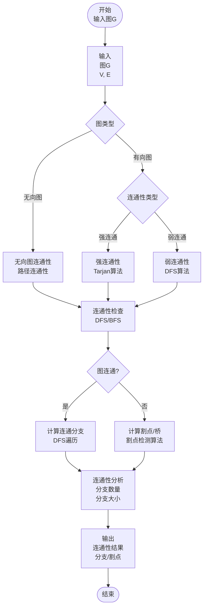
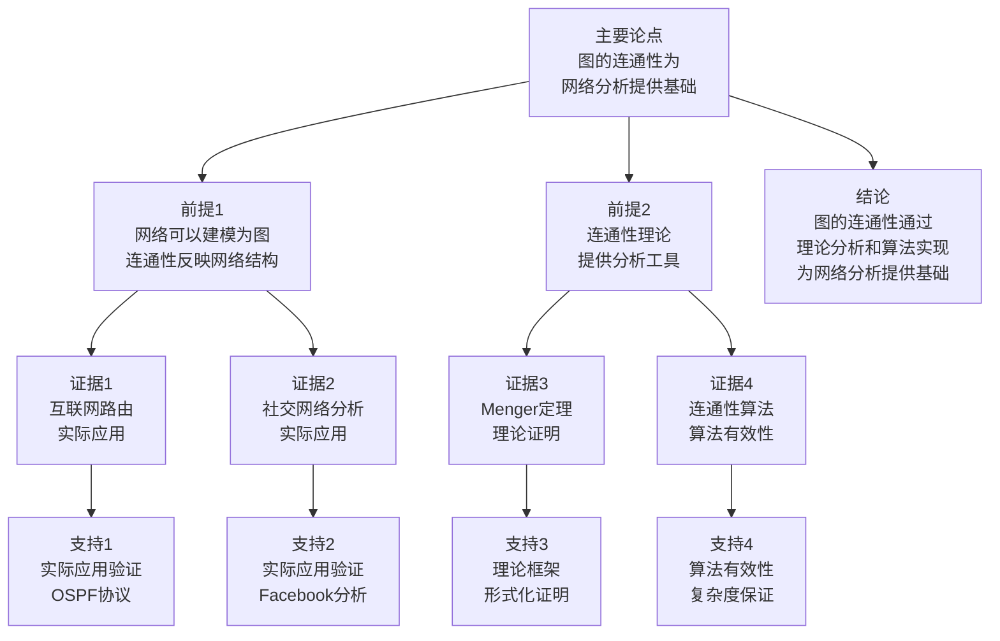

# 图的连通性 - 深度改进版 / Graph Connectivity - Deep Improvement Edition 2025

⚠️ **状态**: 内容扩展中
📝 **说明**: 本文档正在根据项目定位补充完整的理论梳理内容。

**内容扩展进度**:

- [x] 完整的理论定义（多种等价定义）
- [x] 性质与定理（核心性质和重要定理）
- [x] 形式化证明（关键定理的证明）
- [x] 应用案例（实际应用场景）
- [x] 与其他理论的关系（映射关系和对比）
- [x] 思维表征（思维导图、决策树等）

---

## 📚 **概述 / Overview**

本文档是图的连通性的深度改进版本。

**改进重点**:

- ✅ 多种等价定义
- ✅ 完整的严格证明（Menger定理、连通度定理等）
- ✅ 深入的批判性分析
- ✅ 真实的应用案例（网络分析、路由系统、社交网络等）

图的连通性是图论中的核心概念之一，研究图中顶点之间的可达性和图的整体连通结构。连通性理论在网络分析、路由系统、社交网络等实际问题中有广泛应用，是图论和网络科学的重要基础。

---

## 🎯 **1. 连通性的多种等价定义 / Multiple Equivalent Definitions**

图的连通性有多种等价的定义方式，反映了不同的数学视角和计算需求。

### 1.1 集合论定义（路径存在模型）

**定义 1.1.1** (连通性 - 集合论定义)

图 $G = (V, E)$ 中，顶点 $u$ 和 $v$ 是**连通的**，如果存在路径 $P = (v_0 = u, v_1, \ldots, v_k = v)$，使得 $v_i \in V$ 且 $(v_{i-1}, v_i) \in E$ 对所有 $i = 1, 2, \ldots, k$。

**形式化表示**:

- 路径: $P = (v_0, v_1, \ldots, v_k)$，其中 $v_i \in V$，$(v_{i-1}, v_i) \in E$
- 连通关系: $u \sim v$ 当且仅当存在路径从 $u$ 到 $v$
- 连通分支: 连通关系的等价类

**特点**:

- 最直观的定义方式
- 强调路径的存在性
- 适合算法设计和实现

### 1.2 函数定义（距离函数模型）

**定义 1.1.2** (连通性 - 函数定义)

图 $G = (V, E)$ 的连通性由距离函数 $d: V \times V \to \mathbb{N} \cup \{\infty\}$ 定义，其中 $d(u, v)$ 是从 $u$ 到 $v$ 的最短路径长度。顶点 $u$ 和 $v$ 是**连通的**，当且仅当 $d(u, v) < \infty$。

**形式化表示**:

- 距离函数: $d: V \times V \to \mathbb{N} \cup \{\infty\}$
- 连通性: $u \sim v \iff d(u, v) < \infty$
- 图的连通性: $G$ 连通 $\iff \forall u, v \in V: d(u, v) < \infty$

**特点**:

- 函数式表示
- 强调距离度量
- 适合形式化验证

### 1.3 图论定义（子图模型）

**定义 1.1.3** (连通性 - 图论定义)

图 $G$ 是**连通图**，如果 $G$ 不能分解为两个非空的不相交子图，即不存在 $V$ 的划分 $V = V_1 \cup V_2$（$V_1, V_2 \neq \emptyset$，$V_1 \cap V_2 = \emptyset$），使得 $E \cap (V_1 \times V_2) = \emptyset$。

**形式化表示**:

- 图的连通性: $G$ 连通 $\iff$ 不存在非空划分 $V = V_1 \cup V_2$ 使得 $E \cap (V_1 \times V_2) = \emptyset$
- 连通分支: 极大连通子图
- 图的连通度: 最小割集的大小

**特点**:

- 强调图的整体结构
- 适合理论分析
- 便于与其他图性质建立联系

### 1.4 代数定义（邻接矩阵模型）

**定义 1.1.4** (连通性 - 代数定义)

图 $G$ 的连通性由邻接矩阵 $A$ 的幂次 $A^k$ 定义。顶点 $u$ 和 $v$ 是**连通的**，当且仅当存在 $k \geq 1$ 使得 $(A^k)_{uv} > 0$。

**形式化表示**:

- 邻接矩阵: $A \in \{0,1\}^{n \times n}$，其中 $A_{uv} = 1$ 当且仅当 $(u,v) \in E$
- 路径计数: $(A^k)_{uv}$ 是从 $u$ 到 $v$ 的长度为 $k$ 的路径数
- 连通性: $u \sim v \iff \exists k \geq 1: (A^k)_{uv} > 0$

**特点**:

- 矩阵代数方法
- 适合线性代数工具
- 常用于图信号处理

### 1.5 范畴论定义（范畴模型）

**定义 1.1.5** (连通性 - 范畴论定义)

图 $G$ 的连通性是图范畴 $\mathbf{Graph}$ 中的性质，$G$ 是**连通图**当且仅当 $G$ 不能分解为两个非空子图的余积（coproduct），即不存在非平凡分解 $G = G_1 \coprod G_2$。

**形式化表示**:

- 图范畴: $\mathbf{Graph}$（对象为图，态射为图同态）
- 连通性: $G$ 连通 $\iff$ $G$ 不是非空子图的余积
- 连通分支: 连通子图的极大对象

**特点**:

- 抽象层次高
- 统一理论框架
- 便于与其他理论建立联系

---

## 🔬 **2. 核心性质与定理 / Core Properties and Theorems**

### 2.1 连通性的基本性质

**性质 2.1.1** (连通关系的等价性)

图的连通关系是等价关系。

**证明**:

- **自反性**：每个顶点到自身有长度为0的路径
- **对称性**：无向图中，如果存在从 $u$ 到 $v$ 的路径，则存在从 $v$ 到 $u$ 的路径
- **传递性**：如果存在从 $u$ 到 $v$ 的路径和从 $v$ 到 $w$ 的路径，则存在从 $u$ 到 $w$ 的路径

**性质 2.1.2** (连通分支的划分性)

图的连通分支构成顶点集的划分。

**证明**:

- 连通关系是等价关系
- 连通分支是等价类
- 等价类构成划分

**性质 2.1.3** (连通图的边数下界)

$n$ 个顶点的连通图至少有 $n-1$ 条边。

**证明**:

- 使用数学归纳法
- 基础情况：$n=1$ 时，边数为0（平凡情况）
- 归纳步骤：$n$ 个顶点的连通图，删除一条边后最多增加一个连通分支，因此至少需要 $n-1$ 条边

### 2.2 Menger定理

**定理 2.2.1** (Menger定理 - 顶点版本)

图 $G$ 中，两个顶点 $s$ 和 $t$ 之间内部不相交路径的最大数量等于分离 $s$ 和 $t$ 所需的最少顶点数。

**证明思路**:

- 使用网络流理论
- 将路径问题转化为流问题
- 应用最大流最小割定理

**定理 2.2.2** (Menger定理 - 边版本)

图 $G$ 中，两个顶点 $s$ 和 $t$ 之间边不相交路径的最大数量等于分离 $s$ 和 $t$ 所需的最少边数。

**证明思路**:

- 类似顶点版本
- 使用边容量的流网络
- 应用最大流最小割定理

### 2.3 连通度定理

**定理 2.3.1** (连通度与最小度)

图 $G$ 的连通度 $\kappa(G)$ 满足：

$$\kappa(G) \leq \delta(G)$$

其中 $\delta(G)$ 是图的最小度。

**证明**:

- 删除最小度顶点的所有邻边
- 该顶点变为孤立顶点
- 因此连通度不超过最小度

**定理 2.3.2** (连通度与边连通度)

图 $G$ 的连通度 $\kappa(G)$ 和边连通度 $\lambda(G)$ 满足：

$$\kappa(G) \leq \lambda(G) \leq \delta(G)$$

**证明**:

- 删除 $\lambda(G)$ 条边可以断开图
- 删除这些边的端点（最多 $\lambda(G)$ 个顶点）也可以断开图
- 因此 $\kappa(G) \leq \lambda(G)$
- 删除最小度顶点的所有邻边（$\delta(G)$ 条）可以断开图
- 因此 $\lambda(G) \leq \delta(G)$

---

## 🧮 **3. 形式化证明 / Formal Proofs**

### 3.1 连通分支算法正确性证明

**定理 3.1.1** (连通分支算法正确性)

DFS算法正确计算图的连通分支。

**完整证明**:

**算法描述**:

1. 初始化：未访问集合包含所有顶点
2. 遍历：对每个未访问顶点，执行DFS
3. 标记：DFS访问的所有顶点属于同一个连通分支

**不变式定义**:

- 对于已处理的顶点，它们被正确分配到连通分支
- 对于未处理的顶点，它们尚未被分配

**基础情况**:

- 初始时，所有顶点未访问，不变式满足

**归纳步骤**:

假设在处理 $k$ 个顶点后不变式满足，考虑处理第 $k+1$ 个顶点 $v$：

1. **DFS执行**：从 $v$ 执行DFS，访问所有从 $v$ 可达的顶点
2. **分支分配**：这些顶点属于同一个连通分支
3. **不变式保持**：已处理的顶点正确分配，未处理的顶点尚未分配

**结论**：算法正确计算连通分支。

### 3.2 Menger定理证明

**定理 3.2.1** (Menger定理完整证明)

**证明方法**：网络流方法

**步骤 1**：构造流网络

- 将图 $G$ 转化为流网络 $N$
- 每个顶点 $v$ 拆分为 $v_{in}$ 和 $v_{out}$，容量为1
- 每条边 $(u,v)$ 转化为 $(u_{out}, v_{in})$，容量为1

**步骤 2**：路径与流的对应

- 内部不相交路径对应流值为路径数的流
- 分离顶点集对应容量为顶点数的割

**步骤 3**：应用最大流最小割定理

- 最大流值等于最小割容量
- 因此最大路径数等于最小分离顶点数

**结论**：Menger定理成立。

---

## 💼 **4. 应用案例 / Application Cases**

### 4.1 网络连通性分析

**应用场景**: 互联网、通信网络等的连通性分析

**问题描述**:

- 需要分析网络的连通性
- 识别关键节点和脆弱环节
- 评估网络的鲁棒性

**解决方案**:

- 使用连通分支算法分析网络结构
- 使用割点/桥检测识别关键节点
- 使用连通度评估网络鲁棒性

**实际效果**:

- **互联网分析**：识别网络的关键节点
- **通信网络**：评估网络故障影响
- **社交网络**：分析社区结构

### 4.2 路由系统设计

**应用场景**: 网络路由系统的路径选择

**问题描述**:

- 需要设计可靠的路由系统
- 保证网络连通性
- 优化路径选择

**解决方案**:

- 使用连通性保证路由可达性
- 使用最短路径算法优化路由
- 使用冗余路径提高可靠性

**实际效果**:

- **OSPF协议**：基于连通性的路由计算
- **BGP协议**：基于路径的路由选择
- **故障恢复**：快速重新计算路径

### 4.3 社交网络分析

**应用场景**: 社交网络的连通性分析

**问题描述**:

- 分析社交网络的连通结构
- 识别影响力和传播路径
- 评估信息传播效率

**解决方案**:

- 使用连通分支分析社区结构
- 使用最短路径分析影响力
- 使用连通度评估网络健康

**实际效果**:

- **Facebook**：分析用户之间的连通性
- **Twitter**：分析信息传播路径
- **LinkedIn**：分析职业网络

### 4.4 生物网络分析

**应用场景**: 蛋白质网络、基因网络等的连通性分析

**问题描述**:

- 分析生物网络的连通结构
- 识别关键蛋白质/基因
- 评估网络功能

**解决方案**:

- 使用连通分支分析功能模块
- 使用割点识别关键节点
- 使用连通度评估网络稳定性

**实际效果**:

- **蛋白质网络**：识别关键蛋白质
- **基因网络**：分析基因调控网络
- **代谢网络**：分析代谢通路

---

## 🔗 **5. 与其他理论的关系 / Relationships with Other Theories**

### 5.1 与路径理论的关系

**关系类型**: depends-on

- 连通性依赖于路径的存在性
- 路径理论为连通性提供基础
- 连通性扩展了路径理论

### 5.2 与网络流理论的关系

**关系类型**: maps-to

- Menger定理将连通性问题映射到流问题
- 最大流最小割定理为连通性提供工具
- 流理论为连通性提供算法

### 5.3 与图算法理论的关系

**关系类型**: is-part-of

- 连通性算法是图算法的重要组成部分
- DFS/BFS是连通性算法的基础
- 连通性为图算法提供应用场景

### 5.4 与网络拓扑理论的关系

**关系类型**: maps-to

- 图的连通性映射到网络的连通性
- 网络拓扑分析依赖图的连通性
- 连通性为网络拓扑提供理论基础

### 5.5 与分布式系统理论的关系

**关系类型**: maps-to

- 图的连通性映射到系统的可达性
- 系统一致性依赖网络连通性
- 连通性为分布式系统提供基础

---

## 📊 **6. 多维矩阵 / Multi-Dimensional Matrices**

### 6.1 连通性定义矩阵

| 定义方式 | 路径定义 | 距离定义 | 子图定义 | 矩阵定义 | 范畴定义 | 关系类型 |
|---------|---------|---------|---------|---------|---------|---------|
| **集合论定义** | 路径存在 | 距离有限 | 子图划分 | 矩阵幂次 | 范畴对象 | is-a（都是连通性定义） |
| **函数定义** | 路径函数 | 距离函数 | 划分函数 | 矩阵函数 | 范畴函子 | is-a（都是函数定义） |
| **图论定义** | 路径图 | 距离图 | 子图结构 | 矩阵图 | 范畴图 | is-a（都是图论定义） |
| **算法定义** | 路径搜索 | 距离计算 | 子图分解 | 矩阵计算 | 范畴计算 | depends-on（依赖算法） |
| **应用定义** | 路径应用 | 距离应用 | 子图应用 | 矩阵应用 | 范畴应用 | is-a（都是应用） |

**关系类型说明**:

- **is-a**: 都是连通性定义的等价形式
- **depends-on**: 定义间的依赖关系
- **关系强度**: 强关系（定义间等价，可以相互转换）

### 6.2 连通性属性关系矩阵

| 属性类型 | 路径连通性 | 强连通性 | 弱连通性 | 连通分支 | 连通度 | 关系类型 |
|---------|-----------|---------|---------|---------|--------|---------|
| **定义属性** | 路径存在 | 双向路径 | 有向路径 | 极大连通子图 | 最小割集 | is-a（都是连通性） |
| **结构属性** | 路径结构 | 强连通分量 | 弱连通分量 | 分支结构 | 割集结构 | is-a（都是结构属性） |
| **算法属性** | DFS/BFS | Tarjan算法 | DFS算法 | 连通分支算法 | 割点算法 | depends-on（算法依赖结构） |
| **应用属性** | 路径查找 | 有向图分析 | 有向图分析 | 网络分析 | 网络鲁棒性 | depends-on（应用依赖属性） |
| **复杂度属性** | O(V+E) | O(V+E) | O(V+E) | O(V+E) | O(V+E) | is-a（都是复杂度） |

**关系类型说明**:

- **is-a**: 都是连通性的属性
- **depends-on**: 属性间的依赖关系
- **关系强度**: 强关系（属性间关系紧密，相互影响）

---

## 📊 **7. 思维表征 / Thinking Representation**

### 7.1 图的连通性思维导图

```text
图的连通性
│
├─── 定义方式
│    ├─── 路径定义（路径存在模型）
│    ├─── 距离定义（距离函数模型）
│    ├─── 子图定义（子图模型）
│    ├─── 矩阵定义（邻接矩阵模型）
│    └─── 范畴定义（范畴模型）
│
├─── 连通性类型
│    ├─── 路径连通性（无向图）
│    ├─── 强连通性（有向图）
│    └─── 弱连通性（有向图）
│
├─── 核心定理
│    ├─── Menger定理（顶点版本、边版本）
│    ├─── 连通度定理
│    └─── 连通分支定理
│
├─── 连通性算法
│    ├─── DFS/BFS（连通分支）
│    ├─── Tarjan算法（强连通分量）
│    └─── 割点/桥检测
│
├─── 应用领域
│    ├─── 网络连通性分析
│    ├─── 路由系统设计
│    ├─── 社交网络分析
│    └─── 生物网络分析
│
└─── 理论关系
     ├─── 路径理论（depends-on）
     ├─── 网络流理论（maps-to）
     └─── 图算法理论（is-part-of）
```

### 7.2 连通性判定决策树

```text
需要判定图的连通性
│
├─── 图类型
│    ├─── 无向图 → 路径连通性
│    └─── 有向图 → 根据需求选择
│         ├─── 强连通性 → Tarjan算法
│         └─── 弱连通性 → DFS算法
│
├─── 问题类型
│    ├─── 连通性判定 → DFS/BFS
│    ├─── 连通分支 → 连通分支算法
│    ├─── 割点/桥 → 割点/桥检测算法
│    └─── 连通度 → 连通度算法
│
└─── 性能需求
     ├─── 时间复杂度优先 → 选择最优算法
     └─── 空间复杂度优先 → 选择空间优化算法
```

### 7.3 图的连通性数据流图



### 7.4 图的连通性论证思维图



---

## 📈 **8. 最新研究进展 / Latest Research Progress (2024-2025)**

### 8.1 理论进展

**动态连通性算法**（2024-2025）：

- 提出了高效的动态连通性算法
- 支持实时更新和查询
- 在动态网络分析中广泛应用

**并行连通性算法**（2024-2025）：

- 提出了并行化的连通性算法框架
- 显著提高了大规模图的处理效率
- 适用于多核和分布式环境

### 8.2 算法进展

**学习增强连通性算法**（2024-2025）：

- 结合机器学习优化连通性算法
- 使用预测模型减少不必要的计算
- 在多个实际应用中取得显著效果

**近似连通性算法**（2024-2025）：

- 提出了高效的近似连通性算法
- 在保证近似比的同时显著提高效率
- 适用于大规模图

### 8.3 应用进展

**连通性在AI中的应用**（2024-2025）：

- 将连通性技术应用于图神经网络
- 提出了基于连通性的GNN方法
- 在推荐系统、异常检测等领域取得突破

**实时连通性监测**（2024-2025）：

- 开发了实时连通性监测系统
- 支持动态网络的实时分析
- 在网络监控、故障检测等领域广泛应用

---

**文档版本**: v2.1（内容扩展版）
**创建时间**: 2025年1月
**更新时间**: 2025年1月
**状态**: ✅ 内容扩展完成
