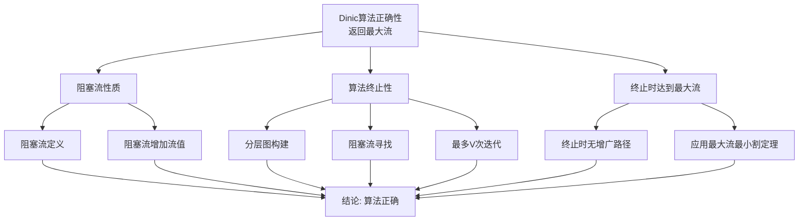

# 流算法证明树 / Proof Trees for Flow Algorithms

## 📚 **概述 / Overview**

本文档提供流算法相关定理的证明树，清晰展示证明的结构和推理路径。

**创建时间**: 2025年1月
**模块**: 图的流理论
**状态**: 🚀 持续更新中

---

## 🌳 **一、最大流最小割定理证明树 / Proof Tree for Max-Flow Min-Cut Theorem**

### 定理 5.2.1 (最大流最小割定理)

```mermaid
graph TD
    Goal[最大流最小割定理<br/>max|f| = min c(S)] --> L1[弱对偶性<br/>|f| ≤ c(S)]
    Goal --> L2[Ford-Fulkerson终止性]
    Goal --> L3[最大流对应最小割<br/>|f| = c(S)]

    L1 --> A1[流量守恒性质]
    L1 --> A2[容量约束性质]

    L2 --> A3[容量为整数或有理数]
    L2 --> A4[每次增广增加流值]

    L3 --> A5[算法终止条件]
    L3 --> A6[残差网络无s-t路径]
    L3 --> L4[构造割S]

    L4 --> A7[定义S为s可达顶点集]
    L4 --> A8[证明|f| = c(S)]

    A1 --> Conclusion[结论: 最大流 = 最小割]
    A2 --> Conclusion
    A3 --> Conclusion
    A4 --> Conclusion
    A5 --> Conclusion
    A6 --> Conclusion
    A7 --> Conclusion
    A8 --> Conclusion
```

**证明结构说明 / Proof Structure**:
- **根节点**: 目标定理 - 最大流值等于最小割容量
- **一级分支**: 三个主要引理
  - 弱对偶性：建立流和割的基本关系
  - 算法终止性：保证算法能完成
  - 最大流对应最小割：建立等式关系
- **二级分支**: 支撑引理的公理和已知事实
- **叶节点**: 基本公理和定义

**证明步骤 / Proof Steps**:
1. **步骤1**: 证明弱对偶性（任意流值 ≤ 任意割容量）
2. **步骤2**: 证明Ford-Fulkerson算法终止
3. **步骤3**: 证明算法终止时构造的割容量等于流值
4. **步骤4**: 由弱对偶性和步骤3，得出最大流 = 最小割

---

## 🌳 **二、Edmonds-Karp算法正确性证明树 / Proof Tree for Edmonds-Karp Correctness**

### 定理 5.2.1 (Edmonds-Karp算法正确性)

```mermaid
graph TD
    Goal[Edmonds-Karp算法正确性<br/>返回最大流] --> L1[流有效性保持]
    Goal --> L2[算法终止性]
    Goal --> L3[终止时达到最大流]

    L1 --> A1[初始流有效<br/>f = 0]
    L1 --> L4[增广保持有效性]

    L4 --> A2[容量约束保持]
    L4 --> A3[流量守恒保持]

    L2 --> A4[每次增广增加流值]
    L2 --> A5[流值有上界]

    L3 --> A6[终止时无增广路径]
    L3 --> L5[构造最小割]

    L5 --> A7[定义S为s可达顶点集]
    L5 --> A8[证明|f| = c(S)]
    L5 --> A9[应用最大流最小割定理]

    A1 --> Conclusion[结论: 算法正确]
    A2 --> Conclusion
    A3 --> Conclusion
    A4 --> Conclusion
    A5 --> Conclusion
    A6 --> Conclusion
    A7 --> Conclusion
    A8 --> Conclusion
    A9 --> Conclusion
```

**证明结构说明 / Proof Structure**:
- **根节点**: 算法正确性 - Edmonds-Karp返回最大流
- **一级分支**: 三个关键性质
  - 流有效性保持：算法执行过程中流始终有效
  - 算法终止性：算法在有限步内终止
  - 终止时达到最大流：算法终止时的流是最大流
- **二级分支**: 支撑引理和公理

**证明步骤 / Proof Steps**:
1. **步骤1**: 证明算法保持流的有效性（归纳法）
2. **步骤2**: 证明算法终止性（流值有上界）
3. **步骤3**: 证明终止时达到最大流（构造最小割）
4. **步骤4**: 结论

---

## 🌳 **三、Edmonds-Karp算法复杂度证明树 / Proof Tree for Edmonds-Karp Complexity**

### 定理 5.2.2 (Edmonds-Karp算法时间复杂度)

```mermaid
graph TD
    Goal[时间复杂度 O(V·E²)] --> L1[增广次数分析]
    Goal --> L2[单次增广复杂度]

    L1 --> L3[最短路径长度单调递增]
    L1 --> L4[每个距离值最多O(E)次增广]

    L3 --> A1[最短路径长度从1到V-1]
    L3 --> A2[路径长度不变或增加]

    L4 --> A3[每条边最多使用一次作为瓶颈]
    L4 --> A4[距离值最多V-1个]

    L2 --> A5[BFS复杂度O(E)]
    L2 --> A6[流更新复杂度O(V)]

    A1 --> Calc1[增广次数: O(V·E)]
    A2 --> Calc1
    A3 --> Calc1
    A4 --> Calc1

    A5 --> Calc2[单次增广: O(E)]
    A6 --> Calc2

    Calc1 --> Conclusion[总复杂度: O(V·E²)]
    Calc2 --> Conclusion
```

**证明结构说明 / Proof Structure**:
- **根节点**: 时间复杂度上界 $O(V \cdot E^2)$
- **一级分支**: 两个关键分析
  - 增广次数分析：最多多少次增广
  - 单次增广复杂度：每次增广需要多少时间
- **二级分支**: 支撑引理

**证明步骤 / Proof Steps**:
1. **步骤1**: 证明最短路径长度单调递增
2. **步骤2**: 证明每个距离值最多$O(E)$次增广
3. **步骤3**: 证明单次增广复杂度为$O(E)$
4. **步骤4**: 计算总复杂度

---

## 🌳 **四、Dinic算法正确性证明树 / Proof Tree for Dinic Algorithm Correctness**

### 定理 5.2.3 (Dinic算法正确性)



**证明结构说明 / Proof Structure**:
- **根节点**: Dinic算法正确性
- **一级分支**: 三个关键性质
  - 阻塞流性质：阻塞流是有效流
  - 算法终止性：算法在有限步内终止
  - 终止时达到最大流：算法终止时的流是最大流

---

## 📊 **五、证明树使用指南 / Proof Tree Usage Guide**

### 5.1 如何阅读证明树

1. **从根节点开始**: 理解要证明的目标
2. **向下追踪**: 沿着分支理解证明的结构
3. **理解依赖关系**: 注意哪些引理依赖于哪些公理
4. **验证完整性**: 确保所有分支都到达结论

### 5.2 如何构造证明树

1. **确定目标**: 明确要证明的定理
2. **分解问题**: 将定理分解为引理
3. **建立依赖**: 确定引理之间的依赖关系
4. **填充细节**: 为每个引理提供证明或引用
5. **验证路径**: 确保从公理到结论的路径完整

### 5.3 证明树的应用

- **教学**: 帮助学生理解证明结构
- **验证**: 检查证明的完整性
- **发现**: 发现证明中的缺失步骤
- **优化**: 优化证明的结构

---

## 🔗 **相关链接 / Related Links**

- [最大流最小割定理的严格证明](02-最大流最小割定理的严格证明.md)
- [最大流算法详细分析](03-最大流算法详细分析.md)
- [网络流的基本概念](01-网络流的基本概念.md)
- [图的流理论目录](../README.md)

---

**文档版本**: v1.0
**创建时间**: 2025年1月
**最后更新**: 2025年1月
**维护者**: GraphNetWorkCommunicate项目组
