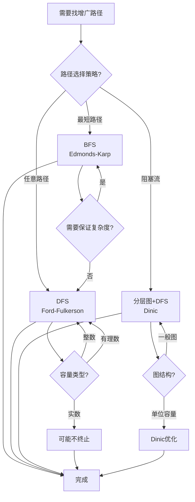
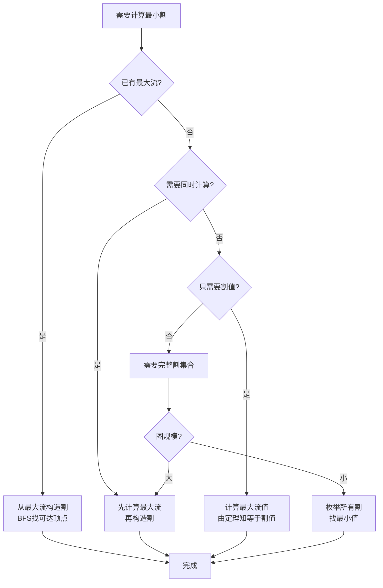

# 流算法选择决策树 / Decision Tree for Flow Algorithm Selection

## 📚 **概述 / Overview**

本文档提供流算法选择的决策树，帮助根据问题特性选择合适的最优流算法。

**创建时间**: 2025年1月
**模块**: 图的流理论
**状态**: 🚀 持续更新中

---

## 🌳 **一、最大流算法选择决策树 / Maximum Flow Algorithm Selection Decision Tree**

### 决策树图

```mermaid
flowchart TD
    Start[需要计算最大流] --> Q1{图规模?}

    Q1 -->|小图 V<100| Q2{需要精确解?}
    Q1 -->|中图 100≤V<1000| Q3{边密度?}
    Q1 -->|大图 V≥1000| Q4{特殊结构?}

    Q2 -->|是| A1[Ford-Fulkerson<br/>简单实现]
    Q2 -->|否| A2[近似算法]

    Q3 -->|稀疏 E≈V| A3[Edmonds-Karp<br/>O(V·E²)]
    Q3 -->|稠密 E≈V²| A4[Dinic<br/>O(V²·E)]

    Q4 -->|单位容量| A5[Dinic<br/>O(V^0.5·E)]
    Q4 -->|二分图匹配| A6[Hopcroft-Karp<br/>O(V^0.5·E)]
    Q4 -->|一般图| A7[Dinic或Push-Relabel]

    A1 --> End[完成]
    A2 --> End
    A3 --> End
    A4 --> End
    A5 --> End
    A6 --> End
    A7 --> End
```

### 决策规则说明 / Decision Rules

#### 规则1: 图规模判断

- **小图** ($V < 100$): 可以使用简单算法
- **中图** ($100 \leq V < 1000$): 需要考虑算法复杂度
- **大图** ($V \geq 1000$): 必须使用高效算法

#### 规则2: 边密度判断

- **稀疏图** ($E \approx V$): Edmonds-Karp算法更优
- **稠密图** ($E \approx V^2$): Dinic算法更优

#### 规则3: 特殊结构判断

- **单位容量**: Dinic算法有特殊优化
- **二分图匹配**: 可以使用专门的匹配算法
- **一般图**: 使用通用流算法

### 算法特性对比 / Algorithm Characteristics Comparison

| 算法 | 时间复杂度 | 空间复杂度 | 适用场景 | 实现难度 |
|------|-----------|-----------|---------|---------|
| **Ford-Fulkerson** | $O(E \cdot |f^*|)$ | $O(V+E)$ | 小图、教学 | 低 |
| **Edmonds-Karp** | $O(V \cdot E^2)$ | $O(V+E)$ | 稀疏图 | 中 |
| **Dinic** | $O(V^2 \cdot E)$ | $O(V+E)$ | 稠密图、单位容量 | 中 |
| **Push-Relabel** | $O(V^2 \cdot E)$ | $O(V+E)$ | 大图、实际应用 | 高 |

---

## 🌳 **二、增广路径选择决策树 / Augmenting Path Selection Decision Tree**

### 决策树图



### 决策规则说明 / Decision Rules

#### 规则1: 路径选择策略

- **最短路径**: 使用BFS，保证多项式时间复杂度
- **任意路径**: 使用DFS，简单但可能效率低
- **阻塞流**: 使用分层图，一次处理多条路径

#### 规则2: 容量类型考虑

- **整数容量**: 所有方法都适用
- **有理数容量**: 可以转换为整数
- **实数容量**: 需要特殊处理，可能不终止

---

## 🌳 **三、最小割计算决策树 / Minimum Cut Computation Decision Tree**

### 决策树图



### 决策规则说明 / Decision Rules

#### 规则1: 最大流最小割定理应用

- **已有最大流**: 直接构造最小割（BFS找可达顶点）
- **需要同时计算**: 先计算最大流，再构造割
- **只需要割值**: 计算最大流值即可（由定理知相等）

#### 规则2: 完整割集合需求

- **小图**: 可以枚举所有割
- **大图**: 使用最大流最小割定理

---

## 📊 **四、决策树使用指南 / Decision Tree Usage Guide**

### 4.1 使用步骤

1. **识别问题类型**: 确定需要解决的具体问题
2. **评估图特性**: 分析图的规模、密度、结构
3. **遵循决策树**: 按照决策树逐步选择
4. **验证选择**: 确认选择的算法适合问题

### 4.2 注意事项

- **时间复杂度**: 考虑实际图规模
- **空间复杂度**: 确保有足够内存
- **实现难度**: 平衡性能和开发成本
- **特殊结构**: 利用图的特殊性质

### 4.3 常见场景

#### 场景1: 小规模教学示例

- **选择**: Ford-Fulkerson算法
- **理由**: 简单易懂，适合教学

#### 场景2: 中等规模稀疏图

- **选择**: Edmonds-Karp算法
- **理由**: 复杂度$O(V \cdot E^2)$，稀疏图下效率高

#### 场景3: 大规模稠密图

- **选择**: Dinic算法
- **理由**: 复杂度$O(V^2 \cdot E)$，稠密图下更优

#### 场景4: 单位容量网络

- **选择**: Dinic算法（单位容量优化）
- **理由**: 复杂度降为$O(V^{0.5} \cdot E)$

---

## 🔗 **相关链接 / Related Links**

- [最大流算法详细分析](03-最大流算法详细分析.md)
- [流算法证明树](05-流算法证明树.md)
- [网络流的基本概念](01-网络流的基本概念.md)
- [图的流理论目录](../README.md)

---

**文档版本**: v1.0
**创建时间**: 2025年1月
**最后更新**: 2025年1月
**维护者**: GraphNetWorkCommunicate项目组
