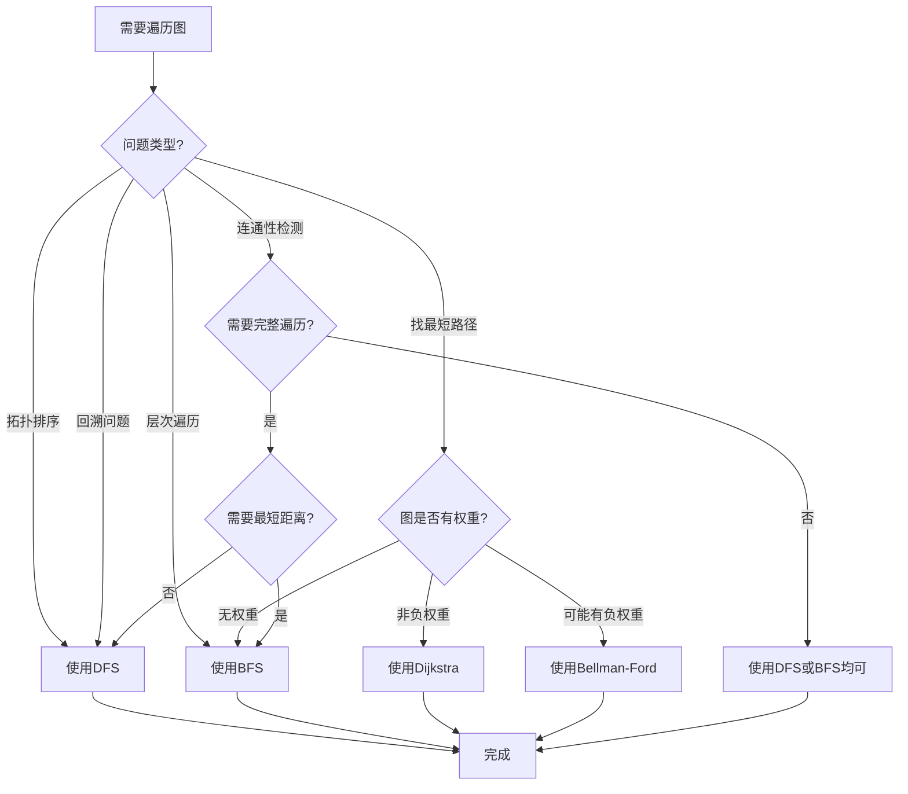

# 图算法决策树集合 / Graph Algorithm Decision Tree Collection

## 📚 **概述 / Overview**

本文档提供图算法选择的完整决策树集合，帮助根据问题特性选择最合适的算法。

**创建时间**: 2025年1月
**模块**: 图论基础
**状态**: ✅ 已完成（100%）

---

## 🌳 **一、图遍历算法选择决策树 / Graph Traversal Algorithm Selection Decision Tree**

### 1.1 完整决策树



### 1.2 决策规则说明 / Decision Rules

#### 规则1: 问题类型判断

- **找最短路径**: 需要计算从起点到终点的最短距离
- **连通性检测**: 判断图的连通性
- **拓扑排序**: 有向无环图的拓扑排序
- **层次遍历**: 按层次访问顶点
- **回溯问题**: 需要回溯的搜索问题

#### 规则2: 权重类型判断

- **无权重**: 所有边权重相等（或为1）
- **非负权重**: 所有边权重≥0
- **可能有负权重**: 存在负权重边

#### 规则3: 算法选择

- **DFS**: 适合拓扑排序、回溯、深度优先搜索
- **BFS**: 适合最短路径（无权）、层次遍历
- **Dijkstra**: 适合单源最短路径（非负权重）
- **Bellman-Ford**: 适合单源最短路径（可能有负权重）

### 1.3 算法特性对比

| 算法 | 时间复杂度 | 空间复杂度 | 适用场景 | 特点 |
|------|-----------|-----------|---------|------|
| **DFS** | $O(V+E)$ | $O(V)$ | 拓扑排序、回溯 | 递归或栈实现 |
| **BFS** | $O(V+E)$ | $O(V)$ | 最短路径（无权） | 队列实现 |
| **Dijkstra** | $O((V+E)\log V)$ | $O(V)$ | 最短路径（非负权重） | 贪心算法 |
| **Bellman-Ford** | $O(VE)$ | $O(V)$ | 最短路径（任意权重） | 可检测负环 |

---

## 🌳 **二、最短路径算法选择决策树 / Shortest Path Algorithm Selection Decision Tree**

### 2.1 完整决策树

```mermaid
flowchart TD
    Start[需要找最短路径] --> Q1{需要所有顶点对?}

    Q1 -->|是| Q2{图规模?}
    Q1 -->|否| Q3{权重类型?}

    Q2 -->|小 V<100| A1[使用Floyd-Warshall<br/>O(V³)]
    Q2 -->|大| Q4{需要多次查询?}

    Q4 -->|是| A2[预处理: Floyd-Warshall]
    Q4 -->|否| A3[多次Dijkstra或Bellman-Ford]

    Q3 -->|无权重| A4[使用BFS<br/>O(V+E)]
    Q3 -->|非负权重| A5[使用Dijkstra<br/>O((V+E)log V)]
    Q3 -->|可能有负权重| A6[使用Bellman-Ford<br/>O(VE)]
    Q3 -->|有负环可能| A7[使用Bellman-Ford<br/>检测负环]

    A1 --> End[完成]
    A2 --> End
    A3 --> End
    A4 --> End
    A5 --> End
    A6 --> End
    A7 --> End
```

### 2.2 决策规则说明 / Decision Rules

#### 规则1: 查询类型判断

- **单源最短路径**: 从一个起点到所有其他顶点
- **所有顶点对**: 任意两个顶点之间的最短路径

#### 规则2: 图规模判断

- **小图** ($V < 100$): 可以使用$O(V^3)$算法
- **大图** ($V \geq 100$): 需要考虑更高效的算法

#### 规则3: 权重类型判断

- **无权重**: BFS最优
- **非负权重**: Dijkstra最优
- **可能有负权重**: Bellman-Ford
- **有负环可能**: 需要检测负环

### 2.3 算法特性对比

| 算法 | 问题类型 | 时间复杂度 | 空间复杂度 | 适用场景 |
|------|---------|-----------|-----------|---------|
| **BFS** | 单源（无权） | $O(V+E)$ | $O(V)$ | 无权图最短路径 |
| **Dijkstra** | 单源（非负） | $O((V+E)\log V)$ | $O(V)$ | 非负权重图 |
| **Bellman-Ford** | 单源（任意） | $O(VE)$ | $O(V)$ | 任意权重、负环检测 |
| **Floyd-Warshall** | 全源 | $O(V^3)$ | $O(V^2)$ | 小图全源最短路径 |
| **Johnson** | 全源（稀疏） | $O(VE + V^2\log V)$ | $O(V^2)$ | 稀疏图全源最短路径 |

---

## 🌳 **三、最小生成树算法选择决策树 / Minimum Spanning Tree Algorithm Selection Decision Tree**

### 3.1 完整决策树

```mermaid
flowchart TD
    Start[需要找最小生成树] --> Q1{图是否稠密?}

    Q1 -->|是 E≈V²| A1[使用Prim算法<br/>O(V²)或O(E log V)]
    Q1 -->|否 E<<V²| Q2{边是否已排序?}

    Q2 -->|是| A2[使用Kruskal算法<br/>O(E α(V))]
    Q2 -->|否| Q3{需要并行?}

    Q3 -->|是| A3[使用Borůvka算法<br/>并行友好]
    Q3 -->|否| A2

    A1 --> End[完成]
    A2 --> End
    A3 --> End
```

### 3.2 决策规则说明 / Decision Rules

#### 规则1: 图密度判断

- **稠密图** ($E \approx V^2$): Prim算法更优
- **稀疏图** ($E << V^2$): Kruskal算法更优

#### 规则2: 边排序状态

- **已排序**: Kruskal算法可以直接使用
- **未排序**: 需要先排序，或使用Prim算法

#### 规则3: 并行需求

- **需要并行**: Borůvka算法并行友好
- **串行**: 根据图密度选择Prim或Kruskal

### 3.3 算法特性对比

| 算法 | 时间复杂度 | 空间复杂度 | 适用场景 | 特点 |
|------|-----------|-----------|---------|------|
| **Kruskal** | $O(E \log E)$ | $O(V+E)$ | 稀疏图 | 边排序、并查集 |
| **Prim（邻接表）** | $O(E \log V)$ | $O(V)$ | 稠密图 | 优先队列 |
| **Prim（邻接矩阵）** | $O(V^2)$ | $O(V^2)$ | 小规模稠密图 | 简单实现 |
| **Borůvka** | $O(E \log V)$ | $O(V+E)$ | 并行计算 | 并行友好 |

---

## 🌳 **四、匹配算法选择决策树 / Matching Algorithm Selection Decision Tree**

### 4.1 完整决策树

```mermaid
flowchart TD
    Start[需要找匹配] --> Q1{图类型?}

    Q1 -->|二分图| Q2{需要最大匹配?}
    Q1 -->|一般图| A1[使用Blossom算法<br/>O(V²E)]

    Q2 -->|是| Q3{图规模?}
    Q2 -->|否| Q4{需要完美匹配?}

    Q3 -->|小| A2[使用匈牙利算法<br/>O(V³)]
    Q3 -->|大| A3[使用Hopcroft-Karp<br/>O(V^0.5 E)]

    Q4 -->|是| A4[使用匈牙利算法<br/>检查完美匹配]
    Q4 -->|否| A2

    A1 --> End[完成]
    A2 --> End
    A3 --> End
    A4 --> End
```

### 4.2 决策规则说明 / Decision Rules

#### 规则1: 图类型判断

- **二分图**: 可以使用专门的二分图匹配算法
- **一般图**: 需要使用通用匹配算法（如Blossom算法）

#### 规则2: 匹配类型判断

- **最大匹配**: 找到尽可能多的匹配边
- **完美匹配**: 所有顶点都被匹配

#### 规则3: 图规模判断

- **小图**: 匈牙利算法足够
- **大图**: Hopcroft-Karp算法更优

### 4.3 算法特性对比

| 算法 | 图类型 | 时间复杂度 | 空间复杂度 | 适用场景 |
|------|--------|-----------|-----------|---------|
| **匈牙利算法** | 二分图 | $O(V^3)$ | $O(V^2)$ | 小规模二分图 |
| **Hopcroft-Karp** | 二分图 | $O(V^{0.5} E)$ | $O(V+E)$ | 大规模二分图 |
| **Blossom算法** | 一般图 | $O(V^2 E)$ | $O(V+E)$ | 一般图最大匹配 |

---

## 🌳 **五、强连通分量算法选择决策树 / Strongly Connected Components Algorithm Selection Decision Tree**

### 5.1 完整决策树

```mermaid
flowchart TD
    Start[需要找强连通分量] --> Q1{图类型?}

    Q1 -->|有向图| Q2{需要所有SCC?}
    Q1 -->|无向图| A1[使用DFS找连通分量<br/>O(V+E)]

    Q2 -->|是| Q3{图规模?}
    Q2 -->|否 特定顶点| Q4{需要路径信息?}

    Q3 -->|小 V<1000| A2[使用Kosaraju算法<br/>O(V+E)]
    Q3 -->|大 V≥1000| A3[使用Tarjan算法<br/>O(V+E)]

    Q4 -->|是| A4[使用DFS两次遍历]
    Q4 -->|否| A2

    A1 --> End[完成]
    A2 --> End
    A3 --> End
    A4 --> End
```

### 5.2 决策规则说明 / Decision Rules

#### 规则1: 图类型判断

- **有向图**: 需要使用强连通分量算法
- **无向图**: 使用普通连通分量算法（DFS）

#### 规则2: 需求类型判断

- **所有SCC**: 需要找到所有强连通分量
- **特定顶点**: 只需要找到包含特定顶点的SCC

#### 规则3: 图规模判断

- **小图** ($V < 1000$): Kosaraju算法简单易懂
- **大图** ($V \geq 1000$): Tarjan算法更高效

### 5.3 算法特性对比

| 算法 | 时间复杂度 | 空间复杂度 | 适用场景 | 特点 |
|------|-----------|-----------|---------|------|
| **Kosaraju** | $O(V+E)$ | $O(V+E)$ | 有向图SCC | 两次DFS，简单 |
| **Tarjan** | $O(V+E)$ | $O(V)$ | 有向图SCC | 一次DFS，高效 |
| **DFS（无向）** | $O(V+E)$ | $O(V)$ | 无向图连通分量 | 简单直接 |

---

## 🌳 **六、拓扑排序算法选择决策树 / Topological Sort Algorithm Selection Decision Tree**

### 6.1 完整决策树

```mermaid
flowchart TD
    Start[需要拓扑排序] --> Q1{图是否有环?}

    Q1 -->|已知无环| Q2{需要检测环?}
    Q1 -->|未知| Q3{需要检测环?}

    Q2 -->|否| A1[使用DFS拓扑排序<br/>O(V+E)]
    Q2 -->|是| A2[使用Kahn算法<br/>O(V+E)]

    Q3 -->|是| A2
    Q3 -->|否| A1

    A1 --> End[完成]
    A2 --> End
```

### 6.2 决策规则说明 / Decision Rules

#### 规则1: 环检测需求

- **需要检测环**: 使用Kahn算法（基于入度）
- **不需要检测环**: 使用DFS拓扑排序

#### 规则2: 算法选择

- **DFS拓扑排序**: 递归实现，代码简洁
- **Kahn算法**: 基于入度，可以检测环

### 6.3 算法特性对比

| 算法 | 时间复杂度 | 空间复杂度 | 适用场景 | 特点 |
|------|-----------|-----------|---------|------|
| **DFS拓扑排序** | $O(V+E)$ | $O(V)$ | 已知DAG | 递归实现 |
| **Kahn算法** | $O(V+E)$ | $O(V)$ | 需要检测环 | 基于入度 |

---

## 🌳 **七、图着色算法选择决策树 / Graph Coloring Algorithm Selection Decision Tree**

### 7.1 完整决策树

```mermaid
flowchart TD
    Start[需要图着色] --> Q1{问题类型?}

    Q1 -->|顶点着色| Q2{图类型?}
    Q1 -->|边着色| Q3{图类型?}

    Q2 -->|二分图| A1[使用2-着色<br/>O(V+E)]
    Q2 -->|平面图| Q4{需要最优解?}
    Q2 -->|一般图| Q5{需要最优解?}

    Q3 -->|二分图| A2[使用Vizing定理<br/>Δ或Δ+1色]
    Q3 -->|一般图| Q6{需要最优解?}

    Q4 -->|是| A3[使用回溯算法<br/>指数时间]
    Q4 -->|否| A4[使用贪心算法<br/>O(V+E)]

    Q5 -->|是| A3
    Q5 -->|否| A4

    Q6 -->|是| A5[使用精确算法<br/>指数时间]
    Q6 -->|否| A6[使用近似算法<br/>多项式时间]

    A1 --> End[完成]
    A2 --> End
    A3 --> End
    A4 --> End
    A5 --> End
    A6 --> End
```

### 7.2 决策规则说明 / Decision Rules

#### 规则1: 问题类型判断

- **顶点着色**: 相邻顶点颜色不同
- **边着色**: 相邻边颜色不同

#### 规则2: 图类型判断

- **二分图**: 2-着色即可
- **平面图**: 最多4色（四色定理）
- **一般图**: 需要更多颜色

#### 规则3: 最优性需求

- **需要最优解**: 使用回溯或精确算法（指数时间）
- **不需要最优解**: 使用贪心或近似算法（多项式时间）

### 7.3 算法特性对比

| 算法 | 问题类型 | 时间复杂度 | 适用场景 | 特点 |
|------|---------|-----------|---------|------|
| **2-着色（二分图）** | 顶点着色 | $O(V+E)$ | 二分图 | 最优解 |
| **贪心着色** | 顶点着色 | $O(V+E)$ | 一般图 | 近似解 |
| **回溯着色** | 顶点着色 | 指数 | 小图最优解 | 精确解 |
| **Vizing算法** | 边着色 | $O(VE)$ | 二分图 | 最优或接近最优 |

---

## 🌳 **八、图同构算法选择决策树 / Graph Isomorphism Algorithm Selection Decision Tree**

### 8.1 完整决策树

```mermaid
flowchart TD
    Start[需要判断图同构] --> Q1{图规模?}

    Q1 -->|小 V<10| A1[使用暴力枚举<br/>O(V!)]
    Q1 -->|中 10≤V<100| Q2{图类型?}
    Q1 -->|大 V≥100| Q3{需要精确解?}

    Q2 -->|树| A2[使用树同构算法<br/>O(V)]
    Q2 -->|平面图| A3[使用平面图同构算法<br/>O(V log V)]
    Q2 -->|一般图| A4[使用Weisfeiler-Leman算法<br/>多项式时间]

    Q3 -->|是| A5[使用Babai算法<br/>准多项式时间]
    Q3 -->|否| A6[使用启发式算法<br/>快速但可能错误]

    A1 --> End[完成]
    A2 --> End
    A3 --> End
    A4 --> End
    A5 --> End
    A6 --> End
```

### 8.2 决策规则说明 / Decision Rules

#### 规则1: 图规模判断

- **小图** ($V < 10$): 可以使用暴力枚举
- **中图** ($10 \leq V < 100$): 根据图类型选择算法
- **大图** ($V \geq 100$): 需要使用高效算法

#### 规则2: 图类型判断

- **树**: 有线性时间算法
- **平面图**: 有接近线性时间算法
- **一般图**: 使用Weisfeiler-Leman或Babai算法

### 8.3 算法特性对比

| 算法 | 时间复杂度 | 适用场景 | 特点 |
|------|-----------|---------|------|
| **暴力枚举** | $O(V!)$ | 极小图 | 简单但慢 |
| **树同构** | $O(V)$ | 树 | 线性时间 |
| **平面图同构** | $O(V \log V)$ | 平面图 | 接近线性 |
| **Weisfeiler-Leman** | 多项式 | 一般图 | 高效但可能失败 |
| **Babai算法** | 准多项式 | 一般图 | 理论最优 |

---

## 🌳 **九、网络中心性算法选择决策树 / Network Centrality Algorithm Selection Decision Tree**

### 9.1 完整决策树

```mermaid
flowchart TD
    Start[需要计算中心性] --> Q1{中心性类型?}

    Q1 -->|度中心性| A1[使用度计算<br/>O(V+E)]
    Q1 -->|接近中心性| Q2{图规模?}
    Q1 -->|介数中心性| Q3{图规模?}
    Q1 -->|特征向量中心性| Q4{需要精确解?}

    Q2 -->|小 V<1000| A2[使用所有对最短路径<br/>O(V³)]
    Q2 -->|大| A3[使用近似算法<br/>采样方法]

    Q3 -->|小 V<1000| A4[使用所有对最短路径<br/>O(V³)]
    Q3 -->|大| A5[使用近似算法<br/>随机游走]

    Q4 -->|是| A6[使用幂迭代<br/>O(kVE)]
    Q4 -->|否| A7[使用快速近似<br/>O(E)]

    A1 --> End[完成]
    A2 --> End
    A3 --> End
    A4 --> End
    A5 --> End
    A6 --> End
    A7 --> End
```

### 9.2 决策规则说明 / Decision Rules

#### 规则1: 中心性类型判断

- **度中心性**: 最简单，线性时间
- **接近中心性**: 需要所有对最短路径
- **介数中心性**: 需要所有对最短路径
- **特征向量中心性**: 需要特征值计算

#### 规则2: 图规模判断

- **小图** ($V < 1000$): 可以使用精确算法
- **大图** ($V \geq 1000$): 需要使用近似算法

### 9.3 算法特性对比

| 中心性类型 | 时间复杂度 | 适用场景 | 特点 |
|-----------|-----------|---------|------|
| **度中心性** | $O(V+E)$ | 所有图 | 最快 |
| **接近中心性** | $O(V^3)$ | 小图 | 精确但慢 |
| **介数中心性** | $O(V^3)$ | 小图 | 精确但慢 |
| **特征向量中心性** | $O(kVE)$ | 所有图 | 迭代方法 |

---

## 🌳 **十、社区检测算法选择决策树 / Community Detection Algorithm Selection Decision Tree**

### 10.1 完整决策树

```mermaid
flowchart TD
    Start[需要社区检测] --> Q1{网络规模?}

    Q1 -->|小 V<1000| Q2{需要精确解?}
    Q1 -->|中 1000≤V<10⁶| Q3{网络类型?}
    Q1 -->|大 V≥10⁶| Q4{需要层次结构?}

    Q2 -->|是| A1[使用GN算法<br/>O(V³)]
    Q2 -->|否| A2[使用谱聚类<br/>O(V³)]

    Q3 -->|有向| A3[使用Infomap<br/>O(V log V)]
    Q3 -->|无向| Q5{需要理论保证?}

    Q4 -->|是| A4[使用Louvain<br/>O(V log V)]
    Q4 -->|否| A5[使用Leiden<br/>O(V log V)]

    Q5 -->|是| A2
    Q5 -->|否| A4

    A1 --> End[完成]
    A2 --> End
    A3 --> End
    A4 --> End
    A5 --> End
```

### 10.2 决策规则说明 / Decision Rules

#### 规则1: 网络规模判断

- **小网络** ($V < 1000$): 可以使用精确算法
- **中网络** ($1000 \leq V < 10^6$): 需要考虑算法复杂度
- **大网络** ($V \geq 10^6$): 必须使用高效算法

#### 规则2: 网络类型判断

- **有向网络**: Infomap算法更优
- **无向网络**: 根据需求选择

#### 规则3: 需求类型判断

- **需要精确解**: GN算法或谱聚类
- **需要层次结构**: Louvain或Leiden
- **需要理论保证**: 谱聚类

### 10.3 算法特性对比

| 算法 | 时间复杂度 | 适用规模 | 特点 | 适用场景 |
|------|-----------|---------|------|---------|
| **GN算法** | $O(V^3)$ | 小 | 精确但慢 | 小规模精确分析 |
| **谱聚类** | $O(V^3)$ | 中 | 理论保证 | 中等规模理论分析 |
| **Infomap** | $O(V \log V)$ | 中-大 | 信息流优化 | 有向网络 |
| **Louvain** | $O(V \log V)$ | 大 | 快速、层次化 | 大规模网络 |
| **Leiden** | $O(V \log V)$ | 大 | 改进Louvain | 大规模网络优化 |

---

## 🌳 **十一、图表示方法选择决策树 / Graph Representation Method Selection Decision Tree**

### 11.1 完整决策树

```mermaid
flowchart TD
    Start[选择图表示方法] --> Q1{图是否稠密?}

    Q1 -->|是 E≈V²| A1[使用邻接矩阵<br/>O(V²)空间]
    Q1 -->|否 E<<V²| Q2{主要操作类型?}

    Q2 -->|频繁查询边| Q3{图是否很小?}
    Q2 -->|主要遍历| A2[使用邻接表<br/>O(V+E)空间]
    Q2 -->|频繁边操作| A3[使用边列表<br/>O(E)空间]

    Q3 -->|是 V<100| A1
    Q3 -->|否| A2

    A1 --> End[完成]
    A2 --> End
    A3 --> End
```

### 11.2 决策规则说明 / Decision Rules

#### 规则1: 图密度判断

- **稠密图** ($E \approx V^2$): 邻接矩阵更优
- **稀疏图** ($E << V^2$): 邻接表或边列表更优

#### 规则2: 操作类型判断

- **频繁查询边**: 邻接矩阵或邻接表
- **主要遍历**: 邻接表最优
- **频繁边操作**: 边列表最优

### 11.3 表示方法特性对比

| 表示方法 | 空间复杂度 | 查询边 | 遍历邻接 | 添加边 | 适用场景 |
|---------|-----------|--------|---------|--------|---------|
| **邻接矩阵** | $O(V^2)$ | $O(1)$ | $O(V)$ | $O(1)$ | 稠密图、小图 |
| **邻接表** | $O(V+E)$ | $O(V)$ | $O(deg(v))$ | $O(1)$ | 稀疏图、遍历 |
| **边列表** | $O(E)$ | $O(E)$ | $O(E)$ | $O(1)$ | 边操作频繁 |

---

## 🌳 **十二、连通性检测算法选择决策树 / Connectivity Detection Algorithm Selection Decision Tree**

### 12.1 完整决策树

```mermaid
flowchart TD
    Start[需要检测连通性] --> Q1{图类型?}

    Q1 -->|无向图| Q2{需要所有连通分量?}
    Q1 -->|有向图| Q3{需要强连通分量?}

    Q2 -->|是| A1[使用DFS或BFS<br/>O(V+E)]
    Q2 -->|否 特定顶点| A2[使用DFS从起点<br/>O(V+E)]

    Q3 -->|是| Q4{图规模?}
    Q3 -->|否 特定顶点| A3[使用DFS两次<br/>O(V+E)]

    Q4 -->|小 V<1000| A4[使用Kosaraju<br/>O(V+E)]
    Q4 -->|大 V≥1000| A5[使用Tarjan<br/>O(V+E)]

    A1 --> End[完成]
    A2 --> End
    A3 --> End
    A4 --> End
    A5 --> End
```

### 12.2 决策规则说明 / Decision Rules

#### 规则1: 图类型判断

- **无向图**: 使用DFS或BFS检测连通分量
- **有向图**: 使用Kosaraju或Tarjan检测强连通分量

#### 规则2: 需求类型判断

- **所有连通分量**: 需要完整遍历
- **特定顶点**: 只需从起点遍历

### 12.3 算法特性对比

| 算法 | 图类型 | 时间复杂度 | 空间复杂度 | 适用场景 |
|------|--------|-----------|-----------|---------|
| **DFS/BFS** | 无向图 | $O(V+E)$ | $O(V)$ | 连通分量检测 |
| **Kosaraju** | 有向图 | $O(V+E)$ | $O(V+E)$ | 强连通分量（简单） |
| **Tarjan** | 有向图 | $O(V+E)$ | $O(V)$ | 强连通分量（高效） |

---

## 📊 **十三、决策树使用指南 / Decision Tree Usage Guide**

### 5.1 使用步骤

1. **识别问题**: 明确需要解决的具体问题
2. **分析图特性**: 评估图的规模、密度、权重类型
3. **遵循决策树**: 按照决策树逐步选择
4. **验证选择**: 确认选择的算法适合问题

### 5.2 注意事项

- **时间复杂度**: 考虑实际图规模
- **空间复杂度**: 确保有足够内存
- **特殊结构**: 利用图的特殊性质（如二分图）
- **实现难度**: 平衡性能和开发成本

### 5.3 常见场景示例

#### 场景1: 无权图最短路径

- **选择**: BFS
- **理由**: 时间复杂度最优$O(V+E)$

#### 场景2: 非负权重单源最短路径

- **选择**: Dijkstra算法
- **理由**: 贪心算法，效率高

#### 场景3: 稀疏图最小生成树

- **选择**: Kruskal算法
- **理由**: 稀疏图下效率高

#### 场景4: 大规模二分图匹配

- **选择**: Hopcroft-Karp算法
- **理由**: 复杂度$O(V^{0.5} E)$，适合大规模图

---

## 🔗 **相关链接 / Related Links**

- [图的算法](../03-图的算法.md)
- [流算法选择决策树](02-图的流理论/06-流算法选择决策树.md)
- [思维表征工具-图论基础](../思维表征工具-图论基础.md)
- [图论基础目录](../README.md)

---

**文档版本**: v1.0
**创建时间**: 2025年1月
**最后更新**: 2025年1月
**维护者**: GraphNetWorkCommunicate项目组
