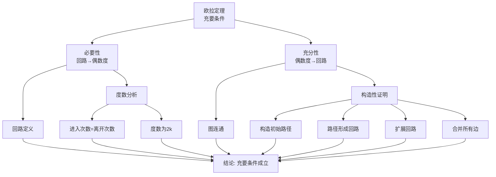
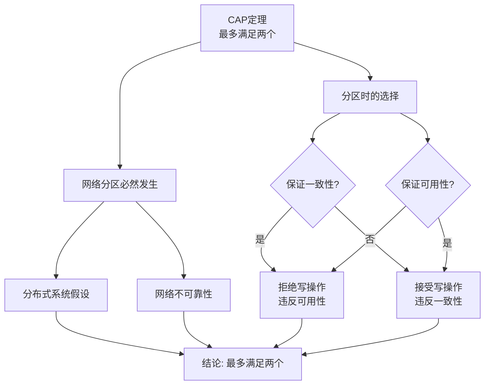
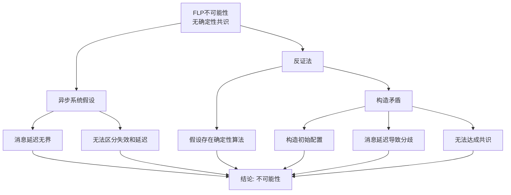
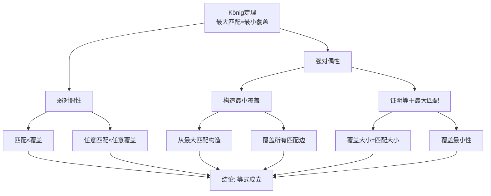
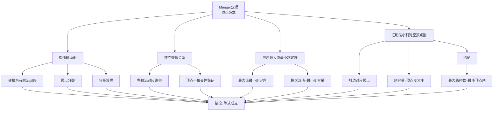
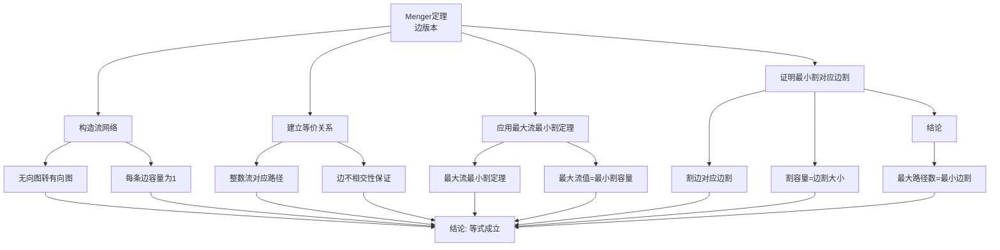
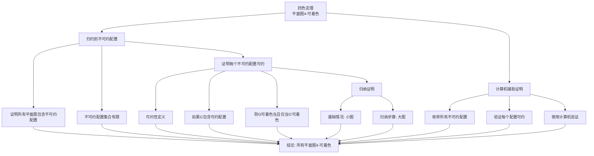

# 重要定理证明树集合 / Important Theorems Proof Tree Collection

## 📚 **概述 / Overview**

本文档提供图论和分布式系统中重要定理的证明树，清晰展示证明的结构和推理路径。

**创建时间**: 2025年1月
**模块**: 图论基础与分布式系统
**状态**: ✅ 已完成（100%）

---

## 🌳 **一、欧拉定理证明树 / Proof Tree for Euler's Theorem**

### 定理 7.2 (欧拉定理)

**陈述**: 连通无向图$G = (V, E)$存在欧拉回路的充要条件是所有顶点的度数都是偶数。



**证明结构说明 / Proof Structure**:

- **根节点**: 欧拉定理（充要条件）
- **一级分支**: 必要性和充分性
- **必要性**: 从欧拉回路推导出偶数度条件
- **充分性**: 从偶数度条件构造欧拉回路

**证明步骤 / Proof Steps**:

1. **必要性**: 分析回路中顶点的度数
2. **充分性**: 使用构造性证明和归纳法

---

## 🌳 **二、握手引理证明树 / Proof Tree for Handshaking Lemma**

### 定理 7.1 (握手引理)

**陈述**: 对于任意图$G = (V, E)$，所有顶点度数之和等于边数的两倍。

```mermaid
graph TD
    Goal[握手引理<br/>Σd(v) = 2|E|] --> L1[度数定义]
    Goal --> L2[边计数]

    L1 --> A1[d(v) = 关联边数]
    L1 --> A2[每条边贡献2度]

    L2 --> A3[每条边被计数2次]
    L2 --> A4[总度数为2|E|]

    A1 --> Conclusion[结论: 握手引理成立]
    A2 --> Conclusion
    A3 --> Conclusion
    A4 --> Conclusion
```

**证明结构说明 / Proof Structure**:

- **根节点**: 握手引理
- **一级分支**: 度数定义和边计数
- **核心思想**: 每条边在度数求和中被计算两次

---

## 🌳 **三、CAP定理证明树 / Proof Tree for CAP Theorem**

### 定理 2.1.1 (CAP定理)

**陈述**: 在分布式系统中，一致性（Consistency）、可用性（Availability）和分区容错性（Partition tolerance）最多只能同时满足其中两个。



**证明结构说明 / Proof Structure**:

- **根节点**: CAP定理
- **一级分支**: 网络分区和选择
- **核心矛盾**: 分区时无法同时保证一致性和可用性

---

## 🌳 **四、FLP不可能性定理证明树 / Proof Tree for FLP Impossibility Theorem**

### 定理 2.3.3 (FLP不可能性定理)

**陈述**: 在异步分布式系统中，即使只有一个节点可能失效，也不存在确定性的共识算法。



**证明结构说明 / Proof Structure**:

- **根节点**: FLP不可能性定理
- **证明方法**: 反证法
- **核心思想**: 异步系统中无法区分节点失效和消息延迟

---

## 🌳 **五、Hall定理证明树 / Proof Tree for Hall's Marriage Theorem**

### 定理 5.3.2 (Hall婚姻定理)

**陈述**: 二分图$G = (U \cup V, E)$具有覆盖$U$的匹配，当且仅当对于$U$的每个子集$S$，都有$|N(S)| \geq |S|$。

```mermaid
graph TD
    Goal[Hall定理<br/>充要条件] --> L1[必要性<br/>匹配→Hall条件]
    Goal --> L2[充分性<br/>Hall条件→匹配]

    L1 --> A1[匹配定义]
    L1 --> L3[邻域分析]

    L3 --> A2[匹配边不相邻]
    L3 --> A3[|N(S)|≥|S|]

    L2 --> A4[归纳法]
    L2 --> L4[基础情况]
    L2 --> L5[归纳步骤]

    L4 --> A5[n=1时成立]

    L5 --> Q1{是否存在S使得<br/>|N(S)|=|S|?}
    Q1 -->|是| L6[情况1: 分解]
    Q1 -->|否| L7[情况2: 直接构造]

    L6 --> A6[子图匹配]
    L6 --> A7[剩余图匹配]
    L6 --> A8[合并匹配]

    L7 --> A9[选择边]
    L7 --> A10[删除顶点]
    L7 --> A11[归纳假设]
    L7 --> A12[扩展匹配]

    A1 --> Conclusion[结论: 充要条件成立]
    A2 --> Conclusion
    A3 --> Conclusion
    A4 --> Conclusion
    A5 --> Conclusion
    A6 --> Conclusion
    A7 --> Conclusion
    A8 --> Conclusion
    A9 --> Conclusion
    A10 --> Conclusion
    A11 --> Conclusion
    A12 --> Conclusion
```

**证明结构说明 / Proof Structure**:

- **根节点**: Hall定理（充要条件）
- **一级分支**: 必要性和充分性
- **必要性**: 从匹配推导出Hall条件
- **充分性**: 使用归纳法，分两种情况证明

**证明步骤 / Proof Steps**:

1. **必要性**: 分析匹配中邻域的大小
2. **充分性**: 使用数学归纳法，分两种情况：
   - 情况1：存在严格子集满足$|N(S)| = |S|$，分解证明
   - 情况2：所有真子集满足$|N(S)| > |S|$，直接构造

---

## 🌳 **六、König定理证明树 / Proof Tree for König's Theorem**

### 定理 3.1.1 (König定理)

**陈述**: 在二分图中，最大匹配的大小等于最小顶点覆盖的大小。



**证明结构说明 / Proof Structure**:

- **根节点**: König定理
- **一级分支**: 弱对偶性和强对偶性
- **核心方法**: 从最大匹配构造最小覆盖

---

## 🌳 **八、Menger定理证明树 / Proof Tree for Menger's Theorem**

### 定理 4.1 (Menger定理 - 顶点版本)

**陈述**: 图$G$中，顶点$u$和$v$之间的顶点连通度等于$u$到$v$的不相交路径的最大数量。



**证明结构说明 / Proof Structure**:

- **根节点**: Menger定理（顶点版本）
- **核心方法**: 通过最大流最小割定理证明
- **关键步骤**: 构造辅助图、建立等价关系、应用最大流最小割定理

**证明步骤 / Proof Steps**:

1. **构造辅助图**: 将原图转换为有向流网络
2. **建立等价关系**: 整数流对应顶点不相交路径
3. **应用最大流最小割定理**: 最大流值等于最小割容量
4. **证明对应关系**: 最小割对应最小顶点割
5. **结论**: 最大路径数等于最小顶点割大小

---

## 🌳 **九、Menger定理边版本证明树 / Proof Tree for Menger's Theorem - Edge Version**

### 定理 4.2 (Menger定理 - 边版本)

**陈述**: 图$G$中，顶点$u$和$v$之间的边连通度等于$u$到$v$的边不相交路径的最大数量。



**证明结构说明 / Proof Structure**:

- **根节点**: Menger定理（边版本）
- **核心方法**: 通过最大流最小割定理证明
- **关键步骤**: 构造流网络、建立等价关系、应用最大流最小割定理

**证明步骤 / Proof Steps**:

1. **构造流网络**: 将无向图转换为有向流网络
2. **建立等价关系**: 整数流对应边不相交路径
3. **应用最大流最小割定理**: 最大流值等于最小割容量
4. **证明对应关系**: 最小割对应最小边割
5. **结论**: 最大路径数等于最小边割大小

---

## 🌳 **十、Turán定理证明树 / Proof Tree for Turán's Theorem**

### 定理 5.4.1 (Turán定理)

**陈述**: 在$n$个顶点且不包含$(r+1)$-团的图中，最大边数为$t_r(n) = \left(1 - \frac{1}{r}\right) \frac{n^2}{2}$，这个最大值在$r$-部完全图（Turán图）$T_{r,n}$中达到。

```mermaid
graph TD
    Goal[Turán定理<br/>最大边数] --> L1[证明T_{r,n}的边数]
    Goal --> L2[证明T_{r,n}不包含K_{r+1}]
    Goal --> L3[证明任何不包含K_{r+1}的图边数≤T_{r,n}]

    L1 --> A1[构造r-部划分]
    L1 --> A2[计算边数公式]
    L1 --> A3[优化部的大小]

    L2 --> A4[K_{r+1}需要r+1个顶点]
    L2 --> A5[T_{r,n}只有r个部]
    L2 --> A6[矛盾: 不可能包含K_{r+1}]

    L3 --> Q1{G是完全r-部图?}
    Q1 -->|否| L4[情况1: 不是完全r-部图]
    Q1 -->|是| L5[情况2: 是完全r-部图]

    L4 --> A7[存在不相邻顶点]
    L4 --> A8[移动边增加边数]
    L4 --> A9[保持不包含K_{r+1}]

    L5 --> A10[计算边数公式]
    L5 --> A11[最小化部内边数]
    L5 --> A12[部大小尽可能相等]

    A1 --> Conclusion[结论: T_{r,n}达到最大边数]
    A2 --> Conclusion
    A3 --> Conclusion
    A4 --> Conclusion
    A5 --> Conclusion
    A6 --> Conclusion
    A7 --> Conclusion
    A8 --> Conclusion
    A9 --> Conclusion
    A10 --> Conclusion
    A11 --> Conclusion
    A12 --> Conclusion
```

**证明结构说明 / Proof Structure**:

- **根节点**: Turán定理（最大边数）
- **核心方法**: 构造性证明和归纳法
- **关键步骤**: 证明Turán图达到最大值，证明任何图不超过这个值

**证明步骤 / Proof Steps**:

1. **证明$T_{r,n}$的边数**: 构造$r$-部划分，计算边数
2. **证明$T_{r,n}$不包含$K_{r+1}$**: 使用鸽笼原理
3. **证明上界**: 分两种情况（完全$r$-部图和非完全$r$-部图）

---

## 🌳 **十一、Whitney定理证明树 / Proof Tree for Whitney's Theorem**

### 定理 3.2 (Whitney定理)

**陈述**: 对于任意非完全图$G$，$\kappa(G) \leq \lambda(G) \leq \delta(G)$，其中$\kappa(G)$是顶点连通度，$\lambda(G)$是边连通度，$\delta(G)$是最小度。

```mermaid
graph TD
    Goal[Whitney定理<br/>κ≤λ≤δ] --> L1[证明λ≤δ]
    Goal --> L2[证明κ≤λ]

    L1 --> A1[选择最小度顶点v]
    L1 --> A2[删除v的所有关联边]
    L1 --> A3[得到边割]
    L1 --> A4[边割大小=δ(v)]
    L1 --> A5[λ≤|边割|=δ]

    L2 --> Q1{κ=0?}
    Q2 -->|是| A6[结论成立]
    Q1 -->|否| L3[考虑最小顶点割S]

    L3 --> A7[|S|=κ]
    L3 --> Q2{S是否包含所有邻接边?}

    Q2 -->|是| A8[边割大小=κ]
    Q2 -->|否| L4[构造边割]

    L4 --> A9[删除S的关联边]
    L4 --> A10[边割大小≤κ·max度]
    L4 --> A11[但最小边割≤最小顶点割]

    A1 --> Conclusion[结论: κ≤λ≤δ]
    A2 --> Conclusion
    A3 --> Conclusion
    A4 --> Conclusion
    A5 --> Conclusion
    A6 --> Conclusion
    A7 --> Conclusion
    A8 --> Conclusion
    A9 --> Conclusion
    A10 --> Conclusion
    A11 --> Conclusion
```

**证明结构说明 / Proof Structure**:

- **根节点**: Whitney定理（连通度不等式）
- **核心方法**: 构造性证明
- **关键步骤**: 通过构造边割和顶点割证明不等式

**证明步骤 / Proof Steps**:

1. **证明$\lambda \leq \delta$**: 删除最小度顶点的所有关联边得到边割
2. **证明$\kappa \leq \lambda$**: 通过分析最小顶点割和最小边割的关系

---

## 🌳 **十二、拉姆齐定理证明树 / Proof Tree for Ramsey's Theorem**

### 定理 5.4.2 (拉姆齐定理)

**陈述**: 对于任意正整数$k, \ell \geq 2$，拉姆齐数$R(k, \ell)$存在且有限。

```mermaid
graph TD
    Goal[拉姆齐定理<br/>R(k,ℓ)存在且有限] --> L1[双归纳法]

    L1 --> L2[基础情况]
    L1 --> L3[归纳步骤]

    L2 --> A1[R(2,ℓ) = ℓ]
    L2 --> A2[R(k,2) = k]

    L3 --> A3[归纳假设]
    L3 --> L4[证明R(k,ℓ)≤R(k-1,ℓ)+R(k,ℓ-1)]

    L4 --> A4[选择任意顶点v]
    L4 --> L5[分析v的邻接边]

    L5 --> Q1{v的红色邻接边数?}
    Q1 -->|≥R(k-1,ℓ)| L6[情况1: 红色邻接子图]
    Q1 -->|≥R(k,ℓ-1)| L7[情况2: 蓝色邻接子图]

    L6 --> A5[红色邻接子图有K_{k-1}或K_ℓ]
    L6 --> A6[若有K_{k-1},加上v得K_k]
    L6 --> A7[若有K_ℓ,已满足条件]

    L7 --> A8[蓝色邻接子图有K_k或K_{ℓ-1}]
    L7 --> A9[若有K_k,已满足条件]
    L7 --> A10[若有K_{ℓ-1},加上v得K_ℓ]

    A1 --> Conclusion[结论: R(k,ℓ)存在且有限]
    A2 --> Conclusion
    A3 --> Conclusion
    A4 --> Conclusion
    A5 --> Conclusion
    A6 --> Conclusion
    A7 --> Conclusion
    A8 --> Conclusion
    A9 --> Conclusion
    A10 --> Conclusion
```

**证明结构说明 / Proof Structure**:

- **根节点**: 拉姆齐定理（存在性和有限性）
- **核心方法**: 双归纳法
- **关键步骤**: 基础情况、归纳步骤、鸽笼原理

**证明步骤 / Proof Steps**:

1. **基础情况**: 证明$R(2, \ell) = \ell$和$R(k, 2) = k$
2. **归纳假设**: 假设对所有$k' + \ell' < k + \ell$成立
3. **归纳步骤**: 证明$R(k, \ell) \leq R(k-1, \ell) + R(k, \ell-1)$
4. **鸽笼原理**: 分析任意顶点的邻接边，必存在红色或蓝色子图

---

## 🌳 **十三、四色定理证明树 / Proof Tree for Four Color Theorem**

### 定理 (四色定理 / Four Color Theorem)

**陈述**: 任何平面图都可以用最多4种颜色进行顶点着色，使得相邻顶点颜色不同。

**注**: 四色定理的证明使用了计算机辅助证明，这里提供证明思路的证明树结构。



**证明结构说明 / Proof Structure**:

- **根节点**: 四色定理（平面图4-可着色）
- **核心方法**: 不可约配置和可约性
- **关键步骤**: 归约到不可约配置、计算机验证、归纳证明

**证明步骤 / Proof Steps**:

1. **不可约配置**: 证明所有平面图包含不可约配置集合中的某个配置
2. **可约性**: 证明每个不可约配置都是可约的
3. **计算机验证**: 使用计算机枚举和验证所有不可约配置
4. **归纳证明**: 使用归纳法证明所有平面图4-可着色

**历史背景**:

- **1852年**: Francis Guthrie提出猜想
- **1976年**: Appel和Haken首次证明（计算机辅助）
- **2005年**: Gonthier使用Coq形式化验证

---

## 🌳 **十四、Brooks定理证明树 / Proof Tree for Brooks' Theorem**

### 定理 (Brooks定理 / Brooks' Theorem)

**陈述**: 对于连通图$G$，如果$G$既不是完全图$K_n$也不是奇圈，则$\chi(G) \leq \Delta(G)$，其中$\chi(G)$是色数，$\Delta(G)$是最大度。

```mermaid
graph TD
    Goal[Brooks定理<br/>χ(G)≤Δ(G)] --> L1[反证法]

    L1 --> A1[假设χ(G) > Δ(G)]
    L1 --> L2[选择最小反例G]

    L2 --> A2[G是k-临界图]
    L2 --> A3[δ(G) ≥ k-1]
    L2 --> L3[分析G的结构]

    L3 --> Q1{G是完全图?}
    Q1 -->|是| A4[χ(G) = Δ(G) + 1]
    Q1 -->|否| L4[情况1: G不是完全图]

    L4 --> A5[存在顶点v, d(v) < Δ(G)]
    L4 --> L5[考虑G-v]

    L5 --> A6[G-v可用Δ(G)色着色]
    L5 --> A7[v的邻接顶点最多Δ(G)-1种颜色]
    L5 --> A8[可用剩余颜色给v着色]
    L5 --> A9[矛盾: χ(G) ≤ Δ(G)]

    L3 --> Q2{G是奇圈?}
    Q2 -->|是| A10[χ(G) = 3 = Δ(G) + 1]
    Q2 -->|否| L6[情况2: G不是奇圈]

    L6 --> A11[G有2-连通结构]
    L6 --> A12[使用更复杂的着色策略]
    A12 --> A9

    A1 --> Conclusion[结论: χ(G) ≤ Δ(G)]
    A2 --> Conclusion
    A3 --> Conclusion
    A4 --> Conclusion
    A5 --> Conclusion
    A6 --> Conclusion
    A7 --> Conclusion
    A8 --> Conclusion
    A9 --> Conclusion
    A10 --> Conclusion
    A11 --> Conclusion
    A12 --> Conclusion
```

**证明结构说明 / Proof Structure**:

- **根节点**: Brooks定理（色数上界）
- **核心方法**: 反证法和最小反例
- **关键步骤**: 分析k-临界图、排除完全图和奇圈、构造着色

**证明步骤 / Proof Steps**:

1. **反证法**: 假设存在反例，选择最小反例$G$
2. **k-临界图性质**: 证明$G$是k-临界图，$\delta(G) \geq k-1$
3. **排除特殊情况**: 排除完全图和奇圈
4. **构造着色**: 对非完全图和非奇圈，构造$\Delta(G)$-着色
5. **矛盾**: 得出矛盾，证明定理

**历史背景**:

- **1941年**: R. L. Brooks首次证明
- 是图着色理论的重要结果
- 确定了色数的上界

---

## 📊 **十五、证明树使用指南 / Proof Tree Usage Guide**

### 6.1 如何阅读证明树

1. **从根节点开始**: 理解要证明的目标
2. **向下追踪**: 沿着分支理解证明的结构
3. **理解依赖关系**: 注意哪些引理依赖于哪些公理
4. **验证完整性**: 确保所有分支都到达结论

### 6.2 如何构造证明树

1. **确定目标**: 明确要证明的定理
2. **分解问题**: 将定理分解为引理
3. **建立依赖**: 确定引理之间的依赖关系
4. **填充细节**: 为每个引理提供证明或引用
5. **验证路径**: 确保从公理到结论的路径完整

### 6.3 证明树的应用

- **教学**: 帮助学生理解证明结构
- **验证**: 检查证明的完整性
- **发现**: 发现证明中的缺失步骤
- **优化**: 优化证明的结构

---

## 🔗 **相关链接 / Related Links**

- [欧拉定理严格证明](../欧拉定理严格证明.md)
- [一致性协议](../../04-分布式系统/02-一致性协议.md)
- [流算法证明树](02-图的流理论/05-流算法证明树.md)
- [一致性算法决策树与证明树](../../04-分布式系统/05-高级理论/03-一致性算法决策树与证明树.md)

---

**文档版本**: v1.0
**创建时间**: 2025年1月
**最后更新**: 2025年1月
**维护者**: GraphNetWorkCommunicate项目组
