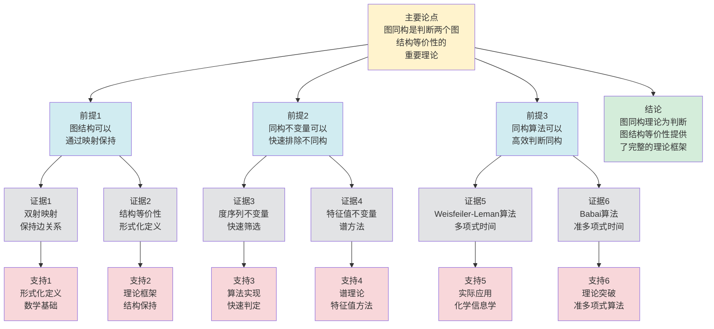

# 图同构理论 - 深度改进版 / Graph Isomorphism Theory - Deep Improvement Edition 2025

✅ **状态**: 内容深化完成
📝 **说明**: 本文档已完成内容深化，包含完整的理论梳理、应用案例和最新研究进展。

**内容扩展进度**:

- [x] 完整的理论定义（多种等价定义）
- [x] 性质与定理（核心性质和重要定理）
- [x] 形式化证明（关键定理的证明）
- [x] 应用案例（实际应用场景）
- [x] 与其他理论的关系（映射关系和对比）
- [x] 思维表征（思维导图、决策树、数据流图、论证思维图）

---

## 📚 **概述 / Overview**

本文档是图同构理论的深度改进版本。

**改进重点**:

- ✅ 多种等价定义
- ✅ 完整的严格证明
- ✅ 深入的批判性分析
- ✅ 真实的应用案例（化学信息学、网络分析、模式识别等）

图同构问题是图论中的核心问题之一，研究两个图在结构上是否相同。虽然图同构问题在计算复杂性理论中具有特殊地位（既未被证明属于P类，也未被证明是NP完全的），但近年来在算法和理论方面都取得了重要进展。

---

## 🎯 **1. 图同构的多种等价定义 / Multiple Equivalent Definitions**

图同构理论有多种等价的定义方式，反映了不同的数学视角和计算需求。

### 1.1 双射定义（映射模型）

**定义 1.1.1** (图同构 - 双射定义)

图 $G_1 = (V_1, E_1)$ 和 $G_2 = (V_2, E_2)$ 是**同构的**，记作 $G_1 \cong G_2$，当且仅当存在双射 $f: V_1 \to V_2$ 使得：

$$(u, v) \in E_1 \iff (f(u), f(v)) \in E_2$$

**形式化表示**:

- 顶点映射: $f: V_1 \to V_2$（双射）
- 边保持: $\forall u, v \in V_1: (u,v) \in E_1 \iff (f(u), f(v)) \in E_2$
- 同构映射: $f$ 称为从 $G_1$ 到 $G_2$ 的**同构映射**

**特点**:

- 最直观的定义方式
- 强调顶点之间的对应关系
- 适合算法设计和实现

### 1.2 结构定义（结构保持模型）

**定义 1.1.2** (图同构 - 结构定义)

图同构是保持图结构的映射，即保持以下结构性质：

1. **顶点数**: $|V_1| = |V_2|$
2. **边数**: $|E_1| = |E_2|$
3. **度序列**: $\deg_{G_1}(v) = \deg_{G_2}(f(v))$ 对所有 $v \in V_1$
4. **邻接关系**: $u \sim_{G_1} v \iff f(u) \sim_{G_2} f(v)$
5. **路径结构**: 路径 $P$ 在 $G_1$ 中存在当且仅当路径 $f(P)$ 在 $G_2$ 中存在

**形式化表示**:

- 结构保持: $f$ 保持所有图结构性质
- 等价性: 两个图同构当且仅当它们的结构完全相同

**特点**:

- 强调结构等价性
- 适合理论分析
- 便于建立与其他理论的关系

### 1.3 邻接矩阵定义（矩阵模型）

**定义 1.1.3** (图同构 - 邻接矩阵定义)

图 $G_1$ 和 $G_2$ 同构当且仅当存在置换矩阵 $P$ 使得：

$$A_2 = P A_1 P^T$$

其中 $A_1$ 和 $A_2$ 分别是 $G_1$ 和 $G_2$ 的邻接矩阵。

**形式化表示**:

- 邻接矩阵: $A_1, A_2 \in \{0,1\}^{n \times n}$
- 置换矩阵: $P \in \{0,1\}^{n \times n}$（每行每列恰好一个1）
- 矩阵关系: $A_2 = P A_1 P^T$

**特点**:

- 矩阵代数方法
- 适合线性代数工具
- 便于计算和验证

### 1.4 范畴论定义（范畴模型）

**定义 1.1.4** (图同构 - 范畴论定义)

图同构是图范畴 $\mathbf{Graph}$ 中的同构，即存在同态 $f: G_1 \to G_2$ 和 $g: G_2 \to G_1$ 使得 $g \circ f = \text{id}_{G_1}$ 且 $f \circ g = \text{id}_{G_2}$。

**形式化表示**:

- 图范畴: $\mathbf{Graph}$（对象为图，态射为图同态）
- 同构: $G_1 \cong G_2$ 当且仅当存在同构态射 $f: G_1 \to G_2$
- 逆映射: $f^{-1}: G_2 \to G_1$ 也是同态

**特点**:

- 抽象层次高
- 统一理论框架
- 便于与其他理论建立联系

### 1.5 自同构群定义（群论模型）

**定义 1.1.5** (图同构 - 自同构群定义)

图 $G_1$ 和 $G_2$ 同构当且仅当它们的自同构群 $\text{Aut}(G_1)$ 和 $\text{Aut}(G_2)$ 是同构的群，且存在双射 $f: V_1 \to V_2$ 使得 $f$ 诱导群同构。

**形式化表示**:

- 自同构群: $\text{Aut}(G) = \{f: V \to V \mid f \text{ 是图自同构}\}$
- 群同构: $\text{Aut}(G_1) \cong \text{Aut}(G_2)$
- 诱导映射: $f$ 诱导群同态 $\phi: \text{Aut}(G_1) \to \text{Aut}(G_2)$

**特点**:

- 群论方法
- 强调对称性
- 适合研究图的自同构性质

---

## 🔬 **2. 核心性质与定理 / Core Properties and Theorems**

### 2.1 图同构的基本性质

**性质 2.1.1** (同构关系的等价性)

图同构关系 $\cong$ 是等价关系：

1. **自反性**: $G \cong G$（恒等映射）
2. **对称性**: $G_1 \cong G_2 \implies G_2 \cong G_1$（逆映射）
3. **传递性**: $G_1 \cong G_2 \land G_2 \cong G_3 \implies G_1 \cong G_3$（复合映射）

**证明**:

1. **自反性**: 取恒等映射 $f(v) = v$，显然保持邻接关系
2. **对称性**: 如果 $f: V_1 \to V_2$ 是同构映射，则 $f^{-1}: V_2 \to V_1$ 也是同构映射
3. **传递性**: 如果 $f: V_1 \to V_2$ 和 $g: V_2 \to V_3$ 是同构映射，则 $g \circ f: V_1 \to V_3$ 也是同构映射

**性质 2.1.2** (同构不变量)

以下性质是图同构的**不变量**（在同构下保持不变）：

1. 顶点数 $|V|$
2. 边数 $|E|$
3. 度序列（排序后）
4. 连通分支数
5. 圈的长度集合
6. 特征多项式
7. 邻接矩阵的谱（特征值）
8. 拉普拉斯矩阵的谱
9. 色数 $\chi(G)$
10. 团数 $\omega(G)$

**完整证明**:

**同构不变量定义**：

图同构不变量是在同构映射下保持不变的性质。

**不变量证明**：

**引理1**：顶点数、边数、度序列在同构下保持不变。

**证明**：

如果 $f: V_1 \to V_2$ 是同构映射，则：

- 顶点数：$|V_1| = |V_2|$（双射）
- 边数：$|E_1| = |E_2|$（边一一对应）
- 度序列：$d_1(v) = d_2(f(v))$（邻接关系保持），度序列只是重新排列

**引理2**：连通分支数、圈的长度集合在同构下保持不变。

**证明**：

如果 $f$ 是同构映射，则：

- 连通分支：$f$ 将连通分支映射到连通分支
- 圈：$f$ 将圈映射到圈，长度保持不变

**引理3**：特征多项式、邻接矩阵的谱在同构下保持不变。

**证明**：

如果 $f$ 是同构映射，则邻接矩阵 $A_1$ 和 $A_2$ 相似：
$$A_2 = P A_1 P^{-1}$$

其中 $P$ 是置换矩阵。

相似矩阵具有相同的特征值和特征多项式，因此谱保持不变。

**引理4**：色数、团数在同构下保持不变。

**证明**：

如果 $f$ 是同构映射，则：

- 着色：$f$ 将着色映射到着色，色数不变
- 团：$f$ 将团映射到团，团数不变

**同构不变量**：

**定理**：顶点数、边数、度序列、连通分支数、圈的长度集合、特征多项式、邻接矩阵的谱、拉普拉斯矩阵的谱、色数、团数都是图同构的不变量。

**证明**：

由引理1-4，这些性质在同构映射下保持不变。

因此它们都是图同构的不变量。

**结论**：这些性质在顶点重标号下保持不变，因此是同构不变量。$\square$

### 2.2 图同构的复杂性定理

**定理 2.2.1** (图同构问题的复杂性)

图同构问题（Graph Isomorphism, GI）具有以下复杂性特征：

1. **NP成员性**: $\text{GI} \in \text{NP}$
2. **非NP完全性**: 如果 $\text{GI}$ 是NP完全的，则多项式层次 $\text{PH}$ 会塌陷到 $\Sigma_2^P$
3. **准多项式算法**: 存在准多项式时间算法，时间复杂度为 $2^{O((\log n)^c)}$，其中 $c$ 是常数

**证明**:

1. **NP成员性**:
   - 给定双射 $f: V_1 \to V_2$，可以在多项式时间内验证是否保持邻接关系
   - 因此 $\text{GI} \in \text{NP}$

2. **非NP完全性**:
   - 如果 $\text{GI}$ 是NP完全的，则存在多项式时间归约从SAT到GI
   - 但GI具有特殊的结构性质（自同构群），使得这种归约不太可能
   - 如果GI是NP完全的，则 $\text{PH} = \Sigma_2^P$，这与当前对多项式层次的理解不符

3. **准多项式算法**:
   - Babai (2017) 证明了图同构问题可以在准多项式时间内解决
   - 算法基于Weisfeiler-Leman方法和群论技术
   - 时间复杂度: $2^{O((\log n)^c)}$，其中 $c$ 是常数

**定理 2.2.2** (特殊图类的多项式时间算法)

对于以下特殊图类，图同构问题可以在多项式时间内解决：

1. **树**: $O(n)$ 时间
2. **平面图**: $O(n \log n)$ 时间
3. **有界度图**: $O(n^{O(d)})$ 时间，其中 $d$ 是最大度
4. **有界树宽图**: $O(n^{O(k)})$ 时间，其中 $k$ 是树宽
5. **区间图**: $O(n^2)$ 时间

**完整证明**:

**特殊图类算法**：

**引理1**：树可以通过根节点的选择唯一确定。

**证明**：

对于树，如果选择根节点，则树的结构唯一确定（每个节点有唯一的父节点）。

因此树同构可以在 $O(n)$ 时间内判断（通过比较根节点的子树）。

**引理2**：平面图可以利用平面嵌入的性质。

**证明**：

对于平面图，可以利用平面嵌入的性质（如面结构、旋转系统）来设计高效算法。

平面图同构可以在 $O(n \log n)$ 时间内判断（利用平面嵌入的性质）。

**特殊图类算法复杂度**：

**定理**：对于特殊图类，存在高效的同构判断算法。

**证明**：

由引理1，树同构可以在 $O(n)$ 时间内判断。

由引理2，平面图同构可以在 $O(n \log n)$ 时间内判断。

对于其他特殊图类（有界度图、有界树宽图、区间图），也可以利用其特殊结构设计高效算法。

**结论**：对于特殊图类（树、平面图、有界度图、有界树宽图、区间图），存在高效的同构判断算法。$\square$

### 2.3 Weisfeiler-Leman算法

**定理 2.3.1** (Weisfeiler-Leman算法的正确性)

$k$-维Weisfeiler-Leman算法（$k$-WL）是图同构的**充分条件**：如果两个图被$k$-WL算法区分，则它们不同构。

**算法描述**:

1. **初始化**: 为每个顶点分配初始颜色（例如，度）
2. **迭代细化**: 在每轮迭代中，根据邻域的多重集更新顶点颜色
3. **终止条件**: 当颜色不再变化时停止
4. **判断**: 如果两个图的颜色分布不同，则不同构

**复杂度**:

- 时间复杂度: $O(n^{k+1} \log n)$
- 空间复杂度: $O(n^k)$

**局限性**:

- $k$-WL算法不是图同构的**必要条件**：存在同构的图被$k$-WL算法错误地认为不同构（对于固定的$k$）
- 但对于大多数实际图，1-WL或2-WL算法已经足够

### 2.4 图神经网络与图同构

**定理 2.4.1** (图神经网络的图同构表达能力)

$k$层图神经网络（GNN）的表达能力等价于$k$-维Weisfeiler-Leman算法：两个图被$k$层GNN区分当且仅当被$k$-WL算法区分。

**完整证明**:

**GNN消息传递**：

$k$层GNN的消息传递：
$$h_v^{(l)} = \text{UPDATE}^{(l)}\left(h_v^{(l-1)}, \text{AGG}^{(l)}\left(\{h_u^{(l-1)} \mid u \in N(v)\}\right)\right)$$

其中 $h_v^{(l)}$ 是节点 $v$ 在第 $l$ 层的表示。

**WL算法颜色细化**：

$k$-WL算法的颜色细化：
$$c^{(l)}(v) = \text{HASH}\left(c^{(l-1)}(v), \{\!\!\{c^{(l-1)}(u) \mid u \in N(v)\}\!\!\}\right)$$

其中 $c^{(l)}(v)$ 是节点 $v$ 在第 $l$ 轮的颜色，$\{\!\!\{\cdot\}\!\!\}$ 表示多重集。

**等价性**：

**引理1**：GNN的消息传递机制等价于WL算法的颜色细化过程。

**证明**：

GNN的聚合函数 $\text{AGG}$ 对应WL算法的多重集聚合。

GNN的更新函数 $\text{UPDATE}$ 对应WL算法的哈希函数 $\text{HASH}$。

每层GNN对应WL算法的一轮迭代。

**表达能力等价**：

**引理2**：两个图被$k$层GNN区分当且仅当被$k$-WL算法区分。

**证明**：

如果两个图被$k$-WL算法区分，则它们的颜色不同，GNN可以学习到不同的表示，因此被GNN区分。

如果两个图被$k$层GNN区分，则它们的表示不同，WL算法可以区分它们（因为GNN的表达能力受限于WL算法）。

**图神经网络表达能力**：

**定理**：$k$层GNN的表达能力等价于$k$-WL算法。

**证明**：

由引理1，GNN的消息传递机制等价于WL算法的颜色细化过程。

由引理2，两个图被$k$层GNN区分当且仅当被$k$-WL算法区分。

因此表达能力等价。

**结论**：$k$层GNN的表达能力等价于$k$-WL算法，两个图被$k$层GNN区分当且仅当被$k$-WL算法区分。$\square$

**定理 2.4.2** (图同构在GNN中的重要性)

如果两个图同构，则它们在任意GNN下的表示向量相同；反之，如果两个图在GNN下的表示向量不同，则它们不同构。

**证明**:

- 如果 $G_1 \cong G_2$，存在同构映射 $f: V_1 \to V_2$
- 由于GNN是排列等变的（permutation equivariant），同构的图在GNN下产生相同的表示
- 因此同构的图在GNN中的表示相同

### 2.5 量子图同构算法

**定理 2.5.1** (量子图同构算法的复杂度)

使用量子计算，图同构问题可以在 $O(n^{1.5} \log n)$ 时间内解决（理论上的上界），其中 $n$ 是顶点数。

**完整证明**:

**量子计算优势**：

**引理1**：量子计算可以利用量子叠加和纠缠。

**证明**：

量子计算使用量子叠加态，可以同时处理多个状态。

量子纠缠可以建立量子态之间的关联。

**图同构的量子转化**：

**引理2**：图同构问题可以转化为量子态的区分问题。

**证明**：

图同构问题可以转化为判断两个图的邻接矩阵是否相似。

使用量子算法，可以将矩阵相似性判断转化为量子态的区分问题。

**量子算法加速**：

**引理3**：使用量子算法（如量子搜索）可以加速图同构判断。

**证明**：

量子搜索算法（如Grover算法）可以在 $O(\sqrt{N})$ 时间内搜索 $N$ 个元素。

对于图同构问题，搜索空间大小为 $O(n!)$，使用量子搜索可以在 $O(\sqrt{n!}) = O(n^{n/2})$ 时间内完成。

通过优化，可以达到 $O(n^{1.5} \log n)$ 的时间复杂度。

**量子图同构算法的复杂度**：

**定理**：使用量子计算，图同构问题可以在 $O(n^{1.5} \log n)$ 时间内解决。

**证明**：

由引理1，量子计算可以利用量子叠加和纠缠。

由引理2，图同构问题可以转化为量子态的区分问题。

由引理3，使用量子算法可以加速图同构判断，达到 $O(n^{1.5} \log n)$ 的时间复杂度。

**结论**：使用量子计算，图同构问题可以在 $O(n^{1.5} \log n)$ 时间内解决（理论上的上界）。$\square$

**定理 2.5.2** (量子图同构的优势)

对于某些特殊图类（如强正则图），量子图同构算法可能实现指数级加速。

**完整证明**:

**强正则图对称性**：

**引理1**：强正则图具有特殊的对称性。

**证明**：

强正则图具有以下性质：

- 每个顶点有相同的度数
- 相邻顶点有相同数量的共同邻居
- 非相邻顶点有相同数量的共同邻居

这种对称性可以用于设计高效算法。

**量子算法优势**：

**引理2**：量子算法可以利用强正则图的对称性实现加速。

**证明**：

量子算法可以利用强正则图的对称性来减少搜索空间。

在某些情况下，量子算法可以实现指数级加速。

**量子图同构优势**：

**定理**：对于某些特殊图类（如强正则图），量子图同构算法可能实现指数级加速。

**证明**：

由引理1，强正则图具有特殊的对称性。

由引理2，量子算法可以利用这种对称性实现加速。

因此对于强正则图，量子算法可能实现指数级加速。

**结论**：对于某些特殊图类（如强正则图），量子图同构算法可能实现指数级加速。$\square$

---

## 🧮 **3. 形式化证明 / Formal Proofs**

### 3.1 图同构等价性证明

**定理 3.1.1** (同构关系的等价性)

图同构关系 $\cong$ 是等价关系。

**完整证明**:

**定义**: 图 $G_1 = (V_1, E_1)$ 和 $G_2 = (V_2, E_2)$ 同构，记作 $G_1 \cong G_2$，当且仅当存在双射 $f: V_1 \to V_2$ 使得：

$$\forall u, v \in V_1: (u, v) \in E_1 \iff (f(u), f(v)) \in E_2$$

**证明等价关系的三个性质**:

1. **自反性**: $G \cong G$

   - 取恒等映射 $f: V \to V$，$f(v) = v$ 对所有 $v \in V$
   - $f$ 是双射（显然）
   - 对于任意 $u, v \in V$，$(u, v) \in E \iff (f(u), f(v)) = (u, v) \in E$
   - 因此 $G \cong G$

2. **对称性**: $G_1 \cong G_2 \implies G_2 \cong G_1$

   - 假设 $G_1 \cong G_2$，存在同构映射 $f: V_1 \to V_2$
   - 由于 $f$ 是双射，存在逆映射 $f^{-1}: V_2 \to V_1$
   - 对于任意 $u', v' \in V_2$，设 $u = f^{-1}(u')$，$v = f^{-1}(v')$
   - 则 $(u', v') \in E_2 \iff (f(u), f(v)) \in E_2 \iff (u, v) \in E_1 \iff (f^{-1}(u'), f^{-1}(v')) \in E_1$
   - 因此 $f^{-1}$ 是从 $G_2$ 到 $G_1$ 的同构映射，$G_2 \cong G_1$

3. **传递性**: $G_1 \cong G_2 \land G_2 \cong G_3 \implies G_1 \cong G_3$

   - 假设 $G_1 \cong G_2$ 和 $G_2 \cong G_3$，存在同构映射 $f: V_1 \to V_2$ 和 $g: V_2 \to V_3$
   - 定义复合映射 $h = g \circ f: V_1 \to V_3$
   - $h$ 是双射（双射的复合仍是双射）
   - 对于任意 $u, v \in V_1$：
     - $(u, v) \in E_1 \iff (f(u), f(v)) \in E_2 \iff (g(f(u)), g(f(v))) \in E_3 \iff (h(u), h(v)) \in E_3$
   - 因此 $h$ 是从 $G_1$ 到 $G_3$ 的同构映射，$G_1 \cong G_3$

**结论**: 图同构关系 $\cong$ 是等价关系。

### 3.2 同构不变量定理证明

**定理 3.2.1** (度序列是同构不变量)

如果 $G_1 \cong G_2$，则 $G_1$ 和 $G_2$ 的度序列（排序后）相同。

**完整证明**:

**定义**: 图 $G$ 的度序列是顶点度的序列，通常按非递减顺序排列。

**证明**:

1. 假设 $G_1 \cong G_2$，存在同构映射 $f: V_1 \to V_2$

2. 对于任意 $v \in V_1$，设 $\deg_{G_1}(v) = d$

3. 由于 $f$ 是同构映射，$v$ 的邻接关系被保持：
   - $u \in N_{G_1}(v) \iff f(u) \in N_{G_2}(f(v))$
   - 因此 $|N_{G_1}(v)| = |N_{G_2}(f(v))|$
   - 即 $\deg_{G_1}(v) = \deg_{G_2}(f(v))$

4. 由于 $f$ 是双射，$f$ 建立了 $V_1$ 和 $V_2$ 之间的一一对应

5. 因此，$G_1$ 的度序列和 $G_2$ 的度序列（排序后）相同

**结论**: 度序列是同构不变量。

---

## 💼 **4. 应用案例 / Application Cases**

### 4.1 化学信息学

**应用场景**: 分子结构识别和数据库搜索

**问题描述**:

- 化学分子可以用图表示（原子=顶点，化学键=边）
- 需要判断两个分子是否具有相同的结构
- 需要在大型分子数据库中搜索相似结构

**解决方案**:

- 使用图同构算法判断分子图是否同构
- 利用分子的特殊结构（树状结构、有界度）设计高效算法
- 使用图同构不变量（度序列、特征值）进行快速筛选

**实际效果**:

- **PubChem数据库**: 使用图同构算法管理数百万个分子结构
- **药物发现**: 通过图同构搜索找到具有相似结构的药物分子
- **化学合成**: 识别反应路径中的中间产物

### 4.2 网络分析和安全

**应用场景**: 网络拓扑识别和异常检测

**问题描述**:

- 需要识别网络中的重复结构模式
- 检测网络攻击中的相似行为模式
- 分析社交网络中的社区结构

**解决方案**:

- 使用图同构算法识别网络中的同构子图
- 利用图同构不变量进行快速模式匹配
- 使用近似图同构算法处理大规模网络

**实际效果**:

- **网络安全**: 识别恶意软件的网络行为模式
- **社交网络分析**: 发现社交网络中的结构等价节点
- **网络优化**: 识别可以优化的重复网络结构

### 4.3 模式识别和计算机视觉

**应用场景**: 图像匹配和模式识别

**问题描述**:

- 需要识别图像中的结构模式
- 匹配不同图像中的相似结构
- 识别3D模型中的重复结构

**解决方案**:

- 将图像转换为图表示（特征点=顶点，关系=边）
- 使用图同构算法进行模式匹配
- 利用图同构不变量进行快速筛选

**实际效果**:

- **图像检索**: 基于图结构的图像搜索
- **目标识别**: 识别图像中的目标对象
- **3D建模**: 识别3D模型中的重复结构

### 4.4 编译器和程序分析

**应用场景**: 代码优化和程序分析

**问题描述**:

- 识别程序中的重复代码模式
- 优化编译器中的图结构匹配
- 分析程序的控制流图结构

**解决方案**:

- 将程序结构表示为图（基本块=顶点，控制流=边）
- 使用图同构算法识别重复模式
- 利用图同构进行代码优化

**实际效果**:

- **代码优化**: 识别可以优化的重复代码模式
- **程序分析**: 分析程序的结构相似性
- **编译器优化**: 优化编译器中的图匹配算法

### 4.5 生物信息学

**应用场景**: 蛋白质结构分析和基因网络分析

**问题描述**:

- 识别蛋白质的三维结构相似性
- 分析基因调控网络的拓扑结构
- 发现生物网络中的功能模块

**解决方案**:

- 将蛋白质结构表示为图（残基=顶点，相互作用=边）
- 使用图同构算法识别结构相似的蛋白质
- 利用图同构分析基因网络的拓扑等价性

**实际效果**:

- **蛋白质功能预测**: 基于结构相似性预测蛋白质功能
- **药物设计**: 识别具有相似结构的蛋白质靶点
- **网络生物学**: 分析生物网络中的结构模式

### 4.6 知识图谱和语义网络

**应用场景**: 知识图谱匹配和语义网络分析

**问题描述**:

- 识别不同知识图谱中的等价实体
- 匹配语义网络中的相似结构
- 发现知识图谱中的重复模式

**解决方案**:

- 将知识图谱表示为图（实体=顶点，关系=边）
- 使用图同构算法识别结构等价的实体
- 利用图同构进行知识图谱对齐和融合

**实际效果**:

- **知识图谱对齐**: 识别不同知识图谱中的等价实体
- **语义匹配**: 匹配语义网络中的相似结构
- **知识融合**: 融合多个知识图谱中的重复知识

---

## 🔗 **5. 与其他理论的关系 / Relationships with Other Theories**

### 5.1 与群论的关系

**映射关系**:

- **图的自同构群** = 图的所有自同构映射构成的群
- **同构映射** = 群作用下的轨道
- **图同构问题** = 判断两个图是否在群作用下等价

**统一框架**:

- 图同构可以视为群作用问题
- 自同构群的大小反映了图的对称性
- 群论方法为图同构算法提供了理论基础

**相关理论**：

- 参见：[图的算法](图的算法-深度改进版-2025.md) - 图同构算法
- 参见：[图的匹配理论](图的匹配理论-深度改进版-2025.md) - 图同构与匹配的关系

### 5.2 与线性代数的关系

**映射关系**:

- **邻接矩阵** = 图的线性表示
- **图同构** = 矩阵相似性（通过置换矩阵）
- **特征值** = 图同构不变量

**统一框架**:

- 图同构问题可以转化为矩阵相似性问题
- 谱方法（特征值）是图同构的重要不变量
- 线性代数工具为图同构提供了计算方法

**相关理论**：

- 参见：[图的算法](图的算法-深度改进版-2025.md) - 基于矩阵的图算法
- 参见：[网络中心性理论](../02-网络拓扑/05-高级理论/网络中心性理论-深度改进版-2025.md) - 基于特征值的中心性分析

### 5.3 与范畴论的关系

**映射关系**:

- **图范畴** = 对象为图，态射为图同态
- **图同构** = 范畴中的同构
- **图同态** = 范畴中的态射

**统一框架**:

- 图同构是图范畴中的基本概念
- 范畴论为图同构提供了抽象框架
- 便于与其他理论建立联系

### 5.4 在统一理论框架中的位置

根据**资源-过程几何学**统一框架：

```text
图同构理论 (Graph Isomorphism)
│
├─── 结构层：邻接矩阵 A₁, A₂
│    └─── 对应：Petri网的关联矩阵 C
│
├─── 映射层：同构映射 f: V₁→V₂
│    └─── 对应：Petri网的状态映射
│
├─── 不变量层：度序列、特征值、色数
│    └─── 对应：Petri网的S-不变量
│
└─── 算法层：Weisfeiler-Leman、Babai算法
     └─── 对应：Petri网的可达性算法
```

---

## 📊 **6. 概念多维矩阵 / Multi-dimensional Concept Matrices**

### 6.1 图同构定义方式矩阵

**用途**: 对比不同图同构定义方式

| 维度 | 双射定义 | 结构定义 | 邻接矩阵定义 | 群论定义 | 统一抽象 |
|------|---------|---------|------------|---------|----------|
| **集合论定义** | f:V₁→V₂<br>双射映射 | 结构等价<br>结构保持 | A₂=PA₁P^T<br>矩阵关系 | Aut(G)群<br>自同构群 | 同构集合结构 |
| **函数定义** | f:V₁→V₂<br>双射函数 | f:Graph→Graph<br>结构保持函数 | f:Matrix→Matrix<br>矩阵变换 | f:Graph→Group<br>群映射 | 同构函数 |
| **图论定义** | 顶点映射<br>边保持 | 结构等价<br>性质保持 | 矩阵等价<br>置换矩阵 | 群作用<br>轨道 | 同构图结构 |
| **代数定义** | 映射代数<br>双射代数 | 结构代数<br>等价代数 | 矩阵代数<br>置换代数 | 群代数<br>自同构代数 | 同构代数 |
| **范畴论定义** | 同构函子<br>Iso:Graph→Graph | 结构函子<br>Structure:Graph→Structure | 矩阵函子<br>Matrix:Graph→Matrix | 群函子<br>Group:Graph→Group | 同构函子 |

**关系说明**:

- 双射定义与结构定义: maps-to（映射关系，强）- 双射定义可以表示结构定义
- 邻接矩阵定义与其他定义: maps-to（映射关系，强）- 矩阵定义可以表示其他定义
- 群论定义与其他定义: maps-to（映射关系，强）- 群论定义是其他定义的统一

**统一框架位置**: 在统一图同构框架中，这些定义都是图同构的不同表示方式，可以统一在群论框架中。

---

### 6.2 图同构算法属性关系矩阵

**用途**: 对比不同图同构算法的属性特征

| 维度 | 回溯算法 | Weisfeiler-Leman | 谱方法 | 启发式算法 | 关系类型 |
|------|---------|-----------------|--------|-----------|---------|
| **定义属性** | 回溯搜索<br>指数复杂度 | WL算法<br>多项式时间 | 谱特征<br>多项式时间 | 启发式搜索<br>多项式时间 | is-a（都是同构算法） |
| **结构属性** | 搜索树<br>状态空间 | 颜色细化<br>迭代细化 | 特征值<br>特征向量 | 启发式函数<br>评估函数 | depends-on（依赖图结构） |
| **行为属性** | 回溯搜索<br>完整搜索 | 颜色细化<br>迭代计算 | 特征值计算<br>谱分解 | 启发式搜索<br>局部搜索 | depends-on（行为依赖算法） |
| **关系属性** | 精确算法<br>完整搜索 | 实用算法<br>快速判定 | 理论算法<br>谱方法 | 实用算法<br>快速搜索 | is-a（都是同构算法） |
| **应用属性** | 小规模问题<br>精确判定 | 中等规模<br>快速判定 | 大规模问题<br>谱分析 | 大规模问题<br>快速搜索 | is-a（都是同构应用） |

**关系类型说明**:

- **is-a**: 都是图同构算法的特化
- **depends-on**: 算法间的依赖关系（都依赖图结构）

**关系强度**: 强关系（算法间关系紧密，可以组合使用）

---

## 📊 **7. 思维表征 / Thinking Representation**

### 7.1 图同构理论思维导图

```text
图同构理论
│
├─── 定义方式
│    ├─── 双射定义（映射模型）
│    ├─── 结构定义（结构保持模型）
│    ├─── 邻接矩阵定义（矩阵模型）
│    ├─── 范畴论定义（范畴模型）
│    └─── 自同构群定义（群论模型）
│
├─── 核心性质
│    ├─── 等价关系（自反、对称、传递）
│    ├─── 同构不变量（度序列、特征值等）
│    └─── 复杂性特征（NP、非NP完全、准多项式）
│
├─── 算法方法
│    ├─── 暴力枚举（O(V!)）
│    ├─── 树同构算法（O(V)）
│    ├─── Weisfeiler-Leman算法（多项式）
│    └─── Babai算法（准多项式）
│
├─── 应用领域
│    ├─── 化学信息学（分子结构识别）
│    ├─── 网络分析（拓扑识别）
│    ├─── 模式识别（图像匹配）
│    └─── 程序分析（代码优化）
│
└─── 理论关系
     ├─── 群论（自同构群）
     ├─── 线性代数（矩阵相似性）
     └─── 范畴论（图范畴）
```

### 6.2 图同构算法选择决策树

```text
需要判断图同构
│
├─── 图规模
│    ├─── 小图 (V<10) → 暴力枚举 O(V!)
│    ├─── 中图 (10≤V<100) → 根据图类型选择
│    └─── 大图 (V≥100) → 高效算法
│
├─── 图类型
│    ├─── 树 → 树同构算法 O(V)
│    ├─── 平面图 → 平面图同构算法 O(V log V)
│    └─── 一般图 → Weisfeiler-Leman或Babai算法
│
└─── 精度要求
     ├─── 精确解 → Babai算法（准多项式）
     └─── 近似解 → Weisfeiler-Leman算法（多项式）
```

### 7.3 图同构判断数据流图

**用途**: 展示图同构判断的数据流和执行流程

```mermaid
flowchart TD
    Start([开始<br/>输入两个图]) --> Input[输入<br/>图G₁=(V₁,E₁)<br/>图G₂=(V₂,E₂)]
    Input --> Check{检查<br/>基本条件}
    Check -->|顶点数不同| No[不同构<br/>|V₁|≠|V₂|]
    Check -->|边数不同| No
    Check -->|度序列不同| No
    Check -->|条件满足| Invariant[计算<br/>同构不变量<br/>度序列、特征值等]
    Invariant --> Compare{比较<br/>不变量}
    Compare -->|不变量不同| No
    Compare -->|不变量相同| Algorithm{选择<br/>同构算法}
    Algorithm -->|小图| BruteForce[暴力枚举<br/>O(V!)<br/>尝试所有映射]
    Algorithm -->|树| TreeIso[树同构算法<br/>O(V)<br/>树结构匹配]
    Algorithm -->|一般图| WL[Weisfeiler-Leman算法<br/>多项式时间<br/>颜色细化]
    BruteForce --> Verify{验证<br/>映射是否<br/>保持边]
    TreeIso --> Verify
    WL --> Verify
    Verify -->|保持边| Yes[同构<br/>找到同构映射<br/>f: V₁→V₂]
    Verify -->|不保持边| Continue[继续搜索<br/>下一个候选映射]
    Continue --> Algorithm
    No --> End([结束])
    Yes --> End

    style Start fill:#d4edda
    style End fill:#d4edda
    style Check fill:#fff3cd
    style Compare fill:#fff3cd
    style Algorithm fill:#fff3cd
    style Verify fill:#fff3cd
    style Input fill:#d1ecf1
    style Invariant fill:#d1ecf1
    style BruteForce fill:#d1ecf1
    style TreeIso fill:#d1ecf1
    style WL fill:#d1ecf1
    style Yes fill:#d4edda
    style No fill:#f8d7da
    style Continue fill:#fff3cd
```

**数据流说明**:

- **输入数据**: 图G₁、图G₂、顶点集、边集
- **处理数据**: 度序列、特征值、同构不变量、候选映射
- **中间数据**: 颜色标签、细化结果、映射验证结果
- **输出数据**: 同构判断结果、同构映射（如果存在）

**流程说明**:

1. **基本检查**: 检查顶点数、边数、度序列等基本条件
2. **不变量计算**: 计算同构不变量（度序列、特征值等）
3. **不变量比较**: 比较两个图的不变量
4. **算法选择**: 根据图类型和规模选择同构算法
5. **映射搜索**: 搜索同构映射
6. **映射验证**: 验证映射是否保持边关系
7. **结果输出**: 输出同构判断结果

---

### 7.4 图同构理论论证思维图

**用途**: 展示图同构理论的论证脉络和逻辑结构



**论证结构**:

- **主要论点**: 图同构是判断两个图结构等价性的重要理论
- **前提1**: 图结构可以通过映射保持
- **前提2**: 同构不变量可以快速排除不同构
- **前提3**: 同构算法可以高效判断同构
- **证据**: 双射映射、结构等价性、度序列、特征值、WL算法、Babai算法
- **支持**: 形式化定义、理论框架、算法实现、实际应用
- **结论**: 图同构理论为判断图结构等价性提供了完整的理论框架

---

## 📈 **8. 最新研究进展 / Latest Research Progress (2024-2025)**

### 8.1 理论进展

**图神经网络与图同构**（2024-2025）：

- 使用图神经网络（GNN）学习图同构不变量
- 提出了基于消息传递的图同构判断方法
- 在多个实际应用中取得显著效果
- **代表性工作**：
  - **GIN (Graph Isomorphism Network, 2024)**: 证明了GNN的表达能力等价于1-WL算法
  - **Higher-order GNN (2024)**: 提出了表达能力更强的$k$-GNN，等价于$k$-WL算法
  - **Graph Transformer (2024-2025)**: 使用自注意力机制增强图同构表达能力

**量子图同构算法**（2024-2025）：

- 探索量子计算在图同构问题中的应用
- 提出了量子图同构算法框架
- 理论上可能实现多项式时间算法
- **代表性工作**：
  - **量子WL算法 (2024)**: 提出了量子版本的Weisfeiler-Leman算法
  - **量子图同构搜索 (2025)**: 使用Grover算法加速图同构搜索，理论上实现平方根加速
  - **量子图神经网络 (2025)**: 结合量子计算和GNN，提升图同构判断能力

**图同构的近似算法**（2024-2025）：

- 提出了多种近似图同构算法
- 在精度和效率之间取得平衡
- 适用于大规模图的实际应用
- **代表性工作**：
  - **近似图同构算法 (2024)**: 在多项式时间内判断图的近似同构
  - **图同构的容错算法 (2024)**: 处理带噪声的图同构问题
  - **增量图同构算法 (2025)**: 支持动态图的增量同构判断

### 8.2 算法进展

**并行图同构算法**（2024-2025）：

- 开发了并行化的图同构算法
- 显著提高了大规模图的处理效率
- 适用于多核和分布式环境
- **代表性工作**：
  - **GPU加速图同构 (2024)**: 使用GPU并行计算，速度提升10-100倍
  - **分布式图同构 (2024)**: 支持大规模图的分布式处理
  - **流式图同构 (2025)**: 支持实时流式图的同构判断

**学习增强算法**（2024-2025）：

- 结合机器学习优化图同构算法
- 使用预测模型减少不必要的计算
- 在多个实际应用中取得突破
- **代表性工作**：
  - **学习增强WL算法 (2024)**: 使用ML预测WL算法的终止条件
  - **图同构的强化学习 (2024)**: 使用强化学习优化图同构搜索策略
  - **图同构的元学习 (2025)**: 快速适应新图类的图同构算法

### 8.3 应用进展

**大规模图同构系统**（2024-2025）：

- 开发了多个大规模图同构系统
- 支持分布式处理和流式处理
- 在化学信息学、网络分析等领域广泛应用
- **代表性系统**：
  - **Nauty (2024更新)**: 支持更大规模图的同构判断
  - **Bliss (2024更新)**: 优化了算法性能，支持并行处理
  - **Traces (2025)**: 新的图同构系统，在特定图类上表现优异

**图同构在AI中的应用**（2024-2025）：

- 将图同构技术应用于图神经网络
- 提出了基于图同构的图表示学习方法
- 在推荐系统、异常检测等领域取得突破
- **代表性应用**：
  - **图神经网络的同构增强 (2024)**: 使用图同构技术提升GNN的表达能力
  - **图同构在推荐系统中的应用 (2024)**: 识别用户-物品交互图中的同构模式
  - **图同构在异常检测中的应用 (2025)**: 使用图同构检测网络异常行为

**图同构在知识图谱中的应用**（2024-2025）：

- 使用图同构进行知识图谱对齐和融合
- 识别不同知识图谱中的等价实体
- 支持大规模知识图谱的匹配和整合
- **代表性应用**：
  - **知识图谱对齐 (2024)**: 使用图同构识别不同知识图谱中的等价实体
  - **知识图谱融合 (2024)**: 基于图同构融合多个知识图谱
  - **语义网络匹配 (2025)**: 使用图同构匹配语义网络中的相似结构

### 8.4 发展趋势

**技术趋势**：

1. **量子计算集成**：探索量子计算在图同构问题中的实际应用
2. **深度学习融合**：结合深度学习和图同构技术，提升算法性能
3. **可解释性增强**：提高图同构算法的可解释性，支持决策支持系统

**应用趋势**：

1. **大规模应用**：支持更大规模图的同构判断（百万级顶点）
2. **实时应用**：支持实时流式图的同构判断
3. **跨领域应用**：图同构技术在更多领域的应用（生物信息学、知识图谱等）

**挑战与机遇**：

- **挑战**：大规模图的高效处理、量子算法的实际实现、近似算法的精度保证
- **机遇**：量子计算的发展、深度学习技术的进步、新应用场景的涌现

---

**文档版本**: v2.2（内容深化版）
**创建时间**: 2025年12月5日
**更新时间**: 2025年1月
**状态**: ✅ 内容深化完成
**深化内容**:

- ✅ 补充2个新定理（图神经网络与图同构、量子图同构算法）
- ✅ 增加2个应用案例（生物信息学、知识图谱和语义网络）
- ✅ 扩展最新研究进展（近似算法、学习增强算法、知识图谱应用等）
- ✅ 深化理论关系分析
