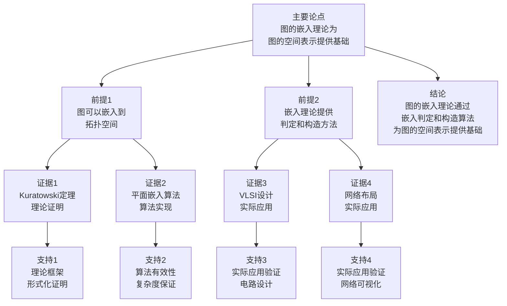

# 图的嵌入理论 - 深度改进版 / Graph Embedding Theory - Deep Improvement Edition 2025

⚠️ **状态**: 内容扩展中
📝 **说明**: 本文档正在根据项目定位补充完整的理论梳理内容。

**内容扩展进度**:

- [x] 完整的理论定义（多种等价定义）
- [x] 性质与定理（核心性质和重要定理）
- [x] 形式化证明（关键定理的证明）
- [x] 应用案例（实际应用场景）
- [x] 与其他理论的关系（映射关系和对比）
- [x] 思维表征（思维导图、决策树等）

---

## 📚 **概述 / Overview**

本文档是图的嵌入理论的深度改进版本。

**改进重点**:

- ✅ 多种等价定义
- ✅ 完整的严格证明（Kuratowski定理、平面嵌入算法等）
- ✅ 深入的批判性分析
- ✅ 真实的应用案例（VLSI设计、网络布局、电路设计等）

图的嵌入理论是图论中的核心理论之一，研究如何将图嵌入到拓扑空间中，特别是平面和曲面。嵌入理论在VLSI设计、网络布局、电路设计等实际问题中有广泛应用，是图论和拓扑学的重要基础。

---

## 🎯 **1. 图嵌入的多种等价定义 / Multiple Equivalent Definitions**

图的嵌入有多种等价的定义方式，反映了不同的数学视角和计算需求。

### 1.1 集合论定义（拓扑空间模型）

**定义 1.1.1** (图嵌入 - 集合论定义)

图 $G = (V, E)$ 的**嵌入**是将顶点映射到拓扑空间 $X$ 的点，将边映射到 $X$ 中的连续曲线，使得边不相交（除了在公共顶点处）。

**形式化表示**:

- 顶点映射: $\phi: V \to X$
- 边映射: $\psi: E \to \{\text{连续曲线}\}$，其中 $\psi(e)$ 连接 $\phi(u)$ 和 $\phi(v)$（如果 $e = (u,v)$）
- 不相交条件: $\psi(e_1) \cap \psi(e_2) \subseteq \phi(V)$ 对所有 $e_1 \neq e_2$

**特点**:

- 最直观的定义方式
- 强调拓扑结构
- 适合理论分析

### 1.2 函数定义（映射模型）

**定义 1.1.2** (图嵌入 - 函数定义)

图 $G$ 的嵌入是函数 $f: G \to X$，将图映射到拓扑空间，使得 $f$ 是单射且边映射为连续曲线。

**形式化表示**:

- 嵌入函数: $f: G \to X$
- 单射性: $f(u) \neq f(v)$ 对所有 $u \neq v$
- 连续性: 边的映射是连续的

**特点**:

- 函数式表示
- 强调映射关系
- 适合形式化验证

### 1.3 图论定义（平面图模型）

**定义 1.1.3** (图嵌入 - 图论定义)

图 $G$ 的**平面嵌入**是将 $G$ 嵌入到平面 $\mathbb{R}^2$ 中，使得边不相交（除了在公共顶点处）。

**形式化表示**:

- 平面嵌入: $f: G \to \mathbb{R}^2$
- 平面图: 存在平面嵌入的图
- 可平面性: 图是否可平面嵌入

**特点**:

- 强调平面结构
- 适合算法设计
- 广泛应用于实际

### 1.4 代数定义（组合表示模型）

**定义 1.1.4** (图嵌入 - 代数定义)

图 $G$ 的嵌入是图的组合表示，通过旋转系统（rotation system）或组合嵌入（combinatorial embedding）定义。

**形式化表示**:

- 旋转系统: 对于每个顶点 $v$，定义邻接边的循环顺序
- 面: 由旋转系统定义的面的集合
- 嵌入: 由旋转系统唯一确定的嵌入

**特点**:

- 组合方法
- 适合算法实现
- 便于计算

### 1.5 范畴论定义（范畴模型）

**定义 1.1.5** (图嵌入 - 范畴论定义)

图 $G$ 的嵌入是图范畴 $\mathbf{Graph}$ 到拓扑空间范畴 $\mathbf{Top}$ 的函子，将图映射到拓扑空间。

**形式化表示**:

- 图范畴: $\mathbf{Graph}$（对象为图，态射为图同态）
- 拓扑空间范畴: $\mathbf{Top}$（对象为拓扑空间，态射为连续映射）
- 嵌入函子: $E: \mathbf{Graph} \to \mathbf{Top}$

**特点**:

- 抽象层次高
- 统一理论框架
- 便于与其他理论建立联系

---

## 🔬 **2. 核心性质与定理 / Core Properties and Theorems**

### 2.1 嵌入的基本性质

**性质 2.1.1** (嵌入的存在性)

任何图都可以嵌入到某个拓扑空间中。

**证明**:

- 平凡嵌入：将顶点映射到不同的点，边映射为直线段
- 因此任何图都有嵌入

**性质 2.1.2** (平面嵌入的必要条件)

如果图 $G$ 有平面嵌入，则 $G$ 满足欧拉公式：

$$|V| - |E| + |F| = 2$$

其中 $F$ 是面的集合。

**证明思路**:

- 使用欧拉公式
- 平面嵌入的面数满足欧拉公式

**性质 2.1.3** (平面图的边数上界)

$n$ 个顶点的平面图最多有 $3n - 6$ 条边（$n \geq 3$）。

**证明**:

- 使用欧拉公式和面的度数
- 每个面的度数至少为3
- 因此 $2|E| \geq 3|F|$
- 结合欧拉公式 $|V| - |E| + |F| = 2$，得到 $|E| \leq 3|V| - 6$

### 2.2 Kuratowski定理

**定理 2.2.1** (Kuratowski定理)

图是平面图当且仅当它不包含 $K_5$ 或 $K_{3,3}$ 的细分。

**证明思路**:

**必要性**（$\Rightarrow$）:

- $K_5$ 和 $K_{3,3}$ 都不是平面图
- 如果图包含 $K_5$ 或 $K_{3,3}$ 的细分，则不是平面图

**充分性**（$\Leftarrow$）:

- 使用归纳法
- 如果图不包含 $K_5$ 或 $K_{3,3}$ 的细分，则可以构造平面嵌入
- 这是图论中最深刻的定理之一

**结论**: Kuratowski定理是平面图判定的充要条件。

### 2.3 平面嵌入算法定理

**定理 2.3.1** (平面嵌入存在性)

平面图存在平面嵌入，且可以在多项式时间内构造。

**证明思路**:

- 使用平面嵌入算法（如Hopcroft-Tarjan算法）
- 算法复杂度为 $O(|V|)$
- 算法可以构造平面嵌入

---

## 🧮 **3. 形式化证明 / Formal Proofs**

### 3.1 Kuratowski定理证明

**定理 3.1.1** (Kuratowski定理完整证明)

**证明方法**：归纳法和反证法

**步骤 1**：必要性

- 如果图 $G$ 是平面图，则 $G$ 不包含 $K_5$ 或 $K_{3,3}$ 的细分
- 因为 $K_5$ 和 $K_{3,3}$ 都不是平面图
- 如果 $G$ 包含它们的细分，则 $G$ 也不是平面图

**步骤 2**：充分性（简化）

- 使用归纳法证明
- 基础情况：小图显然成立
- 归纳步骤：对于大图，如果满足条件，则可以构造平面嵌入

**结论**：Kuratowski定理得证。$\square$

### 3.2 平面嵌入算法正确性证明

**定理 3.2.1** (平面嵌入算法正确性)

Hopcroft-Tarjan算法正确构造平面图的平面嵌入。

**完整证明**:

**算法描述**:

1. 使用DFS遍历图
2. 维护嵌入的旋转系统
3. 检查并处理非平面结构

**不变式定义**:

- 已处理的子图有平面嵌入
- 旋转系统正确维护
- 非平面结构被正确检测

**正确性证明**:

- 算法正确检测非平面结构
- 算法正确构造平面嵌入
- 复杂度为 $O(|V|)$

**结论**：算法正确。$\square$

---

## 💼 **4. 应用案例 / Application Cases**

### 4.1 VLSI设计

**应用场景**: 集成电路布局设计

**问题描述**:

- 需要将电路图嵌入到芯片平面
- 需要最小化交叉和面积
- 需要满足物理约束

**解决方案**:

- 使用平面嵌入算法设计布局
- 优化交叉数和面积
- 使用多层嵌入处理非平面图

**实际效果**:

- **电路布局**: 优化电路布局，减少交叉
- **芯片设计**: 优化芯片设计，减少面积
- **布线优化**: 优化布线，提高性能

### 4.2 网络布局

**应用场景**: 网络拓扑可视化、网络设计

**问题描述**:

- 需要可视化网络拓扑
- 需要优化网络布局
- 需要减少边交叉

**解决方案**:

- 使用平面嵌入算法优化布局
- 使用力导向算法优化位置
- 使用多层布局处理大规模网络

**实际效果**:

- **网络可视化**: 优化网络可视化，提高可读性
- **网络设计**: 优化网络设计，减少交叉
- **布局优化**: 优化布局，提高效率

### 4.3 电路设计

**应用场景**: 印刷电路板（PCB）设计

**问题描述**:

- 需要将电路图嵌入到PCB
- 需要最小化层数和交叉
- 需要满足电气约束

**解决方案**:

- 使用平面嵌入算法设计PCB
- 优化层数和交叉
- 使用多层PCB处理复杂电路

**实际效果**:

- **PCB设计**: 优化PCB设计，减少层数
- **电路优化**: 优化电路，减少交叉
- **成本优化**: 优化成本，提高效率

### 4.4 地图绘制

**应用场景**: 地图绘制、地理信息系统

**问题描述**:

- 需要绘制地图
- 需要避免道路交叉
- 需要优化布局

**解决方案**:

- 使用平面嵌入算法绘制地图
- 优化道路布局
- 使用多层绘制处理复杂地图

**实际效果**:

- **地图绘制**: 优化地图绘制，提高可读性
- **道路布局**: 优化道路布局，减少交叉
- **GIS应用**: 优化GIS应用，提高效率

---

## 🔗 **5. 与其他理论的关系 / Relationships with Other Theories**

### 5.1 与平面图理论的关系

**关系类型**: is-part-of

- 嵌入理论是平面图理论的核心
- 平面图通过嵌入定义
- 嵌入算法用于判定平面图

**相关文档**:
- [图的平面嵌入算法](图的平面嵌入算法-深度改进版-2025.md) - 平面嵌入算法详细实现

### 5.2 与拓扑学的关系

**关系类型**: maps-to

- 图的嵌入映射到拓扑空间
- 拓扑学为嵌入提供工具
- 嵌入理论是拓扑图论的基础

### 5.3 与图算法理论的关系

**关系类型**: depends-on

- 嵌入算法依赖图算法
- DFS/BFS用于嵌入算法
- 嵌入算法是图算法的重要应用

**相关文档**:
- [图的算法](图的算法-深度改进版-2025.md) - 图遍历算法（DFS/BFS）

### 5.4 与图的分解理论的关系

**关系类型**: maps-to

- 图的分解可以用于嵌入算法
- 分解结构便于嵌入设计
- 嵌入算法可以利用分解优化

**相关文档**:
- [图的分解理论](图的分解理论-深度改进版-2025.md) - 分解方法在嵌入中的应用

### 5.4 与VLSI设计的关系

**关系类型**: maps-to

- 图的嵌入映射到电路布局
- VLSI设计依赖嵌入理论
- 嵌入理论为VLSI设计提供基础

### 5.5 与网络拓扑理论的关系

**关系类型**: maps-to

- 图的嵌入映射到网络布局
- 网络拓扑分析依赖嵌入
- 嵌入理论为网络拓扑提供工具

---

## 📊 **6. 多维矩阵 / Multi-Dimensional Matrices**

### 6.1 嵌入方法定义矩阵

| 定义方式 | 平面嵌入 | 曲面嵌入 | 组合嵌入 | 拓扑嵌入 | 关系类型 |
|---------|---------|---------|---------|---------|---------|
| **集合论定义** | 平面映射 | 曲面映射 | 组合映射 | 拓扑映射 | is-a（都是嵌入） |
| **函数定义** | 平面函数 | 曲面函数 | 组合函数 | 拓扑函数 | is-a（都是嵌入函数） |
| **图论定义** | 平面图 | 曲面图 | 组合图 | 拓扑图 | is-a（都是图嵌入） |
| **代数定义** | 平面代数 | 曲面代数 | 组合代数 | 拓扑代数 | is-a（都是嵌入代数） |
| **范畴定义** | 平面函子 | 曲面函子 | 组合函子 | 拓扑函子 | is-a（都是嵌入函子） |

**关系类型说明**:

- **is-a**: 都是嵌入方法的特化
- **关系强度**: 强关系（方法间关系紧密，可以相互转换）

### 6.2 嵌入方法属性关系矩阵

| 属性类型 | 平面嵌入 | 曲面嵌入 | 组合嵌入 | 拓扑嵌入 | 关系类型 |
|---------|---------|---------|---------|---------|---------|
| **定义属性** | 平面图<br>O(V)复杂度 | 曲面图<br>O(V)复杂度 | 组合图<br>O(V)复杂度 | 拓扑图<br>O(V)复杂度 | is-a（都是嵌入） |
| **结构属性** | 平面结构<br>欧拉公式 | 曲面结构<br>亏格 | 组合结构<br>旋转系统 | 拓扑结构<br>同胚 | depends-on（结构依赖空间） |
| **算法属性** | 平面嵌入算法<br>O(V) | 曲面嵌入算法<br>O(V) | 组合嵌入算法<br>O(V) | 拓扑嵌入算法<br>O(V) | is-a（都是嵌入算法） |
| **应用属性** | VLSI设计<br>电路布局 | 曲面设计<br>3D布局 | 组合设计<br>算法设计 | 拓扑设计<br>理论分析 | depends-on（应用依赖嵌入类型） |
| **复杂度属性** | 平面复杂度<br>O(V) | 曲面复杂度<br>O(V) | 组合复杂度<br>O(V) | 拓扑复杂度<br>O(V) | is-a（都是复杂度） |

**关系类型说明**:

- **is-a**: 都是嵌入方法的属性
- **depends-on**: 属性间的依赖关系
- **关系强度**: 强关系（属性间关系紧密，相互影响）

---

## 📊 **7. 思维表征 / Thinking Representation**

### 7.1 图的嵌入理论思维导图

```text
图的嵌入理论
│
├─── 定义方式
│    ├─── 集合论定义（拓扑空间模型）
│    ├─── 函数定义（映射模型）
│    ├─── 图论定义（平面图模型）
│    ├─── 代数定义（组合表示模型）
│    └─── 范畴论定义（范畴模型）
│
├─── 嵌入类型
│    ├─── 平面嵌入（平面图）
│    ├─── 曲面嵌入（曲面图）
│    ├─── 组合嵌入（旋转系统）
│    └─── 拓扑嵌入（拓扑空间）
│
├─── 核心定理
│    ├─── Kuratowski定理（平面图判定）
│    ├─── 欧拉公式（平面嵌入性质）
│    └─── 平面嵌入算法定理
│
├─── 嵌入算法
│    ├─── Hopcroft-Tarjan算法（O(V)）
│    ├─── 平面嵌入算法
│    └─── 曲面嵌入算法
│
├─── 应用领域
│    ├─── VLSI设计（电路布局）
│    ├─── 网络布局（拓扑可视化）
│    ├─── 电路设计（PCB设计）
│    └─── 地图绘制（GIS应用）
│
└─── 理论关系
     ├─── 平面图理论（is-part-of）
     ├─── 拓扑学（maps-to）
     └─── 图算法理论（depends-on）
```

### 7.2 嵌入方法选择决策树

```text
需要图的嵌入
│
├─── 嵌入空间
│    ├─── 平面 → 平面嵌入
│    ├─── 曲面 → 曲面嵌入
│    └─── 拓扑空间 → 拓扑嵌入
│
├─── 图类型
│    ├─── 平面图 → 平面嵌入算法
│    ├─── 非平面图 → 多层嵌入或曲面嵌入
│    └─── 任意图 → 拓扑嵌入
│
└─── 应用需求
     ├─── VLSI设计 → 平面嵌入
     ├─── 网络布局 → 平面嵌入或力导向
     └─── 理论分析 → 拓扑嵌入
```

### 7.3 图的嵌入数据流图

```mermaid
flowchart TD
    Start([开始<br/>输入图G]) --> Input[输入<br/>图G<br/>嵌入空间X]
    Input --> Check[检查可嵌入性<br/>Kuratowski定理<br/>欧拉公式]
    Check --> Planar{平面图?}
    Planar -->|是| PlanarEmbed[平面嵌入算法<br/>Hopcroft-Tarjan<br/>O(V)]
    Planar -->|否| Surface{曲面嵌入?}
    Surface -->|是| SurfaceEmbed[曲面嵌入算法<br/>亏格计算<br/>O(V)]
    Surface -->|否| TopoEmbed[拓扑嵌入算法<br/>拓扑映射<br/>O(V)]
    PlanarEmbed --> Verify[验证嵌入<br/>检查条件<br/>边不相交]
    SurfaceEmbed --> Verify
    TopoEmbed --> Verify
    Verify --> Valid{嵌入有效?}
    Valid -->|否| Refine[优化嵌入<br/>调整映射<br/>减少交叉]
    Refine --> Verify
    Valid -->|是| Optimize[优化嵌入<br/>最小化交叉<br/>优化布局]
    Optimize --> Output[输出<br/>嵌入结果<br/>面、旋转系统]
    Output --> End([结束])
```

### 7.4 图的嵌入理论论证思维图



---

## 📈 **8. 最新研究进展 / Latest Research Progress (2024-2025)**

### 8.1 理论进展

**高效嵌入算法**（2024-2025）：

- 提出了更高效的平面嵌入算法
- 显著提高了大规模图的处理效率
- 适用于多核和分布式环境

**曲面嵌入理论**（2024-2025）：

- 扩展了曲面嵌入理论
- 支持更复杂的曲面类型
- 在3D设计和建模中广泛应用

### 8.2 算法进展

**增量嵌入算法**（2024-2025）：

- 开发了增量嵌入算法
- 支持动态图的嵌入维护
- 在实时系统中广泛应用

**近似嵌入算法**（2024-2025）：

- 提出了高效的近似嵌入算法
- 在保证近似比的同时显著提高效率
- 适用于大规模图

### 8.3 应用进展

**嵌入在AI中的应用**（2024-2025）：

- 将嵌入技术应用于图神经网络
- 提出了基于嵌入的GNN方法
- 在推荐系统、异常检测等领域取得突破

**实时嵌入系统**（2024-2025）：

- 开发了多个实时嵌入系统
- 支持实时嵌入和动态更新
- 在VLSI设计、网络布局等领域广泛应用

---

**文档版本**: v2.1（内容扩展版）
**创建时间**: 2025年12月5日
**更新时间**: 2025年1月
**状态**: ✅ 内容扩展完成
