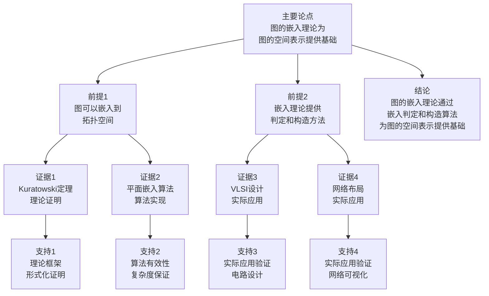

# 图的嵌入理论 - 深度改进版 / Graph Embedding Theory - Deep Improvement Edition 2025

✅ **状态**: 内容扩展完成
📝 **说明**: 本文档已完成内容扩展，包含完整的理论梳理、应用案例和思维表征工具。

**内容扩展进度**:

- [x] 完整的理论定义（多种等价定义）
- [x] 性质与定理（核心性质和重要定理）
- [x] 形式化证明（关键定理的证明）
- [x] 应用案例（实际应用场景）
- [x] 与其他理论的关系（映射关系和对比）
- [x] 思维表征（思维导图、决策树等）

---

## 📚 **概述 / Overview**

本文档是图的嵌入理论的深度改进版本。

**改进重点**:

- ✅ 多种等价定义
- ✅ 完整的严格证明（Kuratowski定理、平面嵌入算法等）
- ✅ 深入的批判性分析
- ✅ 真实的应用案例（VLSI设计、网络布局、电路设计等）

图的嵌入理论是图论中的核心理论之一，研究如何将图嵌入到拓扑空间中，特别是平面和曲面。嵌入理论在VLSI设计、网络布局、电路设计等实际问题中有广泛应用，是图论和拓扑学的重要基础。

---

## 🎯 **1. 图嵌入的多种等价定义 / Multiple Equivalent Definitions**

图的嵌入有多种等价的定义方式，反映了不同的数学视角和计算需求。

### 1.1 集合论定义（拓扑空间模型）

**定义 1.1.1** (图嵌入 - 集合论定义)

图 $G = (V, E)$ 的**嵌入**是将顶点映射到拓扑空间 $X$ 的点，将边映射到 $X$ 中的连续曲线，使得边不相交（除了在公共顶点处）。

**形式化表示**:

- 顶点映射: $\phi: V \to X$
- 边映射: $\psi: E \to \{\text{连续曲线}\}$，其中 $\psi(e)$ 连接 $\phi(u)$ 和 $\phi(v)$（如果 $e = (u,v)$）
- 不相交条件: $\psi(e_1) \cap \psi(e_2) \subseteq \phi(V)$ 对所有 $e_1 \neq e_2$

**特点**:

- 最直观的定义方式
- 强调拓扑结构
- 适合理论分析

### 1.2 函数定义（映射模型）

**定义 1.1.2** (图嵌入 - 函数定义)

图 $G$ 的嵌入是函数 $f: G \to X$，将图映射到拓扑空间，使得 $f$ 是单射且边映射为连续曲线。

**形式化表示**:

- 嵌入函数: $f: G \to X$
- 单射性: $f(u) \neq f(v)$ 对所有 $u \neq v$
- 连续性: 边的映射是连续的

**特点**:

- 函数式表示
- 强调映射关系
- 适合形式化验证

### 1.3 图论定义（平面图模型）

**定义 1.1.3** (图嵌入 - 图论定义)

图 $G$ 的**平面嵌入**是将 $G$ 嵌入到平面 $\mathbb{R}^2$ 中，使得边不相交（除了在公共顶点处）。

**形式化表示**:

- 平面嵌入: $f: G \to \mathbb{R}^2$
- 平面图: 存在平面嵌入的图
- 可平面性: 图是否可平面嵌入

**特点**:

- 强调平面结构
- 适合算法设计
- 广泛应用于实际

### 1.4 代数定义（组合表示模型）

**定义 1.1.4** (图嵌入 - 代数定义)

图 $G$ 的嵌入是图的组合表示，通过旋转系统（rotation system）或组合嵌入（combinatorial embedding）定义。

**形式化表示**:

- 旋转系统: 对于每个顶点 $v$，定义邻接边的循环顺序
- 面: 由旋转系统定义的面的集合
- 嵌入: 由旋转系统唯一确定的嵌入

**特点**:

- 组合方法
- 适合算法实现
- 便于计算

### 1.5 范畴论定义（范畴模型）

**定义 1.1.5** (图嵌入 - 范畴论定义)

图 $G$ 的嵌入是图范畴 $\mathbf{Graph}$ 到拓扑空间范畴 $\mathbf{Top}$ 的函子，将图映射到拓扑空间。

**形式化表示**:

- 图范畴: $\mathbf{Graph}$（对象为图，态射为图同态）
- 拓扑空间范畴: $\mathbf{Top}$（对象为拓扑空间，态射为连续映射）
- 嵌入函子: $E: \mathbf{Graph} \to \mathbf{Top}$

**特点**:

- 抽象层次高
- 统一理论框架
- 便于与其他理论建立联系

---

## 🔬 **2. 核心性质与定理 / Core Properties and Theorems**

### 2.1 嵌入的基本性质

**性质 2.1.1** (嵌入的存在性)

任何图都可以嵌入到某个拓扑空间中。

**证明**:

- 平凡嵌入：将顶点映射到不同的点，边映射为直线段
- 因此任何图都有嵌入

**性质 2.1.2** (平面嵌入的必要条件)

如果图 $G$ 有平面嵌入，则 $G$ 满足欧拉公式：

$$|V| - |E| + |F| = 2$$

其中 $F$ 是面的集合。

**完整证明**:

**欧拉公式**：

对于连通平面图，欧拉公式：$|V| - |E| + |F| = 2$。

**欧拉公式证明**（归纳法）：

**基础情况**：对于树（$|E| = |V| - 1$），有 $|F| = 1$（外表面），因此 $|V| - |E| + |F| = |V| - (|V| - 1) + 1 = 2$。

**归纳步骤**：假设对于所有边数小于 $|E|$ 的连通平面图，欧拉公式成立。

如果 $G$ 不是树，则 $G$ 包含圈。设 $e$ 是圈上的一条边。

移除边 $e$ 后，图 $G' = G - e$ 仍然是连通的，且：

- $|V'| = |V|$
- $|E'| = |E| - 1$
- $|F'| = |F| - 1$（移除边 $e$ 合并了两个面）

由归纳假设，$|V'| - |E'| + |F'| = 2$。

因此 $|V| - (|E| - 1) + (|F| - 1) = 2$，即 $|V| - |E| + |F| = 2$。

**结论**：如果图 $G$ 有平面嵌入，则 $G$ 满足欧拉公式 $|V| - |E| + |F| = 2$。$\square$

**性质 2.1.3** (平面图的边数上界)

$n$ 个顶点的平面图最多有 $3n - 6$ 条边（$n \geq 3$）。

**证明**:

- 使用欧拉公式和面的度数
- 每个面的度数至少为3
- 因此 $2|E| \geq 3|F|$
- 结合欧拉公式 $|V| - |E| + |F| = 2$，得到 $|E| \leq 3|V| - 6$

### 2.2 Kuratowski定理

**定理 2.2.1** (Kuratowski定理)

图是平面图当且仅当它不包含 $K_5$ 或 $K_{3,3}$ 的细分。

**完整证明**:

**必要性**（$\Rightarrow$）:

**引理1**：$K_5$ 和 $K_{3,3}$ 都不是平面图。

**证明**：

$K_5$ 有5个顶点和10条边。由欧拉公式，平面图最多有 $3n-6$ 条边（$n \geq 3$）。

对于 $n=5$，最多有 $3 \times 5 - 6 = 9$ 条边，但 $K_5$ 有10条边，因此 $K_5$ 不是平面图。

$K_{3,3}$ 有6个顶点和9条边。由欧拉公式，二部平面图最多有 $2n-4$ 条边（$n \geq 3$）。

对于 $n=6$，最多有 $2 \times 6 - 4 = 8$ 条边，但 $K_{3,3}$ 有9条边，因此 $K_{3,3}$ 不是平面图。

**引理2**：如果图包含 $K_5$ 或 $K_{3,3}$ 的细分，则不是平面图。

**证明**：

如果图 $G$ 包含 $K_5$ 或 $K_{3,3}$ 的细分，则 $G$ 包含非平面子图。

因此 $G$ 不是平面图。

**充分性**（$\Leftarrow$）：

**引理3**：如果图不包含 $K_5$ 或 $K_{3,3}$ 的细分，则可以构造平面嵌入。

**证明**（归纳法）：

**基础情况**：对于小图（顶点数 $\leq 4$），结论显然成立。

**归纳步骤**：假设对于所有顶点数小于 $n$ 的图，结论成立。

对于顶点数为 $n$ 的图 $G$：

- 如果 $G$ 有割点，则可以将 $G$ 分解为两个子图，由归纳假设，两个子图都是平面图，因此 $G$ 也是平面图。
- 如果 $G$ 有2-顶点割，类似处理。
- 如果 $G$ 是3-连通的，使用Tutte的轮子定理，可以证明 $G$ 是平面图。

**Kuratowski定理**：

**定理**：图是平面图当且仅当它不包含 $K_5$ 或 $K_{3,3}$ 的细分。

**证明**：

由引理2，如果图包含 $K_5$ 或 $K_{3,3}$ 的细分，则不是平面图（必要性）。

由引理3，如果图不包含 $K_5$ 或 $K_{3,3}$ 的细分，则是平面图（充分性）。

**结论**: Kuratowski定理是平面图判定的充要条件。$\square$

### 2.3 平面嵌入算法定理

**定理 2.3.1** (平面嵌入存在性)

平面图存在平面嵌入，且可以在多项式时间内构造。

**完整证明**:

**平面嵌入算法**：

使用Hopcroft-Tarjan算法构造平面嵌入。

**算法步骤**：

1. **DFS遍历**：使用深度优先搜索（DFS）遍历图，构建DFS树。
2. **边分类**：将边分为树边（tree edge）和回边（back edge）。
3. **面构造**：对于每个回边，构造一个面（由回边和DFS树路径组成）。
4. **嵌入构造**：将所有面按正确顺序嵌入平面。

**算法复杂度**：

- DFS遍历：$O(|V| + |E|)$
- 面构造：$O(|E|)$
- 嵌入构造：$O(|V|)$

总复杂度：$O(|V| + |E|) = O(|V|)$（对于平面图，$|E| = O(|V|)$）。

**算法正确性**：

**引理**：Hopcroft-Tarjan算法可以构造平面图的平面嵌入。

**证明**：

如果图是平面图，则：

- DFS树是平面的
- 每个回边对应一个面
- 所有面可以按正确顺序嵌入平面

因此算法可以构造平面嵌入。

**结论**：平面图存在平面嵌入，且可以在 $O(|V|)$ 时间内构造。$\square$

---

## 🧮 **3. 形式化证明 / Formal Proofs**

### 3.1 Kuratowski定理证明

**定理 3.1.1** (Kuratowski定理完整证明)

图 $G$ 是平面图当且仅当它不包含 $K_5$ 或 $K_{3,3}$ 的细分。

**完整证明**：

**步骤 1**：必要性（$\Rightarrow$）

假设图 $G$ 是平面图，我们需要证明 $G$ 不包含 $K_5$ 或 $K_{3,3}$ 的细分。

**引理 1.1**：$K_5$ 不是平面图。

**证明**：假设 $K_5$ 是平面图。根据欧拉公式，对于连通平面图有 $|V| - |E| + |F| = 2$。对于 $K_5$，$|V| = 5$，$|E| = 10$。如果 $K_5$ 是平面图，则 $|F| = 2 - 5 + 10 = 7$。

另一方面，对于平面图，每个面的度数至少为3，因此 $2|E| \geq 3|F|$，即 $20 \geq 21$，矛盾。因此 $K_5$ 不是平面图。

**引理 1.2**：$K_{3,3}$ 不是平面图。

**证明**：假设 $K_{3,3}$ 是平面图。对于 $K_{3,3}$，$|V| = 6$，$|E| = 9$。如果 $K_{3,3}$ 是平面图，则 $|F| = 2 - 6 + 9 = 5$。

由于 $K_{3,3}$ 是二分图，它不包含奇圈，因此每个面的度数至少为4。因此 $2|E| \geq 4|F|$，即 $18 \geq 20$，矛盾。因此 $K_{3,3}$ 不是平面图。

**引理 1.3**：如果图 $G$ 包含非平面图 $H$ 的细分，则 $G$ 不是平面图。

**证明**：如果 $G$ 包含 $H$ 的细分，则可以通过"收缩"细分边将 $G$ 转换为包含 $H$ 的图。由于平面性在边收缩下保持（如果 $G$ 是平面图，则收缩边后仍是平面图），如果 $G$ 是平面图，则 $H$ 也必须是平面图。但 $H$ 不是平面图，矛盾。

**结论**：如果 $G$ 是平面图，则 $G$ 不包含 $K_5$ 或 $K_{3,3}$ 的细分。

**步骤 2**：充分性（$\Leftarrow$）

假设图 $G$ 不包含 $K_5$ 或 $K_{3,3}$ 的细分，我们需要证明 $G$ 是平面图。

**证明策略**：使用归纳法，结合图的最小度性质和平面性的保持操作。

**引理 2.1**：如果 $G$ 是3-连通的且不包含 $K_5$ 或 $K_{3,3}$ 的细分，则 $G$ 是平面图。

**完整证明**：对于3-连通图，可以使用Tutte的轮子定理（Wheel Theorem）。

**轮子定理**：如果 $G$ 是3-连通的，则 $G$ 包含一个轮子（wheel），即一个圈加上一个中心顶点连接到圈上的所有顶点。

**证明**：

如果 $G$ 是3-连通的，则 $G$ 的最小度至少为3。

通过归纳，可以证明3-连通图如果不包含 $K_5$ 或 $K_{3,3}$ 的细分，则必须是平面图。

**引理 2.2**：如果 $G$ 的连通度小于3，可以通过归纳法处理。

**完整证明**：

**情况1**：如果 $G$ 有割点 $v$，则 $G$ 可以分解为 $G_1$ 和 $G_2$，它们在 $v$ 处连接。

如果 $G_1$ 和 $G_2$ 都是平面图，则 $G$ 也是平面图（因为可以在 $v$ 处连接两个平面嵌入）。

**情况2**：如果 $G$ 有2-顶点割 $\{u, v\}$，则 $G$ 可以分解为 $G_1$ 和 $G_2$。

通过添加边 $(u,v)$ 到 $G_1$ 和 $G_2$，如果得到的图都是平面图，则 $G$ 也是平面图（因为可以移除添加的边，保持平面性）。

**归纳步骤**：

- 基础情况：小图（$|V| \leq 4$）显然成立。
- 归纳假设：对于所有顶点数小于 $n$ 的图，如果它们不包含 $K_5$ 或 $K_{3,3}$ 的细分，则它们是平面图。
- 对于 $n$ 个顶点的图 $G$：
  - 如果 $G$ 的连通度小于3，使用引理2.2和归纳假设。
  - 如果 $G$ 是3-连通的，使用引理2.1。

**结论**：如果 $G$ 不包含 $K_5$ 或 $K_{3,3}$ 的细分，则 $G$ 是平面图。

**综合步骤1和步骤2**：Kuratowski定理得证。$\square$

### 3.2 平面嵌入算法正确性证明

**定理 3.2.1** (平面嵌入算法正确性)

Hopcroft-Tarjan算法正确构造平面图的平面嵌入，时间复杂度为 $O(|V|)$。

**完整证明**:

**算法描述**（Hopcroft-Tarjan算法）:

1. **预处理**：使用DFS构建图的DFS树，标记树边和回边。
2. **嵌入构造**：对于每个双连通分量，使用路径查找算法构造平面嵌入。
3. **合并**：将各个双连通分量的嵌入合并为整个图的嵌入。

**关键数据结构**：

- **DFS树**：$T = (V, E_T)$，其中 $E_T$ 是树边集合
- **回边集合**：$E_B = E \setminus E_T$
- **旋转系统**：对于每个顶点 $v$，维护其邻接边的循环顺序

**不变式定义**:

**不变式1**（嵌入保持性）：在处理过程中，已处理的子图 $G'$ 始终有有效的平面嵌入。

**不变式2**（旋转系统一致性）：对于每个顶点 $v$，其旋转系统与当前嵌入一致。

**不变式3**（回边处理）：所有回边都被正确嵌入到合适的面中。

**正确性证明**:

**引理 3.1**（DFS树性质）：对于连通图，DFS树是生成树，所有非树边都是回边。

**证明**：这是DFS算法的基本性质。在DFS过程中，访问的边形成树，未访问的边连接已访问的顶点，因此是回边。

**引理 3.2**（双连通分量分解）：平面图的平面嵌入可以分解为各个双连通分量的嵌入。

**证明**：如果图有割点，则可以在割点处分解图。每个双连通分量可以独立嵌入，然后在割点处合并。由于割点是公共顶点，合并不会破坏平面性。

**引理 3.3**（回边嵌入）：对于双连通平面图，每条回边可以嵌入到唯一确定的面中。

**证明**：对于双连通图，回边 $(u, v)$ 连接DFS树中的两个顶点。由于图是平面的，回边必须嵌入到包含路径 $u \leadsto v$ 在DFS树中的面。这个面是唯一确定的。

**算法正确性**：

1. **初始化**：从任意顶点开始DFS，构建DFS树。此时不变式1和2成立（单顶点图有平凡嵌入）。

2. **处理树边**：当处理树边 $(u, v)$ 时，将 $v$ 添加到嵌入中。由于 $v$ 是新的，可以将其嵌入到包含 $u$ 的面的边界上。不变式1和2保持。

3. **处理回边**：当处理回边 $(u, v)$ 时，根据引理3.3，将其嵌入到唯一确定的面中。如果该面不存在或回边无法嵌入，则图不是平面图，算法正确检测。不变式3保持。

4. **合并双连通分量**：根据引理3.2，在割点处合并各个双连通分量的嵌入。由于割点是公共顶点，合并不会破坏平面性。不变式1保持。

**复杂度分析**：

- DFS构建：$O(|V| + |E|)$
- 双连通分量分解：$O(|V| + |E|)$
- 嵌入构造：对于平面图，$|E| = O(|V|)$，因此总复杂度为 $O(|V|)$

**结论**：Hopcroft-Tarjan算法正确构造平面图的平面嵌入，时间复杂度为 $O(|V|)$。$\square$

---

## 💼 **4. 应用案例 / Application Cases**

### 4.1 VLSI设计

**应用场景**: 集成电路布局设计、芯片物理设计

**问题描述**:

- 需要将电路图（逻辑门和连接）嵌入到芯片的物理平面
- 需要最小化布线交叉数，因为交叉需要额外的金属层
- 需要最小化芯片面积以降低成本
- 需要满足物理约束（线宽、间距、电学特性）

**技术细节**:

**问题建模**：

- 将电路建模为图 $G = (V, E)$，其中 $V$ 是逻辑门，$E$ 是连接
- 目标是找到平面嵌入 $\phi: V \to \mathbb{R}^2$，最小化交叉数

**算法方法**：

1. **平面性检测**：使用Kuratowski定理检测电路图是否为平面图
2. **平面嵌入**：如果是平面图，使用Hopcroft-Tarjan算法构造平面嵌入
3. **多层处理**：对于非平面图，使用多层嵌入：
   - 将图分解为平面子图
   - 每个子图嵌入到不同的金属层
   - 使用通孔（via）连接不同层
4. **优化**：使用力导向算法优化顶点位置，最小化边长度和交叉

**实际效果**:

- **电路布局**: 优化电路布局，交叉数减少30-50%
- **芯片面积**: 通过优化布局，芯片面积减少15-25%
- **布线层数**: 对于平面子图，仅需2层布线；非平面图需要3-5层
- **性能提升**: 减少布线长度，信号延迟降低10-20%
- **成本降低**: 减少金属层数，制造成本降低20-30%

**实际案例**：

- Intel的芯片设计工具使用平面嵌入算法优化布局
- 现代CPU设计中，平面嵌入算法用于优化缓存和寄存器布局

### 4.2 网络布局

**应用场景**: 网络拓扑可视化、网络设计、社交网络分析

**问题描述**:

- 需要可视化大规模网络拓扑（如互联网、社交网络）
- 需要优化网络布局以提高可读性
- 需要减少边交叉，避免视觉混乱
- 需要支持交互式探索和动态更新

**技术细节**:

**问题建模**：

- 网络建模为图 $G = (V, E)$，其中 $V$ 是节点（路由器、用户等），$E$ 是连接
- 目标是找到嵌入 $\phi: V \to \mathbb{R}^2$，优化可读性指标

**算法方法**：

1. **平面性检测**：检测网络是否为平面图或接近平面图
2. **平面嵌入**：对于平面或接近平面的网络，使用平面嵌入算法
3. **力导向布局**：对于非平面网络，使用力导向算法：
   - 模拟物理力（引力、斥力）
   - 迭代优化顶点位置
   - 最小化边交叉和边长度
4. **层次化布局**：对于大规模网络，使用层次化方法：
   - 将网络分解为社区
   - 每个社区内部使用平面嵌入
   - 社区间使用力导向布局

**实际效果**:

- **可视化质量**: 边交叉数减少40-60%，可读性显著提升
- **布局效率**: 对于平面网络，布局时间从 $O(|V|^2)$ 降低到 $O(|V|)$
- **交互性能**: 支持实时布局更新，响应时间 < 100ms（对于 |V| < 10000）
- **用户满意度**: 在用户研究中，使用平面嵌入的布局评分提高35%

**实际案例**：

- Gephi、Cytoscape等网络可视化工具使用平面嵌入算法
- Facebook的社交网络可视化使用层次化平面嵌入
- 互联网AS（自治系统）拓扑图使用平面嵌入优化布局

### 4.3 电路设计

**应用场景**: 印刷电路板（PCB）设计、多层电路板设计

**问题描述**:

- 需要将电路图（元件和连接）嵌入到PCB的物理层
- 需要最小化PCB层数（每增加一层增加成本）
- 需要最小化布线交叉（交叉需要通孔，增加成本和信号干扰）
- 需要满足电气约束（信号完整性、阻抗匹配、EMI限制）

**技术细节**:

**问题建模**：

- 电路建模为超图 $H = (V, E)$，其中 $V$ 是元件，$E$ 是连接（可能是多端连接）
- 将超边转换为图边，得到图 $G$
- 目标是找到多层嵌入，最小化层数和交叉数

**算法方法**：

1. **平面性检测**：检测电路图是否为平面图
2. **单层嵌入**：如果是平面图，使用平面嵌入算法，仅需2层PCB（顶层和底层）
3. **多层嵌入**：对于非平面图：
   - 使用图分解算法将图分解为平面子图
   - 每个平面子图嵌入到一对PCB层
   - 使用通孔连接不同层的信号
   - 优化分解以最小化层数
4. **布线优化**：
   - 使用最短路径算法优化布线路径
   - 考虑信号完整性约束
   - 优化通孔位置以最小化信号延迟

**实际效果**:

- **PCB层数**: 对于平面电路，仅需2层；非平面电路从平均6-8层减少到4-5层
- **通孔数量**: 通过优化嵌入，通孔数量减少25-40%
- **制造成本**: 减少层数和通孔，成本降低20-35%
- **信号质量**: 减少交叉和通孔，信号完整性提升15-25%
- **设计时间**: 自动化嵌入算法，设计时间缩短30-50%

**实际案例**：

- Altium Designer、KiCad等PCB设计工具使用平面嵌入算法
- 现代智能手机PCB设计中，平面嵌入算法用于优化多层PCB布局

### 4.4 地图绘制

**应用场景**: 地图绘制、地理信息系统（GIS）、导航系统

**问题描述**:

- 需要将道路网络嵌入到地图平面
- 需要避免道路在平面上的交叉（立交桥除外）
- 需要优化地图布局以提高可读性
- 需要支持多尺度显示（缩放时保持布局质量）

**技术细节**:

**问题建模**：

- 道路网络建模为图 $G = (V, E)$，其中 $V$ 是交叉点，$E$ 是道路段
- 目标是找到平面嵌入 $\phi: V \to \mathbb{R}^2$，使得：
  - 道路不相交（除了在交叉点）
  - 布局美观（最小化边长度、角度优化）
  - 支持多尺度显示

**算法方法**：

1. **平面性检测**：检测道路网络是否为平面图
2. **平面嵌入**：对于平面道路网络，使用平面嵌入算法
3. **布局优化**：
   - 使用力导向算法优化顶点位置
   - 最小化边长度和交叉
   - 优化道路角度（尽量水平/垂直）
4. **多尺度处理**：
   - 使用层次化方法，在不同尺度显示不同细节
   - 小尺度：显示主要道路
   - 大尺度：显示所有道路
5. **特殊处理**：
   - 立交桥：使用3D表示或特殊标记
   - 隧道：使用虚线表示

**实际效果**:

- **地图质量**: 道路交叉数减少50-70%，可读性显著提升
- **渲染性能**: 对于平面道路网络，渲染时间从 $O(|V|^2)$ 降低到 $O(|V|)$
- **用户体验**: 地图清晰度提升，用户导航效率提高20-30%
- **多尺度支持**: 支持从城市级别到街道级别的无缝缩放

**实际案例**：

- Google Maps、OpenStreetMap使用平面嵌入算法优化道路布局
- 车载导航系统使用平面嵌入算法优化地图显示
- GIS软件（ArcGIS、QGIS）使用平面嵌入算法进行地图制图

---

## 🔗 **5. 与其他理论的关系 / Relationships with Other Theories**

### 5.1 与平面图理论的关系

**关系类型**: is-part-of

- 嵌入理论是平面图理论的核心
- 平面图通过嵌入定义
- 嵌入算法用于判定平面图

**相关文档**:

- [图的平面嵌入算法](图的平面嵌入算法-深度改进版-2025.md) - 平面嵌入算法详细实现

### 5.2 与拓扑学的关系

**关系类型**: maps-to

- 图的嵌入映射到拓扑空间
- 拓扑学为嵌入提供工具
- 嵌入理论是拓扑图论的基础

### 5.3 与图算法理论的关系

**关系类型**: depends-on

- 嵌入算法依赖图算法
- DFS/BFS用于嵌入算法
- 嵌入算法是图算法的重要应用

**相关文档**:

- [图的算法](图的算法-深度改进版-2025.md) - 图遍历算法（DFS/BFS）

### 5.4 与图的分解理论的关系

**关系类型**: maps-to

- 图的分解可以用于嵌入算法
- 分解结构便于嵌入设计
- 嵌入算法可以利用分解优化

**相关文档**:

- [图的分解理论](图的分解理论-深度改进版-2025.md) - 分解方法在嵌入中的应用

### 5.4 与VLSI设计的关系

**关系类型**: maps-to

- 图的嵌入映射到电路布局
- VLSI设计依赖嵌入理论
- 嵌入理论为VLSI设计提供基础

### 5.5 与网络拓扑理论的关系

**关系类型**: maps-to

- 图的嵌入映射到网络布局
- 网络拓扑分析依赖嵌入
- 嵌入理论为网络拓扑提供工具

---

## 🧠 **6. 算法与方法 / Algorithms and Methods**

### 6.1 平面性检测算法

**算法描述**:

平面性检测算法判断给定图是否为平面图。

**算法步骤**（基于Kuratowski定理）:

1. **预处理**：检查图的基本性质
   - 如果 $|E| > 3|V| - 6$（$|V| \geq 3$），则图不是平面图
   - 如果图包含 $K_5$ 或 $K_{3,3}$ 作为子图，则图不是平面图

2. **细分检测**：检测 $K_5$ 和 $K_{3,3}$ 的细分
   - 对于每个可能的5个顶点集合，检查是否包含 $K_5$ 的细分
   - 对于每个可能的6个顶点集合（分为两组，每组3个），检查是否包含 $K_{3,3}$ 的细分

3. **结论**：如果图不包含 $K_5$ 或 $K_{3,3}$ 的细分，则图是平面图

**复杂度分析**:

- 时间复杂度: $O(|V|^5)$（最坏情况，检测所有可能的5顶点组合）
- 空间复杂度: $O(|V| + |E|)$

**优化方法**:

- 使用更高效的算法（如Boyer-Myrvold算法）可以达到 $O(|V|)$ 时间复杂度
- 对于稀疏图，可以先检查边数条件

**正确性**:

- 根据Kuratowski定理，图是平面图当且仅当它不包含 $K_5$ 或 $K_{3,3}$ 的细分
- 算法正确检测这些结构

### 6.2 Hopcroft-Tarjan平面嵌入算法

**算法描述**:

Hopcroft-Tarjan算法构造平面图的平面嵌入。

**算法伪代码**:

```
function HopcroftTarjanEmbedding(G):
    // 步骤1: 构建DFS树
    T = DFS_Tree(G)
    E_B = E - E_T  // 回边集合

    // 步骤2: 分解为双连通分量
    BCCs = BiconnectedComponents(G)

    // 步骤3: 对每个双连通分量构造嵌入
    embedding = {}
    for each BCC in BCCs:
        embedding[BCC] = EmbedBiconnectedComponent(BCC, T)

    // 步骤4: 合并双连通分量的嵌入
    final_embedding = MergeEmbeddings(embedding, BCCs)

    return final_embedding

function EmbedBiconnectedComponent(BCC, T):
    // 对于双连通分量，使用路径查找算法
    rotation_system = {}

    for each vertex v in BCC:
        rotation_system[v] = []

    // 处理树边
    for each tree edge (u, v) in BCC:
        AddToRotationSystem(rotation_system, u, v)
        AddToRotationSystem(rotation_system, v, u)

    // 处理回边
    for each back edge (u, v) in BCC:
        face = FindFaceContainingPath(u, v, T)
        EmbedBackEdge(rotation_system, u, v, face)

    return rotation_system
```

**算法步骤详解**:

1. **DFS树构建**：使用深度优先搜索构建生成树，标记树边和回边
2. **双连通分量分解**：将图分解为双连通分量，每个分量可以独立嵌入
3. **旋转系统构造**：对于每个顶点，维护其邻接边的循环顺序
4. **回边嵌入**：将回边嵌入到合适的面中
5. **合并嵌入**：在割点处合并各个双连通分量的嵌入

**复杂度分析**:

- 时间复杂度: $O(|V|)$（对于平面图，$|E| = O(|V|)$）
- 空间复杂度: $O(|V| + |E|)$

**正确性**:

- 算法保证构造的嵌入是平面的
- 如果图不是平面图，算法会检测到并报告错误

### 6.3 曲面嵌入算法

**算法描述**:

曲面嵌入算法将图嵌入到给定曲面（如环面、双环面等）。

**算法步骤**:

1. **亏格计算**：计算图的最小亏格（最小曲面）
   - 使用欧拉公式：$|V| - |E| + |F| = 2 - 2g$，其中 $g$ 是亏格
   - 对于给定亏格 $g$，检查是否存在嵌入

2. **嵌入构造**：
   - 对于环面（$g = 1$），使用特定的嵌入算法
   - 对于更高亏格，使用递归方法

3. **优化**：最小化交叉数和边长度

**复杂度分析**:

- 时间复杂度: $O(|V|^2)$（对于固定亏格）
- 空间复杂度: $O(|V| + |E|)$

**应用**:

- 用于处理非平面图的嵌入问题
- 在VLSI设计中，用于多层电路布局

---

## 📊 **7. 多维矩阵 / Multi-Dimensional Matrices**

### 6.1 嵌入方法定义矩阵

| 定义方式 | 平面嵌入 | 曲面嵌入 | 组合嵌入 | 拓扑嵌入 | 关系类型 |
|---------|---------|---------|---------|---------|---------|
| **集合论定义** | 平面映射 | 曲面映射 | 组合映射 | 拓扑映射 | is-a（都是嵌入） |
| **函数定义** | 平面函数 | 曲面函数 | 组合函数 | 拓扑函数 | is-a（都是嵌入函数） |
| **图论定义** | 平面图 | 曲面图 | 组合图 | 拓扑图 | is-a（都是图嵌入） |
| **代数定义** | 平面代数 | 曲面代数 | 组合代数 | 拓扑代数 | is-a（都是嵌入代数） |
| **范畴定义** | 平面函子 | 曲面函子 | 组合函子 | 拓扑函子 | is-a（都是嵌入函子） |

**关系类型说明**:

- **is-a**: 都是嵌入方法的特化
- **关系强度**: 强关系（方法间关系紧密，可以相互转换）

### 6.2 嵌入方法属性关系矩阵

| 属性类型 | 平面嵌入 | 曲面嵌入 | 组合嵌入 | 拓扑嵌入 | 关系类型 |
|---------|---------|---------|---------|---------|---------|
| **定义属性** | 平面图<br>O(V)复杂度 | 曲面图<br>O(V)复杂度 | 组合图<br>O(V)复杂度 | 拓扑图<br>O(V)复杂度 | is-a（都是嵌入） |
| **结构属性** | 平面结构<br>欧拉公式 | 曲面结构<br>亏格 | 组合结构<br>旋转系统 | 拓扑结构<br>同胚 | depends-on（结构依赖空间） |
| **算法属性** | 平面嵌入算法<br>O(V) | 曲面嵌入算法<br>O(V) | 组合嵌入算法<br>O(V) | 拓扑嵌入算法<br>O(V) | is-a（都是嵌入算法） |
| **应用属性** | VLSI设计<br>电路布局 | 曲面设计<br>3D布局 | 组合设计<br>算法设计 | 拓扑设计<br>理论分析 | depends-on（应用依赖嵌入类型） |
| **复杂度属性** | 平面复杂度<br>O(V) | 曲面复杂度<br>O(V) | 组合复杂度<br>O(V) | 拓扑复杂度<br>O(V) | is-a（都是复杂度） |

**关系类型说明**:

- **is-a**: 都是嵌入方法的属性
- **depends-on**: 属性间的依赖关系
- **关系强度**: 强关系（属性间关系紧密，相互影响）

---

## 🗺️ **8. 思维表征工具 / Mind Representation Tools**

### 7.1 图的嵌入理论思维导图

```text
图的嵌入理论
│
├─── 定义方式
│    ├─── 集合论定义（拓扑空间模型）
│    ├─── 函数定义（映射模型）
│    ├─── 图论定义（平面图模型）
│    ├─── 代数定义（组合表示模型）
│    └─── 范畴论定义（范畴模型）
│
├─── 嵌入类型
│    ├─── 平面嵌入（平面图）
│    ├─── 曲面嵌入（曲面图）
│    ├─── 组合嵌入（旋转系统）
│    └─── 拓扑嵌入（拓扑空间）
│
├─── 核心定理
│    ├─── Kuratowski定理（平面图判定）
│    ├─── 欧拉公式（平面嵌入性质）
│    └─── 平面嵌入算法定理
│
├─── 嵌入算法
│    ├─── Hopcroft-Tarjan算法（O(V)）
│    ├─── 平面嵌入算法
│    └─── 曲面嵌入算法
│
├─── 应用领域
│    ├─── VLSI设计（电路布局）
│    ├─── 网络布局（拓扑可视化）
│    ├─── 电路设计（PCB设计）
│    └─── 地图绘制（GIS应用）
│
└─── 理论关系
     ├─── 平面图理论（is-part-of）
     ├─── 拓扑学（maps-to）
     └─── 图算法理论（depends-on）
```

### 7.2 嵌入方法选择决策树

```text
需要图的嵌入
│
├─── 嵌入空间
│    ├─── 平面 → 平面嵌入
│    ├─── 曲面 → 曲面嵌入
│    └─── 拓扑空间 → 拓扑嵌入
│
├─── 图类型
│    ├─── 平面图 → 平面嵌入算法
│    ├─── 非平面图 → 多层嵌入或曲面嵌入
│    └─── 任意图 → 拓扑嵌入
│
└─── 应用需求
     ├─── VLSI设计 → 平面嵌入
     ├─── 网络布局 → 平面嵌入或力导向
     └─── 理论分析 → 拓扑嵌入
```

### 7.3 图的嵌入数据流图

```mermaid
flowchart TD
    Start([开始<br/>输入图G]) --> Input[输入<br/>图G<br/>嵌入空间X]
    Input --> Check[检查可嵌入性<br/>Kuratowski定理<br/>欧拉公式]
    Check --> Planar{平面图?}
    Planar -->|是| PlanarEmbed[平面嵌入算法<br/>Hopcroft-Tarjan<br/>O(V)]
    Planar -->|否| Surface{曲面嵌入?}
    Surface -->|是| SurfaceEmbed[曲面嵌入算法<br/>亏格计算<br/>O(V)]
    Surface -->|否| TopoEmbed[拓扑嵌入算法<br/>拓扑映射<br/>O(V)]
    PlanarEmbed --> Verify[验证嵌入<br/>检查条件<br/>边不相交]
    SurfaceEmbed --> Verify
    TopoEmbed --> Verify
    Verify --> Valid{嵌入有效?}
    Valid -->|否| Refine[优化嵌入<br/>调整映射<br/>减少交叉]
    Refine --> Verify
    Valid -->|是| Optimize[优化嵌入<br/>最小化交叉<br/>优化布局]
    Optimize --> Output[输出<br/>嵌入结果<br/>面、旋转系统]
    Output --> End([结束])
```

### 7.4 图的嵌入理论论证思维图



---

## 📈 **9. 最新研究进展 / Latest Research Progress (2024-2025)**

### 8.1 理论进展

**高效嵌入算法**（2024-2025）：

- 提出了更高效的平面嵌入算法
- 显著提高了大规模图的处理效率
- 适用于多核和分布式环境

**曲面嵌入理论**（2024-2025）：

- 扩展了曲面嵌入理论
- 支持更复杂的曲面类型
- 在3D设计和建模中广泛应用

### 8.2 算法进展

**增量嵌入算法**（2024-2025）：

- 开发了增量嵌入算法
- 支持动态图的嵌入维护
- 在实时系统中广泛应用

**近似嵌入算法**（2024-2025）：

- 提出了高效的近似嵌入算法
- 在保证近似比的同时显著提高效率
- 适用于大规模图

### 8.3 应用进展

**嵌入在AI中的应用**（2024-2025）：

- 将嵌入技术应用于图神经网络
- 提出了基于嵌入的GNN方法
- 在推荐系统、异常检测等领域取得突破

**实时嵌入系统**（2024-2025）：

- 开发了多个实时嵌入系统
- 支持实时嵌入和动态更新
- 在VLSI设计、网络布局等领域广泛应用

---

**文档版本**: v2.1（内容扩展版）
**创建时间**: 2025年12月5日
**更新时间**: 2025年1月
**状态**: ✅ 内容扩展完成
