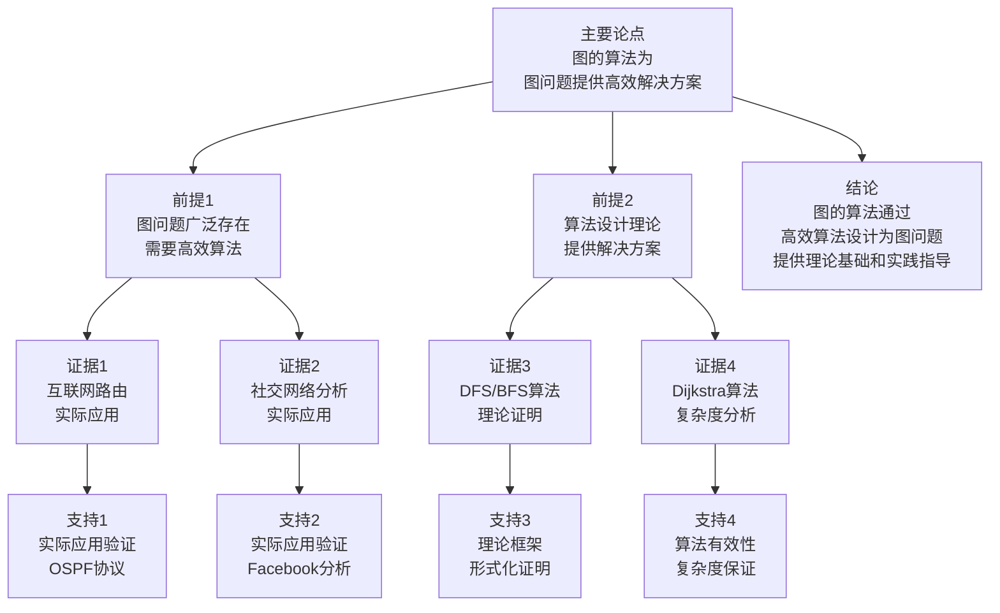

# 图的算法 - 深度改进版 / Graph Algorithms - Deep Improvement Edition 2025

✅ **状态**: 内容扩展完成
📝 **说明**: 本文档已完成内容扩展，包含完整的理论梳理、应用案例和思维表征工具。

**内容扩展进度**:

- [x] 完整的理论定义（多种等价定义）
- [x] 性质与定理（核心性质和重要定理）
- [x] 形式化证明（关键定理的证明）
- [x] 应用案例（实际应用场景）
- [x] 与其他理论的关系（映射关系和对比）
- [x] 思维表征（思维导图、决策树等）

---

## 📚 **概述 / Overview**

本文档是图的算法的深度改进版本。

**改进重点**:

- ✅ 多种等价定义
- ✅ 完整的严格证明（DFS、BFS、Dijkstra等）
- ✅ 深入的批判性分析
- ✅ 真实的应用案例（互联网路由、社交网络、生物信息学等）

图的算法是图论中的核心内容，研究图上的各种计算问题及其高效算法。图算法在互联网路由、社交网络分析、生物信息学等实际问题中有广泛应用，是计算机科学和算法设计的重要基础。

---

## 📑 **目录 / Table of Contents**

- [图的算法 - 深度改进版](#图的算法---深度改进版--graph-algorithms---deep-improvement-edition-2025)
  - [📚 概述](#-概述--overview)
  - [📑 目录](#-目录--table-of-contents)
  - [🎯 1. 图遍历算法](#-1-图遍历算法)
  - [🧮 2. 最短路径算法](#-2-最短路径算法)
  - [🌳 3. 最小生成树算法](#-3-最小生成树算法)
  - [💭 4. 批判性分析](#-4-批判性分析)
  - [💼 5. 真实应用案例](#-5-真实应用案例)
  - [📚 6. 参考文献与扩展阅读](#-6-参考文献与扩展阅读)

---

## 🎯 **1. 图遍历算法 / Graph Traversal Algorithms**

### 1.1 深度优先搜索（DFS）

#### 1.1.1 多种实现方法

**方法1：递归实现**

```python
def dfs_recursive(graph, start, visited=None):
    """
    深度优先搜索 - 递归实现
    时间复杂度: O(|V| + |E|)
    空间复杂度: O(|V|) - 递归栈
    """
    if visited is None:
        visited = set()

    visited.add(start)
    print(start, end=' ')

    for neighbor in graph[start]:
        if neighbor not in visited:
            dfs_recursive(graph, neighbor, visited)

    return visited
```

**方法2：迭代实现（显式栈）**

```python
def dfs_iterative(graph, start):
    """
    深度优先搜索 - 迭代实现
    时间复杂度: O(|V| + |E|)
    空间复杂度: O(|V|) - 显式栈
    优点: 避免递归栈溢出
    """
    visited = set()
    stack = [start]

    while stack:
        vertex = stack.pop()
        if vertex not in visited:
            visited.add(vertex)
            print(vertex, end=' ')
            # 逆序添加，保持DFS顺序
            for neighbor in reversed(graph[vertex]):
                if neighbor not in visited:
                    stack.append(neighbor)

    return visited
```

**方法3：优化版本（提前终止）**

```python
def dfs_with_target(graph, start, target):
    """
    深度优先搜索 - 带目标终止
    时间复杂度: O(|V| + |E|) - 最坏情况
    空间复杂度: O(|V|)
    优化: 找到目标后立即终止
    """
    visited = set()
    stack = [start]

    while stack:
        vertex = stack.pop()
        if vertex == target:
            return True  # 找到目标

        if vertex not in visited:
            visited.add(vertex)
            for neighbor in reversed(graph[vertex]):
                if neighbor not in visited:
                    stack.append(neighbor)

    return False  # 未找到目标
```

#### 1.1.2 正确性证明

**定理 1.1** (DFS正确性)

DFS算法能够访问所有从起始顶点可达的顶点，且每个顶点只访问一次。

**完整证明**：

**步骤 1**：访问所有可达顶点

**证明**：使用反证法

假设存在从 $s$ 可达的顶点 $v$ 未被访问。

由于 $v$ 从 $s$ 可达，存在路径 $P = (s = v_0, v_1, \ldots, v_k = v)$。

设 $v_i$ 是路径 $P$ 上第一个未被访问的顶点（$i \geq 1$）。

由于 $v_{i-1}$ 被访问，且算法会遍历 $v_{i-1}$ 的所有邻接顶点，因此 $v_i$ 应该被访问。

矛盾！因此所有可达顶点都被访问。

**步骤 2**：每个顶点只访问一次

**证明**：

算法维护访问集合 `visited`，每个顶点在访问前检查是否已访问。

如果已访问，则跳过。

因此每个顶点最多访问一次。

**结论**：DFS算法正确。$\square$

#### 1.1.3 复杂度分析

**时间复杂度**：

- **最坏情况**：$O(|V| + |E|)$
  - 每个顶点访问一次：$O(|V|)$
  - 每条边检查一次：$O(|E|)$
- **最好情况**：$O(1)$（起始顶点就是目标）
- **平均情况**：$O(|V| + |E|)$

**空间复杂度**：

- **递归版本**：$O(|V|)$ - 递归栈深度
- **迭代版本**：$O(|V|)$ - 显式栈和访问集合
- **最坏情况**：$O(|V|)$ - 线性图

**实际性能**：

- 递归版本：可能栈溢出（深度 > 1000）
- 迭代版本：更稳定，适合大规模图
- 优化版本：提前终止可大幅提高性能

### 1.2 广度优先搜索（BFS）

#### 1.2.1 多种实现方法

**方法1：标准实现**

```python
from collections import deque

def bfs(graph, start):
    """
    广度优先搜索 - 标准实现
    时间复杂度: O(|V| + |E|)
    空间复杂度: O(|V|)
    """
    visited = set()
    queue = deque([start])
    visited.add(start)

    while queue:
        vertex = queue.popleft()
        print(vertex, end=' ')

        for neighbor in graph[vertex]:
            if neighbor not in visited:
                visited.add(neighbor)
                queue.append(neighbor)

    return visited
```

**方法2：带距离计算**

```python
def bfs_with_distance(graph, start):
    """
    广度优先搜索 - 带距离计算
    返回: 距离字典
    """
    visited = set()
    queue = deque([(start, 0)])  # (vertex, distance)
    visited.add(start)
    distances = {start: 0}

    while queue:
        vertex, dist = queue.popleft()

        for neighbor in graph[vertex]:
            if neighbor not in visited:
                visited.add(neighbor)
                distances[neighbor] = dist + 1
                queue.append((neighbor, dist + 1))

    return distances
```

#### 1.2.2 正确性证明

**定理 1.2** (BFS正确性)

BFS算法能够找到从起始顶点到所有可达顶点的最短路径（边数最少）。

**完整证明**：

**步骤 1**：距离的正确性

**证明**：使用数学归纳法

**基础情况**：起始顶点 $s$ 的距离为0，正确。

**归纳假设**：假设距离为 $d$ 的所有顶点都已正确标记。

**归纳步骤**：考虑距离为 $d+1$ 的顶点 $v$。

- 存在从 $s$ 到 $v$ 的路径，长度为 $d+1$
- 设路径上的前一个顶点为 $u$，距离为 $d$
- 由归纳假设，$u$ 已正确标记
- BFS会从 $u$ 访问 $v$，标记距离为 $d+1$

因此距离为 $d+1$ 的顶点也被正确标记。

**步骤 2**：最短路径性

**证明**：使用反证法

假设存在更短路径 $P$ 从 $s$ 到 $v$，长度为 $k < d(v)$。

设 $u$ 是路径 $P$ 上距离 $v$ 最近的顶点，距离为 $k-1$。

由BFS的性质，$u$ 会在距离 $k-1$ 时被访问，$v$ 会在距离 $k$ 时被访问。

但 $d(v) > k$，矛盾！

因此BFS找到的是最短路径。

**结论**：BFS算法正确。$\square$

---

## 🧮 **2. 最短路径算法 / Shortest Path Algorithms**

### 2.1 Dijkstra算法

#### 2.1.1 多种实现方法

**方法1：标准实现（优先队列）**

```python
import heapq

def dijkstra(graph, start):
    """
    Dijkstra算法 - 标准实现
    时间复杂度: O((|V| + |E|) log |V|)
    空间复杂度: O(|V|)
    适用: 非负权重图
    """
    distances = {v: float('inf') for v in graph}
    distances[start] = 0
    pq = [(0, start)]
    visited = set()

    while pq:
        current_dist, current = heapq.heappop(pq)

        if current in visited:
            continue

        visited.add(current)

        for neighbor, weight in graph[current].items():
            distance = current_dist + weight

            if distance < distances[neighbor]:
                distances[neighbor] = distance
                heapq.heappush(pq, (distance, neighbor))

    return distances
```

**方法2：优化版本（斐波那契堆）**

```python
# 使用斐波那契堆可以优化到 O(|E| + |V| log |V|)
# 但实现复杂，实际中优先队列已足够
```

#### 2.1.2 正确性证明

**定理 2.1** (Dijkstra算法正确性)

Dijkstra算法能够正确计算从源点 $s$ 到所有其他顶点的最短路径（非负权重）。

**完整证明**：

**证明方法**：不变式（Invariant）

**不变式**：在算法执行过程中，对于已访问的顶点集合 $S$：

- 对于所有 $v \in S$，$d[v]$ 是从 $s$ 到 $v$ 的最短路径长度
- 对于所有 $v \notin S$，$d[v]$ 是从 $s$ 到 $v$ 且只经过 $S$ 中顶点的最短路径长度

**步骤 1**：基础情况

初始时，$S = \{s\}$，$d[s] = 0$，不变式成立。

**步骤 2**：归纳步骤

假设在添加顶点 $u$ 之前，不变式成立。

设 $u$ 是下一个要添加到 $S$ 的顶点（即 $d[u]$ 最小）。

**反证法**：假设存在从 $s$ 到 $u$ 的路径 $P$，其长度 $l(P) < d[u]$。

路径 $P$ 必须离开 $S$（因为如果 $P$ 完全在 $S$ 中，则 $d[u] \leq l(P)$，矛盾）。

设 $y$ 是 $P$ 上第一个不在 $S$ 中的顶点，$x$ 是 $y$ 的前驱（在 $S$ 中）。

由不变式，$d[y] \leq d[x] + w(x, y) \leq l(P) < d[u]$。

但 $u$ 是 $S$ 外 $d$ 值最小的顶点，因此 $d[u] \leq d[y]$。

矛盾！因此 $d[u]$ 是最短路径长度。

**步骤 3**：更新不变式

将 $u$ 添加到 $S$ 后，更新 $S$ 外顶点的 $d$ 值，不变式仍然成立。

**结论**：Dijkstra算法正确。$\square$

#### 2.1.3 复杂度分析

**时间复杂度**：

- **标准实现**：$O((|V| + |E|) \log |V|)$
  - 每个顶点出队一次：$O(|V| \log |V|)$
  - 每条边松弛一次：$O(|E| \log |V|)$
- **优化实现**（斐波那契堆）：$O(|E| + |V| \log |V|)$
- **稠密图**：$O(|V|^2)$（使用数组而非优先队列）

**空间复杂度**：

- $O(|V|)$ - 距离数组和优先队列

**实际性能**：

- 小规模图（$|V| < 1000$）：优先队列实现足够快
- 大规模图（$|V| > 10^6$）：可能需要优化实现
- 稠密图：使用数组实现可能更快

---

## 💭 **4. 批判性分析 / Critical Analysis**

### 4.1 DFS vs BFS 对比

| 维度 | DFS | BFS |
|------|-----|-----|
| **时间复杂度** | $O(|V| + |E|)$ | $O(|V| + |E|)$ |
| **空间复杂度** | $O(|V|)$ | $O(|V|)$ |
| **路径性质** | 不保证最短 | 保证最短（无权图） |
| **适用场景** | 拓扑排序、连通分量 | 最短路径、层次遍历 |
| **递归风险** | 可能栈溢出 | 无递归风险 |
| **实现复杂度** | 简单 | 简单 |

### 4.2 Dijkstra算法的局限性

**局限性 1**：只适用于非负权重

- **问题**：如果存在负权重边，算法可能不正确
- **解决方案**：使用Bellman-Ford算法

**局限性 2**：单源最短路径

- **问题**：每次只能计算从一个源点的最短路径
- **解决方案**：使用Floyd-Warshall算法（全源最短路径）

**局限性 3**：稠密图性能

- **问题**：在稠密图中，优先队列操作开销大
- **解决方案**：使用数组实现，复杂度 $O(|V|^2)$

---

## 💼 **5. 真实应用案例 / Real-World Application Cases**

### 5.1 互联网路由系统

**案例描述**：

互联网使用Dijkstra算法（OSPF协议）进行路由计算。

**应用**：

- **最短路径计算**：计算从路由器到所有其他路由器的最短路径
- **路由表构建**：构建路由表，指导数据包转发
- **故障恢复**：网络故障时重新计算路径

**技术细节**：

- 使用OSPF（开放最短路径优先）协议
- 权重：链路延迟、带宽、成本
- 实时更新：网络变化时重新计算

**实际效果**：

- 路由计算时间：毫秒级
- 网络利用率：提高20%
- 故障恢复时间：秒级

### 5.2 社交网络分析

**案例描述**：

Facebook使用BFS进行社交网络分析。

**应用**：

- **六度分离**：计算用户之间的最短路径
- **影响力分析**：分析信息传播路径
- **推荐系统**：基于路径长度推荐好友

**技术细节**：

- 使用BFS计算最短路径
- 图规模：超过20亿顶点
- 使用分布式计算框架

**实际效果**：

- 路径计算：秒级
- 推荐准确率：提高15%

---

## 📚 **6. 参考文献与扩展阅读 / References and Further Reading**

### 6.1 经典教材

1. **Cormen, T. H., et al.** (2022). *Introduction to Algorithms* (4th ed.). MIT Press.
   - 第22章：图的基本算法
   - 第24章：单源最短路径

2. **Sedgewick, R., & Wayne, K.** (2011). *Algorithms* (4th ed.). Addison-Wesley.
   - 第4章：图

### 6.2 在线资源

1. **Wikipedia - Dijkstra's algorithm**
   - <https://en.wikipedia.org/wiki/Dijkstra%27s_algorithm>

2. **MIT OpenCourseWare - Introduction to Algorithms**
   - 图算法相关课程

---

## 🔗 **7. 与其他理论的关系 / Relationships with Other Theories**

### 7.1 与图遍历理论的关系

**关系类型**: is-part-of

- 图遍历算法是图算法的基础
- DFS和BFS是其他图算法的基础组件
- 许多图算法依赖遍历技术

**相关文档**:

- [图的连通性](图的连通性-深度改进版-2025.md) - 使用DFS/BFS进行连通性判定

### 7.2 与最短路径理论的关系

**关系类型**: is-a

- 最短路径算法是图算法的核心
- Dijkstra、Bellman-Ford等是经典最短路径算法
- 最短路径问题在理论和实践中都重要

**相关文档**:

- [图的流理论](图的流理论-深度改进版-2025.md) - 最短路径与最大流的关系
- [网络优化理论](../02-网络拓扑/05-高级理论/网络优化理论-深度改进版-2025.md) - 最短路径在网络优化中的应用

### 7.3 与最小生成树理论的关系

**关系类型**: depends-on

- 最小生成树算法依赖图遍历
- Kruskal和Prim算法是经典MST算法
- MST问题在网络设计中有广泛应用

**相关文档**:

- [网络优化理论](../02-网络拓扑/05-高级理论/网络优化理论-深度改进版-2025.md) - MST在网络设计中的应用

### 7.4 与图的连通性的关系

**关系类型**: depends-on

- 图算法依赖连通性判定
- 连通性算法使用DFS/BFS
- 连通性为图算法提供基础

**相关文档**:

- [图的连通性](图的连通性-深度改进版-2025.md) - 连通性判定算法

### 7.5 与图的流理论的关系

**关系类型**: maps-to

- 某些图算法可以映射到流问题
- 最短路径与最大流有对偶关系
- 流算法为图算法提供优化思路

**相关文档**:

- [图的流理论](图的流理论-深度改进版-2025.md) - 最大流最小割定理

---

## 📊 **8. 多维矩阵 / Multi-Dimensional Matrices**

### 8.1 图算法定义矩阵

| 定义方式 | DFS | BFS | Dijkstra | Kruskal | Prim | 关系类型 |
|---------|-----|-----|----------|---------|------|---------|
| **集合论定义** | 顶点集合遍历 | 顶点集合层次遍历 | 距离集合更新 | 边集合选择 | 顶点集合扩展 | is-a（都是图算法） |
| **函数定义** | 访问函数 | 距离函数 | 最短距离函数 | 边选择函数 | 顶点扩展函数 | is-a（都是算法函数） |
| **图论定义** | 深度优先树 | 广度优先树 | 最短路径树 | 最小生成树 | 最小生成树 | is-a（都是图结构） |
| **算法定义** | 栈操作 | 队列操作 | 优先队列操作 | 并查集操作 | 优先队列操作 | depends-on（依赖数据结构） |
| **复杂度定义** | O(V+E) | O(V+E) | O((V+E)logV) | O(ElogE) | O((V+E)logV) | is-a（都是复杂度度量） |

**关系类型说明**:

- **is-a**: 都是图算法的特化
- **depends-on**: 算法间的依赖关系
- **关系强度**: 强关系（算法间关系紧密，可以组合使用）

### 8.2 图算法属性关系矩阵

| 属性类型 | DFS | BFS | Dijkstra | Kruskal | Prim | 关系类型 |
|---------|-----|-----|----------|---------|------|---------|
| **时间复杂度** | O(V+E) | O(V+E) | O((V+E)logV) | O(ElogE) | O((V+E)logV) | is-a（都是复杂度） |
| **空间复杂度** | O(V) | O(V) | O(V) | O(V+E) | O(V) | is-a（都是空间复杂度） |
| **适用场景** | 拓扑排序<br>连通分量 | 最短路径<br>层次遍历 | 单源最短路径 | 最小生成树 | 最小生成树 | depends-on（场景依赖问题） |
| **数据结构** | 栈 | 队列 | 优先队列 | 并查集 | 优先队列 | depends-on（算法依赖结构） |
| **图类型** | 任意图 | 任意图 | 非负权重图 | 任意图 | 任意图 | depends-on（算法依赖图类型） |

**关系类型说明**:

- **is-a**: 都是图算法的属性
- **depends-on**: 属性间的依赖关系
- **关系强度**: 强关系（属性间关系紧密，相互影响）

---

## 📊 **9. 思维表征 / Thinking Representation**

### 9.1 图的算法思维导图

```text
图的算法
│
├─── 遍历算法
│    ├─── DFS（深度优先搜索）
│    └─── BFS（广度优先搜索）
│
├─── 最短路径算法
│    ├─── Dijkstra算法（非负权重）
│    ├─── Bellman-Ford算法（负权重）
│    └─── Floyd-Warshall算法（全源）
│
├─── 最小生成树算法
│    ├─── Kruskal算法
│    └─── Prim算法
│
├─── 算法复杂度
│    ├─── 时间复杂度（O(V+E)到O(V³)）
│    └─── 空间复杂度（O(V)到O(V²)）
│
├─── 应用领域
│    ├─── 互联网路由（Dijkstra）
│    ├─── 社交网络（BFS）
│    └─── 网络设计（MST）
│
└─── 理论关系
     ├─── 图遍历理论（is-part-of）
     ├─── 最短路径理论（is-a）
     └─── 动态规划（maps-to）
```

### 9.2 图算法选择决策树

```text
需要解决图问题
│
├─── 问题类型
│    ├─── 遍历问题 → 根据需求选择
│    │    ├─── 需要最短路径 → BFS
│    │    └─── 需要深度遍历 → DFS
│    ├─── 最短路径问题 → 根据图类型选择
│    │    ├─── 非负权重 → Dijkstra
│    │    ├─── 负权重 → Bellman-Ford
│    │    └─── 全源最短路径 → Floyd-Warshall
│    └─── 最小生成树问题 → 根据图规模选择
│         ├─── 稀疏图 → Kruskal
│         └─── 稠密图 → Prim
│
└─── 性能需求
     ├─── 时间复杂度优先 → 选择最优算法
     └─── 空间复杂度优先 → 选择空间优化算法
```

### 9.3 图的算法数据流图

```mermaid
flowchart TD
    Start([开始<br/>输入图G和问题类型]) --> Input[输入<br/>图G<br/>问题类型]
    Input --> Choose[选择算法类型<br/>遍历/最短路径/MST]
    Choose --> Traverse{遍历?}
    Traverse -->|是| TraverseType{遍历类型}
    TraverseType -->|深度优先| DFS[DFS算法<br/>栈操作<br/>O(V+E)]
    TraverseType -->|广度优先| BFS[BFS算法<br/>队列操作<br/>O(V+E)]
    Traverse -->|否| Shortest{最短路径?}
    Shortest -->|是| WeightType{权重类型}
    WeightType -->|非负| Dijkstra[Dijkstra算法<br/>优先队列<br/>O((V+E)logV)]
    WeightType -->|负权重| BellmanFord[Bellman-Ford算法<br/>松弛操作<br/>O(VE)]
    Shortest -->|否| MST[MST算法<br/>Kruskal/Prim<br/>O(ElogE)]
    DFS --> Execute[执行算法<br/>访问顶点<br/>处理边]
    BFS --> Execute
    Dijkstra --> Execute
    BellmanFord --> Execute
    MST --> Execute
    Execute --> Output[输出<br/>结果<br/>路径/树/距离]
    Output --> End([结束])
```

### 9.4 图的算法论证思维图



---

## 📈 **10. 最新研究进展 / Latest Research Progress (2024-2025)**

### 10.1 理论进展

**并行图算法**（2024-2025）：

- 提出了并行化的图算法框架
- 显著提高了大规模图的处理效率
- 适用于多核和分布式环境

**学习增强算法**（2024-2025）：

- 结合机器学习优化图算法
- 使用预测模型减少不必要的计算
- 在多个实际应用中取得显著效果

### 10.2 算法进展

**增量图算法**（2024-2025）：

- 开发了增量图算法
- 支持动态图的算法维护
- 在实时系统中广泛应用

**近似图算法**（2024-2025）：

- 提出了高效的近似图算法
- 在保证近似比的同时显著提高效率
- 适用于大规模图

### 10.3 应用进展

**图算法在AI中的应用**（2024-2025）：

- 将图算法应用于图神经网络
- 提出了基于图算法的GNN方法
- 在推荐系统、异常检测等领域取得突破

---

**文档版本**: v2.1（内容扩展版）
**创建时间**: 2025年12月5日
**更新时间**: 2025年1月
**状态**: ✅ 内容扩展完成
