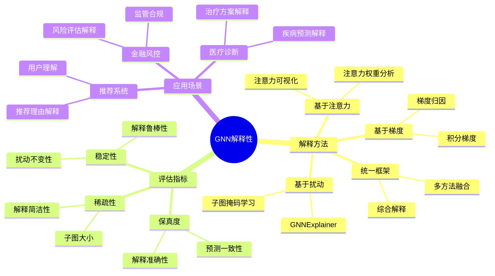
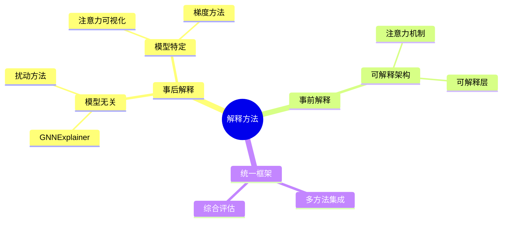
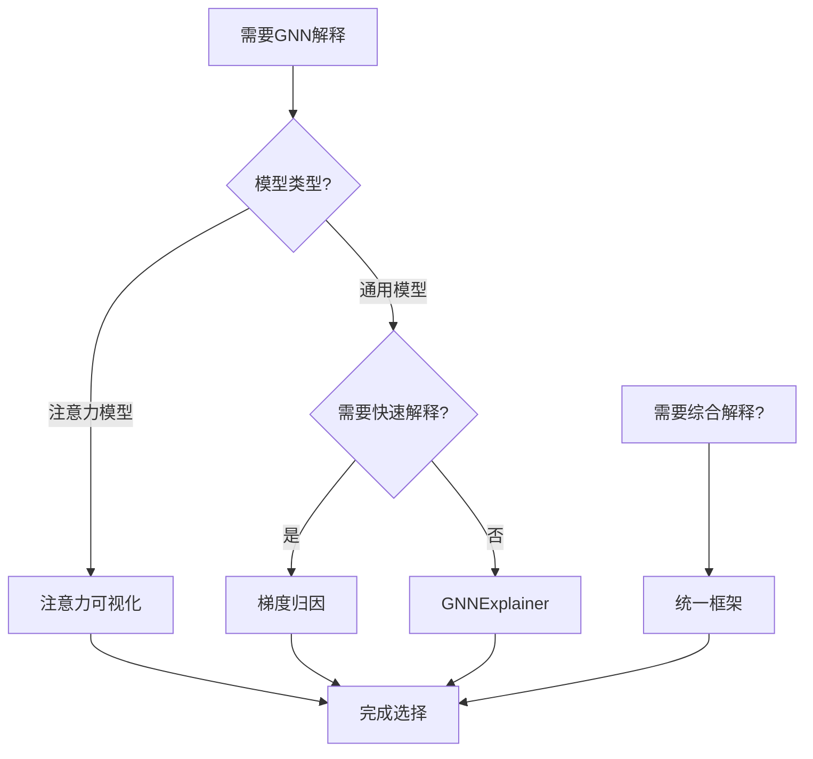
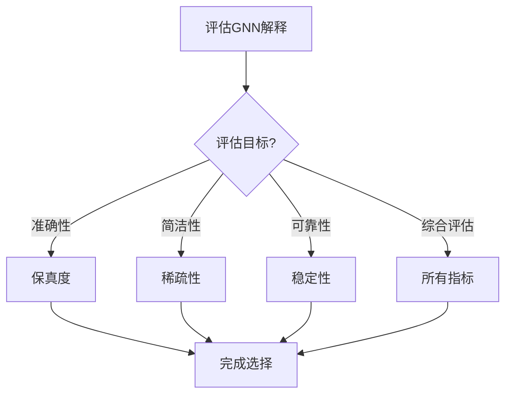
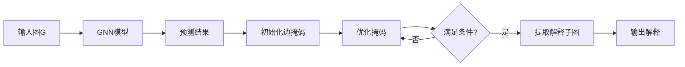
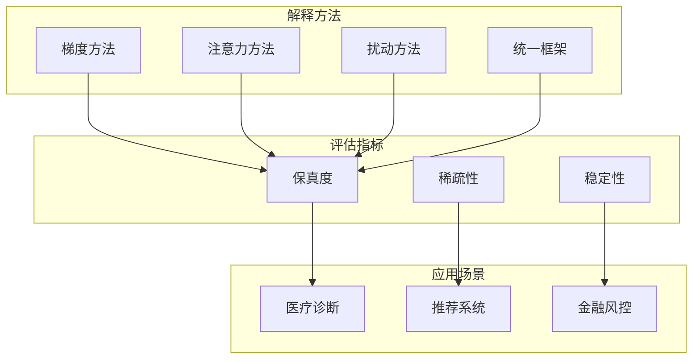
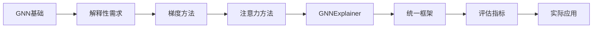
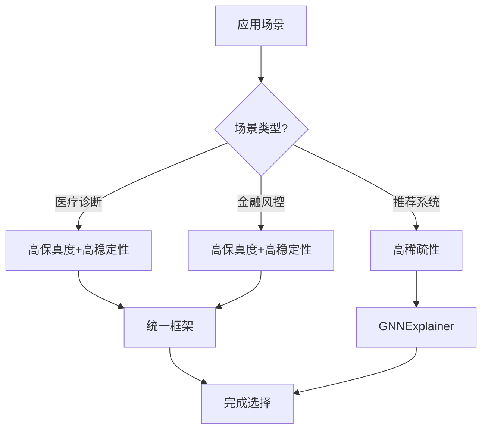

# GNN解释性专题思维表征工具 / GNN Explainability Special Topic Mental Representation Tools 2024-2025

## 📚 **概述 / Overview**

本文档为图神经网络解释性专题提供完整的思维表征工具集合，包括思维导图、对比矩阵、决策树、数据流图等多种表征方式。

**创建时间**: 2025年1月
**状态**: ✅ 完成
**专题**: 图神经网络解释性（2024-2025最新研究）
**相关文档**: [图神经网络解释性专题-2024-2025.md](图神经网络解释性专题-2024-2025.md)

---

## 🗺️ **一、思维导图 / Mind Maps**

### 1.1 GNN解释性完整思维导图

### 1.2 解释方法分类思维导图

---

## 📊 **二、对比矩阵 / Comparison Matrices**

### 2.1 GNN解释方法对比矩阵

| 解释方法 | 方法类型 | 计算成本 | 解释质量 | 适用场景 | 2024-2025创新 |
|---------|---------|---------|---------|---------|--------------|
| **梯度归因** | 模型特定 | 低 | 中等 | 快速解释 | 基础方法 |
| **注意力可视化** | 模型特定 | 低 | 中等 | 注意力模型 | 基础方法 |
| **GNNExplainer** | 模型无关 | 高 | 高 | 通用场景 | 经典方法 |
| **统一框架** | 混合 | 高 | 很高 | 复杂场景 | 多方法融合 |

### 2.2 解释性评估指标对比矩阵

| 评估指标 | 衡量内容 | 重要性 | 计算方法 | 适用场景 |
|---------|---------|--------|---------|---------|
| **保真度** | 解释准确性 | 高 | 预测一致性 | 所有场景 |
| **稀疏性** | 解释简洁性 | 中等 | 子图大小 | 需要简洁解释 |
| **稳定性** | 解释鲁棒性 | 高 | 扰动不变性 | 需要可靠解释 |

### 2.3 应用场景需求对比矩阵

| 应用场景 | 解释需求 | 保真度要求 | 稀疏性要求 | 稳定性要求 |
|---------|---------|-----------|-----------|-----------|
| **医疗诊断** | 高 | 很高 | 中等 | 很高 |
| **推荐系统** | 中等 | 高 | 高 | 中等 |
| **金融风控** | 很高 | 很高 | 中等 | 很高 |

---

## 🌳 **三、决策树 / Decision Trees**

### 3.1 GNN解释方法选择决策树

### 3.2 解释性评估选择决策树

---

## 🔄 **四、数据流图 / Data Flow Diagrams**

### 4.1 GNNExplainer解释生成数据流

### 4.2 梯度归因解释数据流

---

## 🗺️ **五、概念地图 / Concept Maps**

### 5.1 GNN解释性核心概念关系

---

## 📈 **六、学习路径 / Learning Paths**

### 6.1 GNN解释性学习逻辑路径

### 6.2 学习步骤说明

1. **步骤A: GNN基础**
   - 理解GNN的工作原理
   - 掌握消息传递机制

2. **步骤B: 解释性需求**
   - 理解为什么需要解释性
   - 掌握不同应用场景的需求

3. **步骤C-E: 解释方法**
   - 学习梯度、注意力、扰动方法
   - 理解不同方法的优缺点

4. **步骤F: 统一框架**
   - 学习多方法融合
   - 掌握综合解释

5. **步骤G: 评估指标**
   - 学习保真度、稀疏性、稳定性
   - 掌握评估方法

---

## 🎯 **七、应用场景决策树 / Application Scenario Decision Trees**

### 7.1 解释方法应用选择决策树

---

## 📊 **八、性能对比矩阵 / Performance Comparison Matrix**

### 8.1 不同解释方法性能对比

| 解释方法 | 保真度 | 稀疏性 | 稳定性 | 计算时间 |
|---------|--------|--------|--------|---------|
| **梯度归因** | 中等 | 中等 | 中等 | 短 |
| **注意力可视化** | 中等 | 中等 | 中等 | 短 |
| **GNNExplainer** | 高 | 高 | 高 | 长 |
| **统一框架** | 很高 | 高 | 很高 | 很长 |

---

## 🔗 **九、相关链接 / Related Links**

- [图神经网络解释性专题-2024-2025.md](图神经网络解释性专题-2024-2025.md) - 详细技术文档
- [图机器学习-深度改进版-2025.md](图机器学习-深度改进版-2025.md) - 图机器学习总览
- [思维表征工具-图论基础.md](../../思维表征工具-图论基础.md) - 图论基础思维工具

---

**文档版本**: v1.0
**创建时间**: 2025年1月
**最后更新**: 2025年1月
**维护者**: GraphNetWorkCommunicate项目组
**状态**: ✅ 完成
