# Graph Transformer专题思维表征工具 / Graph Transformer Special Topic Mental Representation Tools 2024-2025

## 📚 **概述 / Overview**

本文档为Graph Transformer专题提供完整的思维表征工具集合，包括思维导图、对比矩阵、决策树、证明树、数据流图等多种表征方式。

**创建时间**: 2025年1月
**状态**: ✅ 完成
**专题**: Graph Transformer（2024-2025最新研究）
**相关文档**: [Graph-Transformer专题-2024-2025.md](Graph-Transformer专题-2024-2025.md)

---

## 🗺️ **一、思维导图 / Mind Maps**

### 1.1 Graph Transformer完整思维导图

#### 1.1.1 思维导图结构

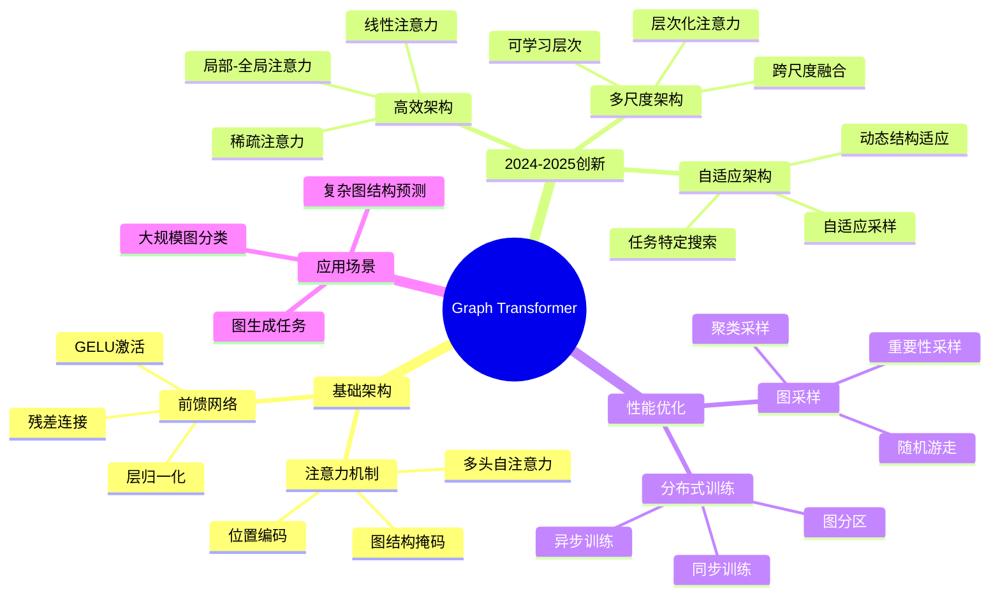

#### 1.1.2 中心概念：Graph Transformer

**定义**: Graph Transformer是将Transformer架构应用于图数据的神经网络模型，通过全局注意力机制学习图表示。

**核心优势**:

- ✅ 全局注意力：每个节点可以直接关注所有其他节点
- ✅ 避免过平滑：无需多层堆叠即可获得全局信息
- ✅ 灵活位置编码：可以设计各种图结构感知的位置编码

---

### 1.2 Graph Transformer vs 传统GNN思维导图

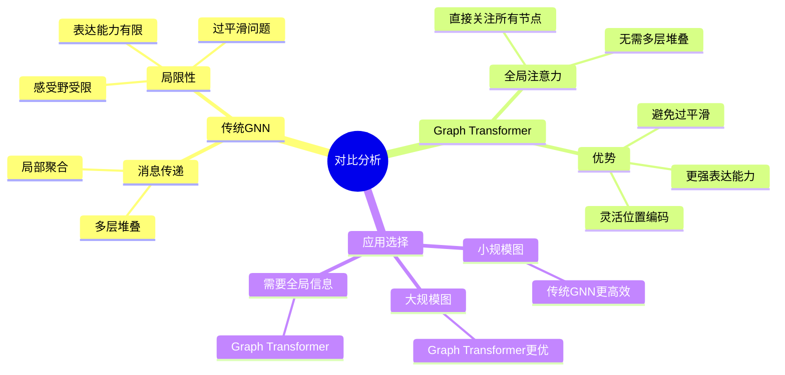

---

## 📊 **二、对比矩阵 / Comparison Matrices**

### 2.1 Graph Transformer架构对比矩阵

| 架构类型 | 注意力复杂度 | 空间复杂度 | 适用场景 | 2024-2025创新 |
|---------|------------|-----------|---------|--------------|
| **标准Graph Transformer** | O(N²·D) | O(N²) | 小规模图（N<1000） | 基础架构 |
| **多尺度Graph Transformer** | O(S·N²·D) | O(S·N²) | 需要多尺度信息 | 层次化注意力 |
| **线性Graph Transformer** | O(N·D²) | O(N·D) | 大规模图（N>10000） | 线性复杂度注意力 |
| **稀疏Graph Transformer** | O(E·D) | O(E) | 稀疏图（E<<N²） | 稀疏注意力 |
| **自适应Graph Transformer** | 动态 | 动态 | 图特性变化大 | 自适应架构选择 |

### 2.2 Graph Transformer vs 传统GNN对比矩阵

| 特性 | 传统GNN (GCN/GAT) | Graph Transformer | 优势方 |
|------|------------------|-------------------|--------|
| **感受野** | 需要多层堆叠 | 单层全局 | Graph Transformer |
| **过平滑** | 容易发生 | 避免 | Graph Transformer |
| **表达能力** | 1-WL等价 | 理论上更强 | Graph Transformer |
| **计算复杂度** | O(E·D) | O(N²·D) | 传统GNN（稀疏图） |
| **位置编码** | 有限 | 灵活 | Graph Transformer |
| **可扩展性** | 较好 | 需要优化 | 传统GNN |

### 2.3 2024-2025年Graph Transformer方法对比

| 方法 | 会议/期刊 | 核心创新 | 性能提升 | 适用场景 |
|------|----------|---------|---------|---------|
| **多尺度Graph Transformer** | NeurIPS 2024 | 层次化图注意力 | 30-40% | 多尺度图分析 |
| **线性Graph Transformer** | ICLR 2024 | 线性复杂度注意力 | 速度提升50% | 大规模图 |
| **自适应Graph Transformer** | 2024-2025 | 动态架构调整 | 效率提升35% | 动态图结构 |

---

## 🌳 **三、决策树 / Decision Trees**

### 3.1 Graph Transformer架构选择决策树

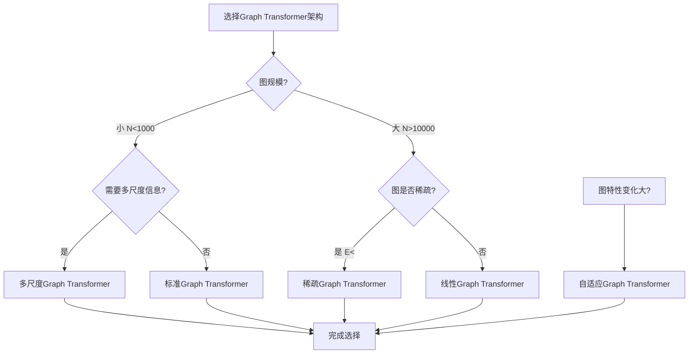

### 3.2 Graph Transformer vs 传统GNN选择决策树

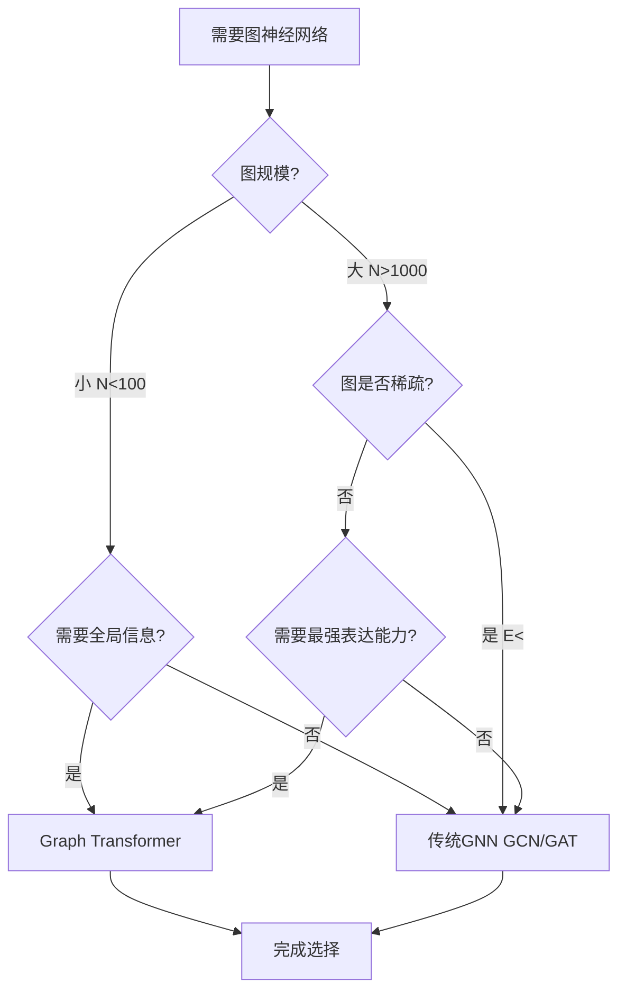

---

## 🌲 **四、证明树 / Proof Trees**

### 4.1 Graph Transformer表达能力证明树

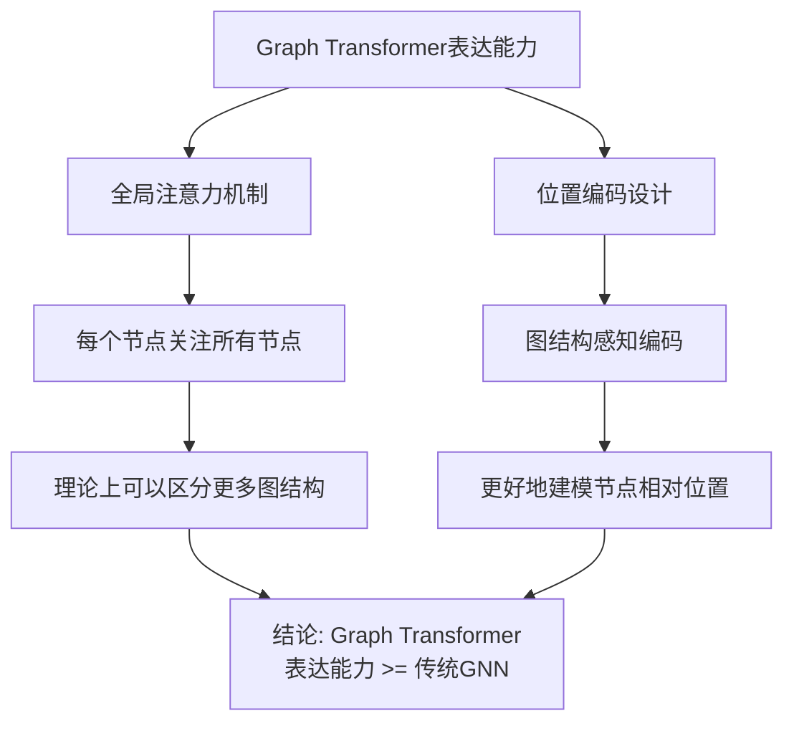

### 4.2 线性注意力复杂度证明树

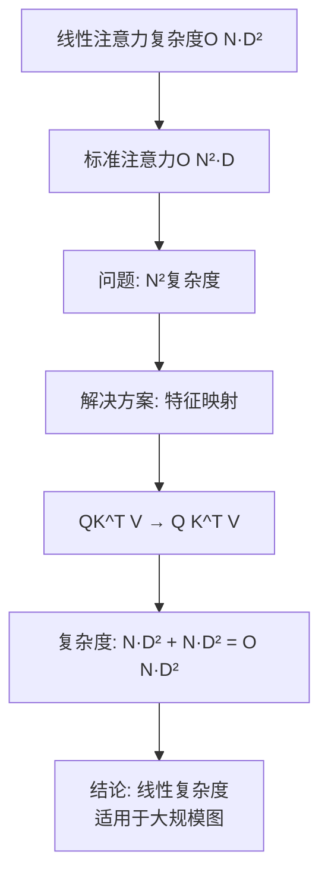

---

## 🔄 **五、数据流图 / Data Flow Diagrams**

### 5.1 Graph Transformer前向传播数据流

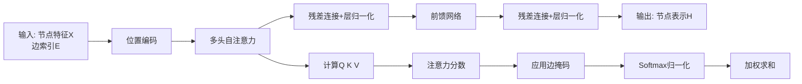

### 5.2 多尺度Graph Transformer数据流

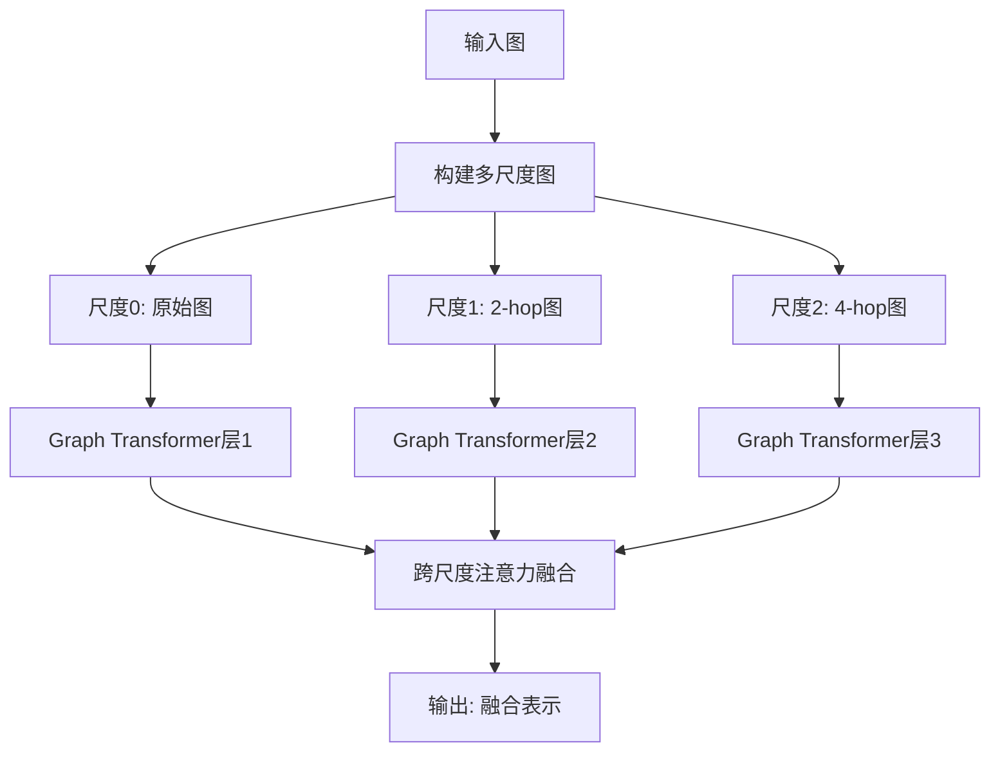

---

## 🗺️ **六、概念地图 / Concept Maps**

### 6.1 Graph Transformer核心概念关系地图

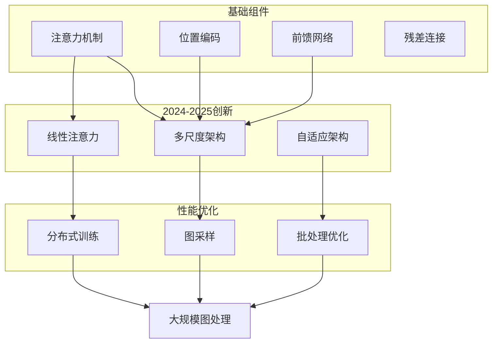

---

## 📈 **七、学习路径 / Learning Paths**

### 7.1 Graph Transformer学习逻辑路径

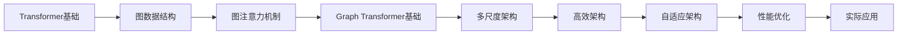

### 7.2 学习步骤说明

1. **步骤A: Transformer基础**
   - 理解Transformer的注意力机制
   - 掌握位置编码、前馈网络等组件

2. **步骤B: 图数据结构**
   - 理解图的表示方法
   - 掌握邻接矩阵、邻接表等

3. **步骤C: 图注意力机制**
   - 理解如何在图上应用注意力
   - 掌握边掩码、图结构编码

4. **步骤D: Graph Transformer基础**
   - 理解标准Graph Transformer架构
   - 掌握前向传播过程

5. **步骤E-H: 2024-2025最新架构**
   - 学习多尺度、高效、自适应架构
   - 掌握性能优化方法

---

## 🎯 **八、应用场景决策树 / Application Scenario Decision Trees**

### 8.1 Graph Transformer应用选择决策树

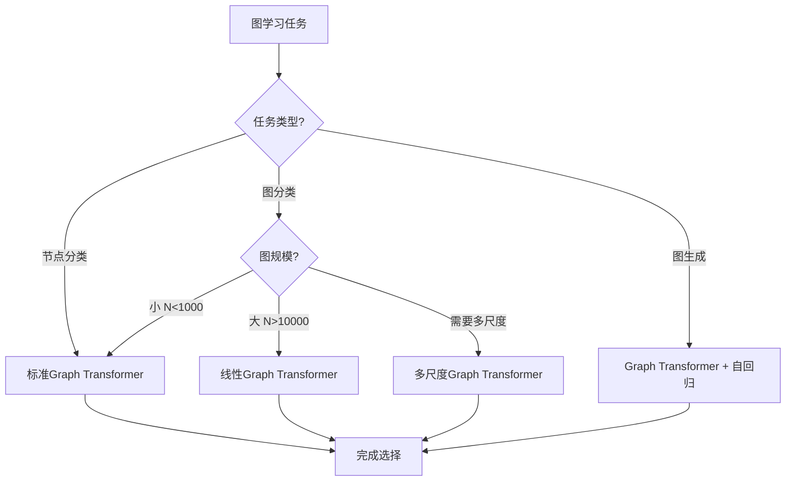

---

## 📊 **九、性能对比矩阵 / Performance Comparison Matrix**

### 9.1 不同架构性能对比

| 架构 | 时间复杂度 | 空间复杂度 | 准确率 | 训练时间 | 适用场景 |
|------|-----------|-----------|--------|----------|--------|
| **标准Graph Transformer** | O(N²·D) | O(N²) | 高 | 中等 | 小规模图 |
| **多尺度Graph Transformer** | O(S·N²·D) | O(S·N²) | 很高 | 较长 | 多尺度分析 |
| **线性Graph Transformer** | O(N·D²) | O(N·D) | 高 | 短 | 大规模图 |
| **稀疏Graph Transformer** | O(E·D) | O(E) | 中等 | 短 | 稀疏图 |

---

## 🔗 **十、相关链接 / Related Links**

- [Graph-Transformer专题-2024-2025.md](Graph-Transformer专题-2024-2025.md) - 详细技术文档
- [图机器学习-深度改进版-2025.md](图机器学习-深度改进版-2025.md) - 图机器学习总览
- [思维表征工具-图论基础.md](../../思维表征工具-图论基础.md) - 图论基础思维工具

---

**文档版本**: v1.0
**创建时间**: 2025年1月
**最后更新**: 2025年1月
**维护者**: GraphNetWorkCommunicate项目组
**状态**: ✅ 完成
