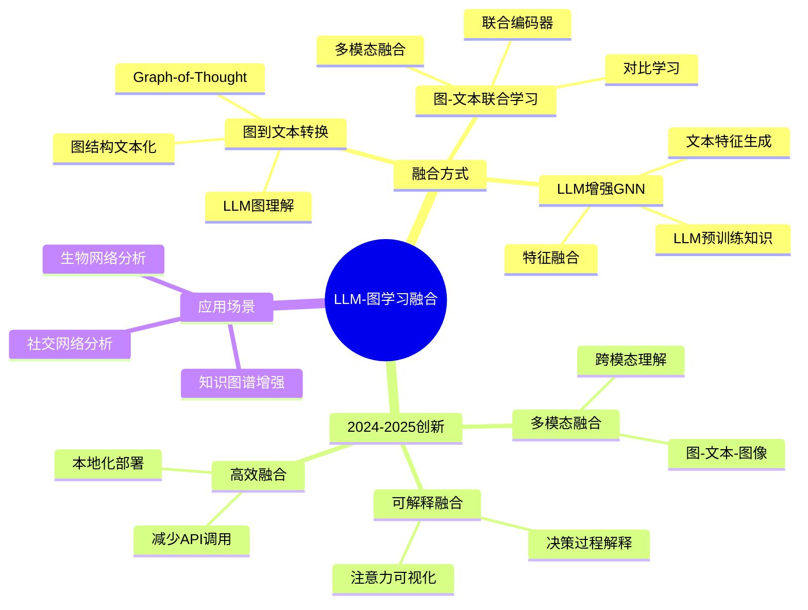
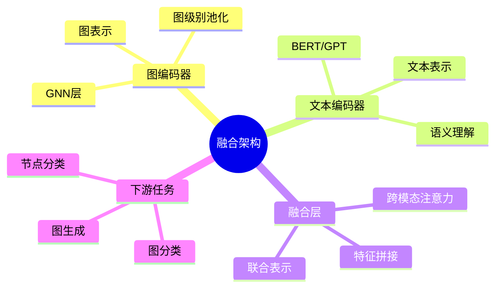
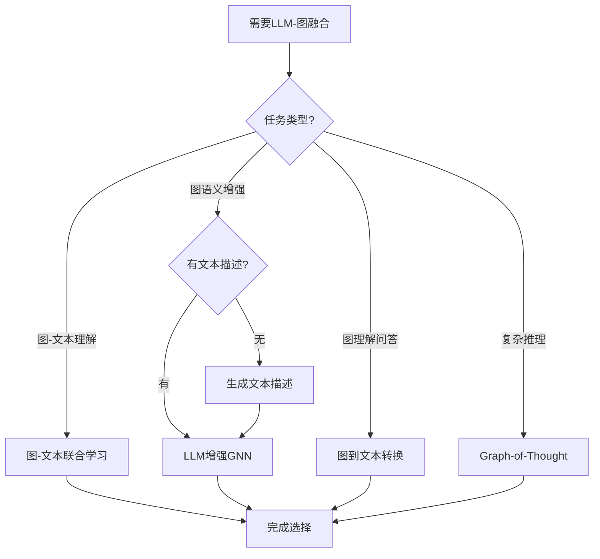
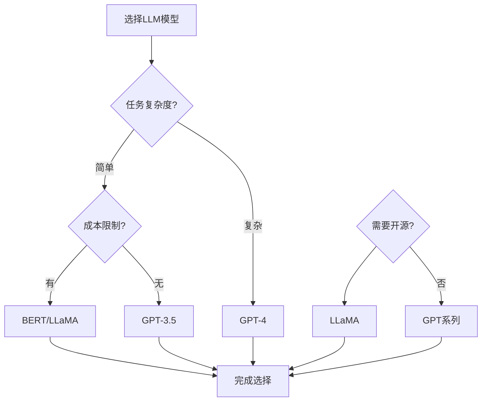
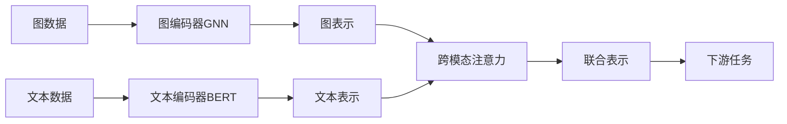
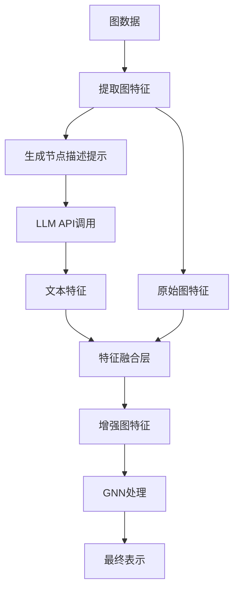
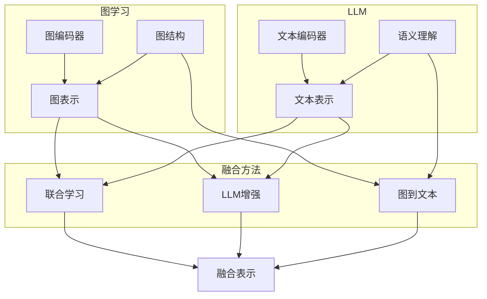
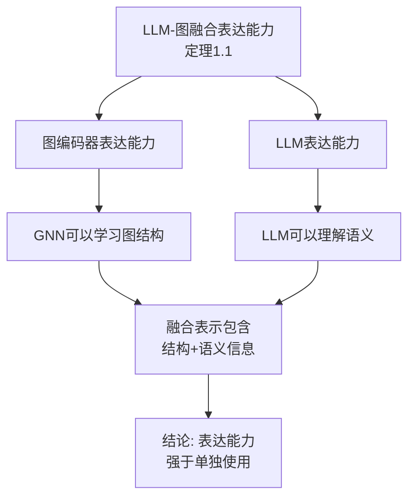
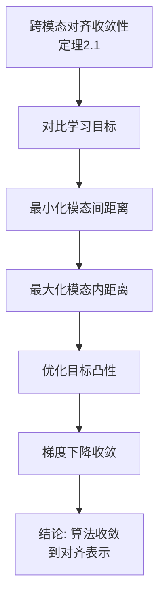
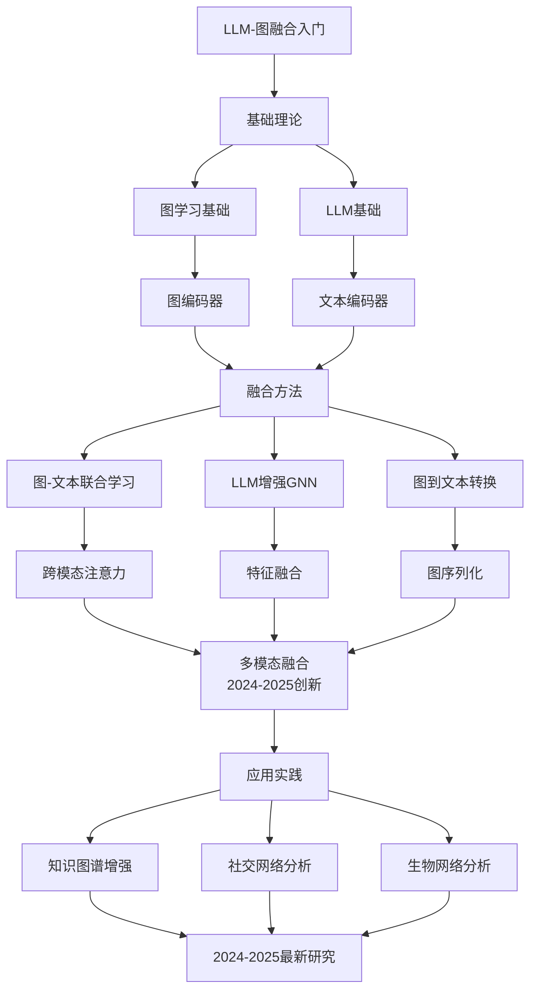

# LLM与图学习融合专题思维表征工具 / LLM-Graph Learning Fusion Special Topic Mental Representation Tools 2024-2025

## 📚 **概述 / Overview**

本文档为LLM与图学习融合专题提供完整的思维表征工具集合，包括思维导图、对比矩阵、决策树、数据流图等多种表征方式。

**创建时间**: 2025年1月
**状态**: ✅ 完成
**专题**: LLM与图学习融合（2024-2025最新研究）
**相关文档**: [LLM与图学习融合专题-2024-2025.md](LLM与图学习融合专题-2024-2025.md)

---

## 🗺️ **一、思维导图 / Mind Maps**

### 1.1 LLM与图学习融合完整思维导图

### 1.2 融合架构思维导图

---

## 📊 **二、对比矩阵 / Comparison Matrices**

### 2.1 LLM-图融合方法对比矩阵

| 融合方法 | 融合方式 | 优势 | 劣势 | 适用场景 |
|---------|---------|------|------|---------|
| **图-文本联合学习** | 同时编码图和文本 | 多模态理解强 | 需要配对数据 | 有文本描述的图 |
| **LLM增强GNN** | LLM生成文本特征 | 利用预训练知识 | API调用成本高 | 需要语义理解 |
| **图到文本转换** | 图→文本→LLM处理 | 利用LLM能力 | 信息可能丢失 | 图理解任务 |
| **Graph-of-Thought** | 图结构用于推理 | 结构化推理 | 实现复杂 | 复杂推理任务 |

### 2.2 LLM模型选择对比矩阵

| LLM模型 | 参数量 | 图理解能力 | 成本 | 适用场景 |
|---------|--------|-----------|------|---------|
| **GPT-4** | 1.7T | 强 | 高 | 复杂图理解任务 |
| **GPT-3.5** | 175B | 中等 | 中 | 一般图理解任务 |
| **BERT** | 340M | 中等 | 低 | 图-文本联合编码 |
| **LLaMA** | 7B-70B | 中等 | 中 | 开源部署 |

---

## 🌳 **三、决策树 / Decision Trees**

### 3.1 LLM-图融合方法选择决策树

### 3.2 LLM模型选择决策树

---

## 🔄 **四、数据流图 / Data Flow Diagrams**

### 4.1 图-文本联合学习数据流

### 4.2 LLM增强GNN数据流

---

## 🗺️ **五、概念地图 / Concept Maps**

### 5.1 LLM-图融合核心概念关系

---

## 📈 **六、应用场景矩阵 / Application Scenario Matrix**

### 6.1 应用场景与方法匹配

| 应用场景 | 推荐方法 | 原因 | 示例 |
|---------|---------|------|------|
| **知识图谱问答** | 图到文本转换 | 需要自然语言理解 | 回答"哪些蛋白质相互作用？" |
| **社交网络分析** | 图-文本联合学习 | 有用户文本内容 | 分析用户行为和文本内容 |
| **生物网络分析** | LLM增强GNN | 需要文献知识增强 | 蛋白质功能预测 |
| **推荐系统** | 图-文本联合学习 | 有商品描述文本 | 商品推荐 |

---

## 🔬 **六、证明树 / Proof Trees**

### 6.1 LLM-图融合表达能力证明树

### 6.2 跨模态对齐学习收敛性证明树

---

## 📈 **七、学习路径图 / Learning Path Diagrams**

### 7.1 LLM与图学习融合学习路径

---

## 📝 **八、总结 / Summary**

### 8.1 思维表征工具使用指南

1. **思维导图**: 快速理解LLM与图学习融合的知识结构
2. **对比矩阵**: 比较不同融合方法、LLM模型的优缺点
3. **决策树**: 选择合适融合方法、LLM模型
4. **证明树**: 理解理论证明过程（表达能力、收敛性）
5. **数据流图**: 理解融合方法的执行流程
6. **概念地图**: 理解概念间的关系
7. **学习路径图**: 规划学习路径

### 8.2 工具更新说明

本文档将随着LLM与图学习融合领域的发展持续更新，确保包含最新的研究进展和方法。

---

**文档版本**: v1.0
**创建时间**: 2025年1月
**最后更新**: 2025年1月
**维护者**: GraphNetWorkCommunicate项目组
**状态**: ✅ 完成
