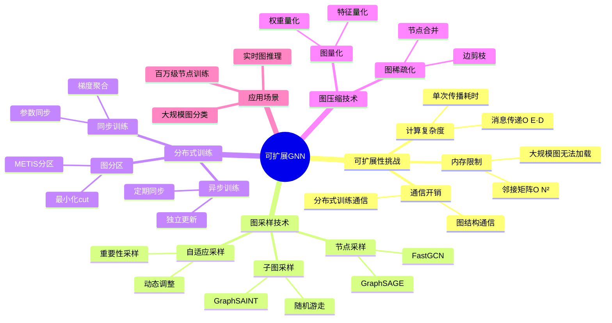
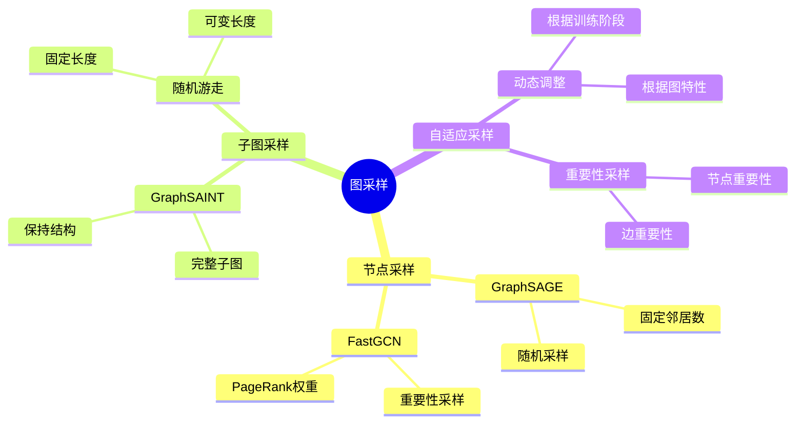
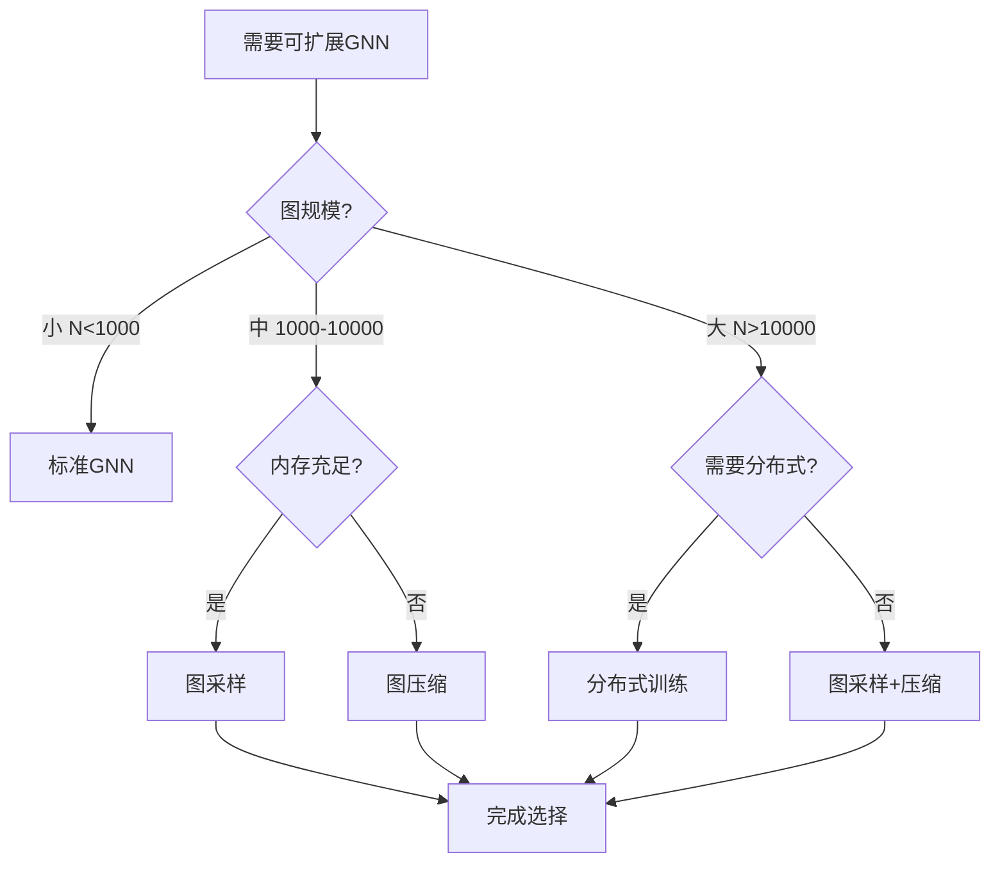
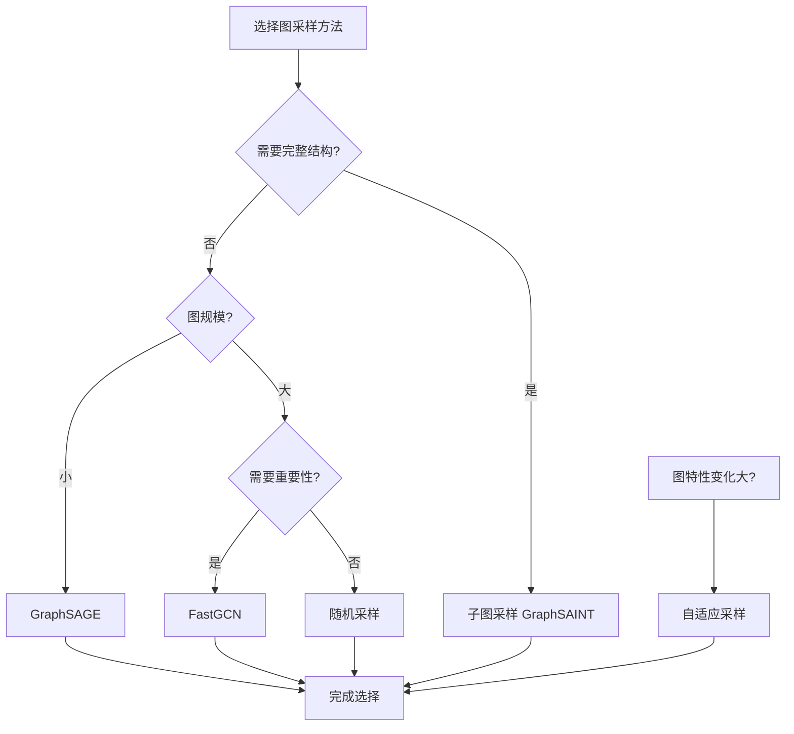
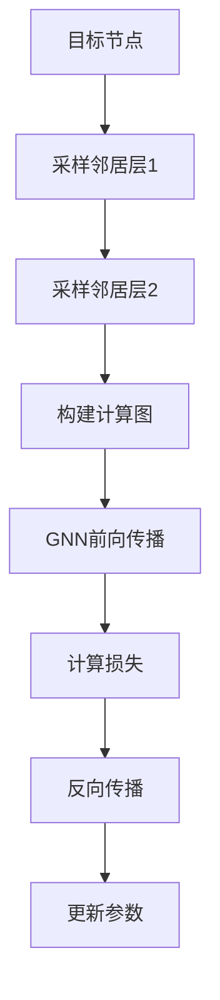
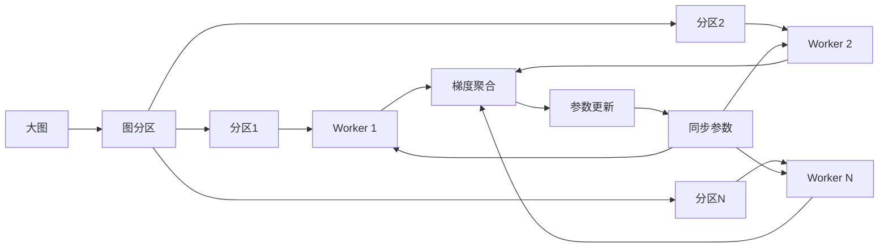
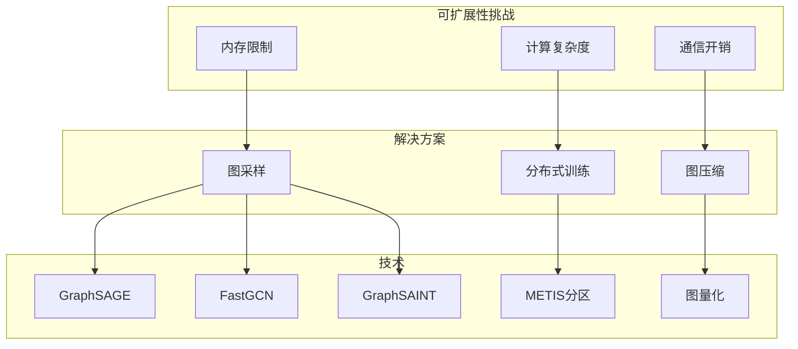
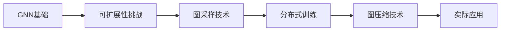
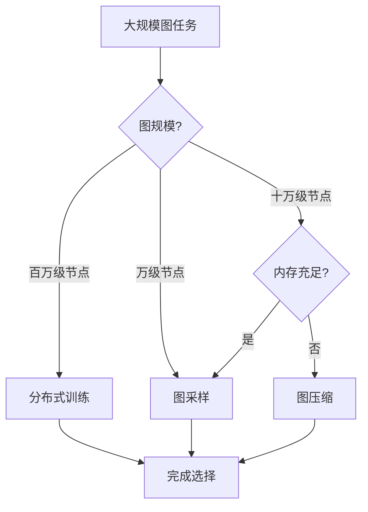

# 可扩展图神经网络专题思维表征工具 / Scalable GNN Special Topic Mental Representation Tools 2024-2025

## 📚 **概述 / Overview**

本文档为可扩展图神经网络专题提供完整的思维表征工具集合，包括思维导图、对比矩阵、决策树、数据流图等多种表征方式。

**创建时间**: 2025年1月
**状态**: ✅ 完成
**专题**: 可扩展图神经网络（2024-2025最新研究）
**相关文档**: [可扩展图神经网络专题-2024-2025.md](可扩展图神经网络专题-2024-2025.md)

---

## 🗺️ **一、思维导图 / Mind Maps**

### 1.1 可扩展GNN完整思维导图

### 1.2 图采样方法思维导图

---

## 📊 **二、对比矩阵 / Comparison Matrices**

### 2.1 图采样方法对比矩阵

| 采样方法 | 采样粒度 | 保持结构 | 计算成本 | 适用场景 | 2024-2025创新 |
|---------|---------|---------|---------|---------|--------------|
| **GraphSAGE** | 节点级 | 部分 | 低 | 小规模图 | 经典方法 |
| **FastGCN** | 节点级 | 部分 | 低 | 中等规模图 | 重要性采样 |
| **GraphSAINT** | 子图级 | 高 | 中等 | 大规模图 | 子图采样 |
| **自适应采样** | 混合 | 高 | 动态 | 复杂场景 | 动态调整 |

### 2.2 分布式训练策略对比矩阵

| 训练策略 | 同步方式 | 通信开销 | 收敛速度 | 适用场景 |
|---------|---------|---------|---------|---------|
| **同步训练** | 每步同步 | 高 | 快 | 小规模集群 |
| **异步训练** | 定期同步 | 低 | 中等 | 大规模集群 |
| **混合训练** | 部分同步 | 中等 | 中等 | 中等规模集群 |

### 2.3 图压缩技术对比矩阵

| 压缩技术 | 压缩比 | 精度损失 | 计算成本 | 适用场景 |
|---------|--------|---------|---------|---------|
| **图量化** | 4-8x | 小 | 低 | 推理阶段 |
| **图稀疏化** | 2-10x | 中等 | 中等 | 训练和推理 |
| **图蒸馏** | 2-5x | 小 | 高 | 模型压缩 |

---

## 🌳 **三、决策树 / Decision Trees**

### 3.1 可扩展性方案选择决策树

### 3.2 图采样方法选择决策树

---

## 🔄 **四、数据流图 / Data Flow Diagrams**

### 4.1 GraphSAGE采样和训练数据流

### 4.2 分布式训练数据流

---

## 🗺️ **五、概念地图 / Concept Maps**

### 5.1 可扩展GNN核心概念关系

---

## 📈 **六、学习路径 / Learning Paths**

### 6.1 可扩展GNN学习逻辑路径

### 6.2 学习步骤说明

1. **步骤A: GNN基础**
   - 理解GNN的基本原理
   - 掌握消息传递机制

2. **步骤B: 可扩展性挑战**
   - 理解内存、计算、通信限制
   - 分析大规模图的问题

3. **步骤C: 图采样技术**
   - 学习节点采样、子图采样
   - 掌握不同采样策略

4. **步骤D: 分布式训练**
   - 学习图分区方法
   - 掌握同步/异步训练

5. **步骤E: 图压缩技术**
   - 学习图量化、稀疏化
   - 掌握压缩-精度权衡

---

## 🎯 **七、应用场景决策树 / Application Scenario Decision Trees**

### 7.1 可扩展性方案应用选择决策树

---

## 📊 **八、性能对比矩阵 / Performance Comparison Matrix**

### 8.1 不同方案性能对比

| 方案 | 内存占用 | 训练时间 | 准确率 | 适用规模 |
|------|---------|---------|--------|---------|
| **标准GNN** | 高 | 长 | 高 | N<1000 |
| **图采样** | 低 | 中等 | 中等 | N<100000 |
| **分布式训练** | 低 | 中等 | 高 | N>100000 |
| **图压缩** | 很低 | 短 | 中等 | 推理阶段 |

---

## 🔗 **九、相关链接 / Related Links**

- [可扩展图神经网络专题-2024-2025.md](可扩展图神经网络专题-2024-2025.md) - 详细技术文档
- [图机器学习-深度改进版-2025.md](图机器学习-深度改进版-2025.md) - 图机器学习总览
- [思维表征工具-图论基础.md](../../思维表征工具-图论基础.md) - 图论基础思维工具

---

**文档版本**: v1.0
**创建时间**: 2025年1月
**最后更新**: 2025年1月
**维护者**: GraphNetWorkCommunicate项目组
**状态**: ✅ 完成
