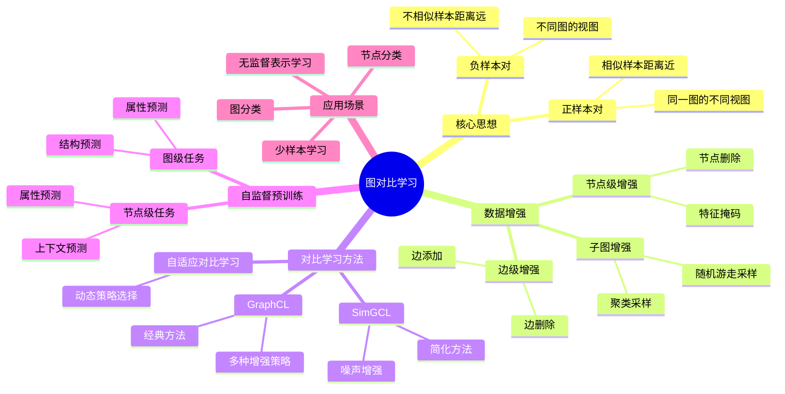
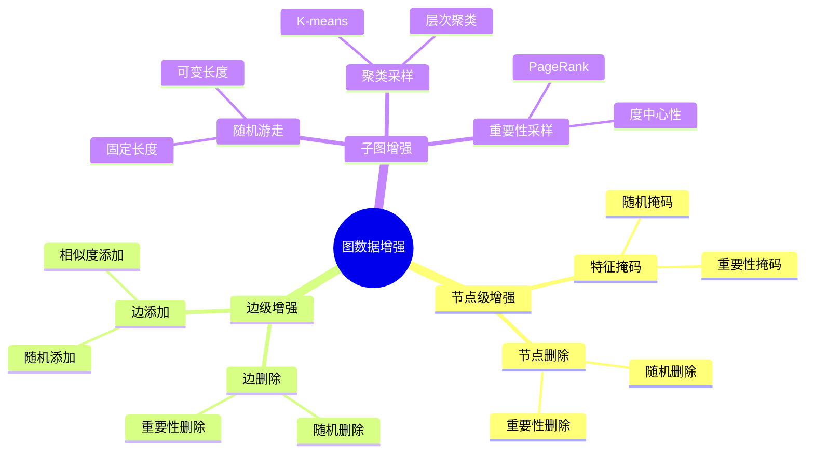
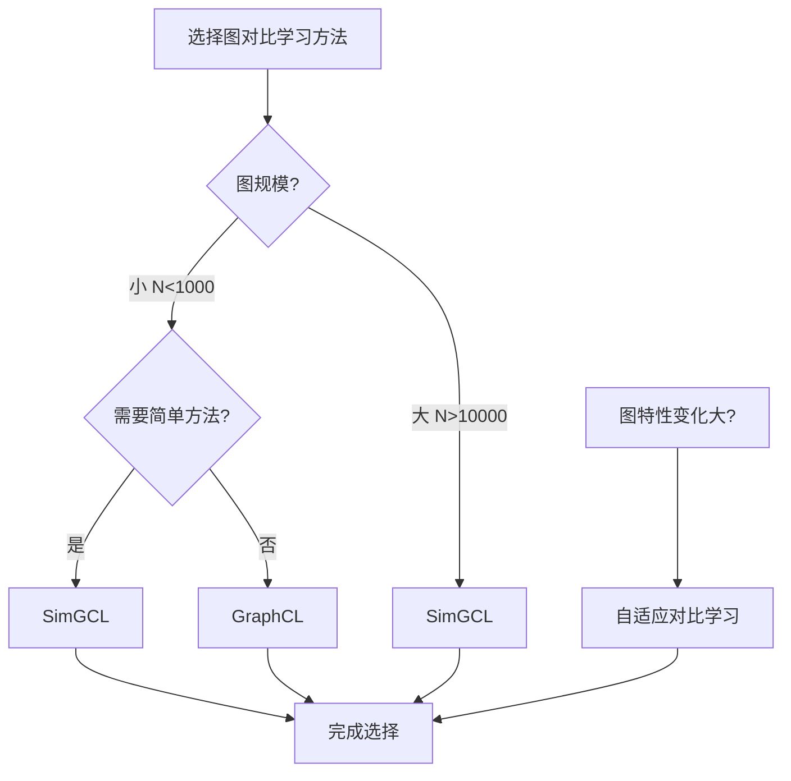
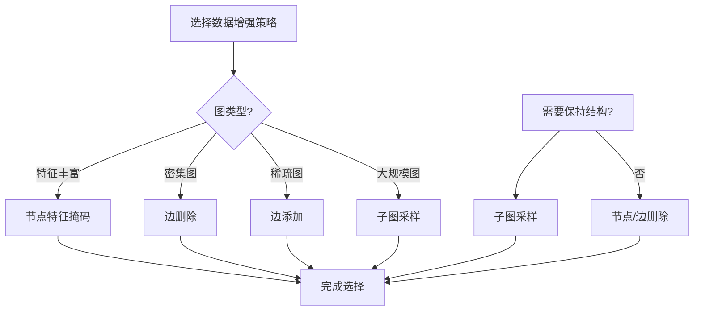
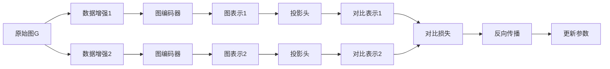
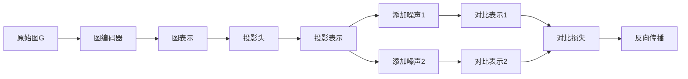
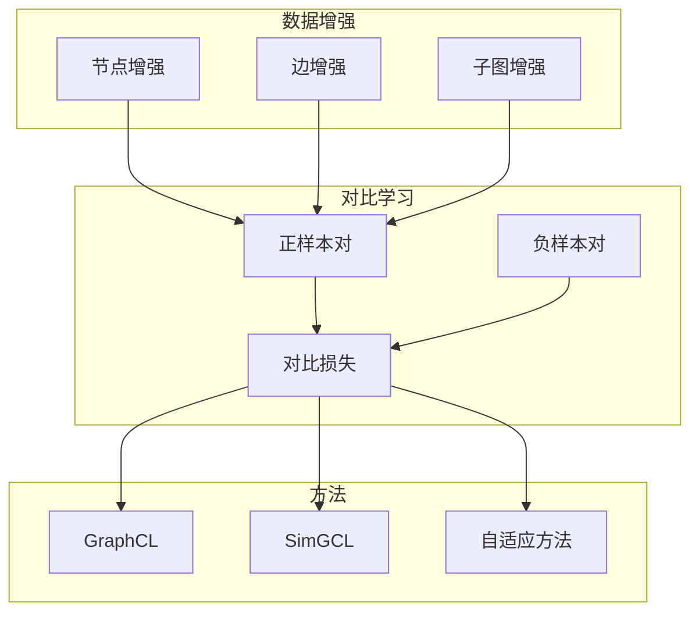
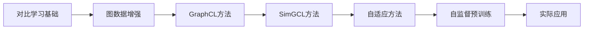
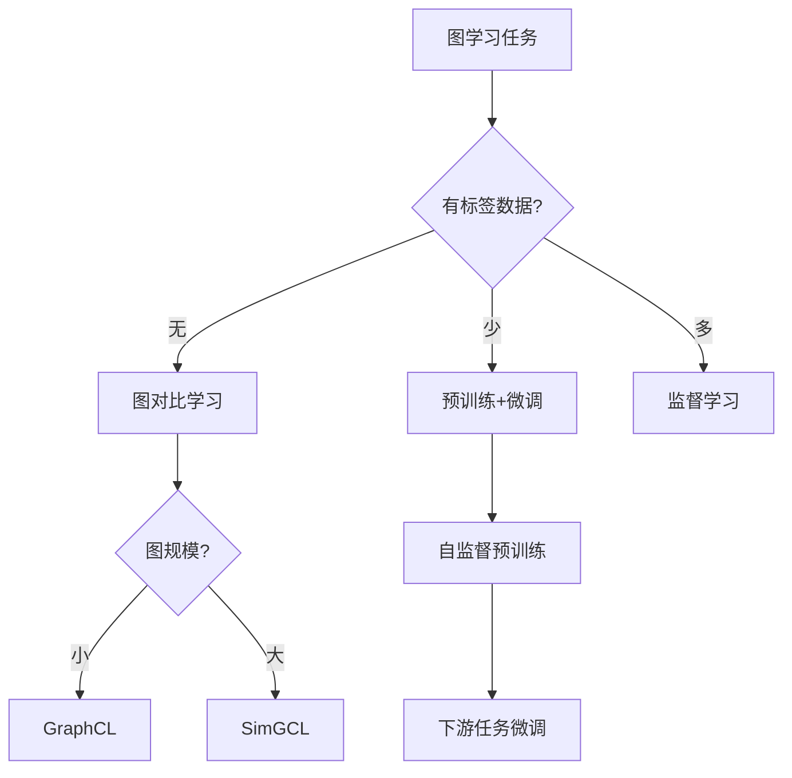

# 图对比学习专题思维表征工具 / Graph Contrastive Learning Special Topic Mental Representation Tools 2024-2025

## 📚 **概述 / Overview**

本文档为图对比学习与自监督学习专题提供完整的思维表征工具集合，包括思维导图、对比矩阵、决策树、数据流图等多种表征方式。

**创建时间**: 2025年1月
**状态**: ✅ 完成
**专题**: 图对比学习与自监督学习（2024-2025最新研究）
**相关文档**: [图对比学习与自监督学习专题-2024-2025.md](图对比学习与自监督学习专题-2024-2025.md)

---

## 🗺️ **一、思维导图 / Mind Maps**

### 1.1 图对比学习完整思维导图

### 1.2 图数据增强方法思维导图

---

## 📊 **二、对比矩阵 / Comparison Matrices**

### 2.1 图对比学习方法对比矩阵

| 方法 | 增强策略 | 复杂度 | 性能 | 适用场景 | 2024-2025创新 |
|------|---------|--------|------|---------|--------------|
| **GraphCL** | 多种增强组合 | O(N²) | 高 | 通用场景 | 基础方法 |
| **SimGCL** | 噪声增强 | O(N) | 高 | 大规模图 | 简化高效 |
| **自适应对比学习** | 动态选择 | 动态 | 很高 | 图特性变化大 | 自适应策略 |

### 2.2 图数据增强方法对比矩阵

| 增强方法 | 保持结构 | 计算成本 | 效果 | 适用场景 |
|---------|---------|---------|------|---------|
| **节点特征掩码** | 高 | 低 | 中等 | 特征丰富的图 |
| **节点删除** | 中等 | 低 | 中等 | 冗余节点多的图 |
| **边删除** | 中等 | 低 | 高 | 密集图 |
| **边添加** | 低 | 中等 | 中等 | 稀疏图 |
| **子图采样** | 高 | 高 | 很高 | 大规模图 |

### 2.3 自监督预训练任务对比矩阵

| 预训练任务 | 任务类型 | 难度 | 效果 | 适用场景 |
|-----------|---------|------|------|---------|
| **节点属性预测** | 节点级 | 中等 | 高 | 有丰富节点属性的图 |
| **上下文预测** | 节点级 | 高 | 很高 | 需要上下文信息的图 |
| **图属性预测** | 图级 | 低 | 中等 | 有图级别标签的图 |
| **多任务预训练** | 混合 | 高 | 很高 | 需要综合能力的场景 |

---

## 🌳 **三、决策树 / Decision Trees**

### 3.1 图对比学习方法选择决策树

### 3.2 数据增强策略选择决策树

---

## 🔄 **四、数据流图 / Data Flow Diagrams**

### 4.1 GraphCL训练数据流

### 4.2 SimGCL训练数据流

---

## 🗺️ **五、概念地图 / Concept Maps**

### 5.1 图对比学习核心概念关系

---

## 📈 **六、学习路径 / Learning Paths**

### 6.1 图对比学习学习逻辑路径

### 6.2 学习步骤说明

1. **步骤A: 对比学习基础**
   - 理解对比学习的核心思想
   - 掌握正负样本对的概念

2. **步骤B: 图数据增强**
   - 学习节点级、边级、子图级增强
   - 掌握不同增强策略的特点

3. **步骤C-E: 对比学习方法**
   - 学习GraphCL、SimGCL等经典方法
   - 理解自适应对比学习

4. **步骤F: 自监督预训练**
   - 学习节点级和图级预训练任务
   - 掌握多任务预训练

---

## 🎯 **七、应用场景决策树 / Application Scenario Decision Trees**

### 7.1 图对比学习应用选择决策树

---

## 📊 **八、性能对比矩阵 / Performance Comparison Matrix**

### 8.1 不同方法性能对比

| 方法 | 准确率 | 训练时间 | 内存占用 | 适用场景 |
|------|--------|----------|---------|---------|
| **GraphCL** | 高 | 中等 | 中等 | 通用场景 |
| **SimGCL** | 高 | 短 | 低 | 大规模图 |
| **自适应对比学习** | 很高 | 中等 | 中等 | 复杂场景 |

---

## 🔗 **九、相关链接 / Related Links**

- [图对比学习与自监督学习专题-2024-2025.md](图对比学习与自监督学习专题-2024-2025.md) - 详细技术文档
- [图机器学习-深度改进版-2025.md](图机器学习-深度改进版-2025.md) - 图机器学习总览
- [思维表征工具-图论基础.md](../../思维表征工具-图论基础.md) - 图论基础思维工具

---

**文档版本**: v1.0
**创建时间**: 2025年1月
**最后更新**: 2025年1月
**维护者**: GraphNetWorkCommunicate项目组
**状态**: ✅ 完成
