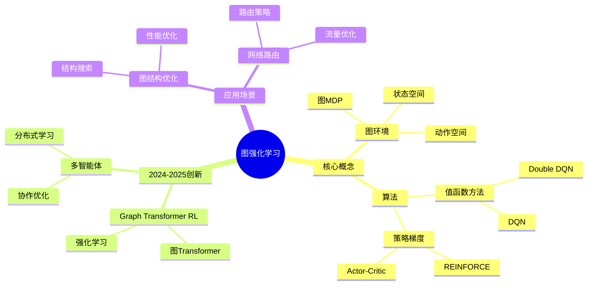
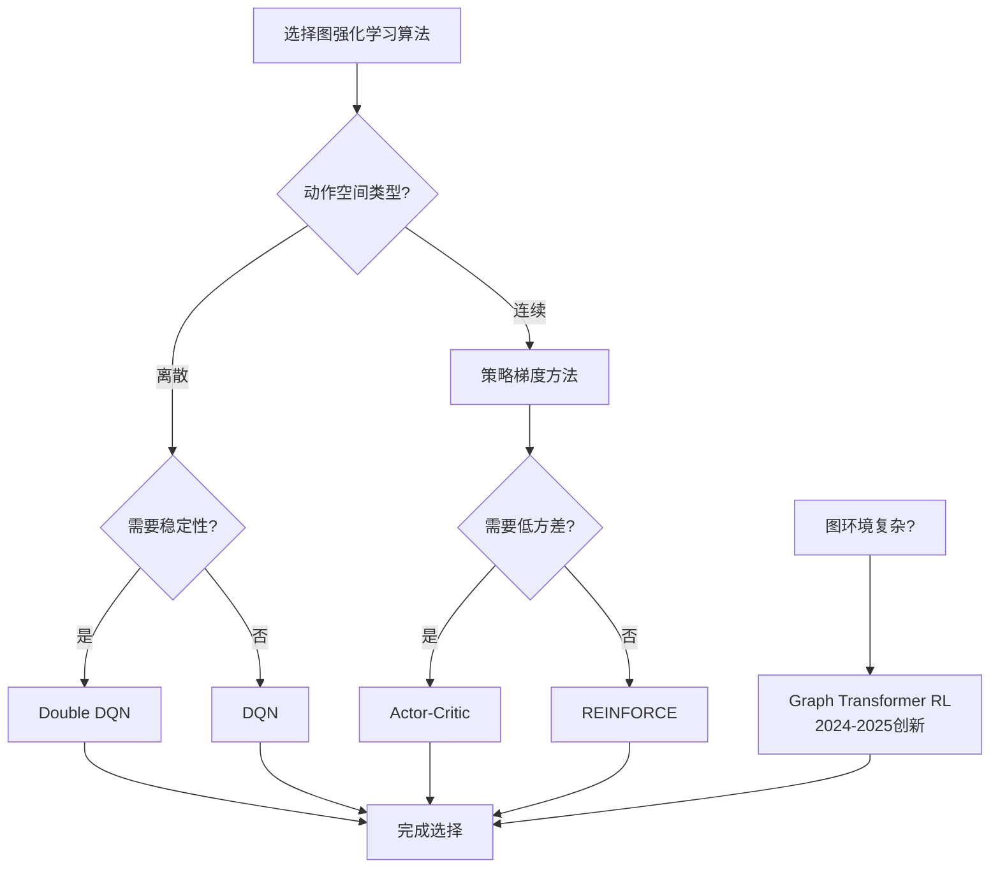
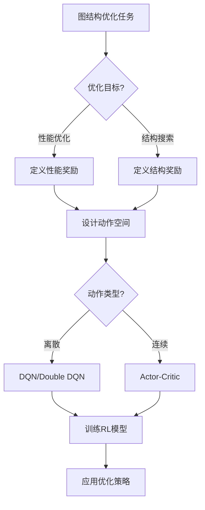
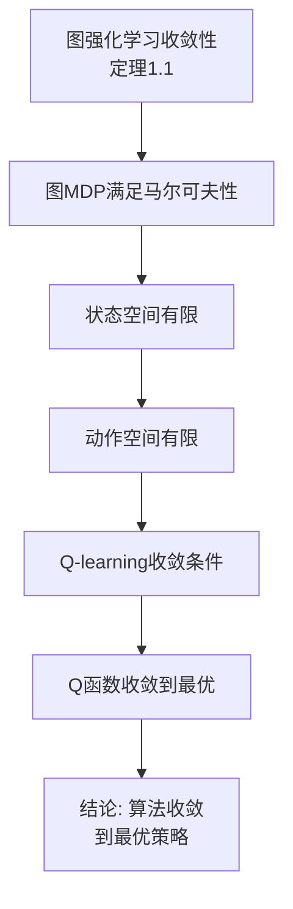
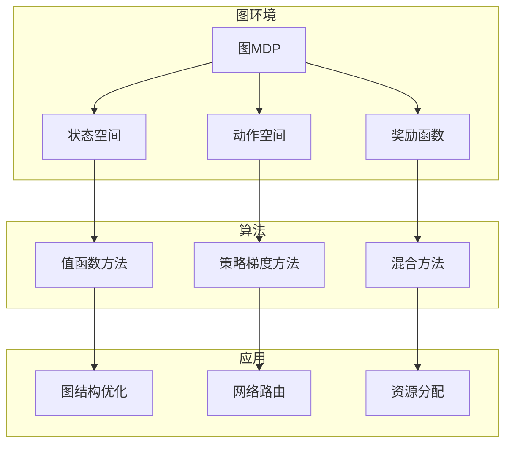
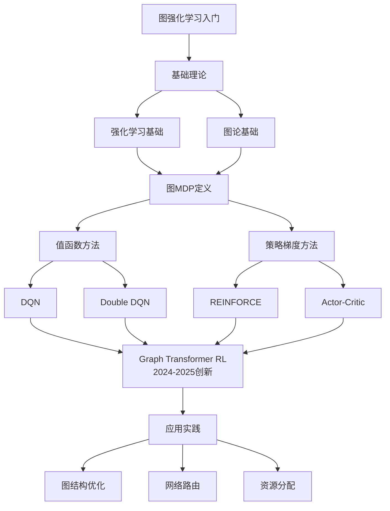

# 图强化学习专题思维表征工具 / Graph Reinforcement Learning Special Topic Mental Representation Tools 2024-2025

## 📚 **概述 / Overview**

本文档为图强化学习专题提供完整的思维表征工具集合。

**创建时间**: 2025年1月
**状态**: ✅ 完成
**专题**: 图强化学习（2024-2025最新研究）
**相关文档**: [图强化学习专题-2024-2025.md](图强化学习专题-2024-2025.md)

---

## 🗺️ **一、思维导图 / Mind Maps**

### 1.1 图强化学习完整思维导图



---

## 📊 **二、对比矩阵 / Comparison Matrices**

### 2.1 图强化学习算法对比矩阵

| 算法 | 算法类型 | 适用场景 | 优势 | 劣势 | 2024-2025创新 |
|------|---------|---------|------|------|--------------|
| **DQN** | 值函数方法 | 离散动作空间 | 稳定、易实现 | 需要离散化 | 基础方法 |
| **Double DQN** | 值函数方法 | 离散动作空间 | 减少过估计 | 需要离散化 | 改进方法 |
| **REINFORCE** | 策略梯度 | 连续动作空间 | 直接优化策略 | 高方差 | 基础方法 |
| **Actor-Critic** | 策略梯度 | 连续动作空间 | 低方差 | 需要两个网络 | 改进方法 |
| **Graph Transformer RL** | 混合方法 | 复杂图环境 | 强大表达能力 | 计算复杂 | 2024-2025创新 |

### 2.2 图MDP定义对比矩阵

| 组件 | 定义 | 特点 | 示例 |
|------|------|------|------|
| **状态空间** | 图结构状态 | 高维、结构化 | 当前图拓扑 |
| **动作空间** | 图操作动作 | 离散/连续 | 添加/删除边 |
| **奖励函数** | 性能指标 | 任务相关 | 图性能提升 |
| **转移概率** | 状态转移 | 确定性/随机 | 动作执行结果 |

---

## 🌳 **三、决策树 / Decision Trees**

### 3.1 图强化学习算法选择决策树



### 3.2 图结构优化应用决策树



---

## 🔬 **四、证明树 / Proof Trees**

### 4.1 图强化学习收敛性证明树



### 4.2 策略梯度无偏性证明树

```mermaid
flowchart TD
    A[策略梯度无偏性<br/>定理2.1] --> B[策略梯度定理]

    B --> C[∇J = E[∇log π·Q]]
    C --> D[期望值计算]

    D --> E[结论: 梯度估计无偏<br/>可以用于优化]
```

---

## 🔄 **五、数据流图 / Data Flow Diagrams**

### 5.1 DQN训练数据流

```mermaid
flowchart LR
    A[当前状态s_t] --> B[选择动作a_t<br/>ε-贪婪]
    B --> C[执行动作]
    C --> D[获得奖励r_t]
    D --> E[下一状态s_{t+1}]

    E --> F[存储经验<br/>s_t a_t r_t s_{t+1}]
    F --> G[采样批次]
    G --> H[计算目标Q值]
    H --> I[更新Q网络]
    I --> J[定期更新目标网络]
```

### 5.2 Actor-Critic训练数据流

```mermaid
flowchart TD
    A[当前状态s_t] --> B[Actor网络]
    B --> C[策略π a_t|s_t]
    C --> D[执行动作a_t]
    D --> E[获得奖励r_t]
    E --> F[下一状态s_{t+1}]

    F --> G[Critic网络]
    G --> H[价值函数V s_t]

    H --> I[计算优势函数]
    I --> J[更新Actor]
    J --> K[更新Critic]
```

---

## 🗺️ **六、概念地图 / Concept Maps**

### 6.1 图强化学习核心概念关系地图



---

## 📈 **七、学习路径图 / Learning Path Diagrams**

### 7.1 图强化学习学习路径



---

## 📝 **八、总结 / Summary**

### 8.1 思维表征工具使用指南

1. **思维导图**: 快速理解图强化学习的知识结构
2. **对比矩阵**: 比较不同算法、MDP定义的优缺点
3. **决策树**: 选择合适算法、应用场景
4. **证明树**: 理解理论证明过程（收敛性、无偏性）
5. **数据流图**: 理解算法训练流程
6. **概念地图**: 理解概念间的关系
7. **学习路径图**: 规划学习路径

### 8.2 工具更新说明

本文档将随着图强化学习领域的发展持续更新，确保包含最新的研究进展和方法。

---

**文档版本**: v1.0
**创建时间**: 2025年1月
**最后更新**: 2025年1月
**维护者**: GraphNetWorkCommunicate项目组
**状态**: ✅ 完成
