# 图结构学习专题思维表征工具 / Graph Structure Learning Special Topic Mental Representation Tools 2024-2025

## 📚 **概述 / Overview**

本文档为图结构学习专题提供完整的思维表征工具集合，包括思维导图、对比矩阵、决策树、证明树、数据流图、概念地图等多种表征方式。

**创建时间**: 2025年1月
**状态**: ✅ 完成
**专题**: 图结构学习（2024-2025最新研究）
**相关文档**: [图结构学习专题-2024-2025.md](图结构学习专题-2024-2025.md)

---

## 🗺️ **一、思维导图 / Mind Maps**

### 1.1 图结构学习完整思维导图

#### 1.1.1 思维导图结构

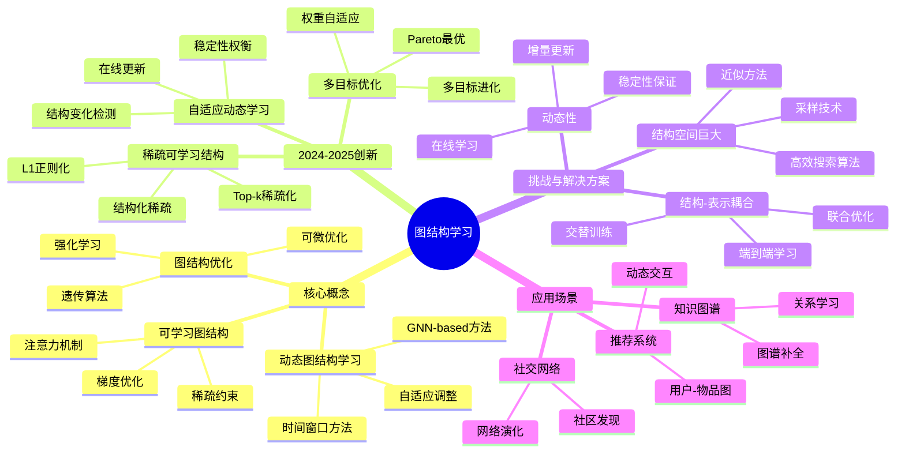

#### 1.1.2 中心概念：图结构学习

**定义**: 图结构学习是从数据中学习最优图结构的方法，将图结构作为可学习的参数或优化的目标。

**核心优势**:
- ✅ 适应数据：无需预定义图结构
- ✅ 动态更新：适应数据变化
- ✅ 任务导向：优化下游任务性能

---

### 1.2 动态图结构学习思维导图

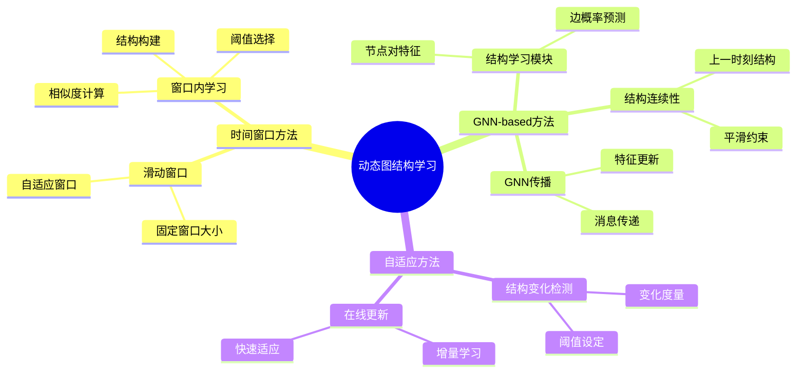

---

### 1.3 可学习图结构思维导图

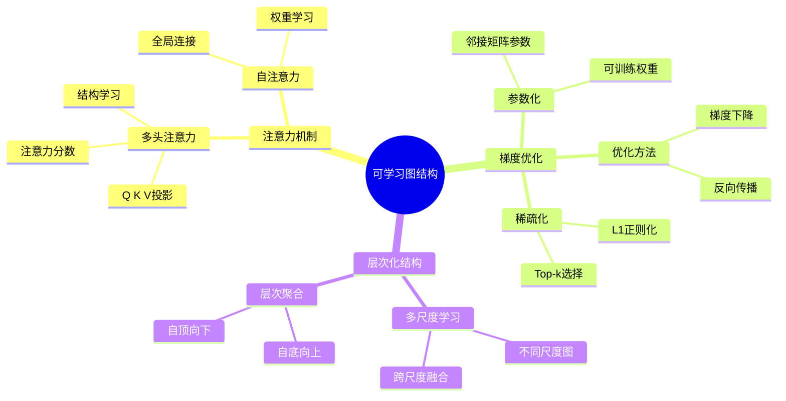

---

## 📊 **二、对比矩阵 / Comparison Matrices**

### 2.1 图结构学习方法对比矩阵

| 方法类别 | 核心思想 | 优势 | 劣势 | 计算复杂度 | 适用场景 | 2024-2025创新 |
|---------|---------|------|------|-----------|---------|--------------|
| **动态图结构学习** | 学习随时间演化的图结构 | 适应动态变化、实时更新 | 需要时间序列数据、计算开销大 | $O(T \cdot n^2)$ | 推荐系统、社交网络 | 自适应窗口、多尺度融合 |
| **可学习图结构** | 将图结构作为模型参数 | 端到端训练、灵活 | 参数空间大、易过拟合 | $O(n^2 \cdot d)$ | 知识图谱、图分类 | 稀疏约束、层次化学习 |
| **图结构优化** | 搜索最优图结构 | 全局最优、可解释 | 搜索空间大、耗时 | $O(2^{n^2})$ | 小规模图、关键应用 | 可微优化、多目标优化 |

### 2.2 动态图结构学习方法对比矩阵

| 方法 | 时间建模 | 结构更新 | 计算效率 | 稳定性 | 适用规模 | 2024-2025改进 |
|------|---------|---------|---------|--------|---------|--------------|
| **时间窗口方法** | 滑动窗口 | 逐时刻更新 | 高 | 中 | 大规模 | 自适应窗口大小 |
| **GNN-based方法** | 连续时间 | 端到端学习 | 中 | 高 | 中规模 | 结构连续性约束 |
| **自适应方法** | 变化检测 | 按需更新 | 高 | 高 | 大规模 | 智能变化检测 |

### 2.3 可学习图结构方法对比矩阵

| 方法 | 参数化方式 | 优化方法 | 稀疏性 | 可解释性 | 计算复杂度 | 2024-2025创新 |
|------|-----------|---------|--------|---------|-----------|--------------|
| **注意力机制** | 注意力权重 | 端到端训练 | 低 | 中 | $O(n^2 \cdot d)$ | 多头注意力、稀疏注意力 |
| **梯度优化** | 邻接矩阵参数 | 梯度下降 | 可控 | 低 | $O(n^2 \cdot d)$ | Top-k稀疏化、L1正则化 |
| **层次化学习** | 多尺度参数 | 分层优化 | 高 | 高 | $O(k \cdot n^2 \cdot d)$ | 跨层次一致性 |

### 2.4 图结构优化方法对比矩阵

| 方法 | 搜索策略 | 收敛性 | 全局最优 | 计算复杂度 | 适用规模 | 2024-2025改进 |
|------|---------|--------|---------|-----------|---------|--------------|
| **强化学习** | 策略学习 | 慢 | 否 | $O(T \cdot n^2)$ | 中规模 | 深度Q网络、策略梯度 |
| **遗传算法** | 进化搜索 | 中 | 可能 | $O(G \cdot P \cdot n^2)$ | 小规模 | 多目标进化、自适应参数 |
| **可微优化** | 梯度优化 | 快 | 否 | $O(n^2 \cdot d)$ | 中规模 | 连续松弛、Gumbel-Softmax |

---

## 🌳 **三、决策树 / Decision Trees**

### 3.1 图结构学习方法选择决策树

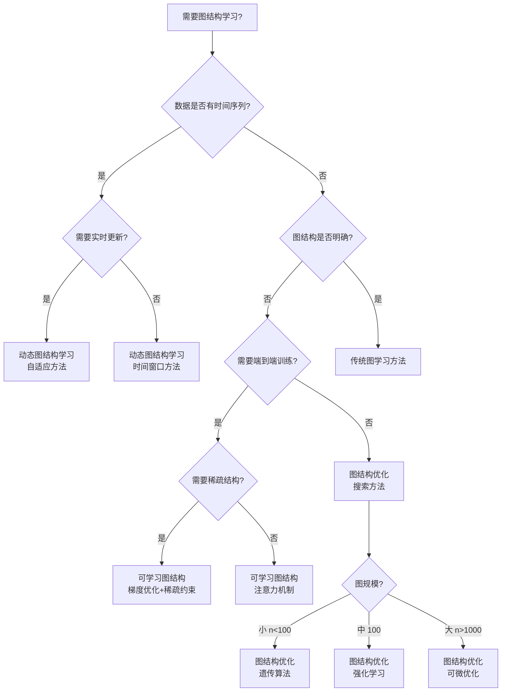

### 3.2 动态图结构学习方法选择决策树

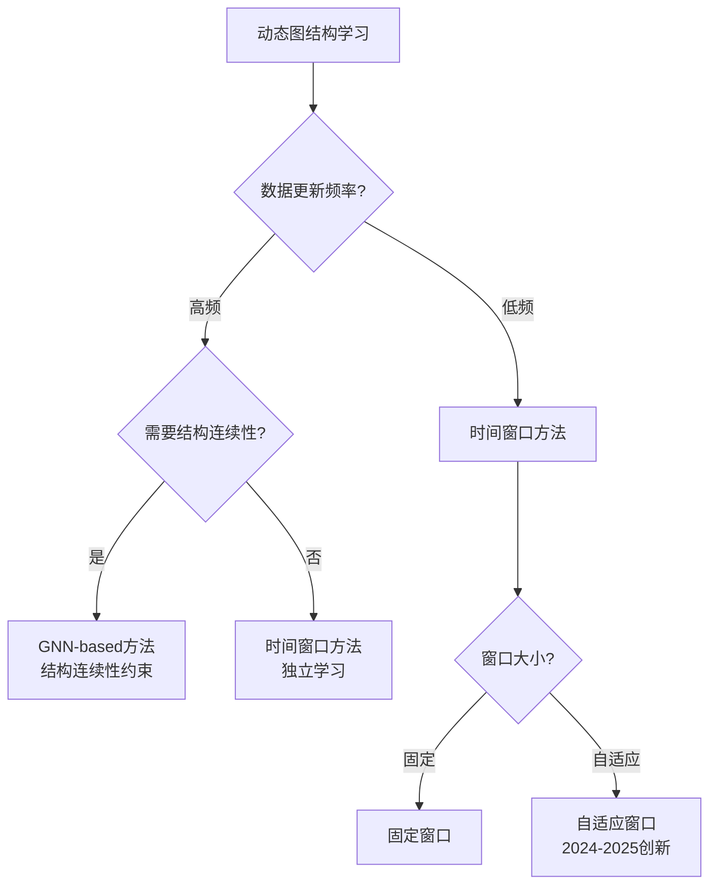

### 3.3 可学习图结构方法选择决策树

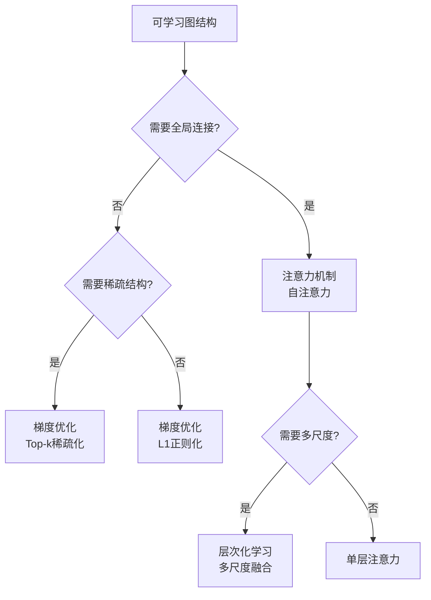

---

## 🔬 **四、证明树 / Proof Trees**

### 4.1 图结构学习最优性证明树

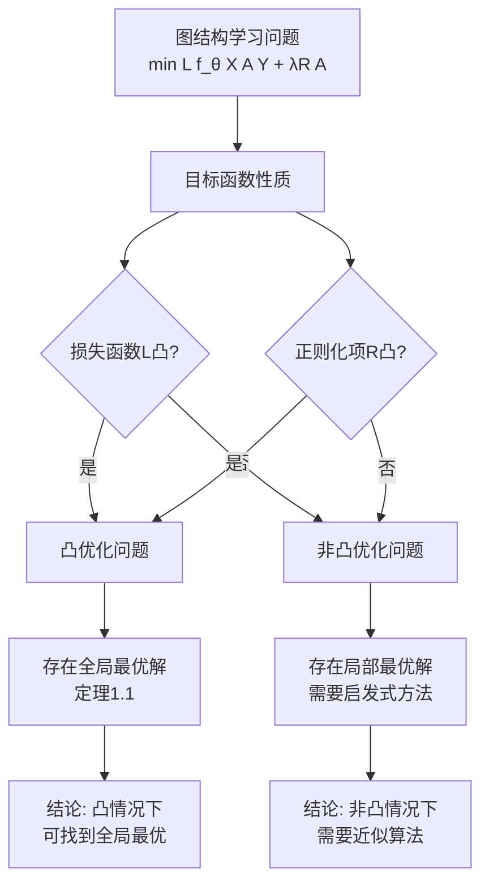

### 4.2 动态图结构学习稳定性证明树

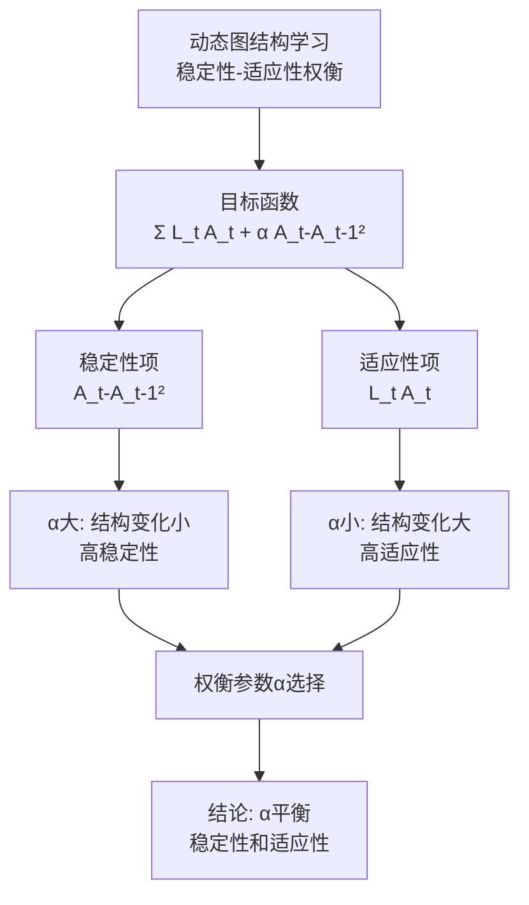

### 4.3 可学习图结构收敛性证明树

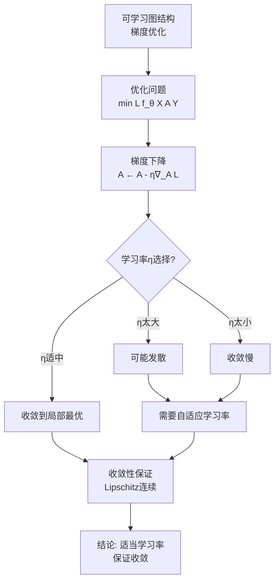

---

## 🔄 **五、数据流图 / Data Flow Diagrams**

### 5.1 动态图结构学习数据流

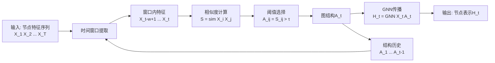

### 5.2 可学习图结构数据流

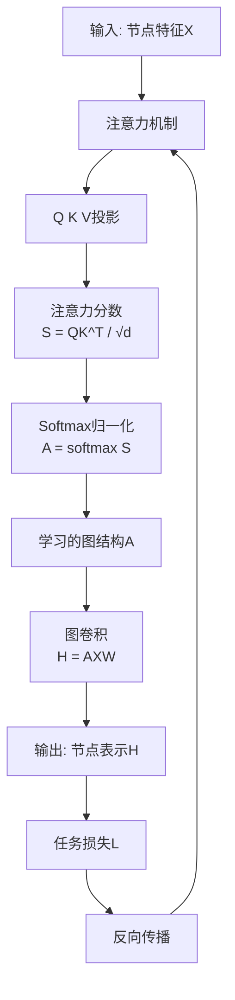

### 5.3 图结构优化数据流

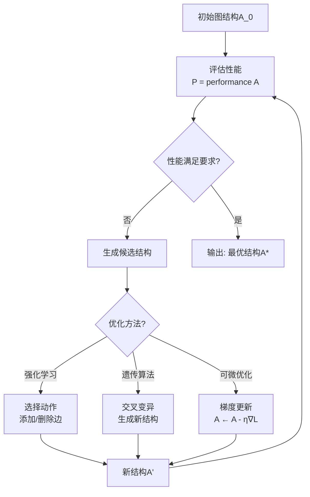

---

## 🗺️ **六、概念地图 / Concept Maps**

### 6.1 图结构学习核心概念关系地图

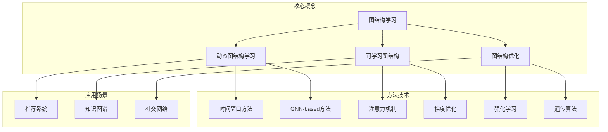

### 6.2 图结构学习理论框架概念地图

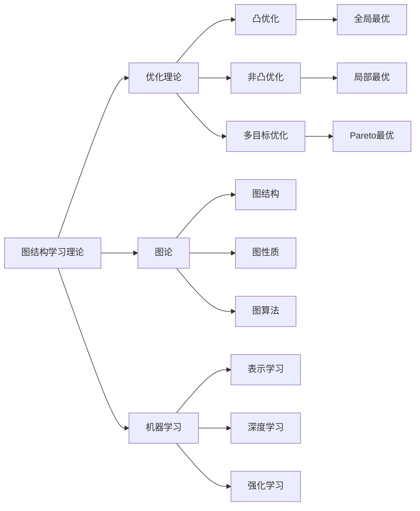

---

## 📈 **七、学习路径图 / Learning Path Diagrams**

### 7.1 图结构学习学习路径

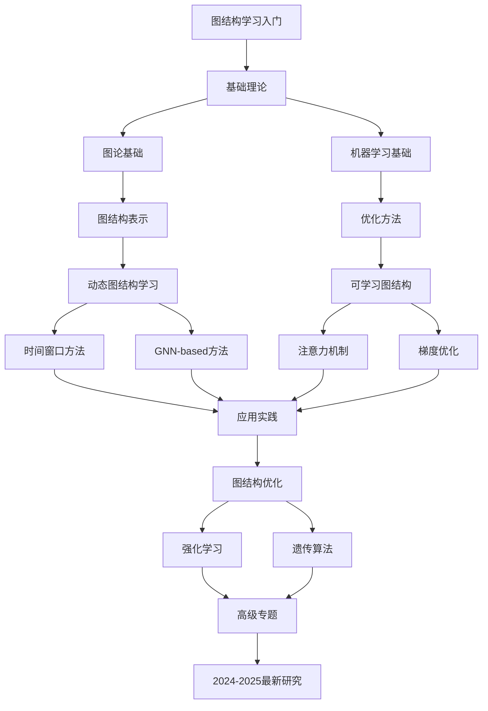

---

## 📝 **八、总结 / Summary**

### 8.1 思维表征工具使用指南

1. **思维导图**: 用于快速理解整体知识结构
2. **对比矩阵**: 用于比较不同方法的优缺点
3. **决策树**: 用于选择合适的方法
4. **证明树**: 用于理解理论证明过程
5. **数据流图**: 用于理解算法执行流程
6. **概念地图**: 用于理解概念间的关系
7. **学习路径图**: 用于规划学习路径

### 8.2 工具更新说明

本文档将随着图结构学习领域的发展持续更新，确保包含最新的研究进展和方法。

---

**文档版本**: v1.0
**创建时间**: 2025年1月
**最后更新**: 2025年1月
**维护者**: GraphNetWorkCommunicate项目组
**状态**: ✅ 完成
