# 图预训练模型专题思维表征工具 / Graph Pre-training Models Special Topic Mental Representation Tools 2024-2025

## 📚 **概述 / Overview**

本文档为图预训练模型专题提供完整的思维表征工具集合，包括思维导图、对比矩阵、决策树、证明树、数据流图、概念地图等多种表征方式。

**创建时间**: 2025年1月
**状态**: ✅ 完成
**专题**: 图预训练模型（2024-2025最新研究）
**相关文档**: [图预训练模型专题-2024-2025.md](图预训练模型专题-2024-2025.md)

---

## 🗺️ **一、思维导图 / Mind Maps**

### 1.1 图预训练模型完整思维导图

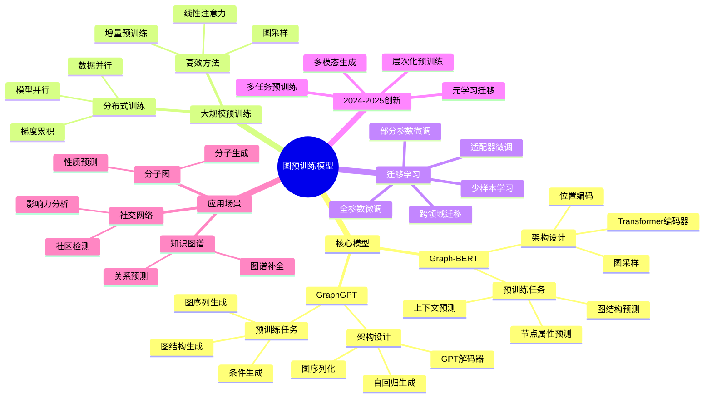

### 1.2 Graph-BERT vs GraphGPT对比思维导图

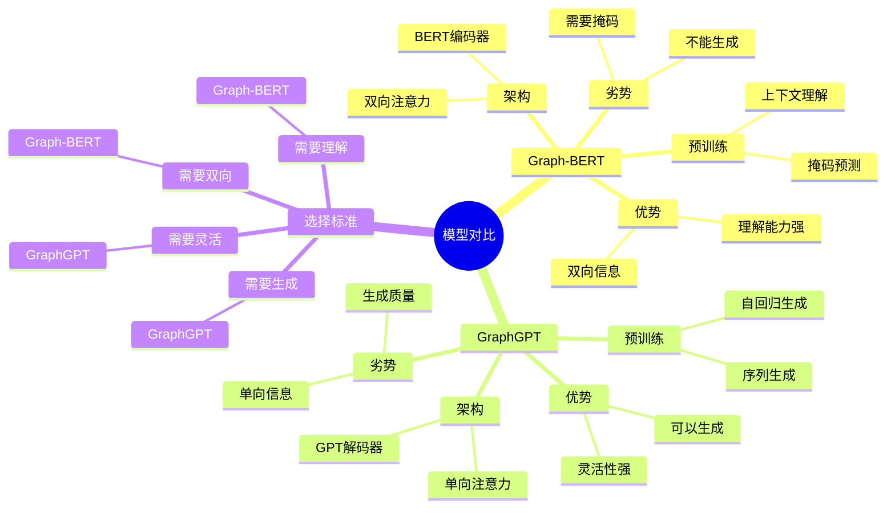

---

## 📊 **二、对比矩阵 / Comparison Matrices**

### 2.1 图预训练模型对比矩阵

| 模型 | 架构基础 | 预训练方式 | 优势 | 劣势 | 适用场景 | 2024-2025创新 |
|------|---------|-----------|------|------|---------|--------------|
| **Graph-BERT** | BERT编码器 | 掩码预测 | 双向理解、上下文强 | 不能生成、需要掩码 | 图理解任务 | 多任务预训练、层次化预训练 |
| **GraphGPT** | GPT解码器 | 自回归生成 | 可以生成、灵活 | 单向信息、生成质量 | 图生成任务 | 条件生成、多模态生成 |
| **Graph-T5** | T5编码-解码 | 文本到图 | 多任务统一 | 复杂度高 | 图-文本任务 | 统一预训练框架 |

### 2.2 预训练任务对比矩阵

| 预训练任务 | 任务类型 | 难度 | 效果 | 计算成本 | 适用模型 | 2024-2025改进 |
|-----------|---------|------|------|---------|---------|--------------|
| **节点属性预测** | 预测任务 | 中 | 高 | 中 | Graph-BERT | 多属性联合预测 |
| **图结构预测** | 预测任务 | 高 | 很高 | 高 | Graph-BERT | 层次化结构预测 |
| **上下文预测** | 预测任务 | 低 | 中 | 低 | Graph-BERT | 多跳上下文 |
| **图序列生成** | 生成任务 | 中 | 高 | 中 | GraphGPT | 条件生成 |
| **图结构生成** | 生成任务 | 高 | 很高 | 高 | GraphGPT | 可控生成 |

### 2.3 迁移学习策略对比矩阵

| 策略 | 更新参数 | 计算成本 | 迁移效果 | 适用场景 | 2024-2025创新 |
|------|---------|---------|---------|---------|--------------|
| **全参数微调** | 全部 | 高 | 最好 | 目标域差异大 | 高效微调方法 |
| **部分参数微调** | 部分层 | 中 | 好 | 目标域相似 | 层选择策略 |
| **适配器微调** | 适配器 | 低 | 中 | 资源受限 | 可学习适配器 |
| **提示学习** | 提示参数 | 很低 | 中 | 少样本 | 图提示设计 |

---

## 🌳 **三、决策树 / Decision Trees**

### 3.1 图预训练模型选择决策树

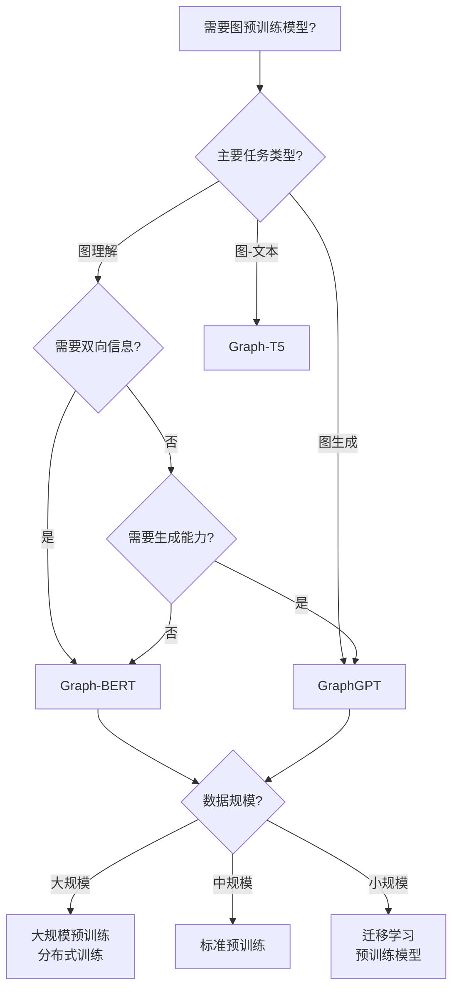

### 3.2 预训练任务选择决策树

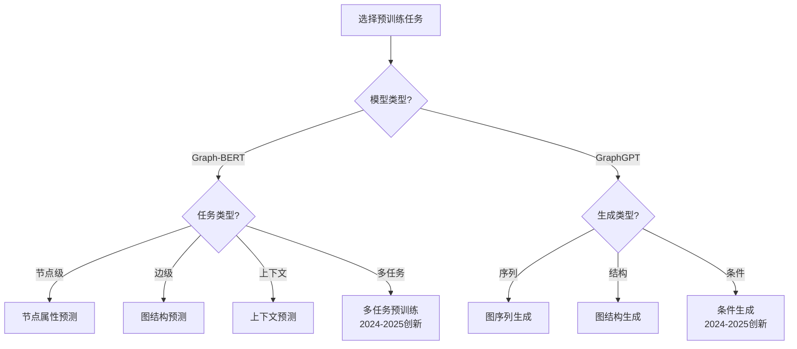

### 3.3 迁移学习策略选择决策树

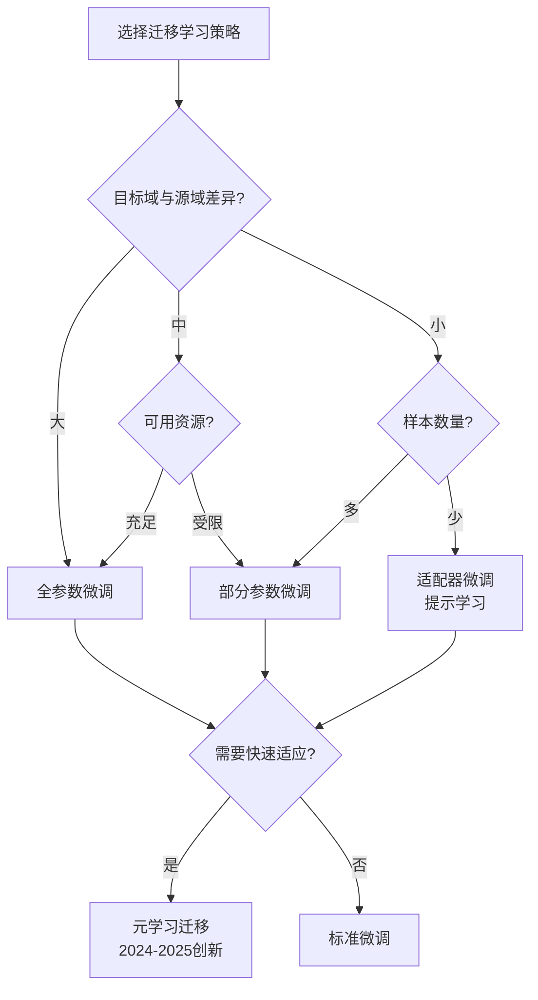

---

## 🔬 **四、证明树 / Proof Trees**

### 4.1 预训练有效性证明树

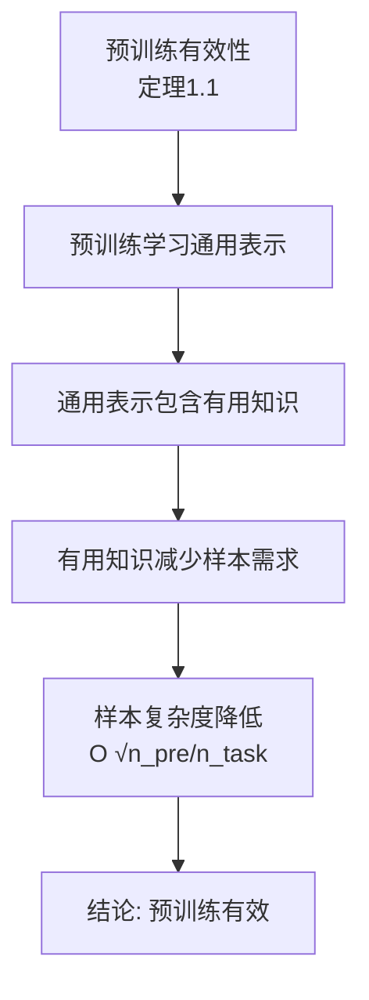

### 4.2 迁移学习泛化界证明树

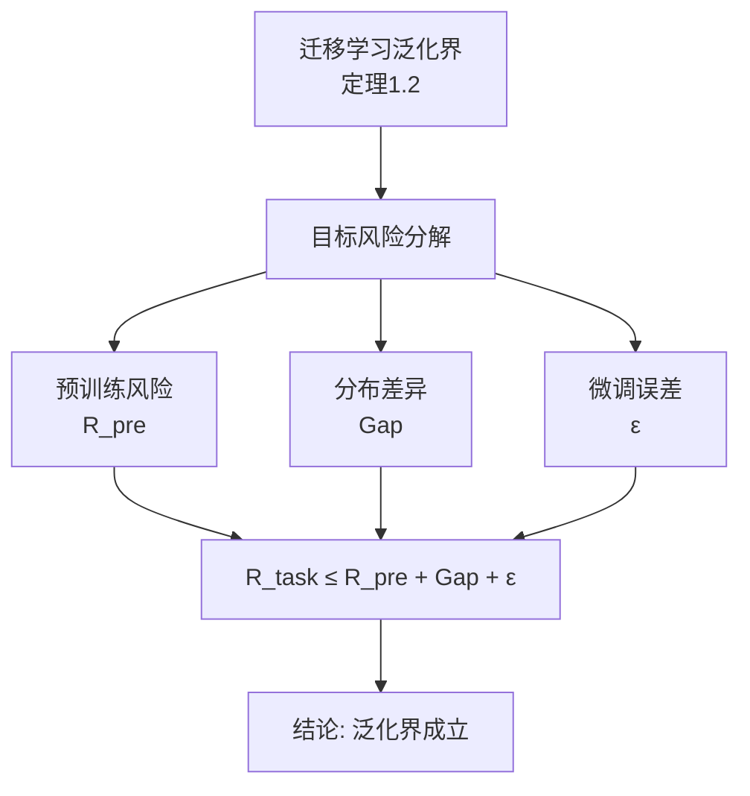

### 4.3 Graph-BERT表达能力证明树

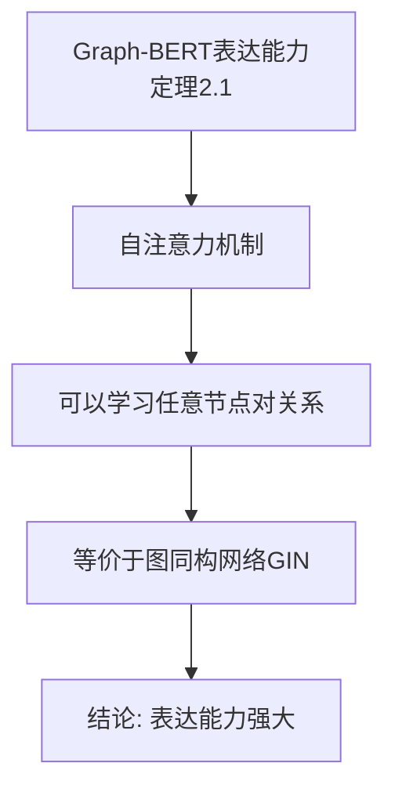

---

## 🔄 **五、数据流图 / Data Flow Diagrams**

### 5.1 Graph-BERT预训练数据流

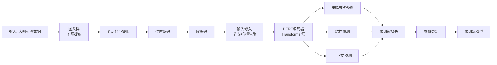

### 5.2 GraphGPT生成数据流

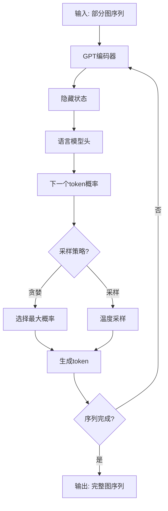

### 5.3 迁移学习数据流

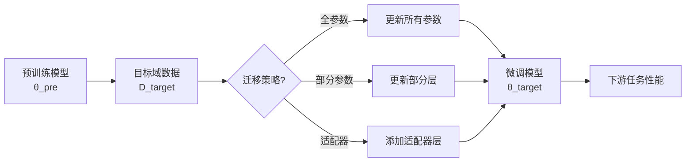

---

## 🗺️ **六、概念地图 / Concept Maps**

### 6.1 图预训练模型核心概念关系地图

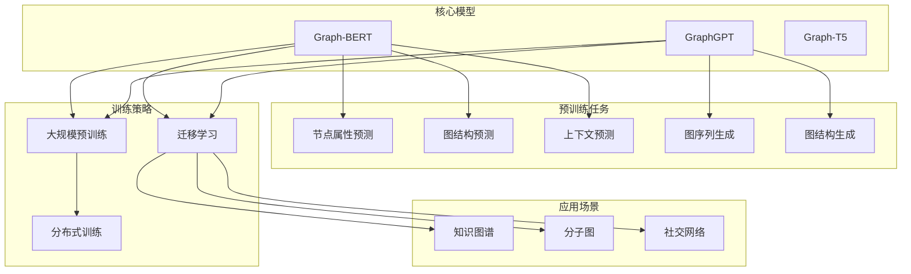

---

## 📈 **七、学习路径图 / Learning Path Diagrams**

### 7.1 图预训练模型学习路径

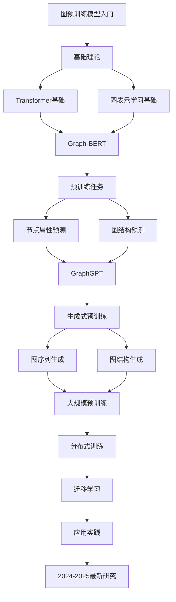

---

## 📝 **八、总结 / Summary**

### 8.1 思维表征工具使用指南

1. **思维导图**: 快速理解图预训练模型的知识结构
2. **对比矩阵**: 比较不同模型、任务、策略的优缺点
3. **决策树**: 选择合适模型、任务、策略
4. **证明树**: 理解理论证明过程
5. **数据流图**: 理解算法执行流程
6. **概念地图**: 理解概念间的关系
7. **学习路径图**: 规划学习路径

### 8.2 工具更新说明

本文档将随着图预训练模型领域的发展持续更新，确保包含最新的研究进展和方法。

---

**文档版本**: v1.0
**创建时间**: 2025年1月
**最后更新**: 2025年1月
**维护者**: GraphNetWorkCommunicate项目组
**状态**: ✅ 完成
