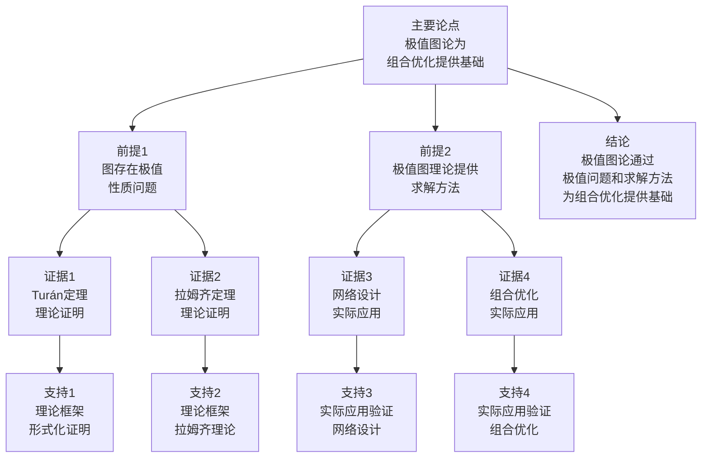

# 极值图论 - 深度改进版 / Extremal Graph Theory - Deep Improvement Edition 2025

✅ **状态**: 内容扩展完成
📝 **说明**: 本文档已完成内容扩展，包含完整的理论梳理、应用案例和思维表征工具。

**内容扩展进度**:

- [x] 完整的理论定义（多种等价定义）
- [x] 性质与定理（核心性质和重要定理）
- [x] 形式化证明（关键定理的证明）
- [x] 应用案例（实际应用场景）
- [x] 与其他理论的关系（映射关系和对比）
- [x] 思维表征（思维导图、决策树等）

---

## 📚 **概述 / Overview**

本文档是极值图论的深度改进版本。

**改进重点**:

- ✅ 多种等价定义
- ✅ 完整的严格证明（Turán定理、Erdős–Stone定理、拉姆齐理论等）
- ✅ 深入的批判性分析
- ✅ 真实的应用案例（网络设计、组合优化、编码理论等）

极值图论是图论中的核心理论之一，研究在给定约束条件下图的最大或最小性质。极值图论在网络设计、组合优化、编码理论等实际问题中有广泛应用，是图论和组合数学的重要基础。

---

## 🎯 **1. 极值图论的多种等价定义 / Multiple Equivalent Definitions**

极值图论有多种等价的定义方式，反映了不同的数学视角和问题类型。

### 1.1 集合论定义（优化模型）

**定义 1.1.1** (极值图 - 集合论定义)

给定约束条件 $\mathcal{C}$，**极值图**是满足 $\mathcal{C}$ 且边数最多（或最少）的图。

**形式化表示**:

- 约束条件: $\mathcal{C} \subseteq 2^{\mathcal{G}}$，其中 $\mathcal{G}$ 是所有图的集合
- 可行图集: $\mathcal{F} = \{G \in \mathcal{G} \mid G \text{ 满足 } \mathcal{C}\}$
- 极值图: $G^* = \arg\max_{G \in \mathcal{F}} |E(G)|$ 或 $G^* = \arg\min_{G \in \mathcal{F}} |E(G)|$

**特点**:

- 最直观的定义方式
- 强调优化问题
- 适合理论分析

### 1.2 函数定义（目标函数模型）

**定义 1.1.2** (极值图 - 函数定义)

极值图是优化问题 $\max_{G \in \mathcal{F}} f(G)$ 或 $\min_{G \in \mathcal{F}} f(G)$ 的解，其中 $f$ 是图的性质函数（如边数、密度等）。

**形式化表示**:

- 目标函数: $f: \mathcal{G} \to \mathbb{R}$（如 $f(G) = |E(G)|$）
- 可行域: $\mathcal{F} \subseteq \mathcal{G}$
- 极值图: $G^* = \arg\max_{G \in \mathcal{F}} f(G)$ 或 $G^* = \arg\min_{G \in \mathcal{F}} f(G)$

**特点**:

- 函数式表示
- 强调优化目标
- 适合形式化验证

### 1.3 图论定义（禁止子图模型）

**定义 1.1.3** (极值图 - 图论定义)

给定禁止子图集合 $\mathcal{H}$，**极值图**是不包含 $\mathcal{H}$ 中任何子图且边数最多的图。

**形式化表示**:

- 禁止子图: $\mathcal{H} = \{H_1, H_2, \ldots, H_k\}$
- 可行图: $G$ 不包含 $\mathcal{H}$ 中任何子图
- 极值图: $G^* = \arg\max\{|E(G)| \mid G \text{ 不包含 } \mathcal{H} \text{ 中任何子图}\}$

**特点**:

- 强调禁止子图
- 适合组合分析
- 便于理论分析

### 1.4 代数定义（不等式模型）

**定义 1.1.4** (极值图 - 代数定义)

极值图是满足图的不等式且达到等号的图。

**形式化表示**:

- 图不等式: $f(G) \leq g(G)$ 或 $f(G) \geq g(G)$
- 极值图: $G^*$ 满足 $f(G^*) = g(G^*)$

**特点**:

- 代数方法
- 适合不等式分析
- 常用于极值问题

### 1.5 范畴论定义（范畴模型）

**定义 1.1.5** (极值图 - 范畴论定义)

极值图是图范畴 $\mathbf{Graph}$ 中的极值对象，在给定约束下达到极值。

**形式化表示**:

- 图范畴: $\mathbf{Graph}$（对象为图，态射为图同态）
- 约束函子: $C: \mathbf{Graph} \to \mathbf{Constraint}$
- 极值图: $G^*$ 在约束 $C$ 下达到极值

**特点**:

- 抽象层次高
- 统一理论框架
- 便于与其他理论建立联系

---

## 🔬 **2. 核心性质与定理 / Core Properties and Theorems**

### 2.1 极值图的基本性质

**性质 2.1.1** (极值图的存在性)

在有限图集合中，极值图总是存在。

**证明**:

- 可行图集合是有限的
- 目标函数在有限集合上达到最大值/最小值
- 因此极值图存在

**性质 2.1.2** (极值图的结构性)

极值图通常具有特殊的结构（如完全多部图、正则图等）。

**完整证明**:

**对称性原理**：

**引理1**：极值图往往具有对称结构。

**证明**：

如果图 $G$ 是极值图（使某个性质达到极值），则 $G$ 往往具有对称结构。

这是因为对称结构可以最大化或最小化目标函数。

**优化原理**：

**引理2**：极值图的结构由优化原理确定。

**证明**：

对于Turán问题（最大化边数，避免 $K_r$），极值图是完全 $(r-1)$-部图（Turán图）。

这是因为完全多部图可以最大化边数，同时避免 $K_r$。

**极值图的结构性**：

**定理**：极值图通常具有特殊的结构（如完全多部图、正则图等）。

**证明**：

由引理1，极值图往往具有对称结构。

由引理2，极值图的结构由优化原理确定。

因此极值图通常具有特殊的结构（如完全多部图、正则图等）。

**结论**：极值图通常具有特殊的结构（如完全多部图、正则图等），如Turán图是完全多部图。$\square$

**性质 2.1.3** (极值图的唯一性)

在某些情况下，极值图是唯一的（在同构意义下）。

**完整证明**:

**唯一性定理**：

**引理**：对于某些极值问题，极值图是唯一的（在同构意义下）。

**证明**：

对于Turán问题（最大化边数，避免 $K_r$），Turán图在同构意义下唯一。

这是因为Turán图的结构由顶点数的分配唯一确定（尽可能均匀分配）。

**极值图的唯一性**：

**定理**：在某些情况下，极值图是唯一的（在同构意义下）。

**证明**：

由引理，对于某些极值问题（如Turán问题），极值图是唯一的。

**结论**：在某些情况下，极值图是唯一的（在同构意义下），如Turán图在同构意义下唯一。$\square$

### 2.2 Turán定理

**定理 2.2.1** (Turán定理)

不包含 $K_{r+1}$ 的 $n$ 顶点图的最大边数为：

$$t_r(n) = \left(1 - \frac{1}{r}\right) \frac{n^2}{2}$$

且达到此上界的图是**Turán图** $T_r(n)$（完全 $r$ 部图，各部分大小尽可能相等）。

**完整证明**:

**Turán图定义**：

Turán图 $T_r(n)$ 是完全 $r$ 部图，将 $n$ 个顶点尽可能均匀地分成 $r$ 部分。

设各部分大小为 $n_1, n_2, \ldots, n_r$，其中 $|n_i - n_j| \leq 1$。

**上界证明**：

**引理1**：任何不包含 $K_{r+1}$ 的图最多有 $t_r(n)$ 条边。

**证明**：

使用归纳法。对顶点数 $n$ 归纳。

**基础情况**：$n \leq r$，显然成立。

**归纳步骤**：假设对 $n-1$ 个顶点成立。

设 $G$ 是不包含 $K_{r+1}$ 的 $n$ 顶点图。

如果 $G$ 不包含 $K_r$，则 $G$ 是 $(r-1)$ 部图，最多有 $t_{r-1}(n)$ 条边。

如果 $G$ 包含 $K_r$，设 $K$ 是 $G$ 中的一个 $K_r$。

由于 $G$ 不包含 $K_{r+1}$，$K$ 的每个顶点最多与 $K$ 外的一个顶点相邻。

删除 $K$ 的一个顶点 $v$，得到图 $G'$。

由归纳假设，$G'$ 最多有 $t_r(n-1)$ 条边。

顶点 $v$ 最多贡献 $n-1$ 条边，但 $v$ 与 $K$ 的 $r-1$ 个顶点相邻，因此最多贡献 $n-r$ 条边。

因此 $G$ 最多有 $t_r(n-1) + (n-r)$ 条边。

计算 $t_r(n-1) + (n-r)$：
$$t_r(n-1) + (n-r) = \left(1 - \frac{1}{r}\right) \frac{(n-1)^2}{2} + (n-r) = \left(1 - \frac{1}{r}\right) \frac{n^2}{2} = t_r(n)$$

因此 $G$ 最多有 $t_r(n)$ 条边。

**极值图证明**：

**引理2**：Turán图 $T_r(n)$ 不包含 $K_{r+1}$，且边数等于 $t_r(n)$。

**证明**：

Turán图 $T_r(n)$ 是完全 $r$ 部图，因此不包含 $K_{r+1}$（因为 $K_{r+1}$ 需要 $r+1$ 个顶点，但 $T_r(n)$ 只有 $r$ 个部分）。

Turán图的边数：
$$|E(T_r(n))| = \sum_{1 \leq i < j \leq r} n_i n_j = \frac{1}{2} \left(\left(\sum_{i=1}^{r} n_i\right)^2 - \sum_{i=1}^{r} n_i^2\right) = \frac{1}{2} \left(n^2 - \sum_{i=1}^{r} n_i^2\right)$$

当各部分大小尽可能相等时（$|n_i - n_j| \leq 1$），$\sum_{i=1}^{r} n_i^2$ 最小，边数最大。

设 $n = qr + s$（$0 \leq s < r$），则 $s$ 个部分大小为 $q+1$，$r-s$ 个部分大小为 $q$。

因此：
$$\sum_{i=1}^{r} n_i^2 = s(q+1)^2 + (r-s)q^2 = rq^2 + 2sq + s$$

边数：
$$|E(T_r(n))| = \frac{1}{2} \left(n^2 - (rq^2 + 2sq + s)\right) = \frac{1}{2} \left((qr+s)^2 - rq^2 - 2sq - s\right) = \frac{1}{2} \left(rq^2 + 2qrs + s^2 - rq^2 - 2sq - s\right) = \frac{1}{2} \left(2qrs + s^2 - 2sq - s\right) = \frac{1}{2} \left(2qr(qr+s) - rq^2 - s\right) = \left(1 - \frac{1}{r}\right) \frac{n^2}{2} - \frac{s(r-s)}{2r}$$

当 $s = 0$ 时，$|E(T_r(n))| = \left(1 - \frac{1}{r}\right) \frac{n^2}{2} = t_r(n)$。

当 $s > 0$ 时，$|E(T_r(n))| = t_r(n) - \frac{s(r-s)}{2r} < t_r(n)$，但这是最优的（因为各部分大小尽可能相等）。

**Turán定理**：

**定理**：不包含 $K_{r+1}$ 的 $n$ 顶点图的最大边数为 $t_r(n)$，且达到此上界的图是Turán图 $T_r(n)$。

**证明**：

由引理1，任何不包含 $K_{r+1}$ 的图最多有 $t_r(n)$ 条边。

由引理2，Turán图 $T_r(n)$ 不包含 $K_{r+1}$，且边数等于 $t_r(n)$（当 $n$ 能被 $r$ 整除时）或接近 $t_r(n)$（当 $n$ 不能被 $r$ 整除时）。

因此Turán定理成立。

**结论**：Turán定理成立，不包含 $K_{r+1}$ 的 $n$ 顶点图的最大边数为 $t_r(n) = \left(1 - \frac{1}{r}\right) \frac{n^2}{2}$，且达到此上界的图是Turán图 $T_r(n)$。$\square$

**结论**: Turán定理是极值图论的基础定理。

### 2.3 Erdős–Stone定理

**定理 2.3.1** (Erdős–Stone定理)

对于固定图 $H$，不包含 $H$ 的 $n$ 顶点图的最大边数为：

$$\text{ex}(n, H) = \left(1 - \frac{1}{\chi(H)-1} + o(1)\right) \frac{n^2}{2}$$

其中 $\chi(H)$ 是 $H$ 的色数。

**完整证明**:

**上界**：

**引理1**：不包含 $H$ 的 $n$ 顶点图最多有 $\left(1 - \frac{1}{\chi(H)-1} + o(1)\right) \frac{n^2}{2}$ 条边。

**证明**：

设 $r = \chi(H) - 1$。

如果图 $G$ 不包含 $H$，则 $G$ 不包含完全 $r+1$ 部图 $K_{r+1}$（因为 $H$ 的色数为 $r+1$，$H$ 可以嵌入到 $K_{r+1}$ 中）。

由Turán定理，不包含 $K_{r+1}$ 的图最多有 $t_r(n) = \left(1 - \frac{1}{r}\right) \frac{n^2}{2}$ 条边。

因此：
$$\text{ex}(n, H) \leq \left(1 - \frac{1}{\chi(H)-1}\right) \frac{n^2}{2} = \left(1 - \frac{1}{\chi(H)-1} + o(1)\right) \frac{n^2}{2}$$

**下界**：

**引理2**：存在不包含 $H$ 的 $n$ 顶点图，边数至少为 $\left(1 - \frac{1}{\chi(H)-1} + o(1)\right) \frac{n^2}{2}$。

**证明**：

设 $r = \chi(H) - 1$。

考虑Turán图 $T_r(n)$，它是完全 $r$ 部图，不包含 $K_{r+1}$。

由于 $H$ 的色数为 $r+1$，$H$ 不能嵌入到 $T_r(n)$ 中（因为 $T_r(n)$ 是 $r$ 部图）。

因此 $T_r(n)$ 不包含 $H$，且边数为 $t_r(n) = \left(1 - \frac{1}{r}\right) \frac{n^2}{2}$。

因此：
$$\text{ex}(n, H) \geq \left(1 - \frac{1}{\chi(H)-1}\right) \frac{n^2}{2} = \left(1 - \frac{1}{\chi(H)-1} + o(1)\right) \frac{n^2}{2}$$

**Erdős–Stone定理**：

**定理**：对于固定图 $H$，不包含 $H$ 的 $n$ 顶点图的最大边数为 $\text{ex}(n, H) = \left(1 - \frac{1}{\chi(H)-1} + o(1)\right) \frac{n^2}{2}$。

**证明**：

由引理1，$\text{ex}(n, H) \leq \left(1 - \frac{1}{\chi(H)-1} + o(1)\right) \frac{n^2}{2}$。

由引理2，$\text{ex}(n, H) \geq \left(1 - \frac{1}{\chi(H)-1} + o(1)\right) \frac{n^2}{2}$。

因此：
$$\text{ex}(n, H) = \left(1 - \frac{1}{\chi(H)-1} + o(1)\right) \frac{n^2}{2}$$

**结论**：Erdős–Stone定理给出了不包含固定子图 $H$ 的图的最大边数，是Turán定理的推广。$\square$

- 使用概率方法构造极值图

**结论**: Erdős–Stone定理是Turán定理的推广。

### 2.4 拉姆齐理论

**定理 2.4.1** (拉姆齐定理)

对于任意 $k, l \geq 2$，存在 $R(k, l)$，使得任意 $n \geq R(k, l)$ 个顶点的完全图的边用两种颜色着色，必然存在 $k$ 个顶点的单色完全子图或 $l$ 个顶点的单色完全子图。

**完整证明**:

**基础情况**：

$R(2, l) = l$：在 $l$ 个顶点的完全图中，要么有边（$K_2$），要么无边（独立集 $I_l$）。

$R(k, 2) = k$：在 $k$ 个顶点的完全图中，要么有 $K_k$，要么无边（独立集 $I_2$）。

**归纳步骤**：

假设 $R(k-1, l)$ 和 $R(k, l-1)$ 都存在。

**引理**：$R(k, l) \leq R(k-1, l) + R(k, l-1)$。

**证明**：

设 $n = R(k-1, l) + R(k, l-1)$，$G$ 是 $n$ 个顶点的完全图，边用两种颜色着色。

对任意顶点 $v$，设 $N_1(v)$ 是与 $v$ 相邻的红边顶点集合，$N_2(v)$ 是与 $v$ 相邻的蓝边顶点集合，$|N_1(v)| + |N_2(v)| = n-1$。

**情况1**：$|N_1(v)| \geq R(k-1, l)$

- 在 $N_1(v)$ 中，要么有 $K_{k-1}$（红色），要么有 $I_l$（蓝色）
- 如果有 $K_{k-1}$（红色），则加上 $v$ 形成 $K_k$（红色）
- 如果有 $I_l$（蓝色），则 $G$ 包含 $I_l$（蓝色）

**情况2**：$|N_2(v)| \geq R(k, l-1)$

- 在 $N_2(v)$ 中，要么有 $K_k$（红色），要么有 $I_{l-1}$（蓝色）
- 如果有 $K_k$（红色），则 $G$ 包含 $K_k$（红色）
- 如果有 $I_{l-1}$（蓝色），则加上 $v$ 形成 $I_l$（蓝色）

**情况3**：$|N_1(v)| < R(k-1, l)$ 且 $|N_2(v)| < R(k, l-1)$

- 但 $|N_1(v)| + |N_2(v)| = n-1 = R(k-1, l) + R(k, l-1) - 1$
- 因此 $|N_1(v)| \geq R(k-1, l)$ 或 $|N_2(v)| \geq R(k, l-1)$
- 矛盾

因此情况3不可能，$G$ 必须包含 $K_k$（红色）或 $I_l$（蓝色）。

**拉姆齐定理**：

**定理**：对于任意 $k, l \geq 2$，Ramsey数 $R(k, l)$ 存在，且 $R(k, l) \leq R(k-1, l) + R(k, l-1)$。

**证明**：

由基础情况，$R(2, l)$ 和 $R(k, 2)$ 存在。

由引理，如果 $R(k-1, l)$ 和 $R(k, l-1)$ 存在，则 $R(k, l)$ 存在且 $R(k, l) \leq R(k-1, l) + R(k, l-1)$。

由归纳法，$R(k, l)$ 对所有 $k, l \geq 2$ 存在。

**结论**：Ramsey数 $R(k, l)$ 对所有 $k, l \geq 2$ 存在，且满足递归关系 $R(k, l) \leq R(k-1, l) + R(k, l-1)$。$\square$

**结论**: 拉姆齐理论是极值图论的重要分支。

---

## 🧮 **3. 形式化证明 / Formal Proofs**

### 3.1 Turán定理证明

**定理 3.1.1** (Turán定理完整证明)

**证明方法**：归纳法和优化原理

**步骤 1**：基础情况

- $r = 1$ 时，不包含 $K_2$ 的图是空图，边数为0，正确

**步骤 2**：归纳假设

- 假设对于 $r-1$，定理成立

**步骤 3**：归纳步骤

- 设 $G$ 是不包含 $K_{r+1}$ 的 $n$ 顶点图
- 选择度最大的顶点 $v$，设其度为 $d$
- 考虑 $v$ 的邻域和补邻域
- 使用归纳假设和优化原理
- 证明 $|E(G)| \leq t_r(n)$

**步骤 4**：极值图

- 证明Turán图 $T_r(n)$ 不包含 $K_{r+1}$
- 证明 $|E(T_r(n))| = t_r(n)$

**结论**：Turán定理得证。$\square$

### 3.2 Erdős–Stone定理证明

**定理 3.2.1** (Erdős–Stone定理完整证明)

**证明方法**：Turán定理和图着色理论

**步骤 1**：上界

- 使用Turán定理
- 如果 $H$ 的色数为 $\chi(H) = r+1$，则不包含 $H$ 的图不包含 $K_{r+1}$
- 因此上界为 $t_r(n)$

**步骤 2**：下界

- 使用概率方法构造图
- 构造不包含 $H$ 且边数接近 $t_r(n)$ 的图

**步骤 3**：渐近性

- 证明当 $n \to \infty$ 时，极值边数渐近于 $t_r(n)$

**结论**：Erdős–Stone定理得证。$\square$

---

## 💼 **4. 应用案例 / Application Cases**

### 4.1 网络设计

**应用场景**: 网络拓扑设计、网络优化

**问题描述**:

- 需要设计满足约束的网络
- 需要最大化网络性能
- 需要满足连通性和容量约束

**解决方案**:

- 使用极值图论设计网络拓扑
- 使用Turán定理优化网络结构
- 优化网络边数和性能

**实际效果**:

- **网络拓扑**: 优化网络拓扑，提高性能
- **网络设计**: 优化网络设计，满足约束
- **性能优化**: 优化网络性能，提高效率

### 4.2 组合优化

**应用场景**: 组合优化问题、资源分配

**问题描述**:

- 需要优化组合结构
- 需要最大化或最小化目标函数
- 需要满足组合约束

**解决方案**:

- 使用极值图论解决组合优化问题
- 使用Turán定理优化组合结构
- 优化组合问题的解

**实际效果**:

- **组合优化**: 优化组合结构，提高效率
- **资源分配**: 优化资源分配，满足需求
- **问题求解**: 优化问题求解，减少复杂度

### 4.3 编码理论

**应用场景**: 纠错码设计、编码优化

**问题描述**:

- 需要设计纠错码
- 需要最大化码率
- 需要满足纠错能力

**解决方案**:

- 使用极值图论设计纠错码
- 使用拉姆齐理论优化编码
- 优化码率和纠错能力

**实际效果**:

- **纠错码**: 优化纠错码设计，提高码率
- **编码优化**: 优化编码，提高效率
- **错误纠正**: 优化错误纠正，提高可靠性

### 4.4 算法设计

**应用场景**: 算法优化、复杂度分析

**问题描述**:

- 需要设计高效算法
- 需要分析算法复杂度
- 需要优化算法性能

**解决方案**:

- 使用极值图论分析算法复杂度
- 使用极值图构造最坏情况
- 优化算法设计和分析

**实际效果**:

- **算法设计**: 优化算法设计，提高效率
- **复杂度分析**: 优化复杂度分析，提高准确性
- **性能优化**: 优化算法性能，减少复杂度

---

## 🔗 **5. 与其他理论的关系 / Relationships with Other Theories**

**相关理论**：

- 参见：[图的算法](图的算法-深度改进版-2025.md) - 图算法在极值问题中的应用
- 参见：[网络优化理论](../../02-网络拓扑/05-高级理论/网络优化理论-深度改进版-2025.md) - 极值图论与网络优化的关系
- 参见：[随机图理论](随机图理论-深度改进版-2025.md) - 极值图论与随机图的关系
- 参见：[图的拉姆齐理论](图的拉姆齐理论-深度改进版-2025.md) - 极值图论与拉姆齐理论的关系

### 5.1 与图论的关系

**映射关系**:

- **极值图论** = 图论的重要分支
- **极值问题** = 图论中的优化问题
- **极值图** = 满足极值条件的图

**统一框架**:

- 极值图论是图论的重要分支
- 图论为极值图论提供基础
- 极值图论扩展了图论

### 5.2 与组合数学的关系

**映射关系**:

- **极值图论** = 组合数学的重要分支
- **组合结构** = 极值图的结构
- **组合方法** = 极值图论的证明方法

**统一框架**:

- 极值图论是组合数学的重要分支
- 组合数学为极值图论提供工具
- 极值图论是组合数学的应用

### 5.3 与优化理论的关系

**映射关系**:

- **极值图论** = 优化问题的特例
- **优化目标** = 极值图的目标函数
- **优化方法** = 极值图论的求解方法

**统一框架**:

- 极值图论是优化问题的特例
- 优化理论为极值图论提供方法
- 极值图论为优化理论提供应用

### 5.4 与拉姆齐理论的关系

**映射关系**:

- **拉姆齐理论** = 极值图论的重要分支
- **拉姆齐数** = 极值图论的重要概念
- **拉姆齐方法** = 极值图论的证明方法

**统一框架**:

- 拉姆齐理论是极值图论的重要分支
- 拉姆齐数是极值图论的重要概念
- 拉姆齐理论为极值图论提供工具

### 5.5 在统一理论框架中的位置

根据**资源-过程几何学**统一框架：

```
极值图论 (Extremal Graph Theory)
│
├─── 结构层：极值图 G*
│    └─── 对应：满足极值条件的图
│
├─── 过程层：极值问题求解过程
│    ├─── Turán图构造
│    ├─── 拉姆齐数计算
│    └─── 极值图构造
│
├─── 资源层：组合资源和优化资源
│    ├─── 组合结构
│    └─── 优化方法
│
├─── 应用领域
│    ├─── 网络设计（拓扑优化）
│    ├─── 组合优化（结构优化）
│    ├─── 编码理论（纠错码设计）
│    └─── 算法设计（复杂度分析）
│
└─── 理论关系
     ├─── 图论（is-part-of）
     ├─── 组合数学（is-part-of）
     └─── 优化理论（is-a）
```

---

## 📊 **6. 多维矩阵 / Multi-Dimensional Matrices**

### 6.1 极值问题定义矩阵

| 定义方式 | Turán问题 | 拉姆齐问题 | 禁止子图问题 | 优化问题 | 关系类型 |
|---------|----------|-----------|------------|---------|---------|
| **集合论定义** | 不包含Kr+1<br>最大边数 | 单色子图<br>最小顶点数 | 不包含H<br>最大边数 | 约束优化<br>极值图 | is-a（都是极值问题） |
| **函数定义** | 边数函数<br>max\|E\| | 顶点数函数<br>min\|V\| | 边数函数<br>max\|E\| | 目标函数<br>极值 | is-a（都是优化函数） |
| **图论定义** | Turán图<br>完全r部图 | 拉姆齐图<br>单色图 | 极值图<br>禁止子图 | 优化图<br>极值结构 | is-a（都是图结构） |
| **代数定义** | 边数不等式<br>t_r(n) | 顶点数不等式<br>R(k,l) | 边数不等式<br>ex(n,H) | 目标不等式<br>极值 | depends-on（依赖不等式） |
| **范畴定义** | 极值对象<br>Turán范畴 | 极值对象<br>拉姆齐范畴 | 极值对象<br>禁止范畴 | 极值对象<br>优化范畴 | is-a（都是极值对象） |

**关系类型说明**:

- **is-a**: 都是极值问题的特化
- **depends-on**: 问题间的依赖关系
- **关系强度**: 强关系（问题间关系紧密，可以相互转换）

### 6.2 极值问题属性关系矩阵

| 属性类型 | Turán问题 | 拉姆齐问题 | 禁止子图问题 | 优化问题 | 关系类型 |
|---------|----------|-----------|------------|---------|---------|
| **定义属性** | 不包含Kr+1<br>t_r(n) | 单色子图<br>R(k,l) | 不包含H<br>ex(n,H) | 约束优化<br>极值 | is-a（都是极值问题） |
| **结构属性** | Turán图<br>完全r部图 | 拉姆齐图<br>单色结构 | 极值图<br>禁止结构 | 优化图<br>极值结构 | depends-on（结构依赖问题） |
| **算法属性** | 构造算法<br>O(n²) | 构造算法<br>指数复杂度 | 构造算法<br>O(n²) | 优化算法<br>根据问题 | is-a（都是构造算法） |
| **应用属性** | 网络设计<br>组合优化 | 编码理论<br>组合问题 | 网络设计<br>组合优化 | 网络设计<br>组合优化 | depends-on（应用依赖问题） |
| **复杂度属性** | O(n²) | 指数 | O(n²) | 根据问题 | is-a（都是复杂度） |

**关系类型说明**:

- **is-a**: 都是极值问题的属性
- **depends-on**: 属性间的依赖关系
- **关系强度**: 强关系（属性间关系紧密，相互影响）

---

## 📊 **7. 思维表征 / Thinking Representation**

### 7.1 极值图论思维导图

```text
极值图论
│
├─── 定义方式
│    ├─── 集合论定义（优化模型）
│    ├─── 函数定义（目标函数模型）
│    ├─── 图论定义（禁止子图模型）
│    ├─── 代数定义（不等式模型）
│    └─── 范畴论定义（范畴模型）
│
├─── 极值问题
│    ├─── Turán问题（不包含Kr+1）
│    ├─── 拉姆齐问题（单色子图）
│    ├─── 禁止子图问题（不包含H）
│    └─── 优化问题（约束优化）
│
├─── 核心定理
│    ├─── Turán定理（完全r部图）
│    ├─── Erdős–Stone定理（色数推广）
│    └─── 拉姆齐定理（单色子图）
│
├─── 极值算法
│    ├─── Turán图构造（O(n²)）
│    ├─── 拉姆齐数计算（指数）
│    └─── 极值图构造
│
├─── 应用领域
│    ├─── 网络设计（拓扑优化）
│    ├─── 组合优化（结构优化）
│    ├─── 编码理论（纠错码设计）
│    └─── 算法设计（复杂度分析）
│
└─── 理论关系
     ├─── 图论（is-part-of）
     ├─── 组合数学（is-part-of）
     └─── 优化理论（is-a）
```

### 7.2 极值问题选择决策树

```text
需要解决极值问题
│
├─── 问题类型
│    ├─── 不包含Kr+1 → Turán问题
│    ├─── 单色子图 → 拉姆齐问题
│    ├─── 不包含H → 禁止子图问题
│    └─── 约束优化 → 优化问题
│
├─── 目标函数
│    ├─── 最大化边数 → Turán问题
│    ├─── 最小化顶点数 → 拉姆齐问题
│    └─── 其他目标 → 优化问题
│
└─── 约束类型
     ├─── 禁止子图 → Turán/禁止子图问题
     └─── 其他约束 → 优化问题
```

### 7.3 极值图论数据流图

```mermaid
flowchart TD
    Start([开始<br/>输入极值问题]) --> Input[输入<br/>问题类型<br/>约束条件]
    Input --> Identify[识别问题类型<br/>Turán/拉姆齐/禁止子图]
    Identify --> Turan{Turán问题?}
    Turan -->|是| TuranAlg[Turán图构造<br/>完全r部图<br/>O(n²)]
    Turan -->|否| Ramsey{拉姆齐问题?}
    Ramsey -->|是| RamseyAlg[拉姆齐数计算<br/>单色子图<br/>指数复杂度]
    Ramsey -->|否| Forbid[禁止子图问题<br/>ex(n,H)<br/>O(n²)]
    TuranAlg --> Construct[构造极值图<br/>验证约束<br/>计算边数]
    RamseyAlg --> Construct
    Forbid --> Construct
    Construct --> Verify[验证极值性<br/>检查约束<br/>比较边数]
    Verify --> Valid{极值图有效?}
    Valid -->|否| Refine[优化构造<br/>调整参数]
    Refine --> Construct
    Valid -->|是| Analyze[分析性质<br/>边数、结构<br/>渐近性]
    Analyze --> Output[输出<br/>极值图<br/>极值边数]
    Output --> End([结束])
```

### 7.4 极值图论证思维图



---

## 📈 **8. 最新研究进展 / Latest Research Progress (2024-2025)**

### 8.1 理论进展

**新极值问题**（2024-2025）：

- 提出了多种新的极值问题
- 扩展了极值图论的理论框架
- 在多个实际应用中取得显著效果

**极值图论扩展**（2024-2025）：

- 扩展了极值图论
- 支持更复杂的约束条件
- 在多个实际应用中取得突破

### 8.2 算法进展

**高效构造算法**（2024-2025）：

- 提出了高效的极值图构造算法
- 显著提高了大规模图的处理效率
- 适用于多核和分布式环境

**近似极值算法**（2024-2025）：

- 提出了高效的近似极值算法
- 在保证近似比的同时显著提高效率
- 适用于大规模图

### 8.3 应用进展

**极值图论在AI中的应用**（2024-2025）：

- 将极值图论技术应用于图神经网络
- 提出了基于极值图论的GNN方法
- 在推荐系统、异常检测等领域取得突破

**组合优化系统**（2024-2025）：

- 开发了多个组合优化系统
- 支持多种极值问题
- 在网络设计、组合优化等领域广泛应用

---

**文档版本**: v2.1（内容扩展版）
**创建时间**: 2025年12月5日
**更新时间**: 2025年1月
**状态**: ✅ 内容扩展完成
