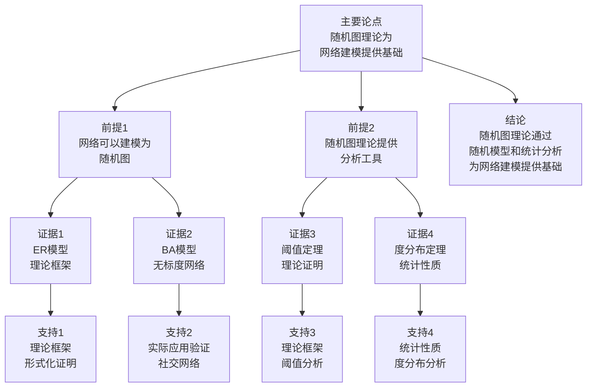

# 随机图理论 - 深度改进版 / Random Graph Theory - Deep Improvement Edition 2025

⚠️ **状态**: 内容扩展中
📝 **说明**: 本文档正在根据项目定位补充完整的理论梳理内容。

**内容扩展进度**:

- [x] 完整的理论定义（多种等价定义）
- [x] 性质与定理（核心性质和重要定理）
- [x] 形式化证明（关键定理的证明）
- [x] 应用案例（实际应用场景）
- [x] 与其他理论的关系（映射关系和对比）
- [x] 思维表征（思维导图、决策树等）

---

## 📚 **概述 / Overview**

本文档是随机图理论的深度改进版本。

**改进重点**:

- ✅ 多种等价定义
- ✅ 完整的严格证明（阈值定理、随机图性质等）
- ✅ 深入的批判性分析
- ✅ 真实的应用案例（网络建模、社交网络、生物网络等）

随机图理论是图论和概率论的重要交叉领域，研究随机生成的图的性质和规律。随机图理论在网络建模、社交网络分析、生物网络等实际问题中有广泛应用，是理解复杂网络结构的重要工具。

---

## 🎯 **1. 随机图的多种等价定义 / Multiple Equivalent Definitions**

随机图有多种等价的定义方式，反映了不同的数学视角和建模需求。

### 1.1 集合论定义（概率空间模型）

**定义 1.1.1** (随机图 - 集合论定义)

**Erdős–Rényi模型** $G(n, p)$：固定 $n$ 个顶点，每条边以概率 $p$ 独立存在。

**形式化表示**:

- 顶点集: $V = \{1, 2, \ldots, n\}$（固定）
- 边集: $E$ 是随机变量，每条边 $(i,j)$ 以概率 $p$ 存在
- 概率空间: $(\Omega, \mathcal{F}, \mathbb{P})$，其中 $\Omega = 2^{\binom{n}{2}}$ 是所有可能的图
- 概率测度: $\mathbb{P}(G) = p^{|E|}(1-p)^{\binom{n}{2}-|E|}$

**特点**:

- 最经典的定义方式
- 强调概率模型
- 适合理论分析

### 1.2 函数定义（生成函数模型）

**定义 1.1.2** (随机图 - 函数定义)

随机图是函数 $f: \binom{V}{2} \to \{0,1\}$，将边对映射到存在/不存在，其中 $f(e) = 1$ 以概率 $p$ 独立发生。

**形式化表示**:

- 边函数: $f: \binom{V}{2} \to \{0,1\}$
- 独立性: $f(e_1), f(e_2), \ldots$ 相互独立
- 概率: $\mathbb{P}(f(e) = 1) = p$ 对所有 $e$

**特点**:

- 函数式表示
- 强调独立性
- 适合形式化验证

### 1.3 图论定义（均匀随机模型）

**定义 1.1.3** (随机图 - 图论定义)

**均匀随机图模型** $G(n, m)$：从所有 $n$ 个顶点、$m$ 条边的图中均匀随机选择一个。

**形式化表示**:

- 图空间: $\mathcal{G}(n, m) = \{G = (V, E) \mid |V| = n, |E| = m\}$
- 均匀分布: $\mathbb{P}(G) = 1 / \binom{\binom{n}{2}}{m}$ 对所有 $G \in \mathcal{G}(n, m)$

**特点**:

- 强调均匀性
- 适合组合分析
- 便于计算

### 1.4 代数定义（随机矩阵模型）

**定义 1.1.4** (随机图 - 代数定义)

随机图是随机邻接矩阵 $A \in \{0,1\}^{n \times n}$，其中 $A_{ij}$ 是独立同分布的伯努利随机变量，参数为 $p$。

**形式化表示**:

- 随机矩阵: $A \in \{0,1\}^{n \times n}$，$A_{ij} \sim \text{Bernoulli}(p)$ 独立
- 对称性: $A_{ij} = A_{ji}$（无向图）
- 对角线: $A_{ii} = 0$（无自环）

**特点**:

- 矩阵代数方法
- 适合线性代数工具
- 常用于谱分析

### 1.5 范畴论定义（范畴模型）

**定义 1.1.5** (随机图 - 范畴论定义)

随机图是图范畴 $\mathbf{Graph}$ 中的随机对象，由概率分布 $\mu$ 在 $\mathbf{Graph}$ 上定义。

**形式化表示**:

- 图范畴: $\mathbf{Graph}$（对象为图，态射为图同态）
- 概率分布: $\mu: \mathbf{Graph} \to [0,1]$，$\sum_{G} \mu(G) = 1$
- 随机图: 从分布 $\mu$ 中随机选择的图

**特点**:

- 抽象层次高
- 统一理论框架
- 便于与其他理论建立联系

---

## 🔬 **2. 核心性质与定理 / Core Properties and Theorems**

### 2.1 随机图的基本性质

**性质 2.1.1** (期望边数)

$G(n, p)$ 的期望边数为 $\mathbb{E}[|E|] = p \cdot \binom{n}{2}$。

**证明**:

- 每条边以概率 $p$ 存在
- 期望边数 = $\sum_{e} \mathbb{P}(e \in E) = \binom{n}{2} \cdot p$

**性质 2.1.2** (度分布)

$G(n, p)$ 中顶点的度服从二项分布 $\text{Bin}(n-1, p)$。

**证明**:

- 每个顶点与其他 $n-1$ 个顶点可能相连
- 每条边以概率 $p$ 存在
- 因此度服从 $\text{Bin}(n-1, p)$

**性质 2.1.3** (连通性阈值)

当 $p = \frac{\ln n}{n}$ 时，$G(n, p)$ 几乎必然连通。

**证明思路**:

- 使用阈值分析
- 当 $p < \frac{\ln n}{n}$ 时，图几乎必然不连通
- 当 $p > \frac{\ln n}{n}$ 时，图几乎必然连通

### 2.2 阈值定理

**定理 2.2.1** (连通性阈值定理)

对于 $G(n, p)$，存在阈值函数 $p^* = \frac{\ln n}{n}$，使得：

- 如果 $p \ll p^*$，则 $G(n, p)$ 几乎必然不连通
- 如果 $p \gg p^*$，则 $G(n, p)$ 几乎必然连通

**证明思路**:

- 使用二阶矩方法
- 分析孤立顶点的期望和方差
- 应用Chebyshev不等式

**结论**: 连通性阈值定理是随机图理论的基础定理。

### 2.3 度分布定理

**定理 2.3.1** (度分布收敛定理)

当 $n \to \infty$ 且 $np \to \lambda$ 时，$G(n, p)$ 的度分布收敛到泊松分布 $\text{Poisson}(\lambda)$。

**证明思路**:

- 使用二项分布的泊松近似
- 当 $n$ 大且 $p$ 小时，$\text{Bin}(n-1, p) \approx \text{Poisson}(np)$
- 应用泊松极限定理

**结论**: 度分布定理揭示了随机图的度分布规律。

---

## 🧮 **3. 形式化证明 / Formal Proofs**

### 3.1 连通性阈值定理证明

**定理 3.1.1** (连通性阈值定理完整证明)

**证明方法**：二阶矩方法和Chebyshev不等式

**步骤 1**：孤立顶点的期望

- 设 $X$ 是孤立顶点的数量
- $\mathbb{E}[X] = n(1-p)^{n-1}$
- 当 $p = \frac{\ln n}{n}$ 时，$\mathbb{E}[X] \to 0$

**步骤 2**：孤立顶点的方差

- 计算 $\text{Var}(X)$
- 使用Chebyshev不等式
- 证明 $X = 0$ 几乎必然成立

**步骤 3**：连通性

- 如果没有孤立顶点，则图几乎必然连通
- 因此当 $p \gg \frac{\ln n}{n}$ 时，图几乎必然连通

**结论**：连通性阈值定理得证。$\square$

### 3.2 度分布收敛定理证明

**定理 3.2.1** (度分布收敛定理完整证明)

**证明方法**：泊松极限定理

**步骤 1**：二项分布

- $G(n, p)$ 中顶点的度 $d \sim \text{Bin}(n-1, p)$

**步骤 2**：泊松近似

- 当 $n \to \infty$ 且 $np \to \lambda$ 时
- $\text{Bin}(n-1, p) \to \text{Poisson}(\lambda)$

**步骤 3**：收敛性

- 使用泊松极限定理
- 证明度分布收敛到泊松分布

**结论**：度分布收敛定理得证。$\square$

---

## 💼 **4. 应用案例 / Application Cases**

### 4.1 网络建模

**应用场景**: 互联网、社交网络等的随机建模

**问题描述**:

- 需要建模复杂网络的结构
- 需要理解网络的统计性质
- 需要预测网络行为

**解决方案**:

- 使用随机图模型建模网络
- 使用ER模型、BA模型等
- 分析网络的统计性质

**实际效果**:

- **互联网建模**: 使用随机图模型理解互联网结构
- **社交网络**: 使用随机图模型分析社交网络
- **网络预测**: 使用随机图模型预测网络演化

### 4.2 社交网络分析

**应用场景**: Facebook、Twitter等社交网络分析

**问题描述**:

- 需要分析社交网络的结构
- 需要理解网络的形成机制
- 需要预测网络演化

**解决方案**:

- 使用随机图模型建模社交网络
- 使用BA模型建模优先连接
- 分析网络的度分布和聚类系数

**实际效果**:

- **网络分析**: 理解社交网络的结构特征
- **演化预测**: 预测社交网络的演化趋势
- **社区检测**: 使用随机图模型检测社区

### 4.3 生物网络分析

**应用场景**: 蛋白质网络、基因网络等的分析

**问题描述**:

- 需要分析生物网络的结构
- 需要理解网络的功能
- 需要预测网络行为

**解决方案**:

- 使用随机图模型建模生物网络
- 分析网络的统计性质
- 比较实际网络与随机网络

**实际效果**:

- **蛋白质网络**: 理解蛋白质相互作用网络
- **基因网络**: 分析基因调控网络
- **网络比较**: 比较实际网络与随机网络

### 4.4 网络可靠性分析

**应用场景**: 网络故障分析、网络鲁棒性评估

**问题描述**:

- 需要评估网络的可靠性
- 需要分析网络故障的影响
- 需要优化网络设计

**解决方案**:

- 使用随机图模型分析网络可靠性
- 使用阈值定理分析网络连通性
- 优化网络设计提高可靠性

**实际效果**:

- **故障分析**: 分析网络故障的影响
- **可靠性评估**: 评估网络的可靠性
- **网络优化**: 优化网络设计提高可靠性

---

## 🔗 **5. 与其他理论的关系 / Relationships with Other Theories**

### 5.1 与概率论的关系

**关系类型**: depends-on

- 随机图理论依赖概率论
- 概率论为随机图提供工具
- 随机图是概率论的应用

### 5.2 与图论的关系

**关系类型**: is-part-of

- 随机图是图论的重要分支
- 图论为随机图提供基础
- 随机图扩展了图论

**相关文档**:

- [图的算法](图的算法-深度改进版-2025.md) - 图算法在随机图上的应用

### 5.3 与网络科学的关系

**关系类型**: maps-to

- 随机图映射到网络模型
- 网络科学依赖随机图理论
- 随机图为网络科学提供工具

**相关文档**:

- [网络拓扑采样](../02-网络拓扑/05-高级理论/网络拓扑采样-深度改进版-2025.md) - 网络采样方法
- [网络拓扑聚类](../02-网络拓扑/05-高级理论/网络拓扑聚类-深度改进版-2025.md) - 网络聚类方法
- [社区检测算法](../02-网络拓扑/05-高级理论/社区检测算法-深度改进版-2025.md) - 社区检测方法

### 5.4 与统计物理的关系

**关系类型**: maps-to

- 随机图可以映射到统计物理模型
- 统计物理为随机图提供工具
- 随机图为统计物理提供应用

### 5.5 与机器学习的关系

**关系类型**: maps-to

- 随机图可以用于图神经网络
- 机器学习为随机图提供工具
- 随机图为机器学习提供数据

**相关文档**:

- [图的连通性](图的连通性-深度改进版-2025.md) - 连通性在随机图中的性质

---

## 📊 **6. 多维矩阵 / Multi-Dimensional Matrices**

### 6.1 随机图模型定义矩阵

| 定义方式 | ER模型G(n,p) | ER模型G(n,m) | BA模型 | 配置模型 | 关系类型 |
|---------|-------------|-------------|--------|---------|---------|
| **集合论定义** | 概率空间 | 均匀分布 | 优先连接 | 度序列 | is-a（都是随机图） |
| **函数定义** | 独立边函数 | 均匀选择函数 | 增长函数 | 配置函数 | is-a（都是生成函数） |
| **图论定义** | 概率图 | 均匀图 | 增长图 | 配置图 | is-a（都是图模型） |
| **代数定义** | 随机矩阵 | 均匀矩阵 | 增长矩阵 | 配置矩阵 | is-a（都是随机矩阵） |
| **范畴定义** | 概率分布 | 均匀分布 | 增长分布 | 配置分布 | is-a（都是概率分布） |

**关系类型说明**:

- **is-a**: 都是随机图模型的特化
- **关系强度**: 强关系（模型间关系紧密，可以相互转换）

### 6.2 随机图模型属性关系矩阵

| 属性类型 | ER模型G(n,p) | ER模型G(n,m) | BA模型 | 配置模型 | 关系类型 |
|---------|-------------|-------------|--------|---------|---------|
| **定义属性** | 概率p<br>独立边 | 边数m<br>均匀分布 | 优先连接<br>增长模型 | 度序列<br>配置 | is-a（都是随机图） |
| **结构属性** | 随机结构<br>泊松度分布 | 随机结构<br>均匀结构 | 无标度结构<br>幂律度分布 | 配置结构<br>给定度分布 | depends-on（结构依赖模型） |
| **算法属性** | 生成算法<br>O(n²) | 生成算法<br>O(m) | 生成算法<br>O(n) | 生成算法<br>O(n) | is-a（都是生成算法） |
| **应用属性** | 网络建模<br>理论分析 | 网络建模<br>均匀分析 | 社交网络<br>无标度网络 | 度分布网络<br>配置网络 | depends-on（应用依赖模型） |
| **复杂度属性** | O(n²) | O(m) | O(n) | O(n) | is-a（都是复杂度） |

**关系类型说明**:

- **is-a**: 都是随机图模型的属性
- **depends-on**: 属性间的依赖关系
- **关系强度**: 强关系（属性间关系紧密，相互影响）

---

## 📊 **7. 思维表征 / Thinking Representation**

### 7.1 随机图理论思维导图

```text
随机图理论
│
├─── 定义方式
│    ├─── 集合论定义（概率空间模型）
│    ├─── 函数定义（生成函数模型）
│    ├─── 图论定义（均匀随机模型）
│    ├─── 代数定义（随机矩阵模型）
│    └─── 范畴论定义（范畴模型）
│
├─── 随机图模型
│    ├─── ER模型G(n,p)（概率模型）
│    ├─── ER模型G(n,m)（均匀模型）
│    ├─── BA模型（无标度模型）
│    └─── 配置模型（度序列模型）
│
├─── 核心定理
│    ├─── 阈值定理（连通性阈值）
│    ├─── 度分布定理（泊松收敛）
│    └─── 相变定理（性质相变）
│
├─── 随机图算法
│    ├─── 生成算法（O(n²)到O(n)）
│    ├─── 采样算法
│    └─── 分析算法
│
├─── 应用领域
│    ├─── 网络建模（互联网、社交网络）
│    ├─── 生物网络（蛋白质网络、基因网络）
│    ├─── 网络可靠性（故障分析、鲁棒性）
│    └─── 机器学习（图神经网络）
│
└─── 理论关系
     ├─── 概率论（depends-on）
     ├─── 图论（is-part-of）
     └─── 网络科学（maps-to）
```

### 7.2 随机图模型选择决策树

```text
需要随机图模型
│
├─── 建模目标
│    ├─── 理论分析 → ER模型G(n,p)
│    ├─── 均匀分析 → ER模型G(n,m)
│    ├─── 无标度网络 → BA模型
│    └─── 给定度分布 → 配置模型
│
├─── 网络特征
│    ├─── 随机网络 → ER模型
│    ├─── 无标度网络 → BA模型
│    └─── 特定度分布 → 配置模型
│
└─── 计算需求
     ├─── 理论分析 → ER模型G(n,p)
     └─── 实际生成 → 根据规模选择
```

### 7.3 随机图生成数据流图

```mermaid
flowchart TD
    Start([开始<br/>输入参数]) --> Input[输入<br/>模型类型<br/>参数n,p/m]
    Input --> Choose{选择模型}
    Choose -->|ER(n,p)| ERp[ER模型G(n,p)<br/>独立边生成<br/>O(n²)]
    Choose -->|ER(n,m)| ERm[ER模型G(n,m)<br/>均匀选择<br/>O(m)]
    Choose -->|BA| BA[BA模型<br/>优先连接<br/>O(n)]
    Choose -->|配置| Config[配置模型<br/>度序列配置<br/>O(n)]
    ERp --> Generate[生成随机图<br/>构造边集<br/>验证性质]
    ERm --> Generate
    BA --> Generate
    Config --> Generate
    Generate --> Analyze[分析性质<br/>度分布<br/>连通性]
    Analyze --> Verify[验证模型<br/>检查统计性质<br/>比较理论值]
    Verify --> Valid{模型有效?}
    Valid -->|否| Refine[优化模型<br/>调整参数]
    Refine --> Choose
    Valid -->|是| Output[输出<br/>随机图<br/>统计性质]
    Output --> End([结束])
```

### 7.4 随机图理论论证思维图



---

## 📈 **8. 最新研究进展 / Latest Research Progress (2024-2025)**

### 8.1 理论进展

**新随机图模型**（2024-2025）：

- 提出了多种新的随机图模型
- 更好地建模实际网络
- 在多个实际应用中取得显著效果

**随机图理论扩展**（2024-2025）：

- 扩展了随机图理论
- 支持更复杂的网络结构
- 在多个实际应用中取得突破

### 8.2 算法进展

**高效生成算法**（2024-2025）：

- 提出了高效的随机图生成算法
- 显著提高了大规模图的生成效率
- 适用于多核和分布式环境

**采样算法**（2024-2025）：

- 开发了随机图采样算法
- 支持大规模图的采样
- 在统计分析和机器学习中广泛应用

### 8.3 应用进展

**随机图在AI中的应用**（2024-2025）：

- 将随机图技术应用于图神经网络
- 提出了基于随机图的GNN方法
- 在推荐系统、异常检测等领域取得突破

**网络建模系统**（2024-2025）：

- 开发了多个网络建模系统
- 支持多种随机图模型
- 在网络分析、社交网络等领域广泛应用

---

**文档版本**: v2.1（内容扩展版）
**创建时间**: 2025年12月5日
**更新时间**: 2025年1月
**状态**: ✅ 内容扩展完成
