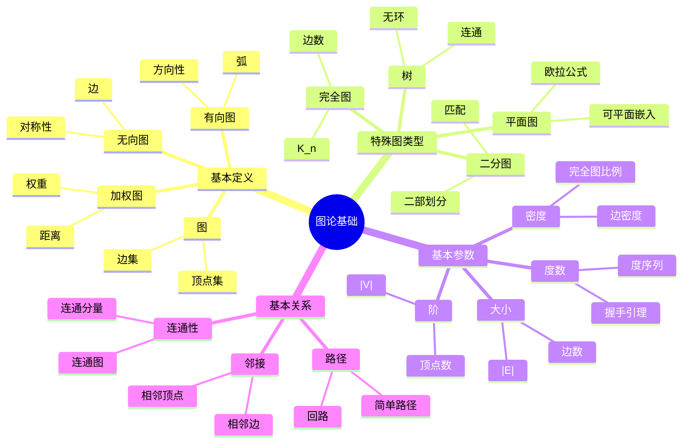
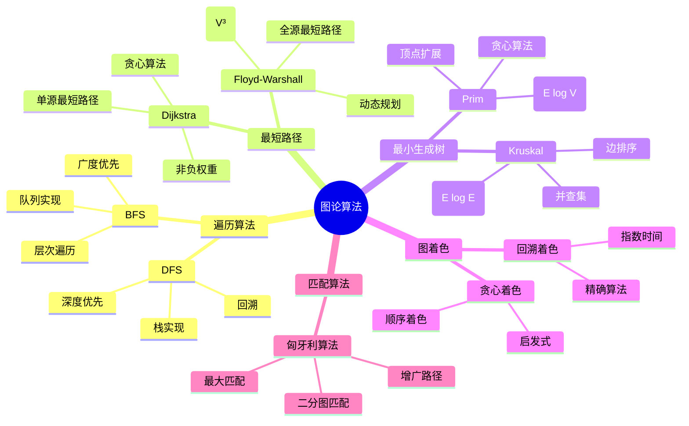
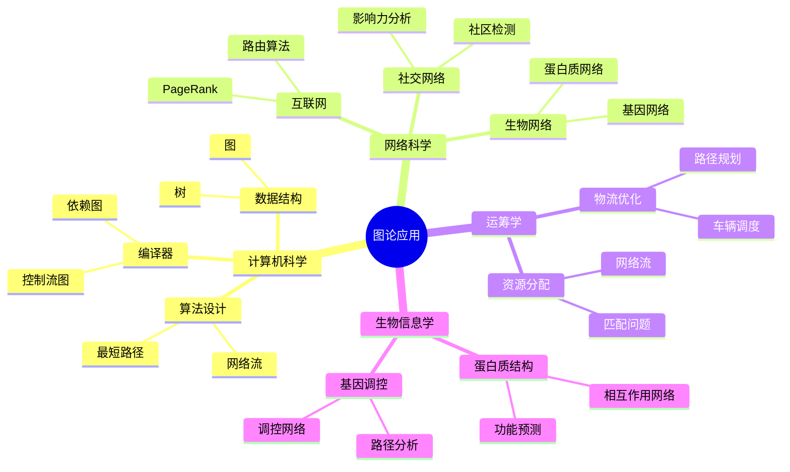
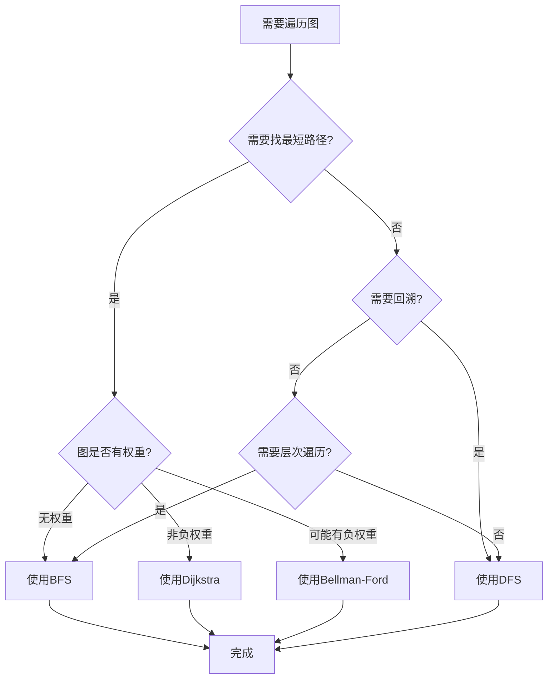
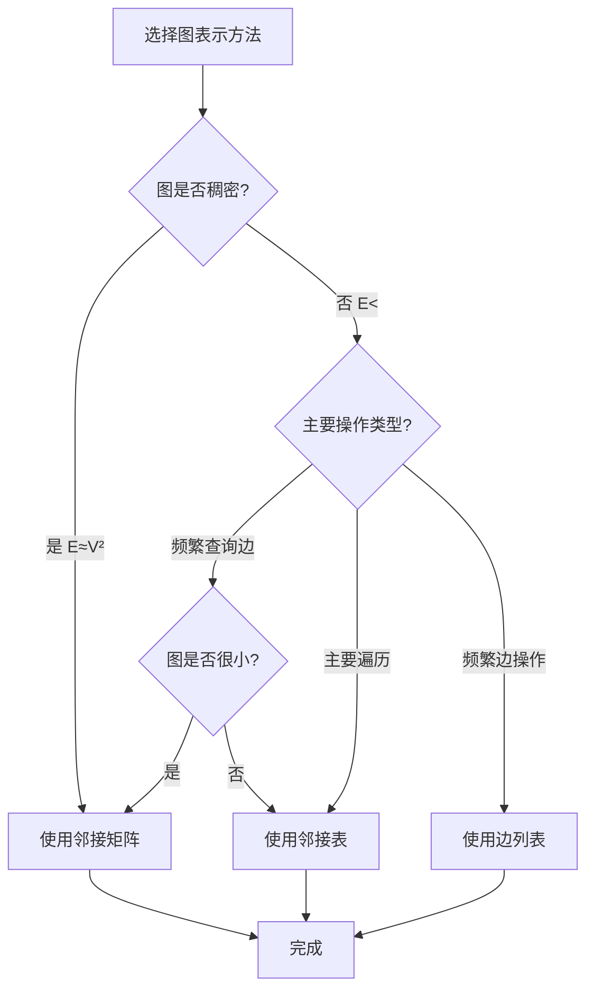
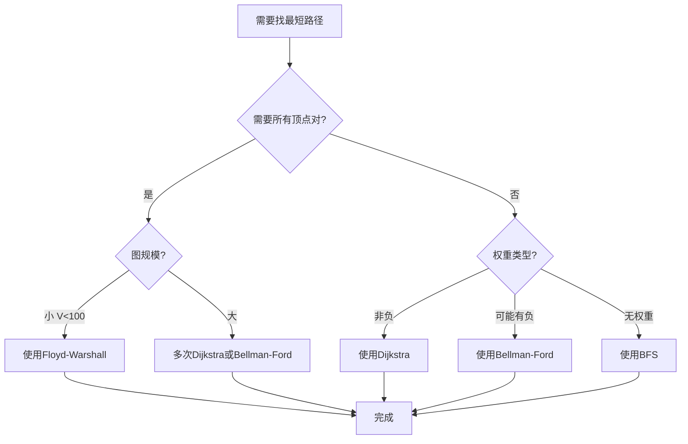
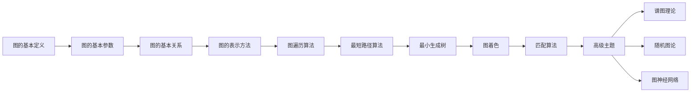
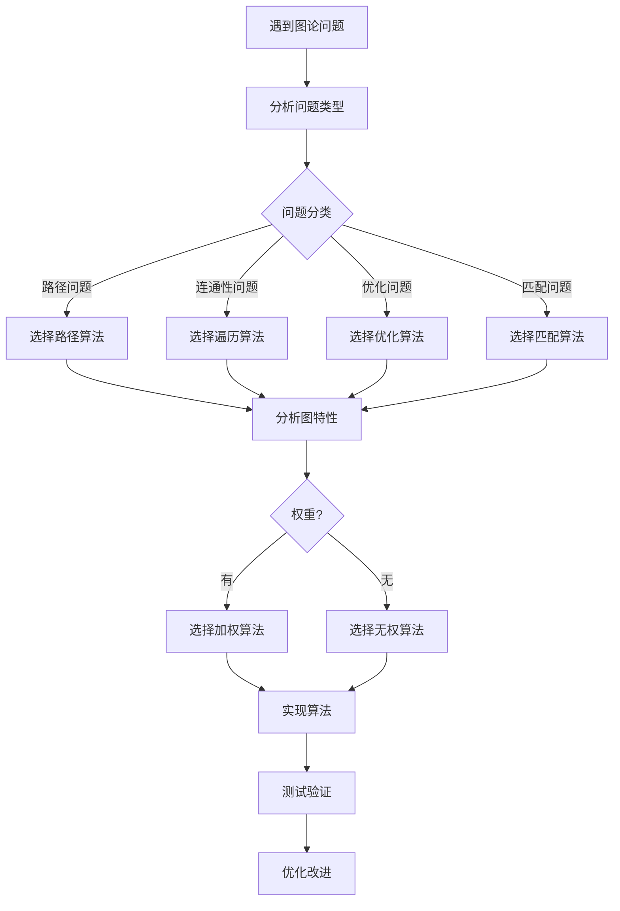
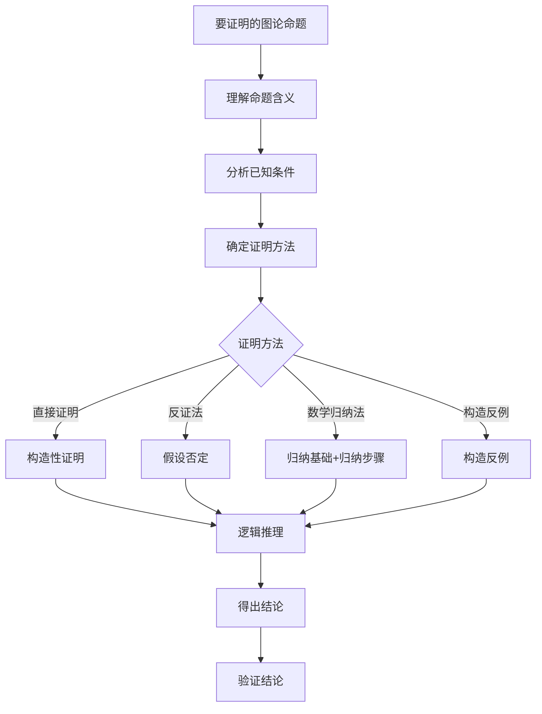
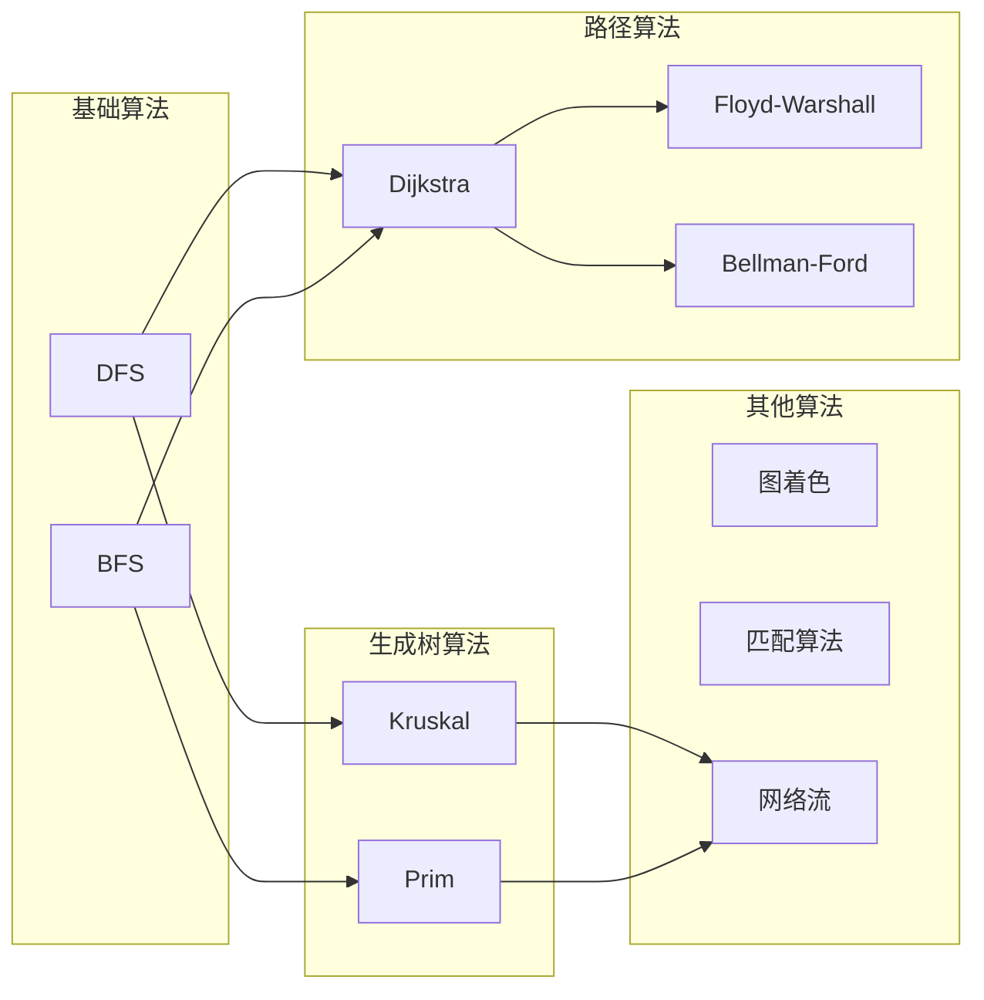

# 图论基础思维表征工具 / Graph Theory Mental Representation Tools

## 📚 **概述 / Overview**

本文档提供图论基础模块的多种思维表征工具，包括思维导图、对比矩阵、决策树、逻辑路径和概念地图，帮助更好地理解和应用图论知识。

**创建时间**: 2025年1月
**模块**: 图论基础
**状态**: 🚀 持续更新中

---

## 🗺️ **一、思维导图 / Mind Maps**

### 1.1 图论核心概念思维导图



### 1.2 图论算法思维导图



### 1.3 图论应用领域思维导图



---

## 📊 **二、对比矩阵 / Comparison Matrices**

### 2.1 图表示方法对比矩阵

| 表示方法 | 空间复杂度 | 查询边 | 遍历邻接点 | 添加边 | 删除边 | 适用场景 |
|---------|-----------|--------|-----------|--------|--------|---------|
| **邻接矩阵** | O(V²) | O(1) | O(V) | O(1) | O(1) | 稠密图、频繁查询 |
| **邻接表** | O(V+E) | O(deg(v)) | O(deg(v)) | O(1) | O(deg(v)) | 稀疏图、遍历为主 |
| **边列表** | O(E) | O(E) | O(E) | O(1) | O(E) | 边操作频繁、简单存储 |
| **关联矩阵** | O(V×E) | O(V) | O(E) | O(V) | O(V) | 超图、特殊应用 |

**选择指南**：
- **稠密图**（E ≈ V²）：优先使用邻接矩阵
- **稀疏图**（E << V²）：优先使用邻接表
- **边操作频繁**：考虑边列表
- **特殊结构**：根据需求选择

### 2.2 图遍历算法对比矩阵

| 算法 | 数据结构 | 时间复杂度 | 空间复杂度 | 特点 | 应用场景 |
|------|---------|-----------|-----------|------|---------|
| **DFS** | 栈 | O(V+E) | O(V) | 深度优先、回溯 | 连通性检测、拓扑排序、路径查找 |
| **BFS** | 队列 | O(V+E) | O(V) | 广度优先、层次遍历 | 最短路径（无权）、层次遍历、最短距离 |
| **迭代DFS** | 栈 | O(V+E) | O(V) | 显式栈、避免递归 | 深度限制搜索、避免栈溢出 |
| **双向BFS** | 双队列 | O(b^(d/2)) | O(b^(d/2)) | 从两端搜索 | 最短路径优化、状态空间搜索 |

**选择指南**：
- **路径查找**：DFS（回溯）或BFS（最短路径）
- **连通性检测**：DFS或BFS均可
- **拓扑排序**：DFS
- **最短路径（无权）**：BFS
- **深度限制搜索**：迭代DFS

### 2.3 最短路径算法对比矩阵

| 算法 | 适用图类型 | 时间复杂度 | 空间复杂度 | 特点 | 应用场景 |
|------|-----------|-----------|-----------|------|---------|
| **Dijkstra** | 非负权重 | O((V+E)log V) | O(V) | 单源、贪心 | 路由算法、路径规划 |
| **Bellman-Ford** | 任意权重 | O(VE) | O(V) | 单源、可检测负环 | 负权重图、负环检测 |
| **Floyd-Warshall** | 任意权重 | O(V³) | O(V²) | 全源、动态规划 | 小规模全源最短路径 |
| **A\*** | 非负权重 | O(b^d) | O(b^d) | 启发式搜索 | 路径规划、游戏AI |

**选择指南**：
- **单源、非负权重**：Dijkstra
- **单源、可能有负权重**：Bellman-Ford
- **全源最短路径**：Floyd-Warshall（小图）或多次Dijkstra（大图）
- **有启发信息**：A*

### 2.4 最小生成树算法对比矩阵

| 算法 | 时间复杂度 | 空间复杂度 | 特点 | 适用场景 |
|------|-----------|-----------|------|---------|
| **Kruskal** | O(E log E) | O(V+E) | 边排序、并查集 | 稀疏图、边已排序 |
| **Prim（邻接表）** | O(E log V) | O(V) | 顶点扩展、优先队列 | 稠密图、实时生成 |
| **Prim（邻接矩阵）** | O(V²) | O(V²) | 简单实现 | 稠密图、小规模图 |
| **Borůvka** | O(E log V) | O(V+E) | 并行友好 | 并行计算、大规模图 |

**选择指南**：
- **稀疏图**：Kruskal
- **稠密图**：Prim
- **边已排序**：Kruskal
- **并行计算**：Borůvka

---

## 🌳 **三、决策树 / Decision Trees**

### 3.1 图遍历算法选择决策树



### 3.2 图表示方法选择决策树



### 3.3 最短路径算法选择决策树



---

## 🛤️ **四、逻辑路径 / Logical Paths**

### 4.1 图论学习逻辑路径



### 4.2 图算法问题解决逻辑路径



### 4.3 图论证明逻辑路径



---

## 🗺️ **五、概念地图 / Concept Maps**

### 5.1 图论核心概念关系地图

```mermaid
graph TB
    subgraph "基本概念"
        A[图 G=V,E]
        B[顶点 V]
        C[边 E]
        D[有向图]
        E[无向图]
        F[加权图]
    end

    subgraph "基本参数"
        G[阶 |V|]
        H[大小 |E|]
        I[度数 deg]
        J[密度]
    end

    subgraph "基本关系"
        K[邻接]
        L[路径]
        M[连通性]
        N[同构]
    end

    subgraph "特殊图"
        O[完全图]
        P[二分图]
        Q[树]
        R[平面图]
    end

    A --> B
    A --> C
    A --> D
    A --> E
    A --> F

    A --> G
    A --> H
    B --> I
    A --> J

    B --> K
    C --> L
    A --> M
    A --> N

    A --> O
    A --> P
    A --> Q
    A --> R

    K --> L
    L --> M
    I --> J
```

### 5.2 图论算法关系地图



---

## 📈 **六、使用指南 / Usage Guide**

### 6.1 思维导图使用

- **学习新概念**：从中心概念开始，逐步扩展分支
- **复习知识**：通过思维导图快速回顾知识结构
- **知识整合**：将不同主题的思维导图连接起来

### 6.2 对比矩阵使用

- **算法选择**：根据问题特性选择合适算法
- **性能分析**：对比不同算法的复杂度
- **工具选择**：根据需求选择合适的数据结构

### 6.3 决策树使用

- **问题解决**：按照决策树逐步选择解决方案
- **算法选择**：根据问题特性选择算法
- **工具选择**：根据场景选择合适工具

### 6.4 逻辑路径使用

- **学习规划**：按照逻辑路径规划学习顺序
- **问题分析**：按照逻辑路径分析问题
- **证明构造**：按照逻辑路径构造证明

### 6.5 概念地图使用

- **概念理解**：通过概念地图理解概念关系
- **知识整合**：通过概念地图整合相关知识
- **跨领域学习**：通过概念地图连接不同领域

---

## 🔄 **七、持续更新 / Continuous Updates**

本文档将根据以下内容持续更新：

1. **新概念添加**：当添加新的图论概念时，更新相应的思维表征
2. **算法优化**：当发现更好的算法时，更新对比矩阵和决策树
3. **应用扩展**：当发现新的应用场景时，更新应用思维导图
4. **用户反馈**：根据用户反馈优化思维表征方式

---

**文档版本**: v1.0
**创建时间**: 2025年1月
**最后更新**: 2025年1月
**维护者**: GraphNetWorkCommunicate项目组
