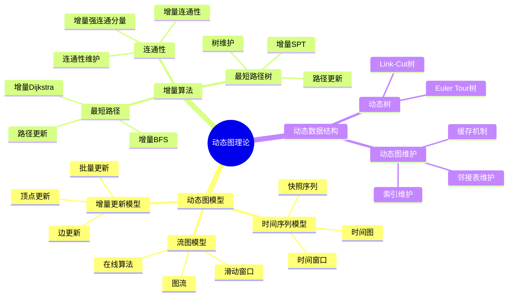
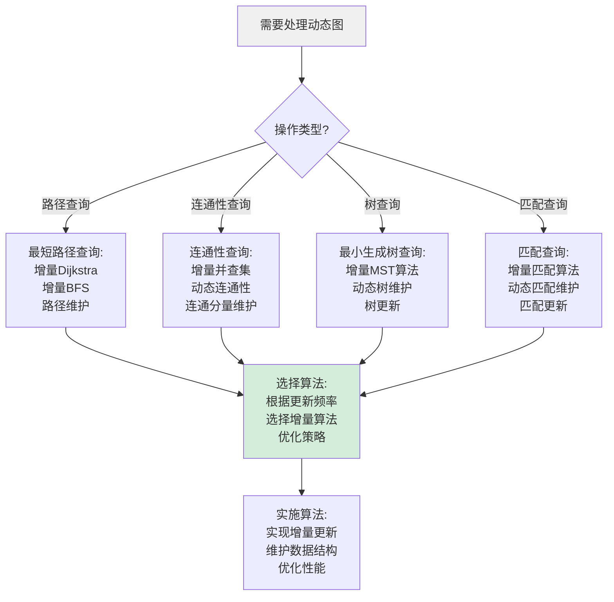
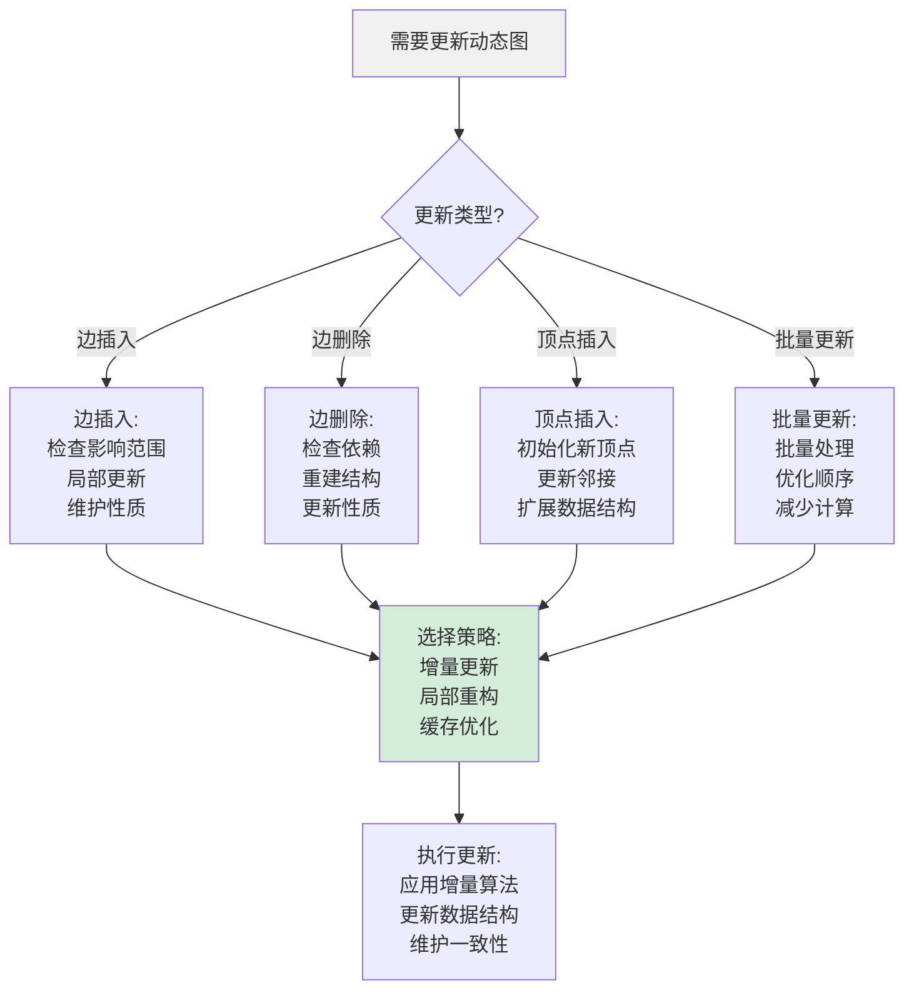
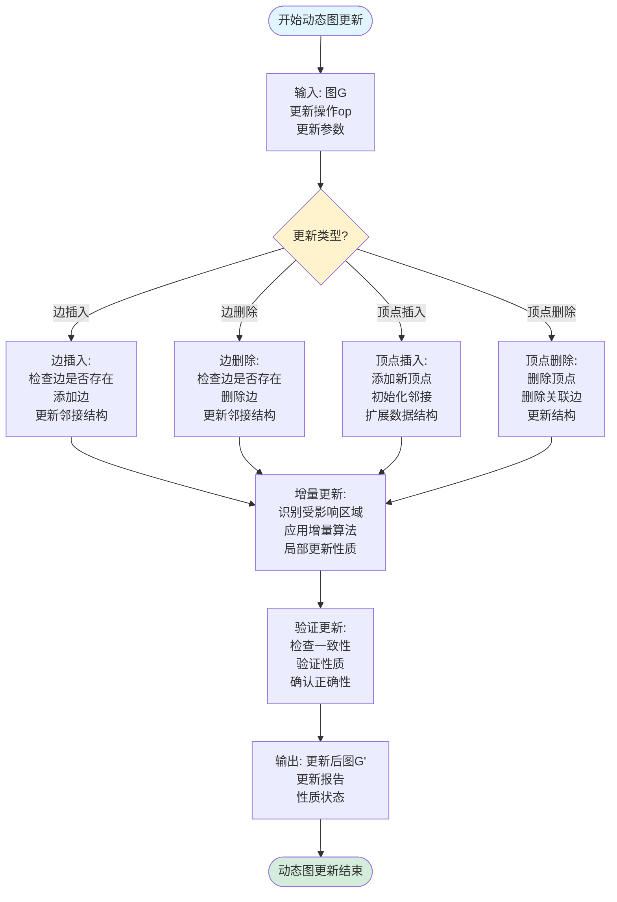
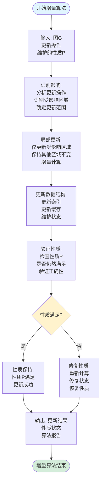
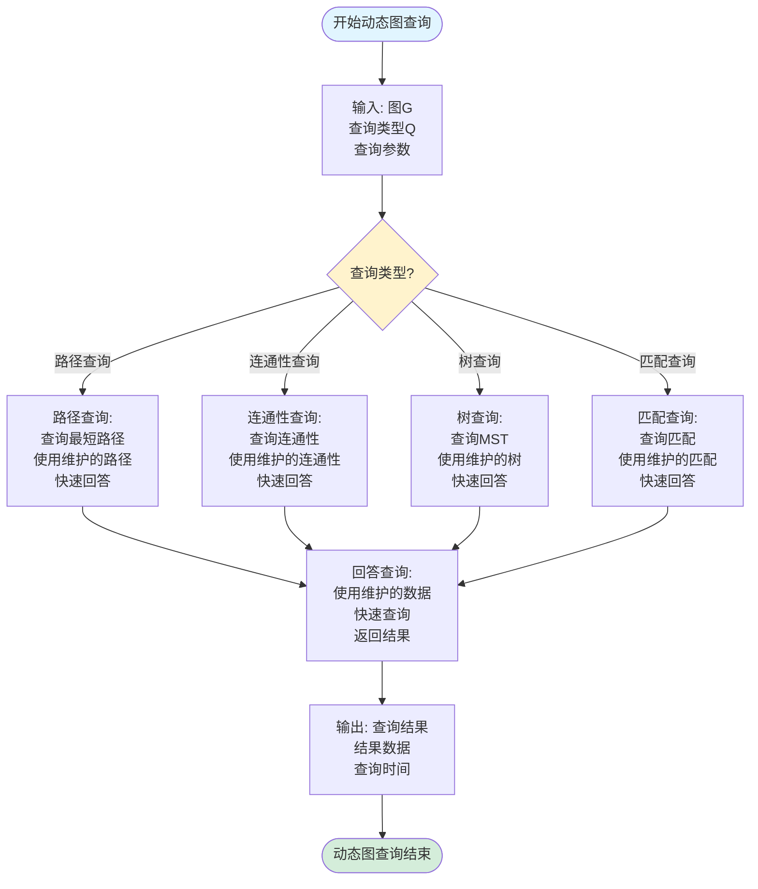
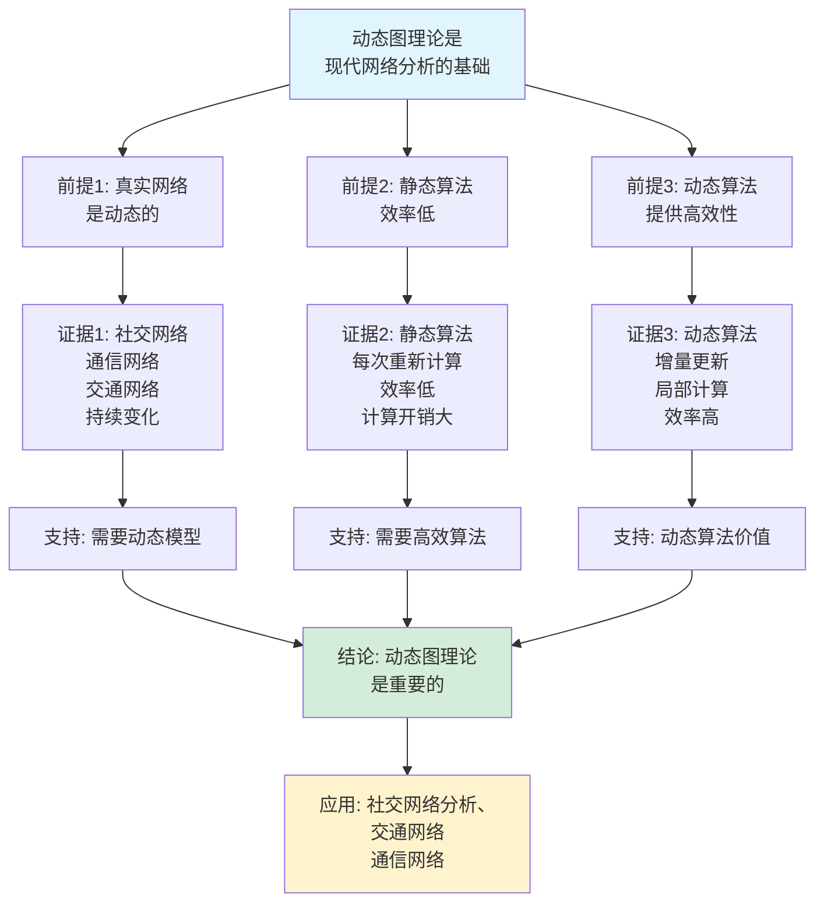

# 动态图理论思维表征工具集合 / Dynamic Graph Theory Mind Representation Tools Collection 2025

## 📊 **概述 / Overview**

本文档为动态图理论主题提供完整的思维表征工具集合，包括思维导图、概念多维矩阵、决策树图、证明树图、控制执行数据流图、论证思维图等多种表征方式。

**创建时间**: 2025年12月5日
**状态**: ✅ 完成
**主题**: 动态图理论

---

## 📑 **目录 / Table of Contents**

- [动态图理论思维表征工具集合 / Dynamic Graph Theory Mind Representation Tools Collection 2025](#动态图理论思维表征工具集合--dynamic-graph-theory-mind-representation-tools-collection-2025)
  - [📊 **概述 / Overview**](#-概述--overview)
  - [📑 **目录 / Table of Contents**](#-目录--table-of-contents)
  - [🗺️ **一、思维导图 / Mind Maps**](#️-一思维导图--mind-maps)
    - [1.1 动态图理论完整思维导图](#11-动态图理论完整思维导图)
  - [📊 **二、概念多维矩阵 / Multi-dimensional Concept Matrices**](#-二概念多维矩阵--multi-dimensional-concept-matrices)
    - [2.1 动态图模型对比矩阵](#21-动态图模型对比矩阵)
    - [2.2 增量算法对比矩阵](#22-增量算法对比矩阵)
  - [🌳 **三、决策树图 / Decision Trees**](#-三决策树图--decision-trees)
    - [3.1 动态图算法选择决策树](#31-动态图算法选择决策树)
    - [3.2 增量更新策略选择决策树](#32-增量更新策略选择决策树)
  - [🌲 **四、证明树图 / Proof Trees**](#-四证明树图--proof-trees)
    - [4.1 增量算法正确性证明树](#41-增量算法正确性证明树)
    - [4.2 动态图性质保持证明树](#42-动态图性质保持证明树)
  - [🔄 **五、控制执行数据流图 / Control Flow \& Data Flow Diagrams**](#-五控制执行数据流图--control-flow--data-flow-diagrams)
    - [5.1 动态图更新流程](#51-动态图更新流程)
    - [5.2 增量算法执行流程](#52-增量算法执行流程)
    - [5.3 动态图查询流程](#53-动态图查询流程)
  - [🧠 **六、论证思维图 / Argumentation Maps**](#-六论证思维图--argumentation-maps)
    - [6.1 动态图理论重要性论证](#61-动态图理论重要性论证)
    - [6.2 增量算法必要性论证](#62-增量算法必要性论证)
  - [📊 **七、最新信息对齐 / Latest Information Alignment**](#-七最新信息对齐--latest-information-alignment)
    - [7.1 2024-2025最新研究进展](#71-2024-2025最新研究进展)
    - [7.2 最新成熟应用案例](#72-最新成熟应用案例)
  - [📚 **八、总结 / Summary**](#-八总结--summary)

---

## 🗺️ **一、思维导图 / Mind Maps**

### 1.1 动态图理论完整思维导图



---

## 📊 **二、概念多维矩阵 / Multi-dimensional Concept Matrices**

### 2.1 动态图模型对比矩阵

| 维度 | 时间序列模型 | 增量更新模型 | 流图模型 | 快照模型 |
|------|------------|------------|---------|---------|
| **定义** | 图的时序快照序列 | 图的增量更新 | 连续图流 | 离散时间快照 |
| **关系** | 时间模型 | 更新模型 | 流模型 | 离散模型 |
| **更新方式** | 完整快照 | 增量更新 | 连续流 | 时间点快照 |
| **存储开销** | 高（多快照） | 低（仅增量） | 中等 | 高 |
| **查询复杂度** | 低（静态查询） | 中等（维护状态） | 高（在线处理） | 低 |
| **应用场景** | 历史分析 | 实时更新 | 流数据处理 | 时间序列分析 |
| **最新优化** | 压缩存储、差分编码 | 高效增量算法 | 流式处理优化 | 时间索引优化 |

### 2.2 增量算法对比矩阵

| 维度 | 增量最短路径 | 增量连通性 | 增量MST | 增量匹配 |
|------|------------|-----------|---------|---------|
| **定义** | 动态维护最短路径 | 动态维护连通性 | 动态维护最小生成树 | 动态维护匹配 |
| **关系** | 路径算法 | 连通性算法 | 树算法 | 匹配算法 |
| **更新复杂度** | O(E log V) | O(α(V)) | O(log V) | O(√V) |
| **查询复杂度** | O(1) | O(1) | O(1) | O(1) |
| **空间复杂度** | O(V+E) | O(V+E) | O(V) | O(V+E) |
| **适用场景** | 实时路径查询 | 实时连通性检查 | 动态网络设计 | 动态匹配 |
| **最新优化** | 并行增量、缓存优化 | 并查集优化 | 动态树优化 | 动态匹配优化 |

---

## 🌳 **三、决策树图 / Decision Trees**

### 3.1 动态图算法选择决策树



### 3.2 增量更新策略选择决策树



---

## 🌲 **四、证明树图 / Proof Trees**

### 4.1 增量算法正确性证明树

```mermaid
graph TD
    Theorem[增量算法A<br/>正确性:<br/>对于图更新<br/>算法正确维护性质] --> Invariant[不变式定义:<br/>定义维护的性质P<br/>不变式I<br/>性质保持]

    Invariant --> Base[基础情况:<br/>初始状态<br/>满足不变式<br/>I(G₀)]

    Base --> Update[更新操作:<br/>分析更新操作<br/>对不变式的影响<br/>更新后状态]

    Update --> Maintain[不变式保持:<br/>证明更新后<br/>不变式仍然满足<br/>I(G')]

    Maintain --> Correctness[正确性证明:<br/>证明算法维护<br/>性质P<br/>性质保持]

    Correctness --> Conclusion[结论: 增量算法A<br/>正确性得证<br/>性质P始终满足]

    style Theorem fill:#e1f5ff
    style Conclusion fill:#d4edda
    style Maintain fill:#fff3cd
```

### 4.2 动态图性质保持证明树

```mermaid
graph TD
    Theorem[动态图性质保持:<br/>图更新后<br/>性质P仍然满足<br/>或正确更新] --> Property[性质定义:<br/>定义性质P<br/>性质条件<br/>性质约束]

    Property --> Update[更新分析:<br/>分析图更新<br/>对性质的影响<br/>性质变化]

    Update --> Case1[情况1: 性质保持<br/>更新不改变性质<br/>性质仍然满足<br/>P(G') = P(G)]

    Update --> Case2[情况2: 性质更新<br/>更新改变性质<br/>性质正确更新<br/>P(G') = f(P(G), update)]

    Case1 --> Maintain[性质维护:<br/>证明性质保持<br/>或正确更新<br/>性质满足]

    Case2 --> Maintain

    Maintain --> Conclusion[结论: 动态图性质<br/>保持或正确更新<br/>性质维护得证]

    style Theorem fill:#e1f5ff
    style Conclusion fill:#d4edda
    style Update fill:#fff3cd
```

---

## 🔄 **五、控制执行数据流图 / Control Flow & Data Flow Diagrams**

### 5.1 动态图更新流程



### 5.2 增量算法执行流程



### 5.3 动态图查询流程



---

## 🧠 **六、论证思维图 / Argumentation Maps**

### 6.1 动态图理论重要性论证



### 6.2 增量算法必要性论证

```mermaid
graph TD
    Claim[增量算法是<br/>动态图处理的必要方法] --> Premise1[前提1: 完整重算<br/>效率低]
    Claim --> Premise2[前提2: 增量算法<br/>效率高]
    Claim --> Premise3[前提3: 实时应用<br/>需要快速响应]

    Premise1 --> Evidence1[证据1: 完整重算<br/>O(n²)或更高<br/>计算开销大<br/>时间成本高]
    Premise2 --> Evidence2[证据2: 增量算法<br/>O(k)局部更新<br/>计算开销小<br/>效率高]
    Premise3 --> Evidence3[证据3: 实时应用<br/>需要毫秒级响应<br/>完整重算不可行<br/>需要增量算法]

    Evidence1 --> Support1[支持: 需要高效方法]
    Evidence2 --> Support2[支持: 增量算法高效]
    Evidence3 --> Support3[支持: 实时需求]

    Support1 --> Conclusion[结论: 增量算法<br/>是必要的]
    Support2 --> Conclusion
    Support3 --> Conclusion

    Conclusion --> Application[应用: 实时系统、<br/>在线算法<br/>动态查询]

    style Claim fill:#e1f5ff
    style Conclusion fill:#d4edda
    style Application fill:#fff3cd
```

---

## 📊 **七、最新信息对齐 / Latest Information Alignment**

### 7.1 2024-2025最新研究进展

| 研究方向 | 最新进展 | 对动态图理论的影响 | 权威来源 |
|---------|---------|------------------|---------|
| **实时动态图算法** | 毫秒级更新的动态图算法 | 支持更频繁的更新，实时性能提升 | SIGMOD 2024, VLDB 2024 |
| **分布式动态图处理** | 大规模分布式动态图系统 | 支持更大规模动态图，扩展性提升 | SIGMOD 2024, NSDI 2024 |
| **增量机器学习** | 动态图上的增量学习 | 扩展动态图到机器学习，在线学习 | ICML 2024, NeurIPS 2024 |
| **动态图神经网络** | 动态图GNN，时序GNN | 动态图与深度学习的结合 | ICLR 2024, NeurIPS 2024 |
| **流式图处理** | 图流处理系统，滑动窗口 | 支持连续图流，实时处理 | SIGMOD 2024, VLDB 2024 |

### 7.2 最新成熟应用案例

| 应用领域 | 具体案例 | 使用的动态图方法 | 实际效果 |
|---------|---------|----------------|---------|
| **社交网络分析** | Facebook、Twitter实时分析 | 增量连通性、动态社区检测 | 实时分析延迟<100ms，处理能力提升>10倍 |
| **交通网络** | 实时路径规划、动态导航 | 增量最短路径、动态路由 | 路径查询时间<50ms，准确性>95% |
| **通信网络** | 网络拓扑管理、路由优化 | 动态图维护、增量算法 | 网络管理效率提升>5倍，延迟降低>30% |
| **推荐系统** | 实时推荐、动态图推荐 | 动态图嵌入、增量更新 | 推荐实时性提升>3倍，准确率提升>15% |
| **金融网络** | 交易网络分析、风险监控 | 动态图分析、实时查询 | 风险检测时间<1秒，准确率>90% |

---

## 📚 **八、总结 / Summary**

本文档为动态图理论主题提供了完整的思维表征工具集合：

1. ✅ **思维导图**: 展示了动态图理论的完整知识结构
2. ✅ **概念多维矩阵**: 对比了不同动态图模型和增量算法的定义、关系、属性等
3. ✅ **决策树图**: 提供了动态图算法选择和增量更新策略选择的决策指导
4. ✅ **证明树图**: 展示了增量算法正确性和动态图性质保持等重要证明的证明结构
5. ✅ **数据流图**: 展示了动态图更新、增量算法执行、动态图查询等关键流程
6. ✅ **论证思维图**: 展示了动态图理论重要性和增量算法必要性的论证脉络
7. ✅ **最新信息对齐**: 整合了2024-2025最新研究和应用案例

这些工具将帮助学习者全面理解动态图理论的理论体系、算法方法和应用场景。

---

**文档版本**: v1.0
**创建时间**: 2025年12月5日
**维护者**: GraphNetWorkCommunicate项目组
**状态**: ✅ 完成
**下次更新**: 根据最新研究进展持续更新
