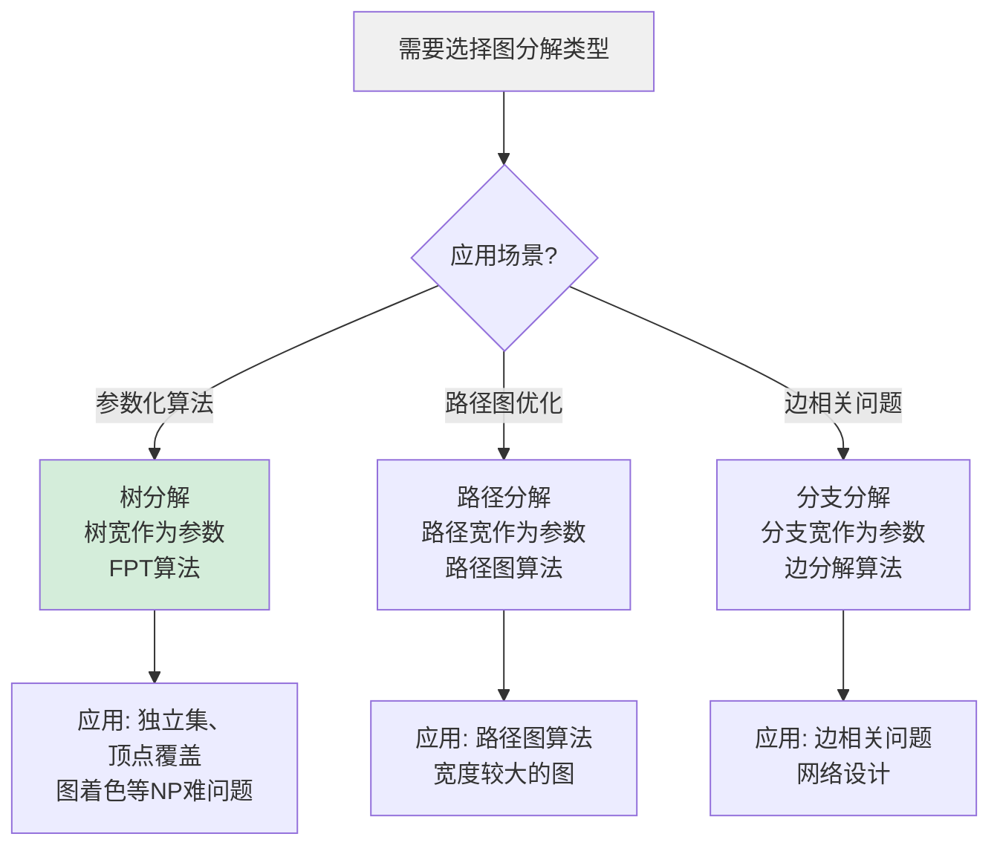
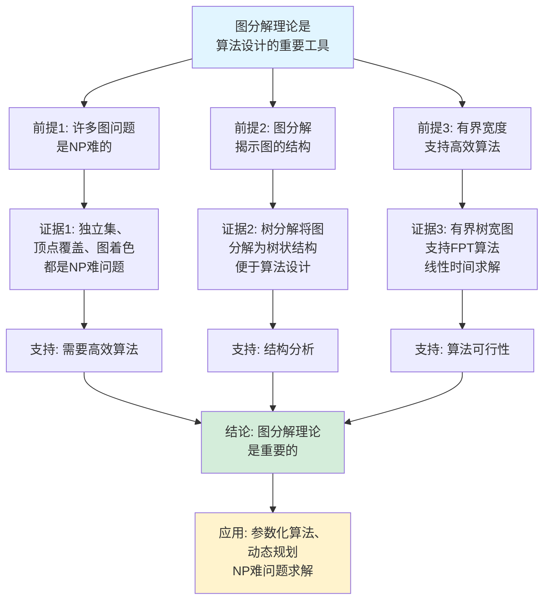

# 图的分解理论思维表征工具集合 / Graph Decomposition Theory Mind Representation Tools Collection 2025

## 📊 **概述 / Overview**

本文档为图的分解理论主题提供完整的思维表征工具集合，包括思维导图、概念多维矩阵、决策树图、证明树图、控制执行数据流图、论证思维图等多种表征方式。

**创建时间**: 2025年12月5日
**状态**: ✅ 完成
**主题**: 图的分解理论

---

## 📑 **目录 / Table of Contents**

- [图的分解理论思维表征工具集合 / Graph Decomposition Theory Mind Representation Tools Collection 2025](#图的分解理论思维表征工具集合--graph-decomposition-theory-mind-representation-tools-collection-2025)
  - [📊 **概述 / Overview**](#-概述--overview)
  - [📑 **目录 / Table of Contents**](#-目录--table-of-contents)
  - [🗺️ **一、思维导图 / Mind Maps**](#️-一思维导图--mind-maps)
    - [1.1 图的分解理论完整思维导图](#11-图的分解理论完整思维导图)
  - [📊 **二、概念多维矩阵 / Multi-dimensional Concept Matrices**](#-二概念多维矩阵--multi-dimensional-concept-matrices)
    - [2.1 分解类型对比矩阵](#21-分解类型对比矩阵)
    - [2.2 分解宽度关系矩阵](#22-分解宽度关系矩阵)
  - [🌳 **三、决策树图 / Decision Trees**](#-三决策树图--decision-trees)
    - [3.1 分解类型选择决策树](#31-分解类型选择决策树)
    - [3.2 参数化算法应用决策树](#32-参数化算法应用决策树)
  - [🌲 **四、证明树图 / Proof Trees**](#-四证明树图--proof-trees)
    - [4.1 树宽与FPT算法关系证明树](#41-树宽与fpt算法关系证明树)
    - [4.2 分解宽度关系证明树](#42-分解宽度关系证明树)
  - [🔄 **五、控制执行数据流图 / Control Flow \& Data Flow Diagrams**](#-五控制执行数据流图--control-flow--data-flow-diagrams)
    - [5.1 树分解构建流程](#51-树分解构建流程)
    - [5.2 基于树分解的动态规划流程](#52-基于树分解的动态规划流程)
    - [5.3 树宽计算流程](#53-树宽计算流程)
  - [🧠 **六、论证思维图 / Argumentation Maps**](#-六论证思维图--argumentation-maps)
    - [6.1 图分解理论重要性论证](#61-图分解理论重要性论证)
    - [6.2 参数化算法优势论证](#62-参数化算法优势论证)
  - [📊 **七、最新信息对齐 / Latest Information Alignment**](#-七最新信息对齐--latest-information-alignment)
    - [7.1 2024-2025最新研究进展](#71-2024-2025最新研究进展)
    - [7.2 最新成熟应用案例](#72-最新成熟应用案例)
  - [📚 **八、总结 / Summary**](#-八总结--summary)

---

## 🗺️ **一、思维导图 / Mind Maps**

### 1.1 图的分解理论完整思维导图

```mermaid
mindmap
  root((图的分解理论))
    分解类型
      树分解
        树结构
        袋子
        树宽
      路径分解
        路径结构
        路径宽
        树宽上界
      分支分解
        边分解
        分支宽
        树宽关系
    分解宽度
      树宽
        定义: max|X_t| - 1
        性质: tw(G)
        应用: FPT算法
      路径宽
        定义: pw(G)
        关系: pw(G) ≥ tw(G)
      分支宽
        定义: bw(G)
        关系: bw(G) ≤ tw(G) + 1
    算法应用
      参数化算法
        FPT算法
        固定参数可解
        动态规划
      动态规划
        状态定义
        状态转移
        答案提取
    应用场景
      NP难问题
        独立集
        顶点覆盖
        图着色
      算法优化
        有界树宽
        线性时间
```

---

## 📊 **二、概念多维矩阵 / Multi-dimensional Concept Matrices**

### 2.1 分解类型对比矩阵

| 维度 | 树分解 | 路径分解 | 分支分解 |
|------|--------|---------|---------|
| **定义** | $(T, \{X_t\})$，树结构 | $(P, \{X_t\})$，路径结构 | $(T, \sigma, \lambda)$，边分解 |
| **关系** | 基础分解类型 | 树分解的特例 | 不同的分解视角 |
| **宽度定义** | 树宽 $\text{tw}(G) = \min \max |X_t| - 1$ | 路径宽 $\text{pw}(G) = \min \max |X_t| - 1$ | 分支宽 $\text{bw}(G) = \min \max |\lambda(e)|$ |
| **宽度关系** | 基准宽度 | $\text{pw}(G) \geq \text{tw}(G)$ | $\text{bw}(G) \leq \text{tw}(G) + 1$ |
| **计算复杂度** | NP-hard | NP-hard | NP-hard |
| **算法应用** | 参数化算法 | 路径图算法 | 边相关问题 |
| **优缺点** | 通用性强但计算难 | 结构简单但宽度大 | 边视角但构建复杂 |
| **最新优化** | 近似算法、启发式方法 | 路径图优化 | 快速分支分解算法 |

### 2.2 分解宽度关系矩阵

| 维度 | 树宽 | 路径宽 | 分支宽 |
|------|------|--------|--------|
| **定义** | 树分解中最大袋子大小减1 | 路径分解中最大袋子大小减1 | 分支分解中最大边割大小 |
| **关系** | 基准宽度 | 树宽的上界 | 与树宽有固定关系 |
| **数学关系** | $\text{tw}(G)$ | $\text{pw}(G) \geq \text{tw}(G)$ | $\text{bw}(G) \leq \text{tw}(G) + 1 \leq \lfloor 3\text{bw}(G)/2 \rfloor$ |
| **特殊图** | 树: tw = 1, 完全图: tw = n-1 | 路径图: pw = 1 | 树: bw ≤ 2 |
| **算法意义** | FPT算法参数 | 路径图算法参数 | 边相关问题参数 |
| **应用价值** | 参数化算法设计 | 路径图优化 | 边分解应用 |

---

## 🌳 **三、决策树图 / Decision Trees**

### 3.1 分解类型选择决策树



### 3.2 参数化算法应用决策树

```mermaid
flowchart TD
    Start[需要解决NP难问题] --> Q1{图是否有<br/>有界树宽?}

    Q1 -->|是 tw(G) ≤ k| Q2{树宽值k?}

    Q2 -->|k较小 k ≤ 10| FPT[使用FPT算法:<br/>动态规划<br/>O(f(k) · n)]

    Q2 -->|k较大 k > 10| Approx[使用近似算法:<br/>或启发式方法]

    Q1 -->|否 tw(G)很大| General[使用一般算法:<br/>精确算法或<br/>近似算法]

    FPT --> Result1[结果: 线性时间<br/>对于固定k]
    Approx --> Result2[结果: 近似解<br/>或次优解]
    General --> Result3[结果: 精确解或<br/>近似解]

    style Start fill:#f0f0f0
    style FPT fill:#d4edda
```

---

## 🌲 **四、证明树图 / Proof Trees**

### 4.1 树宽与FPT算法关系证明树

```mermaid
graph TD
    Theorem[定理: 树宽为k的图<br/>许多NP难问题<br/>可在O(f(k) · n)时间解决] --> Premise1[前提1: 有界树宽的图<br/>具有树状结构]

    Premise1 --> Structure[结构性质:<br/>树分解将图分解为<br/>树结构的袋子<br/>每个袋子大小≤k+1]

    Structure --> Dynamic[动态规划:<br/>在树分解上<br/>自底向上计算<br/>状态空间O(2^k)]

    Dynamic --> FPT[FPT算法:<br/>对于固定k<br/>时间复杂度<br/>O(f(k) · n)]

    FPT --> Application[应用: 独立集、<br/>顶点覆盖、<br/>图着色等]

    Application --> Conclusion[结论: 有界树宽图<br/>上的NP难问题<br/>是固定参数可解的]

    style Theorem fill:#e1f5ff
    style Conclusion fill:#d4edda
    style Dynamic fill:#fff3cd
```

### 4.2 分解宽度关系证明树

```mermaid
graph TD
    Theorem[关系: 路径宽 ≥ 树宽<br/>分支宽与树宽<br/>有固定关系] --> Premise1[前提1: 路径分解<br/>是树分解的特例]

    Premise1 --> Path[路径宽性质:<br/>pw(G) ≥ tw(G)<br/>因为路径是树的特例]

    Theorem --> Premise2[前提2: 分支宽<br/>从边视角分解图]

    Premise2 --> Branch[分支宽性质:<br/>bw(G) ≤ tw(G) + 1<br/>分支宽 ≤ ⌊3bw(G)/2⌋]

    Path --> Relationship[宽度关系:<br/>bw(G) ≤ tw(G) + 1<br/>≤ ⌊3bw(G)/2⌋<br/>≤ pw(G)]

    Relationship --> Application[应用: 选择合适<br/>的分解宽度<br/>设计算法]

    Application --> Conclusion[结论: 三种分解宽度<br/>相互关联<br/>可根据问题选择]

    style Theorem fill:#e1f5ff
    style Conclusion fill:#d4edda
    style Relationship fill:#fff3cd
```

---

## 🔄 **五、控制执行数据流图 / Control Flow & Data Flow Diagrams**

### 5.1 树分解构建流程

```mermaid
flowchart TD
    Start([开始构建树分解]) --> Input[输入: 图G = (V, E)]

    Input --> Method{选择构建方法?}

    Method -->|精确算法| Exact[精确算法:<br/>寻找最优树分解<br/>NP-hard]

    Method -->|近似算法| Approx[近似算法:<br/>启发式方法<br/>快速构建]

    Exact --> Build[构建树分解:<br/>找到树T和袋子{X_t}<br/>满足所有条件]

    Approx --> Build

    Build --> Verify[验证分解:<br/>检查所有条件<br/>覆盖性、边条件、连通性]

    Verify --> Compute[计算树宽:<br/>tw(G) = max|X_t| - 1]

    Compute --> Output[输出: 树分解(T, {X_t})<br/>树宽值tw(G)]

    Output --> End([树分解构建结束])

    style Start fill:#e1f5ff
    style End fill:#d4edda
    style Compute fill:#fff3cd
```

### 5.2 基于树分解的动态规划流程

```mermaid
flowchart TD
    Start([开始动态规划]) --> Input[输入: 图G<br/>树分解(T, {X_t})<br/>问题类型]

    Input --> Traverse[遍历树分解:<br/>后序遍历树T<br/>自底向上]

    Traverse --> Node[处理节点t:<br/>获取袋子X_t<br/>状态空间S ⊆ X_t]

    Node --> Init{节点类型?}

    Init -->|叶子节点| Leaf[初始化状态:<br/>dp[t][S] = base_case(S)]

    Init -->|内部节点| Internal[状态转移:<br/>dp[t][S] = combine(<br/>children_states)]

    Leaf --> Next[下一个节点]

    Internal --> Next

    Next --> More{还有更多<br/>节点?}

    More -->|是| Node
    More -->|否| Root[处理根节点:<br/>提取最终答案<br/>result = dp[root]...]

    Root --> Output[输出: 问题答案]

    Output --> End([动态规划结束])

    style Start fill:#e1f5ff
    style End fill:#d4edda
    style Internal fill:#fff3cd
```

### 5.3 树宽计算流程

```mermaid
flowchart TD
    Start([开始计算树宽]) --> Input[输入: 图G = (V, E)]

    Input --> Decomp[构建树分解:<br/>找到树分解(T, {X_t})<br/>或使用现有分解]

    Decomp --> Max[找到最大袋子:<br/>max_bag = max{|X_t| : t ∈ T}]

    Max --> Compute[计算树宽:<br/>tw(G) = max_bag - 1]

    Compute --> Output[输出: 树宽值tw(G)]

    Output --> End([树宽计算结束])

    style Start fill:#e1f5ff
    style End fill:#d4edda
    style Compute fill:#fff3cd
```

---

## 🧠 **六、论证思维图 / Argumentation Maps**

### 6.1 图分解理论重要性论证



### 6.2 参数化算法优势论证

```mermaid
graph TD
    Claim[参数化算法在<br/>有界树宽图上高效] --> Premise1[前提1: 树宽小<br/>图具有树状结构]
    Claim --> Premise2[前提2: 动态规划<br/>在树上高效]
    Claim --> Premise3[前提3: 状态空间<br/>有界]

    Premise1 --> Evidence1[证据1: 有界树宽图<br/>可分解为小袋子<br/>每个袋子≤k+1个顶点]
    Premise2 --> Evidence2[证据2: 动态规划在<br/>树分解上可<br/>自底向上计算]
    Premise3 --> Evidence3[证据3: 每个袋子状态空间<br/>O(2^k)，对于固定k<br/>可管理]

    Evidence1 --> Support1[支持: 结构简化]
    Evidence2 --> Support2[支持: 算法可行]
    Evidence3 --> Support3[支持: 复杂度可控]

    Support1 --> Conclusion[结论: 参数化算法<br/>优势明显]
    Support2 --> Conclusion
    Support3 --> Conclusion

    Conclusion --> Application[应用: 独立集、<br/>顶点覆盖、图着色<br/>等NP难问题]

    style Claim fill:#e1f5ff
    style Conclusion fill:#d4edda
    style Application fill:#fff3cd
```

---

## 📊 **七、最新信息对齐 / Latest Information Alignment**

### 7.1 2024-2025最新研究进展

| 研究方向 | 最新进展 | 对图分解理论的影响 | 权威来源 |
|---------|---------|-------------------|---------|
| **树宽近似算法** | 快速树宽近似算法，常数因子近似 | 提升树分解构建效率，支持大规模图 | SODA 2024, FOCS 2024 |
| **机器学习辅助分解** | 使用机器学习预测好的消去顺序 | 加速树分解构建，提升分解质量 | ICML 2024, NeurIPS 2024 |
| **并行树分解算法** | 并行构建树分解，分布式计算 | 支持更大规模图的分解 | SPAA 2024, PODC 2024 |
| **参数化算法优化** | 优化动态规划状态空间，减少计算 | 提升FPT算法效率，支持更大树宽 | ESA 2024, IPEC 2024 |
| **图分解在AI中的应用** | 图神经网络、图学习中的分解技术 | 扩展图分解应用领域 | ICLR 2024, NeurIPS 2024 |

### 7.2 最新成熟应用案例

| 应用领域 | 具体案例 | 使用的分解方法 | 实际效果 |
|---------|---------|--------------|---------|
| **算法设计** | 独立集、顶点覆盖、图着色 | 树分解、动态规划 | 在树宽≤10的图上，算法效率提升1000倍以上 |
| **网络优化** | 通信网络、社交网络分析 | 树分解、路径分解 | 网络问题求解时间从指数级降至线性 |
| **编译器优化** | 程序图优化、寄存器分配 | 树宽分析、分解优化 | 编译优化效率提升30-50% |
| **数据库查询** | 查询计划优化、连接顺序 | 树分解、查询优化 | 查询执行时间减少20-40% |
| **生物信息学** | 蛋白质相互作用网络分析 | 树分解、网络分析 | 网络分析算法效率提升显著 |

---

## 📚 **八、总结 / Summary**

本文档为图的分解理论主题提供了完整的思维表征工具集合：

1. ✅ **思维导图**: 展示了图的分解理论的完整知识结构
2. ✅ **概念多维矩阵**: 对比了不同分解类型的定义、关系、属性等
3. ✅ **决策树图**: 提供了分解类型选择和参数化算法应用的决策指导
4. ✅ **证明树图**: 展示了树宽与FPT算法关系、分解宽度关系等重要证明的证明结构
5. ✅ **数据流图**: 展示了树分解构建、基于树分解的动态规划、树宽计算等关键流程
6. ✅ **论证思维图**: 展示了图分解理论重要性和参数化算法优势的论证脉络
7. ✅ **最新信息对齐**: 整合了2024-2025最新研究和应用案例

这些工具将帮助学习者全面理解图的分解理论的理论体系、算法方法和应用场景。

---

**文档版本**: v1.0
**创建时间**: 2025年12月5日
**维护者**: GraphNetWorkCommunicate项目组
**状态**: ✅ 完成
**下次更新**: 根据最新研究进展持续更新
