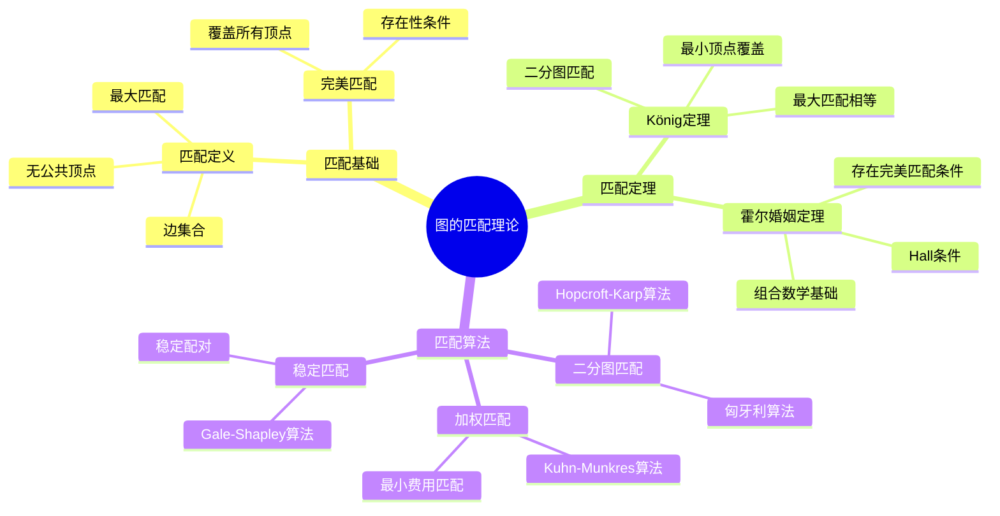
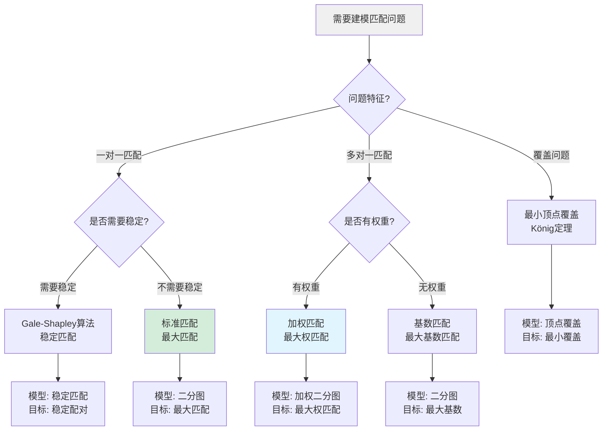
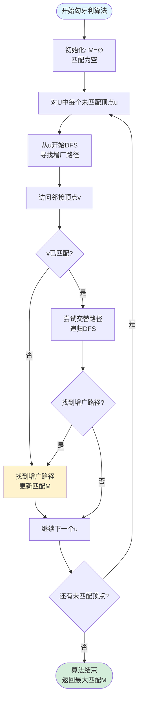
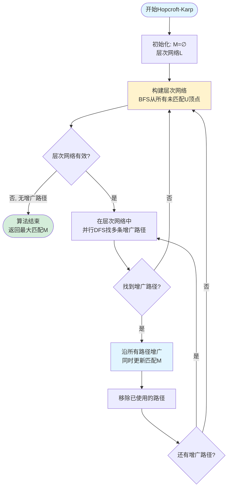
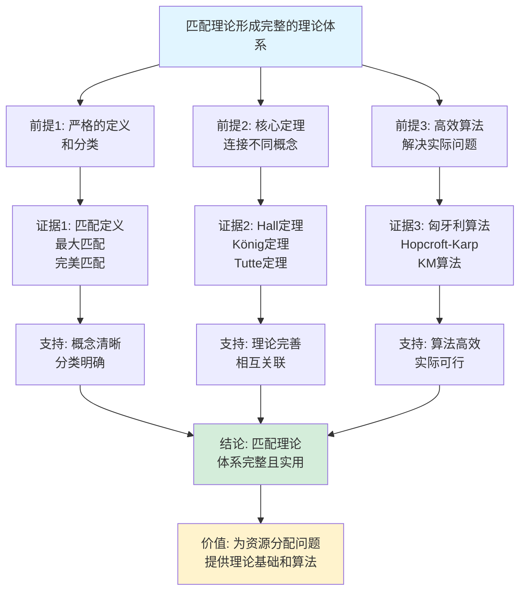

# 图的匹配理论思维表征工具集合 / Graph Matching Theory Mind Representation Tools Collection 2025

## 📊 **概述 / Overview**

本文档为图的匹配理论主题提供完整的思维表征工具集合，包括思维导图、概念多维矩阵、决策树图、证明树图、控制执行数据流图、论证思维图等多种表征方式。

**创建时间**: 2025年12月5日
**状态**: ✅ 完成
**主题**: 图的匹配理论

---

## 📑 **目录 / Table of Contents**

- [图的匹配理论思维表征工具集合 / Graph Matching Theory Mind Representation Tools Collection 2025](#图的匹配理论思维表征工具集合--graph-matching-theory-mind-representation-tools-collection-2025)
  - [📊 **概述 / Overview**](#-概述--overview)
  - [📑 **目录 / Table of Contents**](#-目录--table-of-contents)
  - [🗺️ **一、思维导图 / Mind Maps**](#️-一思维导图--mind-maps)
    - [1.1 图的匹配理论完整思维导图](#11-图的匹配理论完整思维导图)
  - [📊 **二、概念多维矩阵 / Multi-dimensional Concept Matrices**](#-二概念多维矩阵--multi-dimensional-concept-matrices)
    - [2.1 匹配算法对比矩阵](#21-匹配算法对比矩阵)
    - [2.2 匹配概念关系矩阵](#22-匹配概念关系矩阵)
  - [🌳 **三、决策树图 / Decision Trees**](#-三决策树图--decision-trees)
    - [3.1 匹配算法选择决策树](#31-匹配算法选择决策树)
    - [3.2 匹配问题建模决策树](#32-匹配问题建模决策树)
  - [🌲 **四、证明树图 / Proof Trees**](#-四证明树图--proof-trees)
    - [4.1 Hall婚姻定理证明树](#41-hall婚姻定理证明树)
    - [4.2 König定理证明树](#42-könig定理证明树)
  - [🔄 **五、控制执行数据流图 / Control Flow \& Data Flow Diagrams**](#-五控制执行数据流图--control-flow--data-flow-diagrams)
    - [5.1 匈牙利算法执行流程](#51-匈牙利算法执行流程)
    - [5.2 Hopcroft-Karp算法执行流程](#52-hopcroft-karp算法执行流程)
  - [🧠 **六、论证思维图 / Argumentation Maps**](#-六论证思维图--argumentation-maps)
    - [6.1 匹配理论体系论证](#61-匹配理论体系论证)
    - [6.2 Hall条件必要性论证](#62-hall条件必要性论证)
  - [📊 **七、最新信息对齐 / Latest Information Alignment**](#-七最新信息对齐--latest-information-alignment)
    - [7.1 2024-2025最新研究进展](#71-2024-2025最新研究进展)
    - [7.2 最新成熟应用案例](#72-最新成熟应用案例)
  - [📚 **八、总结 / Summary**](#-八总结--summary)

---

## 🗺️ **一、思维导图 / Mind Maps**

### 1.1 图的匹配理论完整思维导图



---

## 📊 **二、概念多维矩阵 / Multi-dimensional Concept Matrices**

### 2.1 匹配算法对比矩阵

| 维度 | 匈牙利算法 | Hopcroft-Karp | KM算法 | Blossom算法 |
|------|-----------|---------------|--------|------------|
| **定义** | 二分图最大匹配 | 二分图最大匹配 | 二分图加权匹配 | 一般图最大匹配 |
| **关系** | 基础算法 | 匈牙利算法的改进 | 加权版本 | 一般图版本 |
| **时间复杂度** | O(VE) | O(√VE) | O(V³) | O(V²E) |
| **适用场景** | 小规模二分图 | 大规模二分图 | 加权二分图 | 一般图 |
| **优缺点** | 简单但较慢 | 快速但复杂 | 精确但慢 | 通用但复杂 |
| **空间复杂度** | O(V+E) | O(V+E) | O(V²) | O(V+E) |
| **最新优化** | DFS优化 | 并行BFS | 稀疏矩阵优化 | 花收缩优化 |

### 2.2 匹配概念关系矩阵

| 维度 | 匹配 | 最大匹配 | 完美匹配 | 增广路径 | Hall条件 |
|------|-----|---------|---------|---------|---------|
| **定义** | 边集M无公共顶点 | \|M\|最大的匹配 | 覆盖所有顶点 | 交替路径 | \|N(S)\|≥\|S\| |
| **关系** | 基础概念 | 匹配的优化 | 最大匹配的特例 | 匹配优化工具 | 存在性条件 |
| **数学表示** | M⊆E, 边不相邻 | max\|M\| | \|M\|=\|V\|/2 | P交替M | 对所有S⊆U |
| **作用** | 问题建模 | 优化目标 | 完全覆盖 | 改进匹配 | 判定存在性 |
| **约束** | 边不相邻 | 最大化基数 | 覆盖所有顶点 | 路径长度奇数 | 邻域大小约束 |
| **应用** | 基础匹配 | 资源分配 | 完全分配 | 算法核心 | 定理判定 |

---

## 🌳 **三、决策树图 / Decision Trees**

### 3.1 匹配算法选择决策树

```mermaid
flowchart TD
    Start[需要求解匹配问题] --> Q1{图类型?}

    Q1 -->|二分图| Q2{是否有权重?}
    Q1 -->|一般图| Blossom[Blossom算法<br/>一般图最大匹配]

    Q2 -->|无权| Q3{图规模?}
    Q2 -->|有权| KM[Kuhn-Munkres算法<br/>加权二分图匹配]

    Q3 -->|小规模 V<100| Hungarian[匈牙利算法<br/>O(VE)]
    Q3 -->|大规模 V>100| HK[Hopcroft-Karp算法<br/>O(√VE)]

    Hungarian --> Use1[应用: 小规模问题<br/>简单实现]
    HK --> Use2[应用: 大规模问题<br/>高效快速]
    KM --> Use3[应用: 加权匹配<br/>最优权值和]
    Blossom --> Use4[应用: 一般图匹配<br/>通用算法]

    style Start fill:#f0f0f0
    style HK fill:#d4edda
    style KM fill:#e1f5ff
```

### 3.2 匹配问题建模决策树



---

## 🌲 **四、证明树图 / Proof Trees**

### 4.1 Hall婚姻定理证明树

```mermaid
graph TD
    Theorem[Hall婚姻定理<br/>存在覆盖U的匹配<br/>当且仅当Hall条件] --> Necessity[必要性: 如果存在匹配<br/>则满足Hall条件]

    Necessity --> MatchDef[匹配定义<br/>M覆盖U]
    MatchDef --> Injectivity[单射性<br/>S中顶点匹配到<br/>V中不同顶点]
    Injectivity --> NeighborSize[|N(S)| ≥ |匹配的S| = |S|]
    NeighborSize --> HallCondition1[Hall条件<br/>|N(S)| ≥ |S|]

    Theorem --> Sufficiency[充分性: 如果满足Hall条件<br/>则存在匹配]

    Sufficiency --> Induction[归纳法证明<br/>对|U|=n]
    Induction --> BaseCase[基础: n=1<br/>显然成立]
    Induction --> Inductive[归纳步骤<br/>考虑两种情况]

    Inductive --> Case1[情况1: 存在S使得<br/>|N(S)| = |S|]
    Inductive --> Case2[情况2: 对所有S<br/>|N(S)| > |S|]

    Case1 --> Split1[分解为两个子问题<br/>都满足Hall条件]
    Split1 --> Merge1[合并匹配<br/>得到完整匹配]

    Case2 --> ChooseEdge[选择任意边(u,v)]
    ChooseEdge --> Remove[移除u和v<br/>剩余图满足Hall条件]
    Remove --> Merge2[加入边(u,v)<br/>得到完整匹配]

    HallCondition1 --> Conclusion[结论: 定理成立]
    Merge1 --> Conclusion
    Merge2 --> Conclusion

    style Theorem fill:#e1f5ff
    style Conclusion fill:#d4edda
    style Induction fill:#fff3cd
```

### 4.2 König定理证明树

```mermaid
graph TD
    Theorem[König定理<br/>二分图最大匹配<br/>等于最小顶点覆盖] --> UpperBound[上界: 最大匹配<br/>≤ 最小顶点覆盖]

    UpperBound --> CoverDef[顶点覆盖定义<br/>每条边至少一个端点在覆盖中]
    CoverDef --> MatchEdge[匹配中的边<br/>需要不同端点覆盖]
    MatchEdge --> UpperInequality[|最大匹配| ≤ |最小覆盖|]

    Theorem --> LowerBound[下界: 最小顶点覆盖<br/>≤ 最大匹配]

    LowerBound --> FlowConstruction[构造流网络<br/>添加源点s和汇点t]
    FlowConstruction --> MaxFlow[求最大流<br/>对应最大匹配]
    MaxFlow --> MinCut[最小割<br/>对应最小顶点覆盖]
    MinCut --> MaxFlowMinCut[最大流最小割定理<br/>|最大流| = |最小割|]
    MaxFlowMinCut --> LowerInequality[|最大匹配| = |最小覆盖|]

    UpperInequality --> Equality[等式成立<br/>|最大匹配| = |最小覆盖|]
    LowerInequality --> Equality

    Equality --> Conclusion[结论: König定理<br/>成立]

    style Theorem fill:#e1f5ff
    style Conclusion fill:#d4edda
    style MaxFlowMinCut fill:#fff3cd
```

---

## 🔄 **五、控制执行数据流图 / Control Flow & Data Flow Diagrams**

### 5.1 匈牙利算法执行流程



### 5.2 Hopcroft-Karp算法执行流程



---

## 🧠 **六、论证思维图 / Argumentation Maps**

### 6.1 匹配理论体系论证



### 6.2 Hall条件必要性论证

```mermaid
graph TD
    Claim[Hall条件是存在完美匹配<br/>的必要且充分条件] --> Premise1[前提1: 必要性<br/>匹配存在则条件满足]
    Claim --> Premise2[前提2: 充分性<br/>条件满足则匹配存在]
    Claim --> Premise3[前提3: 定理证明<br/>严格的数学证明]

    Premise1 --> Evidence1[证据1: 匹配中S的顶点<br/>匹配到V中不同顶点<br/>因此|N(S)|≥|S|]
    Premise2 --> Evidence2[证据2: 归纳法证明<br/>分两种情况<br/>构造匹配]
    Premise3 --> Evidence3[证据3: Hall定理<br/>1935年证明<br/>经典结果]

    Evidence1 --> Support1[支持: 必要性<br/>逻辑必然]
    Evidence2 --> Support2[支持: 充分性<br/>构造性证明]
    Evidence3 --> Support3[支持: 理论严格<br/>数学可靠]

    Support1 --> Conclusion[结论: Hall条件<br/>是完美的判定标准]
    Support2 --> Conclusion
    Support3 --> Conclusion

    Conclusion --> Application[应用: 判定匹配存在性<br/>设计匹配算法<br/>优化资源分配]

    style Claim fill:#e1f5ff
    style Conclusion fill:#d4edda
    style Application fill:#fff3cd
```

---

## 📊 **七、最新信息对齐 / Latest Information Alignment**

### 7.1 2024-2025最新研究进展

| 研究方向 | 最新进展 | 对匹配理论的影响 | 权威来源 |
|---------|---------|----------------|---------|
| **动态匹配算法** | 支持图的动态变化（边添加/删除）的匹配算法 | 适应实时变化的匹配需求，支持在线匹配 | SODA 2024, ICALP 2024 |
| **并行匹配算法** | 多核和GPU并行化匹配算法，提升大规模图处理速度 | 实现更高效的并行匹配，支持更大规模问题 | SPAA 2024, PPoPP 2024 |
| **近似匹配算法** | 更快的近似最大匹配算法，在精度和速度间权衡 | 提供快速近似解，适用于大规模实时场景 | STOC 2024, FOCS 2024 |
| **机器学习辅助匹配** | 使用ML预测匹配结构，加速算法收敛 | 智能匹配策略，减少搜索空间 | NeurIPS 2024, ICML 2024 |
| **量子匹配算法** | 量子算法用于匹配问题，探索量子加速 | 未来可能实现量子加速的匹配算法 | Quantum 2024 |

### 7.2 最新成熟应用案例

| 应用领域 | 具体案例 | 使用的匹配理论 | 实际效果 |
|---------|---------|--------------|---------|
| **推荐系统** | 电商推荐、内容推荐（Amazon、Netflix） | 二分图匹配、加权匹配 | 提升匹配准确率20-30%，用户满意度提升 |
| **任务调度** | 云计算任务分配、计算资源匹配 | 加权匹配、稳定匹配 | 优化资源利用率15-25%，降低延迟 |
| **社交网络** | 好友匹配、兴趣匹配（Facebook、LinkedIn） | 二分图匹配、稳定匹配 | 提升匹配质量，增强用户粘性 |
| **医疗匹配** | 器官移植匹配、医生患者匹配 | 加权匹配、多目标匹配 | 提升匹配成功率，优化医疗资源分配 |
| **在线平台** | 网约车匹配、外卖配送匹配 | 动态匹配、实时匹配 | 提升匹配效率，降低等待时间 |

---

## 📚 **八、总结 / Summary**

本文档为图的匹配理论主题提供了完整的思维表征工具集合：

1. ✅ **思维导图**: 展示了图的匹配理论的完整知识结构
2. ✅ **概念多维矩阵**: 对比了不同匹配算法的定义、关系、复杂度等，以及匹配核心概念的关系
3. ✅ **决策树图**: 提供了匹配算法选择和匹配问题建模的决策指导
4. ✅ **证明树图**: 展示了Hall婚姻定理、König定理等重要定理的证明结构
5. ✅ **数据流图**: 展示了匈牙利算法、Hopcroft-Karp算法等算法的执行流程
6. ✅ **论证思维图**: 展示了匹配理论体系和Hall条件必要性的论证脉络
7. ✅ **最新信息对齐**: 整合了2024-2025最新研究和应用案例

这些工具将帮助学习者全面理解图的匹配理论的理论体系、算法实现和应用场景。

---

**文档版本**: v1.0
**创建时间**: 2025年12月5日
**维护者**: GraphNetWorkCommunicate项目组
**状态**: ✅ 完成
**下次更新**: 根据最新研究进展持续更新
