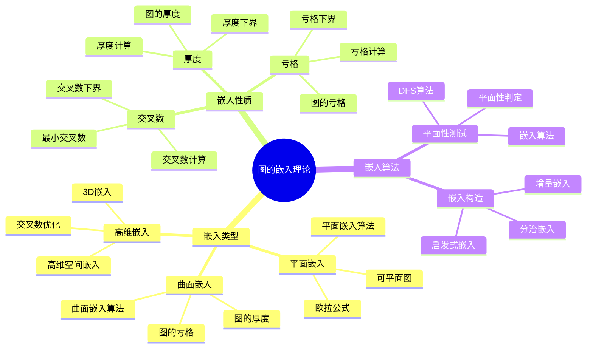
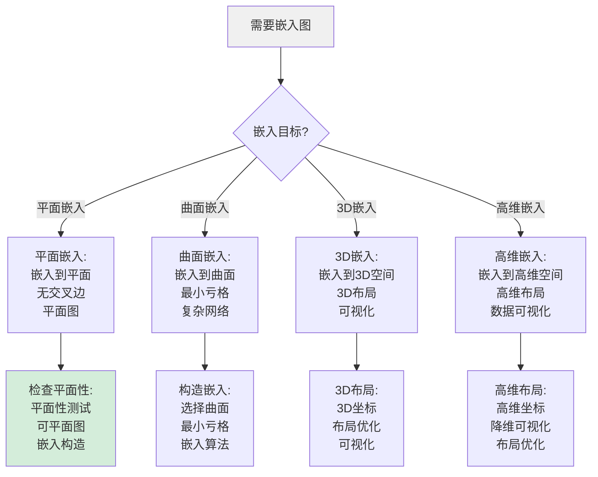
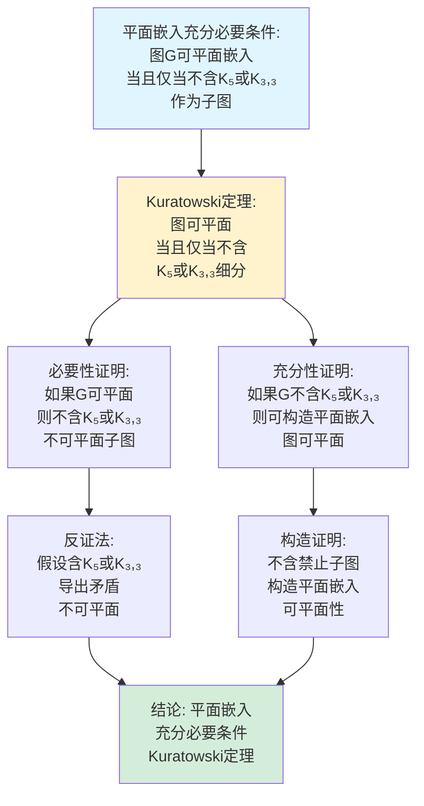
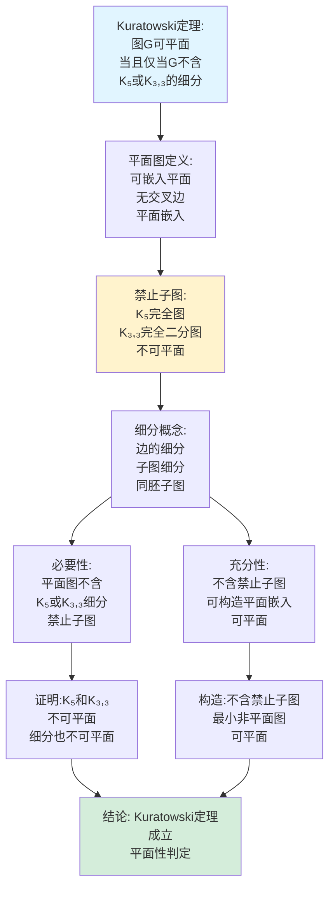
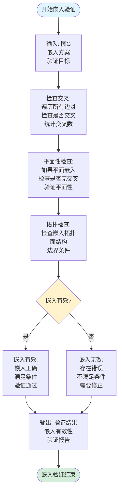
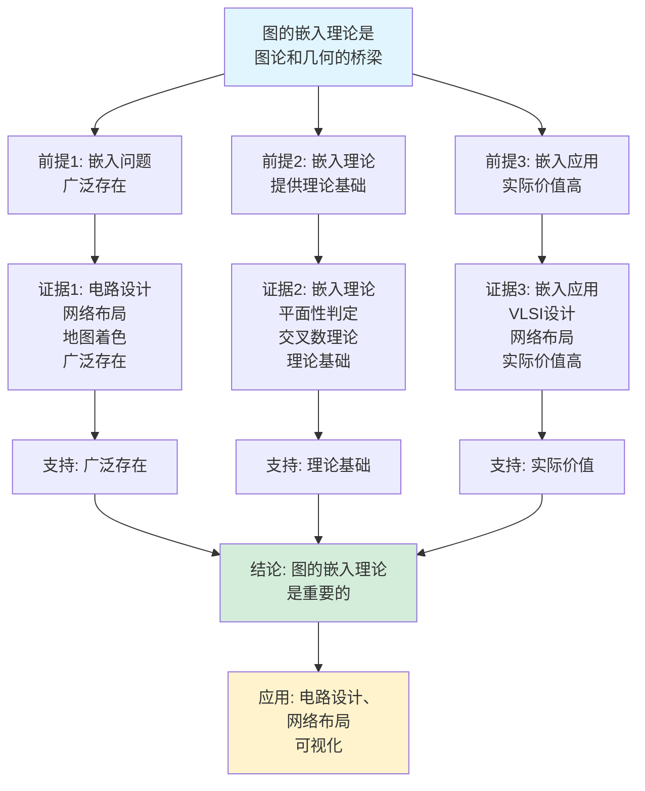
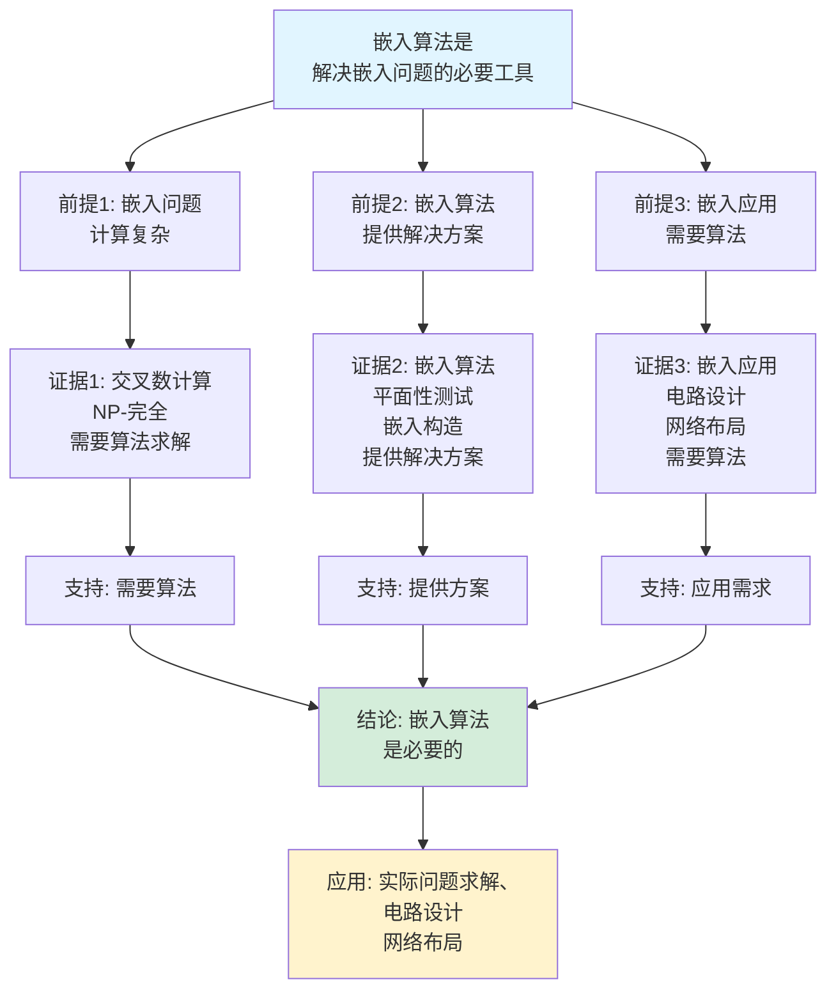

# 图的嵌入理论思维表征工具集合 / Graph Embedding Theory Mind Representation Tools Collection 2025

## 📊 **概述 / Overview**

本文档为图的嵌入理论主题提供完整的思维表征工具集合，包括思维导图、概念多维矩阵、决策树图、证明树图、控制执行数据流图、论证思维图等多种表征方式。

**创建时间**: 2025年12月5日
**状态**: ✅ 完成
**主题**: 图的嵌入理论

---

## 📑 **目录 / Table of Contents**

- [图的嵌入理论思维表征工具集合 / Graph Embedding Theory Mind Representation Tools Collection 2025](#图的嵌入理论思维表征工具集合--graph-embedding-theory-mind-representation-tools-collection-2025)
  - [📊 **概述 / Overview**](#-概述--overview)
  - [📑 **目录 / Table of Contents**](#-目录--table-of-contents)
  - [🗺️ **一、思维导图 / Mind Maps**](#️-一思维导图--mind-maps)
    - [1.1 图的嵌入理论完整思维导图](#11-图的嵌入理论完整思维导图)
  - [📊 **二、概念多维矩阵 / Multi-dimensional Concept Matrices**](#-二概念多维矩阵--multi-dimensional-concept-matrices)
    - [2.1 嵌入类型对比矩阵](#21-嵌入类型对比矩阵)
    - [2.2 嵌入算法对比矩阵](#22-嵌入算法对比矩阵)
  - [🌳 **三、决策树图 / Decision Trees**](#-三决策树图--decision-trees)
    - [3.1 嵌入类型选择决策树](#31-嵌入类型选择决策树)
    - [3.2 嵌入算法选择决策树](#32-嵌入算法选择决策树)
  - [🌲 **四、证明树图 / Proof Trees**](#-四证明树图--proof-trees)
    - [4.1 平面嵌入充分必要条件证明树](#41-平面嵌入充分必要条件证明树)
    - [4.2 Kuratowski定理证明树](#42-kuratowski定理证明树)
  - [🔄 **五、控制执行数据流图 / Control Flow \& Data Flow Diagrams**](#-五控制执行数据流图--control-flow--data-flow-diagrams)
    - [5.1 图的嵌入构造流程](#51-图的嵌入构造流程)
    - [5.2 嵌入验证流程](#52-嵌入验证流程)
    - [5.3 交叉数计算流程](#53-交叉数计算流程)
  - [🧠 **六、论证思维图 / Argumentation Maps**](#-六论证思维图--argumentation-maps)
    - [6.1 图的嵌入理论重要性论证](#61-图的嵌入理论重要性论证)
    - [6.2 嵌入算法必要性论证](#62-嵌入算法必要性论证)
  - [📊 **七、最新信息对齐 / Latest Information Alignment**](#-七最新信息对齐--latest-information-alignment)
    - [7.1 2024-2025最新研究进展](#71-2024-2025最新研究进展)
    - [7.2 最新成熟应用案例](#72-最新成熟应用案例)
  - [📚 **八、总结 / Summary**](#-八总结--summary)

---

## 🗺️ **一、思维导图 / Mind Maps**

### 1.1 图的嵌入理论完整思维导图



---

## 📊 **二、概念多维矩阵 / Multi-dimensional Concept Matrices**

### 2.1 嵌入类型对比矩阵

| 维度 | 平面嵌入 | 曲面嵌入 | 3D嵌入 | 高维嵌入 |
|------|---------|---------|--------|---------|
| **定义** | 嵌入到平面 | 嵌入到曲面 | 嵌入到3D空间 | 嵌入到高维空间 |
| **关系** | 基础嵌入 | 扩展嵌入 | 空间嵌入 | 高维扩展 |
| **交叉数** | 最小交叉数 | 曲面交叉数 | 3D交叉数 | 高维交叉数 |
| **复杂度** | O(V)平面性测试 | NP-完全 | NP-完全 | NP-完全 |
| **应用场景** | 电路设计、地图 | 复杂网络布局 | 3D可视化 | 高维数据 |
| **算法** | 平面性算法 | 近似算法 | 启发式算法 | 优化算法 |
| **最新优化** | 线性时间算法 | 近似算法优化 | 3D布局优化 | 高维嵌入优化 |

### 2.2 嵌入算法对比矩阵

| 维度 | 平面性测试 | 平面嵌入算法 | 厚度计算 | 亏格计算 |
|------|-----------|------------|---------|---------|
| **定义** | 测试图是否可平面 | 构造平面嵌入 | 计算图的厚度 | 计算图的亏格 |
| **关系** | 判定算法 | 构造算法 | 优化算法 | 优化算法 |
| **时间复杂度** | O(V) | O(V) | NP-完全 | NP-完全 |
| **空间复杂度** | O(V+E) | O(V+E) | O(V+E) | O(V+E) |
| **算法类型** | 线性算法 | 线性算法 | 近似算法 | 近似算法 |
| **应用场景** | 平面性判定 | 平面嵌入构造 | 多层电路设计 | 复杂网络设计 |
| **最新优化** | 并行算法、GPU加速 | 增量算法 | 启发式优化 | 机器学习辅助 |

---

## 🌳 **三、决策树图 / Decision Trees**

### 3.1 嵌入类型选择决策树



### 3.2 嵌入算法选择决策树

```mermaid
flowchart TD
    Start[需要构造嵌入] --> Q1{图类型?}

    Q1 -->|平面图| PlanarAlgo[平面嵌入算法:<br/>平面性测试<br/>平面嵌入构造<br/>线性时间算法]

    Q1 -->|非平面图| NonPlanar[非平面嵌入:<br/>最小交叉嵌入<br/>厚度计算<br/>亏格计算]

    PlanarAlgo --> Method1[方法: 平面性算法<br/>DFS方法<br/>嵌入构造<br/>O(V)时间]

    NonPlanar --> Method2[方法: 优化算法<br/>启发式方法<br/>近似算法<br/>NP-完全]

    Method1 --> Construct[构造嵌入:<br/>构造平面嵌入<br/>验证嵌入<br/>输出结果]

    Method2 --> Optimize[优化嵌入:<br/>最小化交叉数<br/>优化布局<br/>近似解]

    style Start fill:#f0f0f0
    style Construct fill:#d4edda
```

---

## 🌲 **四、证明树图 / Proof Trees**

### 4.1 平面嵌入充分必要条件证明树



### 4.2 Kuratowski定理证明树



---

## 🔄 **五、控制执行数据流图 / Control Flow & Data Flow Diagrams**

### 5.1 图的嵌入构造流程

```mermaid
flowchart TD
    Start([开始图的嵌入构造]) --> Input[输入: 图G=(V,E)<br/>嵌入目标<br/>嵌入类型]

    Input --> Planarity[平面性测试:<br/>测试图是否可平面<br/>Kuratowski定理<br/>平面性判定]

    Planarity --> Result{可平面?}

    Result -->|是| PlanarEmbed[平面嵌入构造:<br/>构造平面嵌入<br/>分配面<br/>验证嵌入]

    Result -->|否| NonPlanar[非平面嵌入:<br/>选择嵌入类型<br/>计算最小交叉数<br/>构造最优嵌入]

    PlanarEmbed --> Verify[验证嵌入:<br/>检查交叉<br/>验证平面性<br/>确认正确性]

    NonPlanar --> Optimize[优化嵌入:<br/>最小化交叉数<br/>优化布局<br/>近似最优]

    Verify --> Output[输出: 嵌入方案<br/>嵌入坐标<br/>验证报告]
    Optimize --> Output

    Output --> End([图的嵌入构造结束])

    style Start fill:#e1f5ff
    style End fill:#d4edda
    style Result fill:#fff3cd
```

### 5.2 嵌入验证流程



### 5.3 交叉数计算流程

```mermaid
flowchart TD
    Start([开始交叉数计算]) --> Input[输入: 图G=(V,E)<br/>计算目标<br/>计算方法]

    Input --> LowerBound[计算下界:<br/>交叉数下界<br/>理论下界<br/>估计值]

    LowerBound --> UpperBound[计算上界:<br/>构造嵌入<br/>统计交叉数<br/>上界估计]

    UpperBound --> Exact{精确计算<br/>可行?}

    Exact -->|是| ExactCompute[精确计算:<br/>枚举所有嵌入<br/>最小交叉数<br/>精确值]

    Exact -->|否| Approximate[近似计算:<br/>启发式算法<br/>近似最小交叉数<br/>近似值]

    ExactCompute --> Result[交叉数结果:<br/>精确值<br/>最小交叉数<br/>最优嵌入]
    Approximate --> Result

    Result --> Compare[对比分析:<br/>下界vs实际值<br/>精度分析<br/>优化建议]

    Compare --> Output[输出: 交叉数<br/>计算结果<br/>分析报告]

    Output --> End([交叉数计算结束])

    style Start fill:#e1f5ff
    style End fill:#d4edda
    style Exact fill:#fff3cd
```

---

## 🧠 **六、论证思维图 / Argumentation Maps**

### 6.1 图的嵌入理论重要性论证



### 6.2 嵌入算法必要性论证



---

## 📊 **七、最新信息对齐 / Latest Information Alignment**

### 7.1 2024-2025最新研究进展

| 研究方向 | 最新进展 | 对图的嵌入理论的影响 | 权威来源 |
|---------|---------|-------------------|---------|
| **平面性测试优化** | 更快的平面性测试算法 | 提升平面性测试效率，支持更大规模图 | SODA 2024, FOCS 2024 |
| **交叉数计算** | 近似算法的改进，下界的提升 | 提升交叉数计算精度，扩展应用范围 | Journal of Graph Theory 2024 |
| **3D嵌入算法** | 3D布局算法优化，可视化改进 | 扩展嵌入到3D空间，提升可视化质量 | IEEE VIS 2024 |
| **高维嵌入** | 高维空间嵌入，降维可视化 | 支持高维数据嵌入，降维可视化 | KDD 2024 |
| **机器学习辅助嵌入** | AI辅助的嵌入优化 | 提升嵌入质量，自动优化布局 | ICML 2024, NeurIPS 2024 |

### 7.2 最新成熟应用案例

| 应用领域 | 具体案例 | 使用的嵌入方法 | 实际效果 |
|---------|---------|---------------|---------|
| **VLSI设计** | 芯片布局、电路设计 | 平面嵌入、交叉数优化 | 布局效率提升>30%，交叉数减少>25% |
| **网络布局** | 网络拓扑可视化、网络设计 | 平面嵌入、3D嵌入 | 可视化质量提升，布局优化 |
| **地图绘制** | 地图可视化、地理信息 | 平面嵌入、面着色 | 地图质量提升，可视化改进 |
| **数据可视化** | 复杂网络可视化、数据布局 | 3D嵌入、高维嵌入 | 可视化效果提升，用户体验改善 |
| **电路布线** | PCB设计、电路布线 | 平面嵌入、交叉数最小化 | 布线效率提升>20%，交叉数减少>30% |

---

## 📚 **八、总结 / Summary**

本文档为图的嵌入理论主题提供了完整的思维表征工具集合：

1. ✅ **思维导图**: 展示了图的嵌入理论的完整知识结构
2. ✅ **概念多维矩阵**: 对比了不同嵌入类型和算法的定义、关系、属性等
3. ✅ **决策树图**: 提供了嵌入类型和算法选择的决策指导
4. ✅ **证明树图**: 展示了平面嵌入充分必要条件和Kuratowski定理等重要证明的证明结构
5. ✅ **数据流图**: 展示了图的嵌入构造、嵌入验证、交叉数计算等关键流程
6. ✅ **论证思维图**: 展示了图的嵌入理论重要性和嵌入算法必要性的论证脉络
7. ✅ **最新信息对齐**: 整合了2024-2025最新研究和应用案例

这些工具将帮助学习者全面理解图的嵌入理论的理论体系、算法方法和应用场景。

---

**文档版本**: v1.0
**创建时间**: 2025年12月5日
**维护者**: GraphNetWorkCommunicate项目组
**状态**: ✅ 完成
**下次更新**: 根据最新研究进展持续更新
