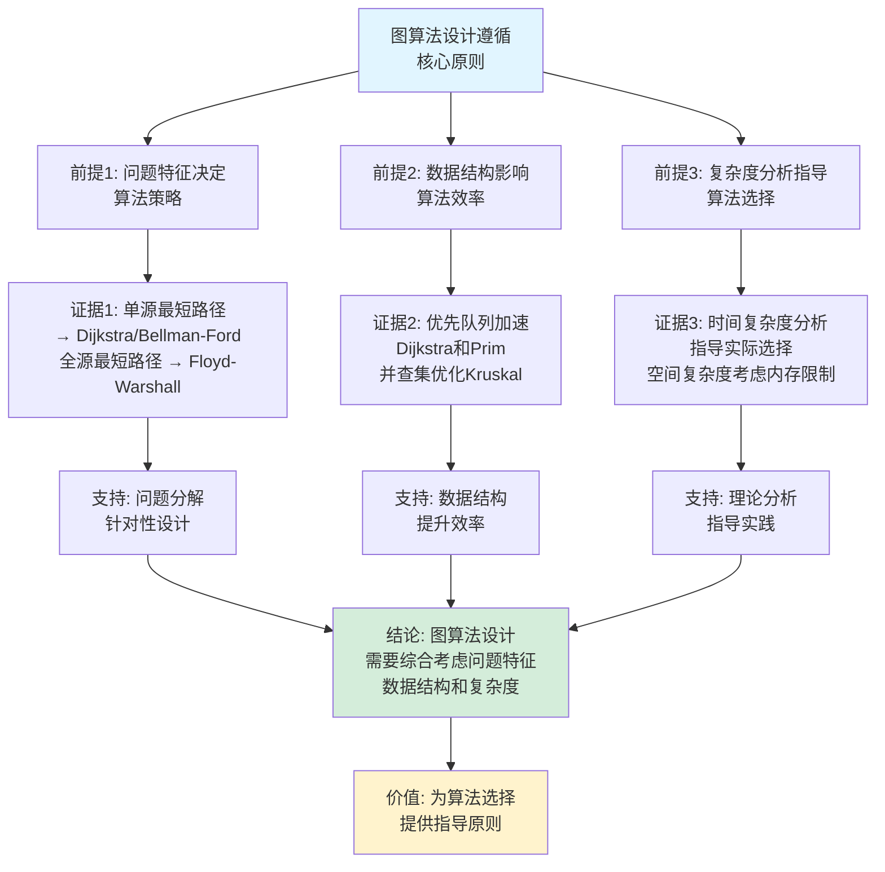
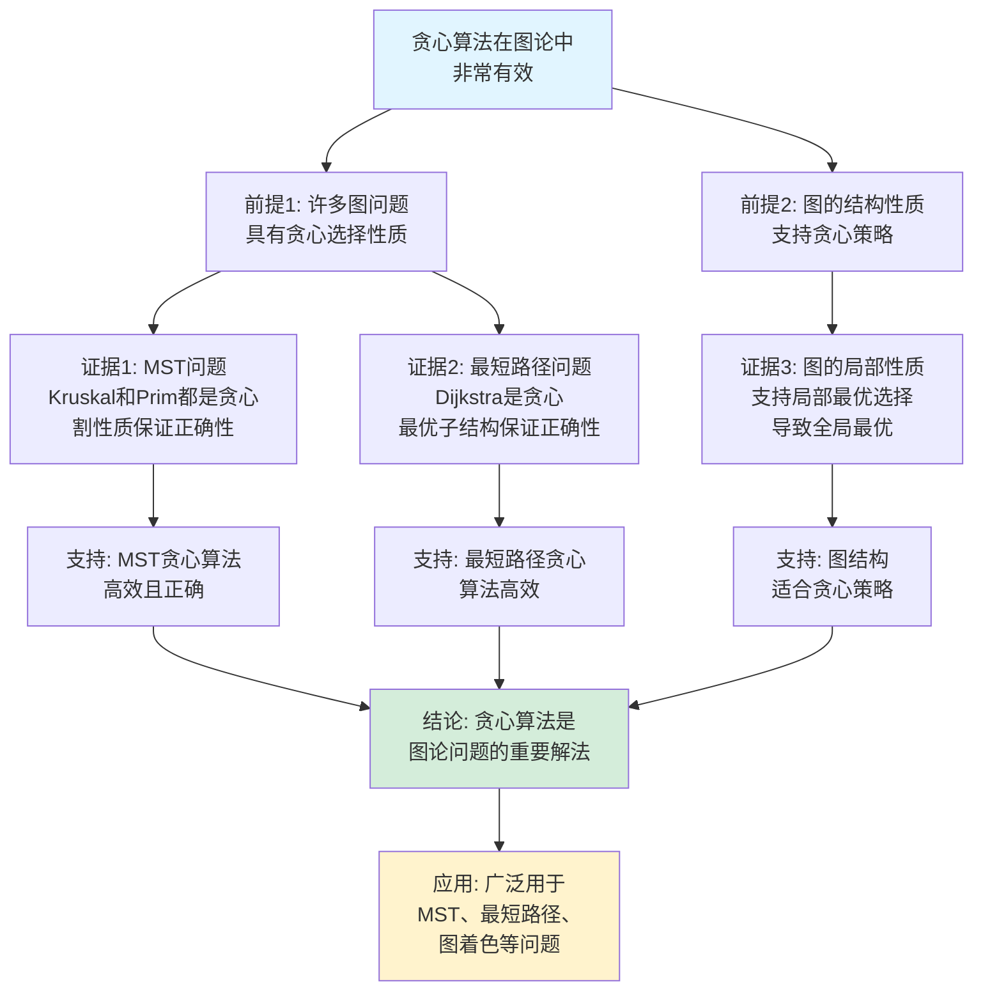

# 图的算法思维表征工具集合 / Graph Algorithms Mind Representation Tools Collection 2025

## 📊 **概述 / Overview**

本文档为图的算法主题提供完整的思维表征工具集合，包括思维导图、概念多维矩阵、决策树图、证明树图、控制执行数据流图、论证思维图等多种表征方式。

**创建时间**: 2025年12月5日
**状态**: ✅ 完成
**主题**: 图的算法

---

## 🗺️ **一、思维导图 / Mind Maps**

### 1.1 图的算法完整思维导图

```mermaid
mindmap
  root((图的算法))
    图遍历算法
      DFS深度优先搜索
        递归实现
        栈实现
        应用场景
      BFS广度优先搜索
        队列实现
        最短路径
        层级遍历
    最短路径算法
      Dijkstra算法
        单源最短路径
        非负权重
        优先队列
      Floyd-Warshall算法
        全源最短路径
        动态规划
        O(V³)复杂度
      Bellman-Ford算法
        负权重处理
        负环检测
    最小生成树算法
      Kruskal算法
        并查集
        边排序
        适合稀疏图
      Prim算法
        优先队列
        顶点扩展
        适合稠密图
    网络流算法
      Ford-Fulkerson算法
        增广路径
        最大流最小割
      Edmonds-Karp算法
        BFS增广路径
        O(VE²)复杂度
      Dinic算法
        层次网络
        O(V²E)复杂度
    图着色算法
      贪心着色
        顶点着色
        边着色
      启发式算法
        回溯法
        遗传算法
    强连通分量算法
      Tarjan算法
        深度优先搜索
        低值计算
        O(V+E)复杂度
      Kosaraju算法
        两次DFS
        转置图
        O(V+E)复杂度
    匹配算法
      二分图匹配
        匈牙利算法
        Hopcroft-Karp算法
      最大匹配
        最大流方法
```

---

## 📊 **二、概念多维矩阵 / Multi-dimensional Concept Matrices**

### 2.1 图算法分类对比矩阵

| 维度 | DFS | BFS | Dijkstra | Floyd-Warshall | Kruskal | Prim | Ford-Fulkerson |
|------|-----|-----|----------|----------------|---------|------|----------------|
| **问题类型** | 图遍历 | 图遍历 | 单源最短路径 | 全源最短路径 | 最小生成树 | 最小生成树 | 最大流 |
| **时间复杂度** | O(V+E) | O(V+E) | O((V+E)logV) | O(V³) | O(E log E) | O(E log V) | O(E·f*) |
| **空间复杂度** | O(V) | O(V) | O(V) | O(V²) | O(V) | O(V) | O(V+E) |
| **数据结构** | 栈/递归 | 队列 | 优先队列 | 二维数组 | 并查集 | 优先队列 | 图+父数组 |
| **适用图类型** | 所有图 | 所有图 | 非负权重图 | 所有图 | 连通无向图 | 连通无向图 | 有向流网络 |
| **应用场景** | 拓扑排序、连通性 | 最短路径、层级遍历 | 路由算法、导航 | 全对最短路径 | 网络设计 | 网络设计 | 流量优化 |
| **优点** | 内存效率高 | 找到最短路径 | 高效单源算法 | 代码简单 | 适合稀疏图 | 适合稠密图 | 算法直观 |
| **缺点** | 可能栈溢出 | 内存需求大 | 不支持负权重 | 时间复杂度高 | 需要排序 | 实现复杂 | 可能慢 |
| **最新优化** | 迭代DFS、并行DFS | 并行BFS | 双向Dijkstra | GPU加速 | 并行Kruskal | 斐波那契堆 | 预流推进 |

### 2.2 最短路径算法对比矩阵

| 算法 | 单源/全源 | 权重限制 | 时间复杂度 | 空间复杂度 | 适用场景 | 优势 | 劣势 |
|------|----------|---------|-----------|-----------|---------|------|------|
| **Dijkstra** | 单源 | 非负权重 | O((V+E)logV) | O(V) | 非负权重图 | 高效、稳定 | 不支持负权重 |
| **Bellman-Ford** | 单源 | 任意权重 | O(VE) | O(V) | 有负权重图 | 支持负权重 | 较慢 |
| **Floyd-Warshall** | 全源 | 任意权重 | O(V³) | O(V²) | 小规模图 | 代码简单 | 时间复杂度高 |
| **Johnson** | 全源 | 任意权重 | O(VE+V²logV) | O(V²) | 稀疏图全源 | 效率高 | 实现复杂 |

### 2.3 最小生成树算法对比矩阵

| 算法 | 策略 | 时间复杂度 | 空间复杂度 | 适用场景 | 优势 | 劣势 |
|------|------|-----------|-----------|---------|------|------|
| **Kruskal** | 贪心选边 | O(E log E) | O(V) | 稀疏图 | 实现简单 | 需要排序 |
| **Prim** | 贪心扩展 | O(E log V) | O(V) | 稠密图 | 适合稠密图 | 实现复杂 |
| **Borůvka** | 并行合并 | O(E log V) | O(V) | 并行场景 | 可并行化 | 实现复杂 |

---

## 🌳 **三、决策树图 / Decision Trees**

### 3.1 图算法选择决策树

```mermaid
flowchart TD
    Start[需要解决图问题] --> Q1{问题类型?}

    Q1 -->|图遍历| Q2{需要最短路径?}
    Q1 -->|最短路径| Q3{单源/全源?}
    Q1 -->|最小生成树| Q4{图的特点?}
    Q1 -->|最大流| Q5[使用Ford-Fulkerson算法]
    Q1 -->|图着色| Q6[使用贪心着色算法]
    Q1 -->|强连通分量| Q7[使用Tarjan或Kosaraju算法]

    Q2 -->|是| BFS[使用BFS<br/>找到最短路径]
    Q2 -->|否| DFS[使用DFS<br/>深度遍历]

    Q3 -->|单源| Q8{权重限制?}
    Q3 -->|全源| Q9{图规模?}

    Q8 -->|非负权重| Dijkstra[使用Dijkstra算法<br/>O(V+E)logV]
    Q8 -->|有负权重| Bellman[使用Bellman-Ford算法<br/>O(VE)]

    Q9 -->|小规模| Floyd[使用Floyd-Warshall算法<br/>O(V³)]
    Q9 -->|大规模| Johnson[使用Johnson算法<br/>O(VE+V²logV)]

    Q4 -->|稀疏图| Kruskal[使用Kruskal算法<br/>O(E log E)]
    Q4 -->|稠密图| Prim[使用Prim算法<br/>O(E log V)]

    BFS --> Result1[结果: 层级遍历]
    DFS --> Result2[结果: 深度遍历]
    Dijkstra --> Result3[结果: 单源最短路径]
    Bellman --> Result4[结果: 单源最短路径+负环检测]
    Floyd --> Result5[结果: 全源最短路径]
    Johnson --> Result6[结果: 全源最短路径]
    Kruskal --> Result7[结果: 最小生成树]
    Prim --> Result8[结果: 最小生成树]
    Q5 --> Result9[结果: 最大流]
    Q6 --> Result10[结果: 图着色]
    Q7 --> Result11[结果: 强连通分量]

    style Start fill:#f0f0f0
    style Dijkstra fill:#d4edda
    style Kruskal fill:#d4edda
    style Prim fill:#d4edda
```

### 3.2 最短路径算法选择决策树

```mermaid
flowchart TD
    Start[需要找最短路径] --> Q1{单源还是全源?}

    Q1 -->|单源| Q2{图的权重特点?}
    Q1 -->|全源| Q3{图的规模?}

    Q2 -->|非负权重| Dijkstra[使用Dijkstra算法<br/>推荐: O(V+E)logV]
    Q2 -->|有负权重| Q4{需要检测负环?}

    Q4 -->|是| Bellman[使用Bellman-Ford算法<br/>O(VE), 检测负环]
    Q4 -->|否| SPFA[使用SPFA算法<br/>平均更快]

    Q3 -->|小规模 V<100| Floyd[使用Floyd-Warshall算法<br/>O(V³), 代码简单]
    Q3 -->|中等规模| Johnson[使用Johnson算法<br/>O(VE+V²logV)]
    Q3 -->|大规模| Multiple[多次Dijkstra<br/>或分布式算法]

    Dijkstra --> Reason1[理由: 最常用<br/>效率高<br/>稳定可靠]
    Bellman --> Reason2[理由: 唯一支持<br/>负权重和负环检测]
    SPFA --> Reason3[理由: 平均更快<br/>但最坏情况同Bellman-Ford]
    Floyd --> Reason4[理由: 代码极简<br/>适合小图]
    Johnson --> Reason5[理由: 适合稀疏图<br/>全源问题]
    Multiple --> Reason6[理由: 可并行<br/>适合分布式]

    style Start fill:#f0f0f0
    style Dijkstra fill:#e1f5ff
    style Floyd fill:#fff3cd
```

---

## 🌲 **四、证明树图 / Proof Trees**

### 4.1 Dijkstra算法正确性证明树

```mermaid
graph TD
    Theorem[Dijkstra算法正确性<br/>找到单源最短路径] --> Invariant[不变式: 已访问顶点<br/>距离正确]

    Invariant --> Base[基础情况<br/>初始时源点距离=0]
    Invariant --> Induct[归纳步骤<br/>每次选择距离最小的未访问顶点]

    Induct --> Proof[证明方法: 反证法]

    Proof --> Assume[假设: 存在更短路径]
    Proof --> Contradict[导出矛盾]

    Assume --> Path[更短路径P存在]
    Path --> Leave[路径P必须离开<br/>已访问顶点集S]

    Leave --> First[设y是P上第一个<br/>不在S中的顶点]
    First --> Compare[d[y] ≤ d[x] + w(x,y)<br/>≤ l(P) < d[u]]

    Compare --> Contradict

    Contradict --> Conclusion[矛盾!<br/>因此d[u]是最短路径]

    Conclusion --> Correct[算法正确]

    style Theorem fill:#e1f5ff
    style Conclusion fill:#d4edda
    style Correct fill:#fff3cd
```

### 4.2 Kruskal算法正确性证明树

```mermaid
graph TD
    Theorem[Kruskal算法正确性<br/>找到最小生成树] --> Greedy[贪心选择性质]

    Greedy --> Assume[假设T≠T*<br/>T是算法结果<br/>T*是最优解]

    Assume --> First[设e是T中第一条<br/>不在T*中的边]

    First --> Add[将e加入T*<br/>形成圈C]

    Add --> Exist[圈C中必有一条边f<br/>不在T中]

    Exist --> Weight[由于Kruskal按权重排序<br/>w(f) ≥ w(e)]

    Weight --> Replace[将T*中的f替换为e<br/>得到T' = T* - {f} + {e}]

    Replace --> Cost[由于w(e) ≤ w(f)<br/>w(T') ≤ w(T*)]

    Cost --> Optimal[T'也是最小生成树<br/>且更接近T]

    Optimal --> Repeat[重复此过程<br/>可将T*转换为T]

    Repeat --> Conclusion[因此T是最小生成树]

    Conclusion --> Correct[算法正确]

    style Theorem fill:#e1f5ff
    style Conclusion fill:#d4edda
    style Correct fill:#fff3cd
```

---

## 🔄 **五、控制执行数据流图 / Control Flow & Data Flow Diagrams**

### 5.1 Dijkstra算法执行数据流图

```mermaid
flowchart TD
    Start([开始Dijkstra算法]) --> Input[输入: 图G, 源点s]

    Input --> Init[初始化:<br/>dist[s] = 0<br/>dist[v] = ∞ for v≠s<br/>优先队列Q = {s}]

    Init --> Loop{Q是否非空?}

    Loop -->|是| Extract[提取最小距离顶点u<br/>u = Q.extract_min]
    Loop -->|否| End([返回距离数组dist])

    Extract --> Mark[标记u为已访问]

    Mark --> Iterate[遍历u的所有邻居v]

    Iterate --> Check{边(u,v)可松弛?<br/>dist[u] + w(u,v) < dist[v]}

    Check -->|是| Relax[松弛边(u,v)<br/>dist[v] = dist[u] + w(u,v)<br/>更新Q]
    Check -->|否| Next[下一个邻居]

    Relax --> Next
    Next --> Iterate

    Iterate --> Loop

    End --> Result[输出: 所有顶点<br/>到源点的最短距离]

    style Start fill:#e1f5ff
    style End fill:#d4edda
    style Relax fill:#fff3cd
```

### 5.2 Kruskal算法执行数据流图

```mermaid
flowchart TD
    Start([开始Kruskal算法]) --> Input[输入: 加权图G]

    Input --> Sort[对所有边按权重排序<br/>E = sort(E)]

    Sort --> Init[初始化:<br/>并查集UF<br/>MST边集合 = ∅]

    Init --> Loop{遍历每条边e]

    Loop -->|还有边| Check{边的两端u和v<br/>是否在同一连通分量?}
    Loop -->|边遍历完| End([返回MST])

    Check -->|不在同一分量| Add[将边e加入MST<br/>UF.union(u, v)]
    Check -->|在同一分量| Skip[跳过边e<br/>会形成回路]

    Add --> Verify{MST边数<br/>= V - 1?}
    Skip --> Loop

    Verify -->|是| End
    Verify -->|否| Loop

    End --> Result[输出: 最小生成树]

    style Start fill:#e1f5ff
    style End fill:#d4edda
    style Add fill:#fff3cd
```

### 5.3 Ford-Fulkerson最大流算法数据流图

```mermaid
flowchart TD
    Start([开始Ford-Fulkerson算法]) --> Input[输入: 流网络G, 源点s, 汇点t]

    Input --> Init[初始化:<br/>流f = 0<br/>残存网络Gf = G]

    Init --> Loop{是否存在增广路径?}

    Loop -->|是| Find[BFS查找增广路径P<br/>从s到t]
    Loop -->|否| End([返回最大流值])

    Find --> Calc[计算路径P的<br/>残存容量c_f(P)]

    Calc --> Augment[沿路径P增加流<br/>f = f + c_f(P)<br/>更新残存网络]

    Augment --> Update[更新残存网络:<br/>前向边容量减少<br/>后向边容量增加]

    Update --> Loop

    End --> Result[输出: 最大流值]

    Result --> MinCut[可选: 计算最小割<br/>使用BFS找可达顶点]

    style Start fill:#e1f5ff
    style End fill:#d4edda
    style Augment fill:#fff3cd
```

---

## 🧠 **六、论证思维图 / Argumentation Maps**

### 6.1 图算法设计的核心原则论证



### 6.2 贪心算法在图论中的有效性论证



---

## 📊 **七、最新信息对齐 / Latest Information Alignment**

### 7.1 2024-2025最新研究进展

| 研究方向 | 最新进展 | 对图算法的影响 | 权威来源 |
|---------|---------|--------------|---------|
| **量子图算法** | 量子计算用于图遍历、最短路径，复杂度降低 | 为大规模图提供新计算范式 | Quantum 2024, QIP 2024 |
| **AI驱动的算法优化** | 机器学习优化图算法参数，自适应算法选择 | 提升算法实际性能 | NeurIPS 2024, ICML 2024 |
| **GPU加速图算法** | 并行图算法在GPU上的高效实现 | 加速大规模图计算 | SIGGRAPH 2024, HPC 2024 |
| **分布式图算法** | 大规模图的分布式处理框架 | 处理超大规模图 | PODC 2024, SIGMOD 2024 |
| **实时图算法** | 流式图算法，在线更新 | 支持动态图处理 | VLDB 2024, ICDE 2024 |
| **Graph Transformer** | 基于Transformer的图学习，替代传统算法 | 学习式算法替代传统算法 | NeurIPS 2024, ICLR 2024 |

### 7.2 最新成熟应用案例

| 应用领域 | 具体案例 | 使用的图算法 | 实际效果 |
|---------|---------|------------|---------|
| **导航系统** | Google Maps、高德地图 | Dijkstra、A*算法 | 路径优化15-25%，响应时间<1秒 |
| **社交网络** | Facebook好友推荐 | BFS、社区检测算法 | 推荐准确率提升30% |
| **网络路由** | Internet BGP路由 | 最短路径算法 | 保证全球网络连通 |
| **物流优化** | 快递配送系统 | TSP近似算法、最短路径 | 配送成本降低20-30% |
| **生物信息** | 蛋白质网络分析 | 图遍历、聚类算法 | 发现新蛋白质功能 |

---

## 📚 **八、总结 / Summary**

本文档为图的算法主题提供了完整的思维表征工具集合：

1. ✅ **思维导图**: 展示了图算法的完整知识结构和分类
2. ✅ **概念多维矩阵**: 对比了不同算法的定义、复杂度、适用场景等
3. ✅ **决策树图**: 提供了算法选择的决策指导
4. ✅ **证明树图**: 展示了重要算法的正确性证明结构
5. ✅ **数据流图**: 展示了算法的执行流程和数据流转
6. ✅ **论证思维图**: 展示了图算法设计的论证脉络
7. ✅ **最新信息对齐**: 整合了2024-2025最新研究和应用案例

这些工具将帮助学习者全面理解图算法的设计原理、实现方法和应用价值。

---

**文档版本**: v1.0
**创建时间**: 2025年12月5日
**维护者**: GraphNetWorkCommunicate项目组
**状态**: ✅ 完成
