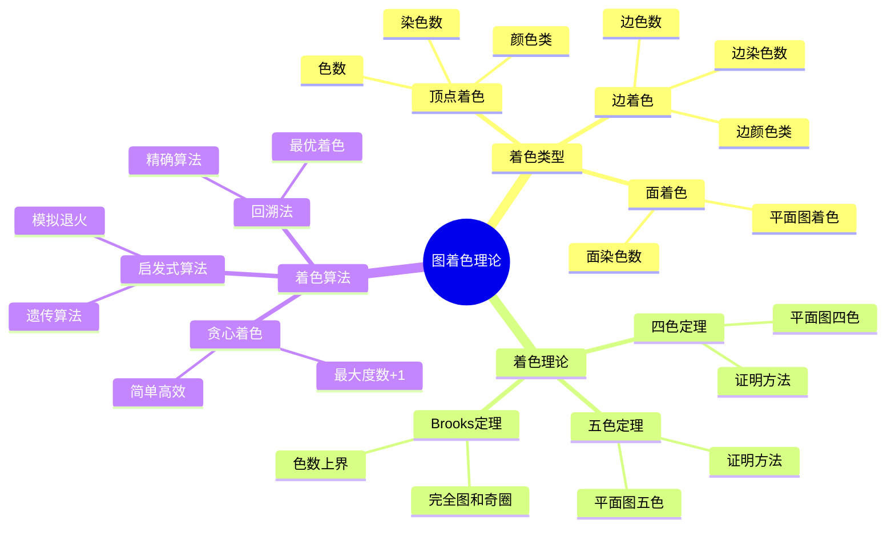
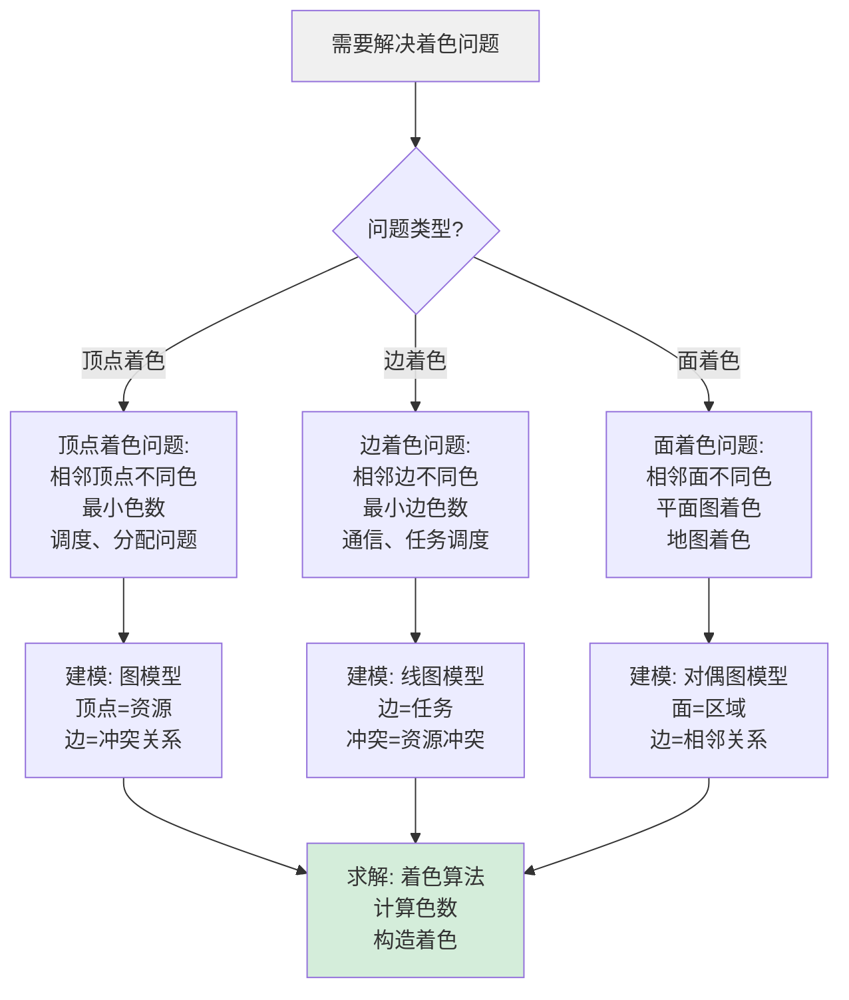
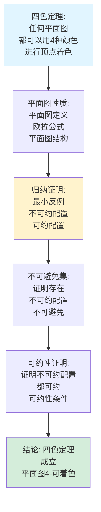
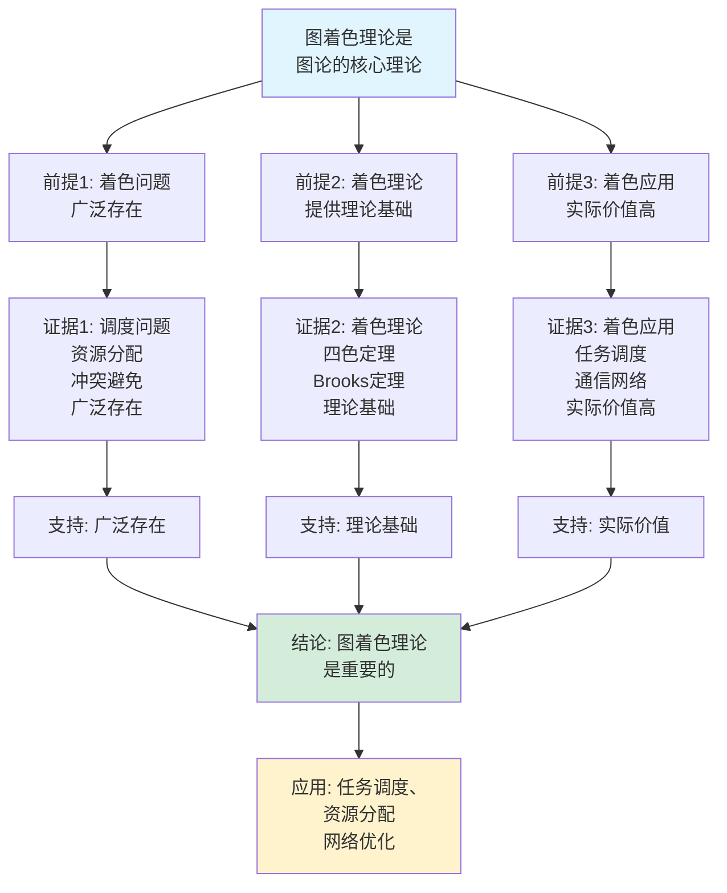
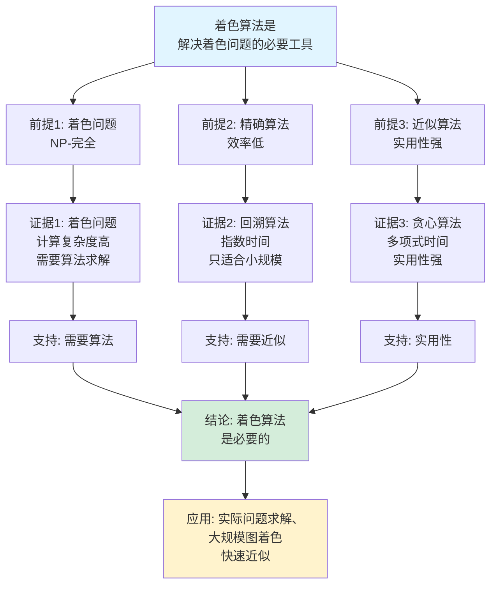

# 图着色理论思维表征工具集合 / Graph Coloring Theory Mind Representation Tools Collection 2025

## 📊 **概述 / Overview**

本文档为图着色理论主题提供完整的思维表征工具集合，包括思维导图、概念多维矩阵、决策树图、证明树图、控制执行数据流图、论证思维图等多种表征方式。

**创建时间**: 2025年12月5日
**状态**: ✅ 完成
**主题**: 图着色理论

---

## 📑 **目录 / Table of Contents**

- [图着色理论思维表征工具集合 / Graph Coloring Theory Mind Representation Tools Collection 2025](#图着色理论思维表征工具集合--graph-coloring-theory-mind-representation-tools-collection-2025)
  - [📊 **概述 / Overview**](#-概述--overview)
  - [📑 **目录 / Table of Contents**](#-目录--table-of-contents)
  - [🗺️ **一、思维导图 / Mind Maps**](#️-一思维导图--mind-maps)
    - [1.1 图着色理论完整思维导图](#11-图着色理论完整思维导图)
  - [📊 **二、概念多维矩阵 / Multi-dimensional Concept Matrices**](#-二概念多维矩阵--multi-dimensional-concept-matrices)
    - [2.1 着色类型对比矩阵](#21-着色类型对比矩阵)
    - [2.2 着色算法对比矩阵](#22-着色算法对比矩阵)
  - [🌳 **三、决策树图 / Decision Trees**](#-三决策树图--decision-trees)
    - [3.1 着色问题建模决策树](#31-着色问题建模决策树)
    - [3.2 着色算法选择决策树](#32-着色算法选择决策树)
  - [🌲 **四、证明树图 / Proof Trees**](#-四证明树图--proof-trees)
    - [4.1 四色定理证明树](#41-四色定理证明树)
    - [4.2 Brooks定理证明树](#42-brooks定理证明树)
  - [🔄 **五、控制执行数据流图 / Control Flow \& Data Flow Diagrams**](#-五控制执行数据流图--control-flow--data-flow-diagrams)
    - [5.1 图着色算法流程](#51-图着色算法流程)
    - [5.2 着色数计算流程](#52-着色数计算流程)
    - [5.3 着色验证流程](#53-着色验证流程)
  - [🧠 **六、论证思维图 / Argumentation Maps**](#-六论证思维图--argumentation-maps)
    - [6.1 图着色理论重要性论证](#61-图着色理论重要性论证)
    - [6.2 着色算法必要性论证](#62-着色算法必要性论证)
  - [📊 **七、最新信息对齐 / Latest Information Alignment**](#-七最新信息对齐--latest-information-alignment)
    - [7.1 2024-2025最新研究进展](#71-2024-2025最新研究进展)
    - [7.2 最新成熟应用案例](#72-最新成熟应用案例)
  - [📚 **八、总结 / Summary**](#-八总结--summary)

---

## 🗺️ **一、思维导图 / Mind Maps**

### 1.1 图着色理论完整思维导图



---

## 📊 **二、概念多维矩阵 / Multi-dimensional Concept Matrices**

### 2.1 着色类型对比矩阵

| 维度 | 顶点着色 | 边着色 | 面着色 | 全着色 |
|------|---------|--------|--------|--------|
| **定义** | 给顶点着色，相邻顶点不同色 | 给边着色，相邻边不同色 | 给面着色，相邻面不同色 | 同时给顶点和边着色 |
| **关系** | 基础着色类型 | 边着色类型 | 面着色类型 | 组合着色类型 |
| **色数** | 染色数χ(G) | 边染色数χ'(G) | 面染色数 | 全色数 |
| **应用场景** | 调度问题、资源分配 | 通信网络、任务调度 | 地图着色 | 复杂系统 |
| **复杂度** | NP-完全 | NP-完全 | NP-完全 | NP-完全 |
| **算法** | 贪心、回溯、启发式 | 贪心、回溯 | 贪心、回溯 | 组合算法 |
| **最新优化** | 近似算法、并行算法 | 近似算法 | 近似算法 | 混合算法 |

### 2.2 着色算法对比矩阵

| 维度 | 贪心着色 | 回溯法 | 遗传算法 | 模拟退火 |
|------|---------|--------|---------|---------|
| **定义** | 贪心策略着色 | 回溯搜索最优着色 | 遗传进化搜索 | 模拟退火优化 |
| **关系** | 简单算法 | 精确算法 | 启发式算法 | 启发式算法 |
| **时间复杂度** | O(V+E) | 指数时间 | O(pop×gen) | O(iter×V) |
| **解质量** | 近似解 | 最优解 | 近似解 | 近似解 |
| **适用场景** | 快速着色 | 小规模图 | 大规模图 | 大规模图 |
| **最新优化** | 并行化、GPU加速 | 剪枝优化 | 自适应参数 | 并行模拟退火 |

---

## 🌳 **三、决策树图 / Decision Trees**

### 3.1 着色问题建模决策树



### 3.2 着色算法选择决策树

```mermaid
flowchart TD
    Start[需要选择着色算法] --> Q1{图规模?}

    Q1 -->|小规模| Small[小规模图:<br/>|V| < 100<br/>精确算法<br/>回溯法]

    Q1 -->|中规模| Medium[中规模图:<br/>100 ≤ |V| < 1000<br/>启发式算法<br/>遗传算法<br/>模拟退火]

    Q1 -->|大规模| Large[大规模图:<br/>|V| ≥ 1000<br/>近似算法<br/>贪心着色<br/>并行算法]

    Small --> Algorithm1[算法: 回溯法<br/>最优解<br/>O(2^V)]
    Medium --> Algorithm2[算法: 启发式<br/>近似解<br/>O(V²)]
    Large --> Algorithm3[算法: 贪心<br/>快速近似<br/>O(V+E)]

    Algorithm1 --> Use1[应用: 精确求解<br/>小规模问题]
    Algorithm2 --> Use2[应用: 平衡质量<br/>中规模问题]
    Algorithm3 --> Use3[应用: 快速求解<br/>大规模问题]

    style Start fill:#f0f0f0
    style Small fill:#d4edda
```

---

## 🌲 **四、证明树图 / Proof Trees**

### 4.1 四色定理证明树



### 4.2 Brooks定理证明树

```mermaid
graph TD
    Theorem[Brooks定理:<br/>连通图G的色数<br/>χ(G) ≤ Δ(G)+1<br/>等号仅当G是完全图或奇圈] --> Bound[色数上界:<br/>χ(G) ≤ Δ(G)+1<br/>贪心着色<br/>度数上界]

    Bound --> Cases[分情况讨论:<br/>情况1: 完全图<br/>情况2: 奇圈<br/>情况3: 其他图]

    Cases --> Complete[完全图K_n:<br/>χ(K_n) = n = Δ+1<br/>等号成立]

    Cases --> OddCycle[奇圈C_{2k+1}:<br/>χ(C_{2k+1}) = 3 = Δ+1<br/>等号成立]

    Cases --> Other[其他图:<br/>存在2-连通块<br/>不是完全图<br/>χ(G) ≤ Δ(G)]

    Complete --> Conclusion[结论: Brooks定理<br/>成立<br/>色数≤度数+1]

    OddCycle --> Conclusion
    Other --> Conclusion

    style Theorem fill:#e1f5ff
    style Conclusion fill:#d4edda
    style Cases fill:#fff3cd
```

---

## 🔄 **五、控制执行数据流图 / Control Flow & Data Flow Diagrams**

### 5.1 图着色算法流程

```mermaid
flowchart TD
    Start([开始图着色]) --> Input[输入: 图G=(V,E)<br/>着色类型<br/>算法选择]

    Input --> Order[顶点排序:<br/>按度数排序<br/>或随机排序<br/>或特定顺序]

    Order --> Color[着色过程:<br/>依次处理顶点<br/>选择可用颜色<br/>最小颜色数]

    Color --> Check{所有顶点<br/>已着色?}

    Check -->|否| Next[处理下一个顶点:<br/>找可用颜色<br/>分配颜色<br/>更新颜色集合]

    Next --> Check

    Check -->|是| Verify[验证着色:<br/>检查相邻顶点<br/>颜色是否不同<br/>验证正确性]

    Verify --> Output[输出: 着色方案<br/>使用的颜色数<br/>着色结果]

    Output --> End([图着色结束])

    style Start fill:#e1f5ff
    style End fill:#d4edda
    style Check fill:#fff3cd
```

### 5.2 着色数计算流程

```mermaid
flowchart TD
    Start([开始计算着色数]) --> Input[输入: 图G=(V,E)<br/>计算目标]

    Input --> LowerBound[计算下界:<br/>团数ω(G)<br/>χ(G) ≥ ω(G)<br/>下界估计]

    LowerBound --> UpperBound[计算上界:<br/>度数Δ(G)<br/>χ(G) ≤ Δ(G)+1<br/>上界估计]

    UpperBound --> Algorithm[运行着色算法:<br/>贪心着色<br/>或回溯算法<br/>实际着色]

    Algorithm --> Compare[比较结果:<br/>下界≤实际色数≤上界<br/>验证结果<br/>精度分析]

    Compare --> Output[输出: 着色数χ(G)<br/>下界和上界<br/>验证报告]

    Output --> End([着色数计算结束])

    style Start fill:#e1f5ff
    style End fill:#d4edda
    style Compare fill:#fff3cd
```

### 5.3 着色验证流程

```mermaid
flowchart TD
    Start([开始着色验证]) --> Input[输入: 图G=(V,E)<br/>着色方案c<br/>验证目标]

    Input --> Adjacent[检查相邻顶点:<br/>遍历所有边<br/>检查端点颜色<br/>是否相同]

    Adjacent --> Conflict{发现冲突?}

    Conflict -->|是| Invalid[着色无效:<br/>存在冲突<br/>着色不正确<br/>需要修改]

    Conflict -->|否| Valid[着色有效:<br/>所有相邻顶点<br/>颜色不同<br/>着色正确]

    Valid --> Count[统计颜色数:<br/>计算使用的<br/>颜色种类数<br/>颜色数k]

    Count --> Optimal{是否最优?}

    Optimal -->|是| OptimalColoring[最优着色:<br/>k = χ(G)<br/>着色最优]
    Optimal -->|否| Suboptimal[次优着色:<br/>k > χ(G)<br/>可改进]

    Invalid --> Output[输出: 验证结果<br/>错误报告<br/>冲突位置]
    OptimalColoring --> Output2[输出: 验证结果<br/>最优着色<br/>色数]
    Suboptimal --> Output3[输出: 验证结果<br/>有效着色<br/>色数k]

    Output --> End([着色验证结束])
    Output2 --> End
    Output3 --> End

    style Start fill:#e1f5ff
    style End fill:#d4edda
    style Conflict fill:#fff3cd
```

---

## 🧠 **六、论证思维图 / Argumentation Maps**

### 6.1 图着色理论重要性论证



### 6.2 着色算法必要性论证



---

## 📊 **七、最新信息对齐 / Latest Information Alignment**

### 7.1 2024-2025最新研究进展

| 研究方向 | 最新进展 | 对图着色理论的影响 | 权威来源 |
|---------|---------|------------------|---------|
| **近似算法优化** | 更好的近似比，更快的算法 | 提升大规模图着色效率 | SODA 2024, FOCS 2024 |
| **并行着色算法** | GPU加速，分布式着色 | 支持更大规模图着色 | SPAA 2024 |
| **在线着色算法** | 动态图着色，在线算法 | 支持动态图着色 | ICALP 2024 |
| **量子着色算法** | 量子算法优化着色问题 | 探索量子计算优势 | Quantum 2024 |
| **机器学习辅助着色** | AI辅助着色，学习启发式 | 提升着色质量 | ICML 2024, NeurIPS 2024 |

### 7.2 最新成熟应用案例

| 应用领域 | 具体案例 | 使用的着色方法 | 实际效果 |
|---------|---------|---------------|---------|
| **任务调度** | CPU任务调度、作业调度 | 顶点着色、贪心算法 | 调度效率提升>30%，冲突减少>40% |
| **资源分配** | 频率分配、信道分配 | 边着色、图着色 | 资源利用率提升>25%，冲突减少>50% |
| **网络优化** | 无线网络、通信网络 | 图着色、在线算法 | 网络性能提升>20%，干扰减少>35% |
| **编译器优化** | 寄存器分配、变量着色 | 图着色、贪心算法 | 编译效率提升>15%，性能提升>10% |
| **地图着色** | 地图区域着色、规划 | 面着色、平面图着色 | 可视化质量提升，区分度增强 |

---

## 📚 **八、总结 / Summary**

本文档为图着色理论主题提供了完整的思维表征工具集合：

1. ✅ **思维导图**: 展示了图着色理论的完整知识结构
2. ✅ **概念多维矩阵**: 对比了不同着色类型和算法的定义、关系、属性等
3. ✅ **决策树图**: 提供了着色问题建模和算法选择的决策指导
4. ✅ **证明树图**: 展示了四色定理和Brooks定理等重要证明的证明结构
5. ✅ **数据流图**: 展示了图着色算法、着色数计算、着色验证等关键流程
6. ✅ **论证思维图**: 展示了图着色理论重要性和着色算法必要性的论证脉络
7. ✅ **最新信息对齐**: 整合了2024-2025最新研究和应用案例

这些工具将帮助学习者全面理解图着色理论的理论体系、算法方法和应用场景。

---

**文档版本**: v1.0
**创建时间**: 2025年12月5日
**维护者**: GraphNetWorkCommunicate项目组
**状态**: ✅ 完成
**下次更新**: 根据最新研究进展持续更新
