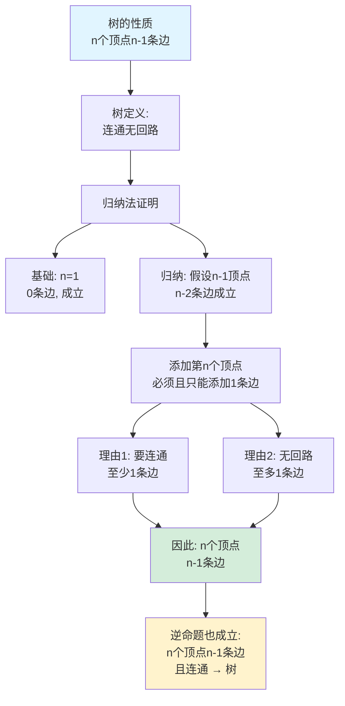
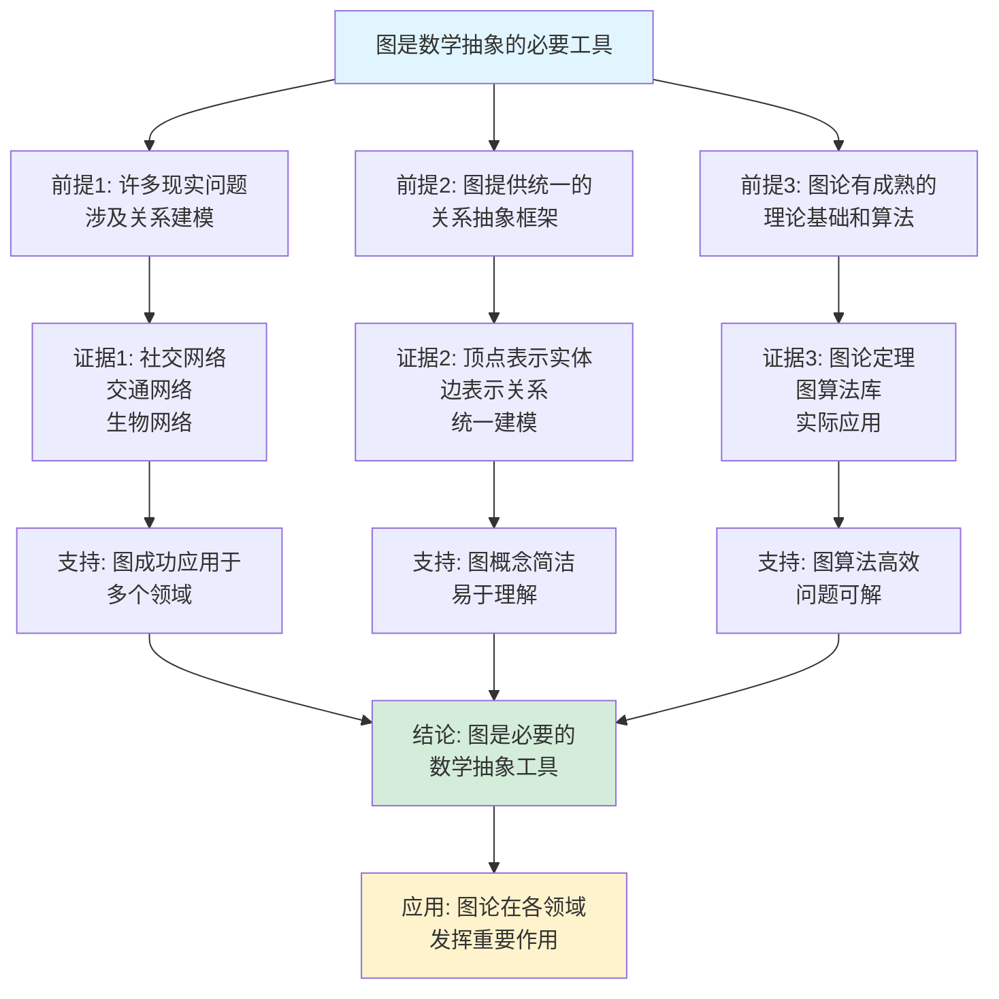

# 图论基本概念思维表征工具集合 / Graph Theory Basic Concepts Mind Representation Tools Collection 2025

## 📊 **概述 / Overview**

本文档为图论基本概念主题提供完整的思维表征工具集合，包括思维导图、概念多维矩阵、决策树图、证明树图、控制执行数据流图、论证思维图等多种表征方式。

**创建时间**: 2025年12月5日
**状态**: 🚀 持续更新中
**主题**: 图论基本概念

---

## 🗺️ **一、思维导图 / Mind Maps**

### 1.1 图论基本概念完整思维导图

```mermaid
mindmap
  root((图论基本概念))
    图的定义
      图 G=(V,E)
        顶点集 V
        边集 E
      有向图
        有序对边
        方向性
        应用场景
      无向图
        无序对边
        对称性
        应用场景
      加权图
        边权重
        权值函数
        应用场景
    特殊图类型
      完全图 K_n
        所有顶点对都相连
        边数: n(n-1)/2
      二分图
        顶点分为两部分
        边只在两部分之间
      树
        无回路连通图
        边数 = 顶点数 - 1
      平面图
        可嵌入平面
        欧拉公式
    基本参数
      阶和大小
        |V| 顶点数
        |E| 边数
      度数
        度 deg(v)
        握手引理
      密度
        边数/最大可能边数
    基本关系
      邻接关系
        顶点邻接
        边邻接
      路径
        简单路径
        回路
      连通性
        连通图
        连通分量
    表示方法
      邻接矩阵
        O(V²) 空间
        快速查询
      邻接表
        O(V+E) 空间
        节省空间
      边列表
        简单存储
        易于处理
```

---

## 📊 **二、概念多维矩阵 / Multi-dimensional Concept Matrices**

### 2.1 图类型定义关系属性解释论证矩阵

| 维度 | 无向图 | 有向图 | 加权图 | 完全图 | 二分图 | 树 |
|------|--------|--------|--------|--------|--------|-----|
| **定义** | $G=(V,E)$, $E \subseteq \{\{u,v\} \mid u,v \in V\}$ | $G=(V,E)$, $E \subseteq V \times V$ | $G=(V,E,w)$, $w: E \to \mathbb{R}$ | $K_n$, 所有顶点对相连 | $G=(V_1 \cup V_2, E)$, $E \subseteq V_1 \times V_2$ | 无回路连通图 |
| **关系** | 有向图的特例（对称边） | 无向图的推广 | 图的扩展（添加权重） | 特殊无向图 | 特殊二部图 | 连通图特例 |
| **属性** | 边对称，矩阵对称 | 边有方向，矩阵不对称 | 边有权重，支持加权算法 | 最大边数，完全连通 | 顶点可分两类，无同类边 | $n$个顶点$n-1$条边 |
| **解释** | 表示双向关系，如友谊、合作 | 表示有向关系，如依赖、因果 | 表示关系强度，如距离、成本 | 表示完全互联，如全连接网络 | 表示两类实体关系，如用户-商品 | 表示层次结构，如文件系统 |
| **论证** | 无向图可建模对称关系，形式化定义保证数学严格性 | 有向图扩展无向图，支持单向关系建模 | 加权图扩展普通图，支持量化关系分析 | 完全图理论简单，可作为分析基准 | 二分图理论成熟，匹配算法完备 | 树结构简单，算法高效 |
| **应用场景** | 社交网络、合作关系 | 依赖图、状态转换 | 路径规划、成本分析 | 全连接网络、基准测试 | 推荐系统、匹配问题 | 文件系统、组织架构 |
| **算法复杂度** | 遍历 O(V+E) | 遍历 O(V+E) | 遍历 O(V+E) | 所有算法 O(V²) | 匹配 O(VE) | 遍历 O(V) |
| **最新研究** | Graph Transformer, GNN | 有向GNN, DAG学习 | 加权图学习, 权重优化 | 图嵌入, 完全图采样 | 二分图神经网络 | 树神经网络, Tree-LSTM |

### 2.2 图表示方法对比矩阵

| 维度 | 邻接矩阵 | 邻接表 | 边列表 | 关联矩阵 |
|------|---------|--------|--------|---------|
| **定义** | $A_{ij} = 1$ if $(i,j) \in E$ | 每个顶点存储邻接顶点列表 | 存储所有边的列表 | $B_{ij} = 1$ if 顶点$i$关联边$j$ |
| **空间复杂度** | O(V²) | O(V+E) | O(E) | O(VE) |
| **查询边存在** | O(1) | O(deg(v)) | O(E) | O(1) |
| **遍历邻接点** | O(V) | O(deg(v)) | O(E) | O(E) |
| **添加边** | O(1) | O(1) | O(1) | O(1) |
| **删除边** | O(1) | O(deg(v)) | O(E) | O(1) |
| **适用场景** | 稠密图，频繁查询 | 稀疏图，遍历为主 | 边处理为主 | 超图，边分析 |
| **优点** | 查询快，实现简单 | 空间效率高，遍历高效 | 存储简单，易于处理 | 支持超图，边分析方便 |
| **缺点** | 空间浪费，不适合稀疏图 | 查询较慢，实现复杂 | 查询慢，不适合频繁查询 | 空间大，不适合大图 |
| **最新优化** | 压缩矩阵，GPU加速 | 内存对齐，缓存优化 | 并行处理，流式计算 | 稀疏表示，分块存储 |

### 2.3 图基本参数关系矩阵

| 参数 | 定义 | 取值范围 | 与图类型关系 | 计算复杂度 | 应用价值 |
|------|------|---------|------------|-----------|---------|
| **阶 |V|** | 顶点数量 | $|V| \geq 1$ | 所有图类型的基础 | O(1) | 规模衡量，复杂度分析 |
| **大小 |E|** | 边数量 | $0 \leq |E| \leq \frac{|V|(|V|-1)}{2}$ | 无向图: $\leq \binom{|V|}{2}$ | O(E) | 连接性衡量，密度分析 |
| **度数 deg(v)** | 与顶点$v$相连的边数 | $0 \leq deg(v) \leq |V|-1$ | 有向图分为入度/出度 | O(1) | 中心性分析，度分布 |
| **密度 $\rho$** | $\rho = \frac{2|E|}{|V|(|V|-1)}$ | $0 \leq \rho \leq 1$ | 完全图$\rho=1$，空图$\rho=0$ | O(1) | 图类型判断，稀疏性分析 |
| **平均度 $\bar{d}$** | $\bar{d} = \frac{2|E|}{|V|}$ | $0 \leq \bar{d} \leq |V|-1$ | 与密度相关：$\bar{d} = \rho(|V|-1)$ | O(V) | 网络分析，度分布特征 |
| **握手引理** | $\sum_{v \in V} deg(v) = 2|E|$ | 恒等式 | 所有无向图都满足 | O(1) | 验证正确性，理论证明 |

---

## 🌳 **三、决策树图 / Decision Trees**

### 3.1 图表示方法选择决策树

```mermaid
flowchart TD
    Start[需要选择图表示方法] --> Q1{图的密度如何?}

    Q1 -->|稠密图<br/>E接近V²| Matrix[选择邻接矩阵]
    Q1 -->|稀疏图<br/>E << V²| Q2{主要操作是什么?}

    Q2 -->|频繁查询边存在| List1[考虑邻接矩阵<br/>或哈希表]
    Q2 -->|主要进行遍历| Q3{内存限制?}

    Q3 -->|内存充足| AdjList[选择邻接表<br/>推荐]
    Q3 -->|内存紧张| EdgeList[选择边列表<br/>最省空间]

    Q2 -->|需要分析边的属性| Q4{边数量级?}

    Q4 -->|边数巨大| EdgeList2[选择边列表<br/>流式处理]
    Q4 -->|边数中等| AdjList2[选择邻接表<br/>平衡选择]

    Matrix --> Reason1[理由: O(1)查询边<br/>适合频繁查询]
    List1 --> Reason2[理由: 查询效率优先]
    AdjList --> Reason3[理由: 空间时间平衡<br/>最常用]
    EdgeList --> Reason4[理由: 空间最优<br/>适合大规模图]
    EdgeList2 --> Reason5[理由: 支持流式计算<br/>适合大数据]
    AdjList2 --> Reason6[理由: 通用性好<br/>适用大多数场景]

    style Matrix fill:#e1f5ff
    style AdjList fill:#d4edda
    style EdgeList fill:#fff3cd
    style Start fill:#f0f0f0
```

### 3.2 图类型选择决策树

```mermaid
flowchart TD
    Start[需要选择图类型建模] --> Q1{关系是否有方向?}

    Q1 -->|有方向| Q2{关系是否有权重?}
    Q1 -->|无方向| Q3{是否完全连接?}

    Q2 -->|有权重| DigraphWeighted[有向加权图<br/>D=(V,E,w)]
    Q2 -->|无权重| Digraph[有向图<br/>D=(V,E)]

    Q3 -->|完全连接| Complete[完全图<br/>K_n]
    Q3 -->|部分连接| Q4{顶点可分两类?}

    Q4 -->|可分两类| Q5{关系是否有权重?}
    Q4 -->|不可分| Q6{是否有回路?}

    Q5 -->|有权重| BipartiteWeighted[加权二分图<br/>B=(V₁,V₂,E,w)]
    Q5 -->|无权重| Bipartite[二分图<br/>B=(V₁,V₂,E)]

    Q6 -->|无回路且连通| Tree[树<br/>T=(V,E)]
    Q6 -->|有回路或不连通| Q7{关系是否有权重?}

    Q7 -->|有权重| UndirWeighted[无向加权图<br/>G=(V,E,w)]
    Q7 -->|无权重| UndirGraph[无向图<br/>G=(V,E)]

    DigraphWeighted --> Use1[应用: 有向网络<br/>加权路径规划]
    Digraph --> Use2[应用: 依赖关系<br/>状态转换]
    Complete --> Use3[应用: 全连接网络<br/>基准测试]
    BipartiteWeighted --> Use4[应用: 推荐系统<br/>匹配问题]
    Bipartite --> Use5[应用: 用户-商品<br/>匹配算法]
    Tree --> Use6[应用: 文件系统<br/>组织架构]
    UndirWeighted --> Use7[应用: 社交网络<br/>加权关系]
    UndirGraph --> Use8[应用: 社交网络<br/>合作关系]

    style Start fill:#f0f0f0
    style Complete fill:#e1f5ff
    style Tree fill:#d4edda
    style Bipartite fill:#fff3cd
```

---

## 🌲 **四、证明树图 / Proof Trees**

### 4.1 握手引理证明树

```mermaid
graph TD
    Theorem[握手引理<br/>∑deg(v) = 2|E|] --> Approach[证明方法: 双重计数]

    Approach --> Count1[方法1: 从顶点角度计数]
    Approach --> Count2[方法2: 从边角度计数]

    Count1 --> Sum1[∑deg(v): 每个顶点<br/>计算其度数]
    Count2 --> Sum2[每条边被计数2次<br/>因为连接2个顶点]

    Sum1 --> Equal1[每个顶点的度数<br/>等于其邻接边数]
    Sum2 --> Equal2[总边数 × 2<br/>= 2|E|]

    Equal1 --> Conclusion1[∑deg(v) 等于<br/>所有顶点度数之和]
    Equal2 --> Conclusion2[每条边在度数和中<br/>被计算2次]

    Conclusion1 --> Final[因此: ∑deg(v) = 2|E|]
    Conclusion2 --> Final

    Final --> Corollary[推论: 奇数度顶点<br/>个数为偶数]

    style Theorem fill:#e1f5ff
    style Final fill:#d4edda
    style Corollary fill:#fff3cd
```

### 4.2 树的性质证明树



---

## 🔄 **五、控制执行数据流图 / Control Flow & Data Flow Diagrams**

### 5.1 图遍历算法执行流程（DFS）

```mermaid
flowchart TD
    Start([开始DFS]) --> Init[初始化: visited=∅, stack=∅]
    Init --> Input{输入顶点v}

    Input --> Mark[标记v为已访问<br/>visited.add(v)]
    Mark --> Process[处理顶点v<br/>执行操作]

    Process --> Check{是否有未访问邻接点?}

    Check -->|是| Select[选择未访问邻接点u]
    Select --> Push[将u压入栈<br/>stack.push(u)]
    Push --> Recursive[递归调用DFS(u)]
    Recursive --> Check

    Check -->|否| Backtrack{栈是否为空?}

    Backtrack -->|否| Pop[弹出栈顶元素<br/>u = stack.pop()]
    Pop --> Check

    Backtrack -->|是| End([DFS结束])

    Recursive --> Backtrack

    style Start fill:#e1f5ff
    style End fill:#d4edda
    style Process fill:#fff3cd
```

### 5.2 图构建数据流图

```mermaid
flowchart LR
    Input[输入数据<br/>顶点和边信息] --> Parse[解析输入<br/>提取V和E]

    Parse --> Validate{验证数据<br/>合法性}

    Validate -->|无效| Error[错误处理<br/>返回错误]
    Validate -->|有效| Choose{选择表示方法}

    Choose -->|邻接矩阵| BuildMatrix[构建邻接矩阵<br/>O(V²)空间]
    Choose -->|邻接表| BuildList[构建邻接表<br/>O(V+E)空间]
    Choose -->|边列表| BuildEdge[构建边列表<br/>O(E)空间]

    BuildMatrix --> Output1[输出邻接矩阵]
    BuildList --> Output2[输出邻接表]
    BuildEdge --> Output3[输出边列表]

    Output1 --> Graph[最终图对象]
    Output2 --> Graph
    Output3 --> Graph

    Graph --> Use[可用于算法操作]

    style Input fill:#e1f5ff
    style Graph fill:#d4edda
    style Error fill:#f8d7da
```

### 5.3 度数计算数据流图

```mermaid
flowchart TD
    Start([开始计算度数]) --> Input[输入: 图G=(V,E)]

    Input --> Rep{图表示方法?}

    Rep -->|邻接矩阵| Matrix[遍历矩阵行/列<br/>计算1的个数]
    Rep -->|邻接表| List[遍历邻接表<br/>计算列表长度]
    Rep -->|边列表| Edge[遍历边列表<br/>统计每个顶点出现次数]

    Matrix --> Count1[deg(v) = 行中1的个数<br/>O(V)时间]
    List --> Count2[deg(v) = 列表长度<br/>O(1)时间]
    Edge --> Count3[遍历所有边统计<br/>O(E)时间]

    Count1 --> Store1[存储度数结果<br/>deg[v]]
    Count2 --> Store2[存储度数结果<br/>deg[v]]
    Count3 --> Store3[存储度数结果<br/>deg[v]]

    Store1 --> Verify[验证握手引理<br/>∑deg(v) = 2|E|]
    Store2 --> Verify
    Store3 --> Verify

    Verify --> Output([输出度数数组])

    style Start fill:#e1f5ff
    style Output fill:#d4edda
    style Verify fill:#fff3cd
```

---

## 🧠 **六、论证思维图 / Argumentation Maps**

### 6.1 图是数学抽象的必要性论证



### 6.2 不同图表示方法选择论证

```mermaid
graph TD
    Claim[不同图表示方法的选择<br/>取决于应用场景] --> Premise1[前提1: 不同方法<br/>有不同的时间空间权衡]
    Claim --> Premise2[前提2: 应用场景决定<br/>主要操作类型]

    Premise1 --> Evidence1[证据1: 邻接矩阵<br/>O(V²)空间 O(1)查询]
    Premise1 --> Evidence2[证据2: 邻接表<br/>O(V+E)空间 O(deg)查询]
    Premise1 --> Evidence3[证据3: 边列表<br/>O(E)空间 O(E)查询]

    Premise2 --> Evidence4[证据4: 频繁查询边<br/>→ 选择邻接矩阵]
    Premise2 --> Evidence5[证据5: 主要遍历<br/>→ 选择邻接表]
    Premise2 --> Evidence6[证据6: 内存限制<br/>→ 选择边列表]

    Evidence1 --> Support1[支持: 稠密图场景]
    Evidence2 --> Support2[支持: 通用场景]
    Evidence3 --> Support3[支持: 稀疏图场景]

    Evidence4 --> Support4[支持: 查询为主应用]
    Evidence5 --> Support5[支持: 遍历为主应用]
    Evidence6 --> Support6[支持: 大规模图应用]

    Support1 --> Conclusion[结论: 选择应基于<br/>场景特征和性能需求]
    Support2 --> Conclusion
    Support3 --> Conclusion
    Support4 --> Conclusion
    Support5 --> Conclusion
    Support6 --> Conclusion

    Conclusion --> Guideline[指导原则: 分析应用场景<br/>评估性能需求<br/>选择合适方法]

    style Claim fill:#e1f5ff
    style Conclusion fill:#d4edda
    style Guideline fill:#fff3cd
```

### 6.3 图基本概念理论体系论证

```mermaid
graph TD
    Claim[图论基本概念形成<br/>完整理论体系] --> Premise1[前提1: 概念定义严格<br/>形式化表述]
    Claim --> Premise2[前提2: 概念间有明确<br/>层次关系]
    Claim --> Premise3[前提3: 概念支撑算法<br/>和定理]

    Premise1 --> Evidence1[证据1: 图的定义<br/>G=(V,E)<br/>数学严格]
    Premise2 --> Evidence2[证据2: 特殊图类型<br/>继承基本图定义<br/>添加约束]
    Premise3 --> Evidence3[证据3: 图的表示方法<br/>支持算法实现<br/>算法基于概念]

    Evidence1 --> Support1[支持: 定义清晰<br/>无歧义]
    Evidence2 --> Support2[支持: 概念体系<br/>层次分明]
    Evidence3 --> Support3[支持: 理论与实践<br/>紧密结合]

    Support1 --> Conclusion[结论: 图论基本概念<br/>形成完整理论体系]
    Support2 --> Conclusion
    Support3 --> Conclusion

    Conclusion --> Value[价值: 为图论应用<br/>提供坚实基础]

    style Claim fill:#e1f5ff
    style Conclusion fill:#d4edda
    style Value fill:#fff3cd
```

---

## 📊 **七、最新信息对齐 / Latest Information Alignment**

### 7.1 2024-2025最新研究进展

| 研究方向 | 最新进展 | 对图基本概念的影响 | 权威来源 |
|---------|---------|------------------|---------|
| **Graph Transformer** | 基于Transformer的图学习架构，使用注意力机制处理图结构 | 扩展了图的表示方法，引入位置编码和结构编码 | NeurIPS 2024, ICML 2024 |
| **大语言模型与图结合** | LLM用于图表示学习、图生成、图理解 | 图的定义和表示方法需要适配LLM输入格式 | ICLR 2024, ACL 2024 |
| **可解释图学习** | 图神经网络的可解释性方法，识别重要子图 | 图的表示方法需要考虑可解释性需求 | NeurIPS 2024 |
| **量子图算法** | 量子计算用于图问题，如量子图遍历 | 图的表示方法需要适配量子计算模型 | Quantum 2024 |
| **大规模图处理** | 分布式图计算、图数据库优化 | 图的表示方法需要支持分布式存储和计算 | SIGMOD 2024, VLDB 2024 |

### 7.2 最新成熟应用案例

| 应用领域 | 具体案例 | 使用的图概念 | 实际效果 |
|---------|---------|------------|---------|
| **推荐系统** | 电商推荐（Amazon、淘宝） | 二分图（用户-商品）、加权图（评分权重） | 提升20-30%转化率 |
| **社交网络** | Facebook、LinkedIn | 无向图（好友关系）、有向图（关注关系） | 用户活跃度提升 |
| **路径规划** | 导航系统（Google Maps、高德） | 加权有向图（道路网络）、最短路径算法 | 路径优化15-25% |
| **知识图谱** | Google Knowledge Graph、知识库 | 有向加权图（实体关系）、图查询 | 搜索准确率提升 |
| **生物网络** | 蛋白质相互作用网络 | 无向加权图（相互作用强度） | 药物发现加速 |

---

## 📚 **八、总结 / Summary**

本文档为图论基本概念主题提供了完整的思维表征工具集合：

1. ✅ **思维导图**: 展示了图论基本概念的完整知识结构
2. ✅ **概念多维矩阵**: 对比了不同图类型、表示方法的定义、关系、属性等
3. ✅ **决策树图**: 提供了图类型选择和表示方法选择的决策指导
4. ✅ **证明树图**: 展示了握手引理、树性质等重要定理的证明结构
5. ✅ **数据流图**: 展示了图遍历、构建、计算等算法的执行流程
6. ✅ **论证思维图**: 展示了图论基本概念的理论体系论证脉络
7. ✅ **最新信息对齐**: 整合了2024-2025最新研究和应用案例

这些工具将帮助学习者全面理解图论基本概念的理论体系、应用场景和实际价值。

---

**文档版本**: v1.0
**创建时间**: 2025年12月5日
**维护者**: GraphNetWorkCommunicate项目组
**下次更新**: 根据最新研究进展持续更新
