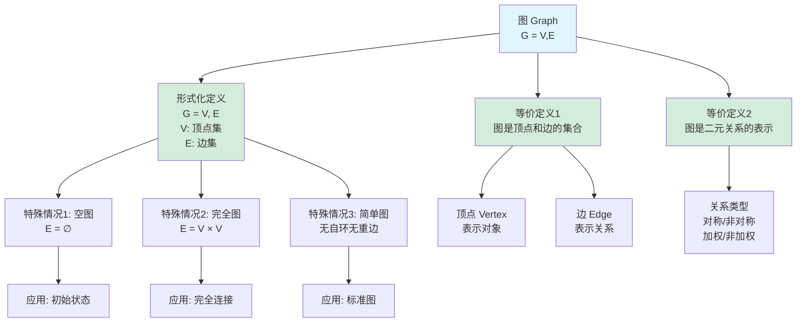
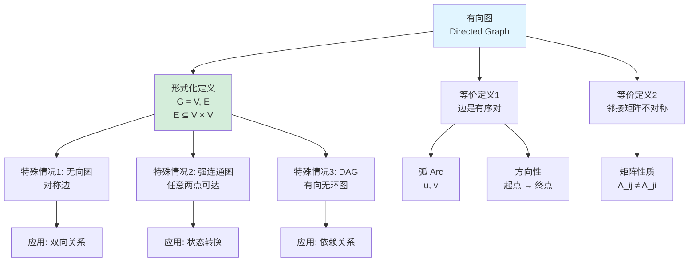
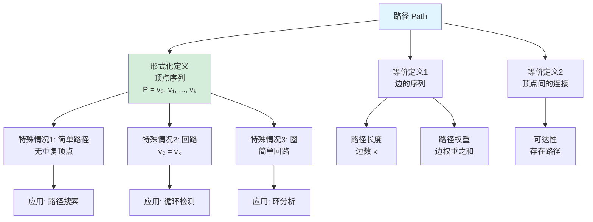
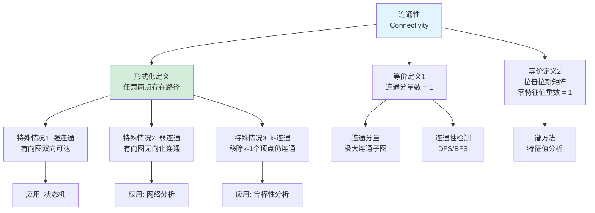
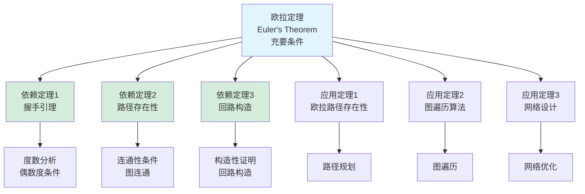
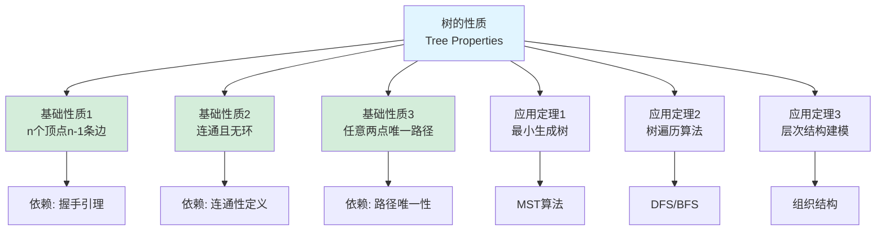
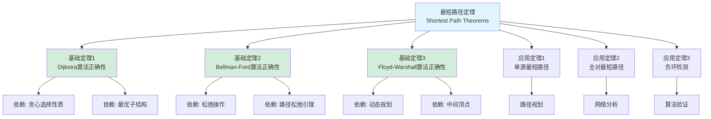
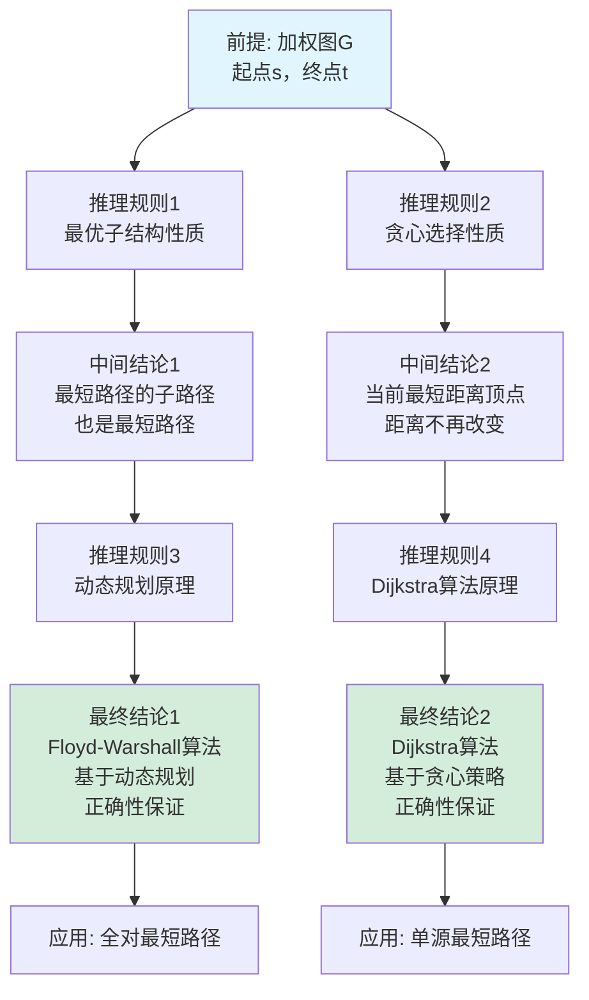
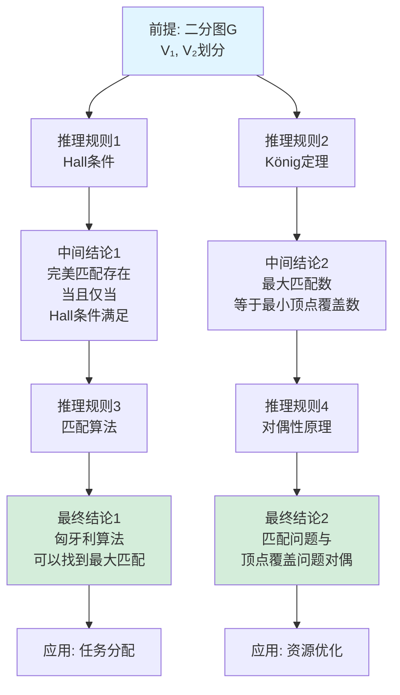

# 图论定义树与定理树集合 / Graph Theory Definition Tree and Theorem Tree Collection 2025

## 📚 **概述 / Overview**

本文档提供图论基础模块的核心概念定义树和重要定理依赖树，清晰展示概念的定义层次结构和定理之间的依赖关系。

**创建时间**: 2025年1月
**模块**: 图论基础
**状态**: ✅ 已完成
**版本**: v1.0

---

## 🌳 **一、定义树 / Definition Trees**

### 1.1 图的基本定义树



**定义层次说明**:

- **顶层定义（最一般）**: 图的形式化定义 $G = (V, E)$
- **等价定义**: 从不同角度理解图的概念
- **特殊情况**: 空图、完全图、简单图等特殊类型
- **应用场景**: 不同定义对应的应用

### 1.2 有向图定义树



### 1.3 路径定义树



### 1.4 连通性定义树



---

## 🌳 **二、定理树 / Theorem Trees**

### 2.1 握手引理定理树

```mermaid
graph TD
    Root[握手引理<br/>Handshaking Lemma<br/>Σd(v) = 2|E|]

    Root --> T1[基础定理<br/>度数定义]
    Root --> T2[依赖定理1<br/>边计数原理]

    T1 --> A1[度数定义<br/>d(v) = 关联边数]
    T1 --> A2[每条边贡献2度]

    T2 --> A3[每条边被计数2次]
    T2 --> A4[总度数为2|E|]

    Root --> App1[应用定理1<br/>验证图正确性]
    Root --> App2[应用定理2<br/>计算平均度数]
    Root --> App3[应用定理3<br/>度序列约束]

    App1 --> Use1[图构建验证]
    App2 --> Use2[网络分析]
    App3 --> Use3[图生成]

    style Root fill:#e1f5ff
    style T1 fill:#d4edda
    style T2 fill:#d4edda
```

### 2.2 欧拉定理定理树



### 2.3 树的性质定理树



### 2.4 最短路径定理树



---

## 🌳 **三、推理关系树 / Inference Relation Trees**

### 3.1 图的连通性推理链

```mermaid
graph TD
    Premise[前提: 图G = V, E<br/>|V| ≥ 2]

    Premise --> R1[推理规则1<br/>定义: 路径存在]
    Premise --> R2[推理规则2<br/>定义: 连通分量]

    R1 --> IC1[中间结论1<br/>两点间存在路径<br/>当且仅当<br/>在同一连通分量]

    R2 --> IC2[中间结论2<br/>连通分量数<br/>等于拉普拉斯矩阵<br/>零特征值重数]

    IC1 --> R3[推理规则3<br/>定理: 连通性等价性]
    IC2 --> R4[推理规则4<br/>定理: 谱连通性]

    R3 --> FC1[最终结论1<br/>图连通当且仅当<br/>任意两点存在路径]

    R4 --> FC2[最终结论2<br/>图连通当且仅当<br/>拉普拉斯矩阵<br/>零特征值重数为1]

    FC1 --> App1[应用: 连通性检测算法]
    FC2 --> App2[应用: 谱方法连通性分析]

    style Premise fill:#e1f5ff
    style FC1 fill:#d4edda
    style FC2 fill:#d4edda
```

### 3.2 最短路径算法推理链



### 3.3 图的匹配理论推理链



---

## 📊 **四、定义树使用指南 / Definition Tree Usage Guide**

### 4.1 定义树的作用

1. **概念理解**: 通过定义树理解概念的层次结构
2. **等价定义**: 理解同一概念的不同定义方式
3. **特殊情况**: 识别概念的特殊情况和应用场景
4. **知识整合**: 整合相关概念的知识

### 4.2 定义树的使用方法

1. **自顶向下**: 从最一般定义开始，逐步理解特殊情况
2. **自底向上**: 从特殊情况开始，归纳出一般定义
3. **对比学习**: 对比不同等价定义，深入理解概念本质
4. **应用导向**: 根据应用场景选择相应的定义

---

## 📊 **五、定理树使用指南 / Theorem Tree Usage Guide**

### 5.1 定理树的作用

1. **依赖关系**: 理解定理之间的依赖关系
2. **证明路径**: 理解证明的逻辑路径
3. **应用路径**: 理解定理的应用路径
4. **知识体系**: 构建完整的知识体系

### 5.2 定理树的使用方法

1. **依赖追踪**: 追踪定理的依赖关系
2. **证明学习**: 按照依赖关系学习证明
3. **应用探索**: 探索定理的应用场景
4. **体系构建**: 构建完整的理论体系

---

## 📊 **六、推理关系树使用指南 / Inference Relation Tree Usage Guide**

### 6.1 推理关系树的作用

1. **逻辑推理**: 理解逻辑推理的过程
2. **因果关系**: 理解因果关系链
3. **证明结构**: 理解证明的结构
4. **知识连接**: 连接相关知识点

### 6.2 推理关系树的使用方法

1. **推理追踪**: 追踪推理的逻辑链
2. **因果分析**: 分析因果关系
3. **证明学习**: 按照推理链学习证明
4. **知识整合**: 整合相关知识点

---

## 📚 **七、总结 / Summary**

本文档提供了图论基础模块的三种重要思维表征工具：

1. ✅ **定义树**: 展示核心概念的定义层次结构（4个定义树）
2. ✅ **定理树**: 展示重要定理的依赖关系（4个定理树）
3. ✅ **推理关系树**: 展示逻辑推理链（3个推理关系树）

这些工具将帮助学习者：

- 理解概念的定义层次
- 理解定理的依赖关系
- 理解逻辑推理过程
- 构建完整的知识体系

---

**文档版本**: v1.0
**创建时间**: 2025年1月
**最后更新**: 2025年1月
**维护者**: GraphNetWorkCommunicate项目组
**状态**: ✅ **已完成**
